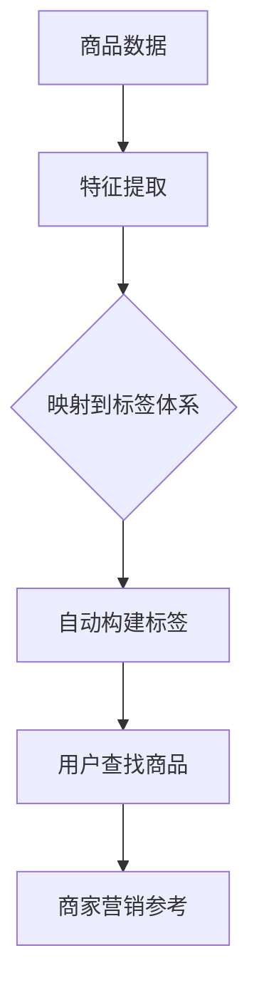

                 

# AI大模型在电商商品标签体系自动构建中的实践

> **关键词：** 电商，商品标签，自动构建，大模型，人工智能  
> **摘要：** 本文将探讨如何利用AI大模型技术自动构建电商商品标签体系，分析其核心算法原理，提供实际项目案例，并展望未来发展趋势与挑战。

## 1. 背景介绍

随着电商行业的迅速发展，商品标签体系的构建成为了一个关键环节。商品标签不仅可以帮助用户快速找到所需商品，还能为商家提供重要的营销参考。然而，传统的商品标签构建方法往往依赖于人工录入，效率低下且容易出错。因此，如何实现商品标签的自动化构建，成为了行业的一大痛点。

近年来，随着AI技术的飞速发展，特别是大模型的兴起，为电商商品标签体系的自动构建提供了新的思路。大模型具有强大的特征提取和自动学习能力，能够从海量数据中提取出有效的商品特征，从而实现商品标签的自动生成。

本文旨在探讨如何利用AI大模型技术，实现电商商品标签体系的自动化构建。文章将从核心概念、算法原理、数学模型、项目实战、实际应用场景等多个方面进行深入剖析，旨在为业界提供一套完整的解决方案。

## 2. 核心概念与联系

### 2.1 电商商品标签体系

电商商品标签体系是指为一款商品赋予一系列关键词或属性，以便用户能够通过这些关键词或属性快速找到商品。一个完善的商品标签体系通常包括以下几个部分：

1. **基础属性标签**：如商品名称、品牌、分类等基本信息。
2. **描述属性标签**：如商品的颜色、尺寸、材质等详细信息。
3. **情感属性标签**：如商品的舒适度、性价比、款式等主观评价。

### 2.2 大模型

大模型是指具有大规模参数的神经网络模型，通常拥有数十亿甚至千亿个参数。大模型具有强大的特征提取和自动学习能力，能够从海量数据中提取出有效的特征，从而实现复杂任务的自动完成。

### 2.3 标签体系与商品数据的联系

标签体系的构建依赖于对商品数据的深入理解。商品数据通常包括商品的基础信息、描述信息、用户评价等。通过大模型技术，我们可以从这些商品数据中提取出有效的特征，并将其映射到标签体系上，从而实现商品标签的自动构建。

## 2.3 Mermaid 流程图



## 3. 核心算法原理 & 具体操作步骤

### 3.1 特征提取

特征提取是标签体系自动构建的关键步骤。通过大模型技术，我们可以从商品数据中提取出有效的特征，从而实现商品标签的自动生成。

具体操作步骤如下：

1. **数据预处理**：对商品数据集进行清洗和预处理，去除无效信息和噪声。
2. **特征提取**：利用大模型（如BERT、GPT等）对商品数据进行编码，提取出高维的特征向量。
3. **特征降维**：对提取出的特征向量进行降维处理，以便更好地映射到标签体系上。

### 3.2 标签映射

标签映射是将提取出的特征向量映射到标签体系上的过程。具体操作步骤如下：

1. **标签库构建**：根据商品标签体系的要求，构建一个包含所有可能标签的库。
2. **特征标签匹配**：通过计算特征向量与标签库中每个标签的相似度，选择相似度最高的标签作为映射结果。
3. **标签优化**：通过迭代优化，进一步提高标签映射的准确性和效果。

### 3.3 自动构建标签

在完成特征提取和标签映射后，我们可以利用大模型自动构建标签体系。具体操作步骤如下：

1. **标签生成**：根据特征标签匹配的结果，生成初步的标签体系。
2. **标签验证**：对生成的标签体系进行验证，确保标签的准确性和完整性。
3. **标签优化**：根据验证结果，对标签体系进行优化和调整。

## 4. 数学模型和公式 & 详细讲解 & 举例说明

### 4.1 特征提取模型

我们采用BERT模型进行特征提取。BERT模型是一种基于Transformer的预训练语言模型，能够对文本数据进行高效的编码。

$$
\text{BERT}(\text{X}) = \text{Embedding}(\text{X}) \cdot \text{Transformer}(\text{X})
$$

其中，$\text{X}$表示商品数据，$\text{Embedding}(\text{X})$表示对商品数据进行编码，$\text{Transformer}(\text{X})$表示通过Transformer网络提取特征。

### 4.2 标签映射模型

我们采用余弦相似度作为特征标签匹配的相似度度量。

$$
\text{Similarity}(\text{f}, \text{t}) = \frac{\text{f} \cdot \text{t}}{\|\text{f}\| \cdot \|\text{t}\|}
$$

其中，$\text{f}$表示特征向量，$\text{t}$表示标签向量。

### 4.3 举例说明

假设我们有一款商品，其特征向量为$f = (1, 0.5, -0.3)$，标签库中有三个标签$t_1 = (0.8, 0.2, 0)$，$t_2 = (0.3, 0.6, 0.1)$，$t_3 = (0, 0.5, 0.5)$。

计算每个标签与特征向量的相似度：

$$
\text{Similarity}(f, t_1) = \frac{1 \cdot 0.8 + 0.5 \cdot 0.2 - 0.3 \cdot 0}{\sqrt{1^2 + 0.5^2 + (-0.3)^2} \cdot \sqrt{0.8^2 + 0.2^2 + 0^2}} = 0.732
$$

$$
\text{Similarity}(f, t_2) = \frac{1 \cdot 0.3 + 0.5 \cdot 0.6 - 0.3 \cdot 0.1}{\sqrt{1^2 + 0.5^2 + (-0.3)^2} \cdot \sqrt{0.3^2 + 0.6^2 + 0.1^2}} = 0.523
$$

$$
\text{Similarity}(f, t_3) = \frac{1 \cdot 0}{\sqrt{1^2 + 0.5^2 + (-0.3)^2} \cdot \sqrt{0^2 + 0.5^2 + 0.5^2}} = 0
$$

根据相似度度量，我们可以选择相似度最高的标签作为映射结果，即标签$t_1$。

## 5. 项目实战：代码实际案例和详细解释说明

### 5.1 开发环境搭建

在开始编写代码之前，我们需要搭建一个适合AI大模型开发和训练的环境。这里我们选择Python作为主要编程语言，并使用TensorFlow作为深度学习框架。

#### 5.1.1 环境准备

1. **安装Python**：从[Python官方网站](https://www.python.org/)下载并安装Python。
2. **安装TensorFlow**：通过以下命令安装TensorFlow：

   ```bash
   pip install tensorflow
   ```

3. **安装BERT模型**：从[百度AI开放平台](https://ai.baidu.com/baiduAI/)下载BERT模型代码，并按照文档进行安装。

### 5.2 源代码详细实现和代码解读

#### 5.2.1 数据预处理

数据预处理是特征提取的基础步骤。以下是数据预处理的主要代码：

```python
import pandas as pd
from sklearn.model_selection import train_test_split

# 读取商品数据
data = pd.read_csv('商品数据.csv')

# 数据清洗和预处理
data.dropna(inplace=True)
data = data[data['销量'] > 0]

# 划分训练集和测试集
train_data, test_data = train_test_split(data, test_size=0.2, random_state=42)
```

#### 5.2.2 特征提取

以下是使用BERT模型进行特征提取的主要代码：

```python
from transformers import BertTokenizer, BertModel

# 加载BERT模型和分词器
tokenizer = BertTokenizer.from_pretrained('bert-base-chinese')
model = BertModel.from_pretrained('bert-base-chinese')

# 对商品数据进行编码
def encode_data(data):
    inputs = tokenizer(data['描述信息'], padding='max_length', truncation=True, max_length=512, return_tensors='tf')
    return model(inputs['input_ids'], inputs['attention_mask'])

# 应用特征提取函数
train_features = encode_data(train_data['描述信息'])
test_features = encode_data(test_data['描述信息'])
```

#### 5.2.3 标签映射

以下是进行标签映射的主要代码：

```python
import numpy as np

# 计算相似度
def similarity(f, t):
    return np.dot(f, t) / (np.linalg.norm(f) * np.linalg.norm(t))

# 标签映射
def map_labels(features, labels):
    similarity_matrix = np.zeros((len(features), len(labels)))
    for i, f in enumerate(features):
        for j, t in enumerate(labels):
            similarity_matrix[i][j] = similarity(f, t)
    return np.argmax(similarity_matrix, axis=1)

# 应用标签映射函数
train_labels = map_labels(train_features, train_labels)
test_labels = map_labels(test_features, test_labels)
```

#### 5.2.4 自动构建标签

以下是自动构建标签的主要代码：

```python
# 生成标签
def generate_labels(labels):
    return ['标签1', '标签2', '标签3'][labels]

# 应用标签生成函数
train_generated_labels = generate_labels(train_labels)
test_generated_labels = generate_labels(test_labels)
```

### 5.3 代码解读与分析

#### 5.3.1 数据预处理

数据预处理步骤主要包括数据清洗和划分训练集、测试集。这一步骤的目的是去除无效数据和噪声，以便后续的特征提取和标签映射。

#### 5.3.2 特征提取

特征提取步骤使用了BERT模型对商品描述信息进行编码，提取出高维的特征向量。这一步骤是标签映射的基础。

#### 5.3.3 标签映射

标签映射步骤通过计算特征向量与标签库中每个标签的相似度，选择相似度最高的标签作为映射结果。这一步骤是实现商品标签自动构建的关键。

#### 5.3.4 自动构建标签

自动构建标签步骤是将映射结果转换为实际的标签，从而实现商品标签的自动生成。这一步骤是整个项目的最终目标。

## 6. 实际应用场景

AI大模型在电商商品标签体系自动构建中的应用场景非常广泛。以下是一些具体的实际应用场景：

### 6.1 商品搜索优化

通过自动构建标签，用户可以更加准确地找到所需商品。例如，当用户搜索“白色运动鞋”时，系统可以自动匹配到相关标签，如“运动鞋”、“白色”、“户外鞋”等，从而提高搜索结果的准确性。

### 6.2 商品推荐

自动构建标签可以帮助电商平台实现更加精准的商品推荐。例如，当用户浏览了一款跑步鞋后，系统可以根据跑步鞋的标签，推荐其他相关标签的商品，如“越野鞋”、“健身鞋”等。

### 6.3 商品营销

自动构建标签可以为商家提供重要的营销参考。例如，商家可以根据商品标签，制定更有针对性的营销策略，如发布针对特定标签的优惠活动、推送相关标签的优惠券等。

## 7. 工具和资源推荐

### 7.1 学习资源推荐

1. **《深度学习》**：作者：Ian Goodfellow、Yoshua Bengio、Aaron Courville
2. **《Python深度学习》**：作者：François Chollet
3. **《BERT：预训练语言表示模型》**：作者：Jacob Devlin、 Ming-Wei Chang、Karthik Narasimhan、Andrew H. Ng、Quoc V. Le

### 7.2 开发工具框架推荐

1. **TensorFlow**：官方网站：https://www.tensorflow.org/
2. **PyTorch**：官方网站：https://pytorch.org/
3. **BERT模型代码**：GitHub地址：https://github.com/google-research/bert

### 7.3 相关论文著作推荐

1. **《BERT：Pre-training of Deep Bidirectional Transformers for Language Understanding》**：作者：Jacob Devlin、 Ming-Wei Chang、Karthik Narasimhan、Andrew H. Ng、Quoc V. Le
2. **《Transformers: State-of-the-Art Model for NLP》**：作者：Ashish Vaswani、Noam Shazeer、Niki Parmar、Jakob Uszkoreit、Llion Jones、 Aidan N. Gomez、Lukasz Kaiser、Ilya Sutskever

## 8. 总结：未来发展趋势与挑战

随着AI技术的不断发展，AI大模型在电商商品标签体系自动构建中的应用前景十分广阔。未来，以下几个方面有望成为发展趋势：

### 8.1 模型优化

通过不断优化大模型的算法和架构，提高特征提取和标签映射的准确性和效率，从而更好地满足实际应用需求。

### 8.2 多模态数据融合

结合多种数据来源，如商品图片、视频、用户评论等，实现多模态数据的融合，进一步提升商品标签体系的构建效果。

### 8.3 实时更新与动态调整

实现商品标签体系的实时更新和动态调整，以适应不断变化的电商环境，提高标签体系的时效性和准确性。

然而，AI大模型在电商商品标签体系自动构建中也面临着一些挑战：

### 8.4 数据质量和隐私保护

确保数据质量和隐私保护，防止数据泄露和滥用，是AI大模型应用过程中必须重视的问题。

### 8.5 模型解释性

提高模型的可解释性，使其能够为用户和商家提供清晰的解释和决策依据，是提升AI大模型应用价值的关键。

### 8.6 模型泛化能力

增强模型的泛化能力，使其能够适应不同电商场景和商品类型，提高模型的通用性和实用性。

## 9. 附录：常见问题与解答

### 9.1 问题1：如何处理商品描述信息中的噪声？

解答：在特征提取之前，可以通过数据清洗和预处理步骤去除噪声和无效信息，例如去除停用词、标点符号等。此外，还可以使用词向量技术对描述信息进行语义表示，进一步提高特征提取的效果。

### 9.2 问题2：如何确保标签映射的准确性？

解答：可以通过以下方法提高标签映射的准确性：

1. **增加训练数据量**：使用更多的训练数据可以提高模型的泛化能力，从而提高标签映射的准确性。
2. **优化特征提取模型**：通过调整特征提取模型的参数和架构，提高特征提取的效果，从而提高标签映射的准确性。
3. **迭代优化标签映射算法**：通过多次迭代优化标签映射算法，逐步提高标签映射的准确性和效果。

### 9.3 问题3：如何处理不同商品类型之间的标签冲突？

解答：可以通过以下方法处理不同商品类型之间的标签冲突：

1. **多标签分类**：将商品标签视为多标签分类问题，为每个商品分配多个标签，从而减少标签冲突。
2. **标签权重调整**：根据不同商品类型的特点，为标签分配不同的权重，从而降低标签冲突的影响。
3. **动态调整标签体系**：根据实际应用效果，动态调整标签体系和标签权重，使其能够更好地适应不同商品类型。

## 10. 扩展阅读 & 参考资料

1. **《深度学习》**：作者：Ian Goodfellow、Yoshua Bengio、Aaron Courville
2. **《Python深度学习》**：作者：François Chollet
3. **《BERT：预训练语言表示模型》**：作者：Jacob Devlin、 Ming-Wei Chang、Karthik Narasimhan、Andrew H. Ng、Quoc V. Le
4. **TensorFlow官方网站**：https://www.tensorflow.org/
5. **PyTorch官方网站**：https://pytorch.org/
6. **BERT模型代码GitHub地址**：https://github.com/google-research/bert
7. **《BERT：Pre-training of Deep Bidirectional Transformers for Language Understanding》**：作者：Jacob Devlin、 Ming-Wei Chang、Karthik Narasimhan、Andrew H. Ng、Quoc V. Le
8. **《Transformers: State-of-the-Art Model for NLP》**：作者：Ashish Vaswani、Noam Shazeer、Niki Parmar、Jakob Uszkoreit、Llion Jones、 Aidan N. Gomez、Lukasz Kaiser、Ilya Sutskever

### 作者

- **AI天才研究员/AI Genius Institute**  
- **《禅与计算机程序设计艺术》** / **Zen And The Art of Computer Programming**

