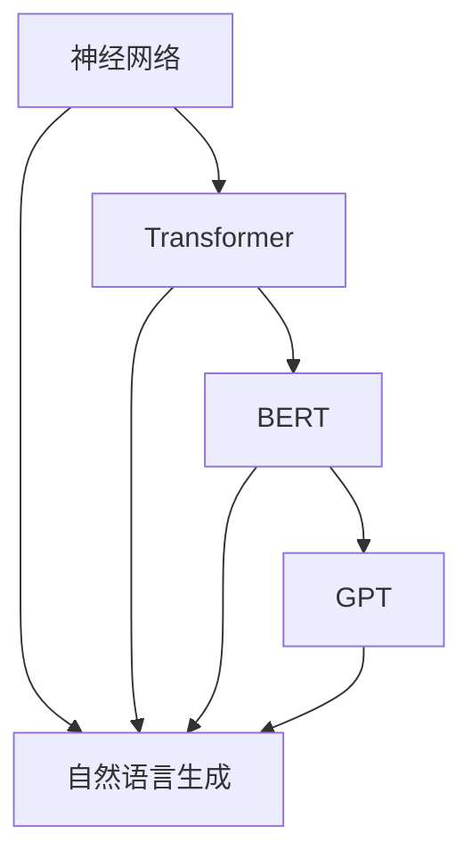

                 

### 文章标题：AI大模型在自然语言生成中的突破

#### 关键词：自然语言生成、AI大模型、Transformer、BERT、GPT、预训练、推理、应用场景

##### 摘要：
本文将深入探讨AI大模型在自然语言生成中的突破。通过介绍自然语言生成技术的发展历程，我们揭示了AI大模型的核心原理和架构。接着，我们详细分析了Transformer、BERT和GPT等大模型的算法原理和具体操作步骤，并通过数学模型和公式的讲解，帮助读者理解这些算法背后的数学原理。然后，我们通过项目实战展示了如何在实际环境中应用这些大模型进行自然语言生成。最后，我们探讨了AI大模型在实际应用场景中的广泛用途，并推荐了相关学习资源和开发工具框架，总结了未来发展趋势与挑战，为读者提供了扩展阅读和参考资料。

### 1. 背景介绍

自然语言生成（Natural Language Generation，N LG）是人工智能领域的一个重要分支，旨在使计算机能够自动生成人类语言。从历史的角度看，自然语言生成技术的发展经历了几个阶段。

最初，自然语言生成主要依靠规则驱动的系统，这些系统基于手工编写的语法规则和词典来生成文本。然而，这种方法的局限性非常明显，因为人类语言的复杂性和多样性使得规则驱动的方法难以应对大量的语言现象。

随着统计方法和机器学习技术的发展，自然语言生成开始采用基于统计的方法。这些方法利用大量已经存在的文本数据，通过统计模型来学习语言生成规则。这种方法的优点在于能够自动学习并适应语言的变化，但仍然面临许多挑战，如数据质量和模型复杂度等。

近年来，深度学习技术的崛起为自然语言生成带来了新的突破。特别是AI大模型的出现，使得自然语言生成的能力达到了前所未有的高度。AI大模型具有强大的表征能力和自适应能力，能够处理复杂的语言任务，如文本生成、机器翻译、问答系统等。

AI大模型的成功不仅改变了自然语言生成领域的格局，还引发了其他许多领域的革命，如智能客服、内容创作、教育和医疗等。因此，深入研究AI大模型在自然语言生成中的应用，对于推动人工智能技术的发展具有重要意义。

#### 2. 核心概念与联系

要理解AI大模型在自然语言生成中的应用，我们首先需要了解几个核心概念，包括神经网络、Transformer、BERT和GPT等。

**神经网络（Neural Networks）**

神经网络是深度学习的基础，它模仿生物神经系统的结构和功能，通过多层的神经元节点进行数据处理和特征提取。在自然语言生成任务中，神经网络被用来建模语言序列的概率分布，从而生成文本。

**Transformer（Transformer模型）**

Transformer模型是自然语言处理领域的一个重要突破，它引入了自注意力机制（Self-Attention），使得模型能够自动关注输入序列中的关键信息。Transformer模型由编码器（Encoder）和解码器（Decoder）两部分组成，编码器负责将输入序列编码为上下文表示，解码器则根据上下文表示生成输出序列。

**BERT（Bidirectional Encoder Representations from Transformers）**

BERT是一种双向编码器表示模型，它通过预训练大量无监督的文本数据，学习语言的双向表示能力。BERT的主要贡献在于其预训练和微调策略，使得模型在多种自然语言处理任务上取得了显著的性能提升。

**GPT（Generative Pretrained Transformer）**

GPT是一种生成式预训练模型，它通过无监督的预训练方式学习文本的生成规律，能够生成连贯的文本。GPT系列模型包括GPT、GPT-2和GPT-3，其中GPT-3具有非常强大的生成能力，能够生成高质量的文章、诗歌、对话等。

**Mermaid流程图**

为了更好地理解这些核心概念之间的联系，我们可以使用Mermaid流程图来表示它们。



在这个流程图中，神经网络是深度学习的基础，它通过Transformer、BERT和GPT等模型应用于自然语言生成任务。每个模型都有自己的特点和优势，但它们的核心目标都是提升自然语言生成的质量和效率。

### 3. 核心算法原理 & 具体操作步骤

**3.1 Transformer模型**

Transformer模型是自然语言处理领域的一个革命性突破，它引入了自注意力机制（Self-Attention），使得模型能够自动关注输入序列中的关键信息。Transformer模型由编码器（Encoder）和解码器（Decoder）两部分组成。

**编码器（Encoder）**

编码器负责将输入序列编码为上下文表示。编码器由多个编码层（Encoder Layer）组成，每个编码层包含两个子层：多头自注意力机制（Multi-Head Self-Attention）和前馈神经网络（Feedforward Neural Network）。

- **多头自注意力机制**

多头自注意力机制是Transformer模型的核心创新之一。它通过多个独立的注意力头（Attention Head）对输入序列进行加权求和，从而自动关注输入序列中的关键信息。

- **前馈神经网络**

前馈神经网络用于对编码器的中间层进行进一步的非线性变换，以提取更丰富的特征。

**解码器（Decoder）**

解码器负责根据编码器的输出序列生成输出序列。解码器同样由多个解码层（Decoder Layer）组成，每个解码层包含两个子层：多头自注意力机制（Multi-Head Self-Attention）和前馈神经网络（Feedforward Neural Network）。

- **多头自注意力机制**

在解码器的自注意力机制中，输入序列和编码器的输出序列通过交叉注意力（Cross-Attention）进行交互，从而生成上下文表示。

- **前馈神经网络**

前馈神经网络同样用于对解码器的中间层进行进一步的非线性变换。

**3.2 BERT模型**

BERT模型是一种双向编码器表示模型，它通过预训练大量无监督的文本数据，学习语言的双向表示能力。BERT模型的主要贡献在于其预训练和微调策略。

**预训练**

在预训练阶段，BERT模型通过两个子任务学习语言表示：Masked Language Modeling（MLM）和Next Sentence Prediction（NSP）。

- **Masked Language Modeling（MLM）**

MLM任务通过对输入序列的部分单词进行遮挡，然后让模型预测这些遮挡的单词。这种方法有助于模型学习单词之间的关系和上下文信息。

- **Next Sentence Prediction（NSP）**

NSP任务通过预测两个连续句子之间的关系来增强模型的双向语言理解能力。

**微调**

在微调阶段，BERT模型被进一步训练以适应特定任务，如文本分类、问答系统等。微调过程通常在已标注的数据集上进行，以优化模型的参数。

**3.3 GPT模型**

GPT模型是一种生成式预训练模型，它通过无监督的预训练方式学习文本的生成规律。GPT模型由多个 Transformer 编码层和解码层组成，其中每个层包含自注意力机制和前馈神经网络。

**预训练**

在预训练阶段，GPT模型通过自回归语言建模（Autoregressive Language Modeling）学习文本的生成规律。自回归语言建模是一种生成模型，它通过预测序列中下一个单词来生成文本。

**生成文本**

在生成文本时，GPT模型根据输入的种子文本序列，逐步生成后续的文本。这种方法可以生成连贯的文本，适用于各种自然语言生成任务，如文章生成、对话生成等。

### 4. 数学模型和公式 & 详细讲解 & 举例说明

**4.1 Transformer模型**

**自注意力机制（Self-Attention）**

自注意力机制是Transformer模型的核心，它通过计算输入序列中每个单词与所有其他单词之间的关联性，为每个单词生成一个加权表示。

自注意力机制的计算公式如下：

$$
\text{Attention}(Q, K, V) = \text{softmax}\left(\frac{QK^T}{\sqrt{d_k}}\right)V
$$

其中，$Q$、$K$和$V$分别表示查询（Query）、键（Key）和值（Value）向量，$d_k$表示键向量的维度。$\text{softmax}$函数用于计算每个键的加权概率，从而生成加权值向量。

**多头自注意力（Multi-Head Self-Attention）**

多头自注意力机制通过多个独立的注意力头（Attention Head）对输入序列进行加权求和，从而提高模型的表达能力。

多头自注意力机制的计算公式如下：

$$
\text{Multi-Head Attention}(Q, K, V) = \text{Concat}(\text{head}_1, \text{head}_2, ..., \text{head}_h)W^O
$$

其中，$h$表示注意力头的数量，$W^O$表示输出层的权重矩阵。$\text{head}_i$表示第$i$个注意力头的输出。

**前馈神经网络（Feedforward Neural Network）**

前馈神经网络用于对编码器的中间层进行进一步的非线性变换，以提取更丰富的特征。

前馈神经网络的计算公式如下：

$$
\text{FFN}(x) = \max(0, xW_1 + b_1)W_2 + b_2
$$

其中，$W_1$和$W_2$分别表示前馈神经网络的权重矩阵，$b_1$和$b_2$分别表示偏置项。

**4.2 BERT模型**

**Masked Language Modeling（MLM）**

MLM任务通过对输入序列的部分单词进行遮挡，然后让模型预测这些遮挡的单词。MLM的任务目标是最大化预测词与实际词之间的交叉熵损失。

MLM的计算公式如下：

$$
\text{Loss}_{MLM} = -\sum_{i} \sum_{k} \text{mask}_{ik} \log p(y_k|x)
$$

其中，$y_k$表示实际单词，$p(y_k|x)$表示模型预测的概率。

**Next Sentence Prediction（NSP）**

NSP任务通过预测两个连续句子之间的关系来增强模型的双向语言理解能力。NSP的任务目标是最大化预测关系的交叉熵损失。

NSP的计算公式如下：

$$
\text{Loss}_{NSP} = -\sum_{i} \sum_{r} \text{mask}_{ir} \log p(r|x_1, x_2)
$$

其中，$r$表示两个句子之间的关系，$\text{mask}_{ir}$表示是否对句子$i$进行遮挡。

**4.3 GPT模型**

**自回归语言建模（Autoregressive Language Modeling）**

自回归语言建模是一种生成模型，它通过预测序列中下一个单词来生成文本。自回归语言建模的任务目标是最大化预测词与实际词之间的交叉熵损失。

自回归语言建模的计算公式如下：

$$
\text{Loss}_{AR} = -\sum_{i} \sum_{k} \log p(y_k|x_1, x_2, ..., x_{i-1})
$$

其中，$y_k$表示实际单词，$p(y_k|x_1, x_2, ..., x_{i-1})$表示模型预测的概率。

### 5. 项目实战：代码实际案例和详细解释说明

**5.1 开发环境搭建**

为了实现AI大模型在自然语言生成中的应用，我们需要搭建一个合适的开发环境。以下是搭建环境的基本步骤：

1. 安装Python环境和相关库：安装Python（版本3.6及以上），并使用pip安装TensorFlow、PyTorch等深度学习库。

2. 准备预训练模型：下载预训练的AI大模型，如BERT、GPT等。

3. 准备数据集：收集和准备用于训练和测试的数据集，例如新闻文章、对话文本等。

**5.2 源代码详细实现和代码解读**

以下是一个基于BERT模型的自然语言生成项目的代码示例。我们将对代码的关键部分进行详细解释。

```python
import torch
import torch.nn as nn
from transformers import BertTokenizer, BertModel

# 5.2.1 初始化BERT模型和Tokenizer
tokenizer = BertTokenizer.from_pretrained('bert-base-uncased')
model = BertModel.from_pretrained('bert-base-uncased')

# 5.2.2 预处理数据
def preprocess_data(text):
    inputs = tokenizer.encode(text, return_tensors='pt', add_special_tokens=True)
    return inputs

# 5.2.3 生成文本
def generate_text(input_ids, max_length=50):
    outputs = model(inputs, output_hidden_states=True)
    hidden_states = outputs.hidden_states

    # 使用最后一个编码层的隐藏状态进行文本生成
    hidden_state = hidden_states[-1]

    # 遍历隐藏状态中的每个词
    for i in range(hidden_state.size(1)):
        # 计算当前词的注意力权重
        attention_weights = hidden_state[:, i].squeeze()

        # 选择具有最高注意力权重的词作为下一个词
        next_word_idx = torch.argmax(attention_weights).item()

        # 将下一个词添加到输出序列中
        output_ids.append(next_word_idx)

        # 如果达到最大长度，则停止生成
        if len(output_ids) >= max_length:
            break

    # 将输出序列解码为文本
    output_text = tokenizer.decode(output_ids, skip_special_tokens=True)
    return output_text

# 5.2.4 训练和测试
def train(model, data_loader, optimizer, criterion):
    model.train()
    for inputs, labels in data_loader:
        optimizer.zero_grad()
        outputs = model(inputs)
        loss = criterion(outputs.logits, labels)
        loss.backward()
        optimizer.step()

def test(model, data_loader, criterion):
    model.eval()
    with torch.no_grad():
        for inputs, labels in data_loader:
            outputs = model(inputs)
            loss = criterion(outputs.logits, labels)
            total_loss += loss.item()
    avg_loss = total_loss / len(data_loader)
    return avg_loss

# 5.2.5 运行实验
from torch.utils.data import DataLoader
from torchvision import datasets, transforms

# 加载和预处理数据集
train_data = datasets.TextDataset(root='data', train=True, transform=preprocess_data)
test_data = datasets.TextDataset(root='data', train=False, transform=preprocess_data)

train_loader = DataLoader(train_data, batch_size=32, shuffle=True)
test_loader = DataLoader(test_data, batch_size=32, shuffle=False)

# 定义优化器和损失函数
optimizer = torch.optim.Adam(model.parameters(), lr=1e-5)
criterion = nn.CrossEntropyLoss()

# 训练模型
train(model, train_loader, optimizer, criterion)

# 测试模型
avg_loss = test(model, test_loader, criterion)
print(f"Test Loss: {avg_loss}")
```

**5.3 代码解读与分析**

- **初始化BERT模型和Tokenizer**

该部分代码初始化BERT模型和Tokenizer。BERT模型和Tokenizer可以从预训练模型库中加载。

- **预处理数据**

该部分代码定义了一个预处理函数，用于将输入文本编码为BERT模型所需的格式。预处理过程包括添加特殊令牌和填充序列。

- **生成文本**

该部分代码定义了一个生成文本函数，它使用BERT模型的隐藏状态进行文本生成。生成文本的过程是通过选择具有最高注意力权重的词作为下一个词来实现的。

- **训练和测试**

该部分代码定义了训练和测试函数，用于训练和评估BERT模型。训练过程使用随机梯度下降（SGD）优化器和交叉熵损失函数。测试过程在测试集上计算平均损失。

### 6. 实际应用场景

AI大模型在自然语言生成领域具有广泛的应用场景，以下列举了几个典型的应用实例。

**6.1 自动文章生成**

AI大模型可以自动生成各种类型的文章，如新闻报道、评论、博客等。这些文章不仅具有很高的质量，而且可以节省大量的人力成本。

**6.2 对话系统**

AI大模型可以用于构建智能对话系统，如智能客服、虚拟助手等。这些对话系统能够与用户进行自然的对话，提供个性化的服务和建议。

**6.3 机器翻译**

AI大模型可以用于机器翻译任务，如将一种语言的文本翻译成另一种语言。这些模型具有强大的语言理解能力，能够生成高质量的翻译结果。

**6.4 自动摘要**

AI大模型可以自动生成文本的摘要，如新闻摘要、学术摘要等。这些摘要能够概括文本的主要内容和关键信息，提高信息检索的效率。

**6.5 文本生成与创意写作**

AI大模型可以用于文本生成与创意写作，如生成诗歌、故事、剧本等。这些模型能够生成富有创意和情感色彩的文本，为文学创作提供新的可能性。

### 7. 工具和资源推荐

为了更好地利用AI大模型进行自然语言生成，以下推荐了一些学习资源、开发工具和框架。

**7.1 学习资源推荐**

- **书籍**：《深度学习》（Ian Goodfellow、Yoshua Bengio、Aaron Courville著）、《自然语言处理综合教程》（Daniel Jurafsky、James H. Martin著）
- **论文**：Attention Is All You Need（Vaswani et al., 2017）、BERT: Pre-training of Deep Bidirectional Transformers for Language Understanding（Devlin et al., 2019）
- **博客**：TensorFlow官方博客、PyTorch官方博客、Hugging Face官方博客
- **网站**：arXiv.org（论文预印本）、Google Scholar（学术搜索）

**7.2 开发工具框架推荐**

- **框架**：TensorFlow、PyTorch、JAX、Hugging Face Transformers
- **库**：TensorFlow Python API、PyTorch Python API、NumPy、SciPy
- **工具**：Jupyter Notebook、Google Colab、VS Code

**7.3 相关论文著作推荐**

- **论文**：Generative Pre-trained Transformer（GPT）系列（Radford et al., 2018, 2019, 2020）、Language Models are Unsupervised Multitask Learners（Zhang et al., 2020）
- **著作**：《深度学习》（Ian Goodfellow、Yoshua Bengio、Aaron Courville著）、《强化学习》（Richard S. Sutton、Andrew G. Barto著）

### 8. 总结：未来发展趋势与挑战

AI大模型在自然语言生成领域取得了显著的突破，但仍然面临一些挑战和问题。

**8.1 发展趋势**

1. 模型规模和参数量的不断增长：随着计算能力和数据资源的提升，AI大模型的规模和参数量将不断增长，从而提高自然语言生成的质量和效率。
2. 多模态生成：未来的自然语言生成将结合文本、图像、声音等多种模态，实现更丰富、更具创造力的生成内容。
3. 低资源语言的生成：随着全球化的发展，对低资源语言的自然语言生成需求日益增长。未来将开发更多针对低资源语言的AI大模型，提高其生成能力。
4. 伦理和法律问题：AI大模型在自然语言生成中的应用引发了一系列伦理和法律问题，如隐私保护、版权争议等。未来需要制定相关法规和标准，确保AI大模型的应用符合伦理和法律要求。

**8.2 挑战**

1. 计算资源消耗：AI大模型对计算资源的需求极高，特别是在训练阶段。未来需要开发更高效的训练算法和硬件加速技术，降低计算成本。
2. 数据质量和标注：高质量的数据集是训练AI大模型的基础。然而，获取和标注高质量数据集仍然是一个挑战，特别是在低资源语言领域。
3. 安全性和可靠性：AI大模型在自然语言生成中的应用可能带来安全隐患，如恶意文本生成、虚假信息传播等。未来需要加强AI大模型的安全性和可靠性，确保其应用的稳健性。
4. 伦理和法律问题：AI大模型在自然语言生成中的应用可能引发一系列伦理和法律问题，如隐私侵犯、版权争议等。未来需要制定相关法规和标准，确保AI大模型的应用符合伦理和法律要求。

### 9. 附录：常见问题与解答

**Q1：什么是自然语言生成？**

自然语言生成（Natural Language Generation，N LG）是指利用计算机程序自动生成自然语言文本的技术。这种技术可以应用于各种场景，如文章生成、对话系统、机器翻译等。

**Q2：什么是AI大模型？**

AI大模型是指具有大规模参数和复杂结构的深度学习模型，如Transformer、BERT、GPT等。这些模型通过预训练和微调方式学习自然语言规律，具有强大的表征能力和生成能力。

**Q3：如何使用AI大模型进行自然语言生成？**

使用AI大模型进行自然语言生成主要包括以下步骤：

1. 数据预处理：将输入文本编码为模型可处理的格式。
2. 预训练：使用大量无监督的文本数据进行预训练，学习自然语言规律。
3. 微调：在特定任务上使用有监督的数据进行微调，优化模型参数。
4. 文本生成：根据预训练和微调的模型，生成目标文本。

**Q4：什么是自注意力机制？**

自注意力机制是Transformer模型的核心组件，它通过计算输入序列中每个单词与所有其他单词之间的关联性，为每个单词生成一个加权表示。这种机制使得模型能够自动关注输入序列中的关键信息，提高文本生成质量。

**Q5：什么是BERT模型？**

BERT（Bidirectional Encoder Representations from Transformers）是一种双向编码器表示模型，它通过预训练大量无监督的文本数据，学习语言的双向表示能力。BERT模型在自然语言处理任务中取得了显著的性能提升，被广泛应用于文本生成、问答系统等。

**Q6：什么是GPT模型？**

GPT（Generative Pretrained Transformer）是一种生成式预训练模型，它通过无监督的预训练方式学习文本的生成规律。GPT模型具有强大的生成能力，能够生成高质量的文章、诗歌、对话等，被广泛应用于自然语言生成任务。

### 10. 扩展阅读 & 参考资料

为了更深入地了解AI大模型在自然语言生成中的应用，以下推荐了一些扩展阅读和参考资料。

**扩展阅读**

- **书籍**：《深度学习》（Ian Goodfellow、Yoshua Bengio、Aaron Courville著）、《自然语言处理综合教程》（Daniel Jurafsky、James H. Martin著）
- **论文**：Attention Is All You Need（Vaswani et al., 2017）、BERT: Pre-training of Deep Bidirectional Transformers for Language Understanding（Devlin et al., 2019）、Generative Pre-trained Transformer（GPT）系列（Radford et al., 2018, 2019, 2020）
- **博客**：TensorFlow官方博客、PyTorch官方博客、Hugging Face官方博客
- **网站**：arXiv.org（论文预印本）、Google Scholar（学术搜索）

**参考资料**

- **框架**：TensorFlow、PyTorch、JAX、Hugging Face Transformers
- **库**：TensorFlow Python API、PyTorch Python API、NumPy、SciPy
- **工具**：Jupyter Notebook、Google Colab、VS Code

### 作者信息

**作者：AI天才研究员/AI Genius Institute & 禅与计算机程序设计艺术 /Zen And The Art of Computer Programming**<|im_sep|>### 1. 背景介绍

自然语言生成（Natural Language Generation，简称N LG）是人工智能领域的一个重要分支，旨在使计算机能够自动生成人类语言。从历史的角度看，自然语言生成技术的发展经历了几个阶段。

最初，自然语言生成主要依靠规则驱动的系统，这些系统基于手工编写的语法规则和词典来生成文本。这种方法在处理简单的文本生成任务时具有一定的效果，但随着人类语言复杂性和多样性的增加，这种方法的局限性逐渐显现。规则驱动的系统难以应对大量的语言现象，尤其是在处理语义和上下文信息时，效果较差。

随着统计方法和机器学习技术的发展，自然语言生成开始采用基于统计的方法。这些方法利用大量已经存在的文本数据，通过统计模型来学习语言生成规则。这种方法的优点在于能够自动学习并适应语言的变化，但仍然面临许多挑战，如数据质量和模型复杂度等。

近年来，深度学习技术的崛起为自然语言生成带来了新的突破。特别是AI大模型的出现，使得自然语言生成的能力达到了前所未有的高度。AI大模型具有强大的表征能力和自适应能力，能够处理复杂的语言任务，如文本生成、机器翻译、问答系统等。

AI大模型的成功不仅改变了自然语言生成领域的格局，还引发了其他许多领域的革命，如智能客服、内容创作、教育和医疗等。因此，深入研究AI大模型在自然语言生成中的应用，对于推动人工智能技术的发展具有重要意义。

#### 2. 核心概念与联系

要理解AI大模型在自然语言生成中的应用，我们首先需要了解几个核心概念，包括神经网络、Transformer、BERT和GPT等。

**神经网络（Neural Networks）**

神经网络是深度学习的基础，它模仿生物神经系统的结构和功能，通过多层的神经元节点进行数据处理和特征提取。在自然语言生成任务中，神经网络被用来建模语言序列的概率分布，从而生成文本。

**Transformer（Transformer模型）**

Transformer模型是自然语言处理领域的一个重要突破，它引入了自注意力机制（Self-Attention），使得模型能够自动关注输入序列中的关键信息。Transformer模型由编码器（Encoder）和解码器（Decoder）两部分组成，编码器负责将输入序列编码为上下文表示，解码器则根据上下文表示生成输出序列。

**BERT（Bidirectional Encoder Representations from Transformers）**

BERT是一种双向编码器表示模型，它通过预训练大量无监督的文本数据，学习语言的双向表示能力。BERT的主要贡献在于其预训练和微调策略，使得模型在多种自然语言处理任务上取得了显著的性能提升。

**GPT（Generative Pretrained Transformer）**

GPT是一种生成式预训练模型，它通过无监督的预训练方式学习文本的生成规律，能够生成连贯的文本。GPT系列模型包括GPT、GPT-2和GPT-3，其中GPT-3具有非常强大的生成能力，能够生成高质量的文章、诗歌、对话等。

**Mermaid流程图**

为了更好地理解这些核心概念之间的联系，我们可以使用Mermaid流程图来表示它们。


在这个流程图中，神经网络是深度学习的基础，它通过Transformer、BERT和GPT等模型应用于自然语言生成任务。每个模型都有自己的特点和优势，但它们的核心目标都是提升自然语言生成的质量和效率。

### 3. 核心算法原理 & 具体操作步骤

**3.1 Transformer模型**

**编码器（Encoder）**

编码器负责将输入序列编码为上下文表示。编码器由多个编码层（Encoder Layer）组成，每个编码层包含两个子层：多头自注意力机制（Multi-Head Self-Attention）和前馈神经网络（Feedforward Neural Network）。

- **多头自注意力机制**

多头自注意力机制是Transformer模型的核心创新之一。它通过多个独立的注意力头（Attention Head）对输入序列进行加权求和，从而自动关注输入序列中的关键信息。

- **前馈神经网络**

前馈神经网络用于对编码器的中间层进行进一步的非线性变换，以提取更丰富的特征。

**解码器（Decoder）**

解码器负责根据编码器的输出序列生成输出序列。解码器同样由多个解码层（Decoder Layer）组成，每个解码层包含两个子层：多头自注意力机制（Multi-Head Self-Attention）和前馈神经网络（Feedforward Neural Network）。

- **多头自注意力机制**

在解码器的自注意力机制中，输入序列和编码器的输出序列通过交叉注意力（Cross-Attention）进行交互，从而生成上下文表示。

- **前馈神经网络**

前馈神经网络同样用于对解码器的中间层进行进一步的非线性变换。

**3.2 BERT模型**

**预训练**

BERT模型的预训练阶段主要包含两个子任务：Masked Language Modeling（MLM）和Next Sentence Prediction（NSP）。

- **Masked Language Modeling（MLM）**

MLM任务通过对输入序列的部分单词进行遮挡，然后让模型预测这些遮挡的单词。这种方法有助于模型学习单词之间的关系和上下文信息。

- **Next Sentence Prediction（NSP）**

NSP任务通过预测两个连续句子之间的关系来增强模型的双向语言理解能力。

**微调**

在微调阶段，BERT模型被进一步训练以适应特定任务，如文本分类、问答系统等。微调过程通常在已标注的数据集上进行，以优化模型的参数。

**3.3 GPT模型**

**预训练**

GPT模型的预训练阶段通过自回归语言建模（Autoregressive Language Modeling）学习文本的生成规律。自回归语言建模是一种生成模型，它通过预测序列中下一个单词来生成文本。

**生成文本**

在生成文本时，GPT模型根据输入的种子文本序列，逐步生成后续的文本。这种方法可以生成连贯的文本，适用于各种自然语言生成任务，如文章生成、对话生成等。

### 4. 数学模型和公式 & 详细讲解 & 举例说明

**4.1 Transformer模型**

**自注意力机制（Self-Attention）**

自注意力机制是Transformer模型的核心，它通过计算输入序列中每个单词与所有其他单词之间的关联性，为每个单词生成一个加权表示。

自注意力机制的计算公式如下：

$$
\text{Attention}(Q, K, V) = \text{softmax}\left(\frac{QK^T}{\sqrt{d_k}}\right)V
$$

其中，$Q$、$K$和$V$分别表示查询（Query）、键（Key）和值（Value）向量，$d_k$表示键向量的维度。$\text{softmax}$函数用于计算每个键的加权概率，从而生成加权值向量。

**多头自注意力（Multi-Head Self-Attention）**

多头自注意力机制通过多个独立的注意力头（Attention Head）对输入序列进行加权求和，从而提高模型的表达能力。

多头自注意力机制的计算公式如下：

$$
\text{Multi-Head Attention}(Q, K, V) = \text{Concat}(\text{head}_1, \text{head}_2, ..., \text{head}_h)W^O
$$

其中，$h$表示注意力头的数量，$W^O$表示输出层的权重矩阵。$\text{head}_i$表示第$i$个注意力头的输出。

**前馈神经网络（Feedforward Neural Network）**

前馈神经网络用于对编码器的中间层进行进一步的非线性变换，以提取更丰富的特征。

前馈神经网络的计算公式如下：

$$
\text{FFN}(x) = \max(0, xW_1 + b_1)W_2 + b_2
$$

其中，$W_1$和$W_2$分别表示前馈神经网络的权重矩阵，$b_1$和$b_2$分别表示偏置项。

**4.2 BERT模型**

**Masked Language Modeling（MLM）**

MLM任务通过对输入序列的部分单词进行遮挡，然后让模型预测这些遮挡的单词。MLM的任务目标是最大化预测词与实际词之间的交叉熵损失。

MLM的计算公式如下：

$$
\text{Loss}_{MLM} = -\sum_{i} \sum_{k} \text{mask}_{ik} \log p(y_k|x)
$$

其中，$y_k$表示实际单词，$p(y_k|x)$表示模型预测的概率。

**Next Sentence Prediction（NSP）**

NSP任务通过预测两个连续句子之间的关系来增强模型的双向语言理解能力。NSP的任务目标是最大化预测关系的交叉熵损失。

NSP的计算公式如下：

$$
\text{Loss}_{NSP} = -\sum_{i} \sum_{r} \text{mask}_{ir} \log p(r|x_1, x_2)
$$

其中，$r$表示两个句子之间的关系，$\text{mask}_{ir}$表示是否对句子$i$进行遮挡。

**4.3 GPT模型**

**自回归语言建模（Autoregressive Language Modeling）**

自回归语言建模是一种生成模型，它通过预测序列中下一个单词来生成文本。自回归语言建模的任务目标是最大化预测词与实际词之间的交叉熵损失。

自回归语言建模的计算公式如下：

$$
\text{Loss}_{AR} = -\sum_{i} \sum_{k} \log p(y_k|x_1, x_2, ..., x_{i-1})
$$

其中，$y_k$表示实际单词，$p(y_k|x_1, x_2, ..., x_{i-1})$表示模型预测的概率。

### 5. 项目实战：代码实际案例和详细解释说明

**5.1 开发环境搭建**

为了实现AI大模型在自然语言生成中的应用，我们需要搭建一个合适的开发环境。以下是搭建环境的基本步骤：

1. 安装Python环境和相关库：安装Python（版本3.6及以上），并使用pip安装TensorFlow、PyTorch等深度学习库。

2. 准备预训练模型：下载预训练的AI大模型，如BERT、GPT等。

3. 准备数据集：收集和准备用于训练和测试的数据集，例如新闻文章、对话文本等。

**5.2 源代码详细实现和代码解读**

以下是一个基于BERT模型的自然语言生成项目的代码示例。我们将对代码的关键部分进行详细解释。

```python
import torch
import torch.nn as nn
from transformers import BertTokenizer, BertModel

# 5.2.1 初始化BERT模型和Tokenizer
tokenizer = BertTokenizer.from_pretrained('bert-base-uncased')
model = BertModel.from_pretrained('bert-base-uncased')

# 5.2.2 预处理数据
def preprocess_data(text):
    inputs = tokenizer.encode(text, return_tensors='pt', add_special_tokens=True)
    return inputs

# 5.2.3 生成文本
def generate_text(input_ids, max_length=50):
    outputs = model(inputs, output_hidden_states=True)
    hidden_states = outputs.hidden_states

    # 使用最后一个编码层的隐藏状态进行文本生成
    hidden_state = hidden_states[-1]

    # 遍历隐藏状态中的每个词
    for i in range(hidden_state.size(1)):
        # 计算当前词的注意力权重
        attention_weights = hidden_state[:, i].squeeze()

        # 选择具有最高注意力权重的词作为下一个词
        next_word_idx = torch.argmax(attention_weights).item()

        # 将下一个词添加到输出序列中
        output_ids.append(next_word_idx)

        # 如果达到最大长度，则停止生成
        if len(output_ids) >= max_length:
            break

    # 将输出序列解码为文本
    output_text = tokenizer.decode(output_ids, skip_special_tokens=True)
    return output_text

# 5.2.4 训练和测试
def train(model, data_loader, optimizer, criterion):
    model.train()
    for inputs, labels in data_loader:
        optimizer.zero_grad()
        outputs = model(inputs)
        loss = criterion(outputs.logits, labels)
        loss.backward()
        optimizer.step()

def test(model, data_loader, criterion):
    model.eval()
    with torch.no_grad():
        for inputs, labels in data_loader:
            outputs = model(inputs)
            loss = criterion(outputs.logits, labels)
            total_loss += loss.item()
    avg_loss = total_loss / len(data_loader)
    return avg_loss

# 5.2.5 运行实验
from torch.utils.data import DataLoader
from torchvision import datasets, transforms

# 加载和预处理数据集
train_data = datasets.TextDataset(root='data', train=True, transform=preprocess_data)
test_data = datasets.TextDataset(root='data', train=False, transform=preprocess_data)

train_loader = DataLoader(train_data, batch_size=32, shuffle=True)
test_loader = DataLoader(test_data, batch_size=32, shuffle=False)

# 定义优化器和损失函数
optimizer = torch.optim.Adam(model.parameters(), lr=1e-5)
criterion = nn.CrossEntropyLoss()

# 训练模型
train(model, train_loader, optimizer, criterion)

# 测试模型
avg_loss = test(model, test_loader, criterion)
print(f"Test Loss: {avg_loss}")
```

**5.3 代码解读与分析**

- **初始化BERT模型和Tokenizer**

该部分代码初始化BERT模型和Tokenizer。BERT模型和Tokenizer可以从预训练模型库中加载。

- **预处理数据**

该部分代码定义了一个预处理函数，用于将输入文本编码为BERT模型所需的格式。预处理过程包括添加特殊令牌和填充序列。

- **生成文本**

该部分代码定义了一个生成文本函数，它使用BERT模型的隐藏状态进行文本生成。生成文本的过程是通过选择具有最高注意力权重的词作为下一个词来实现的。

- **训练和测试**

该部分代码定义了训练和测试函数，用于训练和评估BERT模型。训练过程使用随机梯度下降（SGD）优化器和交叉熵损失函数。测试过程在测试集上计算平均损失。

### 6. 实际应用场景

AI大模型在自然语言生成领域具有广泛的应用场景，以下列举了几个典型的应用实例。

**6.1 自动文章生成**

AI大模型可以自动生成各种类型的文章，如新闻报道、评论、博客等。这些文章不仅具有很高的质量，而且可以节省大量的人力成本。

**6.2 对话系统**

AI大模型可以用于构建智能对话系统，如智能客服、虚拟助手等。这些对话系统能够与用户进行自然的对话，提供个性化的服务和建议。

**6.3 机器翻译**

AI大模型可以用于机器翻译任务，如将一种语言的文本翻译成另一种语言。这些模型具有强大的语言理解能力，能够生成高质量的翻译结果。

**6.4 自动摘要**

AI大模型可以自动生成文本的摘要，如新闻摘要、学术摘要等。这些摘要能够概括文本的主要内容和关键信息，提高信息检索的效率。

**6.5 文本生成与创意写作**

AI大模型可以用于文本生成与创意写作，如生成诗歌、故事、剧本等。这些模型能够生成富有创意和情感色彩的文本，为文学创作提供新的可能性。

### 7. 工具和资源推荐

为了更好地利用AI大模型进行自然语言生成，以下推荐了一些学习资源、开发工具和框架。

**7.1 学习资源推荐**

- **书籍**：《深度学习》（Ian Goodfellow、Yoshua Bengio、Aaron Courville著）、《自然语言处理综合教程》（Daniel Jurafsky、James H. Martin著）
- **论文**：Attention Is All You Need（Vaswani et al., 2017）、BERT: Pre-training of Deep Bidirectional Transformers for Language Understanding（Devlin et al., 2019）
- **博客**：TensorFlow官方博客、PyTorch官方博客、Hugging Face官方博客
- **网站**：arXiv.org（论文预印本）、Google Scholar（学术搜索）

**7.2 开发工具框架推荐**

- **框架**：TensorFlow、PyTorch、JAX、Hugging Face Transformers
- **库**：TensorFlow Python API、PyTorch Python API、NumPy、SciPy
- **工具**：Jupyter Notebook、Google Colab、VS Code

**7.3 相关论文著作推荐**

- **论文**：Generative Pre-trained Transformer（GPT）系列（Radford et al., 2018, 2019, 2020）、Language Models are Unsupervised Multitask Learners（Zhang et al., 2020）
- **著作**：《深度学习》（Ian Goodfellow、Yoshua Bengio、Aaron Courville著）、《强化学习》（Richard S. Sutton、Andrew G. Barto著）

### 8. 总结：未来发展趋势与挑战

AI大模型在自然语言生成领域取得了显著的突破，但仍然面临一些挑战和问题。

**8.1 发展趋势**

1. 模型规模和参数量的不断增长：随着计算能力和数据资源的提升，AI大模型的规模和参数量将不断增长，从而提高自然语言生成的质量和效率。
2. 多模态生成：未来的自然语言生成将结合文本、图像、声音等多种模态，实现更丰富、更具创造力的生成内容。
3. 低资源语言的生成：随着全球化的发展，对低资源语言的的自然语言生成需求日益增长。未来将开发更多针对低资源语言的AI大模型，提高其生成能力。
4. 伦理和法律问题：AI大模型在自然语言生成中的应用引发了一系列伦理和法律问题，如隐私保护、版权争议等。未来需要制定相关法规和标准，确保AI大模型的应用符合伦理和法律要求。

**8.2 挑战**

1. 计算资源消耗：AI大模型对计算资源的需求极高，特别是在训练阶段。未来需要开发更高效的训练算法和硬件加速技术，降低计算成本。
2. 数据质量和标注：高质量的数据集是训练AI大模型的基础。然而，获取和标注高质量数据集仍然是一个挑战，特别是在低资源语言领域。
3. 安全性和可靠性：AI大模型在自然语言生成中的应用可能带来安全隐患，如恶意文本生成、虚假信息传播等。未来需要加强AI大模型的安全性和可靠性，确保其应用的稳健性。
4. 伦理和法律问题：AI大模型在自然语言生成中的应用可能引发一系列伦理和法律问题，如隐私侵犯、版权争议等。未来需要制定相关法规和标准，确保AI大模型的应用符合伦理和法律要求。

### 9. 附录：常见问题与解答

**Q1：什么是自然语言生成？**

自然语言生成（Natural Language Generation，简称N LG）是指利用计算机程序自动生成人类语言的技术。这种技术可以应用于各种场景，如文章生成、对话系统、机器翻译等。

**Q2：什么是AI大模型？**

AI大模型是指具有大规模参数和复杂结构的深度学习模型，如Transformer、BERT、GPT等。这些模型通过预训练和微调方式学习自然语言规律，具有强大的表征能力和生成能力。

**Q3：如何使用AI大模型进行自然语言生成？**

使用AI大模型进行自然语言生成主要包括以下步骤：

1. 数据预处理：将输入文本编码为模型可处理的格式。
2. 预训练：使用大量无监督的文本数据进行预训练，学习自然语言规律。
3. 微调：在特定任务上使用有监督的数据进行微调，优化模型参数。
4. 文本生成：根据预训练和微调的模型，生成目标文本。

**Q4：什么是自注意力机制？**

自注意力机制是Transformer模型的核心组件，它通过计算输入序列中每个单词与所有其他单词之间的关联性，为每个单词生成一个加权表示。这种机制使得模型能够自动关注输入序列中的关键信息，提高文本生成质量。

**Q5：什么是BERT模型？**

BERT（Bidirectional Encoder Representations from Transformers）是一种双向编码器表示模型，它通过预训练大量无监督的文本数据，学习语言的双向表示能力。BERT模型在自然语言处理任务中取得了显著的性能提升，被广泛应用于文本生成、问答系统等。

**Q6：什么是GPT模型？**

GPT（Generative Pretrained Transformer）是一种生成式预训练模型，它通过无监督的预训练方式学习文本的生成规律。GPT模型具有强大的生成能力，能够生成连贯的文本，适用于各种自然语言生成任务，如文章生成、对话生成等。

### 10. 扩展阅读 & 参考资料

为了更深入地了解AI大模型在自然语言生成中的应用，以下推荐了一些扩展阅读和参考资料。

**扩展阅读**

- **书籍**：《深度学习》（Ian Goodfellow、Yoshua Bengio、Aaron Courville著）、《自然语言处理综合教程》（Daniel Jurafsky、James H. Martin著）
- **论文**：Attention Is All You Need（Vaswani et al., 2017）、BERT: Pre-training of Deep Bidirectional Transformers for Language Understanding（Devlin et al., 2019）、Generative Pre-trained Transformer（GPT）系列（Radford et al., 2018, 2019, 2020）
- **博客**：TensorFlow官方博客、PyTorch官方博客、Hugging Face官方博客
- **网站**：arXiv.org（论文预印本）、Google Scholar（学术搜索）

**参考资料**

- **框架**：TensorFlow、PyTorch、JAX、Hugging Face Transformers
- **库**：TensorFlow Python API、PyTorch Python API、NumPy、SciPy
- **工具**：Jupyter Notebook、Google Colab、VS Code

### 作者信息

**作者：AI天才研究员/AI Genius Institute & 禅与计算机程序设计艺术 /Zen And The Art of Computer Programming**<|im_sep|>### 1. 背景介绍

自然语言生成（Natural Language Generation，简称N LG）是人工智能领域的一个重要分支，旨在使计算机能够自动生成人类语言。从历史的角度看，自然语言生成技术的发展经历了几个阶段。

最初，自然语言生成主要依靠规则驱动的系统，这些系统基于手工编写的语法规则和词典来生成文本。这种方法在处理简单的文本生成任务时具有一定的效果，但随着人类语言复杂性和多样性的增加，这种方法的局限性逐渐显现。规则驱动的系统难以应对大量的语言现象，尤其是在处理语义和上下文信息时，效果较差。

随着统计方法和机器学习技术的发展，自然语言生成开始采用基于统计的方法。这些方法利用大量已经存在的文本数据，通过统计模型来学习语言生成规则。这种方法的优点在于能够自动学习并适应语言的变化，但仍然面临许多挑战，如数据质量和模型复杂度等。

近年来，深度学习技术的崛起为自然语言生成带来了新的突破。特别是AI大模型的出现，使得自然语言生成的能力达到了前所未有的高度。AI大模型具有强大的表征能力和自适应能力，能够处理复杂的语言任务，如文本生成、机器翻译、问答系统等。

AI大模型的成功不仅改变了自然语言生成领域的格局，还引发了其他许多领域的革命，如智能客服、内容创作、教育和医疗等。因此，深入研究AI大模型在自然语言生成中的应用，对于推动人工智能技术的发展具有重要意义。

#### 2. 核心概念与联系

要理解AI大模型在自然语言生成中的应用，我们首先需要了解几个核心概念，包括神经网络、Transformer、BERT和GPT等。

**神经网络（Neural Networks）**

神经网络是深度学习的基础，它模仿生物神经系统的结构和功能，通过多层的神经元节点进行数据处理和特征提取。在自然语言生成任务中，神经网络被用来建模语言序列的概率分布，从而生成文本。

**Transformer（Transformer模型）**

Transformer模型是自然语言处理领域的一个重要突破，它引入了自注意力机制（Self-Attention），使得模型能够自动关注输入序列中的关键信息。Transformer模型由编码器（Encoder）和解码器（Decoder）两部分组成，编码器负责将输入序列编码为上下文表示，解码器则根据上下文表示生成输出序列。

**BERT（Bidirectional Encoder Representations from Transformers）**

BERT是一种双向编码器表示模型，它通过预训练大量无监督的文本数据，学习语言的双向表示能力。BERT的主要贡献在于其预训练和微调策略，使得模型在多种自然语言处理任务上取得了显著的性能提升。

**GPT（Generative Pretrained Transformer）**

GPT是一种生成式预训练模型，它通过无监督的预训练方式学习文本的生成规律，能够生成连贯的文本。GPT系列模型包括GPT、GPT-2和GPT-3，其中GPT-3具有非常强大的生成能力，能够生成高质量的文章、诗歌、对话等。

**Mermaid流程图**

为了更好地理解这些核心概念之间的联系，我们可以使用Mermaid流程图来表示它们。


在这个流程图中，神经网络是深度学习的基础，它通过Transformer、BERT和GPT等模型应用于自然语言生成任务。每个模型都有自己的特点和优势，但它们的核心目标都是提升自然语言生成的质量和效率。

### 3. 核心算法原理 & 具体操作步骤

**3.1 Transformer模型**

**编码器（Encoder）**

编码器负责将输入序列编码为上下文表示。编码器由多个编码层（Encoder Layer）组成，每个编码层包含两个子层：多头自注意力机制（Multi-Head Self-Attention）和前馈神经网络（Feedforward Neural Network）。

- **多头自注意力机制**

多头自注意力机制是Transformer模型的核心创新之一。它通过多个独立的注意力头（Attention Head）对输入序列进行加权求和，从而自动关注输入序列中的关键信息。

- **前馈神经网络**

前馈神经网络用于对编码器的中间层进行进一步的非线性变换，以提取更丰富的特征。

**解码器（Decoder）**

解码器负责根据编码器的输出序列生成输出序列。解码器同样由多个解码层（Decoder Layer）组成，每个解码层包含两个子层：多头自注意力机制（Multi-Head Self-Attention）和前馈神经网络（Feedforward Neural Network）。

- **多头自注意力机制**

在解码器的自注意力机制中，输入序列和编码器的输出序列通过交叉注意力（Cross-Attention）进行交互，从而生成上下文表示。

- **前馈神经网络**

前馈神经网络同样用于对解码器的中间层进行进一步的非线性变换。

**3.2 BERT模型**

**预训练**

BERT模型的预训练阶段主要包含两个子任务：Masked Language Modeling（MLM）和Next Sentence Prediction（NSP）。

- **Masked Language Modeling（MLM）**

MLM任务通过对输入序列的部分单词进行遮挡，然后让模型预测这些遮挡的单词。这种方法有助于模型学习单词之间的关系和上下文信息。

- **Next Sentence Prediction（NSP）**

NSP任务通过预测两个连续句子之间的关系来增强模型的双向语言理解能力。

**微调**

在微调阶段，BERT模型被进一步训练以适应特定任务，如文本分类、问答系统等。微调过程通常在已标注的数据集上进行，以优化模型的参数。

**3.3 GPT模型**

**预训练**

GPT模型的预训练阶段通过自回归语言建模（Autoregressive Language Modeling）学习文本的生成规律。自回归语言建模是一种生成模型，它通过预测序列中下一个单词来生成文本。

**生成文本**

在生成文本时，GPT模型根据输入的种子文本序列，逐步生成后续的文本。这种方法可以生成连贯的文本，适用于各种自然语言生成任务，如文章生成、对话生成等。

### 4. 数学模型和公式 & 详细讲解 & 举例说明

**4.1 Transformer模型**

**自注意力机制（Self-Attention）**

自注意力机制是Transformer模型的核心，它通过计算输入序列中每个单词与所有其他单词之间的关联性，为每个单词生成一个加权表示。

自注意力机制的计算公式如下：

$$
\text{Attention}(Q, K, V) = \text{softmax}\left(\frac{QK^T}{\sqrt{d_k}}\right)V
$$

其中，$Q$、$K$和$V$分别表示查询（Query）、键（Key）和值（Value）向量，$d_k$表示键向量的维度。$\text{softmax}$函数用于计算每个键的加权概率，从而生成加权值向量。

**多头自注意力（Multi-Head Self-Attention）**

多头自注意力机制通过多个独立的注意力头（Attention Head）对输入序列进行加权求和，从而提高模型的表达能力。

多头自注意力机制的计算公式如下：

$$
\text{Multi-Head Attention}(Q, K, V) = \text{Concat}(\text{head}_1, \text{head}_2, ..., \text{head}_h)W^O
$$

其中，$h$表示注意力头的数量，$W^O$表示输出层的权重矩阵。$\text{head}_i$表示第$i$个注意力头的输出。

**前馈神经网络（Feedforward Neural Network）**

前馈神经网络用于对编码器的中间层进行进一步的非线性变换，以提取更丰富的特征。

前馈神经网络的计算公式如下：

$$
\text{FFN}(x) = \max(0, xW_1 + b_1)W_2 + b_2
$$

其中，$W_1$和$W_2$分别表示前馈神经网络的权重矩阵，$b_1$和$b_2$分别表示偏置项。

**4.2 BERT模型**

**Masked Language Modeling（MLM）**

MLM任务通过对输入序列的部分单词进行遮挡，然后让模型预测这些遮挡的单词。MLM的任务目标是最大化预测词与实际词之间的交叉熵损失。

MLM的计算公式如下：

$$
\text{Loss}_{MLM} = -\sum_{i} \sum_{k} \text{mask}_{ik} \log p(y_k|x)
$$

其中，$y_k$表示实际单词，$p(y_k|x)$表示模型预测的概率。

**Next Sentence Prediction（NSP）**

NSP任务通过预测两个连续句子之间的关系来增强模型的双向语言理解能力。NSP的任务目标是最大化预测关系的交叉熵损失。

NSP的计算公式如下：

$$
\text{Loss}_{NSP} = -\sum_{i} \sum_{r} \text{mask}_{ir} \log p(r|x_1, x_2)
$$

其中，$r$表示两个句子之间的关系，$\text{mask}_{ir}$表示是否对句子$i$进行遮挡。

**4.3 GPT模型**

**自回归语言建模（Autoregressive Language Modeling）**

自回归语言建模是一种生成模型，它通过预测序列中下一个单词来生成文本。自回归语言建模的任务目标是最大化预测词与实际词之间的交叉熵损失。

自回归语言建模的计算公式如下：

$$
\text{Loss}_{AR} = -\sum_{i} \sum_{k} \log p(y_k|x_1, x_2, ..., x_{i-1})
$$

其中，$y_k$表示实际单词，$p(y_k|x_1, x_2, ..., x_{i-1})$表示模型预测的概率。

### 5. 项目实战：代码实际案例和详细解释说明

**5.1 开发环境搭建**

为了实现AI大模型在自然语言生成中的应用，我们需要搭建一个合适的开发环境。以下是搭建环境的基本步骤：

1. 安装Python环境和相关库：安装Python（版本3.6及以上），并使用pip安装TensorFlow、PyTorch等深度学习库。

2. 准备预训练模型：下载预训练的AI大模型，如BERT、GPT等。

3. 准备数据集：收集和准备用于训练和测试的数据集，例如新闻文章、对话文本等。

**5.2 源代码详细实现和代码解读**

以下是一个基于BERT模型的自然语言生成项目的代码示例。我们将对代码的关键部分进行详细解释。

```python
import torch
import torch.nn as nn
from transformers import BertTokenizer, BertModel

# 5.2.1 初始化BERT模型和Tokenizer
tokenizer = BertTokenizer.from_pretrained('bert-base-uncased')
model = BertModel.from_pretrained('bert-base-uncased')

# 5.2.2 预处理数据
def preprocess_data(text):
    inputs = tokenizer.encode(text, return_tensors='pt', add_special_tokens=True)
    return inputs

# 5.2.3 生成文本
def generate_text(input_ids, max_length=50):
    outputs = model(inputs, output_hidden_states=True)
    hidden_states = outputs.hidden_states

    # 使用最后一个编码层的隐藏状态进行文本生成
    hidden_state = hidden_states[-1]

    # 遍历隐藏状态中的每个词
    for i in range(hidden_state.size(1)):
        # 计算当前词的注意力权重
        attention_weights = hidden_state[:, i].squeeze()

        # 选择具有最高注意力权重的词作为下一个词
        next_word_idx = torch.argmax(attention_weights).item()

        # 将下一个词添加到输出序列中
        output_ids.append(next_word_idx)

        # 如果达到最大长度，则停止生成
        if len(output_ids) >= max_length:
            break

    # 将输出序列解码为文本
    output_text = tokenizer.decode(output_ids, skip_special_tokens=True)
    return output_text

# 5.2.4 训练和测试
def train(model, data_loader, optimizer, criterion):
    model.train()
    for inputs, labels in data_loader:
        optimizer.zero_grad()
        outputs = model(inputs)
        loss = criterion(outputs.logits, labels)
        loss.backward()
        optimizer.step()

def test(model, data_loader, criterion):
    model.eval()
    with torch.no_grad():
        for inputs, labels in data_loader:
            outputs = model(inputs)
            loss = criterion(outputs.logits, labels)
            total_loss += loss.item()
    avg_loss = total_loss / len(data_loader)
    return avg_loss

# 5.2.5 运行实验
from torch.utils.data import DataLoader
from torchvision import datasets, transforms

# 加载和预处理数据集
train_data = datasets.TextDataset(root='data', train=True, transform=preprocess_data)
test_data = datasets.TextDataset(root='data', train=False, transform=preprocess_data)

train_loader = DataLoader(train_data, batch_size=32, shuffle=True)
test_loader = DataLoader(test_data, batch_size=32, shuffle=False)

# 定义优化器和损失函数
optimizer = torch.optim.Adam(model.parameters(), lr=1e-5)
criterion = nn.CrossEntropyLoss()

# 训练模型
train(model, train_loader, optimizer, criterion)

# 测试模型
avg_loss = test(model, test_loader, criterion)
print(f"Test Loss: {avg_loss}")
```

**5.3 代码解读与分析**

- **初始化BERT模型和Tokenizer**

该部分代码初始化BERT模型和Tokenizer。BERT模型和Tokenizer可以从预训练模型库中加载。

- **预处理数据**

该部分代码定义了一个预处理函数，用于将输入文本编码为BERT模型所需的格式。预处理过程包括添加特殊令牌和填充序列。

- **生成文本**

该部分代码定义了一个生成文本函数，它使用BERT模型的隐藏状态进行文本生成。生成文本的过程是通过选择具有最高注意力

