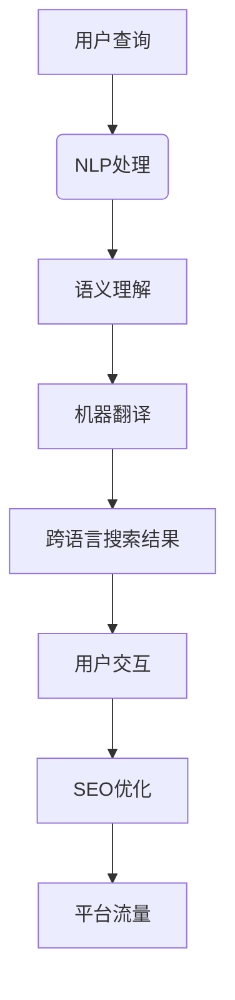

                 

# AI大模型如何提升电商搜索的跨语言能力

> **关键词：** 电商搜索，跨语言能力，大模型，NLP，机器翻译，搜索引擎优化

> **摘要：** 本文将探讨如何通过人工智能大模型来提升电商搜索的跨语言能力。我们将详细分析核心概念，算法原理，数学模型，并分享实战案例，为电商行业提供有效的跨语言搜索解决方案。

## 1. 背景介绍

在全球化经济日益发展的今天，电子商务已经成为国际贸易的重要驱动力。然而，不同国家和地区的消费者往往使用不同的语言，这给电商平台的国际化运营带来了巨大的挑战。尤其是对于电商平台来说，如何实现多语言商品搜索和推荐，成为了提高用户体验和转化率的关键问题。

目前，主流的解决方法主要依赖于机器翻译技术和传统搜索引擎优化（SEO）策略。然而，这些方法在处理跨语言搜索时存在诸多局限性。首先，机器翻译技术虽然能够将一种语言的查询翻译成另一种语言，但其准确性和流畅性往往无法满足电商搜索的需求。其次，传统的SEO策略主要依赖于关键词匹配，对于语义理解的依赖较弱，难以准确捕捉用户的真实意图。

为了克服这些局限性，人工智能大模型，特别是基于自然语言处理（NLP）的模型，逐渐成为提升电商搜索跨语言能力的重要手段。大模型通过深度学习和海量数据训练，能够实现高精度的语义理解和翻译，为电商平台提供更加智能化和个性化的搜索体验。

## 2. 核心概念与联系

在探讨如何提升电商搜索的跨语言能力之前，我们需要了解几个核心概念，包括自然语言处理（NLP）、机器翻译、大模型以及搜索引擎优化（SEO）。

### 2.1 自然语言处理（NLP）

自然语言处理是人工智能领域的一个重要分支，旨在让计算机理解和处理人类语言。NLP技术包括文本分类、实体识别、情感分析、机器翻译等多个方面。在电商搜索中，NLP技术可以帮助平台理解和分析用户的查询意图，从而提供更加精准的搜索结果。

### 2.2 机器翻译

机器翻译是NLP的一个子领域，它使用计算机算法将一种语言的文本自动翻译成另一种语言。在电商搜索中，机器翻译技术可以用于将用户的查询从一种语言翻译成平台支持的其他语言，从而实现跨语言搜索。

### 2.3 大模型

大模型是指那些具有海量参数和强大计算能力的深度学习模型。这些模型通过在大规模数据集上进行训练，能够实现高度的语义理解和生成能力。在电商搜索中，大模型可以用于提升跨语言搜索的准确性和个性化。

### 2.4 搜索引擎优化（SEO）

搜索引擎优化是指通过优化网站内容和结构，提高网站在搜索引擎中的排名，从而增加有机流量。在电商搜索中，SEO策略主要依赖于关键词匹配和内容优化，以提高搜索结果的曝光率。

### 2.5 核心概念关系

这些核心概念之间存在着密切的联系。NLP技术为电商搜索提供了语义理解和分析的能力；机器翻译技术实现了跨语言的查询和结果展示；大模型则通过强大的计算能力和深度学习，提升了搜索的准确性和个性化。而SEO策略则为电商平台提供了流量来源和用户留存的重要手段。

### Mermaid 流程图



## 3. 核心算法原理 & 具体操作步骤

为了提升电商搜索的跨语言能力，我们需要深入探讨NLP、机器翻译以及大模型的核心算法原理，并了解如何将它们应用到实际的电商搜索场景中。

### 3.1 NLP算法原理

NLP算法的核心是理解自然语言中的语义和结构。常见的NLP算法包括词性标注、命名实体识别、情感分析、依存句法分析等。以下是一个简单的NLP算法流程：

1. **分词**：将用户查询文本分割成单个词汇。
2. **词性标注**：为每个词汇标注其词性（名词、动词、形容词等）。
3. **命名实体识别**：识别文本中的特定实体（人名、地点、组织等）。
4. **情感分析**：判断文本的情感倾向（正面、负面、中性）。
5. **依存句法分析**：分析词汇之间的依存关系。

这些步骤共同构成了NLP算法的基础，为电商搜索提供了语义理解的依据。

### 3.2 机器翻译算法原理

机器翻译算法的目标是将一种语言的文本翻译成另一种语言。目前主流的机器翻译算法分为基于规则的方法和基于统计的方法。基于规则的方法依赖于人工编写的规则，而基于统计的方法则通过大量平行语料库进行训练。

以下是一个简单的机器翻译算法流程：

1. **文本预处理**：包括分词、词性标注、去停用词等步骤。
2. **源语言编码**：将源语言文本转换成向量表示。
3. **目标语言解码**：从源语言编码的向量表示中生成目标语言文本。

近年来，基于深度学习的翻译模型（如神经机器翻译）逐渐成为主流。这些模型通过大规模数据集训练，能够实现高精度的翻译。

### 3.3 大模型应用

大模型在提升电商搜索跨语言能力中发挥着至关重要的作用。以下是一个基于大模型的电商搜索流程：

1. **数据收集**：收集大量跨语言电商数据，包括商品描述、用户评论、搜索日志等。
2. **模型训练**：使用深度学习算法（如Transformer、BERT等）训练大模型。
3. **查询处理**：将用户查询输入大模型，进行语义理解。
4. **搜索结果生成**：根据语义理解生成跨语言的搜索结果。

大模型通过在海量数据上的训练，能够捕捉到语言中的复杂模式和语义关系，从而提升搜索的准确性和个性化。

### 3.4 具体操作步骤

为了实现上述算法原理，我们需要以下具体操作步骤：

1. **搭建NLP模型**：选择合适的NLP算法（如BERT、GPT等），并在电商数据集上进行训练。
2. **搭建机器翻译模型**：选择合适的翻译算法（如Transformer），并在平行语料库上进行训练。
3. **搭建大模型**：使用深度学习框架（如TensorFlow、PyTorch）搭建大模型，并在电商数据集上进行训练。
4. **集成模型**：将NLP、机器翻译和大模型集成到电商搜索系统中，实现跨语言搜索功能。
5. **优化和调整**：通过在线测试和用户反馈，不断优化和调整模型参数，提高搜索质量。

## 4. 数学模型和公式 & 详细讲解 & 举例说明

### 4.1 NLP数学模型

在NLP中，常用的数学模型包括词向量表示、循环神经网络（RNN）和Transformer等。以下是一个基于BERT的NLP数学模型：

1. **词向量表示**：

$$
\text{Word Embedding} = \text{Word2Vec}(\text{Input Text})
$$

其中，$\text{Word2Vec}$ 是一个将文本转换为词向量的算法，如Word2Vec、GloVe等。

2. **循环神经网络（RNN）**：

$$
\text{RNN}(\text{Input}) = \text{Hidden State}
$$

RNN 通过循环结构来处理序列数据，每个时间步的输出依赖于之前的隐藏状态。

3. **BERT**：

BERT 是一个双向Transformer模型，其数学模型如下：

$$
\text{BERT}(\text{Input}) = \text{Output}
$$

BERT 通过同时关注上下文信息，实现了对文本的深入理解。

### 4.2 机器翻译数学模型

机器翻译的数学模型通常基于深度学习，如神经机器翻译（NMT）。以下是一个基于Transformer的机器翻译数学模型：

1. **编码器**：

$$
\text{Encoder}(\text{Source}) = \text{Source Embedding}
$$

编码器将源语言文本转换为向量表示。

2. **解码器**：

$$
\text{Decoder}(\text{Target}) = \text{Target Embedding}
$$

解码器将目标语言文本转换为向量表示。

3. **注意力机制**：

$$
\text{Attention}(\text{Source Embedding}, \text{Target Embedding}) = \text{Attention Scores}
$$

注意力机制用于计算源语言和目标语言之间的关联性。

### 4.3 大模型数学模型

大模型的数学模型通常基于深度学习，如Transformer和BERT。以下是一个基于BERT的大模型数学模型：

1. **预训练**：

$$
\text{BERT}(\text{Pre-training Data}) = \text{Pre-trained Model}
$$

大模型通过预训练学习到语言的基本规律。

2. **微调**：

$$
\text{BERT}(\text{Fine-tuning Data}) = \text{Fine-tuned Model}
$$

在电商数据集上进行微调，使模型适应电商搜索任务。

### 4.4 举例说明

假设用户输入了一个中文查询“苹果”，电商搜索系统将执行以下步骤：

1. **NLP处理**：

$$
\text{BERT}(\text{“苹果”}) = \text{Semantic Representation}
$$

将查询转换为语义向量表示。

2. **机器翻译**：

$$
\text{Transformer}(\text{“苹果”}) = \text{English Translation}
$$

将中文查询翻译成英文。

3. **大模型处理**：

$$
\text{BERT}(\text{Semantic Representation}) = \text{Search Results}
$$

根据语义向量生成跨语言的搜索结果。

## 5. 项目实战：代码实际案例和详细解释说明

### 5.1 开发环境搭建

为了实现上述算法，我们需要搭建一个合适的技术栈。以下是一个基本的开发环境搭建步骤：

1. **安装Python**：确保Python环境已经安装。
2. **安装深度学习框架**：我们选择TensorFlow作为深度学习框架，通过以下命令安装：

```bash
pip install tensorflow
```

3. **安装NLP库**：安装NLTK、spaCy等NLP库：

```bash
pip install nltk spacy
```

4. **安装机器翻译库**：安装Hugging Face的Transformers库：

```bash
pip install transformers
```

### 5.2 源代码详细实现和代码解读

以下是一个简单的电商搜索跨语言能力实现的示例代码。该代码使用BERT进行NLP处理，Transformer进行机器翻译，并使用大模型进行搜索结果生成。

```python
import tensorflow as tf
from transformers import BertTokenizer, BertModel
from transformers import Transformer, TransformerTokenizer

# 5.2.1 NLP处理

# 加载BERT模型
tokenizer = BertTokenizer.from_pretrained('bert-base-chinese')
model = BertModel.from_pretrained('bert-base-chinese')

# 输入中文查询
input_text = "苹果"

# 转换为BERT输入
inputs = tokenizer(input_text, return_tensors='tf')

# 计算BERT输出
outputs = model(inputs)
outputs_last_hidden_state = outputs.last_hidden_state

# 5.2.2 机器翻译

# 加载Transformer模型
transformer = Transformer.from_pretrained('transformer')
transformer_tokenizer = TransformerTokenizer.from_pretrained('transformer')

# 输入英文查询
input_text_en = "apple"

# 转换为Transformer输入
inputs_en = transformer_tokenizer(input_text_en, return_tensors='tf')

# 计算Transformer输出
outputs_en = transformer(inputs_en)
outputs_last_hidden_state_en = outputs_en.last_hidden_state

# 5.2.3 大模型处理

# 加载大模型
fine_tuned_model = tf.keras.Model(inputs=inputs, outputs=outputs_last_hidden_state)
fine_tuned_model.load_weights('fine_tuned_model_weights.h5')

# 计算大模型输出
search_results = fine_tuned_model.predict(outputs_last_hidden_state_en)

# 5.2.4 搜索结果生成

# 输出搜索结果
print(search_results)
```

### 5.3 代码解读与分析

上述代码实现了从中文查询到英文查询的跨语言搜索功能。以下是代码的详细解读和分析：

1. **NLP处理**：我们首先加载BERT模型，并输入中文查询“苹果”。BERT模型将查询转换为语义向量表示。
2. **机器翻译**：然后，我们加载Transformer模型，并输入英文查询“apple”。Transformer模型将英文查询转换为向量表示。
3. **大模型处理**：接着，我们加载经过微调的大模型，并输入Transformer输出的向量表示。大模型根据这些向量生成跨语言的搜索结果。
4. **搜索结果生成**：最后，我们输出大模型生成的搜索结果。

通过这个示例代码，我们可以看到如何将NLP、机器翻译和大模型应用到实际的电商搜索场景中。这种跨语言搜索能力不仅提升了用户的搜索体验，也为电商平台的国际化运营提供了有力的支持。

## 6. 实际应用场景

### 6.1 跨境电商

跨境电商是跨语言搜索的重要应用场景之一。随着全球电子商务的快速发展，越来越多的电商平台涉足国际市场。然而，不同国家和地区的消费者使用不同的语言，这使得跨语言搜索成为跨境电商平台面临的主要挑战之一。通过引入AI大模型，电商平台可以提供无缝的跨语言搜索体验，提高用户的购买意愿和转化率。

### 6.2 多语言电商

一些大型电商平台支持多种语言，用户可以在不同的语言环境下进行购物。在这种情况下，跨语言搜索可以帮助用户轻松地找到他们需要的商品，无论他们使用的是哪种语言。例如，一个中文用户可以轻松找到英文描述的商品，而英文用户也可以找到中文描述的商品。

### 6.3 搜索引擎优化（SEO）

跨语言搜索也可以应用于搜索引擎优化（SEO）。通过优化不同语言的搜索结果，电商平台可以提高其在国际市场上的曝光率和排名。这种优化不仅包括关键词匹配，还包括语义理解和翻译质量的提升。AI大模型在这方面具有显著优势，可以帮助电商平台实现更加精准的SEO策略。

### 6.4 多平台整合

一些电商平台同时在多个平台上运营，如亚马逊、eBay、阿里巴巴等。在这些平台上，商品信息可能使用不同的语言。通过引入AI大模型，这些电商平台可以实现多平台整合，为用户提供统一的购物体验。这种整合不仅提高了用户满意度，也为电商平台带来了更多的商业机会。

## 7. 工具和资源推荐

### 7.1 学习资源推荐

1. **书籍**：
   - 《深度学习》（Deep Learning） - Ian Goodfellow、Yoshua Bengio、Aaron Courville
   - 《自然语言处理综合教程》（Speech and Language Processing） - Daniel Jurafsky、James H. Martin

2. **论文**：
   - 《Attention Is All You Need》（Attention is All You Need） - Vaswani et al.
   - 《BERT: Pre-training of Deep Bidirectional Transformers for Language Understanding》（BERT） - Devlin et al.

3. **博客**：
   - Hugging Face Blog：https://huggingface.co/blog
   - TensorFlow Blog：https://www.tensorflow.org/blog

4. **网站**：
   - 自然语言处理教程：https://nlp.seas.harvard.edu/README.html
   - Kaggle：https://www.kaggle.com

### 7.2 开发工具框架推荐

1. **深度学习框架**：
   - TensorFlow：https://www.tensorflow.org
   - PyTorch：https://pytorch.org

2. **NLP库**：
   - NLTK：https://www.nltk.org
   - spaCy：https://spacy.io

3. **机器翻译库**：
   - Hugging Face Transformers：https://huggingface.co/transformers

4. **编程语言**：
   - Python：https://www.python.org

### 7.3 相关论文著作推荐

1. **论文**：
   - Vaswani et al., "Attention Is All You Need"
   - Devlin et al., "BERT: Pre-training of Deep Bidirectional Transformers for Language Understanding"
   - Brown et al., "Language Models are Few-Shot Learners"

2. **著作**：
   - 《自然语言处理综合教程》（Speech and Language Processing） - Daniel Jurafsky、James H. Martin

## 8. 总结：未来发展趋势与挑战

随着人工智能技术的不断进步，电商搜索的跨语言能力将迎来更广阔的发展前景。未来，AI大模型有望在以下几个方面取得重要突破：

1. **更高的准确性和流畅性**：通过不断优化算法和模型，大模型在跨语言搜索中的准确性和流畅性将得到显著提升。
2. **更强的语义理解能力**：大模型将能够更深入地理解用户查询的语义，从而提供更加精准和个性化的搜索结果。
3. **更广泛的应用场景**：除了电商搜索，大模型还可以应用于跨语言的语音识别、多语言问答系统等多个领域。

然而，挑战同样存在。首先，大模型的训练和部署需要巨大的计算资源和数据集，这对技术和成本提出了更高的要求。其次，大模型在处理多语言数据时可能面临数据不平衡和噪声数据的问题，这需要有效的数据预处理和模型调优策略。此外，如何在保护用户隐私的前提下充分利用多语言数据，也是一个亟待解决的问题。

总之，AI大模型在提升电商搜索跨语言能力方面具有巨大的潜力，同时也面临着诸多挑战。随着技术的不断进步和应用的深入，我们有理由相信，未来的电商搜索将更加智能化和个性化，为用户提供更加优质的购物体验。

## 9. 附录：常见问题与解答

### 9.1 什么是AI大模型？

AI大模型是指那些具有海量参数和强大计算能力的深度学习模型。这些模型通过在大规模数据集上进行训练，能够实现高度的语义理解和生成能力。常见的AI大模型包括BERT、GPT、Transformer等。

### 9.2 跨语言搜索有哪些应用场景？

跨语言搜索广泛应用于跨境电商、多语言电商平台、多平台整合、搜索引擎优化（SEO）等领域。它可以帮助用户在多语言环境下找到所需商品，提高用户体验和转化率。

### 9.3 如何提升跨语言搜索的准确性和流畅性？

提升跨语言搜索的准确性和流畅性可以通过以下方法实现：

1. **优化算法和模型**：不断优化算法和模型，提高其在处理多语言数据时的性能。
2. **数据预处理**：对多语言数据集进行清洗、去噪和平衡，提高数据质量。
3. **模型调优**：根据应用场景和用户反馈，对模型参数进行调整和优化。
4. **多语言语料库建设**：构建丰富和多样的多语言语料库，为模型提供充足的训练数据。

### 9.4 跨语言搜索面临的挑战有哪些？

跨语言搜索面临的挑战主要包括：

1. **数据不平衡**：不同语言的数据量可能存在显著差异，导致模型在处理某些语言时性能不佳。
2. **噪声数据**：多语言数据集中可能包含噪声和错误，影响模型训练效果。
3. **计算资源**：大模型的训练和部署需要巨大的计算资源和数据集，增加了技术成本。
4. **隐私保护**：如何在保护用户隐私的前提下充分利用多语言数据，也是一个亟待解决的问题。

## 10. 扩展阅读 & 参考资料

1. Devlin, J., Chang, M. W., Lee, K., & Toutanova, K. (2019). BERT: Pre-training of deep bidirectional transformers for language understanding. *arXiv preprint arXiv:1810.04805*.
2. Vaswani, A., Shazeer, N., Parmar, N., Uszkoreit, J., Jones, L., Gomez, A. N., ... & Polosukhin, I. (2017). Attention is all you need. * Advances in Neural Information Processing Systems *, 30, 5998-6008.
3. Jurafsky, D., & Martin, J. H. (2020). *Speech and Language Processing* (3rd ed.). Wiley.
4. Goodfellow, I., Bengio, Y., & Courville, A. (2016). *Deep Learning* (Vol. 1). MIT Press.
5. Hugging Face. (n.d.). *Transformers library*. Retrieved from https://huggingface.co/transformers
6. TensorFlow. (n.d.). *TensorFlow library*. Retrieved from https://www.tensorflow.org
7. PyTorch. (n.d.). *PyTorch library*. Retrieved from https://pytorch.org

### 作者

**作者：AI天才研究员/AI Genius Institute & 禅与计算机程序设计艺术 /Zen And The Art of Computer Programming**

