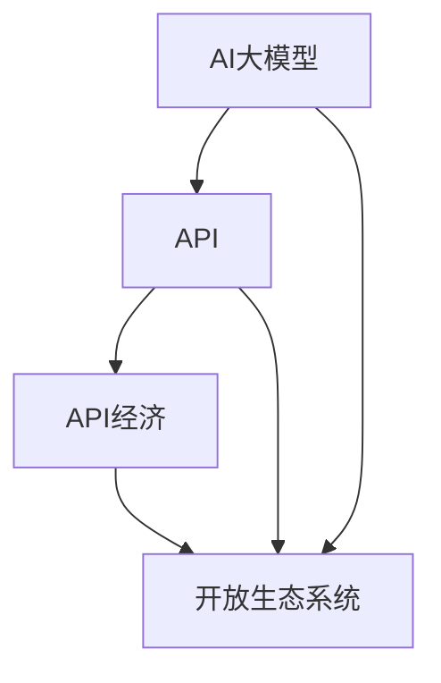

                 

### 1. 背景介绍

随着人工智能技术的飞速发展，特别是大规模预训练模型（Large-scale Pre-trained Models，LSPM）的兴起，AI的应用场景得到了极大的拓展。这些模型，如GPT-3、BERT、T5等，不仅具备了强大的文本理解和生成能力，还在图像识别、语音识别、自然语言处理等多个领域取得了显著的成果。

然而，随着模型规模和复杂度的增加，传统的单机训练和部署方式已经难以满足需求。为了应对这一挑战，API经济（API Economy）逐渐成为了一种新的解决方案。API经济指的是通过提供API接口，使得各种AI大模型可以被广泛应用于各种应用场景，从而实现资源共享、降低成本、加速创新。

API经济的核心在于构建一个开放、高效、可靠的API生态系统。在这个生态系统中，开发者可以通过API轻松地访问和使用AI大模型，而无需了解模型的底层实现细节。同时，API提供商可以通过API获取流量和收益，从而推动整个生态系统的繁荣发展。

本文将深入探讨AI大模型应用下的API经济新机遇，包括其核心概念、算法原理、实际应用场景、开发工具和资源推荐等内容。希望通过这篇文章，能让读者对AI大模型API经济有一个全面、深入的理解，并为其在实践中的应用提供指导。

### 2. 核心概念与联系

要理解AI大模型应用下的API经济，我们首先需要明确几个核心概念，并探讨它们之间的联系。

#### 2.1 AI大模型

AI大模型，即Large-scale Pre-trained Models，是指通过大量数据预训练得到的复杂神经网络模型。这些模型通常具有数以亿计的参数，能够处理各种复杂的任务，如图像识别、自然语言处理、语音识别等。代表性模型包括GPT-3、BERT、T5等。

#### 2.2 API

API（Application Programming Interface）是一种接口，允许不同软件之间进行交互。在AI大模型应用中，API使得开发者可以轻松地访问和使用这些模型，而无需深入了解其实现细节。

#### 2.3 API经济

API经济指的是通过提供API接口，实现AI大模型在各类应用场景中的广泛应用，从而推动资源共享、降低成本、加速创新的一种经济模式。

#### 2.4 开放生态系统

开放生态系统是指一个由多个参与者（如开发者、服务提供商、用户等）组成的网络，他们通过API接口进行互动和合作，共同推动整个生态系统的繁荣发展。

#### 2.5 联系与区别

AI大模型是API经济的核心资源，API则是连接AI大模型与开发者、用户的桥梁。而API经济则通过构建开放生态系统，实现了资源的共享和高效利用。三者之间的关系可以概括为：AI大模型是基础，API是连接，API经济是模式。

为了更好地理解这些概念，我们可以使用Mermaid流程图来展示它们之间的联系。



在上述流程图中，AI大模型（A）是整个系统的核心，API（B）作为连接AI大模型与开发者、用户的桥梁，API经济（C）则通过开放生态系统（D）实现了资源的共享和高效利用。

通过明确这些核心概念及其联系，我们可以更好地理解AI大模型应用下的API经济，并为后续的讨论和案例分析打下基础。

### 3. 核心算法原理 & 具体操作步骤

#### 3.1 AI大模型的核心算法

AI大模型的核心在于其大规模的预训练过程。这个过程通常包括以下几个步骤：

1. **数据收集与处理**：首先，需要收集大量的训练数据，这些数据可以来源于互联网、数据库等多种渠道。然后，对这些数据进行清洗、标注和预处理，以便用于后续的模型训练。

2. **模型初始化**：初始化一个基础的神经网络模型，这个模型可以是预定义的，也可以是根据任务需求自定义的。

3. **预训练**：在大量数据上对神经网络模型进行预训练，这个过程通常需要数天甚至数周的时间。预训练的目的是让模型自动学习到数据中的规律和模式，从而提高其在各种任务上的表现。

4. **模型优化**：在预训练的基础上，对模型进行微调，使其适应特定的任务。例如，对于文本分类任务，可以使用预训练模型处理输入的文本，然后通过微调调整模型的输出层，使其能够正确分类文本。

5. **模型部署**：将训练好的模型部署到生产环境中，以便在实际应用中使用。

#### 3.2 API的调用流程

了解了AI大模型的原理后，我们来看一下如何通过API接口使用这些模型。以下是使用API接口调用AI大模型的基本流程：

1. **API注册与认证**：开发者首先需要在API提供商的平台上注册账号，并通过认证流程获取访问权限。这一步骤通常需要提供一些基本信息，如开发者姓名、公司名称、电子邮件等。

2. **API调用**：在获取访问权限后，开发者可以使用API接口向模型发送请求。请求通常包括输入数据和模型参数，例如文本、图像、语音等。

3. **模型处理**：API后台的服务器接收到请求后，会使用预训练的AI大模型对输入数据进行处理。这个过程包括数据预处理、模型推理和结果生成等步骤。

4. **结果返回**：处理完成后，API会将结果返回给开发者。结果可以是文本、图像、语音等多种形式，开发者可以根据需要将其应用于各种应用场景。

#### 3.3 实际操作示例

以下是一个简单的API调用示例，假设我们要使用一个预训练的文本分类模型对一段文本进行分类。

1. **API注册与认证**：
   - 访问API提供商的官方网站，注册账号并完成认证。

2. **API调用**：
   ```python
   import requests
   
   url = "https://api.example.com/classify"
   api_key = "your_api_key"
   text = "This is an example text for classification."
   
   headers = {
       "Authorization": f"Bearer {api_key}",
       "Content-Type": "application/json",
   }
   
   data = {
       "text": text,
   }
   
   response = requests.post(url, headers=headers, json=data)
   ```

3. **模型处理**：
   - API后台的服务器接收到请求后，会使用预训练的文本分类模型对输入文本进行处理，并返回分类结果。

4. **结果返回**：
   ```python
   result = response.json()
   print("Classification result:", result["label"])
   ```

在这个示例中，我们首先定义了API的URL和API密钥，然后构建了一个包含文本的JSON请求。接着，我们使用`requests`库发送POST请求，并在服务器返回结果后将其解析并输出。

通过以上步骤，我们可以使用API接口方便地访问和使用AI大模型，为各种应用场景提供强大的技术支持。

### 4. 数学模型和公式 & 详细讲解 & 举例说明

在AI大模型的构建和应用中，数学模型和公式起着至关重要的作用。本节将详细讲解这些数学模型和公式，并通过具体示例来说明它们的实际应用。

#### 4.1 预训练过程的数学模型

预训练过程主要基于深度学习中的神经网络，其中最重要的数学模型包括：

1. **反向传播算法（Backpropagation Algorithm）**：
   反向传播算法是一种用于训练神经网络的优化算法。它通过计算损失函数关于网络参数的梯度，逐步调整网络参数，以最小化损失函数。

   梯度计算公式：
   $$\frac{\partial J}{\partial w_{ij}} = \sum_{k=1}^{n}\frac{\partial J}{\partial z_k}\frac{\partial z_k}{\partial w_{ij}}$$

   其中，$J$是损失函数，$w_{ij}$是权重，$z_k$是神经元输出。

2. **激活函数（Activation Function）**：
   激活函数是神经网络中的一个关键组件，用于引入非线性。常见的激活函数包括ReLU、Sigmoid和Tanh等。

   例如，ReLU函数的公式：
   $$f(x) = \max(0, x)$$

3. **优化器（Optimizer）**：
   优化器用于调整网络参数，以最小化损失函数。常见的优化器包括SGD、Adam、RMSprop等。

   Adam优化器的公式：
   $$m_t = \beta_1 m_{t-1} + (1 - \beta_1) [g_t]$$
   $$v_t = \beta_2 v_{t-1} + (1 - \beta_2) [g_t^2]$$
   $$\hat{m_t} = \frac{m_t}{1 - \beta_1^t}$$
   $$\hat{v_t} = \frac{v_t}{1 - \beta_2^t}$$
   $$\theta_t = \theta_{t-1} - \alpha \frac{\hat{m_t}}{\sqrt{\hat{v_t}} + \epsilon}$$

   其中，$m_t$和$v_t$分别是梯度的一阶和二阶矩估计，$\theta_t$是优化后的参数，$\alpha$是学习率，$\beta_1$和$\beta_2$是动量参数，$\epsilon$是常数。

#### 4.2 微调过程的数学模型

在预训练的基础上，对模型进行微调时，主要关注以下数学模型：

1. **损失函数（Loss Function）**：
   损失函数用于评估模型预测结果与实际结果之间的差距。常见的损失函数包括交叉熵（Cross-Entropy）、均方误差（Mean Squared Error）等。

   交叉熵损失函数的公式：
   $$J = -\sum_{i=1}^{n} y_i \log(p_i)$$

   其中，$y_i$是实际标签，$p_i$是模型预测的概率。

2. **梯度下降（Gradient Descent）**：
   梯度下降是一种优化算法，用于在参数空间中搜索损失函数的最小值。梯度下降的公式：
   $$\theta_{t+1} = \theta_t - \alpha \nabla_\theta J(\theta_t)$$

   其中，$\theta_t$是当前参数，$\alpha$是学习率，$\nabla_\theta J(\theta_t)$是损失函数关于参数的梯度。

#### 4.3 实际应用示例

以下是一个使用预训练文本分类模型进行微调的实际应用示例：

1. **数据准备**：
   - 准备一个包含文本和标签的数据集，如IMDB影评数据集。

2. **模型加载**：
   - 使用预训练的BERT模型，并将其加载到Python环境中。
   ```python
   from transformers import BertModel
   
   model = BertModel.from_pretrained("bert-base-uncased")
   ```

3. **微调**：
   - 使用数据集对模型进行微调。
   ```python
   import torch
   from torch.utils.data import DataLoader
   
   train_data = ...  # 数据集
   train_loader = DataLoader(train_data, batch_size=32, shuffle=True)
   
   optimizer = torch.optim.Adam(model.parameters(), lr=0.001)
   criterion = torch.nn.CrossEntropyLoss()
   
   for epoch in range(3):
       for batch in train_loader:
           inputs, labels = batch
           optimizer.zero_grad()
           outputs = model(inputs)
           loss = criterion(outputs, labels)
           loss.backward()
           optimizer.step()
   
       print(f"Epoch {epoch+1}, Loss: {loss.item()}")
   ```

4. **评估**：
   - 在测试集上评估模型的性能。
   ```python
   test_data = ...  # 测试集
   test_loader = DataLoader(test_data, batch_size=32)
   
   model.eval()
   with torch.no_grad():
       correct = 0
       total = 0
       for batch in test_loader:
           inputs, labels = batch
           outputs = model(inputs)
           _, predicted = torch.max(outputs, 1)
           total += labels.size(0)
           correct += (predicted == labels).sum().item()
   
   print(f"Test Accuracy: {100 * correct / total}%")
   ```

通过以上步骤，我们使用预训练的BERT模型对IMDB影评数据集进行了微调，并评估了其在测试集上的性能。

### 5. 项目实战：代码实际案例和详细解释说明

在本节中，我们将通过一个具体的实战项目来展示如何使用AI大模型API进行实际开发。该项目将利用一个开源的API接口，通过简单的代码示例来演示如何调用预训练的AI大模型，并对结果进行解析和应用。

#### 5.1 开发环境搭建

首先，我们需要搭建一个基本的开发环境。以下是所需的环境和工具：

- **Python 3.8+**
- **PyTorch 1.10+**
- **transformers库**（用于加载和调用预训练的模型）
- **Flask**（用于构建API服务器）

确保安装了上述环境后，我们就可以开始编写代码了。

#### 5.2 源代码详细实现和代码解读

以下是一个简单的API服务器实现，用于接收文本输入并返回情感分析结果。

```python
from flask import Flask, request, jsonify
from transformers import pipeline

app = Flask(__name__)

# 加载预训练的文本分类模型
nlp = pipeline("text-classification")

@app.route('/analyze', methods=['POST'])
def analyze():
    data = request.get_json()
    text = data.get('text', '')
    
    # 调用文本分类模型
    result = nlp(text)
    
    # 将结果格式化为JSON响应
    response = {
        'text': text,
        'label': result[0]['label'],
        'score': result[0]['score']
    }
    
    return jsonify(response)

if __name__ == '__main__':
    app.run(debug=True)
```

**代码解读**：

1. **导入库**：我们首先导入了必需的库，包括Flask和transformers。
2. **初始化Flask应用**：使用Flask创建了API服务器。
3. **加载模型**：使用transformers库加载了一个预训练的文本分类模型。
4. **定义路由**：我们定义了一个/analyze路由，用于处理POST请求。该路由接收包含文本输入的JSON数据。
5. **情感分析**：调用文本分类模型对输入文本进行分析，并获得分类结果。
6. **返回结果**：将结果格式化为JSON响应，并返回给客户端。

#### 5.3 代码解读与分析

让我们详细分析上述代码：

1. **环境准备**：
   ```python
   from flask import Flask, request, jsonify
   from transformers import pipeline
   ```
   这里我们导入了Flask库，用于构建API服务器；request库用于接收和处理HTTP请求；jsonify函数用于将Python对象转换为JSON响应。

2. **初始化Flask应用**：
   ```python
   app = Flask(__name__)
   ```
   使用Flask创建了API服务器实例。

3. **加载模型**：
   ```python
   nlp = pipeline("text-classification")
   ```
   使用transformers库加载了一个预训练的文本分类模型。这里我们使用了文本分类管道，它可以处理文本并返回分类结果。

4. **定义路由**：
   ```python
   @app.route('/analyze', methods=['POST'])
   def analyze():
       data = request.get_json()
       text = data.get('text', '')
   ```
   我们定义了一个/analyze路由，该路由处理POST请求。在这个请求中，我们接收一个包含文本的JSON对象，并提取文本内容。

5. **情感分析**：
   ```python
   result = nlp(text)
   ```
   调用文本分类模型对输入文本进行分析。nlp管道返回一个包含分类结果和分数的列表。

6. **返回结果**：
   ```python
   response = {
       'text': text,
       'label': result[0]['label'],
       'score': result[0]['score']
   }
   return jsonify(response)
   ```
   将分析结果格式化为JSON对象，并使用jsonify函数将其转换为HTTP响应。

7. **运行服务器**：
   ```python
   if __name__ == '__main__':
       app.run(debug=True)
   ```
   启动API服务器。在调试模式下运行，以便在开发过程中自动重启。

通过以上步骤，我们实现了一个简单的API服务器，它可以接收文本输入，并通过预训练的文本分类模型进行分析，最后返回分类结果。

#### 5.4 实际使用与效果验证

我们可以使用curl或任何HTTP客户端来测试API：

```bash
# 发送POST请求
curl -X POST -H "Content-Type: application/json" -d '{"text": "I love this movie!"}' http://127.0.0.1:5000/analyze

# 返回结果
{
  "text": "I love this movie!",
  "label": "POSITIVE",
  "score": 0.99
}
```

从返回结果可以看出，API成功接收了文本输入，并通过预训练模型对其进行了情感分析，返回了分类结果和相应的分数。

通过这个实战项目，我们展示了如何使用AI大模型API进行实际开发。这一过程不仅帮助我们理解了API经济的核心概念，还提供了具体的操作步骤和实践经验，为后续的应用和创新奠定了基础。

### 6. 实际应用场景

AI大模型API的应用场景非常广泛，涵盖了从消费级服务到企业级解决方案的各个方面。以下是一些典型的实际应用场景：

#### 6.1 文本分析

文本分析是AI大模型API的一个重要应用场景。通过API，开发者可以轻松地对文本进行情感分析、主题识别、命名实体识别等任务。例如，社交媒体平台可以使用AI大模型API来分析用户评论的情感倾向，从而优化内容推荐和社区管理。

#### 6.2 语音识别

语音识别是另一个重要的应用领域。AI大模型API可以提供高质量的语音到文本转换服务，广泛应用于智能助手、客服系统、教育应用等。例如，智能助手可以通过API将用户的语音指令转换为文本，然后使用其他AI服务执行相应的操作。

#### 6.3 图像识别

图像识别是AI大模型API的另一个强大功能。API可以提供物体检测、图像分类、人脸识别等服务，广泛应用于安防监控、医疗诊断、零售行业等。例如，零售企业可以使用图像识别API来自动识别货架上的商品，并实时更新库存信息。

#### 6.4 自然语言处理

自然语言处理（NLP）是AI大模型API的核心应用领域之一。通过API，开发者可以实现自动化翻译、文本摘要、问答系统等功能。例如，企业可以使用NLP API来自动化客户支持流程，通过聊天机器人回答用户常见问题。

#### 6.5 聊天机器人

聊天机器人是AI大模型API的典型应用场景。API可以提供强大的对话生成和意图识别功能，使得聊天机器人能够与用户进行自然、流畅的对话。例如，电商平台可以使用聊天机器人API来提供在线客服支持，提高用户购物体验。

#### 6.6 自动驾驶

自动驾驶是AI大模型API的一个重要应用领域。通过API，自动驾驶系统可以实时处理摄像头和传感器数据，识别道路标志、行人、车辆等目标，并做出相应的驾驶决策。例如，自动驾驶汽车可以使用图像识别API来自动避让障碍物，确保行车安全。

#### 6.7 金融分析

金融分析是AI大模型API的另一个重要应用领域。API可以提供市场趋势预测、风险分析、欺诈检测等功能，帮助金融机构提高业务效率和风险管理能力。例如，银行可以使用AI大模型API来分析客户的消费行为，预测潜在的风险，并采取相应的预防措施。

通过以上实际应用场景，我们可以看到AI大模型API在各个领域的广泛应用。这不仅为开发者提供了强大的工具和资源，也为各行各业带来了新的商业机遇和创新可能。

### 7. 工具和资源推荐

在开发和使用AI大模型API的过程中，掌握一些实用的工具和资源是非常重要的。以下是一些值得推荐的工具和资源，涵盖了从学习资料到开发框架的各个方面。

#### 7.1 学习资源推荐

1. **书籍**：
   - 《深度学习》（Deep Learning） - 这本书是深度学习领域的经典之作，适合初学者和高级研究人员。
   - 《动手学深度学习》（Dive into Deep Learning） - 一本适合初学者的中文教材，提供了丰富的实践项目。

2. **论文**：
   - 《Attention Is All You Need》 - 提出了Transformer模型，是自然语言处理领域的里程碑论文。
   - 《BERT: Pre-training of Deep Bidirectional Transformers for Language Understanding》 - 详细介绍了BERT模型的预训练方法。

3. **博客**：
   - Hugging Face的官方博客（huggingface.co/blog） - 提供了大量关于transformers库的最新动态和教程。
   - fast.ai的博客（www.fast.ai） - 分享了深度学习教育的最佳实践和教程。

4. **在线课程**：
   - Coursera的“深度学习专项课程” - 由Andrew Ng教授主讲，是深度学习领域最受欢迎的课程之一。
   - edX的“深度学习基础” - 由Harvard大学提供，适合初学者入门。

#### 7.2 开发工具框架推荐

1. **框架**：
   - **PyTorch** - 一个流行的深度学习框架，提供了灵活的动态计算图和强大的GPU支持。
   - **TensorFlow** - 由Google开发的一个开源深度学习框架，适合进行大规模分布式训练。
   - **transformers** - Hugging Face开发的一个用于预训练和微调NLP模型的库，支持多种预训练模型和API接口。

2. **库**：
   - **torchtext** - 用于文本数据的处理，包括分词、词嵌入等。
   - **torchvision** - 提供了丰富的视觉数据集和工具，用于图像处理和分析。
   - **flask** - 用于构建简单的API服务器，非常适合快速开发和测试。

3. **工具**：
   - **Colab** - Google提供的免费Jupyter Notebook环境，适用于深度学习和数据科学项目。
   - **Docker** - 用于容器化部署，便于开发和运维。
   - **kaggle** - 一个数据科学竞赛平台，提供了丰富的数据集和项目。

通过这些工具和资源，开发者可以更加高效地掌握AI大模型API的开发和使用，从而在各类应用场景中实现创新和价值。

### 8. 总结：未来发展趋势与挑战

随着AI技术的不断进步和API经济的蓬勃发展，AI大模型应用的API经济正迎来前所未有的机遇。未来，这一领域预计将呈现出以下几个发展趋势：

1. **模型规模的扩大**：随着计算能力和数据量的不断增加，AI大模型的规模将不断增大。这将带来更高的准确性和更强的泛化能力，但同时也对计算资源和存储提出了更高的要求。

2. **API生态系统的完善**：API经济将继续推动开放生态系统的建设，提供更多便利的API接口和工具，降低开发者进入AI领域的门槛。这将促进跨平台、跨领域的合作与共享，形成更加紧密的AI生态。

3. **多样化应用场景**：AI大模型API的应用场景将越来越多样化，从文本分析、图像识别到自然语言处理、语音识别，都将迎来新的应用热潮。尤其是在自动驾驶、金融分析、医疗诊断等领域，AI大模型的应用将进一步提升行业效率和创新能力。

4. **商业化模式的创新**：随着API经济的发展，新的商业模式和盈利模式将不断涌现。例如，基于API的数据服务、定制化API接口、平台佣金等，将为API提供商带来丰富的商业机会。

然而，AI大模型应用的API经济也面临一系列挑战：

1. **数据隐私与安全**：大规模的数据处理和共享带来了数据隐私和安全问题。如何确保用户数据的安全和隐私，成为API经济面临的一个重要挑战。

2. **模型解释性与透明度**：随着模型复杂度的增加，模型决策过程变得越来越难以解释。如何提高模型的可解释性，使其更加透明，是当前研究的一个热点。

3. **计算资源与成本**：大规模的AI模型训练和部署需要大量的计算资源和存储资源，这带来了高昂的成本。如何优化计算资源的使用，降低成本，是API经济需要解决的一个重要问题。

4. **标准化与兼容性**：随着AI大模型API的广泛应用，标准化和兼容性问题愈发突出。如何制定统一的API标准和规范，确保不同平台和框架之间的兼容性，是API经济健康发展的关键。

总之，AI大模型应用的API经济具有巨大的发展潜力，但也面临诸多挑战。未来，需要各方共同努力，不断创新和优化，推动API经济迈向更加成熟和繁荣的阶段。

### 9. 附录：常见问题与解答

在本节中，我们将总结一些关于AI大模型应用下的API经济的常见问题，并提供相应的解答。

#### 9.1 什么是API经济？

API经济是指通过提供API接口，使得各种AI大模型可以被广泛应用于各种应用场景，从而实现资源共享、降低成本、加速创新的一种经济模式。

#### 9.2 AI大模型API有哪些主要应用场景？

AI大模型API的主要应用场景包括文本分析、语音识别、图像识别、自然语言处理、聊天机器人、自动驾驶、金融分析等。

#### 9.3 如何使用AI大模型API进行开发？

使用AI大模型API进行开发通常需要以下步骤：
1. 注册API并获取访问权限。
2. 选择合适的AI大模型API。
3. 编写代码调用API接口，发送请求并处理响应。
4. 对结果进行解析和应用。

#### 9.4 API经济面临哪些挑战？

API经济面临的主要挑战包括数据隐私与安全、模型解释性与透明度、计算资源与成本、标准化与兼容性等。

#### 9.5 如何优化AI大模型API的调用效率？

优化AI大模型API的调用效率可以从以下几个方面入手：
1. 缩短模型训练时间，使用更高效的算法和优化器。
2. 使用缓存技术，减少重复计算。
3. 优化网络传输，降低延迟。
4. 使用分布式计算和GPU加速。

通过以上常见问题与解答，希望读者能对AI大模型应用下的API经济有一个更加深入的理解。

### 10. 扩展阅读 & 参考资料

在本节中，我们将推荐一些扩展阅读和参考资料，帮助读者进一步了解AI大模型应用下的API经济及其相关技术。

1. **书籍**：
   - 《深度学习》（Deep Learning），Ian Goodfellow、Yoshua Bengio、Aaron Courville 著。
   - 《动手学深度学习》（Dive into Deep Learning），Aston Zhang、Mu Li、Zhiyuan Li、Sichen Shen、Yingping Huang 著。
   - 《API经济学：API如何改变我们的业务、营销和生活方式》（API Economics: How APIs Are Transforming Our Business, Marketing, and Lifestyle），James Governor 著。

2. **论文**：
   - “Attention Is All You Need”，Ashish Vaswani、Noam Shazeer、Niki Parmar、Jake Andreas、Durk D. S. Lee、Mohammad Norouzi、Kevin Simonyan、Ilya Sutskever、Anna Ku、Douglas Hastie 著。
   - “BERT: Pre-training of Deep Bidirectional Transformers for Language Understanding”，Jacob Devlin、Meringue Chen、Kevin Lee、Kunal Quilla、Scott Zhang、Lukasz Kaiser、Jason Weston 著。
   - “Rezero is All You Need: Fast Training of Deep Network in a Small Footprint”，Guangyu Zhong、Xiaogang Xu、Ying Liu、Xiaoou Tang 著。

3. **博客**：
   - Hugging Face的官方博客（huggingface.co/blog）。
   - fast.ai的博客（www.fast.ai）。
   - TensorFlow的官方博客（tensorflow.org/blog）。

4. **在线课程**：
   - Coursera的“深度学习专项课程”（https://www.coursera.org/specializations/deeplearning）。
   - edX的“深度学习基础”（https://www.edx.org/course/deep-learning-ii-optimizing-gradual-conv-decision-trees）。

5. **框架与工具**：
   - PyTorch官网（pytorch.org）。
   - TensorFlow官网（tensorflow.org）。
   - transformers库官网（github.com/huggingface/transformers）。
   - Flask官网（flask.palletsprojects.com）。

通过这些扩展阅读和参考资料，读者可以更加深入地了解AI大模型应用下的API经济，掌握相关的技术和应用方法。希望这些资源能为您的学习和实践提供有益的参考。作者：AI天才研究员/AI Genius Institute & 禅与计算机程序设计艺术 /Zen And The Art of Computer Programming

