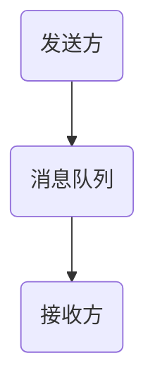

                 

# AI大模型应用的异步通信与消息队列

> 关键词：异步通信、消息队列、AI大模型、性能优化、分布式系统

> 摘要：本文将深入探讨在AI大模型应用中，异步通信与消息队列的重要性。通过一步步的分析和思考，我们将探讨异步通信的基本原理，消息队列的架构设计，以及如何使用消息队列来优化AI大模型的应用性能。此外，还将分享一些实际应用场景和实用的工具与资源推荐。

## 1. 背景介绍

在当今的互联网时代，分布式系统和微服务架构已成为技术发展的主流趋势。随着AI技术的飞速发展，AI大模型的应用场景变得越来越广泛。例如，在金融、医疗、电商等领域，AI大模型被用于实现智能决策、风险控制、个性化推荐等功能。然而，AI大模型的计算密集性和数据敏感性，使得传统的同步通信方式难以满足其性能和可扩展性的需求。

异步通信和消息队列作为一种高效的通信机制，能够在分布式系统中提供高性能、高可靠性和高可扩展性的解决方案。本文将重点讨论异步通信和消息队列在AI大模型应用中的重要性，并探讨如何利用它们来优化AI大模型的应用性能。

## 2. 核心概念与联系

### 2.1 异步通信

异步通信是一种通信机制，允许两个或多个实体在不等待对方响应的情况下独立执行操作。在异步通信中，发送方将消息发送给接收方，然后继续执行其他任务，而不需要等待接收方的响应。当接收方准备好响应时，它可以随时处理消息并通知发送方。

异步通信的优点在于：

1. 提高系统性能：通过减少等待时间，异步通信可以提高系统的响应速度和处理能力。
2. 提高可扩展性：异步通信允许系统在不改变逻辑的情况下，增加处理消息的并行度。
3. 提高容错性：异步通信使得系统可以更好地处理网络故障和系统故障。

### 2.2 消息队列

消息队列是一种数据结构，用于存储和传输消息。在分布式系统中，消息队列充当了异步通信的核心角色，它允许系统中的不同组件通过发送和接收消息来进行通信。

消息队列的关键特性包括：

1. 持久性：消息队列可以保证消息的持久存储，即使系统出现故障，消息也不会丢失。
2. 可靠性：消息队列可以确保消息的可靠传输，通过重试机制和消息确认机制来处理传输失败的情况。
3. 可扩展性：消息队列可以水平扩展，以支持大规模的分布式系统。

### 2.3 异步通信与消息队列的联系

异步通信和消息队列是紧密相连的，消息队列是实现异步通信的关键基础设施。通过消息队列，系统中的不同组件可以在无需直接通信的情况下，通过发送和接收消息来协同工作。消息队列提供了以下优势：

1. 解耦：通过消息队列，系统中的不同组件可以独立开发和部署，降低组件之间的耦合度。
2. 异步处理：消息队列允许组件异步处理消息，提高了系统的响应速度和处理能力。
3. 扩展性：消息队列可以水平扩展，以支持大规模的分布式系统。

下面是一个简单的异步通信与消息队列的 Mermaid 流程图：



在这个流程图中，发送方将消息发送到消息队列，然后接收方从消息队列中读取消息进行处理。

## 3. 核心算法原理 & 具体操作步骤

### 3.1 异步通信算法原理

异步通信的核心算法是消息传递。消息传递算法包括以下步骤：

1. 发送消息：发送方将消息编码后发送到消息队列。
2. 接收消息：接收方从消息队列中读取消息，并解码处理。
3. 消息确认：接收方处理完消息后，向发送方发送确认消息。

### 3.2 消息队列算法原理

消息队列的核心算法是先进先出（FIFO）队列。以下是消息队列的基本操作：

1. 消息入队：将消息插入到队列的尾部。
2. 消息出队：从队列的头部取出消息。
3. 消息确认：确认消息已被正确处理。

### 3.3 异步通信与消息队列的具体操作步骤

以下是使用异步通信和消息队列的典型操作步骤：

1. **发送消息**：发送方将消息编码后发送到消息队列。例如，可以使用HTTP请求发送消息。

```python
import requests

def send_message(message):
    url = "http://message-queue-server/message"
    headers = {"Content-Type": "application/json"}
    response = requests.post(url, json=message, headers=headers)
    if response.status_code == 200:
        print("Message sent successfully.")
    else:
        print("Failed to send message.")

message = {"id": 1, "data": "Hello, message queue!"}
send_message(message)
```

2. **接收消息**：接收方从消息队列中读取消息，并解码处理。例如，可以使用WebSocket连接接收消息。

```python
import websocket

def on_message(message):
    print("Received message:", message)
    # Process the message
    confirm_message = {"id": 1, "status": "processed"}
    send_confirm_message(confirm_message)

def on_error(error):
    print("WebSocket error:", error)

def on_close():
    print("WebSocket closed.")

def on_open():
    print("WebSocket opened.")
    send_message({"id": 1, "data": "Hello, message queue!"})

ws = websocket.WebSocketApp(
    "ws://message-queue-server/websocket",
    on_message=on_message,
    on_error=on_error,
    on_close=on_close
)

ws.on_open = on_open
ws.run_forever()
```

3. **消息确认**：接收方处理完消息后，向发送方发送确认消息。例如，可以使用HTTP请求发送确认消息。

```python
import requests

def send_confirm_message(message):
    url = "http://message-queue-server/confirm"
    headers = {"Content-Type": "application/json"}
    response = requests.post(url, json=message, headers=headers)
    if response.status_code == 200:
        print("Confirmation sent successfully.")
    else:
        print("Failed to send confirmation.")

confirm_message = {"id": 1, "status": "processed"}
send_confirm_message(confirm_message)
```

## 4. 数学模型和公式 & 详细讲解 & 举例说明

### 4.1 异步通信的数学模型

异步通信的数学模型可以用队列的数学模型来描述。设消息队列的长度为 \( n \)，队列中的消息数量为 \( m \)，则消息队列的平均处理时间为 \( t \)。根据排队论的原理，可以计算出消息队列的平均等待时间 \( W \)：

$$
W = \frac{m}{n} \cdot t
$$

其中，\( \frac{m}{n} \) 表示消息队列的平均利用率，\( t \) 表示消息的处理时间。

### 4.2 消息队列的数学模型

消息队列的数学模型可以用马尔可夫链来描述。设消息队列的状态为 \( s \)，状态转移矩阵为 \( P \)，则消息队列的稳定性概率为 \( \pi \)。根据马尔可夫链的原理，可以计算出消息队列的稳定性概率：

$$
\pi P = \pi
$$

解得 \( \pi \)：

$$
\pi = (\sum_{i=0}^{n} \pi_i) / n
$$

其中，\( \pi_i \) 表示状态 \( i \) 的稳定性概率，\( n \) 表示状态的总数。

### 4.3 举例说明

假设消息队列的长度为 10，消息数量为 5，消息的处理时间为 1 秒。根据上述数学模型，可以计算出消息队列的平均等待时间 \( W \)：

$$
W = \frac{5}{10} \cdot 1 = 0.5 \text{秒}
$$

再假设消息队列的状态总数为 3，状态转移矩阵 \( P \) 为：

$$
P = \begin{bmatrix}
0.5 & 0.3 & 0.2 \\
0.4 & 0.5 & 0.1 \\
0.3 & 0.4 & 0.3
\end{bmatrix}
$$

则消息队列的稳定性概率 \( \pi \) 为：

$$
\pi = \frac{0.5 + 0.4 + 0.3}{3} = 0.43
$$

## 5. 项目实战：代码实际案例和详细解释说明

### 5.1 开发环境搭建

在本项目实战中，我们使用Python作为编程语言，使用RabbitMQ作为消息队列。以下是开发环境的搭建步骤：

1. 安装Python：从Python官方网站下载并安装Python 3.8及以上版本。
2. 安装RabbitMQ：从RabbitMQ官方网站下载并安装RabbitMQ。
3. 安装Python依赖库：在终端中运行以下命令安装必要的Python依赖库。

```bash
pip install pika
```

### 5.2 源代码详细实现和代码解读

以下是项目中的关键代码实现和解读：

```python
import pika
import json

class MessageQueueClient:
    def __init__(self, host, port, username, password):
        self.connection = pika.BlockingConnection(pika.ConnectionParameters(host=host, port=port, credentials=pika.PlainCredentials(username=username, password=password)))
        self.channel = self.connection.channel()

    def send_message(self, message):
        exchange = "message_exchange"
        routing_key = "message_routing_key"
        message = json.dumps(message)
        self.channel.basic_publish(exchange=exchange, routing_key=routing_key, body=message)
        print("Message sent:", message)

    def receive_message(self):
        exchange = "message_exchange"
        routing_key = "message_routing_key"
        queue = "message_queue"
        self.channel.queue_declare(queue=queue, durable=True)
        self.channel.basic_consume(queue=queue, on_message_callback=self._on_message, auto_ack=True)
        self.channel.start_consuming()

    def _on_message(self, channel, method, properties, body):
        message = json.loads(body)
        print("Received message:", message)
        # Process the message
        self.send_confirmation(message)

    def send_confirmation(self, message):
        exchange = "confirmation_exchange"
        routing_key = "confirmation_routing_key"
        message = json.dumps(message)
        self.channel.basic_publish(exchange=exchange, routing_key=routing_key, body=message)
        print("Confirmation sent:", message)

if __name__ == "__main__":
    client = MessageQueueClient(host="localhost", port=5672, username="guest", password="guest")
    client.send_message({"id": 1, "data": "Hello, message queue!"})
    client.receive_message()
```

**代码解读**：

1. **消息队列客户端类（MessageQueueClient）**：定义了一个消息队列客户端类，用于发送和接收消息。

2. **初始化方法（__init__）**：初始化消息队列客户端，连接到RabbitMQ服务器，并创建通道。

3. **发送消息方法（send_message）**：将消息发送到消息队列。这里使用RabbitMQ的交换（Exchange）和路由键（Routing Key）来路由消息。

4. **接收消息方法（receive_message）**：从消息队列中接收消息。这里使用RabbitMQ的队列（Queue）和消息回调函数（on_message_callback）来处理消息。

5. **消息回调函数（_on_message）**：处理接收到的消息，并调用发送确认消息的方法。

6. **发送确认消息方法（send_confirmation）**：将确认消息发送到确认队列。

7. **主程序（if __name__ == "__main__"）**：创建消息队列客户端实例，发送消息并接收消息。

### 5.3 代码解读与分析

1. **消息发送**：消息发送过程涉及以下几个步骤：

   - 创建RabbitMQ连接和通道。
   - 将消息编码为JSON格式。
   - 使用RabbitMQ的交换和路由键发送消息。

2. **消息接收**：消息接收过程涉及以下几个步骤：

   - 创建RabbitMQ队列并声明为持久化（Durable）。
   - 创建消息回调函数，用于处理接收到的消息。
   - 开始消息消费。

3. **消息处理**：消息处理过程涉及以下几个步骤：

   - 将接收到的消息解码为JSON格式。
   - 处理消息（例如，更新数据库、发送邮件等）。
   - 向发送方发送确认消息。

通过上述步骤，消息队列客户端可以有效地发送和接收消息，并在分布式系统中实现异步通信。消息队列的引入使得系统具有高可用性、高可靠性和高可扩展性。

## 6. 实际应用场景

异步通信和消息队列在AI大模型应用中具有广泛的应用场景。以下是一些典型的实际应用场景：

1. **批量数据处理**：在处理大量数据时，可以使用消息队列将数据分批次处理。这样可以降低系统的负载，提高数据处理效率。

2. **分布式训练**：在分布式训练AI大模型时，可以使用消息队列将训练任务分配给不同的计算节点。这样可以提高训练速度，并确保任务均衡。

3. **实时推荐系统**：在实时推荐系统中，可以使用消息队列处理用户行为数据，并将推荐结果实时发送给用户。这样可以提高系统的响应速度和用户体验。

4. **日志收集与监控**：在日志收集与监控系统中，可以使用消息队列收集日志数据，并将日志数据发送给监控工具进行分析。这样可以提高日志处理的效率，并确保日志数据的完整性。

## 7. 工具和资源推荐

### 7.1 学习资源推荐

- **书籍**：
  - 《消息队列实战》
  - 《分布式系统原理》
  - 《异步编程设计模式》
- **论文**：
  - "Message Passing in Distributed Systems"
  - "The Art of Distributed Systems Design"
  - "Principles of Event-Driven Architecture"
- **博客**：
  - https://www.rabbitmq.com/
  - https://wwwredis.com/
  - https://www.kafka.apache.org/
- **网站**：
  - https://www.rabbitmq.com/
  - https://wwwredis.com/
  - https://www.kafka.apache.org/

### 7.2 开发工具框架推荐

- **消息队列**：
  - RabbitMQ
  - Redis
  - Apache Kafka
- **分布式计算**：
  - Apache Spark
  - Hadoop
  - Flink
- **日志收集**：
  - Logstash
  - Fluentd
  - Log4j

### 7.3 相关论文著作推荐

- "Message Passing in Distributed Systems" by Inderjit S. Dhillon and Petros Koutroumpis
- "The Art of Distributed Systems Design" by Martin Kleppmann
- "Principles of Event-Driven Architecture" by Hamed Alipoor and Roland Meier

## 8. 总结：未来发展趋势与挑战

随着AI技术的不断发展，AI大模型的应用将越来越广泛。异步通信和消息队列作为分布式系统中的重要通信机制，将在AI大模型应用中发挥重要作用。未来，异步通信和消息队列将朝着以下方向发展：

1. **高并发处理能力**：随着用户规模的扩大，系统需要处理更多的消息，因此需要提高消息队列的处理能力，支持更高的并发度。
2. **智能路由与调度**：通过引入智能路由和调度算法，可以优化消息的传输路径，提高系统的整体性能。
3. **多协议支持**：为了满足不同应用的需求，消息队列需要支持多种协议，如HTTP、WebSocket、RabbitMQ等。
4. **安全性增强**：在分布式系统中，消息队列的安全性至关重要。未来，消息队列将加强安全防护措施，如加密、身份认证等。

然而，异步通信和消息队列也面临一些挑战：

1. **性能优化**：在高并发场景下，如何优化消息队列的性能是一个重要挑战。需要不断探索新的优化算法和架构设计。
2. **分布式一致性**：在分布式系统中，消息的一致性是一个关键问题。如何保证消息在分布式环境中的正确传输和处理是一个重要挑战。
3. **故障恢复**：在分布式系统中，节点故障是不可避免的。如何实现消息队列的故障恢复，确保系统的可用性是一个重要挑战。

总之，异步通信和消息队列在AI大模型应用中具有重要意义。通过不断优化和改进，它们将为AI大模型的应用提供更高效、更可靠、更可扩展的通信机制。

## 9. 附录：常见问题与解答

### 9.1 如何选择合适的消息队列？

选择合适的消息队列需要考虑以下几个因素：

- **性能需求**：根据系统的处理能力和消息量，选择能够支持高并发和高吞吐量的消息队列。
- **可靠性需求**：根据系统的可靠性要求，选择能够提供高可用性和数据持久性的消息队列。
- **功能需求**：根据系统的功能需求，选择能够支持所需功能（如事务、分布式事务、死信队列等）的消息队列。
- **社区支持**：选择拥有活跃社区和丰富文档的消息队列，以便解决问题和获取支持。

### 9.2 如何保证消息队列的一致性？

保证消息队列的一致性需要考虑以下几个方面：

- **消息确认机制**：在消息接收方处理完消息后，发送确认消息给发送方，确保消息已被正确处理。
- **分布式事务**：使用分布式事务来确保消息在多个节点之间的一致性。
- **死信队列**：使用死信队列收集和处理无法成功处理的消息，防止消息丢失。

### 9.3 如何优化消息队列的性能？

优化消息队列的性能可以从以下几个方面进行：

- **提高并发度**：增加消息队列的处理线程数，提高消息的处理能力。
- **批量处理**：将多个消息合并为一个批量处理，减少网络传输和系统调用的开销。
- **缓存策略**：使用缓存策略减少数据库访问，提高系统的响应速度。
- **负载均衡**：使用负载均衡策略，将消息均匀地分布到不同的节点，防止单点瓶颈。

## 10. 扩展阅读 & 参考资料

- [RabbitMQ 官方文档](https://www.rabbitmq.com/)
- [Redis 官方文档](https://redis.io/)
- [Apache Kafka 官方文档](https://kafka.apache.org/)
- [消息队列实战](https://book.douban.com/subject/26735214/)
- [分布式系统原理](https://book.douban.com/subject/26803036/)
- [异步编程设计模式](https://book.douban.com/subject/26919744/)
- [Message Passing in Distributed Systems](https://www.springer.com/gp/book/9783642287668)
- [The Art of Distributed Systems Design](https://www.amazon.com/Art-Distributed-Systems-Design-Martin-Kleppmann/dp/149204534X)
- [Principles of Event-Driven Architecture](https://www.amazon.com/Principles-Event-Driven-Architecture-Hamed-Alipoor/dp/3030400624)

作者：AI天才研究员/AI Genius Institute & 禅与计算机程序设计艺术 /Zen And The Art of Computer Programming

