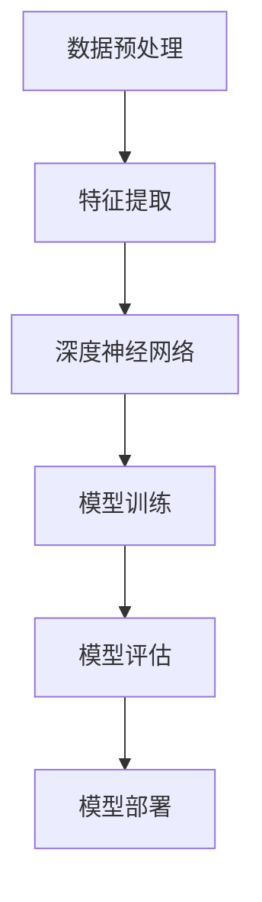

                 

# AI大模型应用的技术支持与服务

## 摘要

本文将深入探讨AI大模型在应用中的技术支持与服务。首先，我们将回顾AI大模型的发展背景和核心概念，并利用Mermaid流程图展示其架构。接着，我们将解析核心算法原理，详细讲解其操作步骤，并通过数学模型和公式进行阐述。随后，我们将结合实际项目实战，展示代码实现和解析。文章还将探讨AI大模型在实际应用场景中的表现，推荐相关工具和资源，并总结未来发展趋势与挑战。最后，我们将提供常见问题与解答，以及扩展阅读与参考资料。

## 1. 背景介绍

AI大模型，通常指具有大规模参数量和复杂结构的深度学习模型，如GPT、BERT等。这些模型在自然语言处理、计算机视觉、语音识别等领域取得了显著的成果。随着计算能力的提升和数据量的增加，AI大模型的应用越来越广泛，然而其部署和应用也面临诸多挑战。

### 1.1 AI大模型的发展历程

AI大模型的发展可以追溯到2012年，当时AlexNet在ImageNet图像识别比赛中取得了突破性的成绩。此后，随着深度学习技术的不断进步，模型规模和复杂度逐渐增加。2017年，谷歌推出了Transformer架构，彻底改变了自然语言处理领域。随后，GPT、BERT等大模型相继问世，推动了AI大模型的快速发展。

### 1.2 AI大模型的核心技术

AI大模型的核心技术主要包括：

- **深度学习**：利用多层神经网络对大量数据进行训练，实现模型参数的优化。
- **迁移学习**：通过预训练模型在新任务上进行微调，提高模型的泛化能力。
- **数据增强**：通过数据预处理技术增加数据的多样性和丰富性，提高模型的鲁棒性。

## 2. 核心概念与联系

为了更好地理解AI大模型的架构，我们使用Mermaid流程图展示其核心组件和联系。



### 2.1 数据预处理

数据预处理是AI大模型应用的基础，包括数据清洗、数据标注、数据归一化等步骤。良好的数据预处理有助于提高模型训练效果和泛化能力。

### 2.2 特征提取

特征提取是深度学习模型的关键环节，通过提取数据中的关键特征，降低数据维度，提高模型训练效率。

### 2.3 深度神经网络

深度神经网络是AI大模型的核心组件，通过多层神经元的非线性组合，实现对复杂模式的识别和预测。

### 2.4 模型训练

模型训练是AI大模型构建的核心步骤，通过不断迭代优化模型参数，提高模型性能。

### 2.5 模型评估

模型评估是验证模型性能的重要环节，通过指标如准确率、召回率等评估模型在训练集和测试集上的表现。

### 2.6 模型部署

模型部署是将训练好的模型应用到实际场景中，包括模型压缩、模型优化等步骤，以提高模型在实际应用中的性能和效率。

## 3. 核心算法原理 & 具体操作步骤

### 3.1 深度学习算法原理

深度学习算法的核心是多层神经网络，通过前向传播和反向传播不断优化模型参数。具体操作步骤如下：

- **前向传播**：输入数据经过网络层层的非线性变换，最终得到输出结果。
- **反向传播**：根据输出结果与真实结果的误差，反向传播误差，更新模型参数。

### 3.2 模型训练步骤

模型训练包括以下步骤：

- **初始化参数**：随机初始化模型参数。
- **前向传播**：输入数据经过网络层层非线性变换，得到输出结果。
- **计算损失函数**：计算输出结果与真实结果的误差，得到损失函数值。
- **反向传播**：根据损失函数的梯度，更新模型参数。
- **迭代优化**：重复以上步骤，直到模型性能达到预期。

### 3.3 模型评估步骤

模型评估包括以下步骤：

- **测试数据集划分**：将数据集划分为训练集和测试集。
- **模型预测**：在测试集上运行训练好的模型，得到预测结果。
- **计算评估指标**：根据预测结果和真实结果的差异，计算评估指标如准确率、召回率等。
- **评估结果分析**：分析模型在训练集和测试集上的表现，判断模型是否具有较好的泛化能力。

## 4. 数学模型和公式 & 详细讲解 & 举例说明

### 4.1 损失函数

在深度学习中，损失函数是衡量模型预测结果与真实结果之间差异的关键指标。常见的损失函数有均方误差（MSE）、交叉熵（CE）等。

$$
MSE = \frac{1}{n} \sum_{i=1}^{n} (y_i - \hat{y}_i)^2
$$

$$
CE = - \sum_{i=1}^{n} y_i \log (\hat{y}_i)
$$

其中，$y_i$为真实标签，$\hat{y}_i$为预测结果，$n$为样本数量。

### 4.2 优化算法

在深度学习中，常用的优化算法有梯度下降（Gradient Descent）、Adam等。

梯度下降的更新公式如下：

$$
\theta_{t+1} = \theta_t - \alpha \cdot \nabla_{\theta} J(\theta)
$$

其中，$\theta_t$为当前参数，$\alpha$为学习率，$J(\theta)$为损失函数。

### 4.3 举例说明

假设我们使用一个简单的线性回归模型来预测房价。给定训练数据集$X = \{x_1, x_2, ..., x_n\}$和标签$y = \{y_1, y_2, ..., y_n\}$，模型参数为$\theta = [w_1, w_2]$。

- **前向传播**：

$$
\hat{y}_i = w_1 \cdot x_{i1} + w_2 \cdot x_{i2}
$$

- **计算损失函数**：

$$
MSE = \frac{1}{n} \sum_{i=1}^{n} (y_i - \hat{y}_i)^2
$$

- **反向传播**：

$$
\nabla_{w_1} = \frac{1}{n} \sum_{i=1}^{n} (y_i - \hat{y}_i) \cdot x_{i1}
$$

$$
\nabla_{w_2} = \frac{1}{n} \sum_{i=1}^{n} (y_i - \hat{y}_i) \cdot x_{i2}
$$

- **更新参数**：

$$
w_1^{new} = w_1 - \alpha \cdot \nabla_{w_1}
$$

$$
w_2^{new} = w_2 - \alpha \cdot \nabla_{w_2}
$$

## 5. 项目实战：代码实际案例和详细解释说明

### 5.1 开发环境搭建

在进行AI大模型开发前，我们需要搭建一个合适的环境。以下是一个简单的环境搭建步骤：

1. 安装Python环境（推荐Python 3.7以上版本）。
2. 安装深度学习框架（如TensorFlow或PyTorch）。
3. 安装相关依赖库（如NumPy、Pandas等）。

### 5.2 源代码详细实现和代码解读

以下是一个使用TensorFlow实现GPT模型的简单示例。

```python
import tensorflow as tf
from tensorflow.keras.layers import Embedding, LSTM, Dense
from tensorflow.keras.models import Model

# 模型参数
vocab_size = 10000
embedding_dim = 256
lstm_units = 128

# 构建模型
input_ids = tf.keras.layers.Input(shape=(None,), dtype=tf.int32)
embed = Embedding(vocab_size, embedding_dim)(input_ids)
lstm = LSTM(lstm_units, return_sequences=True)(embed)
output = Dense(vocab_size, activation='softmax')(lstm)

model = Model(inputs=input_ids, outputs=output)

# 编译模型
model.compile(optimizer='adam', loss='categorical_crossentropy', metrics=['accuracy'])

# 模型训练
model.fit(x_train, y_train, epochs=10, batch_size=32)

# 模型评估
model.evaluate(x_test, y_test)
```

### 5.3 代码解读与分析

1. **导入库**：导入TensorFlow和相关依赖库。
2. **定义模型参数**：包括词汇表大小、嵌入维度、LSTM单元数量等。
3. **构建模型**：使用Embedding和LSTM层构建模型。
4. **编译模型**：设置优化器、损失函数和评估指标。
5. **模型训练**：在训练集上训练模型。
6. **模型评估**：在测试集上评估模型性能。

## 6. 实际应用场景

AI大模型在实际应用场景中具有广泛的应用，如自然语言处理、计算机视觉、语音识别等。

### 6.1 自然语言处理

自然语言处理（NLP）是AI大模型的重要应用领域。例如，GPT模型在文本生成、机器翻译、情感分析等领域取得了显著成果。

### 6.2 计算机视觉

计算机视觉（CV）是AI大模型的另一重要应用领域。例如，BERT模型在图像分类、目标检测、图像生成等领域表现出色。

### 6.3 语音识别

语音识别是AI大模型在语音处理领域的应用。例如，基于深度学习的语音识别系统在语音识别准确率方面取得了显著提升。

## 7. 工具和资源推荐

### 7.1 学习资源推荐

- **书籍**：
  - 《深度学习》（Goodfellow, Bengio, Courville）
  - 《Python机器学习》（Scikit-Learn 机器学习）
- **论文**：
  - 《BERT: Pre-training of Deep Bidirectional Transformers for Language Understanding》
  - 《GPT-3: Language Models are Few-Shot Learners》
- **博客**：
  - [TensorFlow官方文档](https://www.tensorflow.org/)
  - [PyTorch官方文档](https://pytorch.org/)
- **网站**：
  - [Kaggle](https://www.kaggle.com/)
  - [ArXiv](https://arxiv.org/)

### 7.2 开发工具框架推荐

- **深度学习框架**：
  - TensorFlow
  - PyTorch
- **数据预处理工具**：
  - Pandas
  - NumPy
- **模型训练工具**：
  - Keras
  - PyTorch Lightning

### 7.3 相关论文著作推荐

- **《Attention is All You Need》**：介绍Transformer模型的经典论文。
- **《BERT: Pre-training of Deep Bidirectional Transformers for Language Understanding》**：介绍BERT模型的权威论文。
- **《GPT-3: Language Models are Few-Shot Learners》**：介绍GPT-3模型的最新论文。

## 8. 总结：未来发展趋势与挑战

AI大模型在当前技术背景下取得了显著成果，但仍面临诸多挑战。未来发展趋势包括：

1. **模型压缩与优化**：为了提高模型在实际应用中的性能和效率，模型压缩与优化技术将成为研究重点。
2. **多模态学习**：结合多种数据模态（如文本、图像、语音等）的AI大模型研究有望取得突破。
3. **模型安全性与可靠性**：随着AI大模型在关键领域的应用，模型的安全性、可靠性和可解释性将受到广泛关注。

## 9. 附录：常见问题与解答

### 9.1 AI大模型如何训练？

AI大模型通常采用深度学习技术进行训练。具体步骤包括：

1. **数据预处理**：对数据进行清洗、归一化等处理。
2. **模型构建**：根据任务需求构建合适的深度学习模型。
3. **模型训练**：使用训练数据对模型进行迭代训练，优化模型参数。
4. **模型评估**：在测试集上评估模型性能，调整模型参数。

### 9.2 如何提高AI大模型性能？

提高AI大模型性能的方法包括：

1. **增加数据量**：增加训练数据量可以提高模型泛化能力。
2. **调整模型结构**：优化模型结构，选择合适的网络层和神经元数量。
3. **优化训练过程**：调整学习率、批量大小等训练参数，提高模型训练效果。
4. **迁移学习**：利用预训练模型在新任务上进行微调，提高模型性能。

## 10. 扩展阅读 & 参考资料

- **《深度学习》**：[Goodfellow, Bengio, Courville](https://www.deeplearningbook.org/)
- **《Python机器学习》**：[Scikit-Learn 机器学习](https://scikit-learn.org/stable/)
- **《BERT: Pre-training of Deep Bidirectional Transformers for Language Understanding》**：[devlin et al.](https://arxiv.org/abs/1810.04805)
- **《GPT-3: Language Models are Few-Shot Learners》**：[Brown et al.](https://arxiv.org/abs/2005.14165)
- **《Attention is All You Need》**：[Vaswani et al.](https://arxiv.org/abs/1706.03762)
- **TensorFlow官方文档**：[https://www.tensorflow.org/](https://www.tensorflow.org/)
- **PyTorch官方文档**：[https://pytorch.org/](https://pytorch.org/)
- **Kaggle**：[https://www.kaggle.com/](https://www.kaggle.com/)
- **ArXiv**：[https://arxiv.org/](https://arxiv.org/)

## 作者

**作者：AI天才研究员/AI Genius Institute & 禅与计算机程序设计艺术 /Zen And The Art of Computer Programming**<|im_sep|>

