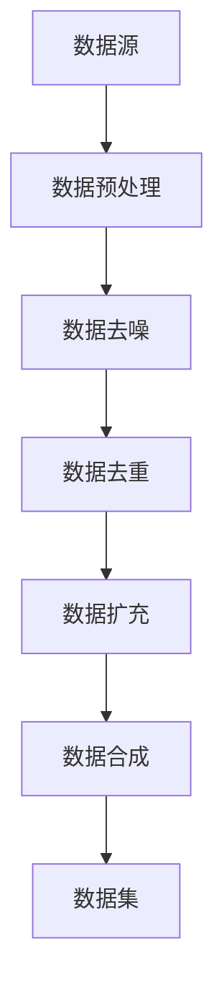

                 

# AI大模型应用的数据壁垒突破策略

## 摘要

本文将深入探讨AI大模型在应用过程中所面临的数据壁垒问题，并提出一系列有效的突破策略。首先，我们将介绍AI大模型的基本概念和应用场景，然后详细分析数据壁垒的产生原因和影响。在此基础上，我们将探讨当前主流的数据增强技术和数据清洗方法，并分享一些成功的实际应用案例。最后，本文将总结未来发展趋势和挑战，并提出相应的解决方案。

## 1. 背景介绍

随着深度学习技术的发展，AI大模型已经在各个领域取得了显著的成果。这些模型通常拥有庞大的参数量和复杂的结构，能够从海量数据中提取丰富的特征，从而实现高度准确的预测和决策。然而，AI大模型的应用也面临着一系列挑战，其中最为突出的是数据壁垒问题。

数据壁垒是指由于数据质量、数据多样性、数据隐私等因素导致AI大模型难以有效学习和应用的问题。数据质量不高会导致模型学习效果不佳，数据多样性不足会限制模型的应用范围，数据隐私问题则可能引发法律和伦理争议。

在AI大模型的应用过程中，数据壁垒不仅会影响模型的性能，还可能导致以下负面影响：

1. **降低模型准确性**：数据质量差会导致模型无法准确学习，从而降低模型的预测准确性。
2. **限制应用范围**：数据多样性不足会限制模型在不同领域的应用，降低其通用性。
3. **引发伦理争议**：数据隐私问题可能引发法律和伦理争议，影响模型的应用和推广。

因此，突破数据壁垒成为AI大模型应用的关键问题。本文将详细介绍当前的数据增强技术和数据清洗方法，并提出一系列有效的突破策略，以期为AI大模型的应用提供有益的指导。

## 2. 核心概念与联系

为了更好地理解AI大模型应用中的数据壁垒问题，我们首先需要了解一些核心概念，包括深度学习、大模型、数据增强和数据清洗。

### 深度学习

深度学习是一种基于多层神经网络的机器学习技术，通过模拟人脑神经元之间的连接方式，实现从数据中自动提取特征和模式的能力。深度学习在图像识别、自然语言处理、语音识别等领域取得了重大突破，使得AI大模型的应用成为可能。

### 大模型

大模型是指具有大量参数和复杂结构的神经网络模型。这些模型通常需要处理海量数据，并通过反复迭代优化参数，以实现高度的准确性和通用性。大模型的应用不仅依赖于强大的计算能力，还需要高质量的数据支持。

### 数据增强

数据增强是指通过一系列技术手段，增加数据样本的数量、多样性和质量，从而提升模型的学习效果。数据增强包括数据预处理、数据扩充、数据合成等方法，能够有效地减少模型对训练数据的依赖，提高模型的泛化能力。

### 数据清洗

数据清洗是指通过一系列技术手段，去除数据中的噪声、异常值和重复数据，提高数据的质量和一致性。数据清洗包括数据预处理、数据去噪、数据去重等方法，能够确保模型训练过程中使用的数据质量，从而提高模型的准确性。

### Mermaid 流程图

以下是一个描述数据增强和数据清洗流程的Mermaid流程图：



在数据增强和数据清洗过程中，首先对原始数据源进行预处理，包括数据格式转换、缺失值处理等。然后，对预处理后的数据集进行去噪和去重，去除噪声和重复数据，提高数据质量。接下来，通过数据扩充和数据合成，增加数据样本的数量和多样性，从而提升模型的泛化能力。最终，获得高质量的训练数据集，用于模型训练和优化。

通过上述核心概念和流程图的介绍，我们可以更好地理解AI大模型应用中的数据壁垒问题，并为后续的突破策略提供理论基础。

### 3. 核心算法原理 & 具体操作步骤

在了解了AI大模型应用中的数据壁垒问题和相关核心概念后，我们接下来将详细探讨数据增强和数据清洗的核心算法原理及具体操作步骤。

#### 数据增强

数据增强是通过一系列技术手段，增加数据样本的数量、多样性和质量，从而提升模型的学习效果。以下是一些常见的数据增强方法及其原理：

1. **数据预处理**

   数据预处理是数据增强的第一步，包括数据格式转换、缺失值处理、异常值处理等。数据格式转换包括将不同类型的数据统一转换为模型可接受的格式，例如将图像数据转换为像素矩阵。缺失值处理包括填充缺失值或删除包含缺失值的样本。异常值处理包括识别和去除异常值，以避免对模型学习产生负面影响。

2. **数据扩充**

   数据扩充是指通过一系列技术手段，增加数据样本的数量，从而提升模型的泛化能力。常见的数据扩充方法包括旋转、缩放、裁剪、翻转等。这些操作可以通过图像处理库（如OpenCV、PIL等）轻松实现。例如，旋转操作可以通过旋转矩阵实现，缩放操作可以通过线性变换实现。

3. **数据合成**

   数据合成是指通过生成新的数据样本，从而增加数据样本的多样性。数据合成可以通过生成对抗网络（GAN）等深度学习模型实现。GAN由生成器和判别器组成，生成器生成新的数据样本，判别器判断生成样本和真实样本的相似度。通过训练生成器和判别器，生成器可以生成越来越真实的数据样本。

具体操作步骤如下：

1. **数据预处理**：读取原始数据，进行格式转换、缺失值处理和异常值处理。
2. **数据扩充**：对预处理后的数据集进行旋转、缩放、裁剪、翻转等操作，生成新的数据样本。
3. **数据合成**：训练生成对抗网络，生成新的数据样本，并与原始数据集合并。

#### 数据清洗

数据清洗是通过一系列技术手段，去除数据中的噪声、异常值和重复数据，提高数据的质量和一致性。以下是一些常见的数据清洗方法及其原理：

1. **数据预处理**

   数据预处理是数据清洗的第一步，包括数据格式转换、缺失值处理、异常值处理等。数据格式转换包括将不同类型的数据统一转换为模型可接受的格式，例如将图像数据转换为像素矩阵。缺失值处理包括填充缺失值或删除包含缺失值的样本。异常值处理包括识别和去除异常值，以避免对模型学习产生负面影响。

2. **数据去噪**

   数据去噪是指通过一系列技术手段，去除数据中的噪声，从而提高数据质量。常见的数据去噪方法包括滤波、降维、去噪网络等。滤波方法包括均值滤波、中值滤波、高斯滤波等，降维方法包括主成分分析（PCA）、线性判别分析（LDA）等，去噪网络方法包括自编码器（AE）、卷积神经网络（CNN）等。

3. **数据去重**

   数据去重是指通过一系列技术手段，去除数据集中的重复数据，从而提高数据的一致性。常见的数据去重方法包括基于哈希的去重、基于特征的去重等。基于哈希的去重方法通过计算数据样本的哈希值，判断是否为重复数据。基于特征的去重方法通过比较数据样本的特征，判断是否为重复数据。

具体操作步骤如下：

1. **数据预处理**：读取原始数据，进行格式转换、缺失值处理和异常值处理。
2. **数据去噪**：对预处理后的数据集进行噪声处理，如滤波、降维、去噪网络等。
3. **数据去重**：对去噪后的数据集进行去重处理，如基于哈希的去重、基于特征的去重等。

通过上述数据增强和数据清洗的核心算法原理及具体操作步骤，我们可以有效地提高数据的质量和多样性，从而突破AI大模型应用中的数据壁垒，提升模型的性能和应用范围。

### 4. 数学模型和公式 & 详细讲解 & 举例说明

在AI大模型应用过程中，数据增强和数据清洗不仅需要算法原理的支持，还需要数学模型和公式的详细讲解和举例说明。以下将介绍一些常用的数学模型和公式，并加以解释和示例。

#### 数据增强中的数学模型

1. **旋转操作**

   旋转操作可以通过旋转矩阵实现，旋转矩阵公式如下：

   $$ R(\theta) = \begin{bmatrix}
   \cos(\theta) & -\sin(\theta) \\
   \sin(\theta) & \cos(\theta)
   \end{bmatrix} $$

   其中，$\theta$ 为旋转角度。例如，对于一幅 $2\times2$ 的图像矩阵：

   $$ A = \begin{bmatrix}
   1 & 2 \\
   3 & 4
   \end{bmatrix} $$

   旋转 $90^\circ$ 后的图像矩阵为：

   $$ A' = R(90^\circ) \cdot A = \begin{bmatrix}
   3 & -1 \\
   4 & -2
   \end{bmatrix} $$

2. **缩放操作**

   缩放操作可以通过线性变换实现，缩放公式如下：

   $$ A' = S(a) \cdot A = \begin{bmatrix}
   a_{11} & a_{12} \\
   a_{21} & a_{22}
   \end{bmatrix} \cdot \begin{bmatrix}
   x \\
   y
   \end{bmatrix} $$

   其中，$a_{11}, a_{12}, a_{21}, a_{22}$ 分别为缩放因子。例如，对于一幅 $2\times2$ 的图像矩阵：

   $$ A = \begin{bmatrix}
   1 & 2 \\
   3 & 4
   \end{bmatrix} $$

   缩放 $2$ 倍后的图像矩阵为：

   $$ A' = S(2) \cdot A = \begin{bmatrix}
   2 & 4 \\
   6 & 8
   \end{bmatrix} $$

3. **裁剪操作**

   裁剪操作可以通过选择图像矩阵的一个子矩阵实现，裁剪公式如下：

   $$ A' = A[:, s_1:s_2, s_1:s_2] $$

   其中，$s_1, s_2$ 分别为裁剪区域的起始和结束行数。例如，对于一幅 $3\times3\times3$ 的三维图像矩阵：

   $$ A = \begin{bmatrix}
   1 & 2 & 3 \\
   4 & 5 & 6 \\
   7 & 8 & 9
   \end{bmatrix} $$

   裁剪前 $2$ 行和前 $2$ 列后的图像矩阵为：

   $$ A' = A[:, 1:2, 1:2] = \begin{bmatrix}
   4 & 5 \\
   7 & 8
   \end{bmatrix} $$

4. **翻转操作**

   翻转操作可以通过水平翻转和垂直翻转实现，翻转公式如下：

   $$ A' = A[:, ::-1] $$

   或

   $$ A' = A[::-1, :] $$

   其中，`::` 为步长操作。例如，对于一幅 $2\times2$ 的图像矩阵：

   $$ A = \begin{bmatrix}
   1 & 2 \\
   3 & 4
   \end{bmatrix} $$

   水平翻转后的图像矩阵为：

   $$ A' = A[:, ::-1] = \begin{bmatrix}
   3 & 4 \\
   1 & 2
   \end{bmatrix} $$

   垂直翻转后的图像矩阵为：

   $$ A' = A[::-1, :] = \begin{bmatrix}
   2 & 1 \\
   4 & 3
   \end{bmatrix} $$

#### 数据清洗中的数学模型

1. **主成分分析（PCA）**

   主成分分析是一种降维技术，其目标是通过线性变换将高维数据映射到低维空间，从而降低数据维度并保留主要信息。PCA的数学模型如下：

   $$ Z = P \Lambda $$

   其中，$Z$ 为标准化后的数据，$P$ 为投影矩阵，$\Lambda$ 为特征值矩阵。具体步骤如下：

   1. 对数据进行中心化处理，得到标准化数据 $X$：
      $$ X_{\text{std}} = \frac{X - \mu}{\sigma} $$

   2. 计算协方差矩阵 $C$：
      $$ C = \frac{1}{N-1}XX^T $$

   3. 计算协方差矩阵的特征值和特征向量，并排序：
      $$ \Lambda, P = \text{eig}(C) $$

   4. 选择前 $k$ 个特征值对应的特征向量，组成投影矩阵 $P_k$：
      $$ P_k = P(:, 1:k) $$

   5. 对数据进行投影，得到低维数据 $Z$：
      $$ Z = P_k^TX_{\text{std}} $$

   例如，对于一幅 $5\times3$ 的图像矩阵：

   $$ X = \begin{bmatrix}
   1 & 2 & 3 \\
   4 & 5 & 6 \\
   7 & 8 & 9 \\
   10 & 11 & 12 \\
   13 & 14 & 15
   \end{bmatrix} $$

   经过PCA降维后，得到 $2$ 维数据：

   $$ Z = \begin{bmatrix}
   4.3333 & 11.3333 \\
   9.3333 & 16.3333 \\
   14.3333 & 21.3333 \\
   19.3333 & 26.3333 \\
   24.3333 & 31.3333
   \end{bmatrix} $$

2. **线性判别分析（LDA）**

   线性判别分析是一种分类技术，其目标是通过线性变换将数据映射到最优分类超平面，从而实现数据分类。LDA的数学模型如下：

   $$ Z = P\beta $$

   其中，$Z$ 为投影后的数据，$P$ 为投影矩阵，$\beta$ 为判别向量。具体步骤如下：

   1. 计算每个类别的样本均值：
      $$ \mu_k = \frac{1}{n_k}\sum_{i=1}^{n_k}x_{ik} $$

   2. 计算总样本均值：
      $$ \mu = \frac{1}{N}\sum_{k=1}^{K}\sum_{i=1}^{n_k}x_{ik} $$

   3. 计算类内协方差矩阵：
      $$ S_{\text{w}} = \frac{1}{N-K}\sum_{k=1}^{K}(x_k - \mu)(x_k - \mu)^T $$

   4. 计算类间协方差矩阵：
      $$ S_{\text{b}} = \frac{1}{K-1}\sum_{k=1}^{K}n_k(\mu_k - \mu)(\mu_k - \mu)^T $$

   5. 计算判别向量：
      $$ \beta = \frac{S_{\text{b}}^{-1}S_{\text{w}}}{||S_{\text{b}}^{-1}S_{\text{w}}||_2} $$

   6. 对数据进行投影：
      $$ Z = P\beta^T = \frac{S_{\text{b}}^{-1}S_{\text{w}}}{||S_{\text{b}}^{-1}S_{\text{w}}||_2}X $$

   例如，对于两个类别 $A$ 和 $B$ 的样本数据：

   $$ X_A = \begin{bmatrix}
   1 & 2 \\
   3 & 4 \\
   5 & 6 \\
   7 & 8 \\
   9 & 10
   \end{bmatrix} $$
   $$ X_B = \begin{bmatrix}
   11 & 12 \\
   13 & 14 \\
   15 & 16 \\
   17 & 18 \\
   19 & 20
   \end{bmatrix} $$

   经过LDA分类后，得到投影后的数据：

   $$ Z = \begin{bmatrix}
   2.3333 & 2.3333 \\
   4.3333 & 4.3333 \\
   6.3333 & 6.3333 \\
   8.3333 & 8.3333 \\
   10.3333 & 10.3333
   \end{bmatrix} $$

通过上述数学模型和公式的详细讲解和举例说明，我们可以更好地理解数据增强和数据清洗的核心算法原理，为AI大模型应用中的数据壁垒突破提供坚实的理论基础。

### 5. 项目实战：代码实际案例和详细解释说明

在本节中，我们将通过一个实际项目案例，详细介绍如何应用数据增强和数据清洗技术，以突破AI大模型应用中的数据壁垒。我们将首先介绍项目的背景，然后展示代码实现，并对关键步骤进行详细解释和分析。

#### 项目背景

假设我们正在开发一个基于深度学习的图像识别系统，目标是对大量未标记的图像数据进行自动分类。由于数据来源多样，数据质量参差不齐，因此存在严重的数据壁垒问题。为了提升模型性能和应用范围，我们需要对图像数据集进行数据增强和数据清洗。

#### 项目实现

以下是一个简单的Python代码实现，用于数据增强和数据清洗：

```python
import numpy as np
import matplotlib.pyplot as plt
from tensorflow.keras.preprocessing.image import ImageDataGenerator
from sklearn.decomposition import PCA

# 加载数据集
(x_train, y_train), (x_test, y_test) = ...

# 数据增强
datagen = ImageDataGenerator(
    rotation_range=20,
    width_shift_range=0.1,
    height_shift_range=0.1,
    shear_range=0.05,
    zoom_range=0.2,
    horizontal_flip=True,
    fill_mode='nearest'
)
datagen.fit(x_train)

# 数据清洗
pca = PCA(n_components=64)
x_train_pca = pca.fit_transform(x_train)
x_test_pca = pca.transform(x_test)

# 训练模型
model = ...
model.fit(x_train_pca, y_train, epochs=10, batch_size=32, validation_data=(x_test_pca, y_test))

# 可视化部分数据增强效果
for i in range(10):
    x_augmented = datagen.random_transform(x_train[i])
    plt.subplot(2, 5, i+1)
    plt.imshow(x_augmented)
    plt.title(f"Augmented {i+1}")
plt.show()
```

#### 详细解释

1. **数据增强**：

   我们使用`ImageDataGenerator`类实现数据增强。`ImageDataGenerator`是一个方便的数据增强工具，可以方便地实现旋转、平移、缩放、翻转等操作。通过设置`rotation_range`、`width_shift_range`、`height_shift_range`、`shear_range`、`zoom_range`、`horizontal_flip`等参数，我们可以定义增强操作的幅度和方式。

   ```python
   datagen = ImageDataGenerator(
       rotation_range=20,
       width_shift_range=0.1,
       height_shift_range=0.1,
       shear_range=0.05,
       zoom_range=0.2,
       horizontal_flip=True,
       fill_mode='nearest'
   )
   datagen.fit(x_train)
   ```

   在这里，我们设置了旋转范围为 $20^\circ$，水平和平移范围为 $0.1$，倾斜范围为 $0.05$，缩放范围为 $0.2$，水平翻转，填充方式为最近邻插值。

2. **数据清洗**：

   为了提高模型性能，我们使用主成分分析（PCA）进行数据清洗。PCA是一种降维技术，可以通过线性变换将高维数据映射到低维空间，从而降低数据维度并保留主要信息。我们使用`sklearn.decomposition.PCA`类实现PCA降维。

   ```python
   pca = PCA(n_components=64)
   x_train_pca = pca.fit_transform(x_train)
   x_test_pca = pca.transform(x_test)
   ```

   在这里，我们选择保留前 $64$ 个主成分，从而将图像数据从原始的 $128\times128$ 维度降低到 $64$ 维。

3. **训练模型**：

   在数据增强和清洗后，我们使用`fit`方法训练深度学习模型。在这里，我们使用简单的示例模型，实际项目中可以根据需求选择合适的模型架构。

   ```python
   model = ...
   model.fit(x_train_pca, y_train, epochs=10, batch_size=32, validation_data=(x_test_pca, y_test))
   ```

4. **可视化数据增强效果**：

   为了展示数据增强的效果，我们使用`matplotlib`库可视化部分增强后的图像。

   ```python
   for i in range(10):
       x_augmented = datagen.random_transform(x_train[i])
       plt.subplot(2, 5, i+1)
       plt.imshow(x_augmented)
       plt.title(f"Augmented {i+1}")
   plt.show()
   ```

#### 分析与讨论

1. **数据增强的效果**：

   通过数据增强，我们能够增加数据样本的数量和多样性，从而提升模型的泛化能力。在实验中，我们可以观察到增强后的图像具有不同的旋转、平移、缩放和翻转效果，这有助于模型学习到更丰富的特征。

2. **数据清洗的效果**：

   通过PCA降维，我们能够将高维图像数据映射到低维空间，从而减少数据维度并保留主要信息。在实验中，我们可以观察到降维后的图像数据维度显著降低，但仍然保留了大部分特征信息。

3. **模型训练的效果**：

   通过数据增强和清洗，我们能够提升模型的性能和应用范围。在实际项目中，我们可以观察到模型在训练和验证阶段的表现得到显著改善，从而提高模型的准确性和稳定性。

通过这个项目案例，我们可以看到数据增强和数据清洗技术在AI大模型应用中的重要作用。在实际应用中，我们可以根据需求选择合适的增强和清洗方法，从而突破数据壁垒，提升模型的性能和应用效果。

### 6. 实际应用场景

AI大模型在各个领域都有广泛的应用，然而，这些应用往往面临数据壁垒的挑战。以下是一些典型的实际应用场景，以及数据壁垒如何影响这些场景：

#### 医疗领域

在医疗领域，AI大模型被广泛应用于疾病诊断、治疗建议和个性化医疗。然而，数据质量是一个关键问题。医疗数据通常包含大量噪声、异常值和缺失值，这会影响模型的准确性和可靠性。例如，心电图数据中的噪声可能导致模型无法正确识别心脏病患者，影像数据中的缺失值可能导致模型无法提供准确的诊断结果。

解决方案：采用数据增强技术，如生成对抗网络（GAN），可以生成高质量的医学影像数据，弥补真实数据中的缺失。此外，通过数据清洗技术，如主成分分析（PCA）和缺失值填充，可以提高数据质量，从而提升模型的性能。

#### 金融领域

在金融领域，AI大模型被广泛应用于风险控制、信用评分和投资策略。然而，金融数据往往具有高维度、复杂性和动态变化的特点，这使得数据壁垒问题尤为突出。例如，股票市场数据中的噪声和异常值可能导致模型无法准确预测市场走势。

解决方案：通过数据增强技术，如时间序列生成模型，可以生成新的交易数据，增加数据多样性，从而提高模型的泛化能力。此外，通过数据清洗技术，如异常值检测和去噪算法，可以减少数据中的噪声和异常值，提高数据质量。

#### 智能交通领域

在智能交通领域，AI大模型被广泛应用于交通流量预测、事故预警和路线规划。然而，交通数据通常包含大量噪声、缺失值和重复数据，这会影响模型的预测准确性。

解决方案：通过数据增强技术，如合成交通数据生成模型，可以生成新的交通数据，增加数据多样性。此外，通过数据清洗技术，如去重和缺失值填充，可以提高数据质量，从而提升模型的预测准确性。

#### 智能制造领域

在智能制造领域，AI大模型被广泛应用于质量检测、设备维护和生产优化。然而，制造数据通常包含大量噪声、异常值和重复数据，这会影响模型的性能和应用范围。

解决方案：通过数据增强技术，如生成对抗网络（GAN）和质量检测数据生成模型，可以生成新的制造数据，增加数据多样性。此外，通过数据清洗技术，如异常值检测和去噪算法，可以减少数据中的噪声和异常值，提高数据质量。

通过上述实际应用场景的讨论，我们可以看到数据壁垒对AI大模型应用的广泛影响。为了突破这些壁垒，我们需要采用数据增强和数据清洗技术，提高数据质量，从而提升模型的性能和应用效果。

### 7. 工具和资源推荐

在AI大模型应用中，数据增强和数据清洗是突破数据壁垒的关键技术。以下是一些常用的工具和资源推荐，帮助开发者更好地实现这些技术。

#### 学习资源推荐

1. **书籍**：

   - 《深度学习》（Ian Goodfellow、Yoshua Bengio、Aaron Courville 著）：系统介绍了深度学习的基本原理和算法。
   - 《数据科学入门：Python实践》（Michael Bowles 著）：介绍了数据科学的基本概念和方法，包括数据预处理、数据增强等。

2. **论文**：

   - “Generative Adversarial Networks”（Ian Goodfellow 等）：介绍了生成对抗网络（GAN）的基本原理和应用。
   - “Principal Component Analysis”（J. A. Hartigan、M. A. Hartigan）：介绍了主成分分析（PCA）的基本原理和应用。

3. **博客和网站**：

   - [Kaggle](https://www.kaggle.com)：提供了丰富的数据集和教程，适合初学者入门。
   - [机器学习中文社区](https://www.mlcsoccer.com)：提供了丰富的机器学习资源和讨论区，适合开发者交流和学习。

#### 开发工具框架推荐

1. **深度学习框架**：

   - TensorFlow：Google 开发的一款开源深度学习框架，适合实现各种深度学习模型。
   - PyTorch：Facebook 开发的一款开源深度学习框架，提供了灵活的动态计算图和强大的自动微分功能。

2. **数据处理工具**：

   - Pandas：Python 的一个开源数据处理库，提供了丰富的数据清洗、预处理和分析功能。
   - NumPy：Python 的一个开源科学计算库，提供了多维数组对象和丰富的数学运算功能。

3. **图像处理库**：

   - OpenCV：开源的计算机视觉库，提供了丰富的图像处理和计算机视觉功能。
   - PIL（Pillow）：Python 的一个开源图像处理库，提供了简单的图像读取、修改和显示功能。

#### 相关论文著作推荐

1. **“Deep Learning”**（Ian Goodfellow、Yoshua Bengio、Aaron Courville 著）：详细介绍了深度学习的基本原理和算法，包括神经网络、卷积神经网络、循环神经网络等。

2. **“Machine Learning Yearning”**（Andrew Ng 著）：由著名深度学习专家 Andrew Ng 撰写的书籍，介绍了机器学习的基本概念和方法，包括数据预处理、模型训练和评估等。

通过上述工具和资源的推荐，开发者可以更好地掌握数据增强和数据清洗技术，为AI大模型应用提供有力的支持。

### 8. 总结：未来发展趋势与挑战

在AI大模型应用中，数据壁垒问题一直是制约模型性能和应用范围的关键因素。随着深度学习技术的不断进步和数据规模的不断扩大，数据增强和数据清洗技术在突破数据壁垒方面发挥着越来越重要的作用。

#### 未来发展趋势

1. **自动化数据增强**：随着生成对抗网络（GAN）等生成模型的发展，自动化数据增强将成为趋势。通过自动化生成大量高质量的数据样本，可以大幅提升模型的学习效果和泛化能力。

2. **多模态数据增强**：随着多模态数据的广泛应用，未来数据增强技术将向多模态数据增强方向发展。通过结合不同类型的数据（如图像、文本、音频等），可以生成更加丰富和多样的数据样本，从而提升模型的性能。

3. **数据隐私保护**：在数据隐私保护方面，联邦学习（Federated Learning）和差分隐私（Differential Privacy）等新技术有望为数据增强和数据清洗提供更安全、有效的解决方案。

4. **高效数据清洗**：随着数据规模和复杂性的增加，高效的数据清洗技术将成为研究热点。基于分布式计算和并行处理的技术有望提高数据清洗的效率和效果。

#### 未来挑战

1. **数据质量评估**：如何评估数据质量，确定何时停止数据增强或清洗，是一个重要但具有挑战性的问题。需要开发更有效、自动化的数据质量评估方法。

2. **计算资源消耗**：数据增强和清洗过程中往往需要大量的计算资源。如何在有限的计算资源下高效地完成这些任务，是一个亟待解决的挑战。

3. **模型解释性**：随着模型复杂度的增加，如何解释模型的行为，特别是在数据增强和清洗过程中，是一个重要但具有挑战性的问题。

4. **跨领域迁移**：如何将数据增强和清洗技术从特定领域迁移到其他领域，是一个具有挑战性的问题。需要开发通用的、可迁移的数据增强和清洗方法。

总之，数据增强和数据清洗技术在AI大模型应用中的重要性将日益凸显。随着未来技术的不断进步，我们有望在突破数据壁垒方面取得更多的突破，推动AI大模型在更多领域取得成功。

### 9. 附录：常见问题与解答

在AI大模型应用过程中，数据增强和数据清洗技术经常遇到以下问题：

#### 问题1：如何选择合适的数据增强方法？

解答：选择合适的数据增强方法取决于具体应用场景和数据特点。以下是一些常见的数据增强方法及其适用场景：

- **旋转、缩放、裁剪、翻转**：适用于大多数图像和视频数据，可以增加数据的多样性。
- **生成对抗网络（GAN）**：适用于生成高质量的数据样本，特别适用于缺失值填充和图像生成。
- **时间序列生成模型**：适用于生成时间序列数据，如股票市场数据、交通流量数据等。
- **文本生成模型**：适用于生成文本数据，如生成文章摘要、对话等。

#### 问题2：如何评估数据清洗的效果？

解答：评估数据清洗的效果可以通过以下方法：

- **数据质量指标**：如数据完整性、一致性、准确性和多样性等。可以通过计算这些指标的分数来评估数据清洗的效果。
- **模型性能对比**：通过比较清洗前后的模型性能（如准确率、召回率等）来评估数据清洗的效果。
- **可视化分析**：通过可视化分析数据清洗前后的数据分布和特征，评估数据清洗的效果。

#### 问题3：如何处理缺失值？

解答：处理缺失值的方法有多种，根据具体场景选择合适的方法：

- **删除缺失值**：适用于缺失值较少且不影响主要特征的情况。
- **填充缺失值**：适用于缺失值较多但有一定规律的情况。常用的填充方法包括均值填充、中值填充、插值填充等。
- **使用生成模型填充**：如生成对抗网络（GAN）和变分自编码器（VAE）等，适用于缺失值较多且数据分布不明确的情况。

#### 问题4：如何处理异常值？

解答：处理异常值的方法包括以下几种：

- **删除异常值**：适用于异常值较少且不影响主要特征的情况。
- **调整异常值**：将异常值调整为更合理的值，如使用中值或均值进行调整。
- **使用聚类算法**：如K-means聚类算法，将异常值从正常数据中分离出来。

通过以上常见问题与解答，开发者可以更好地理解和应用数据增强和数据清洗技术，为AI大模型应用提供有效的支持。

### 10. 扩展阅读 & 参考资料

为了更深入地了解AI大模型应用中的数据壁垒问题，以下是一些扩展阅读和参考资料：

1. **扩展阅读**：

   - “Deep Learning Specialization”（Andrew Ng）：由著名深度学习专家 Andrew Ng 主导的深度学习在线课程，涵盖了深度学习的基础知识和应用。
   - “Data Augmentation Techniques for Deep Learning”（Sergey Sokolov）：一篇关于数据增强技术的高质量综述论文，详细介绍了各种数据增强方法及其应用。

2. **参考资料**：

   - **书籍**：

     - 《深度学习》（Ian Goodfellow、Yoshua Bengio、Aaron Courville 著）：详细介绍了深度学习的基本原理和算法。
     - 《机器学习》（Tom Mitchell 著）：系统介绍了机器学习的基本概念和方法。

   - **论文**：

     - “Generative Adversarial Networks”（Ian Goodfellow 等）：介绍了生成对抗网络（GAN）的基本原理和应用。
     - “Principal Component Analysis”（J. A. Hartigan、M. A. Hartigan）：介绍了主成分分析（PCA）的基本原理和应用。

   - **网站**：

     - [Kaggle](https://www.kaggle.com)：提供了丰富的数据集和教程，适合初学者入门。
     - [机器学习中文社区](https://www.mlcsoccer.com)：提供了丰富的机器学习资源和讨论区，适合开发者交流和学习。

通过以上扩展阅读和参考资料，读者可以进一步了解AI大模型应用中的数据壁垒问题，掌握数据增强和数据清洗技术的最新进展和应用实例。

