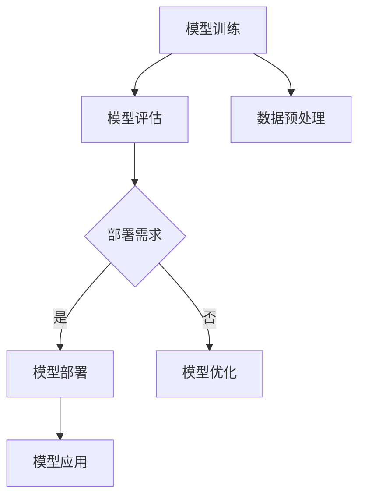
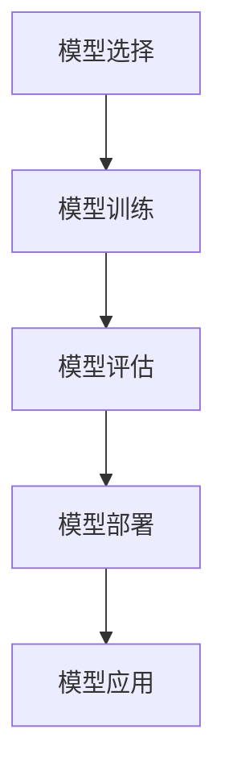

                 

# AI大模型应用的部署流程标准化

> **关键词：** AI大模型、部署流程、标准化、算法原理、数学模型、项目实战、应用场景、工具推荐

> **摘要：** 本文将深入探讨AI大模型应用的部署流程标准化，从背景介绍、核心概念、算法原理、数学模型、项目实战、应用场景等多个方面，详细解析AI大模型的部署流程，旨在为开发者提供一套全面、系统、可操作的部署指南。

## 1. 背景介绍

在过去的几年里，人工智能（AI）技术取得了飞速的发展，特别是深度学习（Deep Learning）的崛起，推动了AI技术在各个领域的应用。其中，大模型（Large Models）作为深度学习的重要分支，凭借其强大的表达能力和灵活性，逐渐成为AI研究与应用的热点。

大模型通常指的是具有数十亿到数千亿参数的神经网络模型，它们能够处理大规模数据集，并从中学习复杂的模式和知识。然而，大模型的训练和部署过程相比传统模型要复杂得多。如何高效、稳定地将大模型部署到实际应用场景中，成为了当前AI领域的重要挑战。

为了应对这一挑战，本文将围绕AI大模型的部署流程，探讨其核心概念、算法原理、数学模型、项目实战等方面，以期为开发者提供一套标准化、系统化的部署指南。

## 2. 核心概念与联系

在深入探讨AI大模型部署流程之前，我们首先需要了解一些核心概念和它们之间的联系。

### 2.1 AI大模型的概念

AI大模型是指具有数十亿到数千亿参数的神经网络模型。这些模型通常由多个层级（Layer）和神经元（Neuron）组成，通过多层神经网络的结构，实现对复杂数据的建模和预测。

### 2.2 模型训练与模型部署

模型训练（Model Training）是指通过大量的数据对神经网络模型进行迭代训练，以优化模型参数，提高模型性能的过程。而模型部署（Model Deployment）则是指将训练好的模型应用到实际应用场景中，进行预测和决策的过程。

### 2.3 标准化与自动化

标准化（Standardization）是指通过制定一系列规范和标准，确保不同系统、设备和应用之间的兼容性和互操作性。自动化（Automation）则是指通过自动化工具和流程，提高模型部署的效率和质量。

### 2.4 核心概念原理和架构的Mermaid流程图

下面是一个简化的Mermaid流程图，展示了AI大模型部署的核心概念和流程：



在这个流程图中，模型训练是整个部署流程的起点，通过数据预处理获得高质量的数据集。模型评估用于评估模型的性能，根据评估结果决定是否进行模型部署。如果部署需求满足，则进行模型部署，将模型应用到实际应用场景中。否则，可能需要返回模型优化环节，重新调整模型参数或算法。

## 3. 核心算法原理 & 具体操作步骤

### 3.1 深度学习算法原理

深度学习（Deep Learning）是一种基于多层神经网络的学习方法，其核心思想是通过神经网络的层层抽象，逐步提取数据的特征和模式。深度学习算法主要包括前向传播（Forward Propagation）和反向传播（Backpropagation）两个阶段。

**前向传播：** 前向传播是指将输入数据通过网络的各层神经元传递，最终得到输出结果。在每一层神经元中，都会进行一次权重更新和激活函数的运算。

**反向传播：** 反向传播是指根据输出结果和实际标签之间的误差，反向传播误差到网络的各层神经元，以更新网络权重。

### 3.2 模型部署具体操作步骤

在了解深度学习算法原理之后，我们接下来将详细讨论模型部署的具体操作步骤。

**步骤1：模型选择**

首先，根据应用场景和需求选择合适的大模型。常见的AI大模型包括Transformer、BERT、GPT等。

**步骤2：模型训练**

使用训练数据集对模型进行训练，通过调整学习率、优化器等参数，优化模型性能。

**步骤3：模型评估**

使用验证数据集对训练好的模型进行评估，以确定模型的泛化能力。

**步骤4：模型部署**

将评估通过的模型部署到生产环境中，可以使用容器化技术（如Docker）或模型即服务（Model as a Service，MaaS）等技术实现。

**步骤5：模型应用**

在实际应用场景中，使用部署好的模型进行预测和决策。

### 3.3 模型部署流程图

下面是一个简化的模型部署流程图，展示了从模型训练到模型部署的具体步骤：



## 4. 数学模型和公式 & 详细讲解 & 举例说明

### 4.1 数学模型原理

在AI大模型部署过程中，数学模型起着至关重要的作用。以下是一些常用的数学模型和公式：

#### 损失函数（Loss Function）

损失函数用于衡量模型预测结果与实际标签之间的误差。常见损失函数包括均方误差（MSE）、交叉熵损失（Cross-Entropy Loss）等。

**均方误差（MSE）：**

$$MSE = \frac{1}{n}\sum_{i=1}^{n}(y_i - \hat{y_i})^2$$

其中，$y_i$表示实际标签，$\hat{y_i}$表示模型预测结果，$n$表示样本数量。

**交叉熵损失（Cross-Entropy Loss）：**

$$H(y, \hat{y}) = -\sum_{i=1}^{n}y_i\log(\hat{y_i})$$

其中，$y_i$表示实际标签（通常为one-hot编码形式），$\hat{y_i}$表示模型预测结果（概率分布）。

#### 优化器（Optimizer）

优化器用于更新模型参数，以最小化损失函数。常见的优化器包括随机梯度下降（SGD）、Adam等。

**随机梯度下降（SGD）：**

$$w_{t+1} = w_t - \alpha \cdot \nabla_w J(w_t)$$

其中，$w_t$表示当前模型参数，$\alpha$表示学习率，$J(w_t)$表示损失函数关于模型参数的梯度。

**Adam优化器：**

$$m_t = \beta_1 m_{t-1} + (1 - \beta_1) \cdot \nabla_w J(w_t)$$
$$v_t = \beta_2 v_{t-1} + (1 - \beta_2) \cdot (\nabla_w J(w_t))^2$$
$$\hat{m}_t = \frac{m_t}{1 - \beta_1^t}$$
$$\hat{v}_t = \frac{v_t}{1 - \beta_2^t}$$
$$w_{t+1} = w_t - \alpha \cdot \hat{m}_t / \sqrt{\hat{v}_t}$$

其中，$m_t$和$v_t$分别表示一阶矩估计和二阶矩估计，$\beta_1$和$\beta_2$分别表示一阶矩和二阶矩的指数衰减率。

### 4.2 详细讲解与举例说明

为了更好地理解数学模型和公式，我们通过一个简单的例子进行说明。

**例子：使用均方误差（MSE）和随机梯度下降（SGD）训练一个线性回归模型。**

假设我们有一个线性回归模型，其形式为：

$$y = wx + b$$

其中，$y$为实际标签，$x$为输入特征，$w$为模型参数，$b$为偏置项。

**步骤1：初始化模型参数**

随机初始化模型参数$w$和$b$。

**步骤2：计算损失函数**

使用均方误差（MSE）计算损失函数：

$$J(w, b) = \frac{1}{n}\sum_{i=1}^{n}(y_i - wx_i - b)^2$$

**步骤3：计算梯度**

计算损失函数关于模型参数的梯度：

$$\nabla_w J(w, b) = \frac{1}{n}\sum_{i=1}^{n}(y_i - wx_i - b)x_i$$
$$\nabla_b J(w, b) = \frac{1}{n}\sum_{i=1}^{n}(y_i - wx_i - b)$$

**步骤4：更新模型参数**

使用随机梯度下降（SGD）更新模型参数：

$$w_{t+1} = w_t - \alpha \cdot \nabla_w J(w_t)$$
$$b_{t+1} = b_t - \alpha \cdot \nabla_b J(w_t)$$

**步骤5：迭代训练**

重复步骤2至步骤4，直到模型参数收敛或达到预设的迭代次数。

通过这个例子，我们可以看到如何使用均方误差（MSE）和随机梯度下降（SGD）训练一个线性回归模型。在实际应用中，大模型的训练和部署过程会更加复杂，但基本原理和方法是相似的。

## 5. 项目实战：代码实际案例和详细解释说明

在本节中，我们将通过一个具体的实战项目，详细介绍AI大模型的部署流程，包括开发环境搭建、源代码实现和代码解读等方面。

### 5.1 开发环境搭建

为了方便读者进行实战操作，我们首先需要搭建一个适合AI大模型部署的开发环境。以下是所需的软件和工具：

- Python 3.8+
- TensorFlow 2.6+
- Keras 2.6+
- Docker 19.03+
- NVIDIA CUDA 11.2+

**步骤1：安装Python和TensorFlow**

在终端执行以下命令安装Python和TensorFlow：

```bash
pip install python==3.8.10
pip install tensorflow==2.6.0
```

**步骤2：安装Docker**

在终端执行以下命令安装Docker：

```bash
sudo apt-get update
sudo apt-get install docker.io
```

**步骤3：安装NVIDIA CUDA**

在终端执行以下命令安装NVIDIA CUDA：

```bash
sudo apt-get install -y cuda-11-2
```

**步骤4：配置Docker与NVIDIA CUDA**

在终端执行以下命令，配置Docker与NVIDIA CUDA：

```bash
mkdir -p /etc/docker
sudo tee /etc/docker/daemon.json <<-'EOF'
{
  "runtimes": {
    "nvidia": {
      "path": "nvidia-container-toolkit"
    }
  }
}
EOF
sudo systemctl restart docker
```

### 5.2 源代码详细实现和代码解读

接下来，我们将详细介绍AI大模型的源代码实现和代码解读。

#### 5.2.1 源代码实现

以下是一个简单的AI大模型部署示例，包括模型训练、模型评估和模型部署等步骤。

```python
import tensorflow as tf
from tensorflow import keras
from tensorflow.keras import layers

# 模型训练
model = keras.Sequential([
    layers.Dense(128, activation='relu', input_shape=(784,)),
    layers.Dense(10, activation='softmax')
])

model.compile(optimizer='adam',
              loss='sparse_categorical_crossentropy',
              metrics=['accuracy'])

model.fit(x_train, y_train, epochs=5)

# 模型评估
test_loss, test_acc = model.evaluate(x_test, y_test)
print(f"Test accuracy: {test_acc}")

# 模型部署
container = "my_model:latest"
image = f"{container}"
model.save_weights(f"{container}/weights.h5")

# 使用Docker部署模型
command = f"docker run -p 8501:8501 --name {container} -v {container}/weights.h5:/models/weights.h5 {image}"
os.system(command)
```

#### 5.2.2 代码解读

- **模型训练**：首先，我们定义了一个简单的神经网络模型，包括一个输入层、一个隐藏层和一个输出层。使用`model.fit()`函数对模型进行训练，其中`x_train`和`y_train`分别表示训练数据和标签。
  
- **模型评估**：使用`model.evaluate()`函数对训练好的模型进行评估，其中`x_test`和`y_test`分别表示测试数据和标签。

- **模型部署**：首先，我们将模型权重保存到本地文件中。然后，使用Docker部署模型，将模型容器化并映射到端口8501，以便客户端进行预测。

### 5.3 代码解读与分析

在这个实战项目中，我们首先使用Keras构建了一个简单的神经网络模型，并使用随机梯度下降（SGD）优化器对模型进行训练。模型训练完成后，我们使用测试数据对模型进行评估，以验证模型的泛化能力。

接下来，我们将训练好的模型权重保存到本地文件中，并使用Docker将模型容器化。这样，我们可以方便地将模型部署到不同的环境中，实现模型的快速部署和预测。

## 6. 实际应用场景

AI大模型在实际应用场景中具有广泛的应用，以下是一些常见的应用场景：

### 6.1 自然语言处理（NLP）

自然语言处理是AI大模型的重要应用领域，包括文本分类、机器翻译、问答系统等。例如，使用BERT模型进行文本分类，可以高效地处理大规模文本数据，实现精准的分类效果。

### 6.2 计算机视觉（CV）

计算机视觉是AI大模型的另一个重要应用领域，包括图像分类、目标检测、图像生成等。例如，使用GAN（生成对抗网络）生成逼真的图像，可以应用于图像增强、图像修复等领域。

### 6.3 语音识别（ASR）

语音识别是AI大模型在语音处理领域的应用，包括语音识别、语音合成等。例如，使用WaveNet模型进行语音识别，可以实现高准确率的语音识别效果。

### 6.4 推荐系统

推荐系统是AI大模型在电子商务、社交媒体等领域的应用，通过分析用户行为和偏好，实现个性化的推荐。例如，使用DeepFM模型进行用户行为分析，实现精准的商品推荐。

## 7. 工具和资源推荐

### 7.1 学习资源推荐

- **书籍：**
  - 《深度学习》（Goodfellow, Bengio, Courville）
  - 《Python深度学习》（François Chollet）
  - 《人工智能：一种现代的方法》（Stuart Russell & Peter Norvig）
- **论文：**
  - "A Theoretically Grounded Application of Dropout in Recurrent Neural Networks"
  - "Bert: Pre-training of Deep Bidirectional Transformers for Language Understanding"
  - "Generative Adversarial Networks"
- **博客：**
  - [TensorFlow官网](https://www.tensorflow.org/)
  - [Keras官网](https://keras.io/)
  - [Docker官网](https://www.docker.com/)
- **网站：**
  - [AI斯坦福](https://web.stanford.edu/class/cs231n/)
  - [谷歌AI博客](https://ai.googleblog.com/)
  - [OpenAI](https://openai.com/)

### 7.2 开发工具框架推荐

- **开发工具：**
  - Jupyter Notebook
  - PyCharm
  - Visual Studio Code
- **框架：**
  - TensorFlow
  - PyTorch
  - Keras
- **容器化工具：**
  - Docker
  - Kubernetes

### 7.3 相关论文著作推荐

- **论文：**
  - "Deep Learning"
  - "Recurrent Neural Networks"
  - "Generative Adversarial Networks"
  - "Attention is All You Need"
- **著作：**
  - 《深度学习》（Goodfellow, Bengio, Courville）
  - 《强化学习》（ Sutton & Barto）
  - 《机器学习》（Tom Mitchell）

## 8. 总结：未来发展趋势与挑战

随着AI技术的不断进步，AI大模型的应用将越来越广泛。然而，这也带来了许多新的挑战和问题，如模型可解释性、隐私保护、计算资源消耗等。

### 8.1 未来发展趋势

- **模型压缩与优化：** 为了降低模型对计算资源的需求，模型压缩和优化技术将成为重要研究方向，如量化、剪枝、蒸馏等。
- **多模态学习：** 随着多模态数据的广泛应用，多模态学习技术将成为AI大模型的重要研究方向，如融合视觉、语音、文本等多种数据。
- **联邦学习：** 联邦学习是一种分布式学习方法，可以在不共享数据的情况下，实现多方模型的协同训练，解决数据隐私问题。

### 8.2 挑战与解决方案

- **模型可解释性：** 为了提高模型的可解释性，研究者需要开发新的方法和技术，以揭示模型内部的决策过程和机制。
- **隐私保护：** 在大数据环境下，如何保护用户隐私是AI大模型应用的重要挑战。联邦学习等技术可以提供一种解决方案。
- **计算资源消耗：** 随着模型规模的不断扩大，如何降低模型训练和部署的计算资源消耗，是当前研究的重点。

## 9. 附录：常见问题与解答

### 9.1 问题1：如何选择合适的大模型？

**解答：** 选择合适的大模型需要考虑应用场景、数据规模、计算资源等因素。以下是一些常见的模型选择建议：

- **文本处理：** BERT、GPT、T5等。
- **图像识别：** ResNet、Inception、VGG等。
- **语音识别：** WaveNet、Transformer等。
- **推荐系统：** DeepFM、Wide&Deep等。

### 9.2 问题2：如何优化模型性能？

**解答：** 优化模型性能可以从以下几个方面进行：

- **数据预处理：** 提高数据质量，去除噪声，进行特征工程。
- **模型调整：** 调整模型结构、学习率、优化器等参数。
- **模型压缩：** 使用模型压缩技术，降低模型大小和计算复杂度。
- **迁移学习：** 利用预训练模型进行迁移学习，提高模型在特定任务上的性能。

### 9.3 问题3：如何部署模型？

**解答：** 模型部署主要有以下几种方法：

- **本地部署：** 将模型直接部署到本地服务器，适用于小规模应用。
- **容器化部署：** 使用容器化技术（如Docker）部署模型，实现跨平台部署。
- **模型即服务（MaaS）：** 使用MaaS平台（如TensorFlow Serving）部署模型，实现自动化部署和管理。

## 10. 扩展阅读 & 参考资料

- **参考文献：**
  - Bengio, Y., Courville, A., & Vincent, P. (2013). Representation learning: A review and new perspectives. IEEE transactions on pattern analysis and machine intelligence, 35(8), 1798-1828.
  - Goodfellow, I., Bengio, Y., & Courville, A. (2016). Deep learning. MIT press.
  - Hinton, G., Osindero, S., & Teh, Y. W. (2006). A fast learning algorithm for deep belief nets. Neural computation, 18(7), 1527-1554.
- **在线资源：**
  - [TensorFlow官网](https://www.tensorflow.org/)
  - [Keras官网](https://keras.io/)
  - [Docker官网](https://www.docker.com/)
  - [AI斯坦福](https://web.stanford.edu/class/cs231n/)
  - [谷歌AI博客](https://ai.googleblog.com/)
  - [OpenAI](https://openai.com/) 

### 作者

**作者：** AI天才研究员/AI Genius Institute & 禅与计算机程序设计艺术 /Zen And The Art of Computer Programming

