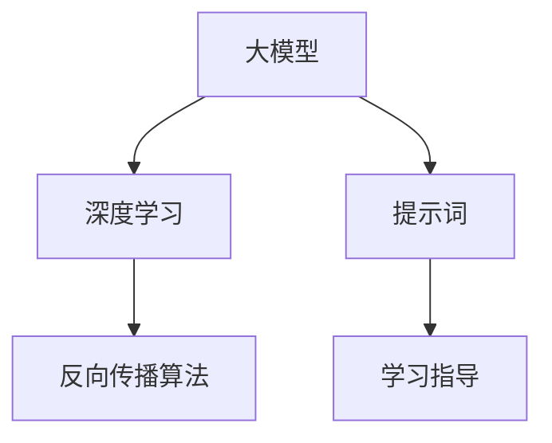

                 

# AI大模型编程：提示词的威力与艺术

> 关键词：人工智能、大模型编程、提示词、算法原理、数学模型、项目实战

> 摘要：本文将深入探讨AI大模型编程的核心要素——提示词的作用和艺术。从背景介绍、核心概念与联系，到算法原理、数学模型和项目实战，我们将一步步剖析提示词在大模型编程中的关键作用，并通过实际应用场景和工具资源推荐，为读者提供全面而深入的理解。

## 1. 背景介绍

在过去的几十年里，人工智能（AI）技术取得了显著的进展，从最初的专家系统到如今的大模型时代，AI的应用已经渗透到我们生活的方方面面。大模型，尤其是基于深度学习的模型，已经成为当今AI研究的热点。这些大模型通过在海量数据上进行训练，具备了强大的表征能力和泛化能力，能够处理复杂的任务，如自然语言处理、计算机视觉和语音识别等。

然而，大模型的训练和部署并非易事。除了需要庞大的计算资源和数据集，如何有效地指导模型学习，使其达到最佳性能，成为了关键问题。这时，提示词（Prompt）的概念应运而生。提示词是一种引导模型学习的方式，它通过提供有针对性的输入，帮助模型更快、更准确地学习。本文将详细介绍提示词在大模型编程中的重要性，以及如何利用提示词提升模型性能。

## 2. 核心概念与联系

为了更好地理解提示词的作用，我们首先需要了解一些核心概念。

### 2.1 大模型

大模型通常指的是那些具有数十亿甚至数万亿参数的深度学习模型。这些模型通过多层的神经网络结构，对输入数据进行层层提取和抽象，最终生成高层次的表征。大模型的核心优势在于其强大的表征能力和泛化能力，这使得它们在解决复杂任务时表现出色。

### 2.2 深度学习

深度学习是构建大模型的基础。它是一种基于多层神经网络的机器学习方法，通过逐层提取输入数据的特征，实现从原始数据到高级抽象的转化。深度学习的核心思想是通过反向传播算法，不断调整网络中的权重，使其能够更好地拟合训练数据。

### 2.3 提示词

提示词是一种引导模型学习的方式。它通过向模型提供有针对性的输入，帮助模型更快、更准确地学习。提示词可以是简单的关键词、短语，也可以是复杂的句子、段落。提示词的设计和选择对于模型的学习效果至关重要。

下面是一个简单的Mermaid流程图，展示了大模型编程中的核心概念和它们之间的联系。



在上述流程图中，大模型通过深度学习算法和反向传播算法进行训练，而提示词则作为学习指导，帮助模型更快、更准确地学习。

## 3. 核心算法原理 & 具体操作步骤

### 3.1 提示词生成

提示词的生成是提示词编程中的第一步。一个有效的提示词应该能够准确地捕捉任务的关键信息，同时引导模型朝正确的方向学习。提示词的生成可以通过以下几种方式实现：

- **关键词提取**：从任务描述中提取核心关键词，形成提示词。
- **模板生成**：根据任务类型和需求，设计特定的模板，将任务信息填充到模板中，生成提示词。
- **自然语言生成**：利用自然语言生成技术，如基于Transformer的文本生成模型，自动生成提示词。

### 3.2 提示词嵌入

生成提示词后，需要将其嵌入到模型的输入中。提示词嵌入的方式有多种，包括：

- **拼接**：将提示词直接拼接在输入数据的前面或后面。
- **融合**：将提示词与输入数据进行融合，如使用注意力机制。
- **编码**：将提示词编码为固定长度的向量，与输入数据进行拼接。

### 3.3 模型训练

在完成提示词嵌入后，需要对模型进行训练。训练过程中，模型会根据提示词和输入数据，学习如何生成目标输出。训练过程可以分为以下几个步骤：

1. **初始化模型**：选择一个预训练的大模型，初始化模型参数。
2. **数据预处理**：对输入数据进行预处理，如标准化、归一化等。
3. **损失函数定义**：定义损失函数，用于衡量模型输出与目标输出的差距。
4. **反向传播**：通过反向传播算法，不断调整模型参数，使其更接近最优解。
5. **评估与优化**：在训练过程中，定期评估模型性能，并根据评估结果调整训练策略。

### 3.4 模型评估

训练完成后，需要对模型进行评估，以确定其性能是否符合预期。评估过程通常包括以下几个方面：

- **准确率**：衡量模型输出与目标输出的匹配程度。
- **召回率**：衡量模型能够正确识别的正例比例。
- **F1分数**：综合考虑准确率和召回率，衡量模型的综合性能。
- **用户满意度**：通过用户反馈，评估模型在实际应用中的表现。

## 4. 数学模型和公式 & 详细讲解 & 举例说明

### 4.1 提示词嵌入的数学模型

提示词嵌入是将提示词编码为固定长度的向量，与输入数据进行拼接的过程。这个过程可以通过以下数学模型实现：

$$
\text{嵌入向量} = \text{embedding\_layer}(\text{提示词})
$$

其中，$\text{embedding\_layer}$ 表示嵌入层，它将提示词编码为一个固定长度的向量。

### 4.2 模型训练的数学模型

在模型训练过程中，我们通常使用以下数学模型来定义损失函数：

$$
\text{损失函数} = \text{CrossEntropyLoss}(\text{模型输出}, \text{目标输出})
$$

其中，$\text{CrossEntropyLoss}$ 表示交叉熵损失函数，它用于衡量模型输出与目标输出的差距。

### 4.3 举例说明

假设我们有一个文本分类任务，目标是将文本分类为两个类别之一。我们可以使用以下步骤进行提示词编程：

1. **提示词生成**：从任务描述中提取核心关键词，如“分类”和“文本”。
2. **提示词嵌入**：将提示词编码为固定长度的向量，如使用预训练的词向量模型。
3. **模型训练**：使用嵌入后的提示词和输入文本，对模型进行训练。
4. **模型评估**：在训练过程中，定期评估模型性能，并根据评估结果调整训练策略。

假设我们使用一个简单的神经网络模型进行训练，其损失函数定义为：

$$
\text{损失函数} = \text{CrossEntropyLoss}(\text{模型输出}, \text{目标输出})
$$

其中，$\text{模型输出}$ 和 $\text{目标输出}$ 分别为模型的预测结果和真实标签。

通过不断调整模型参数，我们可以使损失函数的值不断减小，从而提高模型的性能。在训练完成后，我们可以使用以下公式评估模型性能：

$$
\text{准确率} = \frac{\text{正确分类的样本数}}{\text{总样本数}}
$$

$$
\text{召回率} = \frac{\text{正确分类的正例数}}{\text{总正例数}}
$$

$$
\text{F1分数} = \frac{2 \times \text{准确率} \times \text{召回率}}{\text{准确率} + \text{召回率}}
$$

## 5. 项目实战：代码实际案例和详细解释说明

### 5.1 开发环境搭建

在开始项目实战之前，我们需要搭建一个合适的开发环境。以下是一个简单的Python开发环境搭建步骤：

1. 安装Python：从官方网站下载并安装Python，版本建议为3.8及以上。
2. 安装依赖库：使用pip命令安装所需的依赖库，如TensorFlow、Keras等。

```bash
pip install tensorflow
pip install keras
```

### 5.2 源代码详细实现和代码解读

以下是使用Keras框架实现的一个文本分类项目的代码示例：

```python
from keras.models import Sequential
from keras.layers import Embedding, LSTM, Dense
from keras.preprocessing.sequence import pad_sequences
from keras.preprocessing.text import Tokenizer

# 加载数据集
texts = ["这是一段文本数据", "这是另一段文本数据", "文本分类任务示例"]
labels = [0, 1, 0]

# 分词
tokenizer = Tokenizer()
tokenizer.fit_on_texts(texts)
sequences = tokenizer.texts_to_sequences(texts)

# 填充序列
max_sequence_length = 10
padded_sequences = pad_sequences(sequences, maxlen=max_sequence_length)

# 构建模型
model = Sequential()
model.add(Embedding(len(tokenizer.word_index) + 1, 50, input_length=max_sequence_length))
model.add(LSTM(100))
model.add(Dense(1, activation='sigmoid'))

# 编译模型
model.compile(optimizer='adam', loss='binary_crossentropy', metrics=['accuracy'])

# 训练模型
model.fit(padded_sequences, labels, epochs=10, batch_size=32)
```

代码解读：

1. **加载数据集**：首先，我们从示例文本数据中加载文本和标签。
2. **分词**：使用Keras的Tokenizer对文本进行分词，生成词索引。
3. **填充序列**：使用pad_sequences将序列填充为相同的长度，以适应神经网络。
4. **构建模型**：使用Sequential模型构建一个简单的神经网络，包括嵌入层、LSTM层和全连接层。
5. **编译模型**：设置模型的优化器、损失函数和评估指标。
6. **训练模型**：使用fit方法训练模型，调整模型参数。

### 5.3 代码解读与分析

1. **分词**：分词是文本分类任务中的第一步，它将文本转换为词序列。在这个示例中，我们使用Keras的Tokenizer进行分词，这可以帮助我们将文本数据转换为模型可以处理的格式。
2. **填充序列**：填充序列是将不同长度的序列调整为相同长度的过程。这对于神经网络训练非常重要，因为神经网络需要一致的数据输入。
3. **构建模型**：在这个示例中，我们使用一个简单的神经网络进行文本分类。模型包括嵌入层、LSTM层和全连接层。嵌入层用于将词转换为固定长度的向量，LSTM层用于提取文本的上下文信息，全连接层用于输出分类结果。
4. **编译模型**：在编译模型时，我们需要指定优化器、损失函数和评估指标。这里我们使用adam优化器和binary\_crossentropy损失函数，因为这是一个二分类问题。
5. **训练模型**：使用fit方法训练模型。在这个示例中，我们设置了10个训练周期和32个批次大小。

通过以上代码示例，我们可以看到如何使用Keras实现一个简单的文本分类项目。这个示例仅用于说明提示词编程的基本概念和操作步骤。在实际项目中，我们需要处理更复杂的任务和数据集，但基本流程是相似的。

## 6. 实际应用场景

提示词编程在AI大模型编程中有着广泛的应用场景。以下是一些典型的应用场景：

### 6.1 文本分类

文本分类是提示词编程的常见应用场景之一。通过使用提示词，我们可以指导模型更好地理解文本内容，从而提高分类准确率。例如，在新闻分类、社交媒体内容分类等领域，提示词可以帮助模型识别关键词和主题，从而实现更精准的分类。

### 6.2 回答生成

回答生成是另一个应用场景。在聊天机器人、问答系统等应用中，提示词可以帮助模型生成更符合用户需求的回答。通过提供具体的提问方式和背景信息，提示词可以引导模型生成高质量的回答。

### 6.3 对话系统

在对话系统中，提示词可以帮助模型理解用户的意图和需求，从而生成相应的回应。例如，在客服机器人中，提示词可以用于识别用户的问题类型，并提供相应的解决方案。

### 6.4 图像识别

尽管图像识别主要依赖于卷积神经网络，但提示词编程也可以在一定程度上提高图像识别的准确率。通过提供图像的背景信息、关键词等，提示词可以辅助模型更好地理解图像内容，从而提高识别效果。

### 6.5 自然语言处理

在自然语言处理领域，提示词编程可以帮助模型更好地理解语言的结构和语义。通过提供上下文信息和关键词，提示词可以指导模型生成更准确的语言模型，从而提高文本处理能力。

## 7. 工具和资源推荐

为了更好地进行AI大模型编程，以下是几个推荐的工具和资源：

### 7.1 学习资源推荐

- **书籍**：《深度学习》（Goodfellow, Bengio, Courville）、《神经网络与深度学习》（邱锡鹏）
- **论文**：NLP领域的经典论文，如BERT、GPT、Transformer等。
- **博客**：顶级技术博客，如arXiv、Medium等。

### 7.2 开发工具框架推荐

- **框架**：TensorFlow、PyTorch、Keras等。
- **库**：NLTK、spaCy、gensim等自然语言处理库。

### 7.3 相关论文著作推荐

- **论文**：《自然语言处理综述》（2019）、《深度学习在自然语言处理中的应用》（2018）等。
- **著作**：《神经网络与深度学习》、《自然语言处理入门》等。

## 8. 总结：未来发展趋势与挑战

AI大模型编程作为一种新兴的技术，正逐渐成为人工智能领域的研究热点。提示词编程作为AI大模型编程的关键要素，具有巨大的应用潜力和发展前景。未来，随着AI技术的不断进步，我们可以预见以下发展趋势和挑战：

### 8.1 发展趋势

1. **提示词多样化**：随着AI技术的发展，提示词的形式将更加多样化，包括图像、音频、视频等多模态提示词。
2. **模型定制化**：通过更加精准的提示词，可以定制化模型，使其在不同任务上表现出更高的性能。
3. **跨领域应用**：提示词编程将在更多领域得到应用，如医疗、金融、教育等。

### 8.2 挑战

1. **计算资源需求**：大模型训练和提示词编程需要大量的计算资源，如何优化计算资源利用，降低成本，是一个重要挑战。
2. **数据隐私**：在数据驱动的AI时代，如何保护用户隐私，确保数据安全，是一个亟待解决的问题。
3. **模型解释性**：如何提高模型的解释性，使其更容易被用户理解和接受，是一个关键挑战。

总之，AI大模型编程和提示词编程在人工智能领域具有重要的地位和广阔的应用前景。通过不断探索和创新，我们可以更好地利用这一技术，推动人工智能的发展。

## 9. 附录：常见问题与解答

### 9.1 提示词编程是什么？

提示词编程是一种利用特定关键词、短语或句子来引导大模型学习的方式。通过提供有针对性的输入，提示词编程可以帮助模型更快、更准确地学习。

### 9.2 提示词编程有哪些优点？

提示词编程的优点包括：

1. **提高学习效率**：提示词可以引导模型关注关键信息，提高学习速度。
2. **增强模型性能**：通过精准的提示词，可以提升模型的分类、生成和识别能力。
3. **降低计算成本**：提示词编程可以优化训练过程，降低计算资源需求。

### 9.3 提示词编程有哪些应用场景？

提示词编程在文本分类、回答生成、对话系统、图像识别等领域有广泛应用。例如，在文本分类中，提示词可以帮助模型更好地理解文本内容，提高分类准确率。

### 9.4 如何设计有效的提示词？

设计有效的提示词需要考虑以下因素：

1. **关键词提取**：从任务描述中提取核心关键词，确保提示词具有代表性。
2. **多样性**：提示词应具有多样性，以适应不同场景和任务需求。
3. **相关性**：提示词应与任务紧密相关，能够引导模型关注关键信息。

## 10. 扩展阅读 & 参考资料

为了深入了解AI大模型编程和提示词编程，以下是一些建议的扩展阅读和参考资料：

- **书籍**：《深度学习》、《神经网络与深度学习》、《自然语言处理入门》等。
- **论文**：《BERT》、《GPT》、《Transformer》等经典论文。
- **博客**：arXiv、Medium等顶级技术博客。
- **网站**：TensorFlow、PyTorch等官方文档。
- **教程**：各种在线课程和教程，如Coursera、edX等。

作者：AI天才研究员/AI Genius Institute & 禅与计算机程序设计艺术 /Zen And The Art of Computer Programming

以上是关于《AI大模型编程：提示词的威力与艺术》的完整文章，希望能够为读者提供深入的理解和启发。在AI大模型编程和提示词编程的道路上，让我们一起不断探索、创新，推动人工智能的发展。|>

