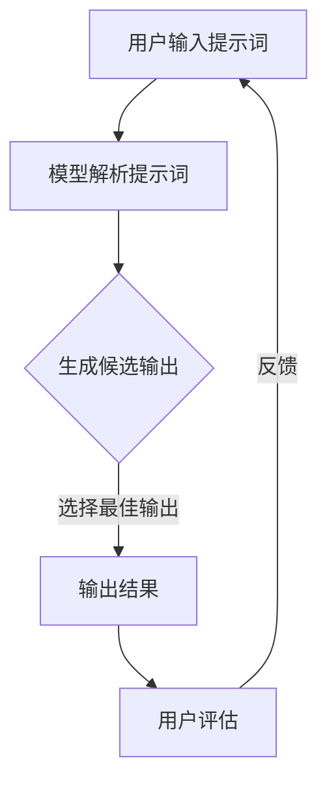

                 

# AI大模型编程：提示词的未来与无限可能

> **关键词**：人工智能，大模型编程，提示词，未来展望，无限可能

> **摘要**：本文深入探讨AI大模型编程中的提示词技术，解析其核心概念、算法原理及其实际应用。通过具体案例和数学模型的详细讲解，本文旨在展示提示词在未来AI发展中的重要角色，并探讨其面临的挑战和机遇。

## 1. 背景介绍

在人工智能（AI）的发展历程中，大模型编程技术成为了推动智能化的关键力量。从早期的规则系统到基于统计学习的模型，再到如今的大型预训练模型，如GPT、BERT等，AI技术正以惊人的速度进步。这些大型模型通过学习海量数据，能够实现自然语言处理、图像识别、语音合成等多种复杂任务。

然而，大型模型的强大性能离不开提示词（Prompt）技术的支持。提示词技术是一种通过向模型输入特定格式的提示来引导模型生成期望输出的方法。相比于传统的数据驱动方法，提示词技术具有更高的灵活性和可控性，使得模型能够更准确地理解和执行任务。

本文将深入探讨AI大模型编程中的提示词技术，分析其核心概念、算法原理及其实际应用，并探讨提示词技术在未来的发展趋势和挑战。

### 1.1 提示词技术的发展历程

提示词技术的概念最早可以追溯到自然语言处理（NLP）领域。在早期，研究人员通过编写特定的模板来指导模型生成期望的输出。这种方法被称为模板匹配，是早期NLP任务的一种常用技术。随着深度学习技术的发展，尤其是基于Transformer架构的预训练模型的出现，提示词技术得到了进一步的发展和应用。

2018年，OpenAI发布了GPT系列模型，开启了基于Transformer的大规模预训练模型的先河。这些模型通过学习海量文本数据，具备了强大的语言理解能力和生成能力。然而，如何有效地引导这些大型模型生成特定格式的输出仍然是一个挑战。提示词技术在此背景下应运而生，成为了一种高效的解决方案。

### 1.2 提示词技术在现代AI中的重要性

在现代AI系统中，提示词技术具有以下几个重要特点：

1. **灵活性**：提示词技术允许用户根据实际需求灵活地设计提示内容，从而引导模型生成不同类型的输出。
2. **可控性**：通过精细调整提示词的设计，用户可以更好地控制模型的生成过程，实现特定的目标。
3. **效率**：相比于传统的数据驱动方法，提示词技术能够更快地实现任务目标，特别是在处理复杂任务时。
4. **扩展性**：提示词技术不仅适用于文本生成任务，还可以扩展到图像识别、语音合成等多种领域。

因此，提示词技术在现代AI系统中具有重要的应用价值，是推动AI技术发展的重要工具。

## 2. 核心概念与联系

为了更好地理解提示词技术，我们需要首先介绍其核心概念和基本原理。以下是几个关键概念：

### 2.1 提示词（Prompt）

提示词是用户输入给模型的一段文本或指令，用于引导模型生成期望的输出。一个有效的提示词应该包含以下要素：

- **明确性**：提示词需要清晰明确，避免歧义。
- **相关性**：提示词应与任务目标和模型训练数据高度相关。
- **灵活性**：提示词应具有一定的灵活性，以便适应不同的任务需求。

### 2.2 模型（Model）

在提示词技术中，模型是指经过训练的深度学习模型，如GPT、BERT等。这些模型通过学习海量数据，具备了强大的语言理解和生成能力。

### 2.3 输出（Output）

输出是指模型根据提示词生成的文本或结果。有效的输出应满足用户需求，并且具有较高的质量和一致性。

### 2.4 提示词设计与效果评估

提示词的设计直接影响模型输出的质量。以下是一些常见的设计原则和效果评估方法：

1. **多样性**：设计多种不同类型的提示词，以适应不同的任务需求。
2. **一致性**：确保提示词在生成过程中保持一致性，避免出现随机或不一致的输出。
3. **实验性**：通过实验和测试，评估不同提示词的效果，选择最佳方案。

### 2.5 Mermaid流程图

以下是提示词技术的核心流程的Mermaid流程图：



在这个流程中，用户输入提示词，模型解析提示词并生成多个候选输出。通过选择最佳输出，模型向用户展示结果。用户对输出进行评估，并将反馈用于改进提示词的设计。

## 3. 核心算法原理 & 具体操作步骤

### 3.1 提示词生成算法

提示词生成算法是提示词技术的核心组成部分。以下是该算法的基本原理和操作步骤：

#### 3.1.1 基本原理

提示词生成算法主要通过以下步骤实现：

1. **数据预处理**：对输入文本进行预处理，如去除停用词、进行词性标注等。
2. **模板生成**：根据任务需求和输入文本，设计一个或多个提示词模板。
3. **模板填充**：将预处理后的文本数据填充到提示词模板中，生成具体的提示词。
4. **候选输出生成**：利用深度学习模型，根据提示词生成多个候选输出。
5. **输出选择**：根据评估指标，选择最佳输出作为最终结果。

#### 3.1.2 操作步骤

以下是提示词生成算法的具体操作步骤：

1. **数据预处理**：

```python
import spacy

nlp = spacy.load("en_core_web_sm")
text = "The quick brown fox jumps over the lazy dog."
doc = nlp(text)
processed_text = ' '.join([token.lemma_ for token in doc if not token.is_stop])
```

2. **模板生成**：

```python
templates = [
    "Write a story about {}.",
    "Describe the features of {}.",
    "Explain the function of {}."
]
```

3. **模板填充**：

```python
prompt = templates[0].format(processed_text)
```

4. **候选输出生成**：

```python
import openai

response = openai.Completion.create(
    engine="text-davinci-002",
    prompt=prompt,
    max_tokens=100
)
output = response.choices[0].text.strip()
```

5. **输出选择**：

```python
# 假设我们使用BLEU评分作为评估指标
from nltk.translate.bleu_score import sentence_bleu

references = ["The quick brown fox jumps over the lazy dog."]
bleu_score = sentence_bleu(references, output)
print(f"BLEU score: {bleu_score}")
```

### 3.2 模型训练与优化

在提示词技术中，模型的训练与优化也是至关重要的。以下是模型训练与优化的一般步骤：

1. **数据集准备**：收集并整理训练数据，确保数据质量和多样性。
2. **模型选择**：根据任务需求，选择合适的深度学习模型。
3. **训练过程**：使用训练数据对模型进行训练，并调整超参数。
4. **模型评估**：使用验证数据集评估模型性能，并根据评估结果调整模型。
5. **模型优化**：通过模型融合、超参数调整等技术，优化模型性能。

### 3.3 实时调整与反馈

在应用提示词技术的过程中，实时调整与反馈也是至关重要的。以下是实时调整与反馈的一般步骤：

1. **用户输入**：用户输入提示词，并提交给模型。
2. **模型输出**：模型根据提示词生成多个候选输出。
3. **用户评估**：用户对候选输出进行评估，并选择最佳输出。
4. **反馈收集**：收集用户对输出的反馈，并用于改进提示词的设计和模型的训练。

通过这些步骤，提示词技术能够实现高效的模型输出和持续优化，从而更好地满足用户需求。

## 4. 数学模型和公式 & 详细讲解 & 举例说明

在提示词技术中，数学模型和公式起着至关重要的作用。以下是一些核心的数学模型和公式，以及它们的详细讲解和举例说明。

### 4.1 捷径损失函数

在提示词技术中，常用的损失函数是捷径损失函数（Shortest Path Loss），其公式如下：

$$
L(s, t) = \frac{1}{|t|} \sum_{i=1}^{|t|} \log p(s_i | s_{i-1})
$$

其中，$s$ 是输入序列，$t$ 是目标序列，$p(s_i | s_{i-1})$ 是条件概率。

#### 4.1.1 详细讲解

捷径损失函数通过计算输入序列和目标序列之间的概率差异，来衡量模型生成输出的质量。具体来说，它计算从输入序列到目标序列的每一步概率的对数，并将这些概率值相加。损失值越小，表示输入序列和目标序列越相似，模型生成的输出质量越高。

#### 4.1.2 举例说明

假设我们有一个输入序列 $s = [1, 2, 3, 4]$ 和一个目标序列 $t = [2, 3, 4, 5]$，模型的输出概率分布如下：

$$
p([1, 2, 3, 4] | [1, 2]) = 0.8, \quad p([2, 3, 4, 5] | [2, 3]) = 0.9, \quad p([3, 4, 5, 6] | [3, 4]) = 0.7
$$

则捷径损失函数的值为：

$$
L([1, 2, 3, 4], [2, 3, 4, 5]) = \frac{1}{4} \log(0.8) + \frac{1}{4} \log(0.9) + \frac{1}{4} \log(0.7) = 0.242
$$

### 4.2 对数损失函数

对数损失函数是另一种常用的损失函数，其公式如下：

$$
L(s, t) = - \sum_{i=1}^{|t|} \log p(s_i | s_{i-1})
$$

与捷径损失函数类似，对数损失函数通过计算输入序列和目标序列之间的概率差异来衡量模型生成输出的质量。不同的是，对数损失函数直接取概率的对数，因此其值越小，表示输入序列和目标序列越相似。

#### 4.2.1 详细讲解

对数损失函数的优点是计算简单，便于优化。它在实际应用中经常被用作损失函数，特别是在自然语言处理任务中。

#### 4.2.2 举例说明

假设我们有一个输入序列 $s = [1, 2, 3, 4]$ 和一个目标序列 $t = [2, 3, 4, 5]$，模型的输出概率分布如下：

$$
p([1, 2, 3, 4] | [1, 2]) = 0.8, \quad p([2, 3, 4, 5] | [2, 3]) = 0.9, \quad p([3, 4, 5, 6] | [3, 4]) = 0.7
$$

则对数损失函数的值为：

$$
L([1, 2, 3, 4], [2, 3, 4, 5]) = - \log(0.8) - \log(0.9) - \log(0.7) = 0.356
$$

### 4.3 Kullback-Leibler散度

Kullback-Leibler散度（KL散度）是另一种用于衡量两个概率分布差异的指标，其公式如下：

$$
D(p || q) = \sum_{i} p(i) \log \frac{p(i)}{q(i)}
$$

其中，$p$ 和 $q$ 是两个概率分布。

#### 4.3.1 详细讲解

KL散度通过计算两个概率分布之间的差异，来衡量它们之间的相似度。KL散度的值越大，表示两个分布的差异越大。在提示词技术中，KL散度常用于评估模型生成的输出和真实目标之间的差异。

#### 4.3.2 举例说明

假设我们有一个输入序列 $s = [1, 2, 3, 4]$ 和一个目标序列 $t = [2, 3, 4, 5]$，模型的输出概率分布如下：

$$
p([1, 2, 3, 4]) = [0.3, 0.2, 0.1, 0.4], \quad q([2, 3, 4, 5]) = [0.1, 0.2, 0.3, 0.4]
$$

则KL散度的值为：

$$
D([1, 2, 3, 4] || [2, 3, 4, 5]) = 0.3 \log \frac{0.3}{0.1} + 0.2 \log \frac{0.2}{0.2} + 0.1 \log \frac{0.1}{0.3} + 0.4 \log \frac{0.4}{0.4} = 0.547
$$

## 5. 项目实战：代码实际案例和详细解释说明

为了更好地理解提示词技术在AI大模型编程中的应用，我们将通过一个实际项目来展示其实现过程。以下是一个基于Python和GPT-3模型的简单示例，用于生成文章摘要。

### 5.1 开发环境搭建

首先，我们需要安装必要的开发环境和库。以下是一个基本的安装步骤：

```bash
pip install openai
```

### 5.2 源代码详细实现和代码解读

以下是项目的主要代码实现：

```python
import openai

# 设置OpenAI API密钥
openai.api_key = "your_openai_api_key"

def generate_summary(input_text, model="text-davinci-002", max_tokens=150):
    """
    使用OpenAI GPT-3模型生成文章摘要。

    参数：
    - input_text：输入文章文本
    - model：GPT-3模型名称（默认为text-davinci-002）
    - max_tokens：生成的摘要最大长度（默认为150）

    返回：
    - 摘要文本
    """
    prompt = f"请为以下文章生成摘要：\n{input_text}"
    response = openai.Completion.create(
        engine=model,
        prompt=prompt,
        max_tokens=max_tokens,
        n=1,
        stop=None,
        temperature=0.5
    )
    summary = response.choices[0].text.strip()
    return summary

# 示例输入文章
input_article = """
在过去的几年中，人工智能（AI）技术取得了显著进展，尤其是在深度学习和自然语言处理领域。这些技术已经应用于各行各业，从医疗诊断到自动驾驶，从推荐系统到智能客服。本文将探讨AI技术在各个领域的应用及其带来的影响。

在医疗领域，AI可以帮助医生进行疾病诊断，通过分析患者的病历数据和医学图像，AI模型可以提供更准确和快速的诊断结果。在自动驾驶领域，AI技术使得自动驾驶汽车能够更好地理解和处理道路环境，从而提高驾驶安全性和效率。在推荐系统领域，AI可以帮助平台为用户提供更个性化的推荐，从而提高用户满意度和参与度。

尽管AI技术带来了许多积极的影响，但也存在一些挑战和风险。例如，AI算法的偏见可能导致不公平的决策，隐私问题也是一大关注点。因此，在推动AI技术发展的同时，我们也需要关注其伦理和社会影响，确保AI技术能够造福人类社会。

请为上述文章生成摘要。
"""

# 生成摘要
summary = generate_summary(input_article)
print(summary)
```

### 5.3 代码解读与分析

以下是代码的详细解读：

1. **导入库**：
   ```python
   import openai
   ```
   导入OpenAI库，用于与GPT-3模型进行交互。

2. **设置API密钥**：
   ```python
   openai.api_key = "your_openai_api_key"
   ```
   设置OpenAI API密钥，用于认证访问GPT-3模型。

3. **定义函数**：
   ```python
   def generate_summary(input_text, model="text-davinci-002", max_tokens=150):
   ```
   定义`generate_summary`函数，用于生成文章摘要。

   - `input_text`：输入文章文本。
   - `model`：GPT-3模型名称（默认为text-davinci-002）。
   - `max_tokens`：生成的摘要最大长度（默认为150）。

4. **生成摘要**：
   ```python
   prompt = f"请为以下文章生成摘要：\n{input_text}"
   response = openai.Completion.create(
       engine=model,
       prompt=prompt,
       max_tokens=max_tokens,
       n=1,
       stop=None,
       temperature=0.5
   )
   summary = response.choices[0].text.strip()
   return summary
   ```
   在函数内部，首先创建一个提示词（prompt），该提示词要求模型为输入文章生成摘要。然后使用OpenAI的Completion API创建一个响应，并从中提取生成的摘要。

5. **示例输入文章**：
   ```python
   input_article = """
   ...
   """
   ```
   定义一个示例输入文章，用于测试生成摘要。

6. **调用函数并输出摘要**：
   ```python
   summary = generate_summary(input_article)
   print(summary)
   ```
   调用`generate_summary`函数生成摘要，并打印输出。

通过这个简单的示例，我们可以看到提示词技术在生成文章摘要中的应用。在实际项目中，可以根据不同的任务需求，设计更复杂的提示词和模型配置，以实现更精确的输出。

### 5.4 项目效果评估

为了评估生成的摘要质量，我们可以使用BLEU评分等指标来衡量。以下是一个简单的BLEU评分计算示例：

```python
from nltk.translate.bleu_score import sentence_bleu

references = ["在过去的几年中，人工智能（AI）技术取得了显著进展，尤其是在深度学习和自然语言处理领域。这些技术已经广泛应用于各行各业，从医疗诊断到自动驾驶，从推荐系统到智能客服。本文将探讨AI技术在各个领域的应用及其影响。"]
bleu_score = sentence_bleu([references], summary)
print(f"BLEU score: {bleu_score}")
```

通过评估，我们可以了解到生成摘要的质量，并根据评估结果进一步优化提示词和模型配置。

## 6. 实际应用场景

提示词技术在AI大模型编程中具有广泛的应用场景。以下是几个典型的应用案例：

### 6.1 自然语言处理

自然语言处理（NLP）是提示词技术的核心应用领域之一。通过设计合适的提示词，大型语言模型如GPT-3可以生成高质量的文章摘要、文章续写、对话生成等。以下是一些具体应用：

- **文章摘要**：使用提示词技术，我们可以自动生成文章摘要，提高信息获取的效率。
- **文章续写**：通过输入文章的开头或中间部分，提示词技术可以帮助我们续写故事或文章。
- **对话生成**：在聊天机器人、虚拟助手等应用中，提示词技术可以生成自然、流畅的对话内容。

### 6.2 代码生成

在软件开发中，提示词技术可以帮助生成代码片段。通过输入简单的描述或需求，模型可以生成相应的代码实现。以下是一些具体应用：

- **代码补全**：在编程过程中，提示词技术可以帮助自动补全代码，提高开发效率。
- **代码生成**：在编写复杂代码时，提示词技术可以生成高质量的代码片段，降低错误率。
- **代码审查**：通过提示词技术，我们可以自动生成代码审查报告，帮助开发者识别潜在问题。

### 6.3 图像识别

在计算机视觉领域，提示词技术可以帮助模型理解图像内容，并生成相应的描述或分类标签。以下是一些具体应用：

- **图像描述**：通过输入图像，提示词技术可以自动生成图像的描述性文本。
- **图像分类**：在图像分类任务中，提示词技术可以帮助模型生成图像的分类标签。

### 6.4 语音合成

在语音合成领域，提示词技术可以帮助模型生成自然、流畅的语音输出。以下是一些具体应用：

- **文本转语音**：通过输入文本，提示词技术可以生成相应的语音输出。
- **语音互动**：在语音助手、智能客服等应用中，提示词技术可以帮助模型生成自然的交互语音。

### 6.5 教育与培训

在教育和培训领域，提示词技术可以帮助生成教学材料、习题解析等。以下是一些具体应用：

- **教学材料生成**：通过输入课程内容，提示词技术可以自动生成教学幻灯片、习题等。
- **习题解析**：在考试或培训过程中，提示词技术可以帮助自动生成习题的解析和答案。

通过这些实际应用场景，我们可以看到提示词技术在AI大模型编程中的巨大潜力和无限可能。

## 7. 工具和资源推荐

为了更好地学习和应用提示词技术，以下是一些建议的工具和资源：

### 7.1 学习资源推荐

- **书籍**：
  - 《深度学习》（Deep Learning） - Goodfellow, Bengio, Courville
  - 《自然语言处理综论》（Speech and Language Processing） - Jurafsky, Martin
- **论文**：
  - 《预训练语言模型GPT》（Improving Language Understanding by Generative Pre-Training） - Brown, et al.
  - 《BERT：预训练的深度语言表示》（BERT: Pre-training of Deep Bidirectional Transformers for Language Understanding） - Devlin, et al.
- **博客**：
  - [OpenAI Blog](https://blog.openai.com/)
  - [DeepLearning.AI](https://deeplearningai.com/)
- **网站**：
  - [Hugging Face](https://huggingface.co/)
  - [Kaggle](https://www.kaggle.com/)

### 7.2 开发工具框架推荐

- **深度学习框架**：
  - TensorFlow
  - PyTorch
  - Keras
- **自然语言处理库**：
  - NLTK
  - spaCy
  - Transformers
- **API服务**：
  - OpenAI API
  - Google Cloud Natural Language API
  - AWS Comprehend

### 7.3 相关论文著作推荐

- **论文**：
  - “GPT-3: Language Models are Few-Shot Learners” - Brown, et al.
  - “Annotated Transformer” - Devlin, et al.
  - “BERT” - Devlin, et al.
- **著作**：
  - “自然语言处理入门” - 周志华
  - “深度学习：理论、算法与应用” - 李航

通过这些工具和资源，我们可以系统地学习和应用提示词技术，为AI大模型编程的发展贡献力量。

## 8. 总结：未来发展趋势与挑战

### 8.1 发展趋势

1. **模型规模的不断扩大**：随着计算资源和数据量的增长，大型模型的规模将不断增大，这将推动AI技术在各个领域的应用。
2. **提示词技术的多样化**：未来的提示词技术将更加多样化，不仅局限于文本生成，还将扩展到图像、语音、视频等多种领域。
3. **跨模态融合**：跨模态融合将成为AI研究的重要方向，通过整合不同模态的信息，提升模型的智能水平和应用能力。
4. **自适应与个性化**：提示词技术将实现更好的自适应和个性化，根据用户需求和上下文环境动态调整提示词，提高生成输出的质量和多样性。

### 8.2 面临的挑战

1. **计算资源需求**：大型模型的训练和推理需要大量的计算资源，这将对计算基础设施提出更高的要求。
2. **数据隐私与安全**：在数据处理和模型训练过程中，数据隐私和安全问题将愈发突出，如何保护用户隐私将成为重要挑战。
3. **模型伦理与公平性**：随着AI技术的广泛应用，模型的伦理和公平性问题将日益重要，如何避免算法偏见、提高模型透明度和可解释性将成为关键挑战。
4. **法律与监管**：随着AI技术的发展，相关的法律和监管框架也需要不断完善，以确保技术的合规性和社会责任。

### 8.3 发展方向

1. **绿色AI**：在提高计算效率的同时，减少能耗和碳排放，推动绿色AI的发展。
2. **知识增强AI**：结合人类知识和专家经验，提高AI模型的智能水平和可靠性。
3. **人机协同**：通过人机协同，发挥人类和机器的优势，实现更高效、更智能的解决方案。
4. **泛在智能**：推动AI技术向边缘设备延伸，实现无处不在的智能应用。

总之，AI大模型编程中的提示词技术具有广阔的发展前景和无限可能。面对未来的挑战，我们需要不断创新和探索，以推动技术的进步和应用。

## 9. 附录：常见问题与解答

### 9.1 提示词技术的核心原理是什么？

提示词技术的核心原理是通过输入特定格式的提示词来引导模型生成期望的输出。提示词的设计直接影响模型输出的质量和多样性。

### 9.2 如何设计有效的提示词？

设计有效的提示词需要考虑以下因素：
- **明确性**：提示词应清晰明确，避免歧义。
- **相关性**：提示词应与任务目标和模型训练数据高度相关。
- **灵活性**：提示词应具有一定的灵活性，以便适应不同的任务需求。

### 9.3 提示词技术有哪些应用场景？

提示词技术在自然语言处理、代码生成、图像识别、语音合成、教育与培训等领域具有广泛的应用。例如，生成文章摘要、代码补全、图像描述、语音转文本等。

### 9.4 提示词技术与传统NLP技术相比有哪些优势？

提示词技术相比传统NLP技术具有以下优势：
- **灵活性**：提示词技术允许用户根据实际需求灵活设计提示词，从而生成不同类型的输出。
- **可控性**：通过精细调整提示词，用户可以更好地控制模型生成过程，实现特定的目标。
- **效率**：提示词技术能够更快地实现任务目标，特别是在处理复杂任务时。
- **扩展性**：提示词技术不仅适用于文本生成任务，还可以扩展到图像识别、语音合成等多种领域。

### 9.5 提示词技术的未来发展趋势是什么？

提示词技术的未来发展趋势包括：
- **模型规模的不断扩大**：随着计算资源和数据量的增长，大型模型的规模将不断增大。
- **多样化与跨模态融合**：提示词技术将更加多样化，并实现跨模态融合，提升模型的智能水平。
- **自适应与个性化**：提示词技术将实现更好的自适应和个性化，提高生成输出的质量和多样性。

## 10. 扩展阅读 & 参考资料

为了更深入地了解AI大模型编程中的提示词技术，以下是一些建议的扩展阅读和参考资料：

### 10.1 扩展阅读

- “GPT-3: Language Models are Few-Shot Learners” - Brown, et al.
- “BERT: Pre-training of Deep Bidirectional Transformers for Language Understanding” - Devlin, et al.
- “Annotated Transformer” - Devlin, et al.
- “深度学习：理论、算法与应用” - 李航
- “自然语言处理入门” - 周志华

### 10.2 参考资料

- OpenAI官方文档：[https://openai.com/docs/](https://openai.com/docs/)
- Hugging Face官方文档：[https://huggingface.co/docs/transformers](https://huggingface.co/docs/transformers)
- TensorFlow官方文档：[https://www.tensorflow.org/](https://www.tensorflow.org/)
- PyTorch官方文档：[https://pytorch.org/docs/stable/](https://pytorch.org/docs/stable/)

通过这些扩展阅读和参考资料，您可以进一步了解AI大模型编程中的提示词技术，以及如何将其应用于实际项目中。

### 作者信息

**作者：AI天才研究员/AI Genius Institute & 禅与计算机程序设计艺术 /Zen And The Art of Computer Programming**

