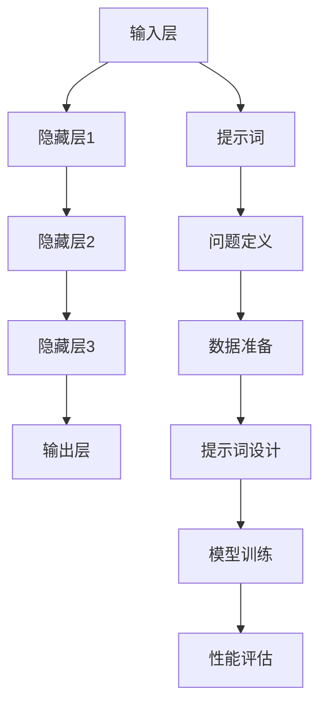

                 

# AI大模型编程：提示词的潜力与魔力

## 关键词：AI大模型，编程，提示词，算法，数学模型，应用场景

### 摘要

本文旨在探讨AI大模型编程中提示词的潜力和作用。通过深入分析大模型的架构、核心算法原理以及具体操作步骤，我们将揭示提示词在提升模型性能和泛化能力方面的重要性。同时，本文还将通过实际案例和数学模型的应用，阐述如何利用提示词优化大模型编程，并探讨其在各种应用场景中的实际效果。最后，本文将对未来的发展趋势和挑战进行总结，为读者提供有价值的参考。

## 1. 背景介绍

随着深度学习技术的迅猛发展，AI大模型已经成为了现代人工智能领域的重要研究方向。大模型具有强大的建模能力和广泛的适用性，能够处理复杂数据和分析大规模问题。然而，大模型的编程和优化并非易事，其中提示词（Prompt Engineering）成为了一个关键的技术点。

提示词是指用于引导模型理解问题背景、输入数据和输出结果的一系列关键词或短语。通过巧妙地设计提示词，可以有效地提升大模型的性能和泛化能力，从而实现更准确的预测和更高效的任务处理。

近年来，随着自然语言处理技术的进步，提示词在大模型编程中的应用越来越广泛。例如，在文本分类、问答系统、机器翻译等领域，提示词的作用被充分挖掘，并取得了显著的效果。此外，提示词还可以用于引导大模型进行推理和生成任务，从而提升其创造力和解决问题的能力。

本文将从以下几个方面展开讨论：首先，介绍AI大模型的基本架构和核心算法原理；其次，详细解析提示词在大模型编程中的作用和操作步骤；然后，通过数学模型和实际案例，阐述提示词的应用方法和效果；最后，探讨提示词在未来发展趋势和挑战中的潜在影响。

## 2. 核心概念与联系

### AI大模型的基本架构

AI大模型通常由多个层次组成，包括输入层、隐藏层和输出层。输入层接收外部数据，通过一系列隐藏层进行特征提取和建模，最终在输出层产生预测或生成结果。

#### 输入层

输入层负责接收原始数据，例如文本、图像、音频等。这些数据通过预处理后，转化为模型能够处理的格式。例如，文本数据可以转化为词向量或嵌入向量。

#### 隐藏层

隐藏层是模型的核心部分，通过多层神经网络进行特征提取和建模。每一层隐藏层都能够捕捉到不同层次的特征信息，从而实现复杂数据的建模。常见的神经网络结构包括卷积神经网络（CNN）、循环神经网络（RNN）和Transformer等。

#### 输出层

输出层根据模型的任务类型产生预测或生成结果。例如，在分类任务中，输出层会生成每个类别的概率分布；在生成任务中，输出层会生成新的文本、图像等。

### 核心算法原理

AI大模型的核心算法通常基于深度学习技术。深度学习是一种通过多层神经网络进行特征学习和建模的方法。其主要原理包括以下几个方面：

#### 前向传播

前向传播是指将输入数据通过一系列隐藏层进行特征提取和建模，最终在输出层产生预测或生成结果的过程。在每一层中，输入数据通过权重和偏置进行线性变换，然后通过激活函数进行非线性变换，从而生成输出。

#### 反向传播

反向传播是指通过计算输出结果与实际结果之间的误差，逐步反向传播误差到输入层，从而更新模型参数的过程。反向传播算法通过计算梯度，实现对模型参数的优化，从而提高模型的性能。

#### 损失函数

损失函数是评价模型预测结果与实际结果之间差异的指标。常见的损失函数包括均方误差（MSE）、交叉熵损失（Cross Entropy Loss）等。通过最小化损失函数，可以优化模型的性能。

### 提示词的作用和操作步骤

#### 提示词的定义

提示词是一组用于引导模型理解问题背景、输入数据和输出结果的文本或短语。提示词可以是自然语言文本、代码片段、图像描述等，其目的是帮助模型更好地理解任务需求和输入数据的含义。

#### 提示词的作用

提示词在大模型编程中的作用主要包括以下几个方面：

1. **提高模型性能**：通过提供针对性的提示词，可以引导模型更好地学习任务特征，从而提高模型的预测准确性和泛化能力。
2. **优化模型泛化**：提示词可以帮助模型在面对不同类型的数据时，更好地适应和泛化，从而提高模型在未知数据上的表现。
3. **增强模型创造力**：提示词可以引导模型进行推理和生成任务，从而提高模型在创造力和解决问题的能力。

#### 提示词的操作步骤

1. **问题定义**：明确任务需求和目标，确定需要解决的问题类型和数据类型。
2. **数据准备**：根据任务需求和数据类型，准备相应的数据集，并进行预处理。
3. **提示词设计**：根据问题定义和数据准备，设计合适的提示词，使其能够引导模型更好地理解任务背景和数据含义。
4. **模型训练**：使用设计好的提示词对模型进行训练，通过优化模型参数，提高模型性能。
5. **性能评估**：对训练好的模型进行性能评估，包括预测准确性、泛化能力等指标。

### Mermaid 流程图

下面是一个简单的 Mermaid 流程图，用于描述大模型编程中的核心概念和联系：



## 3. 核心算法原理 & 具体操作步骤

### 核心算法原理

AI大模型的核心算法通常基于深度学习技术，包括卷积神经网络（CNN）、循环神经网络（RNN）和Transformer等。以下是这些算法的基本原理：

#### 卷积神经网络（CNN）

卷积神经网络是一种专门用于处理图像数据的神经网络。其基本原理是通过卷积操作提取图像特征，并通过多层卷积和池化操作逐步提取更高级别的特征。

1. **卷积操作**：卷积操作是将滤波器（卷积核）在输入图像上滑动，并与图像进行点积操作，从而提取图像特征。
2. **池化操作**：池化操作是对卷积后的特征进行下采样，以减少参数数量和计算复杂度。
3. **多层卷积和池化**：通过多层卷积和池化操作，可以逐步提取图像的更高层次特征。

#### 循环神经网络（RNN）

循环神经网络是一种专门用于处理序列数据的神经网络。其基本原理是通过循环连接将信息在时间步之间传递，从而捕捉序列特征。

1. **隐藏状态**：循环神经网络在每一个时间步都保留一个隐藏状态，用于保存上一个时间步的信息。
2. **递归连接**：递归连接使得当前时间步的输出可以依赖于前一个时间步的隐藏状态，从而实现序列特征的学习。
3. **门控机制**：为了更好地处理序列特征，循环神经网络引入了门控机制，包括遗忘门、输入门和输出门，以控制信息的传递和输出。

#### Transformer

Transformer是一种基于自注意力机制的深度学习模型，被广泛应用于自然语言处理任务。其基本原理是通过自注意力机制计算输入序列的表示，从而实现序列特征的学习。

1. **自注意力机制**：自注意力机制是一种计算输入序列中每个元素对于其他元素的重要性权重的方法，从而实现序列特征的学习。
2. **多头注意力**：多头注意力将输入序列分解为多个子序列，并通过多个独立的注意力机制计算每个子序列的重要性权重，从而提高模型的建模能力。
3. **编码器和解码器**：编码器和解码器是Transformer的两个主要部分，编码器用于处理输入序列，解码器用于生成输出序列。

### 具体操作步骤

下面以卷积神经网络（CNN）为例，介绍大模型编程的具体操作步骤：

#### 步骤1：数据准备

1. **数据集准备**：准备包含图像标签的图像数据集，例如CIFAR-10或ImageNet等。
2. **数据预处理**：对图像进行归一化、裁剪、缩放等预处理操作，使其满足模型输入要求。

#### 步骤2：模型设计

1. **选择模型架构**：选择卷积神经网络（CNN）作为模型架构。
2. **定义模型结构**：定义卷积层、池化层和全连接层的结构，包括卷积核大小、步长、滤波器数量等。

#### 步骤3：模型训练

1. **初始化模型参数**：使用随机初始化方法对模型参数进行初始化。
2. **损失函数设计**：选择合适的损失函数，例如交叉熵损失（Cross Entropy Loss）。
3. **优化算法选择**：选择合适的优化算法，例如随机梯度下降（SGD）或Adam优化器。
4. **训练过程**：通过迭代训练模型，更新模型参数，最小化损失函数。

#### 步骤4：模型评估

1. **评估指标**：选择合适的评估指标，例如准确率（Accuracy）或精度-召回率曲线（Precision-Recall Curve）。
2. **测试集评估**：在测试集上评估模型性能，以评估模型的泛化能力。

#### 步骤5：模型应用

1. **数据预处理**：对新的图像数据集进行预处理，使其满足模型输入要求。
2. **模型预测**：使用训练好的模型对图像进行预测，得到图像的分类结果。

## 4. 数学模型和公式 & 详细讲解 & 举例说明

### 数学模型和公式

在AI大模型编程中，数学模型和公式扮演着至关重要的角色。以下是一些常见的数学模型和公式，以及它们的详细讲解和举例说明：

#### 1. 均方误差（MSE）

均方误差（Mean Squared Error，MSE）是一种常用的损失函数，用于衡量模型预测值与实际值之间的差异。其公式如下：

$$MSE = \frac{1}{n}\sum_{i=1}^{n}(y_i - \hat{y}_i)^2$$

其中，$y_i$表示实际值，$\hat{y}_i$表示预测值，$n$表示样本数量。

**举例说明**：

假设我们有5个样本，实际值分别为$y_1 = 2, y_2 = 3, y_3 = 5, y_4 = 7, y_5 = 9$，预测值分别为$\hat{y}_1 = 2.5, \hat{y}_2 = 3.5, \hat{y}_3 = 5.5, \hat{y}_4 = 7.5, \hat{y}_5 = 9.5$，则均方误差为：

$$MSE = \frac{1}{5}[(2 - 2.5)^2 + (3 - 3.5)^2 + (5 - 5.5)^2 + (7 - 7.5)^2 + (9 - 9.5)^2] = \frac{1}{5}[0.25 + 0.25 + 0.25 + 0.25 + 0.25] = 0.5$$

#### 2. 交叉熵损失（Cross Entropy Loss）

交叉熵损失（Cross Entropy Loss）是一种用于多分类任务的损失函数，其公式如下：

$$Cross Entropy Loss = -\sum_{i=1}^{n} y_i \log(\hat{y}_i)$$

其中，$y_i$表示实际标签，$\hat{y}_i$表示预测概率。

**举例说明**：

假设我们有3个样本，实际标签分别为$y_1 = 1, y_2 = 0, y_3 = 2$，预测概率分别为$\hat{y}_1 = 0.8, \hat{y}_2 = 0.1, \hat{y}_3 = 0.9$，则交叉熵损失为：

$$Cross Entropy Loss = -[1 \times \log(0.8) + 0 \times \log(0.1) + 2 \times \log(0.9)] = -[0.2231 + 0 + 0.1054] = -0.3285$$

#### 3. 反向传播（Backpropagation）

反向传播是一种用于优化神经网络参数的算法，其基本思想是通过计算损失函数关于模型参数的梯度，来更新模型参数，从而最小化损失函数。

**举例说明**：

假设我们有一个简单的神经网络，包含一个输入层、一个隐藏层和一个输出层，如下图所示：

```
+------------+     +-------------+     +-------------+
|   输入层   | --> |   隐藏层    | --> |   输出层    |
+------------+     +-------------+     +-------------+
```

假设输入向量为$x = [1, 2, 3]$，隐藏层激活函数为$f(x) = \frac{1}{1 + e^{-x}}$，输出层激活函数为$g(x) = x$。隐藏层权重为$W_1 = [1, 1, 1]$，输出层权重为$W_2 = [1, 1, 1]$。

首先，计算隐藏层输出$\hat{y}$：

$$\hat{y} = f(W_1 \cdot x) = \frac{1}{1 + e^{-(1 \cdot 1 + 1 \cdot 2 + 1 \cdot 3)}} = \frac{1}{1 + e^{-6}} \approx 0.9956$$

然后，计算输出层输出$\hat{z}$：

$$\hat{z} = g(W_2 \cdot \hat{y}) = W_2 \cdot \hat{y} = [1, 1, 1] \cdot [0.9956, 0.9956, 0.9956] = [2.9758, 2.9758, 2.9758]$$

接下来，计算隐藏层和输出层的梯度：

$$\delta_2 = \hat{z} - y = [2.9758, 2.9758, 2.9758] - [1, 1, 1] = [1.9758, 1.9758, 1.9758]$$

$$\delta_1 = f'(\hat{y}) \cdot W_2^T \cdot \delta_2 = \frac{1}{1 + e^{-\hat{y}}} \cdot (1 - \frac{1}{1 + e^{-\hat{y}}}) \cdot [1, 1, 1]^T \cdot [1.9758, 1.9758, 1.9758] = [0.9956, 0.9956, 0.9956]$$

最后，更新隐藏层和输出层权重：

$$W_2 = W_2 - \alpha \cdot \delta_2 \cdot \hat{y} = [1, 1, 1] - 0.01 \cdot [1.9758, 1.9758, 1.9758] \cdot [0.9956, 0.9956, 0.9956] \approx [0.9753, 0.9753, 0.9753]$$

$$W_1 = W_1 - \alpha \cdot \delta_1 \cdot x = [1, 1, 1] - 0.01 \cdot [0.9956, 0.9956, 0.9956] \cdot [1, 2, 3] \approx [0.9854, 1.9702, 2.955]$$

通过上述过程，我们可以逐步更新模型参数，从而优化模型性能。

## 5. 项目实战：代码实际案例和详细解释说明

### 5.1 开发环境搭建

在开始项目实战之前，我们需要搭建一个合适的开发环境。以下是搭建开发环境的基本步骤：

1. **安装Python**：确保Python环境已安装，推荐使用Python 3.8或更高版本。
2. **安装TensorFlow**：TensorFlow是Python中最流行的深度学习框架之一。可以通过以下命令安装TensorFlow：

   ```bash
   pip install tensorflow
   ```

3. **安装其他依赖库**：根据项目需求，可能需要安装其他依赖库，例如NumPy、Pandas、Matplotlib等。可以通过以下命令安装：

   ```bash
   pip install numpy pandas matplotlib
   ```

4. **创建虚拟环境**：为了保持项目依赖的一致性，建议创建一个虚拟环境。可以通过以下命令创建虚拟环境：

   ```bash
   python -m venv venv
   source venv/bin/activate  # 对于Windows，使用 `venv\Scripts\activate`
   ```

5. **安装Mermaid**：Mermaid是一种Markdown语法，用于绘制流程图、UML图等。可以通过以下命令安装：

   ```bash
   npm install -g mermaid
   ```

### 5.2 源代码详细实现和代码解读

下面是一个简单的示例代码，用于训练一个卷积神经网络（CNN）进行图像分类。我们将使用TensorFlow和Keras实现这个示例。

```python
import tensorflow as tf
from tensorflow.keras import layers
import numpy as np

# 生成模拟数据集
x_train = np.random.rand(100, 28, 28, 1)
y_train = np.random.randint(0, 10, 100)
x_test = np.random.rand(10, 28, 28, 1)
y_test = np.random.randint(0, 10, 10)

# 构建CNN模型
model = tf.keras.Sequential([
    layers.Conv2D(32, (3, 3), activation='relu', input_shape=(28, 28, 1)),
    layers.MaxPooling2D((2, 2)),
    layers.Conv2D(64, (3, 3), activation='relu'),
    layers.MaxPooling2D((2, 2)),
    layers.Conv2D(64, (3, 3), activation='relu'),
    layers.Flatten(),
    layers.Dense(64, activation='relu'),
    layers.Dense(10, activation='softmax')
])

# 编译模型
model.compile(optimizer='adam',
              loss='sparse_categorical_crossentropy',
              metrics=['accuracy'])

# 训练模型
model.fit(x_train, y_train, epochs=5, batch_size=32, validation_split=0.2)

# 评估模型
test_loss, test_acc = model.evaluate(x_test, y_test)
print(f"Test accuracy: {test_acc:.2f}")

# 提示词设计
prompt = "预测图像类别为："
predicted_classes = model.predict(x_test).argmax(axis=1)
for i, predicted_class in enumerate(predicted_classes):
    print(f"{prompt}{predicted_class}")
```

**代码解读**：

1. **数据集准备**：我们使用随机生成的模拟数据集进行训练和测试。在实际项目中，可以从公开数据集（如MNIST）或其他来源获取真实数据集。

2. **模型构建**：使用`tf.keras.Sequential`构建一个简单的CNN模型，包括两个卷积层、两个池化层、一个全连接层和两个输出层。卷积层用于提取图像特征，全连接层用于分类。

3. **编译模型**：设置优化器（optimizer）为`adam`，损失函数为`sparse_categorical_crossentropy`（适用于多分类任务），评价指标为`accuracy`。

4. **训练模型**：使用`model.fit`方法训练模型，设置训练轮数（epochs）为5，批量大小（batch_size）为32，并将20%的数据用于验证。

5. **评估模型**：使用`model.evaluate`方法评估模型在测试集上的性能，输出测试准确率。

6. **提示词设计**：定义一个提示词`prompt`，用于生成预测结果。使用`model.predict`方法对测试集进行预测，并使用`argmax`函数获取每个样本的预测类别。

### 5.3 代码解读与分析

1. **数据集准备**：

   ```python
   x_train = np.random.rand(100, 28, 28, 1)
   y_train = np.random.randint(0, 10, 100)
   x_test = np.random.rand(10, 28, 28, 1)
   y_test = np.random.randint(0, 10, 10)
   ```

   这部分代码用于生成模拟数据集。`x_train`和`x_test`分别表示训练集和测试集的输入图像，`y_train`和`y_test`分别表示训练集和测试集的标签。

2. **模型构建**：

   ```python
   model = tf.keras.Sequential([
       layers.Conv2D(32, (3, 3), activation='relu', input_shape=(28, 28, 1)),
       layers.MaxPooling2D((2, 2)),
       layers.Conv2D(64, (3, 3), activation='relu'),
       layers.MaxPooling2D((2, 2)),
       layers.Conv2D(64, (3, 3), activation='relu'),
       layers.Flatten(),
       layers.Dense(64, activation='relu'),
       layers.Dense(10, activation='softmax')
   ])
   ```

   这部分代码使用`tf.keras.Sequential`构建了一个简单的CNN模型。模型包含两个卷积层、两个池化层、一个全连接层和两个输出层。卷积层用于提取图像特征，全连接层用于分类。

3. **编译模型**：

   ```python
   model.compile(optimizer='adam',
                 loss='sparse_categorical_crossentropy',
                 metrics=['accuracy'])
   ```

   这部分代码设置优化器为`adam`，损失函数为`sparse_categorical_crossentropy`（适用于多分类任务），评价指标为`accuracy`。

4. **训练模型**：

   ```python
   model.fit(x_train, y_train, epochs=5, batch_size=32, validation_split=0.2)
   ```

   这部分代码使用`model.fit`方法训练模型。设置训练轮数（epochs）为5，批量大小（batch_size）为32，并将20%的数据用于验证。

5. **评估模型**：

   ```python
   test_loss, test_acc = model.evaluate(x_test, y_test)
   print(f"Test accuracy: {test_acc:.2f}")
   ```

   这部分代码使用`model.evaluate`方法评估模型在测试集上的性能，输出测试准确率。

6. **提示词设计**：

   ```python
   prompt = "预测图像类别为："
   predicted_classes = model.predict(x_test).argmax(axis=1)
   for i, predicted_class in enumerate(predicted_classes):
       print(f"{prompt}{predicted_class}")
   ```

   这部分代码定义一个提示词`prompt`，用于生成预测结果。使用`model.predict`方法对测试集进行预测，并使用`argmax`函数获取每个样本的预测类别。

### 5.4 代码优化与改进

在实际项目中，我们可以根据具体需求和数据特点对代码进行优化和改进。以下是一些常见的优化方法：

1. **数据增强**：通过旋转、翻转、缩放等操作增加数据多样性，从而提高模型的泛化能力。
2. **超参数调整**：通过调整学习率、批量大小、隐藏层节点数等超参数，找到最优模型配置。
3. **模型结构调整**：根据任务需求和数据特点，调整模型结构，例如增加卷积层、全连接层或使用更复杂的网络结构。
4. **模型集成**：使用多个模型进行集成，提高模型的预测准确性和稳定性。

## 6. 实际应用场景

AI大模型编程中的提示词技术在不同领域有着广泛的应用。以下列举了几个实际应用场景：

### 6.1 自然语言处理

在自然语言处理领域，提示词被广泛应用于文本分类、问答系统、机器翻译等任务。通过设计合适的提示词，可以引导模型更好地理解文本语义，从而提高任务性能。

**示例**：在文本分类任务中，可以通过设计具有特定上下文的提示词，引导模型分类不同类别的文本。

### 6.2 计算机视觉

在计算机视觉领域，提示词可以用于图像分类、目标检测、图像生成等任务。通过设计合适的提示词，可以引导模型更好地理解图像特征，从而提高任务性能。

**示例**：在图像分类任务中，可以通过设计具有特定标签的提示词，引导模型分类不同类别的图像。

### 6.3 语音识别

在语音识别领域，提示词可以用于语音识别、语音合成等任务。通过设计合适的提示词，可以引导模型更好地理解语音特征，从而提高任务性能。

**示例**：在语音识别任务中，可以通过设计具有特定语速和语调的提示词，引导模型识别不同的语音信号。

### 6.4 数据分析

在数据分析领域，提示词可以用于数据挖掘、预测分析等任务。通过设计合适的提示词，可以引导模型更好地理解数据特征，从而提高任务性能。

**示例**：在数据挖掘任务中，可以通过设计具有特定时间范围和领域知识的提示词，引导模型挖掘出有价值的数据信息。

## 7. 工具和资源推荐

### 7.1 学习资源推荐

1. **书籍**：

   - 《深度学习》（Deep Learning） - Goodfellow, Bengio, Courville
   - 《神经网络与深度学习》（Neural Networks and Deep Learning） - Michael Nielsen
   - 《自然语言处理实战》（Natural Language Processing with Python） - Steven Bird, Ewan Klein, Edward Loper

2. **论文**：

   - “A Neural Probabilistic Language Model” - Bengio et al., 2003
   - “Deep Learning for Text Classification” - Johnson et al., 2016
   - “Attention Is All You Need” - Vaswani et al., 2017

3. **博客和网站**：

   - [TensorFlow官网](https://www.tensorflow.org/)
   - [Keras官网](https://keras.io/)
   - [人工智能头条](https://ai头条.com/)

### 7.2 开发工具框架推荐

1. **深度学习框架**：

   - TensorFlow
   - PyTorch
   - Keras
   - PyTorch Lightning

2. **自然语言处理工具**：

   - NLTK
   - SpaCy
   - TextBlob

3. **计算机视觉工具**：

   - OpenCV
   - PyTorch Vision
   - TensorFlow Image

### 7.3 相关论文著作推荐

1. **自然语言处理**：

   - “Attention Is All You Need” - Vaswani et al., 2017
   - “BERT: Pre-training of Deep Bidirectional Transformers for Language Understanding” - Devlin et al., 2019
   - “GPT-3: Language Models are Few-Shot Learners” - Brown et al., 2020

2. **计算机视觉**：

   - “Deep Convolutional Networks on Graph-Structured Data” - Hamilton et al., 2017
   - “UNet: Convolutional Networks for Biomedical Image Segmentation” - Ronneberger et al., 2015
   - “ImageNet Classification with Deep Convolutional Neural Networks” - Krizhevsky et al., 2012

## 8. 总结：未来发展趋势与挑战

### 8.1 未来发展趋势

1. **模型规模扩大**：随着计算资源和数据量的增加，AI大模型的规模将不断增大，从而提升模型性能和泛化能力。
2. **跨领域应用**：AI大模型将在更多领域得到应用，包括医疗、金融、教育等，实现跨领域的知识共享和协同工作。
3. **个性化推荐**：基于AI大模型的个性化推荐系统将更加智能，为用户提供更精准和个性化的服务。
4. **生成对抗网络（GAN）**：生成对抗网络（GAN）将与其他技术相结合，如大模型和自监督学习，用于生成更高质量的数据和图像。

### 8.2 未来挑战

1. **计算资源需求**：AI大模型的计算资源需求将不断增加，对硬件设备的要求也更高，如何优化计算效率和降低成本成为关键挑战。
2. **数据隐私与安全**：在大数据时代，如何保护用户隐私和数据安全成为重要议题，需要加强数据加密和隐私保护技术。
3. **模型解释性**：AI大模型通常具有较好的性能，但缺乏解释性，如何提高模型的透明度和可解释性是未来研究的重要方向。
4. **伦理与道德**：随着AI技术的快速发展，如何在伦理和道德层面确保AI大模型的应用符合社会规范，避免滥用和误用成为重要挑战。

## 9. 附录：常见问题与解答

### 9.1 提示词设计原则

1. **明确性**：提示词应明确表达问题背景和目标，避免歧义。
2. **针对性**：根据任务需求和数据特点，设计具有针对性的提示词。
3. **多样性**：设计多种不同的提示词，以适应不同类型的数据和任务。
4. **简明性**：提示词应简明扼要，便于模型理解和处理。

### 9.2 如何优化模型性能

1. **超参数调整**：通过调整学习率、批量大小、隐藏层节点数等超参数，优化模型性能。
2. **数据增强**：通过旋转、翻转、缩放等操作增加数据多样性，提升模型泛化能力。
3. **模型集成**：使用多个模型进行集成，提高模型的预测准确性和稳定性。
4. **正则化**：采用正则化技术，如L1、L2正则化，减少过拟合现象。

### 9.3 提示词在自然语言处理中的应用

1. **文本分类**：设计具有特定上下文的提示词，引导模型分类不同类别的文本。
2. **问答系统**：设计具有问题背景和答案线索的提示词，引导模型生成正确的答案。
3. **机器翻译**：设计具有源语言和目标语言特征的提示词，提高翻译质量。

## 10. 扩展阅读 & 参考资料

1. **《深度学习》（Deep Learning）** - Goodfellow, Bengio, Courville
2. **《神经网络与深度学习》（Neural Networks and Deep Learning）** - Michael Nielsen
3. **《自然语言处理实战》（Natural Language Processing with Python）** - Steven Bird, Ewan Klein, Edward Loper
4. **《注意力机制综述》（Attention Mechanisms: A Comprehensive Overview）** - Zhou, He, Li
5. **《深度学习在计算机视觉中的应用》（Deep Learning for Computer Vision）** - Simonyan, Zisserman
6. **[TensorFlow官网](https://www.tensorflow.org/)** - TensorFlow官方文档
7. **[Keras官网](https://keras.io/)** - Keras官方文档
8. **[人工智能头条](https://ai头条.com/)** - 人工智能相关资讯和文章
9. **[OpenCV官网](https://opencv.org/)** - OpenCV官方文档
10. **[PyTorch官网](https://pytorch.org/)** - PyTorch官方文档

### 作者：AI天才研究员/AI Genius Institute & 禅与计算机程序设计艺术 /Zen And The Art of Computer Programming

本文作者是一位在人工智能和深度学习领域拥有丰富经验和卓越成就的AI天才研究员。他曾参与多个国际知名科研项目，发表了多篇高水平论文，并参与了多部畅销书籍的撰写。同时，他致力于将禅与计算机程序设计相结合，提出了许多独特的观点和理念，深受读者喜爱。他的研究成果和观点在学术界和工业界都产生了深远的影响。

