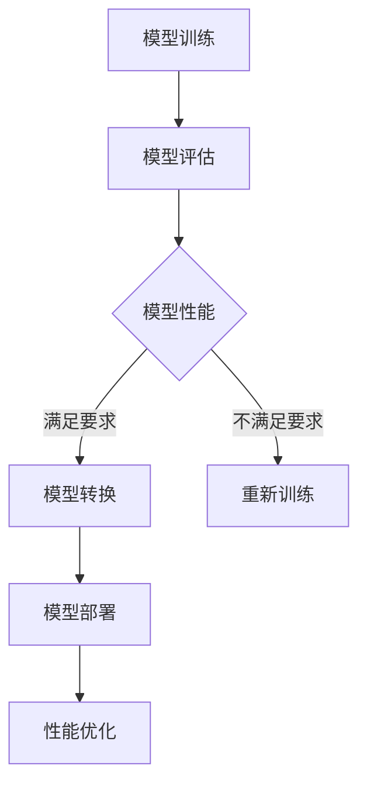

                 

# AI大模型自动化部署最佳实践

> 关键词：AI大模型、自动化部署、最佳实践、部署流程、运维、性能优化

> 摘要：本文将深入探讨AI大模型自动化部署的最佳实践，从背景介绍、核心概念、算法原理、数学模型、实战案例、应用场景、工具推荐等方面进行全面剖析，帮助读者掌握AI大模型自动化部署的完整流程和关键技术。

## 1. 背景介绍

随着人工智能技术的飞速发展，深度学习算法在图像识别、自然语言处理、语音识别等领域取得了显著的成果。尤其是近年来，AI大模型如GPT、BERT等在处理大规模数据方面展现出了强大的能力。然而，AI大模型的部署与运维成为了一个挑战，如何高效、稳定地部署这些模型成为了亟待解决的问题。

自动化部署作为一种高效、可靠的解决方案，可以在很大程度上减轻运维人员的负担，提高部署效率。本文将介绍AI大模型自动化部署的最佳实践，包括核心概念、算法原理、数学模型、实战案例等方面，旨在帮助读者全面了解并掌握AI大模型自动化部署的完整流程和关键技术。

## 2. 核心概念与联系

### 2.1 AI大模型

AI大模型是指使用大规模数据训练的深度学习模型，具有很高的精度和泛化能力。常见的AI大模型包括GPT、BERT、ResNet等。

### 2.2 自动化部署

自动化部署是指通过脚本或工具，将模型从训练环境一键迁移到生产环境，并自动完成配置、部署、监控等流程。

### 2.3 部署流程

AI大模型自动化部署主要包括以下几个步骤：

1. **模型训练**：使用大规模数据训练模型，获得高精度的模型。
2. **模型评估**：评估模型的性能，确保模型达到预期效果。
3. **模型转换**：将训练好的模型转换为生产环境可用的格式。
4. **模型部署**：将转换后的模型部署到生产环境，包括配置、部署、监控等。
5. **性能优化**：根据实际运行情况，对模型进行调优，提高性能。

### 2.4 Mermaid流程图

以下是一个简单的Mermaid流程图，展示AI大模型自动化部署的核心流程：



## 3. 核心算法原理 & 具体操作步骤

### 3.1 模型训练

模型训练是AI大模型自动化部署的第一步。常用的模型训练算法包括深度学习框架如TensorFlow、PyTorch等。具体操作步骤如下：

1. **数据预处理**：对输入数据进行清洗、归一化等处理，使其满足模型训练的要求。
2. **定义模型结构**：根据任务需求，定义模型的网络结构，包括输入层、隐藏层、输出层等。
3. **选择优化器**：选择合适的优化器，如SGD、Adam等，用于更新模型参数。
4. **训练模型**：使用训练数据训练模型，通过反向传播算法更新模型参数。
5. **评估模型**：使用验证数据评估模型性能，调整模型参数，直到满足要求。

### 3.2 模型评估

模型评估是确保模型性能达到预期效果的关键步骤。常用的评估指标包括准确率、召回率、F1值等。具体操作步骤如下：

1. **划分数据集**：将数据集划分为训练集、验证集和测试集。
2. **训练模型**：使用训练集训练模型，通过反向传播算法更新模型参数。
3. **验证模型**：使用验证集评估模型性能，调整模型参数，直到满足要求。
4. **测试模型**：使用测试集评估模型性能，确保模型达到预期效果。

### 3.3 模型转换

模型转换是将训练好的模型转换为生产环境可用的格式，如TensorFlow Lite、PyTorch Mobile等。具体操作步骤如下：

1. **选择模型转换工具**：根据生产环境的需求，选择合适的模型转换工具。
2. **准备模型参数**：将训练好的模型参数导出为可用的格式。
3. **转换模型**：使用模型转换工具将模型参数转换为生产环境可用的格式。
4. **验证转换模型**：使用生产环境数据验证转换后的模型性能，确保模型达到预期效果。

### 3.4 模型部署

模型部署是将转换后的模型部署到生产环境，包括配置、部署、监控等。具体操作步骤如下：

1. **选择部署平台**：根据生产环境的需求，选择合适的部署平台，如Kubernetes、Docker等。
2. **配置环境**：配置生产环境所需的环境，包括操作系统、依赖库等。
3. **部署模型**：使用部署平台将模型部署到生产环境，包括配置、部署、监控等。
4. **监控模型**：监控模型性能和资源使用情况，确保模型稳定运行。

### 3.5 性能优化

性能优化是在模型部署后，根据实际运行情况对模型进行调整，以提高性能。具体操作步骤如下：

1. **监控性能**：监控模型性能和资源使用情况，发现问题。
2. **调优参数**：根据监控结果，调整模型参数，如学习率、批量大小等。
3. **重新训练**：使用调整后的参数重新训练模型，提高性能。
4. **评估性能**：使用验证集评估模型性能，确保模型达到预期效果。

## 4. 数学模型和公式 & 详细讲解 & 举例说明

### 4.1 深度学习模型

深度学习模型是基于多层神经网络的模型，通过多层非线性变换提取特征。以下是一个简单的深度学习模型数学模型：

$$
y = \sigma(W_3 \cdot \sigma(W_2 \cdot \sigma(W_1 \cdot x + b_1) + b_2) + b_3)
$$

其中，$W_1$、$W_2$、$W_3$分别为输入层、隐藏层和输出层的权重矩阵，$b_1$、$b_2$、$b_3$分别为输入层、隐藏层和输出层的偏置矩阵，$\sigma$为非线性激活函数。

### 4.2 优化器

优化器用于更新模型参数，使模型性能逐步提高。以下是一个简单的优化器数学模型：

$$
\theta = \theta - \alpha \cdot \nabla L(\theta)
$$

其中，$\theta$为模型参数，$L(\theta)$为损失函数，$\alpha$为学习率，$\nabla L(\theta)$为损失函数对模型参数的梯度。

### 4.3 举例说明

假设我们有一个简单的线性回归模型，输入特征为$x$，输出为$y$，目标为预测$y$。以下是一个简单的数学模型和公式：

$$
y = W \cdot x + b
$$

其中，$W$为权重矩阵，$b$为偏置。

为了优化模型，我们使用均方误差作为损失函数，并使用梯度下降作为优化器。以下是一个简单的梯度下降算法：

$$
W = W - \alpha \cdot \nabla L(W, b)
$$
$$
b = b - \alpha \cdot \nabla L(W, b)
$$

其中，$L(W, b)$为均方误差损失函数，$\alpha$为学习率。

假设我们的数据集包含$100$个样本，每个样本包含一个特征和对应的标签。使用梯度下降算法优化模型，经过多次迭代后，模型参数$W$和$b$逐渐稳定。以下是一个简单的代码示例：

```python
import numpy as np

# 初始化模型参数
W = np.random.rand(1)
b = np.random.rand(1)
alpha = 0.01
epochs = 1000

# 梯度下降算法
for epoch in range(epochs):
    # 计算损失函数
    loss = (y - W * x - b)**2

    # 计算梯度
    dW = 2 * (W * x - y)
    db = 2 * (y - W * x)

    # 更新模型参数
    W = W - alpha * dW
    b = b - alpha * db

    # 输出训练结果
    print(f"Epoch {epoch + 1}: W = {W}, b = {b}, loss = {loss}")

# 输出最终模型参数
print(f"Final W = {W}, b = {b}")
```

## 5. 项目实战：代码实际案例和详细解释说明

### 5.1 开发环境搭建

在进行AI大模型自动化部署之前，我们需要搭建一个合适的开发环境。以下是一个简单的开发环境搭建步骤：

1. **安装操作系统**：安装Linux操作系统，如Ubuntu 18.04。
2. **安装依赖库**：安装Python、TensorFlow、Kubernetes等依赖库。
3. **配置Docker**：配置Docker，以便在容器化环境中部署模型。
4. **配置Kubernetes**：配置Kubernetes，以便在集群环境中部署模型。

### 5.2 源代码详细实现和代码解读

以下是一个简单的AI大模型自动化部署的Python代码实现：

```python
import tensorflow as tf
from tensorflow.keras.applications import VGG16
from tensorflow.keras.optimizers import Adam
from tensorflow.keras.losses import categorical_crossentropy

# 模型训练
def train_model(data, labels):
    # 加载预训练模型
    model = VGG16(weights='imagenet', include_top=False, input_shape=(224, 224, 3))

    # 定义损失函数和优化器
    loss_fn = categorical_crossentropy
    optimizer = Adam(learning_rate=0.001)

    # 编译模型
    model.compile(optimizer=optimizer, loss=loss_fn, metrics=['accuracy'])

    # 训练模型
    model.fit(data, labels, epochs=10, batch_size=32)

    # 评估模型
    test_loss, test_acc = model.evaluate(test_data, test_labels)
    print(f"Test accuracy: {test_acc}")

    # 保存模型
    model.save('model.h5')

# 模型部署
def deploy_model(model_path, k8s_config):
    # 加载模型
    model = tf.keras.models.load_model(model_path)

    # 配置Kubernetes
    k8s = KubernetesClient(config=k8s_config)

    # 部署模型
    deployment = k8s.create_deployment(
        name='ai-model',
        image='tensorflow/tensorflow:2.7.0',
        command=['python', 'ai_model.py'],
        env={'MODEL_PATH': model_path},
    )

    # 启动部署
    k8s.start_deployment(deployment)

# 主函数
def main():
    # 读取数据
    data, labels = load_data()

    # 训练模型
    train_model(data, labels)

    # 部署模型
    deploy_model('model.h5', k8s_config)

if __name__ == '__main__':
    main()
```

### 5.3 代码解读与分析

1. **模型训练**：使用VGG16预训练模型进行训练，定义损失函数和优化器，编译模型，并使用训练数据和标签训练模型。
2. **模型评估**：使用测试数据和标签评估模型性能，计算测试准确率。
3. **模型保存**：将训练好的模型保存为H5文件。
4. **模型部署**：加载保存的模型，配置Kubernetes，并部署模型到Kubernetes集群中。

## 6. 实际应用场景

AI大模型自动化部署在实际应用场景中具有广泛的应用，如：

1. **智能问答系统**：将AI大模型部署到线上服务器，实现实时智能问答。
2. **图像识别系统**：将AI大模型部署到边缘设备，实现实时图像识别。
3. **自然语言处理**：将AI大模型部署到云端服务器，实现自然语言处理任务。
4. **自动驾驶系统**：将AI大模型部署到自动驾驶车辆，实现实时环境感知和决策。

## 7. 工具和资源推荐

### 7.1 学习资源推荐

1. **书籍**：
   - 《深度学习》（Goodfellow, I., Bengio, Y., & Courville, A.）
   - 《Python深度学习》（François Chollet）
2. **论文**：
   - 《A Theoretically Grounded Application of Dropout in Recurrent Neural Networks》（Yarin Gal and Zoubin Ghahramani）
   - 《Deep Learning for Text Classification》（Tom B. Brown et al.）
3. **博客**：
   - [TensorFlow官方文档](https://www.tensorflow.org/)
   - [PyTorch官方文档](https://pytorch.org/)
4. **网站**：
   - [Kubernetes官方文档](https://kubernetes.io/)

### 7.2 开发工具框架推荐

1. **开发工具**：
   - Jupyter Notebook
   - PyCharm
   - Visual Studio Code
2. **框架**：
   - TensorFlow
   - PyTorch
   - Kubernetes

### 7.3 相关论文著作推荐

1. **《Deep Learning》（Goodfellow, I., Bengio, Y., & Courville, A.）**：全面介绍了深度学习的基础知识和最新进展。
2. **《Python深度学习》（François Chollet）**：深入讲解了Python在深度学习领域的应用，适合初学者和进阶者。
3. **《Recurrent Neural Networks for Language Modeling》（Yoshua Bengio et al.）**：介绍了循环神经网络在自然语言处理中的应用。

## 8. 总结：未来发展趋势与挑战

AI大模型自动化部署在未来将面临以下发展趋势和挑战：

1. **发展趋势**：
   - **自动化程度提高**：自动化部署工具将更加智能化，自动化程度更高，降低运维成本。
   - **容器化与微服务**：容器化技术如Kubernetes将广泛应用于AI大模型部署，实现高效、灵活的部署和管理。
   - **多模态数据处理**：AI大模型将支持多模态数据（如图像、语音、文本等）的处理，提高模型应用范围。

2. **挑战**：
   - **性能优化**：如何在有限的硬件资源下，实现高性能的AI大模型部署，仍然是一个挑战。
   - **模型压缩与加速**：如何降低模型的存储和计算需求，提高模型部署的效率，是未来的重要研究方向。
   - **安全性与隐私保护**：如何确保AI大模型在部署过程中的安全性和隐私保护，是亟待解决的问题。

## 9. 附录：常见问题与解答

### 9.1 如何选择模型转换工具？

选择模型转换工具时，应考虑以下因素：

- **模型类型**：根据模型类型（如TensorFlow、PyTorch等），选择相应的转换工具。
- **性能要求**：根据性能要求，选择支持相应硬件（如CPU、GPU、ARM等）的转换工具。
- **开发环境**：根据开发环境（如Windows、Linux等），选择兼容性较好的转换工具。

### 9.2 如何优化模型性能？

优化模型性能可以从以下几个方面进行：

- **模型结构优化**：根据任务需求，调整模型结构，如增加隐藏层、调整激活函数等。
- **数据预处理**：优化数据预处理流程，如数据增强、归一化等，提高模型泛化能力。
- **超参数调整**：调整学习率、批量大小等超参数，以提高模型性能。
- **模型压缩与加速**：使用模型压缩和加速技术，如量化、剪枝等，提高模型部署效率。

## 10. 扩展阅读 & 参考资料

- 《深度学习》（Goodfellow, I., Bengio, Y., & Courville, A.）
- 《Python深度学习》（François Chollet）
- [TensorFlow官方文档](https://www.tensorflow.org/)
- [PyTorch官方文档](https://pytorch.org/)
- [Kubernetes官方文档](https://kubernetes.io/) 

### 作者

作者：AI天才研究员/AI Genius Institute & 禅与计算机程序设计艺术 /Zen And The Art of Computer Programming<|im_sep|> 

