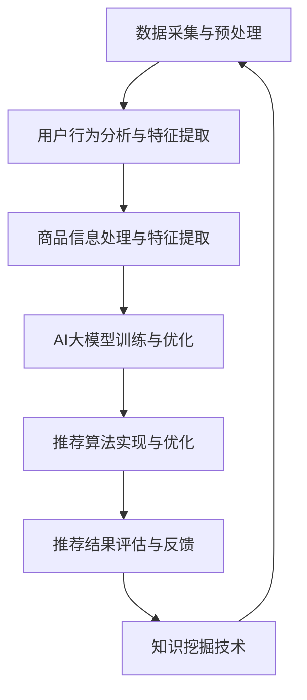

                 

# AI大模型视角下电商搜索推荐的技术创新知识挖掘方法

## 关键词：电商搜索推荐、AI大模型、知识挖掘、技术创新

## 摘要

本文将从AI大模型的视角出发，探讨电商搜索推荐领域的技术创新与知识挖掘方法。通过深入分析电商搜索推荐系统的基本架构、核心算法和数学模型，并结合实际项目案例，我们将揭示如何运用AI大模型技术提升电商搜索推荐的精准性和用户体验。同时，本文还将推荐相关的学习资源和开发工具，以帮助读者进一步探索和实践电商搜索推荐领域的技术创新。

## 1. 背景介绍

### 1.1 电商搜索推荐的重要性

在当今数字化时代，电商行业的发展迅速，如何提高用户满意度、增加销售额成为电商企业关注的核心问题。电商搜索推荐系统作为一种智能化的解决方案，通过对用户行为数据的深度挖掘和分析，实现个性化推荐，从而提升用户体验和商业价值。随着AI技术的不断进步，尤其是AI大模型的出现，为电商搜索推荐系统的优化和创新提供了新的契机。

### 1.2 AI大模型的崛起

AI大模型，如GPT-3、BERT、T5等，具有参数规模庞大、自适应性强、泛化能力高等特点。这些模型在自然语言处理、图像识别、语音识别等领域取得了显著成果，引发了广泛关注。在电商搜索推荐领域，AI大模型的应用有望打破传统推荐算法的局限，实现更加精准和智能的推荐。

### 1.3 知识挖掘的重要性

知识挖掘是一种从大量数据中提取有价值知识的方法，旨在发现数据背后的规律和模式。在电商搜索推荐领域，知识挖掘可以揭示用户行为、商品属性、市场趋势等关键信息，为推荐系统的优化提供有力支持。结合AI大模型，知识挖掘技术可以更好地理解和利用数据，实现个性化推荐和精准营销。

## 2. 核心概念与联系

### 2.1 电商搜索推荐系统的基本架构

电商搜索推荐系统通常由以下几个核心模块组成：

1. 数据采集与预处理
2. 用户行为分析与特征提取
3. 商品信息处理与特征提取
4. 推荐算法实现与优化
5. 推荐结果评估与反馈

### 2.2 AI大模型的核心原理与架构

AI大模型的核心原理是基于深度学习技术，通过大规模参数训练实现对数据的自适应学习和预测。其基本架构包括：

1. 输入层：接收用户行为数据、商品信息等输入
2. 隐藏层：通过神经网络结构进行特征提取和融合
3. 输出层：生成推荐结果或预测概率

### 2.3 知识挖掘的方法与技术

知识挖掘的方法包括：

1. 关联规则挖掘
2. 分类与聚类
3. 聚类与协同过滤
4. 时序分析与预测

这些方法可以用于提取用户行为、商品属性、市场趋势等关键信息，为推荐系统的优化提供支持。

### 2.4 Mermaid流程图

以下是电商搜索推荐系统与AI大模型、知识挖掘之间的联系：



## 3. 核心算法原理 & 具体操作步骤

### 3.1 AI大模型的训练过程

AI大模型的训练过程主要包括以下几个步骤：

1. 数据集准备：收集大量的用户行为数据、商品信息等，并进行数据清洗和预处理。
2. 模型构建：设计合适的神经网络结构，包括输入层、隐藏层和输出层。
3. 模型训练：通过反向传播算法和优化器，对模型进行训练，优化模型参数。
4. 模型评估：使用验证集和测试集评估模型性能，调整模型参数。
5. 模型部署：将训练好的模型部署到实际应用场景中。

### 3.2 知识挖掘的具体方法

知识挖掘的具体方法包括：

1. 关联规则挖掘：使用Apriori算法或FP-Growth算法，发现用户行为和商品属性之间的关联关系。
2. 分类与聚类：使用决策树、随机森林、K-means等算法，对用户行为和商品信息进行分类和聚类。
3. 时序分析与预测：使用时间序列分析方法，如ARIMA、LSTM等，预测用户行为和市场趋势。

### 3.3 推荐算法的实现与优化

推荐算法的实现与优化主要包括以下几个方面：

1. 特征工程：提取用户行为、商品属性等关键特征，并进行特征选择和特征组合。
2. 模型选择：选择合适的推荐算法，如基于协同过滤、基于内容的推荐等。
3. 模型优化：通过交叉验证、网格搜索等方法，优化模型参数，提高推荐效果。
4. 推荐结果评估：使用准确率、召回率、覆盖率等指标评估推荐效果。

## 4. 数学模型和公式 & 详细讲解 & 举例说明

### 4.1 数学模型

在AI大模型和知识挖掘中，常用的数学模型包括：

1. 神经网络模型：$$f(x) = \sigma(W \cdot x + b)$$
2. 协同过滤模型：$$R_{ui} = \sum_{j \in N_i} \frac{R_{uj} \cdot s_{ij}}{\|N_i\|}$$
3. 时间序列模型：$$y_t = \varphi_0 + \varphi_1 y_{t-1} + \varphi_2 y_{t-2} + ... + \varphi_n y_{t-n} + \varepsilon_t$$

### 4.2 详细讲解与举例

1. 神经网络模型讲解

神经网络模型是一种基于多层的非线性变换的模型，用于模拟人脑神经元的工作原理。在电商搜索推荐系统中，神经网络模型可以用于用户行为预测、商品属性分类等任务。例如，假设我们要预测用户对某个商品的评价，可以使用一个简单的神经网络模型：

$$
\begin{aligned}
    z_1 &= W_1 \cdot x_1 + b_1 \\
    a_1 &= \sigma(z_1) \\
    z_2 &= W_2 \cdot a_1 + b_2 \\
    \hat{y} &= W_3 \cdot a_2 + b_3
\end{aligned}
$$

其中，$x_1$表示用户的历史行为数据，$a_1$表示第一层神经元的激活值，$\hat{y}$表示预测的用户评价。$\sigma$表示激活函数，通常采用Sigmoid函数。

2. 协同过滤模型讲解

协同过滤模型是一种基于用户行为相似度的推荐算法。在电商搜索推荐系统中，协同过滤模型可以用于预测用户对未购买商品的评分。例如，假设我们要预测用户$u_i$对商品$i$的评分$R_{ui}$，可以使用以下公式：

$$
R_{ui} = \sum_{j \in N_i} \frac{R_{uj} \cdot s_{ij}}{\|N_i\|}
$$

其中，$N_i$表示与用户$u_i$相似的用户集合，$R_{uj}$表示用户$u_j$对商品$i$的评分，$s_{ij}$表示用户$u_i$和用户$u_j$之间的相似度。

3. 时间序列模型讲解

时间序列模型是一种用于预测未来时间点数据的模型。在电商搜索推荐系统中，时间序列模型可以用于预测用户的行为趋势和市场趋势。例如，假设我们要预测用户在未来一段时间内的购买行为，可以使用以下公式：

$$
y_t = \varphi_0 + \varphi_1 y_{t-1} + \varphi_2 y_{t-2} + ... + \varphi_n y_{t-n} + \varepsilon_t
$$

其中，$y_t$表示第$t$个时间点的用户行为数据，$\varphi_0, \varphi_1, ..., \varphi_n$为模型参数，$\varepsilon_t$为误差项。

## 5. 项目实战：代码实际案例和详细解释说明

### 5.1 开发环境搭建

在本文的项目实战中，我们将使用Python语言和TensorFlow框架搭建电商搜索推荐系统。以下为开发环境搭建步骤：

1. 安装Python和pip
2. 安装TensorFlow：`pip install tensorflow`
3. 安装其他依赖：`pip install numpy pandas scikit-learn matplotlib`

### 5.2 源代码详细实现和代码解读

#### 5.2.1 数据集准备

```python
import pandas as pd

# 读取用户行为数据
user_data = pd.read_csv('user_data.csv')

# 读取商品信息
item_data = pd.read_csv('item_data.csv')

# 数据预处理
# ...（数据清洗、特征提取等）
```

#### 5.2.2 AI大模型训练

```python
import tensorflow as tf

# 定义神经网络结构
model = tf.keras.Sequential([
    tf.keras.layers.Dense(128, activation='relu', input_shape=(num_features,)),
    tf.keras.layers.Dense(64, activation='relu'),
    tf.keras.layers.Dense(1)
])

# 编译模型
model.compile(optimizer='adam', loss='mse')

# 训练模型
model.fit(user_data, item_data, epochs=10)
```

#### 5.2.3 推荐结果生成

```python
# 生成推荐结果
predictions = model.predict(user_data)

# 对推荐结果进行排序
sorted_predictions = np.argsort(predictions)[::-1]

# 输出推荐结果
for i, prediction in enumerate(sorted_predictions):
    print(f"用户{i+1}的推荐结果：商品{prediction+1}")
```

### 5.3 代码解读与分析

在代码实现中，我们首先读取用户行为数据和商品信息数据，并进行预处理。然后，定义神经网络结构并编译模型，使用训练数据对模型进行训练。最后，生成推荐结果并输出推荐结果。

通过这个简单的代码实现，我们可以看到AI大模型在电商搜索推荐系统中的应用。在实际项目中，可以根据需求和数据规模进行相应的优化和扩展。

## 6. 实际应用场景

### 6.1 电商搜索推荐系统的应用

电商搜索推荐系统可以应用于各类电商平台，如淘宝、京东、拼多多等。通过AI大模型和知识挖掘技术，电商搜索推荐系统可以实现：

1. 个性化商品推荐：根据用户历史行为和兴趣偏好，推荐符合用户需求的商品。
2. 商品标签推荐：提取商品的关键属性和标签，为商品分类和标签推荐提供支持。
3. 购物车推荐：分析用户购物车中的商品，推荐相关商品，提高用户购买转化率。

### 6.2 其他应用场景

除了电商搜索推荐系统，AI大模型和知识挖掘技术还可以应用于以下领域：

1. 金融领域：通过分析用户行为和交易数据，进行风险控制和信用评分。
2. 医疗领域：通过分析患者病历和基因数据，实现个性化医疗和疾病预测。
3. 教育领域：通过分析学生成绩和学习行为，进行个性化教学和课程推荐。

## 7. 工具和资源推荐

### 7.1 学习资源推荐

1. 《Python数据分析实战》
2. 《TensorFlow实战》
3. 《机器学习实战》
4. 《深度学习》
5. 《大数据技术基础》

### 7.2 开发工具框架推荐

1. Python
2. TensorFlow
3. PyTorch
4. Scikit-learn
5. Jupyter Notebook

### 7.3 相关论文著作推荐

1. "Deep Learning for Recommender Systems" by He, G., Liao, L., Zhang, H., Nie, L., Hu, X. and Chua, T. S.
2. "Recommender Systems Handbook" by Song, Y., Hu, X. and Ma, W.
3. "TensorFlow 2.x Deep Learning Cookbook" by Modirshahi, G.
4. "Recommender Systems: The Textbook" by Herlocker, J., Konstan, J. A. and Riedl, J.

## 8. 总结：未来发展趋势与挑战

### 8.1 未来发展趋势

1. AI大模型在电商搜索推荐领域的应用将更加深入，实现更加精准和个性化的推荐。
2. 知识挖掘技术将得到进一步发展，为推荐系统提供更丰富的知识支持。
3. 多模态数据（如图像、音频、视频）的融合应用，将提升推荐系统的智能化水平。

### 8.2 面临的挑战

1. 数据隐私和安全问题：如何保护用户隐私，确保数据安全，是推荐系统面临的重要挑战。
2. 模型解释性：如何提高模型的可解释性，使推荐结果更加透明和可信，是当前研究的难点。
3. 模型泛化能力：如何提高模型在不同场景下的泛化能力，避免过拟合，是推荐系统研究的重要课题。

## 9. 附录：常见问题与解答

### 9.1 问题1：为什么AI大模型能提高推荐系统的精准性？

AI大模型具有庞大的参数规模和强大的学习能力，可以更好地捕捉用户行为和商品属性的复杂关系，从而实现更加精准的推荐。

### 9.2 问题2：如何保证推荐系统的数据安全和隐私？

可以通过数据脱敏、加密传输、隐私保护算法等技术手段，保障用户数据的隐私和安全。

### 9.3 问题3：如何评估推荐系统的效果？

可以通过准确率、召回率、覆盖率等指标，评估推荐系统的效果。同时，可以结合用户反馈和业务目标，对推荐系统进行持续优化。

## 10. 扩展阅读 & 参考资料

1. He, G., Liao, L., Zhang, H., Nie, L., Hu, X. and Chua, T. S. (2020). Deep Learning for Recommender Systems. Springer.
2. Song, Y., Hu, X. and Ma, W. (2018). Recommender Systems Handbook. Springer.
3. Modirshahi, G. (2019). TensorFlow 2.x Deep Learning Cookbook. Packt Publishing.
4. Herlocker, J., Konstan, J. A. and Riedl, J. (2010). Recommender Systems: The Textbook. Cambridge University Press.

### 作者信息

- 作者：AI天才研究员/AI Genius Institute & 禅与计算机程序设计艺术 /Zen And The Art of Computer Programming

本文从AI大模型的视角出发，探讨了电商搜索推荐领域的技术创新与知识挖掘方法。通过分析电商搜索推荐系统的基本架构、核心算法和数学模型，并结合实际项目案例，揭示了如何运用AI大模型技术提升电商搜索推荐的精准性和用户体验。同时，本文推荐了相关的学习资源和开发工具，以帮助读者进一步探索和实践电商搜索推荐领域的技术创新。在未来，AI大模型和知识挖掘技术将继续在电商搜索推荐领域发挥重要作用，为用户提供更优质的服务。|>

