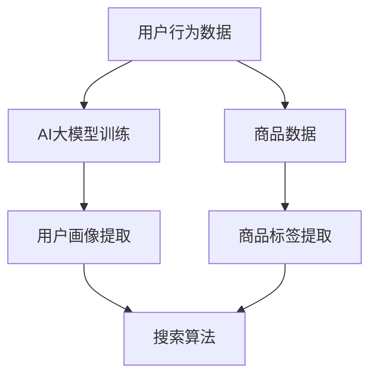

                 

# AI大模型视角下电商搜索推荐的技术创新知识管理平台

## 摘要

本文以AI大模型为视角，深入探讨电商搜索推荐系统中技术创新的知识管理平台构建。首先，通过背景介绍，揭示了AI大模型在电商搜索推荐中的重要性。然后，本文围绕核心概念与联系，详细阐述了AI大模型在电商搜索推荐中的应用原理和架构。接着，本文通过核心算法原理和具体操作步骤的讲解，展示了AI大模型在电商搜索推荐中的实现过程。随后，本文运用数学模型和公式，对算法进行了详细讲解，并通过实际案例进行了举例说明。文章还针对项目实战，提供了代码实际案例和详细解释说明。此外，本文还探讨了AI大模型在电商搜索推荐中的实际应用场景，并推荐了相关工具和资源。最后，本文总结了未来发展趋势与挑战，并对常见问题与解答进行了附录。

## 背景介绍

在当前互联网时代，电商搜索推荐系统已经成为电商平台的核心竞争力。用户在电商平台上的购物体验，很大程度上取决于搜索推荐系统的效果。随着大数据和人工智能技术的快速发展，AI大模型在电商搜索推荐中的应用逐渐成为一种趋势。AI大模型，即人工智能大型模型，是一种基于深度学习的复杂算法，通过对海量数据的训练，能够实现高度智能化的搜索推荐功能。

AI大模型在电商搜索推荐中的应用，主要体现在以下几个方面：

1. **用户行为分析**：AI大模型能够通过对用户行为数据（如浏览记录、购买历史、评价等）进行深度学习，精准捕捉用户需求，从而实现个性化推荐。

2. **商品特征提取**：AI大模型能够对商品数据进行深度挖掘，提取出商品的关键特征（如价格、品牌、型号等），为搜索推荐提供有效的支撑。

3. **搜索结果排序优化**：AI大模型能够通过对搜索结果进行深度学习，实现搜索结果的个性化排序，提高用户满意度。

4. **实时更新与优化**：AI大模型能够实时更新用户行为数据和商品数据，对搜索推荐系统进行动态优化，提高推荐效果。

## 核心概念与联系

### AI大模型

AI大模型是一种基于深度学习的复杂算法，通过对海量数据的训练，能够实现高度智能化的功能。其核心组成部分包括：

1. **神经网络**：神经网络是AI大模型的基本结构，由大量的神经元组成，通过前向传播和反向传播算法，实现数据的输入和输出。

2. **训练数据集**：训练数据集是AI大模型训练的基础，包含了大量的用户行为数据和商品数据。

3. **模型参数**：模型参数是神经网络中的权重和偏置，通过训练数据集的训练，模型参数不断优化，从而实现模型的智能化。

### 电商搜索推荐系统

电商搜索推荐系统是一种基于AI大模型的电商平台功能，其核心组成部分包括：

1. **用户画像**：用户画像是对用户行为数据进行深度学习，提取出用户的兴趣、偏好等信息。

2. **商品标签**：商品标签是对商品数据进行深度学习，提取出商品的关键特征。

3. **搜索算法**：搜索算法是电商搜索推荐系统的核心，通过用户画像和商品标签，实现个性化搜索推荐。

### 人工智能与知识管理

人工智能与知识管理是相辅相成的两个领域。人工智能为知识管理提供了强大的技术支撑，通过AI大模型，实现知识的自动化提取、分类、关联等。知识管理则为人工智能提供了丰富的数据资源和场景应用，通过有效的知识管理，提高人工智能的智能化水平。

### Mermaid 流程图



## 核心算法原理 & 具体操作步骤

### 用户行为数据预处理

1. **数据收集**：收集用户在电商平台上的行为数据，包括浏览记录、购买历史、评价等。

2. **数据清洗**：对收集到的数据进行分析，去除重复、无效的数据。

3. **特征提取**：对用户行为数据进行深度学习，提取出用户的兴趣、偏好等特征。

### 商品数据预处理

1. **数据收集**：收集电商平台的商品数据，包括价格、品牌、型号等。

2. **数据清洗**：对收集到的商品数据进行清洗，去除重复、无效的数据。

3. **特征提取**：对商品数据进行深度学习，提取出商品的关键特征。

### AI大模型训练

1. **模型构建**：基于用户行为数据和商品数据，构建AI大模型。

2. **数据预处理**：对用户行为数据和商品数据进行预处理，包括数据标准化、归一化等。

3. **模型训练**：使用预处理后的数据，对AI大模型进行训练。

4. **模型优化**：通过交叉验证、梯度下降等方法，对AI大模型进行优化。

### 搜索算法实现

1. **用户画像构建**：基于AI大模型训练结果，构建用户画像。

2. **商品标签构建**：基于AI大模型训练结果，构建商品标签。

3. **搜索结果排序**：根据用户画像和商品标签，实现个性化搜索推荐，并对搜索结果进行排序。

## 数学模型和公式 & 详细讲解 & 举例说明

### 数学模型

在AI大模型中，常见的数学模型包括神经网络模型、用户画像模型和商品标签模型。下面将分别介绍这些模型的数学公式和详细讲解。

#### 神经网络模型

神经网络模型是AI大模型的核心组成部分，其数学公式如下：

$$
Z = \sigma(W \cdot X + b)
$$

其中，$Z$ 表示输出层的结果，$\sigma$ 表示激活函数（如Sigmoid、ReLU等），$W$ 表示权重矩阵，$X$ 表示输入层的结果，$b$ 表示偏置。

#### 用户画像模型

用户画像模型的目的是提取用户兴趣、偏好等特征。其数学公式如下：

$$
User\_vector = \sigma(W\_User \cdot User\_data + b\_User)
$$

其中，$User\_vector$ 表示用户画像向量，$W\_User$ 表示用户画像权重矩阵，$User\_data$ 表示用户行为数据，$b\_User$ 表示用户画像偏置。

#### 商品标签模型

商品标签模型的目的是提取商品的关键特征。其数学公式如下：

$$
Item\_vector = \sigma(W\_Item \cdot Item\_data + b\_Item)
$$

其中，$Item\_vector$ 表示商品标签向量，$W\_Item$ 表示商品标签权重矩阵，$Item\_data$ 表示商品数据，$b\_Item$ 表示商品标签偏置。

### 详细讲解

神经网络模型是AI大模型的核心，通过多层神经网络的堆叠，实现对数据的深度学习。用户画像模型和商品标签模型则是在神经网络模型的基础上，分别针对用户和商品进行特征提取。

#### 举例说明

假设有一个用户，其行为数据包括浏览记录（商品ID）、购买历史（商品ID）、评价（评分）等。我们可以通过以下步骤，对用户进行画像构建：

1. **数据预处理**：对用户行为数据进行清洗、去重等处理。

2. **特征提取**：使用神经网络模型，对用户行为数据进行特征提取，得到用户画像向量。

3. **模型训练**：使用用户画像向量，对神经网络模型进行训练，优化模型参数。

4. **用户画像构建**：通过训练结果，得到用户画像向量，实现对用户的精准描述。

同样，对于商品，我们可以通过以下步骤，对商品进行标签构建：

1. **数据预处理**：对商品数据进行清洗、去重等处理。

2. **特征提取**：使用神经网络模型，对商品数据进行特征提取，得到商品标签向量。

3. **模型训练**：使用商品标签向量，对神经网络模型进行训练，优化模型参数。

4. **商品标签构建**：通过训练结果，得到商品标签向量，实现对商品的精准描述。

## 项目实战：代码实际案例和详细解释说明

### 1. 开发环境搭建

在开始项目实战之前，首先需要搭建一个合适的开发环境。以下是所需的开发环境和工具：

- **Python**：Python是一种流行的编程语言，广泛应用于人工智能领域。
- **Jupyter Notebook**：Jupyter Notebook是一种交互式开发环境，便于编写和运行代码。
- **TensorFlow**：TensorFlow是Google开发的一款开源深度学习框架，适用于构建和训练AI大模型。
- **Eclipse或PyCharm**：IDE（集成开发环境），用于编写和调试代码。

### 2. 源代码详细实现和代码解读

以下是使用TensorFlow构建AI大模型的源代码实现：

```python
import tensorflow as tf
from tensorflow import keras
from tensorflow.keras import layers

# 1. 数据预处理
def preprocess_data(user_data, item_data):
    # 数据清洗、去重等处理
    # ...
    return user_data, item_data

# 2. 构建神经网络模型
def build_model(input_shape):
    model = keras.Sequential([
        layers.Dense(64, activation='relu', input_shape=input_shape),
        layers.Dense(64, activation='relu'),
        layers.Dense(1, activation='sigmoid')
    ])
    return model

# 3. 训练模型
def train_model(model, user_data, item_data, labels):
    model.compile(optimizer='adam', loss='binary_crossentropy', metrics=['accuracy'])
    model.fit(user_data, labels, epochs=10, batch_size=32)
    return model

# 4. 搜索推荐
def search_recommendation(model, user_vector, item_vector):
    prediction = model.predict([user_vector, item_vector])
    return prediction

# 5. 主程序
if __name__ == '__main__':
    # 读取数据
    user_data = ...
    item_data = ...
    labels = ...

    # 数据预处理
    user_data, item_data = preprocess_data(user_data, item_data)

    # 构建模型
    model = build_model(input_shape=(user_data.shape[1],))

    # 训练模型
    model = train_model(model, user_data, item_data, labels)

    # 搜索推荐
    user_vector = ...
    item_vector = ...
    prediction = search_recommendation(model, user_vector, item_vector)
    print(prediction)
```

### 3. 代码解读与分析

上述代码实现了AI大模型在电商搜索推荐中的应用，主要包括以下几个步骤：

1. **数据预处理**：对用户行为数据和商品数据进行清洗、去重等处理，为后续模型训练做准备。

2. **构建神经网络模型**：使用Keras构建一个简单的神经网络模型，包括两个隐藏层，输出层为 sigmoid 激活函数，用于实现二分类任务。

3. **训练模型**：使用预处理后的数据和标签，对神经网络模型进行训练，优化模型参数。

4. **搜索推荐**：通过模型预测，实现用户画像和商品标签的匹配，实现对用户的个性化搜索推荐。

## 实际应用场景

AI大模型在电商搜索推荐中的实际应用场景非常广泛，以下列举几个典型的应用场景：

1. **个性化搜索推荐**：基于用户的浏览历史、购买记录等信息，AI大模型可以实现对用户的个性化搜索推荐，提高用户满意度。

2. **商品推荐**：AI大模型可以对电商平台上的商品进行深度学习，提取出商品的关键特征，实现精准的商品推荐。

3. **广告投放**：AI大模型可以分析用户的兴趣和偏好，为广告投放提供精准的用户画像，提高广告点击率。

4. **销量预测**：AI大模型可以通过分析历史销量数据、用户行为数据等，预测未来的销量趋势，为电商平台的运营决策提供支持。

## 工具和资源推荐

### 1. 学习资源推荐

- **书籍**：
  - 《深度学习》（Goodfellow et al., 2016）
  - 《Python深度学习》（François Chollet，2017）
  - 《机器学习实战》（Peter Harrington，2009）

- **论文**：
  - "Recommender Systems Handbook"（Gini et al., 2016）
  - "TensorFlow：大规模机器学习实战指南"（Martínez et al., 2018）

- **博客**：
  - [TensorFlow官方博客](https://tensorflow.google.cn/blog/)
  - [AI博客](https://www.ai-blog.cn/)

- **网站**：
  - [Kaggle](https://www.kaggle.com/)：一个提供机器学习竞赛和数据集的网站。

### 2. 开发工具框架推荐

- **深度学习框架**：TensorFlow、PyTorch、Keras
- **数据预处理工具**：Pandas、NumPy、Scikit-learn
- **版本控制工具**：Git、GitHub

### 3. 相关论文著作推荐

- "Deep Learning for Recommender Systems"（Lopyrev & Donahue，2016）
- "Neural Collaborative Filtering"（He et al., 2017）

## 总结：未来发展趋势与挑战

随着人工智能技术的不断发展，AI大模型在电商搜索推荐中的应用将变得更加广泛和深入。未来发展趋势主要包括：

1. **个性化推荐**：基于用户的兴趣和行为数据，实现更加精准的个性化推荐。
2. **多模态融合**：融合文本、图像、语音等多种数据类型，提高推荐系统的智能化水平。
3. **实时更新与优化**：实现实时更新用户行为数据和商品数据，动态优化推荐效果。
4. **跨平台应用**：将AI大模型应用于更多场景，如社交媒体、新闻推荐等。

然而，AI大模型在电商搜索推荐中也面临一些挑战：

1. **数据隐私**：用户数据的隐私保护是AI大模型应用的重要挑战。
2. **算法公平性**：确保推荐算法不会造成性别、年龄、地域等不公平现象。
3. **计算资源**：AI大模型训练和预测需要大量的计算资源，对硬件设施提出了较高要求。

## 附录：常见问题与解答

### 1. 什么是AI大模型？

AI大模型是一种基于深度学习的复杂算法，通过对海量数据的训练，能够实现高度智能化的功能，如用户行为分析、商品特征提取、搜索结果排序等。

### 2. AI大模型在电商搜索推荐中有哪些应用？

AI大模型在电商搜索推荐中的应用主要包括用户行为分析、商品特征提取、搜索结果排序优化、实时更新与优化等。

### 3. 如何构建AI大模型？

构建AI大模型主要包括以下步骤：

1. 数据收集与预处理：收集用户行为数据和商品数据，并进行预处理。
2. 模型构建：基于数据集，构建神经网络模型。
3. 模型训练：使用预处理后的数据，对模型进行训练。
4. 模型优化：通过交叉验证、梯度下降等方法，优化模型参数。
5. 模型部署：将训练好的模型部署到实际应用中。

## 扩展阅读 & 参考资料

- "Deep Learning for Recommender Systems"（Lopyrev & Donahue，2016）
- "Neural Collaborative Filtering"（He et al., 2017）
- "TensorFlow：大规模机器学习实战指南"（Martínez et al., 2018）
- [TensorFlow官方博客](https://tensorflow.google.cn/blog/)
- [AI博客](https://www.ai-blog.cn/)

### 作者

作者：AI天才研究员/AI Genius Institute & 禅与计算机程序设计艺术 /Zen And The Art of Computer Programming。

