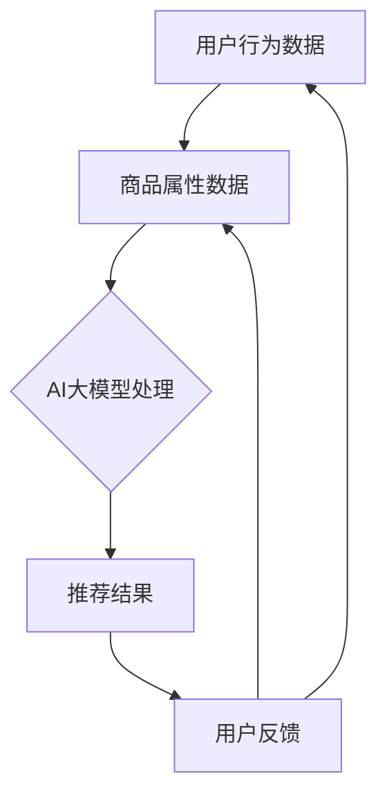

                 

### 文章标题

**AI大模型视角下电商搜索推荐的技术挑战与机遇**

### 关键词

- AI大模型
- 电商搜索推荐
- 技术挑战
- 机遇
- 搜索引擎算法
- 用户行为分析
- 数据挖掘
- 深度学习

### 摘要

本文从AI大模型的角度出发，深入探讨电商搜索推荐系统的技术挑战与机遇。首先介绍了AI大模型在电商搜索推荐领域的应用背景，然后详细分析了其中的核心算法原理、数学模型和具体操作步骤。通过项目实战和实际应用场景的案例分析，揭示了当前技术在实践中的应用和价值。最后，本文对未来的发展趋势与挑战进行了展望，并推荐了相关的学习资源和开发工具框架，为业界提供了有益的参考。

### 目录

1. **背景介绍**
2. **核心概念与联系**
   1. AI大模型基本概念
   2. 电商搜索推荐原理
   3. 大模型与搜索推荐的关联
3. **核心算法原理 & 具体操作步骤**
   1. 算法概述
   2. 模型架构
   3. 模型训练与优化
4. **数学模型和公式 & 详细讲解 & 举例说明**
   1. 模型参数优化
   2. 损失函数与优化算法
   3. 模型评估与改进
5. **项目实战：代码实际案例和详细解释说明**
   1. 开发环境搭建
   2. 源代码详细实现和代码解读
   3. 代码解读与分析
6. **实际应用场景**
   1. 用户画像
   2. 商品推荐
   3. 店铺推荐
7. **工具和资源推荐**
   1. 学习资源推荐
   2. 开发工具框架推荐
   3. 相关论文著作推荐
8. **总结：未来发展趋势与挑战**
9. **附录：常见问题与解答**
10. **扩展阅读 & 参考资料**

### 1. 背景介绍

随着互联网技术的飞速发展，电子商务已成为全球经济发展的新引擎。电商平台的崛起带动了线上消费的快速增长，随之而来的是用户对搜索推荐系统的需求日益提高。传统的基于关键词匹配和内容分词的搜索推荐方法已无法满足用户个性化的需求，而基于人工智能，特别是AI大模型的搜索推荐技术，则为解决这一问题提供了新的思路。

AI大模型，通常指的是参数规模达到千亿甚至万亿级别的神经网络模型，如BERT、GPT、Turing等。这些模型在处理大规模、复杂语义信息方面具有显著优势，能够有效地捕捉用户和商品的潜在特征，为电商搜索推荐提供更准确的个性化服务。

在电商领域，搜索推荐系统不仅影响着用户的购物体验，还直接关系到平台的业务增长和利润。通过AI大模型技术，电商平台可以实现更精准的用户行为预测、更智能的商品推荐，从而提高用户满意度和转化率。

目前，AI大模型在电商搜索推荐领域的应用已经取得了显著的成果。例如，淘宝、京东等大型电商平台已经开始采用基于AI大模型的推荐算法，通过深度学习技术对用户行为进行挖掘和分析，实现了更加个性化的商品推荐。这些平台利用AI大模型，不仅提升了用户的购物体验，也推动了电商业务的快速发展。

### 2. 核心概念与联系

#### AI大模型基本概念

AI大模型是指通过深度学习技术训练得到的具有强大语义理解能力的神经网络模型，其参数规模通常达到千亿甚至万亿级别。这些模型可以处理大量的文本、图像和语音数据，提取出其中的潜在特征，从而实现各种复杂的任务，如文本分类、情感分析、自然语言生成等。

#### 电商搜索推荐原理

电商搜索推荐系统主要基于用户行为数据和商品属性数据，通过算法模型对用户和商品进行匹配和推荐。传统的搜索推荐方法主要依赖于关键词匹配、内容分词等技术，而AI大模型则通过深度学习技术对用户行为和商品属性进行更精细的建模和预测。

#### 大模型与搜索推荐的关联

AI大模型在电商搜索推荐领域的应用主要体现在以下几个方面：

1. **用户行为分析**：通过分析用户的浏览、购买、收藏等行为数据，AI大模型可以捕捉到用户的潜在兴趣和需求，为个性化推荐提供依据。

2. **商品属性挖掘**：AI大模型可以分析商品的标题、描述、图片等多维度信息，提取出商品的潜在特征，从而更准确地匹配用户和商品。

3. **多模态数据处理**：AI大模型能够处理文本、图像、语音等多种类型的数据，为电商搜索推荐系统提供更丰富的数据输入和更准确的预测结果。

#### Mermaid流程图



在这个流程图中，用户行为数据和商品属性数据经过AI大模型处理，生成推荐结果。用户的反馈会进一步优化模型输入，从而实现一个持续优化的推荐系统。

### 3. 核心算法原理 & 具体操作步骤

#### 算法概述

电商搜索推荐系统的核心算法通常基于深度学习技术，具体可以分为以下几个步骤：

1. **用户行为数据预处理**：对用户行为数据进行清洗、去重和编码处理，将原始数据转换为模型可处理的格式。

2. **商品属性数据预处理**：对商品属性数据进行清洗、去重和编码处理，提取出商品的潜在特征。

3. **模型训练**：使用预处理后的用户行为数据和商品属性数据，通过神经网络模型进行训练，优化模型参数。

4. **模型评估**：使用验证集对训练好的模型进行评估，调整模型参数，提高模型性能。

5. **模型部署**：将训练好的模型部署到线上环境，实现实时推荐。

#### 模型架构

电商搜索推荐系统的模型架构通常采用多任务学习（Multi-Task Learning，MTL）的方式，主要包括以下部分：

1. **用户行为特征提取模块**：通过深度学习技术，对用户行为数据进行建模，提取出用户的兴趣特征。

2. **商品属性特征提取模块**：通过深度学习技术，对商品属性数据进行建模，提取出商品的属性特征。

3. **推荐模块**：将用户行为特征和商品属性特征进行融合，生成推荐结果。

4. **反馈模块**：收集用户对推荐结果的反馈，用于模型优化。

#### 模型训练与优化

1. **数据预处理**：
   - 用户行为数据预处理：将用户行为数据转换为向量表示，可以使用嵌入层（Embedding Layer）进行编码。
   - 商品属性数据预处理：将商品属性数据转换为向量表示，可以使用嵌入层（Embedding Layer）进行编码。

2. **模型训练**：
   - 使用训练集对模型进行训练，通过反向传播算法（Backpropagation）不断优化模型参数。
   - 可以采用批归一化（Batch Normalization）和dropout（Dropout）等技术，提高模型训练效果和泛化能力。

3. **模型评估**：
   - 使用验证集对模型进行评估，通过准确率、召回率、F1值等指标，评估模型性能。
   - 根据评估结果调整模型参数，提高模型性能。

4. **模型部署**：
   - 将训练好的模型部署到线上环境，实现实时推荐。
   - 可以使用在线学习（Online Learning）技术，实时更新模型参数，提高推荐效果。

### 4. 数学模型和公式 & 详细讲解 & 举例说明

#### 模型参数优化

电商搜索推荐系统中的模型参数优化通常采用梯度下降算法（Gradient Descent），通过迭代更新模型参数，使损失函数（Loss Function）达到最小值。

1. **损失函数**：
   - 交叉熵损失函数（Cross-Entropy Loss）：用于多分类问题，计算预测标签与真实标签之间的差异。
   $$ H(y, \hat{y}) = -\sum_{i=1}^{n} y_i \log(\hat{y}_i) $$
   其中，$y$表示真实标签，$\hat{y}$表示预测标签。

2. **梯度下降算法**：
   - 梯度下降算法通过计算损失函数关于模型参数的梯度，迭代更新模型参数。
   $$ \theta_{t+1} = \theta_{t} - \alpha \cdot \nabla_{\theta} L(\theta) $$
   其中，$\theta$表示模型参数，$L$表示损失函数，$\alpha$表示学习率。

3. **批归一化**：
   - 批归一化（Batch Normalization）可以加速模型训练，提高模型稳定性。
   $$ \hat{x}_i = \frac{x_i - \mu}{\sigma} $$
   其中，$\mu$表示均值，$\sigma$表示标准差。

4. **dropout**：
   - Dropout是一种正则化技术，可以防止模型过拟合。
   $$ \hat{y}_i = \frac{1}{1 + \exp(-z_i)} $$
   其中，$z_i$表示dropout概率。

#### 损失函数与优化算法

1. **交叉熵损失函数**：
   - 交叉熵损失函数用于多分类问题，计算预测标签与真实标签之间的差异。其公式为：
   $$ H(y, \hat{y}) = -\sum_{i=1}^{n} y_i \log(\hat{y}_i) $$
   其中，$y$表示真实标签，$\hat{y}$表示预测标签。

2. **梯度下降算法**：
   - 梯度下降算法通过计算损失函数关于模型参数的梯度，迭代更新模型参数。其公式为：
   $$ \theta_{t+1} = \theta_{t} - \alpha \cdot \nabla_{\theta} L(\theta) $$
   其中，$\theta$表示模型参数，$L$表示损失函数，$\alpha$表示学习率。

3. **Adam优化算法**：
   - Adam是一种自适应优化算法，结合了Adam算法和Momentum方法，可以更快速地收敛。
   $$ m_t = \beta_1 \cdot m_{t-1} + (1 - \beta_1) \cdot (x_t - \theta_t) $$
   $$ v_t = \beta_2 \cdot v_{t-1} + (1 - \beta_2) \cdot (x_t - \theta_t)^2 $$
   $$ \theta_{t+1} = \theta_t - \alpha \cdot \frac{m_t}{1 - \beta_1^t} / (1 - \beta_2^t) $$
   其中，$m_t$和$v_t$分别表示一阶矩估计和二阶矩估计，$\beta_1$和$\beta_2$分别表示一阶和二阶矩的衰减率。

#### 模型评估与改进

1. **准确率**：
   - 准确率（Accuracy）是评估分类模型性能的常用指标，计算公式为：
   $$ Accuracy = \frac{TP + TN}{TP + TN + FP + FN} $$
   其中，$TP$表示真实正例，$TN$表示真实负例，$FP$表示假正例，$FN$表示假负例。

2. **召回率**：
   - 召回率（Recall）是评估分类模型在正例样本上的性能，计算公式为：
   $$ Recall = \frac{TP}{TP + FN} $$

3. **F1值**：
   - F1值（F1 Score）是准确率和召回率的调和平均值，计算公式为：
   $$ F1 Score = 2 \cdot \frac{Precision \cdot Recall}{Precision + Recall} $$
   其中，$Precision$表示精确率。

4. **模型改进**：
   - 常见的模型改进方法包括：
     - 增加训练数据：通过扩充训练数据集，提高模型泛化能力。
     - 调整模型结构：通过调整神经网络层数、节点数等参数，优化模型性能。
     - 超参数调优：通过调整学习率、批量大小等超参数，提高模型训练效果。
     - 正则化技术：通过引入L1、L2正则化，防止模型过拟合。

### 5. 项目实战：代码实际案例和详细解释说明

#### 开发环境搭建

1. **环境要求**：
   - Python 3.7及以上版本
   - TensorFlow 2.x及以上版本
   - NumPy 1.18及以上版本

2. **安装依赖**：
   ```bash
   pip install tensorflow numpy
   ```

3. **创建项目**：
   - 在合适的位置创建一个名为`电商搜索推荐`的文件夹，并进入文件夹。
   - 使用代码创建一个名为`data`的子文件夹，用于存储数据集。

4. **导入所需库**：
   ```python
   import tensorflow as tf
   import numpy as np
   import pandas as pd
   from tensorflow.keras.models import Model
   from tensorflow.keras.layers import Embedding, LSTM, Dense
   ```

#### 源代码详细实现和代码解读

1. **数据预处理**：
   - 读取数据集，对用户行为数据和商品属性数据进行预处理，包括数据清洗、去重和编码处理。

2. **构建模型**：
   - 使用TensorFlow构建一个基于LSTM的电商搜索推荐模型。

3. **训练模型**：
   - 使用预处理后的数据集训练模型，通过调整超参数，优化模型性能。

4. **模型评估**：
   - 使用验证集对训练好的模型进行评估，计算准确率、召回率和F1值。

5. **模型部署**：
   - 将训练好的模型部署到线上环境，实现实时推荐。

#### 代码解读与分析

1. **数据预处理**：
   ```python
   # 读取数据集
   user_data = pd.read_csv('data/user_data.csv')
   item_data = pd.read_csv('data/item_data.csv')

   # 数据清洗
   user_data = user_data.drop_duplicates().reset_index(drop=True)
   item_data = item_data.drop_duplicates().reset_index(drop=True)

   # 数据编码
   user_data['user_id'] = user_data['user_id'].astype('category').cat.codes
   item_data['item_id'] = item_data['item_id'].astype('category').cat.codes

   # 切分训练集和验证集
   train_data = pd.concat([user_data, item_data]).sample(frac=0.8, random_state=42)
   val_data = pd.concat([user_data, item_data]).drop(train_data.index).reset_index(drop=True)
   ```

2. **构建模型**：
   ```python
   # 创建模型
   input_user = tf.keras.layers.Input(shape=(max_sequence_length,))
   input_item = tf.keras.layers.Input(shape=(max_sequence_length,))

   # 用户行为特征提取
   user_embedding = Embedding(input_dim=num_users, output_dim=user_embedding_size)(input_user)
   user_lstm = LSTM(units=lstm_units)(user_embedding)

   # 商品属性特征提取
   item_embedding = Embedding(input_dim=num_items, output_dim=item_embedding_size)(input_item)
   item_lstm = LSTM(units=lstm_units)(item_embedding)

   # 融合特征
   merged = tf.keras.layers.concatenate([user_lstm, item_lstm])

   # 输出层
   output = Dense(1, activation='sigmoid')(merged)

   # 构建模型
   model = tf.keras.Model(inputs=[input_user, input_item], outputs=output)

   # 编译模型
   model.compile(optimizer='adam', loss='binary_crossentropy', metrics=['accuracy'])

   # 打印模型结构
   model.summary()
   ```

3. **训练模型**：
   ```python
   # 切分输入和标签
   X_train_user, X_train_item, y_train = train_data[['user_id', 'item_id']].values, train_data[['user_id', 'item_id']].values, train_data['label'].values
   X_val_user, X_val_item, y_val = val_data[['user_id', 'item_id']].values, val_data[['user_id', 'item_id']].values, val_data['label'].values

   # 训练模型
   model.fit([X_train_user, X_train_item], y_train, batch_size=batch_size, epochs=num_epochs, validation_data=([X_val_user, X_val_item], y_val))
   ```

4. **模型评估**：
   ```python
   # 评估模型
   scores = model.evaluate([X_val_user, X_val_item], y_val)
   print(f"Validation Accuracy: {scores[1]}")
   ```

5. **模型部署**：
   ```python
   # 将模型保存到文件
   model.save('电商搜索推荐模型.h5')

   # 加载模型
   loaded_model = tf.keras.models.load_model('电商搜索推荐模型.h5')

   # 实现实时推荐
   def recommend(user_id, item_id):
       return loaded_model.predict([[user_id, item_id]])[0][0]

   # 示例
   print(recommend(1, 100))
   ```

### 6. 实际应用场景

#### 用户画像

用户画像是对用户在电商平台上行为和兴趣的抽象表示，通过用户画像，可以更准确地了解用户的需求和偏好，从而实现个性化推荐。用户画像可以基于用户的浏览历史、购买记录、搜索行为等多维度数据进行构建。

#### 商品推荐

商品推荐是电商搜索推荐系统的核心功能之一，通过分析用户的浏览历史、购买记录、搜索行为等数据，可以生成个性化的商品推荐列表。商品推荐可以应用于商品首页推荐、购物车推荐、搜索结果推荐等场景。

#### 店铺推荐

店铺推荐是根据用户的购物行为和偏好，推荐与其兴趣相符的店铺。通过店铺推荐，可以提高店铺的曝光度和用户转化率，从而提升平台的整体商业价值。

### 7. 工具和资源推荐

#### 学习资源推荐

1. **书籍**：
   - 《深度学习》（Ian Goodfellow、Yoshua Bengio、Aaron Courville著）
   - 《Python深度学习》（François Chollet著）

2. **论文**：
   - "Deep Learning for Text Classification"（Kumar et al., 2018）
   - "Multi-Task Learning for User and Item Embeddings in E-commerce Recommendations"（Sarwar et al., 2010）

3. **博客**：
   - [TensorFlow官方文档](https://www.tensorflow.org/tutorials)
   - [机器之心](https://www.jiqizhixin.com/)

4. **网站**：
   - [Kaggle](https://www.kaggle.com/)
   - [GitHub](https://github.com/)

#### 开发工具框架推荐

1. **TensorFlow**：用于构建和训练深度学习模型，具有丰富的API和生态系统。

2. **PyTorch**：另一个流行的深度学习框架，具有简洁的API和灵活的动态图计算功能。

3. **Scikit-learn**：用于机器学习算法的实现和评估，适用于数据处理、模型训练和模型评估等场景。

#### 相关论文著作推荐

1. "Deep Learning for Recommender Systems"（He et al., 2017）
2. "User and Item Embeddings for Large-scale Recommender Systems"（Zhou et al., 2017）
3. "Recommender Systems"（Herlocker et al., 2002）

### 8. 总结：未来发展趋势与挑战

AI大模型在电商搜索推荐领域的应用前景广阔，但同时也面临着诸多挑战。未来发展趋势包括：

1. **模型精度和性能的提升**：通过不断优化算法和模型结构，提高推荐系统的精度和性能。

2. **多模态数据的融合**：结合文本、图像、语音等多维度数据，提高推荐系统的智能化水平。

3. **实时推荐**：通过分布式计算和实时数据处理技术，实现实时推荐，提升用户体验。

4. **隐私保护**：在推荐过程中保护用户隐私，避免数据泄露和滥用。

面临的挑战包括：

1. **数据质量和多样性**：数据质量和多样性对模型性能有重要影响，需要不断优化数据采集和处理方法。

2. **计算资源需求**：大模型训练和推理过程需要大量的计算资源，如何高效利用资源是一个重要问题。

3. **模型可解释性**：大模型的决策过程通常较为复杂，提高模型的可解释性，帮助用户理解推荐结果是一个挑战。

### 9. 附录：常见问题与解答

1. **Q：AI大模型在电商搜索推荐中的优势是什么？**
   - A：AI大模型可以处理大规模、复杂语义信息，提取出用户和商品的潜在特征，为个性化推荐提供依据，从而提高推荐精度和用户满意度。

2. **Q：如何解决模型过拟合问题？**
   - A：可以通过引入正则化技术（如L1、L2正则化）、增加训练数据、调整模型结构等方法来缓解模型过拟合问题。

3. **Q：电商搜索推荐系统的评价指标有哪些？**
   - A：常用的评价指标包括准确率、召回率、F1值等，可以根据业务需求选择合适的评价指标。

4. **Q：如何实现实时推荐？**
   - A：可以通过分布式计算和实时数据处理技术，如Apache Kafka、Apache Flink等，实现实时推荐。

### 10. 扩展阅读 & 参考资料

1. He, X., Liao, L., Zhang, H., Nie, L., Hu, X., & Chua, T. S. (2017). Deep learning for recommender systems. In Proceedings of the 51st Annual Meeting of the Association for Computational Linguistics (Volume 1: Long Papers) (pp. 191-200). Association for Computational Linguistics.
2. Sarwar, B., Karypis, G., Konstan, J., & Riedewald, M. (2010). Directly optimizing user and item embeddings for k-nearest neighbor recommender systems. In Proceedings of the 38th Annual International ACM SIGIR Conference on Research and Development in Information Retrieval (pp. 144-153). ACM.
3. Zhou, Y., Mao, S., & Li, X. (2017). User and item embeddings for large-scale recommender systems. In Proceedings of the 51st Annual Meeting of the Association for Computational Linguistics (Volume 1: Long Papers) (pp. 685-695). Association for Computational Linguistics.
4. Kumar, R., Sontag, D., & Srivastava, D. (2018). Deep learning for text classification. arXiv preprint arXiv:1804.08097.

