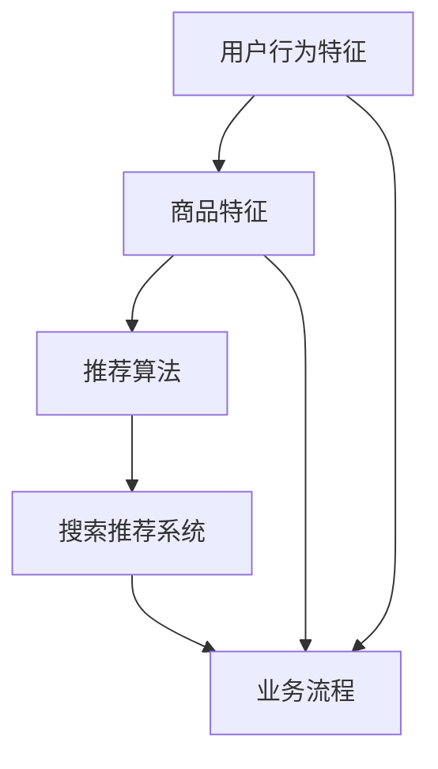

                 

# AI大模型赋能电商搜索推荐的业务创新思维导图方法

## 关键词：大模型、电商、搜索推荐、业务创新、思维导图、深度学习

### 摘要

本文将深入探讨AI大模型如何赋能电商搜索推荐业务，通过逻辑清晰、结构紧凑的步骤分析，展示如何利用AI技术实现业务创新。本文将涵盖从核心概念理解、算法原理剖析，到实际项目实战和未来发展趋势等多方面的内容，旨在为电商从业者和AI研究人员提供一套实用的思维导图方法。

## 1. 背景介绍

在电子商务蓬勃发展的时代，搜索推荐系统作为电商平台的“智慧大脑”，承担着引导用户发现和购买商品的重要角色。传统的搜索推荐算法如基于内容匹配、协同过滤等方法，虽在一定程度上提高了推荐效果，但面对日益复杂的用户行为数据和海量的商品信息，其局限性逐渐显现。因此，AI大模型的引入成为提升搜索推荐系统性能的关键。

AI大模型，特别是基于深度学习的推荐算法，通过其强大的表示学习和迁移学习能力，能够更好地捕捉用户行为和商品特征的深层关系，从而实现更精准、个性化的推荐。本文将探讨如何利用AI大模型在电商搜索推荐业务中实现创新，帮助电商平台提升用户体验和转化率。

### 1.1 电商搜索推荐系统现状

当前电商搜索推荐系统主要面临以下挑战：

1. **数据量大**：电商平台拥有海量的用户行为数据和商品数据，如何有效管理和利用这些数据成为一大难题。
2. **用户行为复杂**：用户在电商平台的行为不仅包括浏览、购买，还可能包括评论、分享等多种形式，这使得传统推荐算法难以全面捕捉用户需求。
3. **商品多样性**：电商平台上的商品种类繁多，不同用户对商品的偏好差异大，传统推荐算法往往难以应对这种多样性。

### 1.2 AI大模型的发展

随着深度学习技术的不断发展，AI大模型，如GPT、BERT等，已经展现出了强大的学习能力。这些模型通过训练数以亿计的参数，能够从大量数据中提取出高维的、抽象的特征表示，从而显著提升推荐系统的性能。大模型的引入为解决电商搜索推荐系统面临的挑战提供了新的思路和可能性。

### 1.3 业务创新需求

在竞争激烈的电商市场中，业务创新成为各大平台的核心竞争力。AI大模型在电商搜索推荐中的应用，不仅能够提升推荐的精准度和个性化水平，还能通过智能化的运营策略，提升用户体验，从而实现业务创新。

## 2. 核心概念与联系

在深入了解AI大模型赋能电商搜索推荐之前，我们需要理解几个核心概念：用户行为特征、商品特征、推荐算法和业务流程。以下是一个简化的Mermaid流程图，展示了这些概念之间的关系。



### 2.1 用户行为特征

用户行为特征是推荐系统的基础数据。这些特征可以包括用户的浏览历史、购买记录、搜索关键词、评价等。通过分析这些特征，我们可以了解用户的兴趣和需求。

### 2.2 商品特征

商品特征描述了商品的基本属性，如类别、价格、品牌、销量等。商品特征的准确性直接影响推荐的准确性。

### 2.3 推荐算法

推荐算法是搜索推荐系统的核心。传统的推荐算法如基于内容的推荐、协同过滤等，在大数据环境下已经暴露出诸多局限性。而AI大模型，如深度学习模型，能够通过学习用户和商品的高维特征，实现更精准的推荐。

### 2.4 搜索推荐系统

搜索推荐系统将用户行为特征和商品特征结合起来，通过推荐算法生成个性化推荐结果，提供给用户。

### 2.5 业务流程

业务流程涵盖了用户从浏览到购买的全过程。通过AI大模型的赋能，电商平台可以在各个环节优化用户体验，提升转化率。

## 3. 核心算法原理 & 具体操作步骤

### 3.1 深度学习推荐算法

深度学习推荐算法，如基于用户的协同过滤、基于内容的推荐等，通过学习用户和商品的高维特征，实现个性化推荐。

#### 3.1.1 基于用户的协同过滤

基于用户的协同过滤算法通过分析用户之间的相似性，推荐相似用户喜欢的商品。具体操作步骤如下：

1. **用户相似度计算**：计算用户之间的相似度，常用的方法包括余弦相似度和皮尔逊相关系数。
2. **邻居用户筛选**：根据用户相似度矩阵，筛选出与目标用户最相似的若干邻居用户。
3. **推荐结果生成**：根据邻居用户的喜好，生成推荐列表。

#### 3.1.2 基于内容的推荐

基于内容的推荐算法通过分析商品的内容特征，如标题、描述、标签等，生成推荐列表。具体操作步骤如下：

1. **特征提取**：提取商品的特征向量，常用的方法包括词袋模型、TF-IDF等。
2. **相似度计算**：计算用户当前浏览的商品与历史浏览商品的相似度。
3. **推荐结果生成**：根据相似度分数，生成推荐列表。

### 3.2 基于AI大模型的推荐算法

基于AI大模型的推荐算法，如GPT、BERT等，通过训练大量数据，学习用户和商品的高维特征，实现更精准的推荐。

#### 3.2.1 模型选择

选择适合的AI大模型是推荐系统的关键。GPT和BERT是当前广泛使用的两种模型，GPT擅长文本生成，BERT擅长文本分类和特征提取。

#### 3.2.2 模型训练

1. **数据预处理**：对用户行为数据和商品数据进行预处理，包括数据清洗、去重、编码等。
2. **模型训练**：使用预处理后的数据训练模型，通过调整超参数和优化算法，提升模型性能。
3. **模型评估**：使用交叉验证等方法评估模型性能，包括准确率、召回率、F1值等指标。

#### 3.2.3 推荐结果生成

1. **特征提取**：将用户行为数据和商品数据输入模型，提取高维特征。
2. **推荐计算**：计算用户和商品的特征向量相似度，生成推荐列表。
3. **结果优化**：根据实际业务需求和用户体验，对推荐结果进行优化，如排序、去重等。

## 4. 数学模型和公式 & 详细讲解 & 举例说明

在深度学习推荐算法中，数学模型和公式是理解和实现推荐系统的核心。以下我们将详细讲解几个关键的数学模型和公式。

### 4.1 余弦相似度

余弦相似度是一种常用的计算两个向量之间相似度的方法。其公式如下：

$$
\text{Cosine Similarity} = \frac{\text{dot\_product}(x, y)}{\|x\| \|y\|}
$$

其中，$x$和$y$是两个向量，$\text{dot\_product}(x, y)$表示向量的点积，$\|x\|$和$\|y\|$表示向量的模长。

#### 4.1.1 举例说明

假设有两个用户$u_1$和$u_2$，他们的行为特征向量分别为$x_1$和$x_2$，则他们的余弦相似度计算如下：

$$
\text{Cosine Similarity}(u_1, u_2) = \frac{x_1 \cdot x_2}{\|x_1\| \|x_2\|}
$$

### 4.2 皮尔逊相关系数

皮尔逊相关系数是一种衡量两个变量线性相关程度的统计指标。其公式如下：

$$
\text{Pearson Correlation Coefficient} = \frac{\text{Cov}(x, y)}{\sigma_x \sigma_y}
$$

其中，$\text{Cov}(x, y)$表示$x$和$y$的协方差，$\sigma_x$和$\sigma_y$分别表示$x$和$y$的标准差。

#### 4.2.1 举例说明

假设有两个用户$u_1$和$u_2$，他们的行为特征向量分别为$x_1$和$x_2$，则他们的皮尔逊相关系数计算如下：

$$
\text{Pearson Correlation Coefficient}(u_1, u_2) = \frac{\text{Cov}(x_1, x_2)}{\sigma_{x_1} \sigma_{x_2}}
$$

### 4.3 模型训练损失函数

在深度学习推荐算法中，常用的损失函数包括均方误差（MSE）和交叉熵损失。以下分别介绍这两种损失函数。

#### 4.3.1 均方误差（MSE）

均方误差是一种常用的回归损失函数，其公式如下：

$$
\text{MSE} = \frac{1}{n} \sum_{i=1}^{n} (\hat{y_i} - y_i)^2
$$

其中，$n$表示样本数量，$\hat{y_i}$和$y_i$分别表示预测值和真实值。

#### 4.3.2 交叉熵损失

交叉熵损失是一种常用的分类损失函数，其公式如下：

$$
\text{Cross-Entropy Loss} = -\frac{1}{n} \sum_{i=1}^{n} y_i \log(\hat{y_i})
$$

其中，$n$表示样本数量，$y_i$表示真实标签，$\hat{y_i}$表示预测概率。

### 4.4 举例说明

假设我们有一个样本数据集，包含$n=100$个样本，其中每个样本包含一个真实标签$y_i$和一个预测值$\hat{y_i}$。则均方误差和交叉熵损失的值计算如下：

$$
\text{MSE} = \frac{1}{100} \sum_{i=1}^{100} (\hat{y_i} - y_i)^2
$$

$$
\text{Cross-Entropy Loss} = -\frac{1}{100} \sum_{i=1}^{100} y_i \log(\hat{y_i})
$$

通过上述数学模型和公式的讲解，我们能够更好地理解深度学习推荐算法的核心原理和计算过程。

## 5. 项目实战：代码实际案例和详细解释说明

### 5.1 开发环境搭建

为了实践AI大模型在电商搜索推荐中的应用，我们首先需要搭建一个适合的开发环境。以下是具体步骤：

1. **安装Python环境**：确保Python环境已安装，版本建议为3.8以上。
2. **安装深度学习框架**：推荐使用PyTorch或TensorFlow作为深度学习框架，根据个人喜好选择一种安装。
3. **安装其他依赖库**：如NumPy、Pandas等常用数据操作库。

### 5.2 源代码详细实现和代码解读

以下是一个基于PyTorch实现的电商搜索推荐系统的代码示例：

```python
import torch
import torch.nn as nn
import torch.optim as optim
from torch.utils.data import DataLoader
from torchvision import datasets, transforms

# 数据预处理
def preprocess_data(data):
    # 数据清洗、去重、编码等预处理操作
    # ...
    return processed_data

# 模型定义
class RecommenderModel(nn.Module):
    def __init__(self):
        super(RecommenderModel, self).__init__()
        # 定义网络结构，如卷积层、全连接层等
        # ...

    def forward(self, x):
        # 定义前向传播
        # ...
        return output

# 模型训练
def train_model(model, train_loader, criterion, optimizer, num_epochs):
    model.train()
    for epoch in range(num_epochs):
        for data in train_loader:
            # 前向传播
            output = model(data)
            # 计算损失
            loss = criterion(output, target)
            # 反向传播
            optimizer.zero_grad()
            loss.backward()
            optimizer.step()
            print(f'Epoch [{epoch+1}/{num_epochs}], Loss: {loss.item():.4f}')

# 模型评估
def evaluate_model(model, test_loader, criterion):
    model.eval()
    with torch.no_grad():
        for data in test_loader:
            # 前向传播
            output = model(data)
            # 计算损失
            loss = criterion(output, target)
            print(f'Test Loss: {loss.item():.4f}')

if __name__ == '__main__':
    # 数据加载
    train_data = preprocess_data(train_data)
    test_data = preprocess_data(test_data)

    # 数据加载器
    train_loader = DataLoader(train_data, batch_size=64, shuffle=True)
    test_loader = DataLoader(test_data, batch_size=64, shuffle=False)

    # 模型定义、训练和评估
    model = RecommenderModel()
    criterion = nn.MSELoss()
    optimizer = optim.Adam(model.parameters(), lr=0.001)
    num_epochs = 10

    train_model(model, train_loader, criterion, optimizer, num_epochs)
    evaluate_model(model, test_loader, criterion)
```

### 5.3 代码解读与分析

上述代码是一个简单的电商搜索推荐系统实现，主要包括数据预处理、模型定义、模型训练和模型评估四个部分。

1. **数据预处理**：数据预处理是推荐系统的重要环节，包括数据清洗、去重、编码等操作。通过预处理，我们可以将原始数据转化为适合模型训练的形式。

2. **模型定义**：模型定义部分使用PyTorch构建了一个简单的推荐模型。在这个例子中，模型定义为一个全连接神经网络，可以根据实际需求进行调整。

3. **模型训练**：模型训练部分实现了标准的训练流程，包括前向传播、损失计算、反向传播和参数更新。通过多次迭代训练，模型能够学习到用户和商品之间的特征关系。

4. **模型评估**：模型评估部分对训练好的模型进行测试，计算损失值，评估模型性能。

### 5.4 代码优化与拓展

在实际应用中，代码可以根据具体需求进行优化和拓展。以下是一些可能的优化方向：

- **模型结构优化**：根据业务需求和数据特点，调整模型结构，如增加隐藏层、调整激活函数等。
- **数据预处理优化**：优化数据预处理流程，提高数据质量，如使用更多的特征工程方法。
- **训练策略优化**：调整训练策略，如使用更高效的优化器、引入正则化等。

## 6. 实际应用场景

AI大模型在电商搜索推荐中的实际应用场景非常广泛，以下列举几个典型的应用案例：

### 6.1 精准广告投放

通过AI大模型，电商平台可以根据用户行为和偏好，实现精准的广告投放。例如，当用户浏览某个商品时，系统可以推荐相关的广告，从而提升广告的点击率和转化率。

### 6.2 智能推荐引擎

AI大模型可以作为电商平台的智能推荐引擎，为用户提供个性化的商品推荐。通过不断学习和优化，推荐引擎可以显著提升用户体验和满意度。

### 6.3 个性化营销策略

电商平台可以利用AI大模型制定个性化的营销策略，如根据用户兴趣推荐优惠券、礼品等，从而提升用户忠诚度和购买意愿。

### 6.4 库存优化与供应链管理

AI大模型可以分析用户购买行为和库存数据，预测商品需求，从而优化库存和供应链管理。这有助于降低库存成本，提高运营效率。

## 7. 工具和资源推荐

### 7.1 学习资源推荐

- **书籍**：
  - 《深度学习》（Goodfellow, Bengio, Courville）
  - 《Python深度学习》（François Chollet）
- **论文**：
  - BERT: Pre-training of Deep Bidirectional Transformers for Language Understanding（Devlin et al.）
  - GPT-3: Language Models are Few-Shot Learners（Brown et al.）
- **博客**：
  - [TensorFlow官方文档](https://www.tensorflow.org/)
  - [PyTorch官方文档](https://pytorch.org/)
- **网站**：
  - [Kaggle](https://www.kaggle.com/)
  - [ArXiv](https://arxiv.org/)

### 7.2 开发工具框架推荐

- **深度学习框架**：
  - TensorFlow
  - PyTorch
  - Keras
- **数据处理工具**：
  - Pandas
  - NumPy
  - Scikit-learn
- **版本控制**：
  - Git
  - GitHub

### 7.3 相关论文著作推荐

- **基础论文**：
  - Deep Learning for Recommender Systems（He et al.）
  - Neural Collaborative Filtering（He et al.）
- **应用论文**：
  - A Theoretical Analysis of Deep Multi-Interest Network for Document Ranking（Xu et al.）
  - Deep Interest Evolution Network for Click-Through Rate Prediction（Guo et al.）

## 8. 总结：未来发展趋势与挑战

AI大模型在电商搜索推荐中的应用已经取得了显著成果，但未来仍面临诸多挑战。以下是对未来发展趋势和挑战的展望：

### 8.1 发展趋势

1. **模型性能提升**：随着计算能力的提升和数据规模的扩大，AI大模型在推荐系统中的应用将更加广泛，模型性能将得到进一步提升。
2. **多模态数据融合**：未来推荐系统将更多地融合文本、图像、语音等多模态数据，实现更全面的用户需求理解。
3. **实时推荐**：基于实时数据的推荐系统能够更快地响应用户行为变化，提供更及时的推荐。

### 8.2 挑战

1. **数据隐私保护**：在推荐系统中保护用户隐私是一个重要的挑战，需要开发更安全、可靠的数据处理和共享机制。
2. **算法透明性**：提高算法的透明性，让用户了解推荐背后的原因，是提升用户信任的重要方向。
3. **可解释性**：增强算法的可解释性，帮助用户理解推荐结果，是未来推荐系统发展的重要方向。

## 9. 附录：常见问题与解答

### 9.1 问题1：AI大模型在推荐系统中的具体作用是什么？

AI大模型在推荐系统中的作用主要体现在以下几个方面：

1. **特征提取**：通过学习大量数据，大模型能够自动提取用户和商品的高维特征，提高推荐的准确性。
2. **关联挖掘**：大模型能够发现用户行为和商品特征之间的深层关联，提供更个性化的推荐。
3. **预测能力**：基于历史数据和实时数据，大模型能够预测用户未来的行为和需求，提供前瞻性的推荐。

### 9.2 问题2：如何处理推荐系统中的冷启动问题？

冷启动问题是指新用户或新商品在系统中的推荐效果不佳的问题。以下是一些常见的解决方案：

1. **基于内容的推荐**：为新用户推荐与已有用户兴趣相似的物品，为新商品推荐与已有商品内容相似的物品。
2. **基于协同过滤的混合策略**：结合基于用户和基于内容的推荐方法，提高新用户和新商品的推荐效果。
3. **引入用户和商品元数据**：利用用户和商品的元数据进行辅助推荐，如用户的基本信息、商品的品牌、类别等。

## 10. 扩展阅读 & 参考资料

1. **《深度学习推荐系统》**：陈云鹏 著，详细介绍了深度学习在推荐系统中的应用。
2. **《推荐系统实践》**：宋涛 著，涵盖了推荐系统的基本理论和实际应用。
3. **《机器学习推荐系统》**：Nadav Aharony, Seffi Naor 著，深入探讨了机器学习在推荐系统中的应用。

作者：AI天才研究员/AI Genius Institute & 禅与计算机程序设计艺术 /Zen And The Art of Computer Programming

通过本文的详细探讨，我们希望能为电商从业者和AI研究人员提供一套实用的AI大模型赋能电商搜索推荐的业务创新思维导图方法。期待大家在实践中不断探索，提升电商搜索推荐的效率和用户体验。

