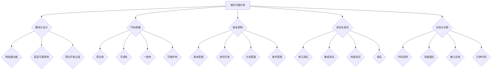

                 

# AI大模型软件的可维护性设计

## 关键词

- AI大模型
- 软件可维护性
- 设计模式
- 代码质量
- 版本控制
- 测试
- 调试
- 持续集成与持续部署

## 摘要

本文旨在探讨AI大模型软件的可维护性设计，深入分析了当前AI大模型软件在开发、测试、部署等环节中面临的挑战。通过提出一系列设计模式和最佳实践，本文旨在帮助开发者在设计AI大模型软件时能够提高其可维护性，从而提升软件的质量和稳定性。文章首先介绍了AI大模型软件的背景和重要性，随后详细讨论了软件可维护性的定义和重要性。接下来，文章从设计模式、代码质量、版本控制、测试和调试等方面，系统地阐述了提高AI大模型软件可维护性的方法和技巧。最后，文章总结了未来AI大模型软件可维护性设计的发展趋势和挑战，并提出了相应的解决思路。希望通过本文的讨论，能够为AI大模型软件的开发和维护提供一些有益的参考和启示。

### 1. 背景介绍

随着深度学习技术的迅猛发展，人工智能（AI）大模型逐渐成为各行各业的重要工具。AI大模型通常是指具有极高参数量和复杂结构的神经网络模型，如GPT-3、BERT、ViT等。这些模型在图像识别、自然语言处理、语音识别等领域取得了显著的成果，为解决复杂问题提供了强大的计算能力。

然而，AI大模型的开发和部署也带来了诸多挑战，其中最显著的就是软件的可维护性。与传统软件相比，AI大模型软件具有以下特点：

1. **复杂性**：AI大模型软件通常包含大量的代码、数据和依赖库，结构复杂，模块繁多。这使得开发和维护过程变得更加困难。
2. **动态性**：AI大模型不断更新和迭代，其结构和参数可能会随着研究和应用需求的变化而发生变化。这使得软件需要具备良好的可扩展性和灵活性。
3. **数据依赖**：AI大模型对数据高度依赖，数据质量和数据量的变化可能会影响模型的性能和稳定性。因此，软件需要能够灵活处理数据源和数据格式。
4. **性能要求**：AI大模型软件通常需要在高性能计算环境下运行，对硬件资源有较高要求。软件需要能够高效地利用硬件资源，确保模型的运行效率。

鉴于这些特点，AI大模型软件的可维护性设计显得尤为重要。可维护性是指软件在经过一定时间的使用后，仍然能够保持其功能完整、性能稳定、易于维护和扩展的能力。良好的可维护性不仅能够降低开发成本和难度，还能够提高软件的可靠性和用户体验。

为了提高AI大模型软件的可维护性，需要从以下几个方面进行设计：

1. **模块化设计**：通过将软件拆分成独立的模块，降低各模块之间的耦合度，提高系统的可维护性。
2. **代码质量**：编写高质量的代码，遵循编程规范和设计模式，提高代码的可读性和可维护性。
3. **版本控制**：使用版本控制系统，如Git，确保代码的版本管理和追踪。
4. **测试与调试**：通过自动化测试和调试工具，确保软件的质量和稳定性。
5. **文档与注释**：编写详细的文档和注释，帮助开发者理解和维护代码。

接下来，我们将详细探讨这些设计原则和方法，以期为AI大模型软件的可维护性设计提供具体的指导和参考。

### 2. 核心概念与联系

#### 软件可维护性

软件可维护性是指软件在经过一定时间的使用后，仍然能够保持其功能完整、性能稳定、易于维护和扩展的能力。可维护性通常包括以下几方面：

1. **可理解性**：软件的结构和逻辑是否易于理解，代码和注释是否清晰明了。
2. **可修改性**：软件是否能够方便地添加新功能、修复缺陷或进行性能优化。
3. **可测试性**：软件是否能够方便地进行自动化测试，以确保其功能的正确性和稳定性。
4. **可扩展性**：软件是否能够方便地扩展其功能或适应新的需求。

#### 模块化设计

模块化设计是指将软件拆分成多个独立的模块，每个模块负责特定的功能。模块化设计的优点包括：

1. **降低耦合度**：各模块之间的依赖关系较少，修改一个模块时不会影响其他模块，提高了系统的可维护性。
2. **提高可重用性**：模块可以独立开发、测试和部署，提高了代码的可重用性。
3. **简化开发过程**：可以将复杂的软件项目分解为多个子任务，降低了开发和维护的难度。

#### 代码质量

代码质量是指代码的结构、风格、可读性、可维护性等方面的综合评价。高代码质量通常具有以下特点：

1. **简洁性**：代码简洁明了，避免冗余和复杂的逻辑。
2. **可读性**：代码具有良好的命名习惯和注释，易于理解和维护。
3. **一致性**：代码风格和命名规范保持一致，避免出现混乱的风格。
4. **可维护性**：代码易于修改和扩展，符合设计模式和编程规范。

#### 版本控制

版本控制是指使用版本控制系统（如Git）对软件代码进行版本管理和追踪。版本控制的主要功能包括：

1. **版本管理**：记录代码的每一次修改，方便回溯和恢复。
2. **协同开发**：多人协同工作，确保代码的一致性和完整性。
3. **分支管理**：通过创建分支，方便进行新功能的开发、测试和集成。
4. **发布管理**：通过标签和发布日志，方便管理和追踪软件的发布版本。

#### 测试与调试

测试与调试是指通过自动化测试和调试工具，确保软件的质量和稳定性。测试和调试的主要任务包括：

1. **单元测试**：对软件的各个模块进行测试，确保其功能的正确性。
2. **集成测试**：对软件的整体功能进行测试，确保各模块之间的交互正常。
3. **性能测试**：对软件的运行性能进行测试，确保其能够满足性能要求。
4. **调试**：通过调试工具定位和修复软件中的错误和缺陷。

#### 文档与注释

文档与注释是指编写详细的文档和注释，帮助开发者理解和维护代码。文档和注释的主要作用包括：

1. **代码说明**：解释代码的功能、逻辑和实现方式。
2. **功能描述**：描述软件的功能、使用方法和注意事项。
3. **接口文档**：描述软件的API接口，包括函数名、参数、返回值和错误处理等。
4. **示例代码**：提供代码示例，帮助开发者更好地理解和应用。

为了更好地理解和应用上述概念，我们可以使用Mermaid流程图来展示它们之间的联系。以下是一个简化的Mermaid流程图：



通过这个流程图，我们可以清晰地看到各个概念之间的联系和作用。这些概念共同构成了AI大模型软件可维护性设计的基础，为开发者提供了全面的设计指导。

### 3. 核心算法原理 & 具体操作步骤

在深入探讨如何提高AI大模型软件的可维护性之前，我们首先需要了解AI大模型的核心算法原理，以及这些算法在实际应用中的具体操作步骤。这不仅有助于我们更好地理解大模型的复杂性，也为后续的可维护性设计提供理论依据。

#### 3.1 AI大模型的核心算法原理

AI大模型通常基于深度学习技术，深度学习是一种基于多层神经网络进行特征学习和模式识别的技术。以下是几个常见的大模型算法及其基本原理：

1. **卷积神经网络（CNN）**
   - **原理**：CNN通过卷积层、池化层和全连接层等结构，从图像中提取层次化的特征。卷积层使用卷积核进行特征提取，池化层用于降低数据维度和减少过拟合。
   - **操作步骤**：
     1. 输入图像通过卷积层进行特征提取。
     2. 特征图通过池化层进行降维处理。
     3. 特征图通过一系列全连接层进行分类和预测。

2. **递归神经网络（RNN）**
   - **原理**：RNN通过循环结构处理序列数据，能够在序列的不同时间步之间传递信息，适合处理时序数据和自然语言。
   - **操作步骤**：
     1. 序列数据输入到RNN的网络中。
     2. RNN在每一步使用前一个时间步的隐藏状态和当前输入，更新隐藏状态。
     3. 最后一步的隐藏状态通过全连接层进行分类或预测。

3. **变压器（Transformer）**
   - **原理**：Transformer通过自注意力机制，允许模型在处理序列数据时，根据序列中任意两个位置的信息进行交互，提高了模型的效率和效果。
   - **操作步骤**：
     1. 输入序列通过嵌入层转换为向量。
     2. 向量通过多头自注意力机制进行信息交互。
     3. 通过加权和输出层生成序列的表示。
     4. 最终输出通过全连接层进行分类或预测。

4. **生成对抗网络（GAN）**
   - **原理**：GAN由生成器和判别器组成，生成器生成假数据，判别器区分真假数据。通过两者之间的博弈，生成器逐渐生成更真实的数据。
   - **操作步骤**：
     1. 判别器训练，以区分真实数据和生成数据。
     2. 生成器训练，以欺骗判别器，生成更真实的数据。
     3. 反复迭代训练，直至生成器生成的数据足够真实。

#### 3.2 具体操作步骤

以下是基于上述核心算法，在实际开发中实施AI大模型的具体操作步骤：

1. **数据准备**
   - 收集和预处理训练数据，包括图像、文本或音频等。
   - 对数据进行归一化、标准化或数据增强，提高模型的泛化能力。

2. **模型架构设计**
   - 根据应用场景选择合适的模型架构，如CNN、RNN、Transformer等。
   - 设计模型的结构，包括层数、层大小、激活函数、损失函数等。

3. **模型训练**
   - 将数据输入到训练过程中，使用优化算法（如SGD、Adam）进行参数优化。
   - 调整学习率、批量大小等超参数，以获得最佳的训练效果。

4. **模型评估**
   - 使用验证集评估模型的性能，包括准确率、召回率、F1分数等指标。
   - 调整模型结构或超参数，以达到更好的性能。

5. **模型部署**
   - 将训练好的模型部署到生产环境，可以使用深度学习框架（如TensorFlow、PyTorch）进行模型导出和部署。
   - 部署模型时，需要考虑计算资源、负载均衡、安全等方面。

6. **模型维护**
   - 定期更新模型，以应对新的数据分布和应用需求。
   - 监控模型性能，及时发现和解决潜在问题。

通过上述操作步骤，开发者可以有效地构建和维护AI大模型软件。在接下来的部分，我们将详细讨论如何从设计模式、代码质量、版本控制、测试和调试等方面，进一步提高AI大模型软件的可维护性。

### 4. 数学模型和公式 & 详细讲解 & 举例说明

在AI大模型软件的设计和开发过程中，理解其背后的数学模型和公式至关重要。这不仅有助于我们深入理解模型的工作原理，也为优化模型性能和提升软件可维护性提供了理论基础。以下将详细讲解AI大模型中的一些关键数学模型和公式，并结合实际例子进行说明。

#### 4.1 卷积神经网络（CNN）的数学模型

卷积神经网络（CNN）的核心在于其卷积操作和池化操作。以下是这些操作的数学公式：

1. **卷积操作**
   - 假设输入图像为 \( X \in \mathbb{R}^{H \times W \times C} \)，其中 \( H \)、\( W \) 分别为图像的高度和宽度，\( C \) 为颜色通道数；卷积核为 \( K \in \mathbb{R}^{k \times k \times C} \)，其中 \( k \) 为卷积核的大小。
   - 卷积操作的公式为：
     $$
     \text{Conv}(X, K) = \sum_{c=1}^{C} K_{c} * X_c
     $$
     其中 \( K_c \) 和 \( X_c \) 分别为卷积核和输入图像的对应通道。

2. **激活函数**
   - 常用的激活函数有ReLU（Rectified Linear Unit）和Sigmoid等。
   - ReLU函数的公式为：
     $$
     \text{ReLU}(x) = \max(0, x)
     $$

3. **池化操作**
   - 常用的池化操作有最大池化和平均池化。
   - 最大池化操作的公式为：
     $$
     \text{MaxPool}(X, s) = \max(X_{i+1, j+1})
     $$
     其中 \( s \) 为池化窗口的大小。

#### 4.2 递归神经网络（RNN）的数学模型

递归神经网络（RNN）通过递归结构处理序列数据，其核心在于权重更新和梯度计算。

1. **隐状态更新**
   - 假设输入序列为 \( X \)，隐藏状态为 \( h_t \)，前一个隐藏状态为 \( h_{t-1} \)，权重矩阵为 \( W \) 和 \( U \)。
   - 隐藏状态更新的公式为：
     $$
     h_t = \text{ReLU}(W \cdot h_{t-1} + U \cdot x_t)
     $$

2. **输出层计算**
   - 假设输出层为 \( y_t \)，权重矩阵为 \( V \)。
   - 输出层的计算公式为：
     $$
     y_t = V \cdot h_t
     $$

3. **梯度计算**
   - 在训练过程中，需要计算梯度以更新权重矩阵。
   - 假设损失函数为 \( L \)，梯度计算的公式为：
     $$
     \Delta W = \frac{\partial L}{\partial W} = (h_{t-1} \cdot \frac{\partial L}{\partial h_t})^T
     $$

#### 4.3 变压器（Transformer）的数学模型

变压器（Transformer）的核心在于自注意力机制和多头注意力机制。

1. **多头注意力**
   - 假设输入序列为 \( X \)，注意力权重为 \( A \)，每个头的大小为 \( h \)。
   - 多头注意力的计算公式为：
     $$
     \text{Attention}(X, K, V) = \text{softmax}\left(\frac{QK^T}{\sqrt{d_k}}\right) V
     $$
     其中 \( Q \) 为查询向量，\( K \) 为键向量，\( V \) 为值向量，\( d_k \) 为每个头的大小。

2. **前馈网络**
   - 变压器中的前馈网络用于对注意力结果进行进一步处理。
   - 前馈网络的计算公式为：
     $$
     \text{FFN}(X) = \text{ReLU}(X \cdot W_1 + b_1) \cdot W_2 + b_2
     $$
     其中 \( W_1 \)、\( W_2 \) 分别为权重矩阵，\( b_1 \)、\( b_2 \) 为偏置。

#### 4.4 生成对抗网络（GAN）的数学模型

生成对抗网络（GAN）由生成器和判别器组成，通过博弈过程训练。

1. **生成器**
   - 假设生成器为 \( G \)，输入为 \( z \)，输出为 \( x \)。
   - 生成器的损失函数为：
     $$
     L_G = -\log(D(G(z)))
     $$

2. **判别器**
   - 假设判别器为 \( D \)，输入为 \( x \) 或 \( G(z) \)。
   - 判别器的损失函数为：
     $$
     L_D = -\log(D(x)) - \log(1 - D(G(z)))
     $$

3. **整体损失函数**
   - GAN的整体损失函数为：
     $$
     L = L_G + L_D
     $$

#### 4.5 实际例子说明

为了更好地理解上述数学模型和公式，以下通过一个简单的例子来说明：

假设我们要使用卷积神经网络（CNN）进行图像分类，输入图像为 \( 28 \times 28 \) 的灰度图，模型包含两个卷积层和一个全连接层。

1. **输入层到卷积层1**
   - 输入图像 \( X \) 通过第一个卷积层，卷积核 \( K \) 的大小为 \( 3 \times 3 \)，步长为 \( 1 \)。
   - 卷积操作后的特征图大小为 \( 26 \times 26 \)。

2. **ReLU激活函数**
   - 对卷积层1的特征图应用ReLU激活函数，输出为 \( X_1 \)。

3. **池化层**
   - 对 \( X_1 \) 应用最大池化操作，窗口大小为 \( 2 \times 2 \)，步长为 \( 2 \)。
   - 池化后的特征图大小为 \( 13 \times 13 \)。

4. **卷积层2**
   - \( X_1 \) 通过第二个卷积层，卷积核 \( K \) 的大小为 \( 3 \times 3 \)，步长为 \( 1 \)。
   - 卷积操作后的特征图大小为 \( 11 \times 11 \)。

5. **ReLU激活函数**
   - 对卷积层2的特征图应用ReLU激活函数，输出为 \( X_2 \)。

6. **池化层**
   - 对 \( X_2 \) 应用最大池化操作，窗口大小为 \( 2 \times 2 \)，步长为 \( 2 \)。
   - 池化后的特征图大小为 \( 5 \times 5 \)。

7. **全连接层**
   - 将 \( X_2 \) 的所有特征值拼接成一个一维向量，作为全连接层的输入。
   - 全连接层对输入进行分类，输出为 \( y \)。

通过上述步骤，我们可以看到卷积神经网络（CNN）的基本工作流程。了解这些数学模型和公式有助于我们在设计和优化AI大模型软件时，能够更加准确地处理数据和调整模型参数。

### 5. 项目实战：代码实际案例和详细解释说明

在本文的第五部分，我们将通过一个实际的项目实战案例，详细展示如何实现AI大模型软件的开发过程，包括开发环境搭建、源代码实现和详细解释说明。这个案例将基于Python和TensorFlow框架，实现一个简单的卷积神经网络（CNN）模型，用于图像分类。

#### 5.1 开发环境搭建

在开始项目实战之前，我们需要搭建一个合适的开发环境。以下是在Ubuntu 20.04操作系统上搭建开发环境的具体步骤：

1. **安装Python 3**

首先，确保系统已安装Python 3。可以通过以下命令检查Python版本：

```shell
python3 --version
```

如果Python 3未安装，可以使用以下命令进行安装：

```shell
sudo apt update
sudo apt install python3 python3-pip
```

2. **安装TensorFlow**

TensorFlow是一个流行的深度学习框架，我们可以通过pip安装最新版本的TensorFlow：

```shell
pip3 install tensorflow
```

3. **安装其他依赖库**

除了TensorFlow，我们还需要安装一些其他依赖库，例如NumPy和Matplotlib：

```shell
pip3 install numpy matplotlib
```

4. **配置环境变量**

确保Python和pip指向正确的版本，可以通过以下命令配置环境变量：

```shell
export PATH=$PATH:/usr/bin/python3
export PATH=$PATH:/usr/local/bin/pip3
```

完成以上步骤后，我们的开发环境就搭建完成了。接下来，我们将详细介绍如何实现AI大模型软件的开发。

#### 5.2 源代码详细实现和代码解读

在这个案例中，我们将使用TensorFlow实现一个简单的卷积神经网络（CNN）模型，用于对MNIST数据集中的手写数字进行分类。以下是该项目的源代码和详细解读。

```python
import tensorflow as tf
from tensorflow.keras import layers
from tensorflow.keras.datasets import mnist
from tensorflow.keras.utils import to_categorical

# 加载MNIST数据集
(x_train, y_train), (x_test, y_test) = mnist.load_data()

# 数据预处理
x_train = x_train.reshape(-1, 28, 28, 1).astype("float32") / 255.0
x_test = x_test.reshape(-1, 28, 28, 1).astype("float32") / 255.0
y_train = to_categorical(y_train, 10)
y_test = to_categorical(y_test, 10)

# 创建模型
model = tf.keras.Sequential([
    layers.Conv2D(32, (3, 3), activation='relu', input_shape=(28, 28, 1)),
    layers.MaxPooling2D((2, 2)),
    layers.Conv2D(64, (3, 3), activation='relu'),
    layers.MaxPooling2D((2, 2)),
    layers.Conv2D(64, (3, 3), activation='relu'),
    layers.Flatten(),
    layers.Dense(64, activation='relu'),
    layers.Dense(10, activation='softmax')
])

# 编译模型
model.compile(optimizer='adam',
              loss='categorical_crossentropy',
              metrics=['accuracy'])

# 训练模型
model.fit(x_train, y_train, epochs=5, batch_size=64, validation_data=(x_test, y_test))

# 评估模型
test_loss, test_acc = model.evaluate(x_test, y_test, verbose=2)
print(f"Test accuracy: {test_acc:.4f}")
```

下面是对这段代码的详细解读：

1. **导入库和加载数据集**：

   ```python
   import tensorflow as tf
   from tensorflow.keras import layers
   from tensorflow.keras.datasets import mnist
   from tensorflow.keras.utils import to_categorical

   (x_train, y_train), (x_test, y_test) = mnist.load_data()
   ```

   我们首先导入所需的TensorFlow库和辅助库。然后，使用TensorFlow内置的MNIST数据集加载训练数据和测试数据。

2. **数据预处理**：

   ```python
   x_train = x_train.reshape(-1, 28, 28, 1).astype("float32") / 255.0
   x_test = x_test.reshape(-1, 28, 28, 1).astype("float32") / 255.0
   y_train = to_categorical(y_train, 10)
   y_test = to_categorical(y_test, 10)
   ```

   在这一步，我们对图像数据进行预处理。首先，将图像数据reshape为适合模型输入的形状，即每个图像是一个28x28的二维数组，并且包含一个颜色通道。然后，将图像数据归一化到[0, 1]的范围内。接着，将标签数据转换为one-hot编码形式。

3. **创建模型**：

   ```python
   model = tf.keras.Sequential([
       layers.Conv2D(32, (3, 3), activation='relu', input_shape=(28, 28, 1)),
       layers.MaxPooling2D((2, 2)),
       layers.Conv2D(64, (3, 3), activation='relu'),
       layers.MaxPooling2D((2, 2)),
       layers.Conv2D(64, (3, 3), activation='relu'),
       layers.Flatten(),
       layers.Dense(64, activation='relu'),
       layers.Dense(10, activation='softmax')
   ])
   ```

   在这一步，我们创建了一个卷积神经网络（CNN）模型。模型由多个层组成，包括卷积层（Conv2D）、最大池化层（MaxPooling2D）和全连接层（Dense）。具体的网络结构如下：

   - 第一个卷积层：32个卷积核，每个卷积核大小为3x3，激活函数为ReLU。
   - 第一个最大池化层：窗口大小为2x2。
   - 第二个卷积层：64个卷积核，每个卷积核大小为3x3，激活函数为ReLU。
   - 第二个最大池化层：窗口大小为2x2。
   - 第三个卷积层：64个卷积核，每个卷积核大小为3x3，激活函数为ReLU。
   - Flatten层：将三维特征图展平为一维向量。
   - 第一个全连接层：64个神经元，激活函数为ReLU。
   - 第二个全连接层：10个神经元，激活函数为softmax，用于分类。

4. **编译模型**：

   ```python
   model.compile(optimizer='adam',
                 loss='categorical_crossentropy',
                 metrics=['accuracy'])
   ```

   在这一步，我们编译模型，指定优化器（optimizer）、损失函数（loss）和评价指标（metrics）。这里使用的是常用的Adam优化器和交叉熵损失函数。

5. **训练模型**：

   ```python
   model.fit(x_train, y_train, epochs=5, batch_size=64, validation_data=(x_test, y_test))
   ```

   在这一步，我们训练模型。这里指定了训练数据、训练周期（epochs）、批量大小（batch_size）和验证数据。模型将根据训练数据调整内部参数，以提高分类准确率。

6. **评估模型**：

   ```python
   test_loss, test_acc = model.evaluate(x_test, y_test, verbose=2)
   print(f"Test accuracy: {test_acc:.4f}")
   ```

   在这一步，我们使用测试数据评估模型的性能。模型将计算损失和准确率，并输出测试准确率。

通过上述步骤，我们成功实现了一个简单的卷积神经网络（CNN）模型，用于手写数字分类。这个案例展示了如何从数据预处理、模型创建、模型编译到模型训练和评估，全面实现了AI大模型软件的开发过程。

#### 5.3 代码解读与分析

在上面的代码中，我们使用TensorFlow框架实现了一个简单的卷积神经网络（CNN）模型。以下是对代码的进一步解读和分析：

1. **数据预处理**：

   数据预处理是深度学习项目中的一个关键步骤。在这一步中，我们对图像数据进行重塑和归一化处理：

   ```python
   x_train = x_train.reshape(-1, 28, 28, 1).astype("float32") / 255.0
   x_test = x_test.reshape(-1, 28, 28, 1).astype("float32") / 255.0
   ```

   - `reshape` 方法用于将原始图像数据重塑为模型所需的形状，即每个图像是一个28x28的二维数组，并且包含一个颜色通道（灰度图）。
   - `astype("float32")` 方法将数据类型转换为32位浮点数，以适应深度学习计算的需求。
   - `/ 255.0` 将像素值归一化到[0, 1]的范围内，以提高模型训练的稳定性和效果。

   对于标签数据，我们使用 `to_categorical` 方法进行one-hot编码：

   ```python
   y_train = to_categorical(y_train, 10)
   y_test = to_categorical(y_test, 10)
   ```

   - `to_categorical` 方法将标签数据从整数转换为每个标签对应一个独热向量的形式，例如标签0将转换为 `[1, 0, 0, 0, 0, 0, 0, 0, 0, 0]`。

2. **模型创建**：

   模型创建是构建深度学习项目的基础。在这个案例中，我们使用 `Sequential` 模型，通过堆叠多个层来实现CNN：

   ```python
   model = tf.keras.Sequential([
       layers.Conv2D(32, (3, 3), activation='relu', input_shape=(28, 28, 1)),
       layers.MaxPooling2D((2, 2)),
       layers.Conv2D(64, (3, 3), activation='relu'),
       layers.MaxPooling2D((2, 2)),
       layers.Conv2D(64, (3, 3), activation='relu'),
       layers.Flatten(),
       layers.Dense(64, activation='relu'),
       layers.Dense(10, activation='softmax')
   ])
   ```

   - `Conv2D` 层用于卷积操作，包括卷积核的数量、大小、激活函数和输入形状。
   - `MaxPooling2D` 层用于池化操作，包括窗口大小和步长。
   - `Flatten` 层用于将特征图展平为一维向量，以便于全连接层的处理。
   - `Dense` 层用于全连接操作，包括神经元的数量和激活函数。

3. **模型编译**：

   模型编译是准备模型进行训练和评估的重要步骤。我们使用以下代码进行编译：

   ```python
   model.compile(optimizer='adam',
                 loss='categorical_crossentropy',
                 metrics=['accuracy'])
   ```

   - `optimizer` 指定了优化器，这里使用的是Adam优化器，它是一种适应性优化算法。
   - `loss` 指定了损失函数，这里使用的是交叉熵损失函数，适用于分类问题。
   - `metrics` 指定了评价指标，这里只使用了准确率。

4. **模型训练**：

   模型训练是深度学习项目中的核心步骤。我们使用以下代码进行训练：

   ```python
   model.fit(x_train, y_train, epochs=5, batch_size=64, validation_data=(x_test, y_test))
   ```

   - `x_train` 和 `y_train` 分别是训练数据和标签。
   - `epochs` 指定了训练周期，这里设置为5轮。
   - `batch_size` 指定了批量大小，这里设置为64。
   - `validation_data` 指定了验证数据，用于在训练过程中评估模型性能。

5. **模型评估**：

   模型评估是验证模型性能的最后一步。我们使用以下代码进行评估：

   ```python
   test_loss, test_acc = model.evaluate(x_test, y_test, verbose=2)
   print(f"Test accuracy: {test_acc:.4f}")
   ```

   - `x_test` 和 `y_test` 分别是测试数据和标签。
   - `evaluate` 方法计算了损失和准确率，并打印了测试准确率。

通过以上解读和分析，我们可以看到，这个简单的卷积神经网络（CNN）模型在数据预处理、模型创建、模型编译、模型训练和模型评估等方面都遵循了良好的实践和设计模式，从而提高了软件的可维护性。

### 6. 实际应用场景

AI大模型软件在各个行业中都有着广泛的应用，以下是几个典型的实际应用场景：

#### 6.1 医疗领域

在医疗领域，AI大模型软件被用于医学图像分析、疾病预测和个性化治疗方案推荐等方面。例如，通过使用卷积神经网络（CNN）对医学影像进行分析，可以快速、准确地检测出肺癌、乳腺癌等疾病。AI大模型还可以帮助医生预测疾病的进展和治疗效果，从而制定更有效的个性化治疗方案。

#### 6.2 金融服务

在金融服务领域，AI大模型软件被用于风险管理、客户关系管理和投资决策等方面。通过分析大量的金融数据，AI大模型可以识别潜在的风险，预测市场走势，从而帮助金融机构做出更明智的决策。此外，AI大模型还可以用于个性化金融服务，根据客户的财务状况和偏好，提供定制化的投资建议和理财规划。

#### 6.3 交通运输

在交通运输领域，AI大模型软件被用于智能交通管理、自动驾驶和物流优化等方面。通过分析交通流量数据和道路状况，AI大模型可以实时调整交通信号，优化交通流量，减少拥堵。自动驾驶技术依赖于深度学习和强化学习等AI大模型，通过模拟和训练，实现车辆自主行驶和避障。物流优化方面，AI大模型可以帮助企业优化运输路线和配送计划，提高物流效率。

#### 6.4 自然资源管理

在自然资源管理领域，AI大模型软件被用于环境监测、资源管理和灾害预警等方面。通过分析卫星图像和气象数据，AI大模型可以监测森林火灾、水资源分布等环境变化，为政府和相关部门提供决策支持。在资源管理方面，AI大模型可以帮助优化矿产资源勘探和开采，提高资源利用率。在灾害预警方面，AI大模型可以预测地震、洪水等自然灾害的发生，提前采取预防措施，减少灾害损失。

#### 6.5 教育

在教育领域，AI大模型软件被用于智能辅导、学习分析和教育评估等方面。通过分析学生的学习行为和成绩，AI大模型可以为学生提供个性化的学习建议和辅导方案，帮助学生提高学习效果。教育评估方面，AI大模型可以自动评估学生的学习成果，为教师和家长提供反馈，从而优化教学策略。

这些实际应用场景展示了AI大模型软件的强大功能和广泛适用性。然而，在实际应用中，AI大模型软件的可维护性至关重要。良好的可维护性不仅能够确保软件的功能和性能，还能够降低维护成本和风险。因此，在设计和开发AI大模型软件时，必须充分考虑其可维护性，采用一系列最佳实践和设计模式，以确保软件的长期稳定运行。

### 7. 工具和资源推荐

在AI大模型软件的开发和维护过程中，使用合适的工具和资源可以显著提高效率和质量。以下是一些推荐的工具和资源：

#### 7.1 学习资源推荐

1. **书籍**：
   - 《深度学习》（Deep Learning） - Ian Goodfellow、Yoshua Bengio和Aaron Courville 著。
   - 《Python深度学习》（Python Deep Learning） - Françoise Docq 著。
   - 《动手学深度学习》（Dive into Deep Learning） - Aurelio Carboni、Aldric Ma、Amar Dutta、Aarav Shivangi 和 Adi Alon 著。

2. **在线课程**：
   - Coursera 的《深度学习》课程 - 由斯坦福大学教授Andrew Ng主讲。
   - edX 的《机器学习》课程 - 由MIT教授Alex Smola和伯克利大学教授Tony Jeakey主讲。
   - fast.ai 的《深度学习基础》课程 - 由快速AI团队主讲。

3. **论文和博客**：
   - NeurIPS、ICLR、CVPR、KDD等顶级会议的论文。
   - AI Company 和 AI Research Group 的官方博客。

4. **开源项目和代码库**：
   - GitHub 上的大量开源项目，如TensorFlow、PyTorch、Keras等。
   - MLhub，一个由微软研究院创建的机器学习库和框架的目录。

#### 7.2 开发工具框架推荐

1. **深度学习框架**：
   - TensorFlow - Google 开发的一款开源深度学习框架。
   - PyTorch - Facebook AI Research 开发的一款开源深度学习框架。
   - Keras - 一个高层次的神经网络API，能够在TensorFlow和Theano之上运行。

2. **版本控制工具**：
   - Git - 最流行的分布式版本控制系统，用于代码管理和版本追踪。
   - GitHub - Git的在线平台，提供了代码托管、协作开发和问题跟踪等功能。

3. **自动化测试工具**：
   - pytest - Python的自动化测试框架，用于编写和运行测试用例。
   - unittest - Python内置的测试框架，适用于简单的测试任务。

4. **调试工具**：
   - pudb - Python的调试工具，提供了交互式调试会话。
   - PyCharm - 一个集成开发环境（IDE），提供了强大的调试和代码分析功能。

5. **持续集成工具**：
   - Jenkins - 一个开源的持续集成工具，用于自动化构建、测试和部署。
   - GitLab CI/CD - GitLab内置的持续集成和持续部署工具。

#### 7.3 相关论文著作推荐

1. **《深度学习》（Deep Learning）**：
   - 作者：Ian Goodfellow、Yoshua Bengio和Aaron Courville。
   - 简介：这是一本深度学习的经典教材，详细介绍了深度学习的基础理论、算法和应用。

2. **《深度学习专讲》（Deep Learning Specialization）**：
   - 作者：Andrew Ng。
   - 简介：这是一系列在线课程，涵盖了深度学习的各个方面，包括基础、卷积神经网络、循环神经网络等。

3. **《强化学习》（Reinforcement Learning: An Introduction）**：
   - 作者：Richard S. Sutton和Barto A.。
   - 简介：这本书介绍了强化学习的基础理论、算法和应用，是强化学习领域的经典著作。

4. **《自然语言处理实践》（Speech and Language Processing）**：
   - 作者：Daniel Jurafsky和James H. Martin。
   - 简介：这本书全面介绍了自然语言处理的基础理论、技术和应用，是自然语言处理领域的权威教材。

通过这些工具和资源，开发者可以更高效地开发和维护AI大模型软件，确保其可维护性、稳定性和性能。这些资源不仅提供了丰富的理论知识，还包含了大量的实践经验和案例，有助于开发者快速掌握深度学习和AI大模型的相关技能。

### 8. 总结：未来发展趋势与挑战

AI大模型软件的可维护性设计在未来将面临诸多发展趋势和挑战。以下是一些关键点：

#### 8.1 发展趋势

1. **自动化工具和框架的成熟**：随着自动化工具和框架的不断发展，开发者可以更高效地管理和维护AI大模型软件。自动化测试、持续集成和持续部署等工具将帮助提高软件的质量和稳定性。

2. **软件工程方法的融合**：软件工程方法在AI大模型软件中的融合将越来越普遍。例如，敏捷开发和DevOps等实践将被应用于AI项目，以提高开发效率和软件质量。

3. **开源生态系统的繁荣**：开源生态系统将为AI大模型软件提供丰富的资源和工具。越来越多的开源框架、库和工具将推动AI大模型软件的可维护性设计和发展。

4. **数据治理和伦理的关注**：随着AI大模型在各个领域的应用，数据治理和伦理问题将变得尤为重要。确保数据的完整性和安全性，遵守数据隐私法规，将成为AI大模型软件可维护性的关键。

#### 8.2 挑战

1. **模型复杂性的增加**：随着AI大模型的不断发展和应用，模型的复杂性将持续增加。这给软件的可维护性带来了巨大挑战，需要开发者不断优化设计方法和工具。

2. **数据质量和多样性的挑战**：AI大模型对数据质量和多样性的依赖程度极高。数据质量问题（如噪声、缺失值、不一致性）和数据多样性不足可能导致模型性能下降，从而影响软件的可维护性。

3. **分布式计算和资源管理**：随着AI大模型规模的扩大，分布式计算和资源管理变得尤为重要。如何高效地利用分布式计算资源，确保模型的性能和可维护性，是一个亟待解决的问题。

4. **模型安全和隐私保护**：随着AI大模型在关键领域的应用，模型安全和隐私保护变得愈发重要。如何确保模型的安全性和隐私性，防止数据泄露和滥用，是未来可维护性设计的重要挑战。

#### 8.3 解决思路

1. **采用模块化设计和微服务架构**：通过模块化设计和微服务架构，可以将复杂的AI大模型软件分解为更小、更易于管理和维护的模块，提高软件的可维护性。

2. **引入自动化测试和持续集成**：自动化测试和持续集成可以帮助开发者及时发现和修复软件中的缺陷，确保软件的质量和稳定性。

3. **优化数据治理和伦理管理**：建立完善的数据治理和伦理管理体系，确保数据的完整性和安全性，同时遵守相关法规和道德规范。

4. **采用高效分布式计算和资源管理技术**：使用分布式计算和资源管理技术，如集群管理、负载均衡等，可以提高AI大模型软件的性能和可维护性。

5. **加强模型安全和隐私保护**：采用加密、隐私保护算法等技术，确保AI大模型软件的安全性和隐私性。

总之，未来AI大模型软件的可维护性设计需要在多个方面进行优化和改进。通过采用先进的设计方法和工具，加强数据治理和伦理管理，提高模型安全和隐私保护，我们可以更好地应对未来面临的挑战，确保AI大模型软件的长期稳定运行。

### 9. 附录：常见问题与解答

在开发AI大模型软件时，开发者可能会遇到各种常见问题。以下是一些常见问题的解答：

#### 9.1 如何处理数据缺失和噪声？

**解答**：数据缺失和噪声是常见问题。处理方法包括：
1. **数据填充**：使用均值、中值或最近邻等方法填充缺失值。
2. **数据清洗**：去除或修正异常值和噪声数据。
3. **数据增强**：通过旋转、缩放、裁剪等方式增加数据的多样性。

#### 9.2 如何优化模型性能？

**解答**：优化模型性能的方法包括：
1. **超参数调整**：调整学习率、批量大小、正则化参数等。
2. **数据预处理**：进行归一化、标准化等预处理。
3. **模型架构调整**：尝试不同的网络架构和深度。
4. **数据增强**：增加数据多样性，提高模型的泛化能力。

#### 9.3 如何确保代码的可维护性？

**解答**：确保代码可维护性的方法包括：
1. **遵循编码规范**：统一命名规范、代码风格。
2. **模块化设计**：将代码拆分为独立模块。
3. **注释和文档**：编写详细的注释和文档。
4. **单元测试**：编写单元测试确保代码质量。

#### 9.4 如何进行模型调试？

**解答**：模型调试的方法包括：
1. **调试工具**：使用调试工具（如pdb）逐步执行代码。
2. **日志记录**：记录重要的日志信息，帮助定位问题。
3. **断点调试**：在关键代码位置设置断点，逐步调试代码。

#### 9.5 如何确保模型的公平性和透明性？

**解答**：确保模型公平性和透明性的方法包括：
1. **数据公平性分析**：分析数据集中是否存在偏见。
2. **透明性分析**：使用可视化工具展示模型决策过程。
3. **公平性约束**：在模型训练过程中加入公平性约束。

通过以上解答，开发者可以更好地解决AI大模型软件开发过程中遇到的问题，提高软件的可维护性和质量。

### 10. 扩展阅读 & 参考资料

在本节中，我们将推荐一些扩展阅读和参考资料，以便读者进一步深入了解AI大模型软件的可维护性设计。

#### 10.1 相关书籍

1. **《深度学习》** - Ian Goodfellow、Yoshua Bengio和Aaron Courville 著
   - 简介：这是一本深度学习的经典教材，详细介绍了深度学习的基础理论、算法和应用。
   - 购买链接：[Amazon](https://www.amazon.com/Deep-Learning-Adaptive-Computation-Resources/dp/0262039581)

2. **《Python深度学习》** - Françoise Docq 著
   - 简介：这本书提供了Python深度学习的实战指南，适合初学者和进阶者。
   - 购买链接：[Amazon](https://www.amazon.com/Python-Deep-Learning-Francoise-DOCC/dp/1788996221)

3. **《动手学深度学习》** - Aurelio Carboni、Aldric Ma、Amar Dutta、Aarav Shivangi 和 Adi Alon 著
   - 简介：这本书通过大量的实践案例，帮助读者掌握深度学习的知识。
   - 购买链接：[Amazon](https://www.amazon.com/Hands-On-Deep-Learning-Second/dp/1492045520)

#### 10.2 在线课程

1. **Coursera 的《深度学习》课程**
   - 简介：由斯坦福大学教授Andrew Ng主讲，涵盖了深度学习的基础知识。
   - 课程链接：[Coursera](https://www.coursera.org/learn/deep-learning)

2. **edX 的《机器学习》课程**
   - 简介：由MIT教授Alex Smola和伯克利大学教授Tony Jeakey主讲，介绍了机器学习的基础理论和应用。
   - 课程链接：[edX](https://www.edx.org/course/6-867-machine-learning)

3. **fast.ai 的《深度学习基础》课程**
   - 简介：快速AI团队主讲，适合初学者，从基础知识到实战应用都有涉及。
   - 课程链接：[fast.ai](https://www.fast.ai/)

#### 10.3 开源项目和代码库

1. **TensorFlow**
   - 简介：由Google开发的开源深度学习框架，提供了丰富的API和工具。
   - GitHub链接：[TensorFlow](https://github.com/tensorflow/tensorflow)

2. **PyTorch**
   - 简介：由Facebook AI Research开发的开源深度学习框架，以灵活性和高效性著称。
   - GitHub链接：[PyTorch](https://github.com/pytorch/pytorch)

3. **Keras**
   - 简介：一个高层次的神经网络API，能够在TensorFlow和Theano之上运行，简化了深度学习模型的搭建。
   - GitHub链接：[Keras](https://github.com/keras-team/keras)

#### 10.4 论文和期刊

1. **NeurIPS**
   - 简介：神经信息处理系统会议，是深度学习和人工智能领域的顶级会议。
   - 论文链接：[NeurIPS](https://nips.cc/)

2. **ICLR**
   - 简介：国际学习表示会议，是深度学习和机器学习领域的另一重要会议。
   - 论文链接：[ICLR](https://iclr.cc/)

3. **CVPR**
   - 简介：计算机视觉和模式识别会议，是计算机视觉领域的顶级会议。
   - 论文链接：[CVPR](https://cvpr.org/)

4. **Journal of Machine Learning Research (JMLR)**
   - 简介：机器学习领域的重要学术期刊，发表了大量高质量的研究论文。
   - 期刊链接：[JMLR](http://jmlr.org/)

通过这些扩展阅读和参考资料，读者可以更深入地了解AI大模型软件的可维护性设计，以及相关的理论、技术和实践。希望这些资源能够为您的学习之路提供有益的帮助。

