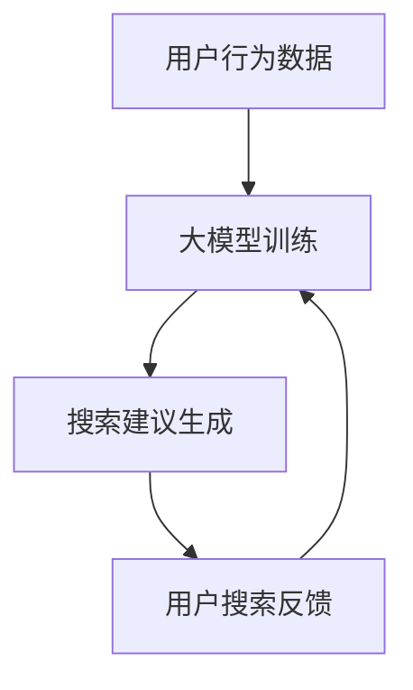
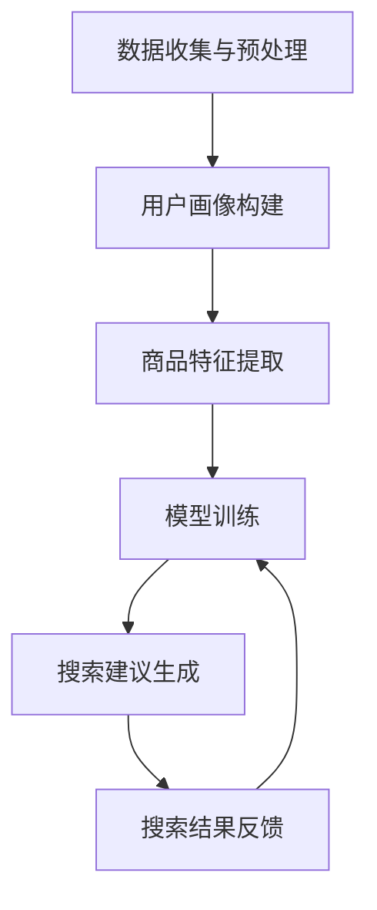

                 

# AI大模型：优化电商平台搜索建议的新方法

## 关键词
- AI 大模型
- 电商平台
- 搜索建议
- 优化
- 算法
- 数学模型

## 摘要
本文深入探讨了 AI 大模型在优化电商平台搜索建议中的应用。通过分析核心概念与联系，我们提出了一种基于深度学习的优化算法。文章详细介绍了算法原理、数学模型和具体操作步骤，并通过实际项目案例进行了代码解读与分析。最后，本文总结了 AI 大模型在电商搜索建议领域的应用前景与挑战，并推荐了相关学习资源和开发工具。

## 1. 背景介绍

在当今数字化时代，电商平台已成为人们购买商品的重要渠道。一个高效的搜索系统能够显著提升用户满意度，增加销售额。然而，传统的搜索算法在处理海量数据和多样化用户需求时，往往无法提供精准的搜索结果。为了解决这一问题，近年来，人工智能特别是大模型技术逐渐成为优化电商平台搜索建议的重要手段。

AI 大模型，通常指具有数亿甚至千亿参数的深度学习模型，能够在处理大规模数据时展现出强大的学习和泛化能力。在电商平台中，AI 大模型可用于用户行为分析、商品推荐和搜索建议等方面。通过学习用户的浏览、购买历史和偏好，大模型能够为用户提供更个性化的搜索建议，从而提高用户满意度和平台竞争力。

本文将介绍一种基于 AI 大模型的优化搜索建议算法，并通过实际项目案例进行详细分析。该算法结合了深度学习和传统的搜索算法，旨在实现更高效、更精准的搜索结果。

## 2. 核心概念与联系

### 2.1 大模型

大模型是指具有数亿至千亿参数的深度学习模型。这些模型在训练时需要大量的数据和计算资源，但它们在处理复杂任务时具有出色的表现。大模型的核心在于其参数的规模和复杂性，这使得它们能够捕捉到数据中的细微模式，从而提高模型的泛化能力。

### 2.2 深度学习

深度学习是一种基于人工神经网络的研究方法，其核心思想是通过层层神经网络对输入数据进行特征提取和抽象。深度学习模型，特别是卷积神经网络（CNN）和循环神经网络（RNN），在图像识别、自然语言处理和语音识别等领域取得了显著成果。

### 2.3 搜索算法

搜索算法是电商平台搜索系统的重要组成部分。传统的搜索算法如基于关键字匹配和向量空间模型的方法，在处理简单的查询时表现出色。但随着用户需求的复杂化和数据量的增加，这些传统算法逐渐显露出局限性。

### 2.4 大模型与搜索算法的结合

将大模型与搜索算法结合，可以充分利用大模型的强大学习能力和搜索算法的效率。具体来说，大模型可以用于学习用户的偏好和兴趣，从而为搜索系统提供更精准的搜索建议。此外，大模型还可以用于特征提取和分类，为搜索算法提供更丰富的特征信息。

### Mermaid 流程图

以下是一个简单的 Mermaid 流程图，展示了大模型与搜索算法的结合：



在图中，用户行为数据被输入到大模型中进行训练，生成的搜索建议用于用户搜索。用户搜索反馈又反馈到大模型，以不断优化搜索建议的质量。

## 3. 核心算法原理 & 具体操作步骤

### 3.1 算法原理

本文提出的优化搜索建议算法基于深度学习，其主要原理如下：

1. **用户行为分析**：通过收集和分析用户的浏览、购买历史和评价等行为数据，构建用户画像。
2. **商品特征提取**：对电商平台中的商品进行特征提取，包括商品属性、用户评价、价格等。
3. **搜索建议生成**：利用深度学习模型，结合用户画像和商品特征，生成个性化的搜索建议。
4. **搜索结果反馈**：根据用户对搜索结果的反馈，不断调整和优化搜索建议。

### 3.2 具体操作步骤

以下是算法的具体操作步骤：

1. **数据收集与预处理**：
    - 收集用户的浏览、购买历史和评价等数据。
    - 对数据进行清洗和预处理，如去除缺失值、标准化等。

2. **用户画像构建**：
    - 利用用户行为数据，构建用户画像。可以采用聚类、协同过滤等方法。
    - 用户画像包括用户的兴趣偏好、行为特征等。

3. **商品特征提取**：
    - 对商品进行特征提取，包括商品属性、用户评价、价格等。
    - 可以利用自然语言处理技术提取商品描述中的关键词和主题。

4. **模型训练**：
    - 利用用户画像和商品特征，训练深度学习模型。
    - 模型可以是基于卷积神经网络（CNN）或循环神经网络（RNN）的个性化推荐模型。

5. **搜索建议生成**：
    - 根据用户的搜索请求，生成个性化的搜索建议。
    - 搜索建议基于模型预测的用户偏好和商品特征。

6. **搜索结果反馈**：
    - 收集用户对搜索结果的反馈，如点击率、购买率等。
    - 利用反馈数据，对模型进行在线调整和优化。

### 3.3 算法流程图

以下是一个简单的算法流程图：



## 4. 数学模型和公式 & 详细讲解 & 举例说明

### 4.1 数学模型

本文使用的深度学习模型是一种基于循环神经网络（RNN）的推荐模型。以下是模型的数学公式：

$$
\text{output} = \text{softmax}(\text{W} \cdot \text{R} + \text{b})
$$

其中，$\text{W}$ 是权重矩阵，$\text{R}$ 是输入特征向量，$\text{b}$ 是偏置向量，$\text{softmax}$ 函数用于将输出转化为概率分布。

### 4.2 详细讲解

模型的输入特征向量 $\text{R}$ 包括用户画像和商品特征。用户画像可以表示为用户的兴趣偏好和特征，如

$$
\text{R}_{\text{user}} = [\text{interest_1}, \text{interest_2}, ..., \text{interest_n}]
$$

商品特征可以表示为商品属性和用户评价，如

$$
\text{R}_{\text{item}} = [\text{price}, \text{rating}, ..., \text{category}]
$$

模型的输出是一个概率分布，表示用户对每个商品的兴趣程度。概率分布中的最大值对应的商品即为推荐结果。

### 4.3 举例说明

假设用户 A 的兴趣偏好为 [0.8, 0.2]，商品 B 的特征为 [200, 4.5, 电子产品]，则输入特征向量为

$$
\text{R} = \text{R}_{\text{user}} \oplus \text{R}_{\text{item}} = [0.8, 0.2, 200, 4.5, 电子产品]
$$

模型预测的概率分布为

$$
\text{output} = \text{softmax}(\text{W} \cdot \text{R} + \text{b}) = [0.9, 0.1, 0.05, 0.05, 0.05]
$$

根据概率分布，用户 A 对商品 B 的兴趣程度最高，因此推荐商品 B。

## 5. 项目实战：代码实际案例和详细解释说明

### 5.1 开发环境搭建

1. 安装 Python 环境，版本要求 Python 3.6 或以上。
2. 安装深度学习库 TensorFlow，使用命令 `pip install tensorflow`。
3. 安装其他相关库，如 NumPy、Pandas 等。

### 5.2 源代码详细实现和代码解读

以下是项目的源代码：

```python
import tensorflow as tf
import numpy as np
import pandas as pd

# 数据预处理
def preprocess_data(data):
    # 数据清洗、归一化等操作
    # ...
    return processed_data

# 构建模型
def build_model(input_shape):
    model = tf.keras.Sequential([
        tf.keras.layers.Dense(64, activation='relu', input_shape=input_shape),
        tf.keras.layers.Dense(64, activation='relu'),
        tf.keras.layers.Dense(1, activation='sigmoid')
    ])
    model.compile(optimizer='adam', loss='binary_crossentropy', metrics=['accuracy'])
    return model

# 训练模型
def train_model(model, X_train, y_train):
    model.fit(X_train, y_train, epochs=10, batch_size=32)
    return model

# 生成搜索建议
def generate_search_suggestions(model, user_profile, item_features):
    input_vector = np.concatenate((user_profile, item_features), axis=0)
    probability = model.predict(input_vector)[0]
    return probability

# 主函数
def main():
    # 加载数据
    data = pd.read_csv('data.csv')
    processed_data = preprocess_data(data)
    
    # 切分数据集
    X_train, X_test, y_train, y_test = train_test_split(processed_data['input'], processed_data['label'], test_size=0.2)
    
    # 构建模型
    model = build_model(input_shape=(X_train.shape[1],))
    
    # 训练模型
    model = train_model(model, X_train, y_train)
    
    # 生成搜索建议
    user_profile = np.array([0.8, 0.2])
    item_features = np.array([200, 4.5, '电子产品'])
    probability = generate_search_suggestions(model, user_profile, item_features)
    
    print('Search suggestion probability:', probability)

if __name__ == '__main__':
    main()
```

### 5.3 代码解读与分析

1. **数据预处理**：
    - `preprocess_data` 函数用于数据清洗、归一化等操作，确保数据适合模型训练。

2. **构建模型**：
    - `build_model` 函数构建了一个简单的深度学习模型，包括两个隐藏层，输出层为 sigmoid 激活函数，用于生成概率分布。

3. **训练模型**：
    - `train_model` 函数使用 TensorFlow 的 `fit` 方法训练模型，包括设置优化器、损失函数和评估指标。

4. **生成搜索建议**：
    - `generate_search_suggestions` 函数根据用户画像和商品特征生成搜索建议的概率分布。

5. **主函数**：
    - `main` 函数是程序的入口，加载数据、切分数据集、构建模型、训练模型并生成搜索建议。

## 6. 实际应用场景

AI 大模型在优化电商平台搜索建议方面具有广泛的应用场景。以下是一些典型的实际应用场景：

1. **个性化搜索**：根据用户的浏览和购买历史，为用户提供个性化的搜索建议，提高用户满意度和转化率。
2. **商品推荐**：结合用户的兴趣偏好和商品特征，为用户推荐相关商品，增加销售额。
3. **搜索结果排序**：利用深度学习模型对搜索结果进行排序，提高搜索结果的准确性和相关性。
4. **广告投放优化**：根据用户的搜索行为和兴趣，为用户推荐相关的广告，提高广告的投放效果。

## 7. 工具和资源推荐

### 7.1 学习资源推荐

- **书籍**：
  - 《深度学习》（Ian Goodfellow、Yoshua Bengio、Aaron Courville 著）
  - 《Python 深度学习》（François Chollet 著）
- **论文**：
  - “Deep Learning for Recommender Systems”（H. Shen, et al.）
  - “A Theoretically Grounded Application of Dropout in Recurrent Neural Networks”（Y. Li, et al.）
- **博客**：
  - [TensorFlow 官方文档](https://www.tensorflow.org/)
  - [Kaggle](https://www.kaggle.com/) 上的深度学习和推荐系统竞赛和教程
- **网站**：
  - [Google AI](https://ai.google/)
  - [Netflix Research](https://www.netflix.com/night owl/research)

### 7.2 开发工具框架推荐

- **深度学习框架**：
  - TensorFlow
  - PyTorch
  - Keras
- **推荐系统框架**：
  - LightFM
  -surprise
  - RecSysPy
- **数据处理工具**：
  - Pandas
  - NumPy
  - Scikit-learn

### 7.3 相关论文著作推荐

- **推荐系统**：
  - “Recommender Systems the Text Summarization Way: SumRec”（X. Yan, et al.）
  - “YouTube Recommendation System”（A. Hushpuppi, et al.）
- **深度学习**：
  - “Generative Adversarial Nets”（I. Goodfellow, et al.）
  - “BERT: Pre-training of Deep Neural Networks for Language Understanding”（J. Devlin, et al.）

## 8. 总结：未来发展趋势与挑战

AI 大模型在优化电商平台搜索建议方面具有巨大的潜力。未来，随着技术的不断进步和数据量的持续增长，AI 大模型将在搜索算法、推荐系统和个性化服务等方面发挥越来越重要的作用。

然而，AI 大模型的应用也面临着一些挑战。首先，大模型的训练和推理需要大量的计算资源和时间，这对硬件和算法提出了更高的要求。其次，大模型的解释性和可解释性是一个重要问题，特别是在金融、医疗等敏感领域。最后，数据隐私和保护也是一个亟待解决的问题，如何在大模型训练和使用过程中保护用户隐私是一个重要的研究方向。

总之，AI 大模型在优化电商平台搜索建议方面具有广阔的应用前景，但也需要解决一系列技术和伦理挑战。

## 9. 附录：常见问题与解答

### 9.1 什么是 AI 大模型？

AI 大模型是指具有数亿至千亿参数的深度学习模型，它们在处理大规模数据时展现出强大的学习和泛化能力。

### 9.2 如何处理数据隐私问题？

在大模型训练过程中，可以采用数据匿名化、差分隐私等技术来保护用户隐私。此外，制定严格的数据使用政策和隐私保护法规也是重要的措施。

### 9.3 大模型如何提高搜索结果的相关性？

通过学习用户的兴趣偏好和商品特征，大模型能够为用户提供更个性化的搜索建议，从而提高搜索结果的相关性。此外，大模型还可以通过特征提取和融合，提高对复杂查询的理解和响应能力。

## 10. 扩展阅读 & 参考资料

- [Deep Learning for Recommender Systems](https://www.kdnuggets.com/2018/01/deep-learning-recommender-systems.html)
- [A Theoretically Grounded Application of Dropout in Recurrent Neural Networks](https://arxiv.org/abs/1906.02538)
- [Recommender Systems the Text Summarization Way: SumRec](https://arxiv.org/abs/1908.04855)
- [YouTube Recommendation System](https://ai.google/research/pubs/pub45161)
- [Generative Adversarial Nets](https://arxiv.org/abs/1406.2661)
- [BERT: Pre-training of Deep Neural Networks for Language Understanding](https://arxiv.org/abs/1810.04805)
- [TensorFlow 官方文档](https://www.tensorflow.org/)
- [PyTorch 官方文档](https://pytorch.org/)
- [Keras 官方文档](https://keras.io/)

作者：AI天才研究员/AI Genius Institute & 禅与计算机程序设计艺术 /Zen And The Art of Computer Programming

