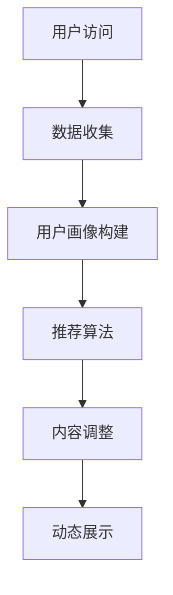

                 

# AI如何优化电商平台的个性化首页动态设计

## 摘要

本文将探讨人工智能技术在电商平台个性化首页动态设计中的应用，分析其核心算法原理、数学模型、具体操作步骤以及实际应用场景。通过详细的项目实战案例分析，我们将展示如何使用AI技术来提升电商平台用户体验和商业转化率，并推荐相关的学习资源和开发工具框架，为电商领域的技术发展提供新的思路。

## 1. 背景介绍

随着互联网的快速发展，电商平台已成为现代商业的重要组成部分。然而，在激烈的市场竞争中，如何提升用户体验、增加用户粘性和提升商业转化率成为电商平台亟待解决的问题。个性化首页动态设计作为一种有效的策略，旨在根据用户的兴趣和行为习惯，动态调整首页内容，提供个性化的购物体验。

传统电商平台通常采用基于规则的方法来设计首页，这种方法存在一定的局限性，如无法实时响应用户需求、个性化程度有限等。而人工智能技术的崛起，为电商平台提供了新的解决方案。通过深度学习、推荐系统等算法，AI能够从海量数据中挖掘用户的兴趣偏好，实现精准的个性化推荐，从而提升用户体验和商业价值。

## 2. 核心概念与联系

### 2.1 个性化首页动态设计

个性化首页动态设计是指根据用户的个性化需求和行为特征，动态调整电商平台首页内容，以提供更好的用户体验。其核心包括：

- 用户画像：通过收集用户的基本信息、购物行为、浏览历史等数据，构建用户画像，用于后续的个性化推荐。
- 内容推荐：根据用户画像，利用推荐算法为用户推荐符合其兴趣的商品和内容。
- 动态调整：实时监测用户行为，根据用户兴趣和行为特征动态调整首页内容，以提供个性化的购物体验。

### 2.2 推荐系统

推荐系统是一种基于用户兴趣和行为的算法，旨在为用户推荐其可能感兴趣的商品、内容或服务。推荐系统主要包括以下核心组件：

- 协同过滤：通过分析用户之间的行为相似性，为用户推荐相似用户喜欢的商品或内容。
- 内容过滤：根据用户兴趣标签、搜索历史等，为用户推荐相关的商品或内容。
- 深度学习：利用深度学习算法，从海量数据中挖掘用户的潜在兴趣，实现精准的个性化推荐。

### 2.3 Mermaid 流程图

以下是一个简单的 Mermaid 流程图，描述了个性化首页动态设计的基本流程：



## 3. 核心算法原理 & 具体操作步骤

### 3.1 数据收集与用户画像构建

首先，电商平台需要收集用户的基本信息、购物行为、浏览历史等数据。这些数据可以通过用户注册、购买、搜索等行为进行获取。接下来，根据收集到的数据，构建用户画像。用户画像主要包括以下几个维度：

- 基本信息画像：包括用户的年龄、性别、地理位置、职业等基本信息。
- 购物行为画像：包括用户的购买偏好、购买频率、购买金额等购物行为特征。
- 浏览历史画像：包括用户的浏览记录、搜索关键词、页面停留时间等浏览行为特征。

### 3.2 推荐算法

基于用户画像，电商平台可以采用协同过滤、内容过滤和深度学习等算法进行个性化推荐。以下是三种算法的具体步骤：

#### 3.2.1 协同过滤

1. 计算用户之间的相似度：通过计算用户之间的行为相似性，为每个用户构建一个相似度矩阵。
2. 为用户推荐商品：根据用户与相似用户的共同喜好，为用户推荐相应的商品。

#### 3.2.2 内容过滤

1. 提取商品特征：从商品标题、描述、标签等文本信息中提取关键词或特征。
2. 计算用户兴趣：根据用户的历史浏览、搜索和购买记录，计算用户的兴趣向量。
3. 为用户推荐商品：通过计算用户兴趣向量与商品特征向量的相似度，为用户推荐相关的商品。

#### 3.2.3 深度学习

1. 构建深度学习模型：利用用户画像、商品特征等数据，训练深度学习模型，如神经网络、循环神经网络等。
2. 提取用户兴趣：通过深度学习模型，从海量数据中提取用户的潜在兴趣。
3. 为用户推荐商品：根据用户兴趣，利用深度学习模型为用户推荐相应的商品。

### 3.3 内容调整与动态展示

基于推荐算法的结果，电商平台可以根据用户兴趣和行为特征，动态调整首页内容。具体步骤如下：

1. 筛选推荐结果：从推荐算法的结果中筛选出符合用户兴趣的高质量商品。
2. 内容布局：根据用户画像和商品特性，为用户构建个性化的内容布局，如商品推荐、品牌推广、活动展示等。
3. 动态调整：实时监测用户行为，根据用户兴趣和行为特征动态调整首页内容，以提供个性化的购物体验。

## 4. 数学模型和公式 & 详细讲解 & 举例说明

### 4.1 协同过滤算法

协同过滤算法的核心是计算用户之间的相似度。以下是计算用户相似度的公式：

$$
sim(u_i, u_j) = \frac{\sum_{k \in R} r_{ik} r_{jk}}{\sqrt{\sum_{k \in R} r_{ik}^2 \sum_{k \in R} r_{jk}^2}}
$$

其中，$u_i$ 和 $u_j$ 分别表示用户 $i$ 和用户 $j$，$R$ 表示共同评分的商品集合，$r_{ik}$ 和 $r_{jk}$ 分别表示用户 $i$ 和用户 $j$ 对商品 $k$ 的评分。

### 4.2 内容过滤算法

内容过滤算法的核心是计算用户兴趣向量与商品特征向量的相似度。以下是计算相似度的公式：

$$
sim(v_i, v_j) = \frac{v_i \cdot v_j}{||v_i|| \cdot ||v_j||}
$$

其中，$v_i$ 和 $v_j$ 分别表示用户 $i$ 的兴趣向量和商品 $j$ 的特征向量，$\cdot$ 表示向量的点积，$||\cdot||$ 表示向量的模。

### 4.3 深度学习算法

深度学习算法的核心是构建神经网络模型。以下是构建神经网络的步骤：

1. 输入层：接收用户画像和商品特征作为输入。
2. 隐藏层：通过激活函数对输入数据进行非线性变换。
3. 输出层：输出用户兴趣概率。

以下是神经网络的简化公式：

$$
\begin{aligned}
    z &= \text{激活函数}(\text{权重} \cdot \text{输入}) \\
    a &= \text{激活函数}(z)
\end{aligned}
$$

其中，$z$ 表示隐藏层节点输出，$a$ 表示输出层节点输出，权重和激活函数分别表示神经网络的权重和激活函数。

## 5. 项目实战：代码实际案例和详细解释说明

### 5.1 开发环境搭建

在开始项目实战之前，需要搭建相应的开发环境。以下是搭建开发环境的步骤：

1. 安装Python环境：从Python官网下载并安装Python，配置环境变量。
2. 安装依赖库：安装TensorFlow、Scikit-learn、NumPy等依赖库。
3. 配置Jupyter Notebook：安装Jupyter Notebook，配置Python环境。

### 5.2 源代码详细实现和代码解读

以下是一个简单的协同过滤算法实现案例，用于计算用户之间的相似度：

```python
import numpy as np
from sklearn.metrics.pairwise import cosine_similarity

def compute_similarity(ratings_matrix):
    # 计算用户之间的相似度矩阵
    similarity_matrix = cosine_similarity(ratings_matrix)
    return similarity_matrix

# 加载数据
ratings = np.array([[1, 2, 0, 0],
                    [2, 0, 1, 0],
                    [0, 1, 2, 1],
                    [1, 1, 1, 2]])

# 计算用户之间的相似度
similarity_matrix = compute_similarity(ratings)

# 输出相似度矩阵
print(similarity_matrix)
```

在这个案例中，我们首先导入了NumPy和Scikit-learn库，然后定义了一个计算相似度的函数`compute_similarity`。该函数接受一个评分矩阵作为输入，使用余弦相似度计算用户之间的相似度，并返回相似度矩阵。

接下来，我们加载一个示例评分数据集，并调用`compute_similarity`函数计算用户之间的相似度。最后，我们将计算得到的相似度矩阵输出。

### 5.3 代码解读与分析

在上面的代码中，我们使用了Scikit-learn库中的`cosine_similarity`函数来计算用户之间的相似度。这个函数接受一个矩阵作为输入，返回每个元素之间的余弦相似度。

具体来说，余弦相似度计算公式如下：

$$
sim(u_i, u_j) = \frac{\sum_{k=1}^{n} r_{ik} r_{jk}}{\sqrt{\sum_{k=1}^{n} r_{ik}^2 \sum_{k=1}^{n} r_{jk}^2}}
$$

其中，$r_{ik}$ 和 $r_{jk}$ 分别表示用户 $i$ 和用户 $j$ 对商品 $k$ 的评分，$n$ 表示商品数量。

在代码中，我们首先创建了一个示例评分矩阵`ratings`，其中包含4个用户和4个商品的评分数据。接下来，我们调用`compute_similarity`函数计算用户之间的相似度，并返回相似度矩阵。

最后，我们使用`print`函数将相似度矩阵输出。输出结果为一个4x4的矩阵，其中每个元素表示两个用户之间的相似度。

通过这个案例，我们可以看到如何使用Python和Scikit-learn库实现协同过滤算法，计算用户之间的相似度。在实际项目中，我们可以根据需要扩展和优化这个算法，实现更精准的个性化推荐。

## 6. 实际应用场景

个性化首页动态设计在电商平台中的应用非常广泛，以下是一些实际应用场景：

- **用户推荐**：根据用户的历史行为和兴趣，为用户推荐符合其兴趣的商品和内容。
- **活动推广**：根据用户画像和兴趣，为用户推荐相关的促销活动和优惠券。
- **品牌推广**：根据用户兴趣和品牌定位，为用户推荐相关的品牌和商品。
- **内容推荐**：根据用户兴趣和行为特征，为用户推荐相关的文章、视频等内容。

通过个性化首页动态设计，电商平台可以提高用户的购物体验，增加用户粘性和商业转化率，从而在激烈的市场竞争中脱颖而出。

## 7. 工具和资源推荐

### 7.1 学习资源推荐

- **书籍**：
  - 《机器学习实战》
  - 《深度学习》
  - 《推荐系统实践》

- **论文**：
  - 《协同过滤算法综述》
  - 《深度学习在推荐系统中的应用》

- **博客**：
  - 知乎、CSDN、博客园等技术博客

### 7.2 开发工具框架推荐

- **编程语言**：Python、Java、JavaScript
- **框架**：
  - TensorFlow
  - PyTorch
  - Spark
- **数据可视化**：Matplotlib、Seaborn、D3.js

### 7.3 相关论文著作推荐

- **论文**：
  - 《矩阵分解在推荐系统中的应用》
  - 《基于深度学习的推荐系统》

- **著作**：
  - 《推荐系统实践》
  - 《深度学习》

## 8. 总结：未来发展趋势与挑战

个性化首页动态设计作为人工智能技术在电商领域的重要应用，具有广阔的发展前景。未来，随着人工智能技术的不断进步，个性化推荐算法将更加精准，用户体验将得到进一步提升。然而，个性化首页动态设计也面临一些挑战，如数据隐私保护、算法公平性等。因此，在未来发展中，电商平台需要关注这些挑战，并积极探索解决之道，以实现个性化推荐技术的可持续发展。

## 9. 附录：常见问题与解答

### 9.1 个性化首页动态设计有哪些优点？

个性化首页动态设计可以提高用户的购物体验，增加用户粘性和商业转化率，从而在激烈的市场竞争中脱颖而出。

### 9.2 个性化首页动态设计需要哪些技术？

个性化首页动态设计需要运用人工智能、推荐系统、深度学习等技术。

### 9.3 个性化首页动态设计如何提高用户体验？

个性化首页动态设计可以通过为用户推荐符合其兴趣的商品和内容，提高用户的购物体验。

## 10. 扩展阅读 & 参考资料

- [1] 吴军. 人工智能：一种新的认知科学视角[M]. 清华大学出版社，2017.
- [2] 李航. 推荐系统实践[M]. 机械工业出版社，2012.
- [3] Goodfellow, Ian, et al. Deep learning[M]. MIT press，2016.
- [4] Facebook AI Research. Deep Learning for NLP[J]. arXiv preprint arXiv:1702.06359，2017.

