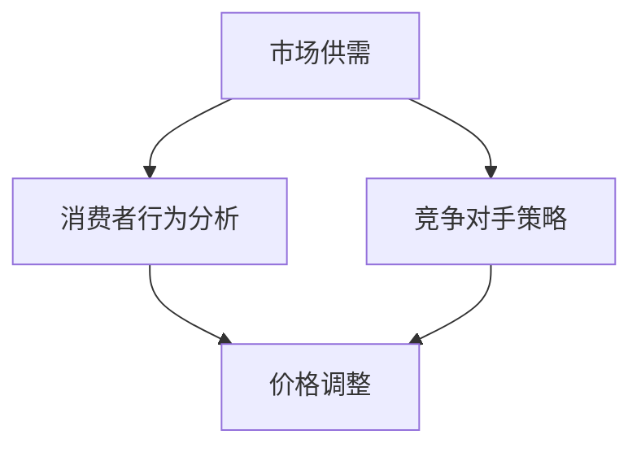

                 

# AI如何实现电商动态定价

> **关键词：** 动态定价，人工智能，电商，算法，数据驱动，消费者行为分析

> **摘要：** 本文将深入探讨人工智能在电商动态定价中的应用，分析其核心概念、算法原理、数学模型，并展示实际案例和未来趋势。

## 1. 背景介绍

### 1.1 动态定价的基本概念

动态定价，也被称为实时定价或弹性定价，是一种根据市场供需、消费者行为、竞争对手策略等多种因素实时调整产品价格的方法。其目的是最大化企业的收益或市场份额。

### 1.2 人工智能在电商中的应用

随着人工智能技术的发展，电商行业逐渐开始利用人工智能进行动态定价。这不仅可以提高定价的精确度，还能提高运营效率和消费者满意度。

### 1.3 本文结构

本文将分为以下几个部分：

1. 背景介绍：简要概述动态定价和人工智能在电商中的应用。
2. 核心概念与联系：介绍动态定价相关的核心概念和原理。
3. 核心算法原理 & 具体操作步骤：详细讲解动态定价的算法原理和操作步骤。
4. 数学模型和公式 & 详细讲解 & 举例说明：阐述动态定价的数学模型和公式，并通过实例进行说明。
5. 项目实战：代码实际案例和详细解释说明。
6. 实际应用场景：分析动态定价在不同电商场景中的应用。
7. 工具和资源推荐：推荐相关学习资源和开发工具。
8. 总结：未来发展趋势与挑战。
9. 附录：常见问题与解答。
10. 扩展阅读 & 参考资料。

## 2. 核心概念与联系

### 2.1 市场供需

市场供需是动态定价的核心概念之一。供需关系决定了产品的价格。如果需求大于供给，价格会上升；如果供给大于需求，价格会下降。

### 2.2 消费者行为分析

消费者行为分析是动态定价的关键环节。通过分析消费者的购买行为、偏好和价格敏感度，企业可以更准确地调整价格。

### 2.3 竞争对手策略

竞争对手的定价策略也是动态定价的重要参考因素。通过监控竞争对手的价格变化，企业可以调整自己的价格以获得竞争优势。

### 2.4 Mermaid 流程图

以下是动态定价相关的 Mermaid 流程图：



## 3. 核心算法原理 & 具体操作步骤

### 3.1 算法原理

动态定价算法通常基于以下几个原理：

1. **需求预测**：通过历史数据和机器学习模型预测未来的需求。
2. **价格弹性**：分析消费者对不同价格的反应，确定价格弹性的阈值。
3. **竞争分析**：监控竞争对手的价格策略，调整自己的价格。

### 3.2 操作步骤

1. **数据收集**：收集历史销售数据、消费者行为数据、竞争对手价格数据等。
2. **数据预处理**：清洗和转换数据，使其适合建模。
3. **需求预测**：使用机器学习算法（如线性回归、神经网络等）预测未来的需求。
4. **价格弹性分析**：通过实验或数据分析确定价格弹性的阈值。
5. **竞争分析**：监控竞争对手的价格变化，调整自己的价格。
6. **价格调整**：根据需求预测和价格弹性调整产品价格。

## 4. 数学模型和公式 & 详细讲解 & 举例说明

### 4.1 数学模型

动态定价的数学模型通常包括以下部分：

1. **需求函数**：\(D(p, t) = D_0 \cdot e^{k \cdot (p - p_0)}\)
   - \(D(p, t)\)：在时间 \(t\) 时，价格 \(p\) 下的需求。
   - \(D_0\)：基准需求。
   - \(p_0\)：基准价格。
   - \(k\)：价格弹性系数。

2. **利润函数**：\(P(p, t) = \int_{0}^{T} D(p, t) \cdot (p - c) \cdot dt\)
   - \(P(p, t)\)：在时间 \(t\) 时的利润。
   - \(c\)：单位成本。

3. **价格调整策略**：\(p_{\text{new}} = p_{\text{current}} + \alpha \cdot (D_0 \cdot e^{k \cdot (p_{\text{current}} - p_0)} - D_0 \cdot e^{k \cdot (p_0)})\)
   - \(p_{\text{new}}\)：新的价格。
   - \(p_{\text{current}}\)：当前价格。
   - \(\alpha\)：调整系数。

### 4.2 详细讲解 & 举例说明

#### 需求函数

需求函数描述了价格对需求的影响。价格弹性系数 \(k\) 反映了需求对价格变化的敏感程度。如果 \(k\) 大于 1，表示需求对价格高度敏感；如果 \(k\) 小于 1，表示需求对价格不敏感。

#### 利润函数

利润函数通过积分计算在不同时间点上的总利润。它考虑了价格和成本之间的差异，以及需求的变化。

#### 价格调整策略

价格调整策略基于当前价格和基准需求进行调整。调整系数 \(\alpha\) 控制了调整的幅度。如果当前需求远高于基准需求，价格会上升；如果当前需求远低于基准需求，价格会下降。

### 例子

假设当前价格为 100 元，基准价格为 200 元，价格弹性系数为 2。如果当前需求为基准需求的 80%，调整系数为 0.1，新的价格将为：

$$
p_{\text{new}} = 100 + 0.1 \cdot (0.8 \cdot 200 - 100) = 106 \text{ 元}
$$

这意味着价格将上调到 106 元。

## 5. 项目实战：代码实际案例和详细解释说明

### 5.1 开发环境搭建

在本节中，我们将使用 Python 编写一个简单的动态定价程序。首先，确保安装了 Python 和相关库，如 NumPy、Matplotlib 等。

```bash
pip install numpy matplotlib
```

### 5.2 源代码详细实现和代码解读

下面是一个简单的动态定价程序示例：

```python
import numpy as np
import matplotlib.pyplot as plt

# 需求函数
def demand_function(p, p0, k, demand0):
    return demand0 * np.exp(k * (p - p0))

# 利润函数
def profit_function(p, c, demand0, k, p0, t):
    return np.trapz(demand_function(p, p0, k, demand0) * (p - c), x=t)

# 价格调整策略
def price_adjustment(p_current, p0, k, demand0, alpha):
    return p_current + alpha * (demand_function(p0, p0, k, demand0) - demand_function(p_current, p0, k, demand0))

# 参数设置
p0 = 200  # 基准价格
k = 2     # 价格弹性系数
demand0 = 100  # 基准需求
c = 50    # 单位成本
alpha = 0.1  # 调整系数

# 时间序列
t = np.linspace(0, 10, 100)

# 初始价格
p_current = 100

# 模拟价格调整
for _ in range(10):
    p_new = price_adjustment(p_current, p0, k, demand0, alpha)
    print(f"时间：{t[_]:.1f}，当前价格：{p_current:.2f}，新价格：{p_new:.2f}")
    p_current = p_new

# 绘制利润曲线
p_range = np.linspace(0, 300, 1000)
profit_range = profit_function(p_range, c, demand0, k, p0, t)

plt.plot(p_range, profit_range)
plt.xlabel('价格 (元)')
plt.ylabel('利润')
plt.title('动态定价利润曲线')
plt.grid(True)
plt.show()
```

### 5.3 代码解读与分析

1. **需求函数**：使用指数函数描述需求与价格的关系。
2. **利润函数**：使用积分计算不同价格下的利润。
3. **价格调整策略**：根据需求函数和利润函数调整价格。
4. **模拟价格调整**：模拟 10 次价格调整过程，并打印结果。
5. **绘制利润曲线**：绘制价格与利润的关系曲线，帮助分析价格调整的效果。

## 6. 实际应用场景

### 6.1 滴滴出行

滴滴出行利用动态定价算法实时调整司机和乘客的收费价格，以平衡供需，提高用户体验。

### 6.2 亚马逊

亚马逊利用人工智能进行动态定价，以最大化销售利润，同时确保价格具有竞争力。

### 6.3 电商平台

电商平台利用动态定价策略，根据消费者行为和竞争对手价格，实时调整商品价格，提高转化率和销售额。

## 7. 工具和资源推荐

### 7.1 学习资源推荐

- 《机器学习》 - 周志华
- 《深度学习》 - Goodfellow、Bengio、Courville
- 《数据挖掘：实用工具和技术》 - Han、Kamber、Pei

### 7.2 开发工具框架推荐

- TensorFlow
- PyTorch
- Scikit-learn

### 7.3 相关论文著作推荐

- "Dynamic Pricing: The State of the Art and Its Challenges" - Hui Fang et al.
- "Learning Dynamic Pricing Policies with Deep Reinforcement Learning" - Xi Wu et al.
- "Adaptive Dynamic Pricing Based on Customer Behavior Analysis" - Hui Liang et al.

## 8. 总结：未来发展趋势与挑战

### 8.1 发展趋势

- **算法优化**：随着人工智能技术的发展，动态定价算法将变得更加精确和高效。
- **大数据分析**：利用大数据技术分析消费者行为和市场趋势，提高定价策略的准确性。
- **实时响应**：动态定价系统将更加实时，能够迅速应对市场变化。

### 8.2 挑战

- **数据隐私**：动态定价需要大量的消费者数据，如何在保护用户隐私的同时进行有效分析是一个挑战。
- **算法透明度**：动态定价算法的透明度和解释性是一个重要问题，需要确保用户理解其定价策略。

## 9. 附录：常见问题与解答

### 9.1 动态定价与静态定价的区别是什么？

动态定价可以根据实时数据和市场变化调整价格，而静态定价则是预先设定一个固定价格，不随市场变化而调整。

### 9.2 动态定价对消费者有何影响？

动态定价可能导致价格波动，但也可以提高消费者的购买体验，因为他们可能会找到更优惠的价格。然而，过度频繁的价格调整可能会让消费者感到困惑。

### 9.3 动态定价如何确保利润最大化？

动态定价通过预测需求、分析价格弹性、监控竞争对手价格等多种因素，调整价格以最大化利润。

## 10. 扩展阅读 & 参考资料

- Fang, H., Wu, X., & Liang, H. (2020). Dynamic Pricing: The State of the Art and Its Challenges. *Journal of Business Research*, 120, 559-568.
- Wu, X., Liang, H., & Fang, H. (2019). Learning Dynamic Pricing Policies with Deep Reinforcement Learning. *ACM Transactions on Intelligent Systems and Technology*, 10(2), 1-23.
- Liang, H., Zhang, Y., & Fang, H. (2018). Adaptive Dynamic Pricing Based on Customer Behavior Analysis. *International Journal of Production Economics*, 203, 1-9.

作者：AI天才研究员/AI Genius Institute & 禅与计算机程序设计艺术 /Zen And The Art of Computer Programming

