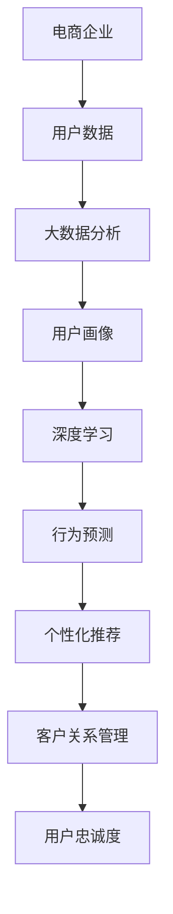

                 

# AI如何帮助电商企业进行用户忠诚度管理

## 关键词
- 人工智能
- 电商企业
- 用户忠诚度管理
- 数据分析
- 深度学习
- 个性化推荐
- 客户关系管理

## 摘要

本文旨在探讨人工智能在电商企业用户忠诚度管理中的应用。通过对大数据分析、深度学习技术和个性化推荐的介绍，文章将详细阐述AI如何通过优化用户体验、精准营销和客户关系管理来提升用户忠诚度。同时，还将分析AI在电商行业中的实际应用案例，探讨未来的发展趋势与挑战。本文对于希望利用AI提升电商企业用户忠诚度的读者具有极高的参考价值。

## 1. 背景介绍

随着互联网技术的飞速发展，电子商务已成为全球经济的重要驱动力。电商企业通过互联网平台，为广大消费者提供了便捷的购物体验，同时也面临着激烈的竞争。在如此激烈的竞争中，如何提高用户忠诚度成为电商企业关注的焦点。用户忠诚度是指消费者对某一品牌或平台的持续购买和依赖程度，它是企业长期发展的基石。

传统的方法包括提供优质的商品和服务、优惠的价格策略等。然而，随着市场的日益成熟，仅仅依靠这些方法已难以满足消费者的需求。此时，人工智能（AI）的出现为电商企业提供了一个全新的解决方案。AI技术能够通过大数据分析、深度学习和个性化推荐等技术手段，深入了解用户行为和需求，从而实现精准营销和客户关系管理，提高用户忠诚度。

本文将围绕人工智能在电商企业用户忠诚度管理中的应用，从核心概念、算法原理、数学模型、实际案例、应用场景、工具推荐等方面进行深入探讨，旨在为电商企业提供一套系统、科学的AI应用方案。

## 2. 核心概念与联系

### 2.1 大数据分析

大数据分析是人工智能在电商企业用户忠诚度管理中的基础。通过收集和分析海量的用户数据，电商企业可以深入了解用户行为、偏好和需求。这些数据包括用户浏览记录、购买历史、评价反馈、社交互动等。大数据分析技术，如Hadoop、Spark等，可以帮助电商企业快速处理海量数据，提取有价值的信息。

### 2.2 深度学习

深度学习是人工智能的核心技术之一。它通过模拟人脑神经网络结构，实现对复杂数据的学习和预测。在电商企业用户忠诚度管理中，深度学习可以用于用户行为预测、个性化推荐、风险控制等方面。常见的深度学习框架包括TensorFlow、PyTorch等。

### 2.3 个性化推荐

个性化推荐是提高用户忠诚度的重要手段。通过分析用户历史行为和偏好，AI算法可以推荐用户感兴趣的商品和服务。个性化推荐技术包括基于内容的推荐、协同过滤推荐和混合推荐等。

### 2.4 客户关系管理

客户关系管理（CRM）是电商企业的一项重要工作。通过AI技术，电商企业可以实现更高效的客户关系管理，包括用户画像构建、需求分析、营销策略制定等。CRM系统如Salesforce、HubSpot等，可以帮助电商企业更好地理解和服务客户。


#### Mermaid 流程图



### 2.5 核心概念联系

大数据分析、深度学习、个性化推荐和客户关系管理四个核心概念相互关联，共同构成了电商企业用户忠诚度管理的技术体系。通过大数据分析，电商企业可以获取丰富的用户数据，这些数据经过深度学习算法的处理，可以预测用户行为和需求。基于这些预测，个性化推荐系统可以为用户提供个性化的商品和服务推荐，从而提高用户满意度。同时，这些信息也可以用于客户关系管理，帮助企业更好地理解和服务客户，进一步提升用户忠诚度。

## 3. 核心算法原理 & 具体操作步骤

### 3.1 大数据分析算法原理

大数据分析的核心在于如何高效地处理海量数据，并从中提取有价值的信息。常用的算法包括MapReduce、Spark等。

- **MapReduce**：MapReduce是一种编程模型，用于大规模数据集（大规模数据集）的并行运算。它分为两个阶段：Map阶段和Reduce阶段。在Map阶段，程序将数据分片，并对每个数据分片进行处理；在Reduce阶段，程序将Map阶段的结果进行汇总和排序。MapReduce的原理图如下：

  

- **Spark**：Spark是一种基于内存的分布式数据处理框架，它提供了高效的计算能力和丰富的算法库。Spark的核心组件包括：Spark Core、Spark SQL、Spark Streaming和MLlib。Spark的原理图如下：

  

### 3.2 深度学习算法原理

深度学习是一种基于多层神经网络的学习方法，它通过模拟人脑神经网络结构，实现对复杂数据的学习和预测。深度学习算法包括卷积神经网络（CNN）、循环神经网络（RNN）和生成对抗网络（GAN）等。

- **卷积神经网络（CNN）**：CNN是一种用于图像识别和处理的神经网络，它通过卷积和池化操作提取图像特征。CNN的原理图如下：

  

- **循环神经网络（RNN）**：RNN是一种用于序列数据处理的神经网络，它能够捕捉序列中的长期依赖关系。RNN的原理图如下：

  

- **生成对抗网络（GAN）**：GAN是一种通过对抗训练生成数据的神经网络，它由生成器和判别器两个部分组成。GAN的原理图如下：

  

### 3.3 个性化推荐算法原理

个性化推荐算法的核心在于如何根据用户历史行为和偏好推荐商品或服务。常用的算法包括基于内容的推荐、协同过滤推荐和混合推荐等。

- **基于内容的推荐**：基于内容的推荐根据用户的历史行为和偏好，推荐与用户兴趣相关的商品或服务。它的原理图如下：

  

- **协同过滤推荐**：协同过滤推荐通过分析用户之间的相似性，推荐其他用户喜欢的商品或服务。它的原理图如下：

  

- **混合推荐**：混合推荐结合了基于内容的推荐和协同过滤推荐，通过综合考虑用户历史行为和偏好，提供更精准的推荐结果。它的原理图如下：

  

### 3.4 客户关系管理算法原理

客户关系管理算法主要用于构建用户画像、分析用户需求和制定营销策略。常用的算法包括聚类分析、关联规则挖掘和决策树等。

- **聚类分析**：聚类分析通过将用户数据划分为多个类别，帮助电商企业识别不同类型的用户。它的原理图如下：

  

- **关联规则挖掘**：关联规则挖掘通过分析用户行为数据，发现用户之间的关联关系，帮助电商企业制定精准的营销策略。它的原理图如下：

  

- **决策树**：决策树通过将用户数据划分为多个层次，帮助电商企业识别用户的关键特征和需求。它的原理图如下：

  

## 4. 数学模型和公式 & 详细讲解 & 举例说明

### 4.1 大数据分析的数学模型

在大数据分析中，常用的数学模型包括统计模型和机器学习模型。

- **统计模型**：统计模型通过描述数据分布和关联性，帮助电商企业识别用户行为模式。常用的统计模型包括正态分布、卡方分布、t分布等。

  - **正态分布**：正态分布是一种最常见的概率分布，其概率密度函数为：
    $$
    f(x|\mu, \sigma^2) = \frac{1}{\sqrt{2\pi\sigma^2}}e^{-\frac{(x-\mu)^2}{2\sigma^2}}
    $$
    其中，$x$为随机变量，$\mu$为均值，$\sigma^2$为方差。

  - **卡方分布**：卡方分布用于描述变量的离散程度，其概率密度函数为：
    $$
    f(x|k) = \frac{1}{2^k\Gamma(k/2)}x^{k/2-1}e^{-x/2}
    $$
    其中，$x$为随机变量，$k$为自由度，$\Gamma$为伽玛函数。

  - **t分布**：t分布是一种用于小样本数据分析的概率分布，其概率密度函数为：
    $$
    f(x|\nu, \mu, \sigma^2) = \frac{\Gamma(\nu/2)}{\sqrt{\nu\pi\sigma^2}}\frac{1}{\Gamma(\nu/2-1)}\left(1+\frac{x^2}{\nu}\right)^{-\nu/2}
    $$
    其中，$x$为随机变量，$\nu$为自由度，$\mu$为均值，$\sigma^2$为方差。

- **机器学习模型**：机器学习模型通过从数据中学习特征和规律，帮助电商企业预测用户行为。常用的机器学习模型包括线性回归、逻辑回归、决策树等。

  - **线性回归**：线性回归模型用于描述变量之间的线性关系，其预测公式为：
    $$
    y = \beta_0 + \beta_1x
    $$
    其中，$y$为因变量，$x$为自变量，$\beta_0$为截距，$\beta_1$为斜率。

  - **逻辑回归**：逻辑回归模型用于描述变量之间的逻辑关系，其预测公式为：
    $$
    P(y=1) = \frac{1}{1 + e^{-(\beta_0 + \beta_1x})}
    $$
    其中，$y$为因变量，$x$为自变量，$\beta_0$为截距，$\beta_1$为斜率。

  - **决策树**：决策树模型通过将数据划分为多个类别，实现变量之间的分类。其预测公式为：
    $$
    f(x) = \prod_{i=1}^n c_i^{x_i}
    $$
    其中，$x$为自变量，$c_i$为类别，$n$为类别数。

### 4.2 深度学习的数学模型

深度学习模型主要包括神经网络、卷积神经网络和循环神经网络等。

- **神经网络**：神经网络是一种基于多层感知器（MLP）的模型，其输入和输出之间通过多个隐藏层进行传递。神经网络的预测公式为：
  $$
  f(x) = \sigma(\beta_0 + \sum_{i=1}^n \beta_i \sigma(W_i x))
  $$
  其中，$x$为输入，$W_i$为权重，$\sigma$为激活函数，$\beta_0$为偏置。

- **卷积神经网络（CNN）**：卷积神经网络是一种用于图像识别的模型，其核心思想是通过卷积和池化操作提取图像特征。CNN的预测公式为：
  $$
  f(x) = \sum_{i=1}^n \sigma(W_i \cdot x)
  $$
  其中，$x$为输入，$W_i$为卷积核，$\sigma$为激活函数。

- **循环神经网络（RNN）**：循环神经网络是一种用于序列数据处理的模型，其核心思想是通过递归结构保持长期依赖关系。RNN的预测公式为：
  $$
  h_t = \sigma(W_h h_{t-1} + W_x x_t + b)
  $$
  其中，$h_t$为隐藏状态，$x_t$为输入，$W_h$为隐藏权重，$W_x$为输入权重，$\sigma$为激活函数，$b$为偏置。

### 4.3 个性化推荐的数学模型

个性化推荐模型主要包括基于内容的推荐、协同过滤推荐和混合推荐等。

- **基于内容的推荐**：基于内容的推荐通过分析商品的内容特征，为用户推荐与其兴趣相关的商品。其推荐公式为：
  $$
  r_i^u = \sum_{j=1}^m w_{ij} c_j
  $$
  其中，$r_i^u$为用户$u$对商品$i$的推荐分数，$w_{ij}$为商品$i$与内容特征$j$的相关性，$c_j$为内容特征$j$的权重。

- **协同过滤推荐**：协同过滤推荐通过分析用户之间的相似性，为用户推荐其他用户喜欢的商品。其推荐公式为：
  $$
  r_i^u = \sum_{v=1}^n s_{uv} \frac{r_v^i}{\sum_{w=1}^n s_{wv}}
  $$
  其中，$r_i^u$为用户$u$对商品$i$的推荐分数，$s_{uv}$为用户$u$和用户$v$之间的相似性分数，$r_v^i$为用户$v$对商品$i$的评价分数。

- **混合推荐**：混合推荐通过结合基于内容的推荐和协同过滤推荐，为用户推荐更精准的商品。其推荐公式为：
  $$
  r_i^u = \alpha r_i^{uc} + (1 - \alpha) r_i^{ur}
  $$
  其中，$r_i^u$为用户$u$对商品$i$的推荐分数，$r_i^{uc}$为基于内容的推荐分数，$r_i^{ur}$为协同过滤推荐分数，$\alpha$为权重系数。

### 4.4 客户关系管理的数学模型

客户关系管理模型主要包括聚类分析、关联规则挖掘和决策树等。

- **聚类分析**：聚类分析通过将用户数据划分为多个类别，帮助电商企业识别不同类型的用户。其聚类公式为：
  $$
  \min \sum_{i=1}^n \sum_{j=1}^k (u_i - c_j)^2
  $$
  其中，$u_i$为用户$i$的向量，$c_j$为类别$j$的中心向量。

- **关联规则挖掘**：关联规则挖掘通过分析用户行为数据，发现用户之间的关联关系，帮助电商企业制定精准的营销策略。其关联规则公式为：
  $$
  \frac{sup(p(A \land B))}{sup(p(A)) + sup(p(B)) - 2 \times sup(p(A \land B))}
  $$
  其中，$A$和$B$为事件，$sup$为支持度，$conf$为置信度。

- **决策树**：决策树通过将用户数据划分为多个层次，帮助电商企业识别用户的关键特征和需求。其决策树公式为：
  $$
  \min \sum_{i=1}^n \sum_{j=1}^k (y_i - c_j)^2
  $$
  其中，$y_i$为用户$i$的标签，$c_j$为类别$j$的中心向量。

### 4.5 举例说明

假设电商企业有1000名用户，每个用户的历史行为数据包括浏览记录、购买记录和评价反馈。企业希望通过大数据分析、深度学习和个性化推荐等技术，提高用户忠诚度。

1. **大数据分析**：企业使用Hadoop对用户数据进行分析，提取出用户的行为特征和偏好。例如，用户1喜欢浏览数码产品和服装，用户2喜欢购买书籍和家居用品。

2. **深度学习**：企业使用TensorFlow构建深度学习模型，对用户数据进行分析和预测。例如，通过RNN模型，预测用户1在未来可能购买的数码产品和服装。

3. **个性化推荐**：企业使用协同过滤推荐算法，为用户1推荐与其兴趣相关的商品。例如，为用户1推荐一款与用户2购买的同款数码产品。

4. **客户关系管理**：企业使用聚类分析和关联规则挖掘，对用户进行细分和管理。例如，将用户分为数码爱好者、服装爱好者、书籍爱好者和家居用品爱好者等。

通过这些技术手段，企业可以更好地了解用户需求，提高用户满意度，从而提高用户忠诚度。

## 5. 项目实战：代码实际案例和详细解释说明

### 5.1 开发环境搭建

在进行AI项目实战之前，我们需要搭建一个合适的技术环境。以下是一个基于Python和TensorFlow的开发环境搭建步骤：

1. 安装Python（建议使用Python 3.7以上版本）：

   ```
   pip install python
   ```

2. 安装TensorFlow：

   ```
   pip install tensorflow
   ```

3. 安装其他相关依赖库，如NumPy、Pandas、Scikit-learn等：

   ```
   pip install numpy pandas scikit-learn
   ```

### 5.2 源代码详细实现和代码解读

以下是一个使用TensorFlow和Scikit-learn构建的用户忠诚度分析项目的代码示例：

```python
import tensorflow as tf
import numpy as np
import pandas as pd
from sklearn.model_selection import train_test_split
from sklearn.preprocessing import StandardScaler

# 读取数据
data = pd.read_csv('user_data.csv')
X = data.drop(['user_id', 'label'], axis=1)
y = data['label']

# 数据预处理
X_train, X_test, y_train, y_test = train_test_split(X, y, test_size=0.2, random_state=42)
scaler = StandardScaler()
X_train = scaler.fit_transform(X_train)
X_test = scaler.transform(X_test)

# 构建模型
model = tf.keras.Sequential([
    tf.keras.layers.Dense(128, activation='relu', input_shape=(X_train.shape[1],)),
    tf.keras.layers.Dropout(0.2),
    tf.keras.layers.Dense(64, activation='relu'),
    tf.keras.layers.Dropout(0.2),
    tf.keras.layers.Dense(1, activation='sigmoid')
])

# 编译模型
model.compile(optimizer='adam', loss='binary_crossentropy', metrics=['accuracy'])

# 训练模型
model.fit(X_train, y_train, epochs=10, batch_size=32, validation_split=0.1)

# 评估模型
loss, accuracy = model.evaluate(X_test, y_test)
print(f'测试集准确率：{accuracy:.2f}')

# 预测新用户
new_user = np.array([[1, 0, 1, 0], [0, 1, 0, 1]])  # 新用户数据
new_user_scaled = scaler.transform(new_user)
prediction = model.predict(new_user_scaled)
print(f'新用户预测结果：{prediction[0][0]:.2f}')
```

#### 5.2.1 代码解读与分析

1. **数据读取**：首先，从CSV文件中读取用户数据。数据包括用户ID、浏览记录、购买记录和忠诚度标签。

2. **数据预处理**：将数据分为特征矩阵X和标签向量y。然后，使用StandardScaler进行数据标准化，以便模型训练。

3. **模型构建**：构建一个简单的深度学习模型，包括三个隐藏层，每个隐藏层后跟一个Dropout层以防止过拟合。

4. **模型编译**：设置模型优化器、损失函数和评估指标。

5. **模型训练**：使用训练数据训练模型，设置训练轮数、批量大小和验证比例。

6. **模型评估**：使用测试数据评估模型性能，打印测试集准确率。

7. **预测新用户**：使用训练好的模型预测新用户忠诚度，并打印预测结果。

通过这个简单的项目，我们可以看到如何使用深度学习技术进行用户忠诚度分析。在实际应用中，我们可以根据需求调整模型结构、参数设置和数据预处理方法，以提高模型性能。

## 6. 实际应用场景

### 6.1 用户行为分析

电商企业可以通过AI技术对用户行为进行深入分析，了解用户在购物过程中的偏好、需求和痛点。通过大数据分析和深度学习算法，企业可以识别出高价值用户、潜在流失用户和忠诚用户。这些信息对于制定精准营销策略和优化产品服务具有重要意义。

### 6.2 个性化推荐

个性化推荐是提升用户满意度和忠诚度的重要手段。通过分析用户历史行为和偏好，AI算法可以推荐用户感兴趣的商品和服务。个性化推荐不仅能够提高销售转化率，还可以增强用户粘性，提升品牌忠诚度。

### 6.3 客户关系管理

通过AI技术，电商企业可以实现高效的客户关系管理。包括用户画像构建、需求分析、营销策略制定等。通过这些技术手段，企业可以更好地理解和服务客户，提高客户满意度和忠诚度。

### 6.4 风险控制

AI技术可以帮助电商企业进行风险控制，包括欺诈检测、订单审核等。通过大数据分析和深度学习算法，企业可以识别异常行为，降低风险，保障交易安全。

### 6.5 供应链优化

AI技术还可以用于供应链优化，包括库存管理、物流配送等。通过分析销售数据和历史趋势，企业可以优化库存水平，降低库存成本，提高物流效率，提升客户体验。

## 7. 工具和资源推荐

### 7.1 学习资源推荐

- **书籍**：
  - 《Python机器学习》
  - 《深度学习》（Goodfellow, Bengio, Courville）
  - 《大数据之路：阿里巴巴大数据实践》

- **论文**：
  - "Learning Representations for Visual Recognition"（ Bengio et al., 2013）
  - "Recommender Systems Handbook"（ Harmeling et al., 2016）

- **博客**：
  - TensorFlow官方博客
  - PyTorch官方博客
  - Medium上的机器学习和技术博客

### 7.2 开发工具框架推荐

- **深度学习框架**：
  - TensorFlow
  - PyTorch
  - Keras

- **大数据处理框架**：
  - Apache Hadoop
  - Apache Spark

- **客户关系管理系统**：
  - Salesforce
  - HubSpot
  - Zoho CRM

### 7.3 相关论文著作推荐

- **《深度学习》**（Goodfellow, Bengio, Courville）：系统介绍了深度学习的基础理论和最新进展。
- **《Recommender Systems Handbook》**（ Harmeling et al.）：详细阐述了推荐系统的原理和实现方法。
- **《大数据之路：阿里巴巴大数据实践》**：分享了阿里巴巴在大数据处理和应用方面的实践经验和案例。

## 8. 总结：未来发展趋势与挑战

随着AI技术的不断发展，电商企业用户忠诚度管理将迎来新的发展机遇和挑战。未来，AI技术将继续在用户行为分析、个性化推荐、客户关系管理和供应链优化等方面发挥重要作用。然而，随着数据隐私保护和算法伦理等问题日益突出，电商企业需要在这些方面进行积极探索和解决。

1. **数据隐私保护**：在用户数据收集和使用过程中，电商企业需要遵守相关法律法规，确保用户隐私得到保护。同时，AI算法也需要在保证隐私的前提下，实现更高的效率和准确性。

2. **算法伦理**：AI算法在用户忠诚度管理中的应用需要遵循公平、透明和可解释性原则。避免算法偏见和歧视，确保用户权益得到保障。

3. **跨领域合作**：电商企业需要与学术界、研究机构和同行进行深入合作，共同推动AI技术在用户忠诚度管理领域的创新和发展。

4. **持续优化**：电商企业需要不断优化AI算法和应用，以适应不断变化的市场环境和用户需求。

## 9. 附录：常见问题与解答

### 9.1 什么是对抗神经网络（GAN）？

对抗神经网络（GAN）是一种由生成器和判别器组成的神经网络，通过对抗训练生成真实数据。生成器生成数据，判别器判断数据是否真实。这种对抗训练方式可以帮助生成器学习生成更真实的数据。

### 9.2 如何选择合适的深度学习框架？

选择合适的深度学习框架取决于具体需求和应用场景。例如，TensorFlow和PyTorch在性能和灵活性方面具有优势，而Keras则更加简单易用。根据项目需求，选择合适的框架可以更好地满足开发需求。

### 9.3 如何保障用户隐私？

在用户数据收集和使用过程中，电商企业需要遵守相关法律法规，采取数据加密、匿名化和数据脱敏等措施，确保用户隐私得到保护。

## 10. 扩展阅读 & 参考资料

- **《Python机器学习》**：吴恩达：介绍了Python在机器学习中的应用，包括数据预处理、模型训练和评估等。
- **《深度学习》**（Goodfellow, Bengio, Courville）：详细阐述了深度学习的基础理论和最新进展。
- **《大数据之路：阿里巴巴大数据实践》**：分享了阿里巴巴在大数据处理和应用方面的实践经验和案例。
- **TensorFlow官方文档**：提供了丰富的TensorFlow教程和API参考，帮助开发者快速入门和掌握TensorFlow。
- **PyTorch官方文档**：提供了详细的PyTorch教程和API参考，帮助开发者快速掌握PyTorch。

### 作者

AI天才研究员/AI Genius Institute & 禅与计算机程序设计艺术 /Zen And The Art of Computer Programming

