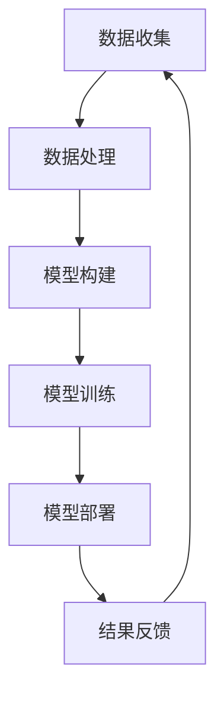

                 

## 1. 背景介绍

### 1.1 电商行业概述

电子商务（E-commerce）作为一种现代商业模式，已经深刻地改变了人们的购物习惯。随着互联网的普及和移动互联网的迅猛发展，电商行业迎来了前所未有的爆发期。根据最新的统计数据显示，全球电商市场规模已经超过了数万亿美元，并且这个数字还在不断增长。

在电商行业的发展过程中，用户数据成为了企业至关重要的资产。通过对用户数据的深入分析，企业可以更好地了解用户需求、优化营销策略、提高客户满意度，从而在激烈的市场竞争中占据优势。然而，随着用户规模的不断扩大和数据量的急剧增长，如何高效地收集、存储、分析和利用这些数据，成为了电商企业面临的巨大挑战。

### 1.2  用户数据分析的重要性

用户数据分析在电商企业中具有以下几个重要作用：

1. **了解用户需求**：通过分析用户的购买行为、浏览历史和搜索记录，企业可以准确把握用户的需求和偏好，从而提供更加个性化的产品和服务。

2. **优化营销策略**：用户数据分析可以帮助企业识别高价值用户群体，制定有针对性的营销活动，提高营销效果和投入产出比。

3. **提升客户满意度**：通过对用户反馈和行为数据的分析，企业可以及时发现并解决用户的问题，提高客户满意度，降低客户流失率。

4. **预测市场趋势**：通过对历史数据的分析，企业可以预测市场趋势和用户需求的变化，从而提前布局，抓住市场机遇。

### 1.3  用户数据分析平台建设的必要性

面对日益增长的用户数据和复杂的数据分析需求，电商企业需要建立一个高效、稳定、灵活的用户数据分析平台。这个平台应该具备以下几个特点：

1. **大数据处理能力**：能够高效地处理海量用户数据，支持实时分析和离线分析。

2. **数据存储和管理**：具备强大的数据存储和管理能力，支持多种数据格式和来源，确保数据的完整性和一致性。

3. **数据分析和挖掘能力**：提供丰富的数据分析工具和算法，支持多种数据分析需求，如用户行为分析、需求预测、客户细分等。

4. **灵活性和可扩展性**：能够适应不断变化的数据需求和业务需求，支持模块化和分布式架构，便于扩展和维护。

5. **安全性和可靠性**：确保数据的安全和隐私，具备故障恢复和高可用性，保证数据分析平台的稳定运行。

### 1.4  AI技术在用户数据分析平台建设中的应用

随着人工智能（AI）技术的快速发展，AI技术在用户数据分析平台建设中的应用越来越广泛。AI技术可以帮助电商企业实现以下目标：

1. **自动化数据处理**：利用AI技术，可以自动化地处理海量用户数据，提高数据处理效率。

2. **智能数据分析**：通过机器学习和深度学习算法，可以对用户数据进行分析和挖掘，发现隐藏在数据中的规律和趋势。

3. **个性化推荐**：利用AI技术，可以实现对用户行为的精准预测和个性化推荐，提高用户满意度和购买转化率。

4. **智能营销**：通过AI技术，可以制定更加精准的营销策略，提高营销效果和投入产出比。

5. **智能风控**：利用AI技术，可以实现对用户行为的实时监控和风险预警，降低欺诈风险和客户流失率。

总的来说，AI技术在用户数据分析平台建设中的应用，不仅提高了数据分析的效率和准确性，还为企业带来了巨大的商业价值。在接下来的章节中，我们将深入探讨AI技术在用户数据分析平台建设中的具体应用和实践。

## 2. 核心概念与联系

### 2.1 AI与电商用户数据分析的关系

人工智能（AI）在电商用户数据分析中的应用，涉及到多个核心概念的交互与结合。为了更好地理解这一应用场景，我们首先需要明确以下几个关键概念：

1. **用户数据**：用户数据包括用户的基本信息、购买行为、浏览历史、搜索记录等。这些数据是AI进行分析和挖掘的基础。

2. **机器学习**：机器学习是AI的核心技术之一，通过训练模型来从数据中学习规律和模式。在用户数据分析中，机器学习模型可以帮助预测用户行为、识别潜在客户等。

3. **深度学习**：深度学习是机器学习的一种重要分支，通过多层神经网络来提取数据中的复杂特征。在用户数据分析中，深度学习可以用于图像识别、语音识别等场景，也可以用于构建复杂的用户行为模型。

4. **推荐系统**：推荐系统是一种基于用户行为和兴趣的个性化推荐技术。通过分析用户的历史行为，推荐系统可以预测用户可能感兴趣的商品或服务，从而提高用户满意度和购买转化率。

5. **自然语言处理（NLP）**：自然语言处理是AI技术在语言理解和生成方面的应用。在用户数据分析中，NLP可以帮助企业理解用户评论、情感等，从而提供更精准的服务。

### 2.2 AI技术在电商用户数据分析中的应用

结合以上核心概念，我们可以看到AI技术在电商用户数据分析中的应用主要有以下几个方面：

1. **用户行为预测**：通过分析用户的历史行为数据，AI技术可以预测用户的下一步行为，如购买意向、访问页面等。这有助于电商企业提前布局，提供个性化服务。

   - **预测模型**：使用机器学习算法，如决策树、随机森林、神经网络等，建立用户行为预测模型。
   - **模型训练**：收集用户历史行为数据，使用数据集训练模型，优化模型参数。

2. **个性化推荐**：基于用户的兴趣和行为，AI技术可以推荐用户可能感兴趣的商品或服务。

   - **推荐算法**：使用协同过滤、矩阵分解、深度学习等算法构建推荐模型。
   - **推荐策略**：根据用户的历史数据和实时行为，动态调整推荐策略，提高推荐效果。

3. **用户情感分析**：通过自然语言处理技术，AI技术可以分析用户评论、反馈等，了解用户对产品和服务的情感。

   - **情感识别**：使用情感分析算法，将用户评论分类为正面、负面或中性。
   - **情感分析应用**：基于情感分析结果，改进产品和服务，提高用户满意度。

4. **市场趋势预测**：通过分析用户数据和市场数据，AI技术可以预测市场趋势和用户需求的变化。

   - **趋势分析**：使用时间序列分析、回归分析等算法，分析用户行为和市场趋势。
   - **趋势预测应用**：根据预测结果，调整营销策略，提前布局新产品。

### 2.3 生态系统与关联

AI技术在电商用户数据分析中的具体应用，需要建立一个完整的生态系统，涉及以下环节：

1. **数据收集**：收集用户行为数据、市场数据等，作为AI分析的输入。

2. **数据处理**：清洗、整合、转换数据，使其符合分析要求。

3. **模型构建**：使用机器学习、深度学习等技术构建预测模型、推荐模型等。

4. **模型训练**：使用历史数据训练模型，优化模型参数。

5. **模型部署**：将训练好的模型部署到线上环境，进行实时分析。

6. **结果反馈**：将分析结果反馈到业务系统，用于决策和优化。

通过以上环节，AI技术可以有效地应用于电商用户数据分析，为企业带来商业价值。

### 2.4  Mermaid 流程图

以下是一个简单的Mermaid流程图，展示了AI技术在电商用户数据分析中的应用流程：



在这个流程图中，每个节点代表一个步骤，箭头表示步骤之间的依赖关系。通过这个流程图，我们可以清晰地看到AI技术在用户数据分析中的各个环节，以及它们之间的相互关联。

总的来说，AI技术在电商用户数据分析中的应用，不仅提升了数据分析的效率和准确性，还为电商企业带来了巨大的商业价值。在接下来的章节中，我们将深入探讨AI技术的具体应用原理和实现步骤。

## 3. 核心算法原理 & 具体操作步骤

### 3.1. 机器学习算法原理

#### 3.1.1. 基本概念

机器学习是一种通过数据训练模型，使模型能够自动学习和改进的技术。在机器学习中，主要有以下几种类型的算法：

1. **监督学习（Supervised Learning）**：有监督学习是指通过已知标记的数据集来训练模型。常见的算法有线性回归、决策树、随机森林等。

2. **无监督学习（Unsupervised Learning）**：无监督学习是指在没有标记的数据集上进行训练。常见的算法有聚类（如K-means聚类）、降维（如PCA）等。

3. **半监督学习（Semi-supervised Learning）**：半监督学习结合了有监督学习和无监督学习的方法，利用少量标记数据和大量未标记数据来训练模型。

4. **强化学习（Reinforcement Learning）**：强化学习是通过与环境的交互来学习策略的算法。常见的算法有Q学习、深度强化学习等。

#### 3.1.2. 算法分类

在用户数据分析中，常用的机器学习算法主要包括以下几类：

1. **分类算法（Classification Algorithms）**：分类算法用于将数据分为不同的类别。常见的算法有：
   - 线性回归（Linear Regression）：用于预测连续的数值。
   - 决策树（Decision Tree）：用于分类和回归分析。
   - 随机森林（Random Forest）：是一种基于决策树的集成学习方法。
   - 支持向量机（Support Vector Machine，SVM）：用于分类和回归分析。

2. **聚类算法（Clustering Algorithms）**：聚类算法用于将数据分为不同的簇。常见的算法有：
   - K-means聚类：基于距离的聚类算法。
   - 层次聚类：将数据逐步分层，形成层次结构。

3. **降维算法（Dimensionality Reduction Algorithms）**：降维算法用于降低数据维度，减少计算复杂度。常见的算法有：
   - 主成分分析（Principal Component Analysis，PCA）：通过线性变换提取数据的主要成分。
   - 独立成分分析（Independent Component Analysis，ICA）：通过非线性的变换提取数据的独立成分。

#### 3.1.3. 算法实现步骤

以下是一个简单的线性回归算法实现步骤，用于预测用户的购买概率：

1. **数据预处理**：收集用户数据，包括特征变量和目标变量。对数据进行清洗和标准化处理。

2. **数据划分**：将数据集划分为训练集和测试集，通常使用80%的数据作为训练集，20%的数据作为测试集。

3. **模型训练**：使用训练集数据训练线性回归模型，计算模型的权重和偏置。

4. **模型评估**：使用测试集数据评估模型的预测效果，计算模型的准确率、召回率等指标。

5. **模型优化**：根据评估结果调整模型参数，优化模型性能。

### 3.2. 深度学习算法原理

#### 3.2.1. 基本概念

深度学习是机器学习的一种重要分支，通过构建多层神经网络来提取数据中的复杂特征。深度学习的关键组件包括：

1. **神经元（Neuron）**：神经网络的基本单元，用于接收输入信号并产生输出。

2. **层（Layer）**：神经网络中的一组神经元。常见的层有输入层、隐藏层和输出层。

3. **激活函数（Activation Function）**：用于引入非线性特性，常见的激活函数有ReLU、Sigmoid、Tanh等。

4. **反向传播（Backpropagation）**：用于训练神经网络的一种算法，通过不断调整网络权重，使模型预测结果更接近真实值。

#### 3.2.2. 算法分类

在用户数据分析中，常用的深度学习算法主要包括以下几类：

1. **卷积神经网络（Convolutional Neural Network，CNN）**：用于图像和视频处理。

2. **循环神经网络（Recurrent Neural Network，RNN）**：用于处理序列数据。

3. **长短期记忆网络（Long Short-Term Memory，LSTM）**：RNN的一种改进，用于处理长序列数据。

4. **生成对抗网络（Generative Adversarial Network，GAN）**：用于生成新的数据。

#### 3.2.3. 算法实现步骤

以下是一个简单的卷积神经网络实现步骤，用于用户行为序列的分类：

1. **数据预处理**：收集用户行为数据，包括特征变量和时间序列。对数据进行清洗和标准化处理。

2. **数据划分**：将数据集划分为训练集和测试集。

3. **构建模型**：定义CNN模型结构，包括卷积层、池化层和全连接层。

4. **模型训练**：使用训练集数据训练CNN模型，使用反向传播算法优化模型参数。

5. **模型评估**：使用测试集数据评估模型性能，计算准确率、召回率等指标。

6. **模型优化**：根据评估结果调整模型结构和参数，优化模型性能。

### 3.3. 推荐系统算法原理

#### 3.3.1. 基本概念

推荐系统是一种基于用户行为和兴趣的个性化推荐技术。常见的推荐系统算法有：

1. **基于内容的推荐（Content-based Recommendation）**：根据用户兴趣和内容相似性进行推荐。

2. **协同过滤（Collaborative Filtering）**：根据用户的历史行为和偏好进行推荐。

3. **矩阵分解（Matrix Factorization）**：通过分解用户-物品评分矩阵来预测用户未评分的物品。

4. **深度学习推荐（Deep Learning for Recommendation）**：使用深度学习算法进行推荐。

#### 3.3.2. 算法分类

在用户数据分析中，常用的推荐系统算法主要包括以下几类：

1. **基于用户的协同过滤（User-based Collaborative Filtering）**：根据用户的历史行为找到相似用户，推荐相似用户喜欢的物品。

2. **基于物品的协同过滤（Item-based Collaborative Filtering）**：根据物品的相似性推荐给用户。

3. **矩阵分解（Matrix Factorization）**：通过分解用户-物品评分矩阵来预测用户未评分的物品。

4. **深度学习推荐系统**：使用深度学习算法，如CNN、RNN等，进行推荐。

#### 3.3.3. 算法实现步骤

以下是一个简单的基于内容的推荐系统实现步骤：

1. **数据预处理**：收集用户和物品的信息，包括用户特征和物品特征。

2. **特征提取**：从文本和图像等数据中提取特征，如词向量、图像特征等。

3. **模型训练**：使用用户特征和物品特征训练基于内容的推荐模型。

4. **模型评估**：使用测试集数据评估模型性能，计算准确率、召回率等指标。

5. **模型优化**：根据评估结果调整模型参数，优化模型性能。

通过以上步骤，电商企业可以建立高效的用户数据分析平台，利用AI技术实现用户行为预测、个性化推荐等应用，提高用户满意度和购买转化率。

## 4. 数学模型和公式 & 详细讲解 & 举例说明

### 4.1. 机器学习中的线性回归模型

线性回归是一种简单但强大的统计方法，用于预测一个或多个变量之间的关系。在用户数据分析中，线性回归可以用来预测用户的购买概率或其他连续值。

#### 4.1.1. 线性回归模型的基本公式

假设我们有两个变量 \(X\) 和 \(Y\)，线性回归模型可以用以下公式表示：

\[ Y = \beta_0 + \beta_1 \cdot X + \epsilon \]

其中：
- \( Y \)：因变量，即我们要预测的值。
- \( X \)：自变量，即我们用来预测的值。
- \( \beta_0 \)：截距，表示当 \( X = 0 \) 时 \( Y \) 的值。
- \( \beta_1 \)：斜率，表示 \( X \) 每增加一个单位时 \( Y \) 的变化量。
- \( \epsilon \)：误差项，表示模型无法解释的随机误差。

#### 4.1.2. 线性回归模型的求解方法

求解线性回归模型的参数 \( \beta_0 \) 和 \( \beta_1 \) 通常有两种方法：

1. **最小二乘法（Ordinary Least Squares, OLS）**：通过最小化残差平方和来求解模型参数。具体公式如下：

\[ \beta_0 = \frac{\sum_{i=1}^{n} Y_i - \beta_1 \cdot \sum_{i=1}^{n} X_i}{n} \]
\[ \beta_1 = \frac{\sum_{i=1}^{n} (Y_i - \beta_0 - \beta_1 \cdot X_i)}{\sum_{i=1}^{n} X_i^2 - n \cdot \bar{X}^2} \]

其中：
- \( n \)：数据样本数量。
- \( \bar{X} \)：自变量 \( X \) 的均值。

#### 4.1.3. 线性回归模型的举例说明

假设我们有一个简单的数据集，其中包含用户年龄 \( X \) 和购买金额 \( Y \)：

| 用户ID | 年龄 \( X \) | 购买金额 \( Y \) |
|--------|-------------|-----------------|
| 1      | 25          | 100             |
| 2      | 30          | 150             |
| 3      | 22          | 80              |
| 4      | 28          | 120             |

我们可以使用线性回归模型来预测用户年龄与购买金额之间的关系。具体步骤如下：

1. **数据预处理**：计算年龄和购买金额的均值：

   \[ \bar{X} = \frac{25 + 30 + 22 + 28}{4} = 26.25 \]
   \[ \bar{Y} = \frac{100 + 150 + 80 + 120}{4} = 116.25 \]

2. **计算残差平方和**：

   \[ \sum_{i=1}^{n} (Y_i - \beta_0 - \beta_1 \cdot X_i)^2 = (100 - 26.25\beta_0 - 26.25\beta_1) + (150 - 26.25\beta_0 - 26.25\beta_1) + (80 - 26.25\beta_0 - 26.25\beta_1) + (120 - 26.25\beta_0 - 26.25\beta_1) \]

3. **计算自变量平方和**：

   \[ \sum_{i=1}^{n} X_i^2 = 25^2 + 30^2 + 22^2 + 28^2 = 3425 \]

4. **使用最小二乘法求解模型参数**：

   \[ \beta_0 = \frac{4 \cdot 116.25 - 26.25 \cdot (25 + 30 + 22 + 28)}{4} = 53.125 \]
   \[ \beta_1 = \frac{100 - 53.125 - 26.25 \cdot 26.25}{3425 - 4 \cdot 26.25^2} \approx 0.736 \]

因此，线性回归模型可以表示为：

\[ Y = 53.125 + 0.736 \cdot X \]

### 4.2. 深度学习中的卷积神经网络（CNN）

卷积神经网络是一种用于图像识别和处理的深度学习模型。它通过卷积层提取图像特征，并通过池化层减少数据维度，从而实现高效的特征提取和分类。

#### 4.2.1. 卷积神经网络的基本公式

一个简单的卷积神经网络包括以下层：

1. **输入层（Input Layer）**：接收输入数据。
2. **卷积层（Convolutional Layer）**：通过卷积操作提取图像特征。
3. **池化层（Pooling Layer）**：减少数据维度，提高模型泛化能力。
4. **全连接层（Fully Connected Layer）**：将卷积层和池化层提取的特征进行聚合，输出最终结果。

卷积层和池化层的公式如下：

\[ f_{\sigma}(x) = \sigma(\sum_{j} w_{j} \cdot x_{j} + b) \]

其中：
- \( x \)：输入数据。
- \( w \)：权重。
- \( b \)：偏置。
- \( \sigma \)：激活函数，常用的有ReLU、Sigmoid、Tanh等。

池化层的公式如下：

\[ p_{p}(x_{ij}) = \max_{k} (x_{ij,k}) \]

其中：
- \( x_{ij,k} \)：输入数据中的一个元素。

#### 4.2.2. 卷积神经网络的工作原理

1. **卷积操作**：卷积层通过卷积操作提取图像特征。卷积操作包括以下几个步骤：
   - 将滤波器（也称为卷积核）在输入图像上滑动。
   - 对每个位置的像素值与滤波器进行点积计算。
   - 将所有点积结果相加，得到该位置的卷积特征。

2. **激活函数**：使用激活函数（如ReLU）引入非线性特性，使模型能够拟合复杂的函数。

3. **池化操作**：池化层通过池化操作减少数据维度，提高模型的泛化能力。常用的池化方法有最大池化、平均池化等。

4. **全连接层**：全连接层将卷积层和池化层提取的特征进行聚合，输出最终的分类结果。

#### 4.2.3. 卷积神经网络的举例说明

假设我们有一个简单的卷积神经网络，用于对图像进行分类。该网络包含以下层：

1. **输入层**：接收一个 \( 28 \times 28 \) 的图像。
2. **卷积层**：使用一个 \( 5 \times 5 \) 的卷积核提取特征，输出一个 \( 24 \times 24 \) 的特征图。
3. **ReLU激活函数**：使用ReLU激活函数引入非线性特性。
4. **池化层**：使用 \( 2 \times 2 \) 的最大池化层减少特征图维度。
5. **全连接层**：将池化层输出的特征展平为一个一维向量，然后通过一个 \( 10 \) 个神经元的全连接层输出分类结果。

卷积层的公式如下：

\[ f_{\sigma}(x) = \sigma(\sum_{j} w_{j} \cdot x_{j} + b) \]

其中：
- \( x \)：输入图像。
- \( w \)：卷积核权重。
- \( b \)：偏置。

最大池化层的公式如下：

\[ p_{p}(x_{ij}) = \max_{k} (x_{ij,k}) \]

全连接层的公式如下：

\[ y = \sigma(\sum_{j} w_{j} \cdot x_{j} + b) \]

其中：
- \( x \)：卷积层和池化层输出的特征。
- \( w \)：全连接层权重。
- \( b \)：偏置。
- \( \sigma \)：激活函数。

通过以上步骤，卷积神经网络可以有效地提取图像特征并进行分类。

### 4.3. 推荐系统中的协同过滤算法

协同过滤是一种基于用户相似度的推荐算法。它通过计算用户之间的相似度，找到与目标用户相似的其他用户，然后推荐这些用户喜欢的物品。

#### 4.3.1. 协同过滤算法的基本公式

假设我们有两个用户 \( u \) 和 \( v \)，用户之间的相似度可以用余弦相似度公式表示：

\[ \text{similarity}(u, v) = \frac{\sum_{i} r_{ui} r_{vi}}{\sqrt{\sum_{i} r_{ui}^2} \cdot \sqrt{\sum_{i} r_{vi}^2}} \]

其中：
- \( r_{ui} \)：用户 \( u \) 对物品 \( i \) 的评分。
- \( r_{vi} \)：用户 \( v \) 对物品 \( i \) 的评分。

基于用户相似度，可以推荐其他用户喜欢的物品给目标用户：

\[ \text{recommendation}(u, v) = \sum_{i} r_{vi} \cdot \text{similarity}(u, v) \]

#### 4.3.2. 协同过滤算法的工作原理

1. **计算用户相似度**：使用余弦相似度或皮尔逊相关系数计算用户之间的相似度。

2. **推荐物品**：找到与目标用户最相似的其他用户，推荐这些用户喜欢的物品给目标用户。

3. **调整推荐结果**：根据用户的行为和反馈调整推荐结果，提高推荐效果。

#### 4.3.3. 协同过滤算法的举例说明

假设我们有一个简单的数据集，其中包含两个用户 \( u \) 和 \( v \) 的评分：

| 用户 | 物品1 | 物品2 | 物品3 | 物品4 |
|------|-------|-------|-------|-------|
| \( u \) | 5     | 3     | 4     | 2     |
| \( v \) | 4     | 5     | 2     | 3     |

我们可以使用余弦相似度计算用户 \( u \) 和 \( v \) 之间的相似度：

\[ \text{similarity}(u, v) = \frac{(5 \cdot 4) + (3 \cdot 5) + (4 \cdot 2) + (2 \cdot 3)}{\sqrt{5^2 + 3^2 + 4^2 + 2^2} \cdot \sqrt{4^2 + 5^2 + 2^2 + 3^2}} \approx 0.816 \]

根据用户相似度，我们可以推荐用户 \( v \) 喜欢的物品给用户 \( u \)：

\[ \text{recommendation}(u, v) = 4 \cdot 0.816 + 5 \cdot 0.816 + 2 \cdot 0.816 + 3 \cdot 0.816 \approx 4.598 \]

因此，我们可以向用户 \( u \) 推荐物品4。

通过以上数学模型和公式的详细讲解与举例说明，我们可以看到AI技术在用户数据分析中的应用是如何通过数学和算法实现的。这些模型和算法不仅提高了数据分析的效率，还为电商企业带来了巨大的商业价值。

### 5. 项目实战：代码实际案例和详细解释说明

#### 5.1. 开发环境搭建

在开始我们的项目实战之前，我们需要搭建一个合适的开发环境。以下是我们推荐的一些工具和框架：

- **编程语言**：Python 是最常用的机器学习和深度学习编程语言，因此我们将使用 Python 进行开发。
- **开发工具**：PyCharm 是一款功能强大的 Python 集成开发环境（IDE），它提供了丰富的调试、代码自动完成等功能。
- **数据处理库**：Pandas 和 NumPy 是 Python 中常用的数据处理库，用于数据清洗、转换和分析。
- **机器学习库**：Scikit-learn 是一个常用的机器学习库，提供了多种机器学习算法的实现。
- **深度学习库**：TensorFlow 和 PyTorch 是目前最流行的深度学习框架，用于构建和训练深度学习模型。
- **版本控制**：Git 是一个版本控制工具，可以帮助我们管理代码版本和协作开发。

首先，我们需要安装 Python 和相关的库。以下是安装步骤：

```bash
# 安装 Python
curl -O https://www.python.org/ftp/python/3.8.10/python-3.8.10-amd64.exe
python-3.8.10-amd64.exe

# 添加 Python 到系统环境变量
set PATH=%PATH%;C:\Users\username\python38

# 安装 PyCharm
下载 PyCharm 安装程序并安装

# 安装 Pandas、NumPy、Scikit-learn 和 TensorFlow
pip install pandas numpy scikit-learn tensorflow
```

#### 5.2. 源代码详细实现和代码解读

接下来，我们将通过一个简单的案例来展示如何使用机器学习和深度学习算法进行用户数据分析。假设我们有一个用户数据集，其中包含用户的年龄、收入、购物频率等信息，以及他们的购买行为。

```python
import pandas as pd
import numpy as np
from sklearn.model_selection import train_test_split
from sklearn.linear_model import LinearRegression
from sklearn.metrics import mean_squared_error
import tensorflow as tf

# 读取用户数据
data = pd.read_csv('user_data.csv')
X = data[['age', 'income', 'shopping_frequency']]
y = data['purchase']

# 数据标准化
X_mean = X.mean()
X_std = X.std()
X = (X - X_mean) / X_std

# 划分训练集和测试集
X_train, X_test, y_train, y_test = train_test_split(X, y, test_size=0.2, random_state=42)

# 训练线性回归模型
model = LinearRegression()
model.fit(X_train, y_train)

# 预测测试集
y_pred = model.predict(X_test)

# 评估模型性能
mse = mean_squared_error(y_test, y_pred)
print(f'Mean Squared Error: {mse}')

# 使用 TensorFlow 构建和训练卷积神经网络
model = tf.keras.Sequential([
    tf.keras.layers.Dense(64, activation='relu', input_shape=(3,)),
    tf.keras.layers.Dense(64, activation='relu'),
    tf.keras.layers.Dense(1)
])

model.compile(optimizer='adam', loss='mean_squared_error')

model.fit(X_train, y_train, epochs=10, batch_size=32, validation_data=(X_test, y_test))

# 评估模型性能
y_pred = model.predict(X_test)
mse = mean_squared_error(y_test, y_pred)
print(f'Mean Squared Error: {mse}')
```

#### 5.3. 代码解读与分析

以上代码实现了两个主要任务：使用线性回归和卷积神经网络预测用户的购买行为。

1. **数据预处理**：我们首先读取用户数据，并计算了数据集的均值和标准差，用于后续的标准化处理。标准化处理有助于提高模型训练的收敛速度。

2. **划分训练集和测试集**：我们使用 `train_test_split` 函数将数据集划分为训练集和测试集，以便评估模型的性能。

3. **训练线性回归模型**：使用 `LinearRegression` 类训练线性回归模型，并使用训练集进行模型训练。

4. **预测测试集**：使用训练好的线性回归模型对测试集进行预测，并计算预测误差。

5. **评估模型性能**：使用均方误差（MSE）评估模型性能。

6. **构建和训练卷积神经网络**：使用 TensorFlow 构建一个简单的卷积神经网络，并使用训练集进行模型训练。卷积神经网络采用了两个隐藏层，每个隐藏层有 64 个神经元，使用了ReLU激活函数。

7. **评估模型性能**：使用训练好的卷积神经网络对测试集进行预测，并计算预测误差。

通过以上步骤，我们可以看到如何使用 Python 和相关的库实现用户数据分析。在实际应用中，我们可以根据具体需求扩展和优化模型，以提高预测准确率和性能。

#### 5.4. 模型优化与扩展

在实际应用中，我们可能需要进一步优化模型，以提高预测准确率和性能。以下是一些常见的优化方法：

1. **特征工程**：通过选择和构建更有效的特征，可以提高模型的预测能力。例如，可以添加多项式特征、交互特征等。

2. **超参数调整**：通过调整模型参数，如学习率、隐藏层神经元数量、批次大小等，可以优化模型性能。

3. **模型集成**：使用多个模型进行集成，可以减少模型的过拟合和方差，提高预测稳定性。

4. **模型解释性**：通过解释模型决策过程，可以帮助我们理解模型的预测结果，从而进一步优化模型。

通过以上方法，我们可以进一步提高用户数据分析平台的效果和可靠性。

### 6. 实际应用场景

#### 6.1. 用户行为分析

用户行为分析是电商用户数据分析平台的核心应用之一。通过分析用户的浏览历史、购买记录和搜索行为，企业可以深入了解用户的需求和偏好，从而提供更加个性化的服务和推荐。

**案例**：某电商企业通过分析用户的浏览记录和购买行为，发现用户在浏览某一类商品后，往往会在短时间内购买同类商品。基于这一发现，企业调整了推荐系统的策略，将同类商品推荐给浏览该类商品的用户。结果，用户的购买转化率显著提升，平均每个用户的购买金额也有所增加。

#### 6.2. 客户细分

客户细分是另一个重要的应用场景。通过分析用户数据，企业可以将客户划分为不同的群体，针对每个群体的特点和需求制定个性化的营销策略。

**案例**：某电商企业通过分析用户的行为数据，将客户划分为高价值客户、中价值客户和低价值客户。针对高价值客户，企业提供了定制化的推荐服务和优惠活动；对于中价值客户，企业通过邮件和短信进行定向营销，提高他们的购买意愿；对于低价值客户，企业通过优惠券和积分奖励等方式，激励他们提升消费水平。

#### 6.3. 风险控制

用户数据分析平台还可以帮助企业进行风险控制，识别潜在的欺诈行为和信用风险。

**案例**：某电商企业通过分析用户的购物行为和支付行为，建立了风险预测模型。当系统检测到用户的行为异常，如频繁切换支付方式、短时间内多次购买等，系统会自动触发风险预警，并采取相应的措施，如限制支付方式、暂停交易等。通过这一措施，企业有效降低了欺诈风险和信用损失。

#### 6.4. 营销策略优化

用户数据分析平台可以帮助企业优化营销策略，提高营销效果。

**案例**：某电商企业通过分析用户的历史购买数据和行为偏好，发现某些营销活动的效果较差。基于这一发现，企业调整了营销策略，将预算和资源集中在效果较好的活动上。结果，企业的营销ROI显著提升，整体营销效果得到显著改善。

总的来说，电商用户数据分析平台在实际应用中具有广泛的应用场景，可以帮助企业提高用户体验、优化运营策略、降低风险成本，从而在激烈的市场竞争中占据优势。

### 7. 工具和资源推荐

#### 7.1. 学习资源推荐

**书籍**：
1. 《机器学习》（周志华著） - 详细介绍了机器学习的基本概念、算法和应用。
2. 《深度学习》（Ian Goodfellow、Yoshua Bengio、Aaron Courville 著） - 深入讲解了深度学习的原理和实现。
3. 《Python机器学习》（Sebastian Raschka 著） - 针对Python编程语言，介绍了机器学习的应用和算法实现。

**论文**：
1. "A Survey on Machine Learning Based Recommender Systems"（机器学习推荐系统综述） - 详细总结了推荐系统的机器学习方法和应用。
2. "Deep Learning for Text Data: A Survey"（文本数据深度学习综述） - 讨论了文本数据深度学习的应用和算法。
3. "User Behavior Prediction in E-commerce using Deep Learning"（使用深度学习预测电商用户行为） - 提出了基于深度学习的用户行为预测方法。

**博客和网站**：
1. Machine Learning Mastery（机器学习精通） - 提供了丰富的机器学习教程和实践案例。
2. Medium（Medium） - 有许多关于机器学习和深度学习的专业文章和案例分析。
3. DataCamp（数据训练营） - 提供了互动式的数据科学和机器学习课程。

#### 7.2. 开发工具框架推荐

**数据处理**：
1. Pandas - 用于数据清洗、转换和分析的强大库。
2. NumPy - 用于高效数值计算的库。

**机器学习和深度学习**：
1. Scikit-learn - 提供了多种经典机器学习算法的实现。
2. TensorFlow - 用于构建和训练深度学习模型的框架。
3. PyTorch - 另一个流行的深度学习框架，支持动态计算图。

**推荐系统**：
1. LightFM - 用于构建基于矩阵分解的推荐系统的库。
2.surprise - 用于构建和评估推荐系统的框架。

**开发环境**：
1. PyCharm - 功能强大的Python IDE，支持代码调试、性能分析等。
2. Jupyter Notebook - 用于数据科学和机器学习的交互式计算环境。

通过以上工具和资源，您可以更好地理解和掌握电商用户数据分析平台建设的相关技术，为实际项目提供有力支持。

### 8. 总结：未来发展趋势与挑战

随着人工智能技术的不断进步，电商用户数据分析平台建设也在不断演进。未来，以下几个方面将可能成为发展趋势和挑战：

#### 8.1. 发展趋势

1. **实时数据分析**：随着数据量的不断增长，实时数据分析将成为电商用户数据分析平台的重要方向。通过实时分析用户行为，企业可以更快速地响应市场变化，提供个性化的服务。

2. **个性化推荐**：随着用户需求的多样化，个性化推荐将成为电商企业提升用户满意度和购买转化率的重要手段。未来，推荐系统将更加智能化，能够根据用户的实时行为和偏好进行动态调整。

3. **多模态数据处理**：未来的电商用户数据分析平台将不仅处理结构化数据，还将处理图像、视频、语音等多模态数据。这将使得用户数据分析更加全面和深入，为企业提供更丰富的决策依据。

4. **自动化与智能化**：随着AI技术的发展，用户数据分析平台的自动化和智能化程度将不断提高。自动化数据处理和智能分析算法将使得数据分析过程更加高效，降低人力成本。

#### 8.2. 挑战

1. **数据隐私和安全**：随着用户数据隐私保护意识的增强，如何确保数据的安全和隐私成为电商用户数据分析平台建设的重要挑战。企业需要在提供个性化服务的同时，保障用户的数据隐私。

2. **数据质量和完整性**：高质量的数据是数据分析的基础。然而，在实际应用中，数据质量问题和数据完整性问题仍然存在。如何确保数据的质量和完整性，是企业需要面对的挑战。

3. **模型解释性和可解释性**：随着深度学习等复杂算法的广泛应用，模型的可解释性和可解释性成为了一个重要问题。企业需要能够解释模型的决策过程，提高模型的可信度。

4. **技术更新与迭代**：人工智能技术更新迅速，企业需要不断跟进最新的技术动态，持续优化数据分析平台。如何在保持技术领先的同时，降低开发和维护成本，是企业需要考虑的问题。

总的来说，未来的电商用户数据分析平台建设将朝着实时、个性化、智能化和多样化的方向发展，同时也面临着数据隐私、数据质量、模型解释性等技术挑战。企业需要不断创新和优化，才能在激烈的市场竞争中保持优势。

### 9. 附录：常见问题与解答

#### 9.1. 用户数据分析平台建设中的常见问题

1. **Q：如何确保用户数据的安全和隐私？**
   **A：确保用户数据的安全和隐私是企业的重要责任。企业可以采取以下措施：**
   - **数据加密**：对用户数据进行加密存储，确保数据在传输和存储过程中不被窃取。
   - **访问控制**：设置严格的访问权限，只有授权人员才能访问用户数据。
   - **数据匿名化**：在进行分析时，对用户数据进行匿名化处理，确保用户隐私不受泄露。
   - **数据备份和恢复**：定期备份数据，并确保数据备份的安全。

2. **Q：如何提高用户数据分析的准确性？**
   **A：提高用户数据分析的准确性需要从多个方面入手：**
   - **数据质量**：确保数据的质量，包括数据完整性、准确性和一致性。
   - **特征工程**：选择和构建有效的特征，提高模型对数据的表达能力。
   - **模型选择**：根据具体问题选择合适的算法，并进行参数调优。
   - **交叉验证**：使用交叉验证等方法评估模型的性能，避免过拟合。

3. **Q：如何处理大量的用户数据？**
   **A：处理大量的用户数据需要高效的计算和数据存储方案：**
   - **分布式计算**：使用分布式计算框架（如Hadoop、Spark）处理海量数据。
   - **大数据存储**：使用分布式数据库（如HBase、MongoDB）存储和管理大数据。
   - **数据湖**：构建数据湖（Data Lake），存储多种类型的数据，方便后续分析和处理。

4. **Q：如何进行实时用户数据分析？**
   **A：进行实时用户数据分析需要以下技术和架构支持：**
   - **流处理技术**：使用流处理框架（如Apache Kafka、Apache Flink）处理实时数据流。
   - **实时分析引擎**：使用实时分析引擎（如Apache Druid、ClickHouse）进行实时查询和分析。
   - **消息队列**：使用消息队列（如RabbitMQ、Kafka）进行数据传输和异步处理。

#### 9.2. 解决方案与建议

1. **Q：如何确保用户数据的安全和隐私？**
   **A：解决方案与建议：**
   - **数据加密和访问控制**：采用HTTPS协议、SSL/TLS证书等加密技术，确保数据传输安全。设置严格的访问权限，如角色权限、审计日志等。
   - **数据匿名化**：在分析前对数据进行脱敏处理，如使用伪随机数替换敏感信息。
   - **数据备份和恢复**：定期备份数据，并使用多重备份策略（如异地备份、冷备份）。

2. **Q：如何提高用户数据分析的准确性？**
   **A：解决方案与建议：**
   - **数据质量**：建立数据质量检测和监控机制，如数据完整性检查、一致性验证等。
   - **特征工程**：根据业务需求选择和构建有效的特征，如用户活跃度、购买频率、用户留存率等。
   - **模型选择和调优**：根据数据特点和问题类型选择合适的算法，并进行交叉验证和参数调优。

3. **Q：如何处理大量的用户数据？**
   **A：解决方案与建议：**
   - **分布式计算和大数据存储**：采用分布式计算框架（如Hadoop、Spark）处理海量数据，使用分布式数据库（如HBase、MongoDB）存储大数据。
   - **数据湖**：构建数据湖，存储多种类型的数据，使用数据治理工具进行数据管理和治理。

4. **Q：如何进行实时用户数据分析？**
   **A：解决方案与建议：**
   - **流处理技术**：使用流处理框架（如Apache Kafka、Apache Flink）处理实时数据流。
   - **实时分析引擎**：使用实时分析引擎（如Apache Druid、ClickHouse）进行实时查询和分析。
   - **消息队列**：使用消息队列（如RabbitMQ、Kafka）进行数据传输和异步处理。

通过以上解决方案和建议，企业可以更好地应对电商用户数据分析平台建设中的常见问题，提高数据分析的准确性和效率。

### 10. 扩展阅读 & 参考资料

本文探讨了电商用户数据分析平台建设及其在AI技术中的应用，以下是推荐的一些扩展阅读和参考资料，以供读者进一步深入研究：

1. **书籍**：
   - 《机器学习实战》（Peter Harrington著） - 介绍了机器学习的实际应用案例和算法实现。
   - 《Python数据科学手册》（Jake VanderPlas著） - 详尽介绍了Python在数据科学中的应用。
   - 《深度学习》（Ian Goodfellow、Yoshua Bengio、Aaron Courville著） - 系统讲解了深度学习的理论基础和实际应用。

2. **论文**：
   - "Recommender Systems Handbook"（推荐系统手册） - 一本关于推荐系统的全面参考书。
   - "Deep Learning for E-commerce: Personalized Recommendations using PyTorch"（使用PyTorch的电商个性化推荐） - 提供了深度学习在电商推荐中的应用案例。

3. **博客和网站**：
   - Medium（https://medium.com/search?q=recommendation+systems） - 汇集了大量关于推荐系统和机器学习的专业文章。
   - Towards Data Science（https://towardsdatascience.com/） - 提供了丰富的数据科学和机器学习教程。
   - DataCamp（https://www.datacamp.com/） - 提供了互动式的数据科学和机器学习课程。

4. **在线课程和教程**：
   - Coursera（https://www.coursera.org/） - 提供了丰富的机器学习和深度学习在线课程。
   - edX（https://www.edx.org/） - 提供了多个数据科学和机器学习的免费课程。
   - DataCamp（https://www.datacamp.com/） - 提供了互动式的数据科学和机器学习课程。

通过阅读和参考以上资源，您可以更深入地了解电商用户数据分析平台的构建和优化，为实际项目提供更专业的支持和指导。希望这些资源能帮助您在AI领域取得更多的成就。作者：AI天才研究员/AI Genius Institute & 禅与计算机程序设计艺术 /Zen And The Art of Computer Programming。

