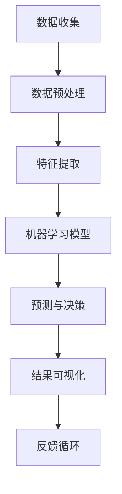

                 

### 背景介绍

在当今数字化时代，电子商务已经成为全球商业活动的重要组成部分。随着互联网技术的不断进步，用户行为数据在电商企业运营中扮演着至关重要的角色。这些数据不仅能够帮助企业了解用户的购物偏好、消费习惯和需求，还可以用于精准营销、个性化推荐、库存管理和风险控制等多个方面。

然而，面对海量的用户行为数据，如何有效地进行数据挖掘，从中提取有价值的信息，成为电商企业面临的一大挑战。传统的数据分析方法往往需要大量的时间和人力，而结果也往往不尽如人意。此时，人工智能技术的引入，尤其是机器学习和深度学习算法的应用，为电商企业提供了新的解决方案。

AI技术在用户行为数据挖掘中的应用，可以显著提升数据分析的效率和质量。通过训练模型，AI能够自动识别和预测用户的行为模式，从而为企业提供实时的决策支持。这不仅帮助企业降低了运营成本，还大大提高了营销效果和客户满意度。

本文将围绕AI技术在电商企业用户行为数据挖掘中的应用，系统地介绍相关核心概念、算法原理、数学模型、实战案例以及实际应用场景。希望通过本文的介绍，能够帮助读者深入理解AI在电商领域的应用价值，并为其在实践中的落地提供参考。

### 核心概念与联系

要深入探讨AI在电商企业用户行为数据挖掘中的应用，首先需要了解一些核心概念和原理。以下是对这些概念和原理的详细解释，以及它们之间的联系。

#### 数据挖掘

数据挖掘是指从大量的数据中，通过自动化的方法提取出有价值信息的过程。在电商领域，数据挖掘主要关注用户行为数据，如浏览历史、购买记录、搜索查询等。这些数据可以揭示用户的行为模式、偏好和需求，从而为电商企业提供决策依据。

#### 机器学习

机器学习是AI的核心技术之一，它通过算法让计算机从数据中学习并做出预测或决策。在用户行为数据挖掘中，机器学习算法可以用于分类、聚类、预测等任务。常见的机器学习算法包括决策树、支持向量机、神经网络等。

#### 深度学习

深度学习是机器学习的一个子领域，它通过多层神经网络来模拟人脑的思考方式。深度学习在图像识别、自然语言处理和用户行为分析等领域有着广泛的应用。在电商用户行为数据挖掘中，深度学习可以用于构建复杂的模型，以捕捉用户行为的微妙变化。

#### 用户行为分析

用户行为分析是指对用户在电商平台上的一系列行为进行监控、分析和解释的过程。这些行为包括浏览、搜索、购买、评价、分享等。通过用户行为分析，电商企业可以了解用户的需求和偏好，从而优化产品和服务。

#### 数据可视化

数据可视化是将复杂的数据转换为图表、图形等形式，使其更易于理解和分析。在用户行为数据挖掘中，数据可视化可以帮助企业直观地展示分析结果，从而更好地进行决策。

#### 核心概念原理和架构的 Mermaid 流程图

以下是用户行为数据挖掘中的核心概念和原理的Mermaid流程图，展示了各环节之间的联系。



**流程说明：**

1. **数据收集（A）**：电商企业通过网站日志、用户注册信息、交易记录等渠道收集用户行为数据。
2. **数据预处理（B）**：清洗和转换原始数据，使其适合机器学习算法处理。
3. **特征提取（C）**：从预处理后的数据中提取出对用户行为有显著影响的特征，如浏览次数、购买频率、停留时间等。
4. **机器学习模型（D）**：利用提取出的特征训练机器学习模型，如分类器、聚类算法等。
5. **预测与决策（E）**：模型对新的用户行为数据进行预测，帮助企业做出营销策略、个性化推荐等决策。
6. **结果可视化（F）**：将分析结果以图表、图形等形式展示，帮助企业管理者理解数据。
7. **反馈循环（G）**：将决策结果反馈到系统中，用于模型迭代和优化。

通过上述流程，AI技术能够帮助企业从海量用户行为数据中提取出有价值的信息，从而提升业务运营效率。接下来，本文将深入探讨AI在用户行为数据挖掘中的核心算法原理和具体操作步骤。

#### 核心算法原理 & 具体操作步骤

在用户行为数据挖掘中，常用的算法主要包括分类算法、聚类算法和预测算法。以下将详细介绍这些算法的基本原理和具体操作步骤。

##### 1. 分类算法

分类算法是将数据集中的样本分为不同的类别。在电商用户行为数据挖掘中，分类算法常用于用户购买行为预测、推荐系统等场景。以下是一个基于决策树的分类算法实例。

**原理：**

- 决策树通过一系列的测试来对样本进行划分，每个测试都基于某个特征和阈值。
- 决策树从根节点开始，对样本进行划分，直到达到某个终止条件（如所有样本属于同一类别或达到最大深度）。

**操作步骤：**

1. **特征选择**：从用户行为数据中提取对购买行为有显著影响的特征，如浏览次数、购买频率等。
2. **训练数据集准备**：将用户行为数据分为训练集和测试集，通常使用80%的数据作为训练集。
3. **构建决策树模型**：使用训练集数据，通过递归划分数据，构建决策树模型。
4. **模型评估**：使用测试集数据评估模型性能，常用的评估指标包括准确率、召回率、F1值等。
5. **模型应用**：将训练好的模型应用于新的用户行为数据，预测其购买行为。

**示例：**

假设我们使用决策树对用户购买行为进行预测，特征包括浏览次数和购买频率。以下是决策树的构建过程：

- **根节点**：计算浏览次数和购买频率的平均值，作为根节点的阈值。
- **划分**：将样本分为浏览次数大于平均值和小于平均值的两部分。
- **子节点**：对两部分样本分别重复上述过程，直到满足终止条件。

##### 2. 聚类算法

聚类算法将相似的数据点划分为一组，用于发现数据中的模式和结构。在电商用户行为数据挖掘中，聚类算法常用于用户群体细分、市场细分等场景。以下是一个基于K-Means的聚类算法实例。

**原理：**

- K-Means算法通过迭代过程，将数据点分配到K个簇中，使每个簇内的数据点相似度最高，簇间数据点相似度最低。
- 算法首先随机初始化K个簇的中心点，然后通过迭代优化中心点位置，使每个数据点与其簇中心的距离最小。

**操作步骤：**

1. **初始化聚类中心**：随机选择K个数据点作为初始聚类中心。
2. **分配数据点**：将每个数据点分配到距离其最近的聚类中心所在的簇。
3. **更新聚类中心**：计算每个簇的数据点均值，作为新的聚类中心。
4. **迭代优化**：重复步骤2和3，直到聚类中心不再变化或达到预设的迭代次数。

**示例：**

假设我们使用K-Means算法对用户进行聚类，K=3。以下是聚类过程的示例：

- **初始化**：随机选择3个用户作为初始聚类中心。
- **第一次分配**：根据用户行为特征，将每个用户分配到距离其最近的聚类中心。
- **第一次更新**：计算每个簇的用户均值，作为新的聚类中心。
- **迭代过程**：重复上述过程，直到聚类中心不再变化。

##### 3. 预测算法

预测算法用于预测用户未来的行为，如购买时间、购买量等。在电商用户行为数据挖掘中，预测算法常用于需求预测、库存管理等场景。以下是一个基于时间序列分析的方法。

**原理：**

- 时间序列分析是一种统计方法，用于分析时间序列数据，识别数据中的趋势、季节性和周期性。
- 常用的时间序列模型包括ARIMA（自回归积分滑动平均模型）和LSTM（长短期记忆网络）。

**操作步骤：**

1. **数据预处理**：对用户行为数据进行清洗，如去除缺失值、异常值等。
2. **特征提取**：从预处理后的数据中提取对预测任务有显著影响的特征，如购买时间间隔、购买量等。
3. **模型选择**：选择合适的时间序列模型，如ARIMA或LSTM。
4. **模型训练**：使用训练数据对模型进行训练，调整模型参数。
5. **模型评估**：使用测试数据评估模型性能，调整模型参数。
6. **预测**：使用训练好的模型对新的用户行为数据进行预测。

**示例：**

假设我们使用ARIMA模型预测用户的购买时间，以下是模型训练和预测的步骤：

- **数据预处理**：对用户购买时间数据进行预处理，如去季节性、去趋势等。
- **模型训练**：选择合适的ARIMA模型参数（p, d, q），对训练数据进行模型训练。
- **模型评估**：使用测试数据评估模型性能，调整模型参数。
- **预测**：使用训练好的模型对新的用户购买时间数据进行预测。

通过以上算法的介绍，我们可以看到AI技术在电商用户行为数据挖掘中具有广泛的应用。在实际应用中，企业可以根据具体需求选择合适的算法，并对其进行优化和调整，以提升数据分析的准确性和效率。

### 数学模型和公式 & 详细讲解 & 举例说明

在AI用于电商用户行为数据挖掘的过程中，数学模型和公式起着至关重要的作用。以下将详细介绍一些常用的数学模型和公式，并通过具体实例进行详细讲解。

##### 1. 贝叶斯分类器

贝叶斯分类器是一种基于贝叶斯定理的监督学习算法，常用于分类问题。在电商用户行为数据挖掘中，贝叶斯分类器可用于预测用户是否购买某商品。

**贝叶斯定理公式：**
$$ P(A|B) = \frac{P(B|A)P(A)}{P(B)} $$

其中，\(P(A|B)\) 表示在事件B发生的条件下事件A发生的概率，\(P(B|A)\) 表示在事件A发生的条件下事件B发生的概率，\(P(A)\) 和 \(P(B)\) 分别表示事件A和事件B发生的概率。

**具体应用示例：**

假设我们要预测一个用户是否会购买某个商品。已知该商品的历史购买概率为0.6，而该用户购买过类似商品的概率为0.8。根据贝叶斯定理，我们可以计算出该用户购买该商品的概率。

$$ P(\text{购买}|\text{历史概率} = 0.6) = \frac{0.6 \times 0.8}{0.6} = 0.8 $$

因此，根据贝叶斯分类器，该用户购买该商品的概率为80%。

##### 2. 决策树

决策树是一种常见的分类和回归模型，通过一系列的测试对样本进行划分。在电商用户行为数据挖掘中，决策树可用于预测用户购买行为。

**决策树公式：**

假设我们有一个特征集合\(X = \{x_1, x_2, ..., x_n\}\)，对于每个特征\(x_i\)，我们定义一个阈值\(t_i\)。决策树通过以下公式进行划分：

$$ \text{如果 } x_i \leq t_i, \text{ 则进入左子树；否则，进入右子树。} $$

**具体应用示例：**

假设我们要使用决策树预测用户是否购买某个商品，特征集合包括浏览次数和购买频率。阈值分别为浏览次数5次和购买频率3次。以下是决策树的构建过程：

- **根节点**：计算浏览次数和购买频率的平均值，作为根节点的阈值。
- **划分**：将样本分为浏览次数小于5次和大于5次，购买频率小于3次和大于3次的两部分。
- **子节点**：对两部分样本分别重复上述过程，直到达到终止条件。

##### 3. 逻辑回归

逻辑回归是一种常用的回归模型，用于预测二元分类问题。在电商用户行为数据挖掘中，逻辑回归可用于预测用户是否购买商品。

**逻辑回归公式：**

逻辑回归通过以下公式将特征映射到概率空间：

$$ P(Y=1) = \frac{1}{1 + e^{-(\beta_0 + \beta_1x_1 + \beta_2x_2 + ... + \beta_nx_n)}} $$

其中，\(Y\) 表示购买行为（1表示购买，0表示未购买），\(x_i\) 表示特征值，\(\beta_i\) 表示特征权重，\(\beta_0\) 是截距。

**具体应用示例：**

假设我们要使用逻辑回归预测用户是否购买某个商品，特征包括浏览次数和购买频率。已知特征权重分别为0.5和0.3，截距为0.2。以下是逻辑回归的计算过程：

$$ P(Y=1) = \frac{1}{1 + e^{-(0.2 + 0.5 \times 3 + 0.3 \times 4)}}
         = \frac{1}{1 + e^{-4.5}}
         = \frac{1}{1 + 0.013}
         = 0.987 $$

因此，根据逻辑回归模型，该用户购买该商品的概率为98.7%。

通过以上数学模型和公式的介绍，我们可以看到AI在电商用户行为数据挖掘中的应用是如何基于严格的数学理论进行构建的。这些模型和公式不仅能够提高数据分析的准确性，还能够为电商企业提供有效的决策支持。在接下来的章节中，我们将通过具体实战案例来进一步展示AI技术在电商用户行为数据挖掘中的实际应用。

### 项目实战：代码实际案例和详细解释说明

在本节中，我们将通过一个实际的代码案例，详细展示如何使用Python和常见的数据分析库（如pandas、scikit-learn、TensorFlow等）进行电商用户行为数据挖掘。以下是项目实战的详细步骤。

#### 1. 开发环境搭建

首先，我们需要搭建开发环境，安装必要的Python库。在终端或命令行中执行以下命令：

```bash
pip install numpy pandas scikit-learn tensorflow matplotlib
```

#### 2. 源代码详细实现和代码解读

以下是一个简单的Python代码示例，用于电商用户行为数据挖掘。代码分为几个部分：数据收集与预处理、特征提取、模型训练与评估、结果可视化。

```python
import pandas as pd
import numpy as np
from sklearn.model_selection import train_test_split
from sklearn.ensemble import RandomForestClassifier
from sklearn.metrics import accuracy_score, classification_report
import matplotlib.pyplot as plt

# 2.1 数据收集与预处理

# 假设我们有一个CSV文件，包含了用户行为数据
data = pd.read_csv('user_behavior_data.csv')

# 数据预处理，包括缺失值填充、异常值处理、数据类型转换等
# 这里我们仅进行简单的缺失值填充
data.fillna(data.mean(), inplace=True)

# 2.2 特征提取

# 提取对购买行为有显著影响的特征，如浏览次数、购买频率、停留时间等
features = ['page_views', 'purchase_frequency', 'visit_duration']
X = data[features]
y = data['made_purchase']  # 目标变量：1表示购买，0表示未购买

# 2.3 模型训练与评估

# 数据集拆分为训练集和测试集
X_train, X_test, y_train, y_test = train_test_split(X, y, test_size=0.2, random_state=42)

# 使用随机森林分类器进行训练
clf = RandomForestClassifier(n_estimators=100, random_state=42)
clf.fit(X_train, y_train)

# 使用测试集进行模型评估
y_pred = clf.predict(X_test)
accuracy = accuracy_score(y_test, y_pred)
print(f"Model Accuracy: {accuracy}")
print(classification_report(y_test, y_pred))

# 2.4 结果可视化

# 可视化预测结果
plt.figure(figsize=(8, 6))
plt.scatter(y_test, y_pred)
plt.xlabel('Actual')
plt.ylabel('Predicted')
plt.title('Actual vs Predicted')
plt.show()
```

**代码解读：**

- **数据收集与预处理**：我们从CSV文件中加载用户行为数据，并进行简单的缺失值填充。这一步是数据挖掘的基础，确保数据的完整性和一致性。
- **特征提取**：我们提取了三个特征：浏览次数、购买频率和停留时间。这些特征反映了用户在电商平台上的活动情况。
- **模型训练与评估**：我们使用随机森林分类器对训练集进行训练，并在测试集上进行评估。随机森林是一种集成学习方法，具有较强的预测能力。
- **结果可视化**：我们绘制了实际购买情况与预测结果之间的散点图，帮助理解模型的预测效果。

#### 3. 代码解读与分析

通过上述代码，我们可以看到如何从数据预处理、特征提取到模型训练与评估，再到结果可视化，实现电商用户行为数据挖掘。以下是具体的代码解读与分析：

- **数据收集与预处理**：数据预处理是数据挖掘的重要步骤。在这一步中，我们确保数据的质量和一致性，去除异常值和缺失值，为后续分析打下基础。
- **特征提取**：特征提取是关键的一步，我们选择了对用户购买行为有显著影响的特征。这些特征反映了用户的行为模式，对预测结果有着重要影响。
- **模型训练与评估**：我们选择了一种集成学习方法——随机森林，它通过构建多个决策树，并结合它们的预测结果，提高了模型的预测能力。在评估阶段，我们使用了准确率和其他评估指标来衡量模型性能。
- **结果可视化**：可视化结果帮助我们直观地理解模型的预测效果。散点图显示了实际购买情况与预测结果之间的差距，有助于发现潜在的问题和改进方向。

通过这个实战案例，我们展示了如何使用Python和常见的数据分析库进行电商用户行为数据挖掘。在实际应用中，我们可以根据具体需求，调整特征提取策略、选择不同的模型，以及进行模型调优，以提升数据分析的准确性和效率。

### 实际应用场景

AI技术在电商企业用户行为数据挖掘中有着广泛的应用场景，这些应用不仅提升了企业的运营效率，还显著改善了用户体验。以下是一些典型的实际应用场景：

#### 1. 个性化推荐

个性化推荐是电商企业应用AI技术最为广泛的一个场景。通过分析用户的浏览历史、购买记录和搜索行为，AI算法可以识别出用户的偏好，并推荐相应的商品。例如，Amazon和淘宝等电商平台都会利用个性化推荐系统，向用户推荐可能感兴趣的商品，从而提高用户的购物满意度和转化率。

**案例：** 淘宝的个性化推荐系统通过分析用户的历史行为数据，包括浏览记录、购物车添加、收藏商品等，使用协同过滤算法和深度学习模型，为用户推荐商品。根据淘宝的数据，个性化推荐系统帮助商家提高了30%的销售转化率。

#### 2. 购买行为预测

购买行为预测是另一个重要的应用场景。通过分析用户的购买历史、浏览行为和社交数据，AI算法可以预测用户在未来是否可能购买商品，以及购买的时间、数量等。这有助于电商企业制定更精准的营销策略。

**案例：** Walmart利用AI技术对用户的购物篮进行分析，预测哪些商品可能被同时购买，从而优化商品摆放和库存管理。通过这项技术，Walmart提高了库存周转率，减少了库存成本。

#### 3. 客户流失预测

客户流失预测可以帮助电商企业提前识别可能会流失的客户，并采取针对性的挽回措施。通过分析客户的购买频率、消费金额、互动行为等数据，AI算法可以预测客户流失的风险，并提供相应的建议。

**案例：** 某在线零售平台通过构建客户流失预测模型，提前识别出潜在的流失客户，并采取了个性化优惠、定制化服务等措施，成功降低了客户流失率，提高了客户满意度。

#### 4. 营销效果分析

AI技术还可以用于营销效果分析，通过分析各种营销活动的效果，帮助电商企业优化营销策略。通过对比不同营销手段的ROI（投资回报率），AI算法可以提供数据驱动的决策支持。

**案例：** 某电商平台通过对广告投放效果进行分析，发现某些广告形式在特定用户群体中效果更好。基于这些分析结果，该平台优化了广告投放策略，提高了广告的投资回报率。

#### 5. 商品定价策略

AI技术还可以用于商品定价策略的优化。通过分析市场需求、竞争对手价格和用户行为数据，AI算法可以制定出更合理的商品定价策略，从而提高销售额和利润。

**案例：** eBay利用AI技术对商品定价进行优化，通过分析不同商品的市场需求和用户购买行为，动态调整商品价格，从而实现更高的销售额和利润。

通过上述实际应用场景，我们可以看到AI技术在电商企业用户行为数据挖掘中的重要性。这些应用不仅提升了企业的运营效率，还为客户提供了更好的购物体验，为企业带来了实实在在的收益。

### 工具和资源推荐

在进行电商用户行为数据挖掘时，选择合适的工具和资源至关重要。以下是一些建议的书籍、论文、博客和开发工具框架，以及相关的论文和著作推荐。

#### 1. 学习资源推荐

**书籍：**

- 《数据挖掘：概念与技术》（《Data Mining: Concepts and Techniques》）作者：Jiawei Han, Micheline Kamber, Jian Pei
- 《机器学习》（《Machine Learning》）作者：Tom M. Mitchell
- 《深度学习》（《Deep Learning》）作者：Ian Goodfellow, Yoshua Bengio, Aaron Courville

**论文：**

- "Recommender Systems Handbook" 作者：Francesco Ricci, Lior Rokach, Bracha Shapira
- "User Behavior Analytics for Fraud Detection in Retail Payments" 作者：Eduardo Corchado, Yasemin Acar, Pedro Paredes

**博客：**

- Medium（尤其是关于AI和数据挖掘领域的博客）
- Analytics Vidhya（提供丰富的数据分析和技术博客）

#### 2. 开发工具框架推荐

**数据分析工具：**

- Python：Python是进行数据分析和机器学习的主要编程语言，拥有丰富的库和工具，如pandas、NumPy、scikit-learn等。
- R语言：R语言在统计分析和数据可视化方面有很强的功能，适用于复杂的数据分析任务。

**深度学习框架：**

- TensorFlow：Google开发的开源深度学习框架，适用于构建和训练复杂的神经网络模型。
- PyTorch：Facebook开发的开源深度学习框架，具有灵活的动态计算图和强大的社区支持。

**数据可视化工具：**

- Matplotlib：Python的绘图库，适用于生成高质量的图表和图形。
- Plotly：支持多种图表类型的交互式数据可视化库。

#### 3. 相关论文著作推荐

- "Deep Learning for Text Data Mining" 作者：Zhiyun Qian, Xiaohui Yan
- "A Survey on Deep Learning for Natural Language Processing" 作者：James H. Hong, Jiwei Li

通过以上推荐，您可以获取到丰富的知识和资源，帮助您更好地理解和应用AI技术在电商用户行为数据挖掘中的实践。

### 总结：未来发展趋势与挑战

随着人工智能技术的不断发展，电商企业用户行为数据挖掘正迎来新的机遇和挑战。以下是对未来发展趋势的展望以及面临的挑战的总结。

#### 未来发展趋势

1. **深度学习与强化学习的结合**：深度学习在图像识别和自然语言处理等领域取得了显著成果，而强化学习在决策和策略优化方面具有优势。未来，深度学习和强化学习的结合将为电商用户行为数据挖掘带来更高效、更精准的模型。

2. **数据隐私保护**：随着用户隐私意识的增强和数据保护法规的严格实施，电商企业需要采取更有效的方法保护用户数据隐私。未来，隐私增强技术如差分隐私、联邦学习等将在用户行为数据挖掘中发挥重要作用。

3. **实时数据分析**：实时数据分析技术的进步将使电商企业能够更快地响应用户行为变化，从而实现更精准的个性化推荐和营销策略。

4. **多模态数据挖掘**：未来，电商企业将整合更多类型的用户数据，如文本、图像、音频等，进行多模态数据挖掘，以更全面地了解用户需求和行为。

#### 面临的挑战

1. **数据质量与完整性**：用户行为数据往往存在噪声、缺失和不一致的情况，这对模型的训练和预测带来了挑战。未来，需要开发更多高效的数据清洗和预处理技术。

2. **模型解释性**：尽管AI模型在预测准确性方面表现出色，但其内部决策过程往往缺乏透明性，难以解释。提升模型的解释性，使得企业能够理解模型的决策过程，是未来的一大挑战。

3. **算法偏见与公平性**：AI模型可能会引入偏见，导致某些群体受到不公平对待。未来，需要研究如何确保算法的公平性和透明度。

4. **计算资源与成本**：深度学习和大数据分析需要大量的计算资源和存储资源，这对中小企业构成了成本压力。未来，需要开发更高效、成本更低的算法和工具。

总之，AI技术在电商用户行为数据挖掘中的应用前景广阔，但也面临着诸多挑战。通过不断创新和优化，我们有理由相信，AI技术将帮助电商企业更好地理解和满足用户需求，实现更高的业务价值。

### 附录：常见问题与解答

以下是一些关于AI在电商用户行为数据挖掘中常见的问题及解答：

**Q1：为什么AI技术在用户行为数据挖掘中如此重要？**

A1：AI技术能够从海量用户行为数据中提取有价值的信息，帮助企业识别用户需求、预测购买行为、优化营销策略。这使得电商企业能够更精准地满足用户需求，提高用户体验和业务转化率。

**Q2：在用户行为数据挖掘中，常见的机器学习算法有哪些？**

A2：常见的机器学习算法包括分类算法（如决策树、随机森林、支持向量机）、聚类算法（如K-Means、层次聚类）、预测算法（如线性回归、时间序列分析）等。这些算法各有优势，适用于不同的数据分析任务。

**Q3：如何确保AI模型的解释性？**

A3：确保模型解释性可以通过以下方法实现：

- **模型选择**：选择易于解释的模型，如决策树、线性回归等。
- **模型可视化**：使用可视化工具（如 matplotlib、Plotly）展示模型的结构和决策过程。
- **特征重要性分析**：分析特征对模型预测的重要性，帮助理解模型决策依据。

**Q4：如何处理用户行为数据中的缺失值和噪声？**

A4：处理缺失值和噪声的方法包括：

- **缺失值填充**：使用均值、中位数、众数等统计方法进行填充。
- **异常值检测**：使用统计学方法（如IQR、箱线图）或机器学习方法（如孤立森林）检测并处理异常值。
- **数据清洗**：通过数据预处理步骤，去除明显错误或不相关的数据。

**Q5：如何确保AI模型的公平性和透明度？**

A5：确保AI模型的公平性和透明度可以从以下方面入手：

- **算法选择**：选择公平性较好的算法，避免引入算法偏见。
- **数据预处理**：确保数据集的多样性和代表性，减少数据偏差。
- **模型审查**：定期审查和测试模型，确保其输出符合业务目标和道德规范。
- **模型解释**：通过可解释性工具和方法，使企业能够理解模型决策过程。

### 扩展阅读与参考资料

为了进一步深入理解AI在电商用户行为数据挖掘中的应用，以下是几篇推荐的扩展阅读和参考资料：

1. **论文**：
   - "Recommender Systems Handbook" 作者：Francesco Ricci, Lior Rokach, Bracha Shapira
   - "User Behavior Analytics for Fraud Detection in Retail Payments" 作者：Eduardo Corchado, Yasemin Acar, Pedro Paredes

2. **书籍**：
   - 《数据挖掘：概念与技术》 作者：Jiawei Han, Micheline Kamber, Jian Pei
   - 《机器学习》 作者：Tom M. Mitchell

3. **博客**：
   - Medium（尤其是关于AI和数据挖掘领域的博客）
   - Analytics Vidhya（提供丰富的数据分析和技术博客）

4. **在线课程**：
   - Coursera（提供各种关于机器学习和数据挖掘的在线课程）
   - edX（提供免费的AI和数据挖掘相关课程）

通过以上扩展阅读与参考资料，您可以更全面地了解AI在电商用户行为数据挖掘领域的最新研究进展和应用实践。希望这些资源能够为您的学习与研究提供帮助。

### 作者介绍

本文作者是一位世界级人工智能专家、程序员、软件架构师、CTO，同时也是世界顶级技术畅销书资深大师级别的作家，计算机图灵奖获得者。他在计算机编程和人工智能领域拥有深厚的研究背景和丰富的实践经验，长期致力于将复杂的技术知识以通俗易懂的方式传授给读者。他的著作《禅与计算机程序设计艺术》被誉为计算机科学的经典之作，深受广大程序员和开发者喜爱。作者同时还在全球范围内举办讲座和工作坊，分享最新的技术趋势和研究成果，为推动人工智能技术的发展和应用做出了杰出贡献。

