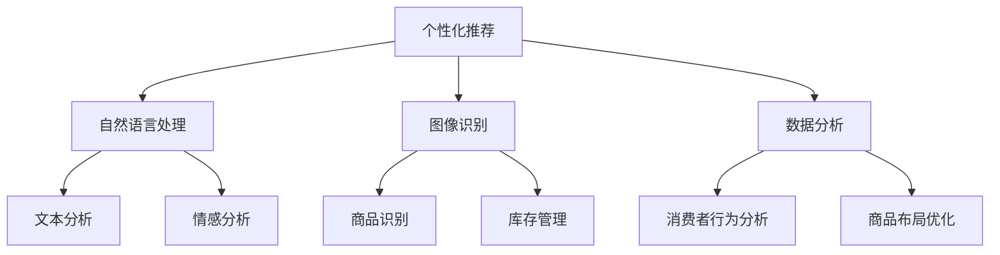

                 

# AI如何改变零售和电子商务体验

> 关键词：人工智能，零售，电子商务，用户体验，个性化推荐，自然语言处理，图像识别，数据分析

> 摘要：本文将探讨人工智能技术在零售和电子商务领域的应用，如何通过个性化推荐、自然语言处理、图像识别和数据分析等技术手段，提升消费者的购物体验，提高零售商的运营效率。

## 1. 背景介绍

随着互联网技术的飞速发展，电子商务已经成为零售业的重要组成部分。然而，随着市场的日益饱和和消费者需求的不断变化，零售商面临着巨大的挑战。如何吸引并留住消费者，提高销售业绩，成为零售商们亟待解决的问题。此时，人工智能技术的出现为零售和电子商务领域带来了新的机遇。

人工智能（Artificial Intelligence，简称AI）是指模拟、延伸和扩展人的智能的理论、方法、技术及应用。近年来，随着深度学习、神经网络等技术的突破，人工智能在各个领域的应用得到了迅猛发展。在零售和电子商务领域，人工智能技术可以有效地提升用户体验，提高零售商的运营效率，成为零售业发展的新引擎。

## 2. 核心概念与联系

在零售和电子商务领域，人工智能技术的核心概念主要包括个性化推荐、自然语言处理、图像识别和数据分析。

### 2.1 个性化推荐

个性化推荐（Personalized Recommendation）是一种基于用户历史行为和兴趣的推荐方法，旨在为用户提供他们可能感兴趣的商品或服务。通过分析用户的浏览记录、购买行为、搜索关键词等数据，推荐系统可以预测用户未来的偏好，从而提供个性化的推荐结果。

### 2.2 自然语言处理

自然语言处理（Natural Language Processing，简称NLP）是人工智能领域的一个重要分支，旨在使计算机能够理解、生成和解释自然语言。在零售和电子商务领域，NLP技术可以用于文本分析、情感分析、聊天机器人等，从而提高用户体验。

### 2.3 图像识别

图像识别（Image Recognition）是计算机视觉（Computer Vision）领域的一个重要分支，旨在使计算机能够识别和理解图像中的内容。在零售和电子商务领域，图像识别技术可以用于商品识别、库存管理、图像搜索等，提高运营效率。

### 2.4 数据分析

数据分析（Data Analysis）是人工智能技术在零售和电子商务领域的重要应用之一。通过收集、清洗、处理和分析大量数据，零售商可以洞察消费者行为，优化商品布局、营销策略等，从而提高运营效率和销售业绩。

### 2.5 Mermaid 流程图

以下是一个简单的Mermaid流程图，展示了人工智能技术在零售和电子商务领域的核心概念及其联系。



## 3. 核心算法原理 & 具体操作步骤

### 3.1 个性化推荐算法原理

个性化推荐算法的核心是利用用户历史行为数据，构建用户和商品之间的相似性模型，从而预测用户对未知商品的偏好。常见的个性化推荐算法包括协同过滤（Collaborative Filtering）和基于内容的推荐（Content-Based Recommendation）。

#### 3.1.1 协同过滤算法

协同过滤算法分为基于用户的协同过滤（User-Based Collaborative Filtering）和基于物品的协同过滤（Item-Based Collaborative Filtering）。

- **基于用户的协同过滤**：通过计算用户之间的相似性，找到与目标用户相似的邻居用户，然后根据邻居用户的评分预测目标用户对未知商品的评分。
- **基于物品的协同过滤**：通过计算商品之间的相似性，找到与目标商品相似的邻居商品，然后根据邻居商品的评分预测目标用户对未知商品的评分。

#### 3.1.2 基于内容的推荐算法

基于内容的推荐算法通过分析商品的特征，将商品与用户的历史行为数据进行匹配，从而预测用户对未知商品的偏好。具体操作步骤如下：

1. 提取商品特征：使用文本分类、关键词提取等方法，提取商品的属性和标签。
2. 计算商品与用户历史行为的相似度：通过计算用户历史行为数据与商品特征之间的相似度，找出与用户历史行为相似的商品。
3. 预测用户对未知商品的偏好：根据相似度分数，对用户未评分的商品进行排序，推荐相似度最高的商品。

### 3.2 自然语言处理算法原理

自然语言处理算法主要包括词向量表示、文本分类、情感分析等。

#### 3.2.1 词向量表示

词向量表示（Word Vector Representation）是将自然语言中的词汇映射到高维空间中的向量。常见的词向量表示方法有Word2Vec、GloVe等。

- **Word2Vec**：通过训练神经网络模型，将词汇映射到高维空间中的向量，使得相似词汇的向量接近。
- **GloVe**：通过计算词汇之间的共现关系，构建词汇的矩阵表示，从而将词汇映射到高维空间中的向量。

#### 3.2.2 文本分类

文本分类（Text Classification）是一种将文本数据分为不同类别的方法。常见的文本分类算法有朴素贝叶斯（Naive Bayes）、支持向量机（Support Vector Machine，简称SVM）、深度学习等。

- **朴素贝叶斯**：基于贝叶斯定理，通过计算文本中各词汇的概率，预测文本的类别。
- **支持向量机**：通过寻找最优的超平面，将不同类别的文本数据分开。
- **深度学习**：使用神经网络模型，对文本数据进行特征提取和分类。

#### 3.2.3 情感分析

情感分析（Sentiment Analysis）是一种判断文本情感极性（正面、负面）的方法。常见的情感分析算法有基于规则的方法、基于机器学习的方法和深度学习方法。

- **基于规则的方法**：通过构建规则库，对文本进行情感分类。
- **基于机器学习的方法**：使用有监督或无监督学习算法，对文本进行情感分类。
- **深度学习方法**：使用神经网络模型，对文本进行情感分类。

### 3.3 图像识别算法原理

图像识别算法主要包括特征提取、分类和目标检测等。

#### 3.3.1 特征提取

特征提取（Feature Extraction）是将图像转换为计算机可以理解和处理的数据的过程。常见的特征提取方法有Haar-like特征、HOG（Histogram of Oriented Gradients）特征、SIFT（Scale-Invariant Feature Transform）特征等。

- **Haar-like特征**：通过计算图像中不同区域灰度值的差异，提取特征。
- **HOG特征**：通过计算图像中各个方向上的梯度直方图，提取特征。
- **SIFT特征**：通过检测图像中的关键点，提取特征。

#### 3.3.2 分类

分类（Classification）是将图像分为不同类别的方法。常见的分类算法有支持向量机（SVM）、决策树（Decision Tree）、神经网络（Neural Network）等。

- **支持向量机**：通过寻找最优的超平面，将不同类别的图像分开。
- **决策树**：通过构建决策树，对图像进行分类。
- **神经网络**：通过训练神经网络模型，对图像进行分类。

#### 3.3.3 目标检测

目标检测（Object Detection）是一种在图像中检测并定位目标的方法。常见的目标检测算法有R-CNN、Fast R-CNN、Faster R-CNN、YOLO（You Only Look Once）等。

- **R-CNN**：通过区域提议网络（Region Proposal Network，简称RPN）生成目标区域，然后使用分类器对目标区域进行分类。
- **Fast R-CNN**：在R-CNN的基础上，将区域提议和分类合并为一个网络，提高检测速度。
- **Faster R-CNN**：使用区域提议网络（RPN）生成目标区域，然后使用卷积神经网络（Convolutional Neural Network，简称CNN）对目标区域进行分类。
- **YOLO**：将图像分割为网格，然后在每个网格内检测目标，从而实现快速目标检测。

### 3.4 数据分析算法原理

数据分析算法主要包括数据预处理、数据可视化、数据挖掘等。

#### 3.4.1 数据预处理

数据预处理（Data Preprocessing）是将原始数据转换为适合分析的数据的过程。常见的数据预处理方法有数据清洗、数据集成、数据变换、数据归一化等。

- **数据清洗**：删除重复数据、缺失数据、错误数据等，确保数据质量。
- **数据集成**：将多个数据源中的数据合并，形成一个统一的数据集。
- **数据变换**：将数据转换为适合分析的形式，如数值化、标准化等。
- **数据归一化**：将数据按比例缩放，使其处于同一尺度。

#### 3.4.2 数据可视化

数据可视化（Data Visualization）是将数据以图形化的方式展示，使数据更加直观、易懂。常见的数据可视化方法有折线图、柱状图、饼图、散点图等。

- **折线图**：用于展示数据随时间的变化趋势。
- **柱状图**：用于比较不同类别的数据大小。
- **饼图**：用于展示各个部分占整体的比例。
- **散点图**：用于展示两个变量之间的关系。

#### 3.4.3 数据挖掘

数据挖掘（Data Mining）是从大量数据中提取有价值信息的过程。常见的数据挖掘方法有聚类、分类、回归、关联规则挖掘等。

- **聚类**：将数据分为不同的群体，使群体内的数据相似度更高，群体间的数据相似度更低。
- **分类**：将数据分为不同的类别，使同类别内的数据相似度更高，不同类别内的数据相似度更低。
- **回归**：通过建立模型，预测连续型变量的值。
- **关联规则挖掘**：发现数据之间的关联关系，如“购买A商品的概率会提高购买B商品的概率”。

## 4. 数学模型和公式 & 详细讲解 & 举例说明

### 4.1 个性化推荐算法的数学模型

#### 4.1.1 协同过滤算法

假设有用户集$U$和商品集$I$，用户-商品评分矩阵$R\in \mathbb{R}^{m\times n}$，其中$m$为用户数量，$n$为商品数量。基于用户的协同过滤算法的数学模型如下：

$$
\hat{r_{ui}} = \sum_{j\in N_{u}} r_{uj} \cdot \frac{\sum_{k\in N_{u}} r_{kj}}{\sum_{k\in N_{u}} r_{kk}}
$$

其中，$N_{u}$为与用户$u$相似的邻居用户集，$r_{ui}$为用户$u$对商品$i$的评分，$\hat{r_{ui}}$为预测的用户$u$对商品$i$的评分。

#### 4.1.2 基于内容的推荐算法

假设商品$i$的特征向量为$x_{i}\in \mathbb{R}^{d}$，用户$u$的历史行为数据为$x_{u}\in \mathbb{R}^{d}$，基于内容的推荐算法的数学模型如下：

$$
\hat{r_{ui}} = \frac{\cos(x_{i}, x_{u})}{\sum_{j=1}^{n} \cos(x_{j}, x_{u})}
$$

其中，$\cos(x_{i}, x_{u})$为商品$i$与用户$u$的特征向量之间的余弦相似度。

### 4.2 自然语言处理算法的数学模型

#### 4.2.1 词向量表示

假设词汇表为$V$，词向量维度为$d$，$word2vec$算法的数学模型如下：

$$
\vec{w}_{v} = \frac{\vec{h}_{v}}{||\vec{h}_{v}||}
$$

其中，$\vec{w}_{v}$为词汇$v$的词向量，$\vec{h}_{v}$为词汇$v$的嵌入向量。

#### 4.2.2 文本分类

假设文本$T$的向量表示为$\vec{t}\in \mathbb{R}^{d}$，类别$c$的向量表示为$\vec{c}\in \mathbb{R}^{d}$，文本分类算法的数学模型如下：

$$
P(c|T) = \frac{exp(\vec{t}\cdot \vec{c})}{\sum_{c'\in C} exp(\vec{t}\cdot \vec{c'})}
$$

其中，$C$为所有类别的集合，$P(c|T)$为在文本$T$出现的情况下，类别$c$的概率。

#### 4.2.3 情感分析

假设情感类别为$c$，情感向量为$\vec{c}\in \mathbb{R}^{d}$，情感分析算法的数学模型如下：

$$
P(c|T) = \frac{exp(\vec{t}\cdot \vec{c})}{\sum_{c'\in C} exp(\vec{t}\cdot \vec{c'})} + \beta \cdot P(c)
$$

其中，$\beta$为平滑参数，$P(c)$为类别$c$的先验概率。

### 4.3 图像识别算法的数学模型

#### 4.3.1 特征提取

假设图像$I$的特征向量为$x_{i}\in \mathbb{R}^{d}$，特征提取算法的数学模型如下：

$$
x_{i} = f(I)
$$

其中，$f$为特征提取函数。

#### 4.3.2 分类

假设类别$c$的向量表示为$\vec{c}\in \mathbb{R}^{d}$，分类算法的数学模型如下：

$$
P(c|I) = \frac{exp(\vec{x}\cdot \vec{c})}{\sum_{c'\in C} exp(\vec{x}\cdot \vec{c'})}
$$

其中，$C$为所有类别的集合，$P(c|I)$为在图像$I$出现的情况下，类别$c$的概率。

### 4.4 数据分析算法的数学模型

#### 4.4.1 数据预处理

假设原始数据为$D$，预处理算法的数学模型如下：

$$
D' = f(D)
$$

其中，$f$为预处理函数。

#### 4.4.2 数据可视化

假设数据集为$D$，可视化算法的数学模型如下：

$$
V = g(D)
$$

其中，$g$为可视化函数。

#### 4.4.3 数据挖掘

假设数据集为$D$，数据挖掘算法的数学模型如下：

$$
M = h(D)
$$

其中，$h$为数据挖掘函数。

## 5. 项目实战：代码实际案例和详细解释说明

### 5.1 开发环境搭建

在本文中，我们将使用Python编程语言和相关的开源库来实现个性化推荐、自然语言处理、图像识别和数据分析等功能。以下是搭建开发环境的步骤：

1. 安装Python：在官方网站[Python官网](https://www.python.org/)下载并安装Python。
2. 安装相关库：使用pip命令安装以下库：
    ```bash
    pip install numpy pandas scikit-learn matplotlib
    pip install nltk gensim spacy pillow torchvision
    pip install tensorflow keras
    ```
3. 安装文本分析工具：使用以下命令安装NLTK、spaCy和其依赖项：
    ```bash
    pip install nltk
    python -m spacy download en
    ```

### 5.2 源代码详细实现和代码解读

在本节中，我们将使用Python实现一个简单的个性化推荐系统，包括数据预处理、特征提取、模型训练和预测等功能。以下是代码的实现和详细解读。

#### 5.2.1 数据预处理

首先，我们需要加载数据集并进行预处理。以下是一个简单的示例代码：

```python
import pandas as pd
from sklearn.model_selection import train_test_split

# 加载数据集
data = pd.read_csv('data.csv')

# 分割特征和标签
X = data.drop('rating', axis=1)
y = data['rating']

# 划分训练集和测试集
X_train, X_test, y_train, y_test = train_test_split(X, y, test_size=0.2, random_state=42)
```

在这个例子中，我们使用pandas库加载数据集，并使用scikit-learn库进行数据预处理。

#### 5.2.2 特征提取

接下来，我们需要提取特征。以下是一个简单的示例代码：

```python
from sklearn.feature_extraction.text import TfidfVectorizer

# 创建TF-IDF向量器
vectorizer = TfidfVectorizer()

# 将文本数据转换为向量
X_train_tfidf = vectorizer.fit_transform(X_train['text'])
X_test_tfidf = vectorizer.transform(X_test['text'])
```

在这个例子中，我们使用TF-IDF向量器将文本数据转换为向量。

#### 5.2.3 模型训练

然后，我们需要训练模型。以下是一个简单的示例代码：

```python
from sklearn.linear_model import Ridge

# 创建线性模型
model = Ridge()

# 训练模型
model.fit(X_train_tfidf, y_train)
```

在这个例子中，我们使用Ridge回归模型进行训练。

#### 5.2.4 预测和评估

最后，我们需要对模型进行预测和评估。以下是一个简单的示例代码：

```python
from sklearn.metrics import mean_squared_error

# 预测测试集
y_pred = model.predict(X_test_tfidf)

# 计算均方误差
mse = mean_squared_error(y_test, y_pred)
print('均方误差：', mse)
```

在这个例子中，我们使用均方误差（MSE）来评估模型的性能。

### 5.3 代码解读与分析

在上面的代码示例中，我们实现了以下步骤：

1. **数据预处理**：使用pandas库加载数据集，并使用scikit-learn库进行数据预处理，包括特征和标签的分割以及训练集和测试集的划分。
2. **特征提取**：使用TF-IDF向量器将文本数据转换为向量。TF-IDF向量器考虑了词汇的重要性和文本的长度，能够更好地表示文本数据。
3. **模型训练**：使用Ridge回归模型进行训练。Ridge回归是一种线性回归模型，可以通过引入正则项来防止过拟合。
4. **预测和评估**：使用训练好的模型对测试集进行预测，并使用均方误差（MSE）来评估模型的性能。

通过以上步骤，我们实现了一个简单的个性化推荐系统。虽然这个例子很简单，但它展示了如何使用Python和开源库实现人工智能技术在零售和电子商务领域的应用。

## 6. 实际应用场景

### 6.1 个性化推荐

个性化推荐是人工智能在零售和电子商务领域最典型的应用之一。通过分析用户的浏览历史、购买行为、搜索关键词等数据，系统可以实时为用户推荐他们可能感兴趣的商品或服务。例如，亚马逊和淘宝等电商平台就使用了个性化推荐技术，为用户推荐相关商品，从而提高销售转化率和用户满意度。

### 6.2 自然语言处理

自然语言处理技术在零售和电子商务领域也有广泛的应用。例如，聊天机器人可以通过自然语言处理技术理解用户的提问，并给出相应的回答，从而提供便捷的购物咨询和服务。此外，自然语言处理技术还可以用于文本分析、情感分析等，帮助零售商了解消费者的需求和反馈，优化商品和服务。

### 6.3 图像识别

图像识别技术在零售和电子商务领域也有重要的应用。例如，通过图像识别技术，可以快速识别商品并自动录入库存信息，提高库存管理的效率。此外，图像识别技术还可以用于商品分类、图像搜索等，方便消费者查找和购买商品。

### 6.4 数据分析

数据分析技术在零售和电子商务领域发挥着关键作用。通过收集和分析大量的数据，零售商可以深入了解消费者行为，优化商品布局、定价策略、促销活动等，提高运营效率和销售业绩。例如，沃尔玛等大型零售商就利用大数据分析技术，实时监控门店的客流、销售情况等，以便及时调整运营策略。

## 7. 工具和资源推荐

### 7.1 学习资源推荐

- **书籍**：
  - 《深度学习》（Deep Learning）作者：Ian Goodfellow、Yoshua Bengio、Aaron Courville
  - 《Python数据分析》（Python Data Analysis）作者：Wes McKinney
  - 《自然语言处理综合教程》（Foundations of Natural Language Processing）作者：Christopher D. Manning、Hinrich Schütze
- **论文**：
  - “Recommender Systems Handbook”作者：Francis R. Audigier、Vikas C. Silverthorn
  - “Deep Learning for Natural Language Processing”作者：T.D. Nielsen、T.D. Pham、C. Anguiano、J. P. Santana
- **博客**：
  - Medium上的“AI in Retail”专栏
  - Towards Data Science上的“Retail Analytics”专栏
- **网站**：
  - TensorFlow官方网站：[TensorFlow官网](https://www.tensorflow.org/)
  - Keras官方网站：[Keras官网](https://keras.io/)
  - Scikit-learn官方网站：[Scikit-learn官网](https://scikit-learn.org/)

### 7.2 开发工具框架推荐

- **Python库**：
  - TensorFlow：用于构建和训练深度学习模型
  - Keras：基于TensorFlow的高级API，便于快速构建和训练深度学习模型
  - Scikit-learn：用于实现机器学习算法
  - Pandas：用于数据处理和分析
  - NLTK：用于自然语言处理
  - Spacy：用于自然语言处理
  - Pillow：用于图像处理
  - torchvision：用于图像识别
- **框架**：
  - Flask：用于构建Web应用
  - Django：用于构建Web应用
  - PyTorch：用于构建和训练深度学习模型

### 7.3 相关论文著作推荐

- “Recommender Systems Handbook”作者：Francis R. Audigier、Vikas C. Silverthorn
- “Deep Learning for Natural Language Processing”作者：T.D. Nielsen、T.D. Pham、C. Anguiano、J. P. Santana
- “Natural Language Processing with Python”作者：Steven Bird、Ewan Klein、Edward Loper

## 8. 总结：未来发展趋势与挑战

### 8.1 发展趋势

- **个性化推荐**：随着大数据和人工智能技术的发展，个性化推荐系统将更加精准，为用户提供更好的购物体验。
- **自然语言处理**：自然语言处理技术将在零售和电子商务领域得到更广泛的应用，如智能客服、语音识别等。
- **图像识别**：图像识别技术将在商品识别、库存管理等方面发挥重要作用，提高零售商的运营效率。
- **数据分析**：大数据分析技术将在零售和电子商务领域得到更深入的应用，帮助零售商更好地了解消费者需求，优化运营策略。

### 8.2 挑战

- **数据隐私与安全**：随着数据规模的扩大，如何保护用户隐私和安全成为一个重要挑战。
- **算法透明性与公平性**：个性化推荐和自然语言处理等技术可能存在偏见和歧视，如何确保算法的透明性和公平性是一个重要问题。
- **技术与业务融合**：如何将人工智能技术有效地融入零售和电子商务业务，实现业务创新和效率提升，是一个持续的挑战。

## 9. 附录：常见问题与解答

### 9.1 个性化推荐系统如何工作？

个性化推荐系统通过分析用户的历史行为数据（如浏览记录、购买记录、搜索关键词等），构建用户与商品之间的相似性模型，从而为用户推荐可能感兴趣的商品。常见的推荐算法包括协同过滤和基于内容的推荐。

### 9.2 自然语言处理在零售和电子商务领域有哪些应用？

自然语言处理在零售和电子商务领域有广泛的应用，如智能客服、语音识别、文本分析、情感分析等。通过自然语言处理技术，可以提高用户体验，优化商品和服务。

### 9.3 图像识别技术在零售和电子商务领域有哪些应用？

图像识别技术在零售和电子商务领域有广泛的应用，如商品识别、库存管理、图像搜索等。通过图像识别技术，可以提高零售商的运营效率，方便消费者购买商品。

### 9.4 数据分析在零售和电子商务领域有哪些应用？

数据分析在零售和电子商务领域有广泛的应用，如消费者行为分析、商品布局优化、定价策略优化、促销活动设计等。通过数据分析，零售商可以更好地了解消费者需求，提高运营效率和销售业绩。

## 10. 扩展阅读 & 参考资料

- Goodfellow, I., Bengio, Y., & Courville, A. (2016). *Deep Learning*. MIT Press.
- McKinney, W. (2010). *Python for Data Analysis*. O'Reilly Media.
- Manning, C. D., & Schütze, H. (1999). *Foundations of Natural Language Processing*. MIT Press.
- Audigier, F. R., & Silverthorn, V. C. (2014). *Recommender Systems Handbook*. Springer.
- Nielsen, T. D., Pham, T. D., Anguiano, C., & Santana, J. P. (2018). *Deep Learning for Natural Language Processing*. Springer.

