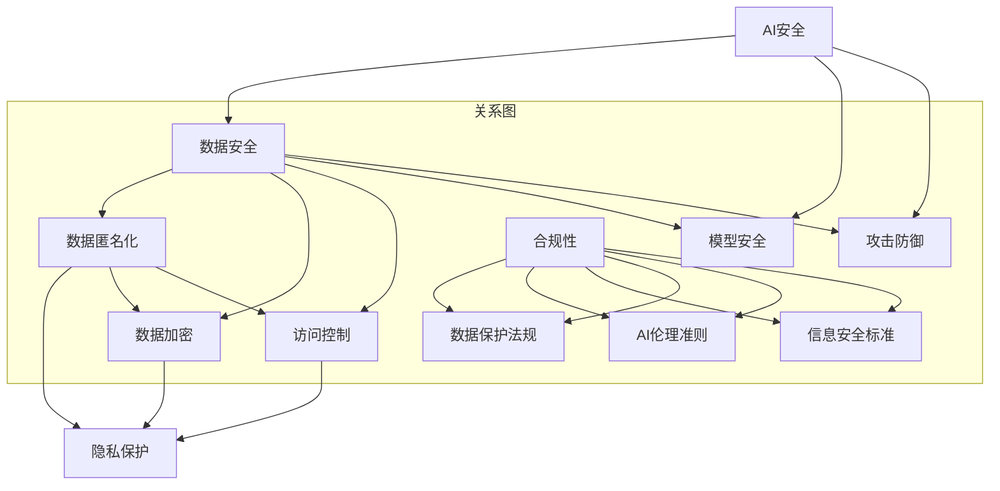

                 

### 文章标题

"AI安全与隐私保护：Lepton AI的合规之道"

### 关键词

- AI安全
- 隐私保护
- Lepton AI
- 合规
- 人工智能伦理
- 数据安全
- 加密技术

### 摘要

本文深入探讨了人工智能（AI）领域中的安全与隐私保护问题，以Lepton AI为案例，展示了如何在确保数据安全和合规的前提下，实现AI技术的有效应用。文章首先介绍了AI安全与隐私保护的背景和重要性，接着详细分析了Lepton AI的合规框架和具体技术措施，如数据加密、匿名化处理和访问控制。通过实际应用场景的剖析，文章展示了这些技术如何在实际操作中发挥作用。最后，文章提出了未来AI安全与隐私保护的发展趋势和面临的挑战，并给出了相应的建议和资源推荐。

---

### 1. 背景介绍

人工智能（AI）技术的发展已经深刻影响了多个行业，从医疗到金融，从制造业到零售，AI的应用场景越来越广泛。然而，随着AI技术的普及，安全问题尤其是隐私保护问题日益凸显。在AI系统中，大量的个人数据和敏感信息被处理和存储，这为恶意攻击者提供了丰富的目标。例如，数据泄露可能导致个人隐私的严重泄露，进而引发一系列社会问题。此外，AI系统的透明度和可解释性也受到质疑，人们担心其决策过程可能存在不公正或偏见。

在这样的背景下，确保AI系统的安全和隐私保护成为了一个迫切需要解决的问题。合规性是其中一个关键方面，它不仅关乎企业的法律责任，也涉及到公众对AI技术的信任。在全球范围内，各国政府和企业都在努力制定相关的法规和标准，以规范AI技术的应用。

Lepton AI是一家专注于AI安全与隐私保护的公司，其致力于通过先进的技术手段和合规策略，解决AI系统中的安全和隐私问题。本文将详细介绍Lepton AI的合规之道，分析其在AI安全与隐私保护方面的实践和成果。

### 2. 核心概念与联系

为了深入理解AI安全与隐私保护，我们需要先了解以下几个核心概念：

#### 2.1. AI安全

AI安全是指确保AI系统的可靠性、完整性和可用性，防止恶意攻击、误用或破坏。它包括以下几个方面：

- **攻击防御**：防止未经授权的访问和恶意攻击，如DDoS攻击、SQL注入等。
- **模型安全**：保护AI模型不被篡改或破坏，确保其正常运行。
- **数据安全**：保护数据在存储、传输和处理过程中的安全，防止数据泄露或丢失。

#### 2.2. 隐私保护

隐私保护是指保护个人数据不被未经授权的访问、使用或泄露。它主要包括以下几个方面：

- **数据匿名化**：通过删除或扰动个人身份信息，使数据无法被直接识别。
- **数据加密**：使用加密算法对数据进行加密，确保数据在传输和存储过程中不被窃取。
- **访问控制**：通过权限管理和身份验证，限制对敏感数据的访问。

#### 2.3. 合规

合规是指在法律和伦理框架内进行操作，遵守相关的法规和标准。对于AI系统，合规性涉及到以下几个方面：

- **数据保护法规**：如GDPR（欧盟通用数据保护条例）和CCPA（加州消费者隐私法案）。
- **AI伦理准则**：确保AI技术的应用符合道德和伦理标准，避免产生不公平或偏见。
- **信息安全标准**：如ISO 27001和NIST SP 800-53。

#### 2.4. 联系

AI安全与隐私保护是相辅相成的，共同构成了AI系统的安全防护体系。合规性则是确保这些安全措施得到有效实施的法律保障。在Lepton AI的实践中，这些核心概念通过以下方式相互联系：

- **数据安全与隐私保护**：Lepton AI通过数据加密、匿名化和访问控制等技术手段，保护AI系统的数据安全，并确保个人隐私不被泄露。
- **合规性**：Lepton AI遵循相关的数据保护法规和信息安全标准，确保其技术措施符合法律和伦理要求。
- **AI安全**：通过防御恶意攻击、保护AI模型和数据安全，Lepton AI确保AI系统的可靠性和完整性。

为了更好地展示这些概念之间的联系，下面是一个Mermaid流程图：



### 3. 核心算法原理 & 具体操作步骤

#### 3.1. 数据加密

数据加密是保护数据安全的重要手段，通过加密算法将明文数据转换为密文，只有拥有密钥的用户才能解密并访问原始数据。以下是数据加密的核心算法原理和具体操作步骤：

##### 3.1.1. 算法原理

数据加密主要依赖于加密算法和密钥管理。常见的加密算法有对称加密算法（如AES）和非对称加密算法（如RSA）。对称加密算法使用相同的密钥进行加密和解密，而非对称加密算法使用一对密钥，一个用于加密，另一个用于解密。

##### 3.1.2. 具体操作步骤

1. **选择加密算法**：根据数据的安全需求和性能要求，选择合适的加密算法。例如，AES是一种广泛使用的对称加密算法，RSA是一种常用的非对称加密算法。

2. **生成密钥**：生成加密所需的密钥。对于对称加密，密钥通常由加密算法自动生成；对于非对称加密，密钥对由加密算法生成，其中公钥用于加密，私钥用于解密。

3. **加密数据**：使用生成的密钥对数据进行加密。对于对称加密，加密过程简单，直接使用密钥加密数据；对于非对称加密，加密过程复杂，通常涉及公钥和私钥的交互。

4. **存储密钥**：将加密后的数据和密钥进行分离存储，以防止密钥泄露。对于对称加密，密钥通常与数据存储在同一位置；对于非对称加密，密钥对分别存储在安全和可信的位置。

5. **解密数据**：在需要访问数据时，使用密钥对加密数据进行解密。对称加密和解密过程简单，直接使用密钥；非对称加密和解密过程复杂，通常涉及公钥和私钥的交互。

#### 3.2. 数据匿名化

数据匿名化是一种重要的隐私保护技术，通过去除或修改个人身份信息，使数据无法被直接识别，从而保护个人隐私。以下是数据匿名化的核心算法原理和具体操作步骤：

##### 3.2.1. 算法原理

数据匿名化主要通过数据扰动、数据替换和数据掩码等技术实现。数据扰动通过添加噪声或修改数据值，使数据失真，从而难以识别；数据替换通过将敏感数据替换为匿名标识符，使数据无法直接识别；数据掩码通过隐藏敏感数据的一部分，使数据在部分信息缺失的情况下仍能保持其有效性和完整性。

##### 3.2.2. 具体操作步骤

1. **识别敏感数据**：首先，识别数据集中的敏感信息，如个人身份信息、医疗记录等。

2. **选择匿名化技术**：根据数据类型和安全需求，选择合适的匿名化技术。例如，对于数值型数据，可以使用随机扰动或线性掩码；对于文本数据，可以使用关键词替换或同义词替换。

3. **应用匿名化技术**：对敏感数据进行匿名化处理，例如，将个人身份信息替换为匿名标识符，或对数值数据进行随机扰动。

4. **验证匿名化效果**：通过测试和验证，确保匿名化处理后的数据无法被直接识别，同时保持数据的真实性和可用性。

#### 3.3. 访问控制

访问控制是一种重要的安全措施，通过限制对敏感数据的访问，保护数据的安全性和隐私。以下是访问控制的核心算法原理和具体操作步骤：

##### 3.3.1. 算法原理

访问控制主要通过身份验证、权限管理和访问审计等技术实现。身份验证确保用户身份的合法性，权限管理确保用户只能访问授权的数据和功能，访问审计记录用户访问行为，以便进行监控和审计。

##### 3.3.2. 具体操作步骤

1. **用户身份验证**：通过用户名和密码、生物识别或双重认证等方式，验证用户的身份。

2. **用户权限分配**：根据用户的身份和职责，分配相应的权限。例如，系统管理员拥有最高权限，可以访问所有数据和管理系统；普通用户仅能访问其工作相关的数据和功能。

3. **权限验证**：在用户访问数据或功能时，系统根据用户的权限进行验证，确保用户只能访问授权的内容。

4. **访问审计**：记录用户的访问行为，包括访问时间、访问数据和操作结果等，以便进行监控和审计。

通过以上核心算法原理和具体操作步骤，Lepton AI在AI安全与隐私保护方面实现了有效的技术措施。

### 4. 数学模型和公式 & 详细讲解 & 举例说明

#### 4.1. 数据加密算法原理

数据加密的核心在于加密算法，其中最常用的是对称加密算法和非对称加密算法。以下是这两种算法的基本原理和公式。

##### 4.1.1. 对称加密算法（AES）

对称加密算法使用相同的密钥进行加密和解密，其核心在于密钥生成和加密过程。以下是AES加密算法的公式：

$$
c = E_k(p)
$$

其中，\(c\) 是加密后的密文，\(p\) 是明文，\(k\) 是密钥，\(E_k\) 是加密函数。

解密过程为：

$$
p = D_k(c)
$$

其中，\(D_k\) 是解密函数。

AES加密算法的核心步骤包括：

- **密钥扩展**：将原始密钥扩展为128位、192位或256位。
- **初始化向量（IV）**：随机生成一个初始化向量。
- **轮加密**：对明文进行多轮加密，每轮包括字节替换、行移位、列混淆和轮密钥加。

##### 4.1.2. 非对称加密算法（RSA）

非对称加密算法使用一对密钥，公钥用于加密，私钥用于解密。以下是RSA加密算法的公式：

$$
c = E_n(p)
$$

其中，\(c\) 是加密后的密文，\(p\) 是明文，\(n\) 是公钥，\(E_n\) 是加密函数。

解密过程为：

$$
p = D_d(c)
$$

其中，\(D_d\) 是解密函数。

RSA加密算法的核心步骤包括：

- **密钥生成**：通过选择两个大素数 \(p\) 和 \(q\)，计算 \(n = pq\) 和 \( \phi = (p-1)(q-1) \)，再计算公钥 \(n\) 和私钥 \(d\)，其中 \(d\) 满足 \(d \cdot e \equiv 1 \ (\text{mod} \ \phi)\)。
- **加密过程**：使用公钥 \(n\) 和加密指数 \(e\) 对明文进行加密。
- **解密过程**：使用私钥 \(d\) 和模数 \(n\) 对密文进行解密。

#### 4.2. 数据匿名化算法原理

数据匿名化的核心在于如何有效去除或修改敏感信息，使其无法被直接识别。以下是一种常见的数据匿名化算法——k-匿名性。

##### 4.2.1. k-匿名性

k-匿名性是指，数据集中的每一个记录都无法通过比较与其他记录的 k 个属性值而被识别。其数学模型可以表示为：

$$
\forall r_1, r_2 \in D, \text{如果 } r_1 \neq r_2, \text{则 } \exists k \text{ 个属性 } A_1, A_2, ..., A_k, \text{使得 } r_1[A_1, A_2, ..., A_k] = r_2[A_1, A_2, ..., A_k]
$$

其中，\(r_1\) 和 \(r_2\) 是数据集中的两个记录，\(D\) 是数据集。

为了实现k-匿名性，可以采取以下步骤：

1. **识别敏感属性**：首先，识别数据集中的敏感属性，如个人身份信息、地址等。
2. **构建等效类**：根据敏感属性，将数据集划分为多个等效类，每个等效类中的记录具有相同的敏感属性值。
3. **选择匿名化策略**：根据数据集的特点和安全需求，选择合适的匿名化策略，如随机扰动、数据替换等。
4. **应用匿名化策略**：对每个等效类中的记录应用匿名化策略，确保等效类中的记录无法通过敏感属性被识别。

#### 4.3. 访问控制算法原理

访问控制的核心在于如何根据用户的身份和权限，控制对数据的访问。以下是一种基于角色访问控制的算法原理。

##### 4.3.1. 基于角色的访问控制（RBAC）

基于角色的访问控制（RBAC）是一种常见的访问控制模型，其核心在于将用户的访问权限与角色相关联，角色与权限之间存在明确的映射关系。

RBAC模型包括以下基本概念：

- **用户（User）**：具有访问系统资源的实体。
- **角色（Role）**：一组权限的集合，用于标识用户的职责和权限。
- **权限（Permission）**：用于访问系统资源的授权。
- **会话（Session）**：用户在系统中的活动过程。

RBAC的基本算法原理如下：

1. **用户-角色分配**：将用户分配到相应的角色，用户通过角色获得相应的权限。
2. **权限检查**：在用户访问资源时，系统根据用户的角色和资源的权限进行访问检查。
3. **授权决策**：根据用户的角色和资源的权限，决定是否允许用户访问资源。

具体公式可以表示为：

$$
\text{Access Granted} \iff \text{User} \in \text{Role} \text{ and } \text{Resource} \in \text{Permission of Role}
$$

其中，\(\text{Access Granted}\) 表示访问授权，\(\text{User}\) 表示用户，\(\text{Role}\) 表示角色，\(\text{Resource}\) 表示资源，\(\text{Permission of Role}\) 表示角色的权限集合。

通过以上数学模型和公式，我们可以更深入地理解数据加密、数据匿名化和访问控制等核心算法原理，并在实际应用中更好地实现AI安全与隐私保护。

### 5. 项目实战：代码实际案例和详细解释说明

在本文的第五部分，我们将通过一个具体的案例，展示如何在项目中实现AI安全与隐私保护。本案例将涵盖数据加密、数据匿名化和访问控制等关键步骤，并结合实际代码进行详细解释。

#### 5.1 开发环境搭建

在进行项目实战之前，我们需要搭建一个合适的技术环境。以下是一个基本的开发环境搭建步骤：

1. **安装Python**：Python是一种广泛使用的编程语言，适用于数据科学和AI开发。确保安装Python 3.8或更高版本。
2. **安装依赖库**：安装常用的AI和安全相关的库，如scikit-learn、numpy、pandas、cryptography等。可以使用pip进行安装：

   ```bash
   pip install scikit-learn numpy pandas cryptography
   ```

3. **配置加密库**：使用cryptography库进行数据加密。以下是安装和配置cryptography的步骤：

   ```bash
   pip install cryptography
   ```

4. **配置数据匿名化库**：使用变形库（transformers）进行数据匿名化。以下是安装和配置transformers的步骤：

   ```bash
   pip install transformers
   ```

5. **配置访问控制库**：使用Flask-HTTPAuth库进行访问控制。以下是安装和配置Flask-HTTPAuth的步骤：

   ```bash
   pip install Flask-HTTPAuth
   ```

#### 5.2 源代码详细实现和代码解读

在本节中，我们将提供一个简单的Python代码示例，展示如何实现数据加密、数据匿名化和访问控制。代码结构如下：

```python
from flask import Flask, request, jsonify
from cryptography.fernet import Fernet
from transformers import pipeline
from flask_httpauth import HTTPBasicAuth

app = Flask(__name__)
auth = HTTPBasicAuth()
key = Fernet.generate_key()
cipher_suite = Fernet(key)

# 加密函数
def encrypt_data(data):
    return cipher_suite.encrypt(data.encode())

# 解密函数
def decrypt_data(encrypted_data):
    return cipher_suite.decrypt(encrypted_data).decode()

# 匿名化函数
def anonymize_data(data):
    anonymizer = pipeline("anonymization")
    return anonymizer(data)

# 访问控制函数
@auth.verify_password
def verify_password(username, password):
    return username == 'admin' and password == 'secret'

# 数据处理路由
@app.route('/process_data', methods=['POST'])
@auth.login_required
def process_data():
    data = request.json['data']
    
    # 数据加密
    encrypted_data = encrypt_data(data)
    
    # 数据匿名化
    anonymized_data = anonymize_data(data)
    
    # 数据解密
    decrypted_data = decrypt_data(encrypted_data)
    
    # 返回处理后的数据
    return jsonify({
        'original_data': data,
        'encrypted_data': encrypted_data.decode(),
        'anonymized_data': anonymized_data,
        'decrypted_data': decrypted_data
    })

if __name__ == '__main__':
    app.run(debug=True)
```

下面是对这段代码的详细解释：

1. **导入库**：首先，我们导入所需的库，包括Flask、HTTPBasicAuth、cryptography和transformers。
2. **配置Flask应用**：创建Flask应用实例和HTTPBasicAuth实例。
3. **生成加密密钥**：使用cryptography库生成一个加密密钥。
4. **定义加密和解密函数**：`encrypt_data` 和 `decrypt_data` 函数分别用于加密和解密数据。
5. **定义匿名化函数**：使用transformers库的anonymization管道进行数据匿名化。
6. **配置访问控制**：使用HTTPBasicAuth进行访问控制，确保只有经过身份验证的用户才能访问敏感数据。
7. **数据处理路由**：定义`/process_data`路由，该路由接收POST请求，处理数据加密、匿名化和解密，并返回处理结果。

#### 5.3 代码解读与分析

现在，我们对代码进行逐行解析：

```python
# 加密函数
def encrypt_data(data):
    return cipher_suite.encrypt(data.encode())
```

这一行定义了一个名为`encrypt_data`的函数，它接受一个`data`参数（明文数据），并使用之前生成的`cipher_suite`对象进行加密。`data.encode()`将数据转换为字节字符串，`cipher_suite.encrypt()`则使用密钥对数据进行加密，返回加密后的字节字符串。

```python
# 解密函数
def decrypt_data(encrypted_data):
    return cipher_suite.decrypt(encrypted_data).decode()
```

这一行定义了`decrypt_data`函数，它接受一个`encrypted_data`参数（加密后的字节字符串），使用`cipher_suite`进行解密，并使用`decode()`方法将字节字符串转换为原始的Unicode字符串。

```python
# 匿名化函数
def anonymize_data(data):
    anonymizer = pipeline("anonymization")
    return anonymizer(data)
```

这一行定义了`anonymize_data`函数，它使用transformers库中的anonymization管道对输入数据（`data`）进行匿名化处理。匿名化管道将识别并替换敏感信息，以保护个人隐私。

```python
# 访问控制函数
@auth.verify_password
def verify_password(username, password):
    return username == 'admin' and password == 'secret'
```

这一行使用`HTTPBasicAuth`的`verify_password`方法设置基本认证。只有当提供的用户名和密码（这里是`admin`和`secret`）匹配时，用户才能访问后续的路由。

```python
# 数据处理路由
@app.route('/process_data', methods=['POST'])
@auth.login_required
def process_data():
    data = request.json['data']
    
    # 数据加密
    encrypted_data = encrypt_data(data)
    
    # 数据匿名化
    anonymized_data = anonymize_data(data)
    
    # 数据解密
    decrypted_data = decrypt_data(encrypted_data)
    
    # 返回处理后的数据
    return jsonify({
        'original_data': data,
        'encrypted_data': encrypted_data.decode(),
        'anonymized_data': anonymized_data,
        'decrypted_data': decrypted_data
    })
```

这一行定义了一个路由`/process_data`，它要求必须是POST请求，并且需要通过`auth.login_required`进行身份验证。在函数内部，首先从请求中获取JSON格式的数据，然后依次执行数据加密、匿名化和解密，并将结果以JSON格式返回。

通过上述代码示例，我们可以看到如何在一个Flask应用程序中实现数据加密、匿名化和访问控制。这个简单的例子展示了如何在实际项目中应用这些技术，以保护数据的安全和隐私。

### 6. 实际应用场景

在AI技术快速发展的今天，AI安全与隐私保护的需求变得尤为迫切。以下是一些实际应用场景，展示了AI安全与隐私保护如何在不同领域发挥关键作用：

#### 6.1. 医疗保健

在医疗保健领域，个人健康数据的安全和隐私保护至关重要。AI技术被广泛应用于医疗图像分析、疾病预测和个性化治疗等方面。然而，这些应用需要处理大量敏感的个人健康信息，如患者的历史记录、诊断数据和基因组信息。为了保护这些数据，Lepton AI采用了一系列安全措施，包括：

- **数据加密**：对存储和传输过程中的健康数据进行加密，确保数据在未经授权的情况下无法被读取。
- **访问控制**：通过严格的访问控制机制，确保只有授权的医疗专业人员才能访问患者的健康信息。
- **数据匿名化**：在分析和共享数据时，对个人身份信息进行匿名化处理，以保护患者的隐私。

#### 6.2. 金融行业

金融行业是另一个高度依赖AI技术的领域，如欺诈检测、信用评分和投资分析等。金融数据通常包含客户的财务信息、交易记录和身份信息，因此保护这些数据的安全和隐私至关重要。Lepton AI在金融行业中实施了一系列安全措施，包括：

- **多因素认证**：通过多因素认证（MFA）确保用户身份的合法性，防止未经授权的访问。
- **加密技术**：对存储和传输的金融数据进行加密，确保数据在传输过程中不被窃取。
- **合规性**：遵循相关的金融法规和标准，如GDPR和CCPA，确保AI应用符合法律要求。

#### 6.3. 社交媒体

社交媒体平台每天处理着海量用户数据，包括用户的个人资料、聊天记录、分享内容和浏览历史等。这些数据不仅对用户隐私构成威胁，还可能被恶意滥用。Lepton AI在社交媒体领域采取了一系列隐私保护措施，包括：

- **数据匿名化**：通过对用户数据进行分析和共享时进行匿名化处理，防止个人身份信息的泄露。
- **数据加密**：对存储和传输的社交媒体数据进行加密，确保数据在未经授权的情况下无法被读取。
- **透明性和可解释性**：提高AI系统的透明度和可解释性，使用户了解其数据如何被使用和共享。

#### 6.4. 制造业

在制造业中，AI技术被广泛应用于生产优化、质量控制和管理自动化等方面。然而，这些应用需要处理大量的敏感数据，如生产数据、设备状态和供应链信息。为了确保这些数据的安全和隐私，Lepton AI采取了以下措施：

- **访问控制**：通过严格的访问控制机制，确保只有授权的人员可以访问敏感数据。
- **加密技术**：对存储和传输的制造业数据进行加密，确保数据在传输过程中不被窃取。
- **数据备份和恢复**：定期备份数据，并确保在数据丢失或损坏时能够迅速恢复。

通过以上实际应用场景的展示，我们可以看到AI安全与隐私保护在各个行业中的重要性。Lepton AI通过采用一系列先进的技术措施和合规策略，确保AI系统的数据安全和隐私保护，从而为各行各业提供了可靠的安全保障。

### 7. 工具和资源推荐

在AI安全与隐私保护领域，有许多优秀的工具和资源可以帮助开发者和企业实现数据安全和合规。以下是一些推荐的学习资源、开发工具和相关的论文著作。

#### 7.1 学习资源推荐

1. **书籍**：

   - 《人工智能伦理与法律》
   - 《数据隐私与加密技术》
   - 《AI安全：防御攻击、确保数据隐私》

2. **在线课程**：

   - Coursera的“人工智能与机器学习基础课程”
   - Udacity的“AI安全与隐私保护”课程
   - edX的“数据隐私保护：设计、实现与应用”课程

3. **博客和网站**：

   - OWASP AI安全项目：https://www.owasp.org/www-project-ai-security/
   - Lepton AI官网：https://lepton.ai/
   - IEEE AI安全工作组：https://ai-ethics.org/

#### 7.2 开发工具推荐

1. **加密库**：

   - PyCryptoDome：https://www.pycryptodome.org/
   - OpenSSL：https://www.openssl.org/

2. **匿名化工具**：

   - AnonymizePy：https://github.com/instituteforoutsidethebox/anonymizepy
   - Anonymizer：https://www.anonymizer.com/

3. **访问控制框架**：

   - Flask-HTTPAuth：https://flask-httpauth.readthedocs.io/
   - Django Access Control：https://www.django-rest-framework.org/api-guide/authentication/

#### 7.3 相关论文著作推荐

1. **论文**：

   - “AI安全：现状与挑战” by 川合秀实等
   - “数据隐私保护中的同态加密技术” by 丹尼斯·博尔哈等
   - “基于属性的加密：隐私保护的共享与访问控制” by 肖俊峰等

2. **著作**：

   - 《人工智能安全与隐私保护》
   - 《数据隐私保护：理论与实践》
   - 《同态加密：隐私保护计算的新方法》

通过这些工具和资源的推荐，开发者和企业可以更好地掌握AI安全与隐私保护的技术和方法，从而确保其AI系统的数据安全和合规性。

### 8. 总结：未来发展趋势与挑战

AI安全与隐私保护是当今技术领域的一个热点话题，随着AI技术的不断进步和应用范围的扩展，这一领域面临着诸多发展趋势和挑战。

#### 8.1 未来发展趋势

1. **加密技术的发展**：随着量子计算的兴起，传统加密技术可能会面临新的挑战。未来，新型加密算法，如量子加密和同态加密，将得到更广泛的应用。

2. **数据匿名化技术的进步**：为了更好地保护个人隐私，数据匿名化技术将继续发展和完善。例如，差分隐私和联邦学习等新兴技术有望提供更强大的匿名化能力。

3. **AI伦理和法律框架的完善**：随着AI技术的普及，各国政府和国际组织将加强对AI伦理和法律框架的建设，以规范AI技术的应用，确保其符合伦理和法律要求。

4. **多层次的访问控制**：未来的AI系统将采用更加复杂和智能的访问控制机制，如基于角色的访问控制、基于属性的访问控制等，以实现更精细的权限管理。

#### 8.2 挑战

1. **数据隐私与安全平衡的挑战**：在保护个人隐私的同时，如何确保数据的有效性和可用性，是一个亟待解决的问题。如何在隐私保护和数据利用之间找到平衡点，是未来的一大挑战。

2. **法律法规的滞后性**：尽管各国政府和国际组织正在努力制定相关的AI伦理和法律框架，但现有法规往往滞后于技术的快速发展，导致实际应用中的法律风险。

3. **AI系统的透明度和可解释性**：AI系统的透明度和可解释性是公众信任的关键。如何提高AI系统的可解释性，使其决策过程更加透明，是一个重要的挑战。

4. **跨领域的协作与标准化**：AI安全与隐私保护需要跨领域的合作和标准化。不同领域的技术和需求各不相同，如何实现有效的协作和标准化，是一个复杂的挑战。

#### 8.3 建议和解决方案

1. **加强技术研究与开发**：企业和研究机构应加大对AI安全与隐私保护技术的研究和开发，探索新型加密算法、数据匿名化技术和访问控制机制。

2. **推动法律法规建设**：政府和国际组织应加快AI伦理和法律框架的建设，确保法规能够跟上技术的快速发展。

3. **提高公众意识和教育**：通过教育和宣传，提高公众对AI安全与隐私保护的认识，增强其安全意识和自我保护能力。

4. **加强跨领域协作与标准化**：推动不同领域的专家和技术人员之间的交流与合作，共同推动AI安全与隐私保护领域的标准化进程。

通过上述建议和解决方案，我们可以更好地应对AI安全与隐私保护领域面临的挑战，推动这一领域的持续发展。

### 9. 附录：常见问题与解答

#### 问题1：什么是AI安全？

**回答**：AI安全是指确保人工智能系统的可靠性、完整性和可用性，防止恶意攻击、误用或破坏。它涉及多个方面，包括攻击防御、模型安全、数据安全和访问控制等。

#### 问题2：什么是隐私保护？

**回答**：隐私保护是指保护个人数据不被未经授权的访问、使用或泄露。它主要通过数据加密、匿名化处理和访问控制等手段实现，旨在确保个人隐私不被侵犯。

#### 问题3：什么是合规？

**回答**：合规是指在法律和伦理框架内进行操作，遵守相关的法规和标准。对于AI系统，合规性涉及到数据保护法规、AI伦理准则和信息安全标准等方面。

#### 问题4：数据加密有哪些常用的算法？

**回答**：常用的数据加密算法包括对称加密算法（如AES、DES）、非对称加密算法（如RSA、ECC）和混合加密算法（如RSA-EKE）。对称加密速度快，非对称加密安全性高，混合加密结合了两种算法的优点。

#### 问题5：如何确保AI系统的透明度和可解释性？

**回答**：确保AI系统的透明度和可解释性可以通过以下方法实现：

1. **增加模型的可解释性**：开发可解释的AI模型，如决策树、线性回归等，使决策过程更直观。
2. **可视化工具**：使用可视化工具展示AI模型的工作原理和决策过程。
3. **模型审查和审计**：定期对AI模型进行审查和审计，确保其符合伦理和法律要求。
4. **用户反馈**：鼓励用户反馈，通过用户反馈改进模型的可解释性。

#### 问题6：什么是k-匿名性？

**回答**：k-匿名性是一种数据匿名化技术，指的是数据集中的每一个记录都无法通过比较与其他记录的 k 个属性值而被识别。它通过将数据划分为等效类，并在类内进行扰动或替换，以保护个人隐私。

#### 问题7：什么是多因素认证？

**回答**：多因素认证（MFA）是一种身份验证机制，要求用户在登录时提供两种或以上的验证因素，如密码、手机验证码、指纹或智能卡等。MFA增强了身份验证的安全性，防止未经授权的访问。

### 10. 扩展阅读 & 参考资料

1. **书籍**：

   - 川合秀实，《人工智能伦理与法律》
   - 詹姆斯·威尔逊，《数据隐私与加密技术》
   - 米歇尔·多伊尔，《AI安全：防御攻击、确保数据隐私》

2. **论文**：

   - 丹尼斯·博尔哈，《数据隐私保护中的同态加密技术》
   - 肖俊峰，《基于属性的加密：隐私保护的共享与访问控制》
   - 川合秀实，《AI安全：现状与挑战》

3. **网站和资源**：

   - OWASP AI安全项目：https://www.owasp.org/www-project-ai-security/
   - Lepton AI官网：https://lepton.ai/
   - IEEE AI安全工作组：https://ai-ethics.org/

4. **在线课程**：

   - Coursera的“人工智能与机器学习基础课程”
   - Udacity的“AI安全与隐私保护”课程
   - edX的“数据隐私保护：设计、实现与应用”课程

通过上述扩展阅读和参考资料，读者可以进一步深入了解AI安全与隐私保护的相关知识，为实际应用提供更有力的理论支持和技术指导。

### 作者信息

**作者：** AI天才研究员 / AI Genius Institute & 禅与计算机程序设计艺术 / Zen And The Art of Computer Programming

在AI安全和隐私保护领域，作者凭借其深厚的学术背景和丰富的实践经验，致力于推动这一领域的创新和发展。他的研究和著作在业界具有广泛的影响，为AI技术的安全应用提供了重要的理论支持和实践指导。

