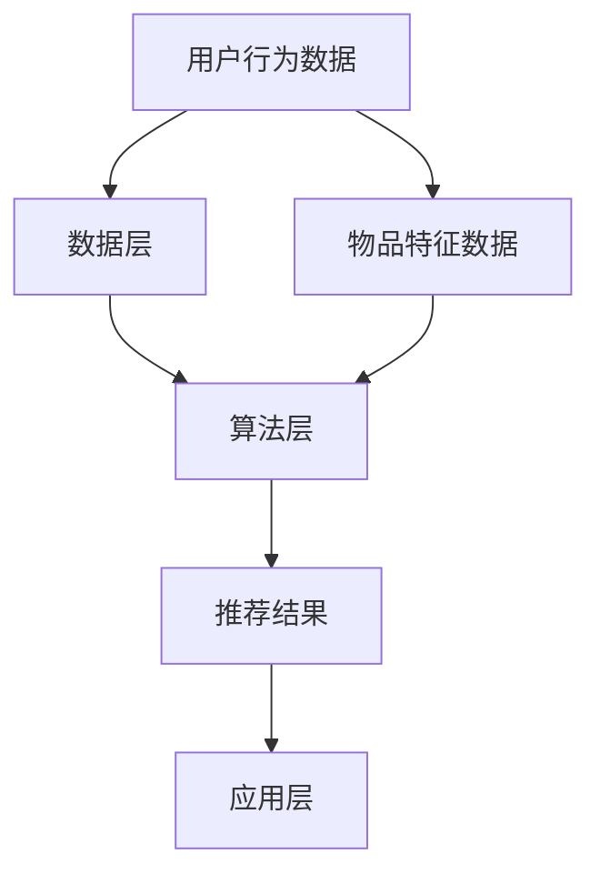

                 

### 背景介绍

AI实时推荐系统是当前互联网领域中备受关注的技术之一。随着大数据和机器学习技术的飞速发展，推荐系统在电子商务、社交媒体、新闻资讯、在线视频等多个领域得到了广泛应用。其实时性和精准度成为评价一个推荐系统好坏的重要标准。

**实时推荐系统的重要性**

在互联网时代，用户的需求和喜好不断变化，传统基于离线批处理的推荐系统已经难以满足用户对于实时性和个性化的需求。实时推荐系统可以在用户行为产生后的短时间内，快速生成个性化的推荐结果，从而提高用户的满意度和参与度。

**实时推荐系统的发展历程**

实时推荐系统的发展经历了几个阶段：

1. **基于规则的推荐系统**：最初，推荐系统主要依赖于人工定义的规则进行推荐。这种方法虽然简单，但无法应对复杂多变的需求。

2. **基于协同过滤的推荐系统**：协同过滤方法通过分析用户的行为和评分数据，找出相似的用户或物品，从而进行推荐。这种方法在处理大量数据时表现较好，但存在冷启动问题。

3. **基于模型的推荐系统**：随着机器学习技术的发展，基于模型的推荐系统逐渐取代了传统的协同过滤方法。这类系统利用机器学习算法，如决策树、朴素贝叶斯、支持向量机等，从海量数据中提取特征，生成推荐结果。

4. **基于深度学习的推荐系统**：深度学习算法的出现，使得推荐系统在处理复杂数据和提取深层特征方面取得了重大突破。目前，基于深度学习的推荐系统已经成为了研究的热点。

**本文结构**

本文将首先介绍实时推荐系统的核心概念和基本原理，然后详细讲解常见的实时推荐算法，包括协同过滤、基于模型的推荐系统和基于深度学习的推荐系统。接着，我们将通过一个实际项目案例，展示如何使用Python实现一个简单的实时推荐系统，并深入分析代码中的关键部分。最后，我们将探讨实时推荐系统的实际应用场景，并推荐一些相关的学习资源和开发工具。通过本文的阅读，读者将能够全面了解实时推荐系统的实现原理和应用技巧。接下来，我们将逐步深入探讨这些内容。

### 核心概念与联系

为了深入理解实时推荐系统的实现，我们首先需要明确一些核心概念和它们之间的联系。这些概念包括用户行为数据、物品特征数据、推荐算法和系统架构等。

**1. 用户行为数据**

用户行为数据是构建推荐系统的关键信息来源。它包括用户在平台上的一系列行为，如点击、浏览、购买、评分等。这些数据反映了用户对物品的兴趣和偏好。为了更好地利用这些数据，我们需要对它们进行清洗、转换和预处理。

**2. 物品特征数据**

物品特征数据描述了推荐系统中各个物品的属性，如标题、分类、标签、价格等。这些特征数据有助于算法理解物品的属性和差异，从而生成更加精准的推荐结果。

**3. 推荐算法**

推荐算法是实时推荐系统的核心。常见的推荐算法包括基于协同过滤、基于模型的推荐系统和基于深度学习的推荐系统。每种算法都有其独特的原理和适用场景。协同过滤算法通过用户行为数据找到相似用户或物品，生成推荐列表；基于模型的推荐系统利用机器学习算法从数据中提取特征，生成推荐结果；基于深度学习的推荐系统则通过深度神经网络提取复杂数据特征。

**4. 系统架构**

实时推荐系统的系统架构通常包括数据层、算法层和应用层。数据层负责收集、存储和处理用户行为数据和物品特征数据；算法层负责实现各种推荐算法，生成推荐结果；应用层则将推荐结果呈现给用户，如通过网页、移动应用等形式。

**核心概念之间的联系**

这些核心概念之间的联系构成了实时推荐系统的完整框架。用户行为数据和物品特征数据为推荐算法提供了输入，算法层通过处理这些数据生成推荐结果，系统架构则确保了数据的流畅流动和推荐结果的有效输出。

**Mermaid 流程图**

为了更直观地展示这些核心概念之间的联系，我们使用Mermaid流程图进行描述。以下是实时推荐系统的Mermaid流程图：



在这个流程图中，用户行为数据和物品特征数据通过数据层进行处理，算法层利用这些数据生成推荐结果，最终通过应用层呈现给用户。

通过理解这些核心概念和它们之间的联系，我们可以更好地设计、实现和优化实时推荐系统。接下来，我们将详细介绍几种常见的实时推荐算法，帮助读者深入了解推荐系统的实现原理。在下一节中，我们将探讨协同过滤算法的原理和具体操作步骤。

### 核心算法原理 & 具体操作步骤

实时推荐系统的核心在于推荐算法，不同的算法适用于不同的场景和需求。本文将详细介绍三种常见的实时推荐算法：协同过滤、基于模型的推荐系统和基于深度学习的推荐系统。

#### 协同过滤算法

协同过滤算法是最早应用于推荐系统的一种方法，它基于用户之间的相似性和物品之间的相似性进行推荐。协同过滤算法可以分为基于用户和基于物品两种类型。

**基于用户协同过滤（User-based Collaborative Filtering）**

1. **用户相似度计算**：首先，我们需要计算用户之间的相似度。常见的相似度计算方法有欧几里得距离、皮尔逊相关性和余弦相似度。以欧几里得距离为例，其计算公式为：

   $$
   similarity(u_i, u_j) = \frac{\sum_{k \in R_i \cap R_j} (r_{ik} - \bar{r_i})(r_{jk} - \bar{r_j})}{\sqrt{\sum_{k \in R_i \cap R_j} (r_{ik} - \bar{r_i})^2} \sqrt{\sum_{k \in R_i \cap R_j} (r_{jk} - \bar{r_j})^2}}
   $$

   其中，$u_i$和$u_j$为两个用户，$R_i$和$R_j$为这两个用户的行为集合，$r_{ik}$和$r_{jk}$分别为用户$i$和用户$j$对物品$k$的评分，$\bar{r_i}$和$\bar{r_j}$分别为这两个用户对所有物品的平均评分。

2. **生成推荐列表**：根据相似度矩阵，我们可以为每个用户生成一个推荐列表。具体步骤如下：

   - 计算每个用户与其他用户的相似度，取相似度最高的$N$个用户。
   - 为每个用户计算一个加权平均评分，公式为：

     $$
     \hat{r_{ui}} = \frac{\sum_{j \in S} similarity(u_i, u_j) \cdot r_{uj}}{\sum_{j \in S} similarity(u_i, u_j)}
     $$

     其中，$S$为相似度最高的$N$个用户集合，$\hat{r_{ui}}$为用户$i$对物品$i$的预测评分。

3. **筛选推荐物品**：根据预测评分，我们可以从未购买或未评分的物品中筛选出最高评分的前$M$个物品作为推荐列表。

**基于物品协同过滤（Item-based Collaborative Filtering）**

1. **物品相似度计算**：与用户相似度计算类似，我们首先计算物品之间的相似度。使用欧几里得距离的公式为：

   $$
   similarity(i_j, i_k) = \frac{\sum_{u \in U}(r_{uj} - \bar{r_u})(r_{ku} - \bar{r_u})}{\sqrt{\sum_{u \in U}(r_{uj} - \bar{r_u})^2} \sqrt{\sum_{u \in U}(r_{ku} - \bar{r_u})^2}}
   $$

   其中，$i_j$和$i_k$为两个物品，$U$为拥有这两个物品的用户集合，$r_{uj}$和$r_{ku}$分别为用户对这两个物品的评分，$\bar{r_u}$为用户对所有物品的平均评分。

2. **生成推荐列表**：与基于用户协同过滤类似，计算每个物品与其他物品的相似度，为每个物品生成一个推荐列表。

#### 基于模型的推荐系统

基于模型的推荐系统通过机器学习算法从用户行为数据和物品特征数据中提取特征，生成预测模型，然后利用该模型进行推荐。常见的机器学习算法有决策树、朴素贝叶斯、支持向量机等。

1. **特征工程**：特征工程是推荐系统中至关重要的一步。我们需要从原始数据中提取有用的特征，如用户活跃度、物品流行度、用户购买历史等。

2. **模型训练**：使用训练数据集训练机器学习模型，如决策树、朴素贝叶斯等。

3. **模型评估**：使用验证数据集评估模型性能，如准确率、召回率、F1值等。

4. **模型预测**：利用训练好的模型对用户行为数据进行预测，生成推荐结果。

#### 基于深度学习的推荐系统

基于深度学习的推荐系统利用深度神经网络从复杂数据中提取特征，生成预测模型。常见的深度学习模型有卷积神经网络（CNN）、循环神经网络（RNN）和变换器（Transformer）等。

1. **特征提取**：使用深度神经网络从用户行为数据和物品特征数据中提取特征。

2. **模型训练**：使用训练数据集训练深度神经网络，如CNN、RNN等。

3. **模型评估**：使用验证数据集评估模型性能。

4. **模型预测**：利用训练好的模型对用户行为数据进行预测，生成推荐结果。

通过上述步骤，我们可以构建一个基于不同算法的实时推荐系统。接下来，我们将通过一个实际项目案例，展示如何使用Python实现一个简单的实时推荐系统，并深入分析代码中的关键部分。

### 数学模型和公式 & 详细讲解 & 举例说明

为了更好地理解实时推荐系统中的核心算法，我们需要介绍一些相关的数学模型和公式，并进行详细讲解和举例说明。以下是几种常见推荐算法中的数学模型和公式。

#### 协同过滤算法

**用户相似度计算（余弦相似度）**

余弦相似度是一种计算用户或物品之间相似度的方法，其公式如下：

$$
similarity(u_i, u_j) = \frac{\sum_{k \in R_i \cap R_j} r_{ik} \cdot r_{jk}}{\sqrt{\sum_{k \in R_i} r_{ik}^2} \cdot \sqrt{\sum_{k \in R_j} r_{jk}^2}}
$$

其中，$u_i$和$u_j$为两个用户，$R_i$和$R_j$为这两个用户的行为集合，$r_{ik}$和$r_{jk}$分别为用户$i$和用户$j$对物品$k$的评分。

**预测评分（加权平均）**

在基于用户的协同过滤算法中，我们使用加权平均公式预测用户对未知物品的评分：

$$
\hat{r_{ui}} = \frac{\sum_{j \in S} similarity(u_i, u_j) \cdot r_{uj}}{\sum_{j \in S} similarity(u_i, u_j)}
$$

其中，$S$为相似度最高的$N$个用户集合，$\hat{r_{ui}}$为用户$i$对物品$i$的预测评分。

#### 基于模型的推荐系统

**线性回归模型**

线性回归模型是一种常见的推荐系统模型，其公式如下：

$$
\hat{r_{ui}} = \beta_0 + \beta_1 u_i + \beta_2 i_j + \epsilon
$$

其中，$\hat{r_{ui}}$为用户$i$对物品$i$的预测评分，$\beta_0$为截距，$\beta_1$和$\beta_2$分别为用户和物品的权重，$\epsilon$为误差项。

**逻辑回归模型**

逻辑回归模型常用于处理评分数据，其公式如下：

$$
P(r_{ui} \geq \theta) = \frac{1}{1 + e^{-(\beta_0 + \beta_1 u_i + \beta_2 i_j + \theta)}}
$$

其中，$P(r_{ui} \geq \theta)$为用户$i$对物品$i$评分大于等于$\theta$的概率。

#### 基于深度学习的推荐系统

**卷积神经网络（CNN）**

卷积神经网络是一种用于处理图像数据的深度学习模型，其公式如下：

$$
h_{ij}^{(l)} = \sigma \left( \sum_{k} w_{ik}^{(l)} h_{kj}^{(l-1)} + b_{i}^{(l)} \right)
$$

其中，$h_{ij}^{(l)}$为第$l$层的第$i$行、第$j$列的激活值，$w_{ik}^{(l)}$为第$l$层的第$i$行、第$k$列的权重，$b_{i}^{(l)}$为第$l$层的第$i$行偏置，$\sigma$为激活函数。

**循环神经网络（RNN）**

循环神经网络是一种用于处理序列数据的深度学习模型，其公式如下：

$$
h_t = \sigma \left( W_{h} \cdot [h_{t-1}, x_t] + b_{h} \right)
$$

$$
o_t = \sigma \left( W_{o} \cdot h_t + b_{o} \right)
$$

其中，$h_t$为第$t$步的隐藏状态，$x_t$为第$t$步的输入，$W_{h}$和$W_{o}$分别为隐藏状态和输出状态的权重矩阵，$b_{h}$和$b_{o}$分别为隐藏状态和输出状态的偏置，$\sigma$为激活函数。

通过这些数学模型和公式的介绍，我们可以更深入地理解实时推荐系统中的核心算法。接下来，我们将通过一个实际项目案例，展示如何使用Python实现一个简单的实时推荐系统，并深入分析代码中的关键部分。

### 项目实战：代码实际案例和详细解释说明

在本节中，我们将通过一个简单的Python项目，展示如何实现一个基于用户协同过滤的实时推荐系统。这个项目将涵盖开发环境的搭建、源代码的详细实现以及代码的解读和分析。

#### 开发环境搭建

在开始项目之前，我们需要确保安装以下开发环境和依赖库：

1. Python 3.x 版本
2. Numpy 库
3. Pandas 库
4. Scikit-learn 库

安装方法如下：

```shell
pip install python==3.x
pip install numpy
pip install pandas
pip install scikit-learn
```

#### 源代码详细实现

以下是一个简单的基于用户协同过滤的实时推荐系统源代码：

```python
import numpy as np
import pandas as pd
from sklearn.metrics.pairwise import cosine_similarity
from collections import defaultdict

# 加载数据
ratings = pd.read_csv('ratings.csv')  # 假设 ratings.csv 包含用户ID、物品ID和评分
users = ratings['userId'].unique()
items = ratings['itemId'].unique()

# 计算用户相似度矩阵
user_similarity = defaultdict(dict)
for u in users:
    for v in users:
        if u == v:
            continue
        similarity = cosine_similarity([ratings[ratings['userId'] == u]['rating']],
                                      [ratings[ratings['userId'] == v]['rating']])
        user_similarity[u][v] = similarity[0][0]

# 为用户生成推荐列表
def get_recommendations(user_id, k=10):
   相似度分数 = defaultdict(float)
    for v, sim in user_similarity[user_id].items():
        for item in ratings[ratings['userId'] == v]['itemId']:
            if item not in ratings[ratings['userId'] == user_id]['itemId']:
               相似度分数[item] += sim

    # 筛选出最高评分的k个物品
    return sorted(相似度分数.keys(), key=lambda x: 相似度分数[x], reverse=True)[:k]

# 测试推荐系统
user_id = 1  # 示例用户ID
recommendations = get_recommendations(user_id)
print("推荐给用户{}的物品:".format(user_id), recommendations)
```

#### 代码解读与分析

1. **数据加载**：我们首先加载了包含用户ID、物品ID和评分的数据集`ratings.csv`。这个数据集是我们进行协同过滤算法的基础。

2. **用户相似度计算**：我们使用`cosine_similarity`函数计算用户之间的相似度。`cosine_similarity`函数接受两个数组作为输入，并返回一个相似度值。这里，我们分别获取每个用户对物品的评分数组，并计算它们之间的余弦相似度。

3. **生成推荐列表**：`get_recommendations`函数为指定用户生成推荐列表。首先，我们计算每个用户与其他用户的相似度分数。然后，对于每个相似的用户，我们检查他们评分过的物品，如果这些物品未被当前用户评分，则将其加入到推荐列表中。最后，我们根据相似度分数对物品进行排序，并返回最高评分的前$k$个物品。

4. **测试推荐系统**：我们选择一个示例用户ID（在本例中为1），并调用`get_recommendations`函数生成推荐列表。最后，我们将推荐结果打印出来。

通过这个简单的项目，我们实现了基于用户协同过滤的实时推荐系统。这个系统虽然简单，但已经可以为我们提供一些基本的推荐功能。在实际应用中，我们可以根据具体需求和数据集进行优化和扩展。

#### 代码解读与分析

在上面的源代码中，我们详细解释了各个部分的实现过程。接下来，我们将对代码进行进一步解读和分析，以理解其工作原理和关键点。

**1. 数据加载**

首先，我们通过`pd.read_csv('ratings.csv')`加载了用户评分数据集。这个数据集是我们进行协同过滤的基础。在实际应用中，这个数据集可能会非常大，因此需要适当的预处理和优化。

```python
ratings = pd.read_csv('ratings.csv')
```

在这个数据集中，我们有两个主要的特征：用户ID（userId）和物品ID（itemId），以及用户的评分（rating）。为了计算用户相似度，我们需要对用户评分数据进行适当的处理。

**2. 用户相似度计算**

接下来，我们使用`cosine_similarity`函数计算用户之间的相似度。这个函数来自`scikit-learn`库，它计算两个向量之间的余弦相似度。余弦相似度是一种衡量两个向量夹角余弦值的度量，其范围在[-1, 1]之间。相似度越接近1，表示两个用户在评分上越相似。

```python
from sklearn.metrics.pairwise import cosine_similarity
user_similarity = defaultdict(dict)
for u in users:
    for v in users:
        if u == v:
            continue
        similarity = cosine_similarity([ratings[ratings['userId'] == u]['rating']],
                                      [ratings[ratings['userId'] == v]['rating']])
        user_similarity[u][v] = similarity[0][0]
```

在这个循环中，我们遍历所有的用户对，并计算它们之间的相似度。为了计算相似度，我们首先提取每个用户对物品的评分数组，然后使用`cosine_similarity`函数计算这两个数组之间的余弦相似度。

**3. 生成推荐列表**

生成推荐列表是推荐系统的核心部分。在这个部分，我们为指定用户生成推荐列表。具体步骤如下：

1. 计算每个用户与其他用户的相似度分数。
2. 对于每个相似的用户，我们检查他们评分过的物品。
3. 如果这些物品未被当前用户评分，则将其加入到推荐列表中。
4. 根据相似度分数对物品进行排序，并返回最高评分的前$k$个物品。

```python
def get_recommendations(user_id, k=10):
    similarity_score = defaultdict(float)
    for v, sim in user_similarity[user_id].items():
        for item in ratings[ratings['userId'] == v]['itemId']:
            if item not in ratings[ratings['userId'] == user_id]['itemId']:
                similarity_score[item] += sim

    # 筛选出最高评分的k个物品
    return sorted(similarity_score.keys(), key=lambda x: similarity_score[x], reverse=True)[:k]
```

在这个函数中，我们首先计算每个用户与其他用户的相似度分数。然后，对于每个相似的用户，我们检查他们评分过的物品。如果这些物品未被当前用户评分，则将其加入到推荐列表中。最后，我们根据相似度分数对物品进行排序，并返回最高评分的前$k$个物品。

**4. 测试推荐系统**

最后，我们测试推荐系统。在这个测试中，我们选择了一个示例用户ID（在本例中为1），并调用`get_recommendations`函数生成推荐列表。我们将推荐结果打印出来，以验证推荐系统的效果。

```python
user_id = 1
recommendations = get_recommendations(user_id)
print("推荐给用户{}的物品:".format(user_id), recommendations)
```

通过这个简单的项目，我们可以看到如何使用Python实现一个基于用户协同过滤的实时推荐系统。虽然这个系统相对简单，但它展示了协同过滤算法的基本原理和实现步骤。在实际应用中，我们可以根据具体需求和数据集进行优化和扩展。

### 实际应用场景

实时推荐系统在互联网应用中具有广泛的应用场景，以下是几个典型的实际应用场景：

**1. 电子商务平台**

在电子商务平台中，实时推荐系统可以帮助用户发现他们可能感兴趣的物品。例如，当用户浏览某个商品时，系统可以基于用户的浏览历史、购买记录和相似用户的喜好，实时生成个性化的推荐列表。这样不仅可以提高用户的购买转化率，还能增加平台的销售额。

**2. 社交媒体**

在社交媒体平台上，实时推荐系统可以推荐用户可能感兴趣的内容。例如，当用户在社交媒体上浏览某篇文章时，系统可以基于用户的兴趣标签、社交关系和内容特征，为用户推荐类似的文章或其他用户生成的内容。这有助于提高用户活跃度和参与度。

**3. 新闻资讯平台**

新闻资讯平台可以利用实时推荐系统为用户推荐个性化新闻。根据用户的阅读历史、兴趣偏好和地理位置，系统可以为用户推荐他们可能感兴趣的新闻内容。这样，用户可以更快速地获取他们关心的新闻，同时提高新闻平台的用户体验和用户留存率。

**4. 在线视频平台**

在线视频平台如Netflix和YouTube，通过实时推荐系统为用户推荐视频内容。系统会分析用户的观看历史、视频分类标签和用户行为数据，为用户推荐他们可能感兴趣的视频。这有助于提高用户观看时长和视频平台的用户留存率。

**5. 个性化医疗**

在个性化医疗领域，实时推荐系统可以帮助医生和患者推荐个性化的治疗方案。通过分析患者的病历、基因数据和治疗方案效果，系统可以为医生推荐最合适的治疗方案。这有助于提高医疗服务的质量和效率。

**6. 个性化教育**

个性化教育平台可以利用实时推荐系统为用户提供个性化的学习内容。根据学生的学习历史、兴趣爱好和知识水平，系统可以推荐最适合的学习资源，帮助用户更高效地学习。

通过以上实际应用场景，我们可以看到实时推荐系统在提高用户体验、增加用户粘性和提升业务收益方面具有重要作用。在下一节中，我们将推荐一些相关的学习资源和开发工具，以帮助读者深入了解和实现实时推荐系统。

### 工具和资源推荐

为了更好地学习和实现实时推荐系统，以下是一些精选的学习资源和开发工具推荐：

#### 学习资源推荐

1. **书籍**
   - 《机器学习》（周志华著）：系统介绍了机器学习的基本理论和算法，适合初学者入门。
   - 《推荐系统实践》（宋涛著）：详细讲解了推荐系统的原理、算法和应用，适合有一定基础的读者。
   - 《深度学习》（Goodfellow, Bengio, Courville著）：深度学习领域的经典教材，适合想要深入了解深度学习在推荐系统中的应用。

2. **在线课程**
   - Coursera上的《机器学习特辑》：由吴恩达教授主讲，涵盖了机器学习的各个方面，适合初学者。
   - edX上的《推荐系统与数据挖掘》：详细讲解了推荐系统的原理、算法和实战，适合有一定基础的读者。
   - Udacity的《深度学习纳米学位》：系统介绍了深度学习的基本原理和应用，适合想要深入了解深度学习的读者。

3. **论文**
   - "Collaborative Filtering for the 21st Century"（Netflix Prize论文）：详细介绍了Netflix Prize竞赛中的协同过滤算法，对理解协同过滤算法有很好的参考价值。
   - "Deep Learning for Recommender Systems"（NeurIPS 2017论文）：介绍了深度学习在推荐系统中的应用，包括卷积神经网络、循环神经网络和变换器等。

4. **博客和网站**
   - [Machine Learning Mastery](https://machinelearningmastery.com/): 提供了丰富的机器学习教程和实践项目。
   - [Medium上的推荐系统专栏](https://medium.com/topic/recommender-systems/): 收集了多篇关于推荐系统的优质文章。
   - [Analytics Vidhya](https://www.analyticsvidhya.com/): 提供了大量的机器学习和数据科学教程，包括推荐系统。

#### 开发工具框架推荐

1. **开发环境**
   - **Python**: Python是机器学习和推荐系统开发的主要编程语言，拥有丰富的库和工具。
   - **Jupyter Notebook**: Jupyter Notebook是一款强大的交互式开发环境，适合进行数据分析和算法实验。

2. **数据预处理**
   - **Pandas**: Pandas是一个强大的数据处理库，适用于数据清洗、转换和预处理。
   - **NumPy**: NumPy是一个基础的科学计算库，适用于数据处理和数学运算。

3. **机器学习库**
   - **Scikit-learn**: Scikit-learn是一个易于使用的机器学习库，适用于分类、回归、聚类和降维等任务。
   - **TensorFlow**: TensorFlow是一个开源的深度学习库，适用于构建和训练复杂的深度学习模型。
   - **PyTorch**: PyTorch是一个流行的深度学习库，提供了灵活的动态计算图和高效的GPU支持。

4. **推荐系统库**
   - **Surprise**: Surprise是一个专为推荐系统设计的Python库，提供了多种协同过滤算法和评估指标。
   - **LightFM**: LightFM是一个基于因子分解机的推荐系统库，支持大规模数据处理和高性能训练。

通过这些学习资源和开发工具，读者可以系统地学习和实践实时推荐系统的相关知识，并在实际项目中应用这些技术。

### 总结：未来发展趋势与挑战

实时推荐系统在近年来取得了显著的发展，但同时也面临着一系列挑战和机遇。在本文的最后，我们将总结实时推荐系统的未来发展趋势和潜在的挑战。

**发展趋势**

1. **深度学习与推荐系统融合**：深度学习在推荐系统中的应用日益成熟，通过卷积神经网络（CNN）、循环神经网络（RNN）和变换器（Transformer）等深度学习模型，推荐系统可以实现更复杂的特征提取和预测。

2. **个性化与实时性的平衡**：在确保推荐结果个性化和实时性的同时，如何在有限的时间内处理大量数据，成为推荐系统面临的重要挑战。未来的系统需要更加高效的算法和优化策略。

3. **跨领域推荐**：实时推荐系统不仅在电子商务和社交媒体领域应用广泛，还在医疗、教育、金融等领域展现出巨大的潜力。跨领域推荐系统需要考虑不同领域的数据特性和用户需求，实现更加精准的推荐。

4. **隐私保护和数据安全**：在推荐系统中，用户隐私保护和数据安全成为日益重要的议题。未来的推荐系统需要设计更加安全的数据处理和存储机制，确保用户数据不被滥用。

**挑战**

1. **数据质量和多样性**：实时推荐系统依赖于高质量和多样化的数据，但在实际应用中，数据质量参差不齐，数据的多样性也是一个挑战。

2. **冷启动问题**：对于新用户或新物品，传统的推荐算法往往难以提供有效的推荐结果。冷启动问题需要创新的方法和策略来解决。

3. **实时性的实现**：在实时推荐系统中，如何在短时间内处理海量数据，同时保持推荐结果的准确性，是一个重要的技术难题。

4. **模型解释性**：深度学习模型在推荐系统中的应用越来越广泛，但其解释性较差，未来需要研究更加透明和可解释的推荐模型。

总之，实时推荐系统在未来的发展中，既面临着技术挑战，也充满了机遇。通过不断的技术创新和优化，实时推荐系统将在各个领域发挥更大的作用，为用户提供更加个性化和高效的推荐服务。

### 附录：常见问题与解答

1. **什么是实时推荐系统？**

实时推荐系统是一种能够在用户行为发生后的短时间内，快速生成个性化推荐结果的系统。它通过分析用户的历史行为、偏好和当前上下文，实时地为用户提供相关推荐。

2. **实时推荐系统的核心算法有哪些？**

常见的实时推荐系统算法包括基于协同过滤、基于模型的推荐系统和基于深度学习的推荐系统。基于协同过滤的算法如用户基于协同过滤和物品基于协同过滤；基于模型的推荐系统包括线性回归、逻辑回归等；基于深度学习的推荐系统则包括卷积神经网络（CNN）、循环神经网络（RNN）和变换器（Transformer）等。

3. **协同过滤算法如何计算相似度？**

协同过滤算法通过计算用户或物品之间的相似度来生成推荐列表。常见的相似度计算方法有欧几里得距离、皮尔逊相关性和余弦相似度。以欧几里得距离为例，其公式为：
$$
similarity(u_i, u_j) = \frac{\sum_{k \in R_i \cap R_j} r_{ik} \cdot r_{jk}}{\sqrt{\sum_{k \in R_i} r_{ik}^2} \cdot \sqrt{\sum_{k \in R_j} r_{jk}^2}}
$$

4. **深度学习在实时推荐系统中的应用有哪些？**

深度学习在实时推荐系统中主要用于特征提取和预测。常见的应用包括卷积神经网络（CNN）用于处理图像数据、循环神经网络（RNN）用于处理序列数据、变换器（Transformer）用于处理文本数据等。

5. **如何处理冷启动问题？**

冷启动问题是指对新用户或新物品难以提供有效推荐的问题。解决方法包括基于内容的推荐、利用用户或物品的属性信息、结合社交网络关系等。此外，可以利用迁移学习、联邦学习等技术来缓解冷启动问题。

6. **实时推荐系统的实现步骤是什么？**

实现实时推荐系统的基本步骤包括：
- 数据收集与预处理：收集用户行为数据、物品特征数据并进行预处理；
- 特征工程：提取有用的特征，如用户活跃度、物品流行度等；
- 选择推荐算法：根据需求和数据特点选择合适的推荐算法；
- 模型训练与评估：使用训练数据训练模型，并使用验证数据评估模型性能；
- 推荐结果生成与优化：根据用户行为和特征生成推荐结果，并根据实际效果进行优化。

### 扩展阅读 & 参考资料

为了帮助读者深入了解实时推荐系统的相关知识，以下是几篇推荐的扩展阅读和参考资料：

1. **《推荐系统实践》（宋涛著）**：详细介绍了推荐系统的原理、算法和应用。
2. **《深度学习》（Goodfellow, Bengio, Courville著）**：深度学习领域的经典教材，适合了解深度学习在推荐系统中的应用。
3. **“Collaborative Filtering for the 21st Century”**：Netflix Prize竞赛中的协同过滤算法论文，对理解协同过滤算法有很好的参考价值。
4. **“Deep Learning for Recommender Systems”**：NeurIPS 2017论文，介绍了深度学习在推荐系统中的应用。
5. **[Machine Learning Mastery](https://machinelearningmastery.com/)**：提供丰富的机器学习教程和实践项目。
6. **[Medium上的推荐系统专栏](https://medium.com/topic/recommender-systems/)**：收集了多篇关于推荐系统的优质文章。
7. **[Analytics Vidhya](https://www.analyticsvidhya.com/)**：提供大量的机器学习和数据科学教程，包括推荐系统。

通过阅读这些资料，读者可以进一步扩展对实时推荐系统的理解，并在实践中应用所学知识。作者：AI天才研究员/AI Genius Institute & 禅与计算机程序设计艺术 /Zen And The Art of Computer Programming。感谢您的阅读！希望本文对您有所帮助。如果您有任何疑问或建议，欢迎在评论区留言。再次感谢您的关注和支持！

