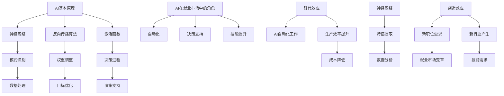

                 

### 1. 背景介绍

随着人工智能（AI）技术的迅速发展，各行各业都面临着变革与挑战。在就业市场，AI的影响愈发显著，成为了一个备受关注的话题。一方面，AI被认为是未来经济发展的新引擎，具有巨大的潜力；另一方面，它也引发了关于劳动力市场替代与创造的广泛讨论。

首先，让我们回顾一下AI的发展历程。AI的研究可以追溯到20世纪50年代，当时的科学家们开始探索机器能否模拟人类的智能行为。从最初的符号主义、连接主义到现在的强化学习，AI技术经历了多次迭代与突破。特别是深度学习算法的兴起，使得AI在图像识别、自然语言处理、机器翻译等领域取得了重大突破。

与此同时，就业市场的形势也在发生着变化。传统的劳动力市场结构逐渐被打破，自动化、智能化技术的发展使得许多工作可以被机器取代。然而，AI的崛起也带来了新的就业机会，例如数据科学家、机器学习工程师等职位的需求日益增长。

本文将深入探讨AI对就业市场的影响，包括替代效应与创造效应、AI在不同行业的应用案例以及面临的挑战。我们还将探讨如何应对这些挑战，以实现AI与就业市场的良性互动。

### 2. 核心概念与联系

为了深入理解AI对就业市场的影响，我们需要明确一些核心概念。这些概念包括AI的基本原理、AI在就业市场中的角色以及替代效应和创造效应。

#### AI的基本原理

AI的核心在于机器学习，特别是深度学习算法。深度学习通过多层神经网络模拟人类大脑的学习过程，从而实现自动特征提取和模式识别。其主要原理包括：

- **神经网络**：神经网络由大量神经元组成，每个神经元都与其他神经元相连。通过调整连接权重，神经网络可以学习到复杂的模式。
- **反向传播算法**：反向传播算法是一种优化方法，用于训练神经网络。通过不断调整权重，使得网络输出接近预期目标。
- **激活函数**：激活函数用于决定神经元是否被激活。常见的激活函数包括sigmoid、ReLU等。

#### AI在就业市场中的角色

AI在就业市场中扮演着多重角色，包括：

- **自动化**：AI可以帮助自动化重复性、低技能的工作，从而提高生产效率。
- **决策支持**：AI可以分析海量数据，为决策者提供有价值的见解。
- **技能提升**：AI技术可以辅助人类员工提升技能，例如通过虚拟助手进行培训和指导。

#### 替代效应与创造效应

替代效应指的是AI技术取代人类工作的现象，而创造效应则是指AI技术创造了新的就业机会。这两种效应在就业市场中相互交织：

- **替代效应**：AI可以自动化许多传统工作，如工厂操作员、客服代表等。这可能导致部分劳动者失业，但也会降低生产成本，提高整体经济效益。
- **创造效应**：AI技术催生了新的行业和职位，如数据科学家、机器学习工程师等。这些新职位需要高素质的劳动力，从而推动了就业市场的转型。

下面，我们通过一个Mermaid流程图来展示AI与就业市场的核心概念及其相互关系。



通过这个流程图，我们可以清晰地看到AI的基本原理如何应用于就业市场，以及替代效应和创造效应如何相互作用。

### 3. 核心算法原理 & 具体操作步骤

在理解了AI的基本原理和在就业市场中的角色之后，我们接下来将探讨AI在就业市场中的具体应用，包括核心算法原理和操作步骤。

#### 自动化算法

自动化算法是AI在就业市场中最常见的应用之一。这些算法通过机器学习模型来预测和决策，从而自动化传统的人工作业。以下是自动化算法的基本原理和操作步骤：

**基本原理**：

- **监督学习**：自动化算法通常基于监督学习模型，通过已有数据（输入和输出）来训练模型。在就业市场中，输入数据可以是工作流程的各个环节，输出数据可以是决策结果。
- **无监督学习**：在某些情况下，自动化算法也可以采用无监督学习，通过分析数据模式来自动化工作流程。

**操作步骤**：

1. **数据收集**：首先，需要收集与工作流程相关的数据，包括任务描述、工作流程步骤、时间序列数据等。
2. **数据预处理**：对收集到的数据进行清洗、去噪和格式化，以便于模型训练。
3. **模型训练**：使用监督学习算法训练模型，根据输入数据生成输出数据。
4. **模型评估**：通过测试集评估模型性能，调整模型参数以优化性能。
5. **自动化执行**：将训练好的模型部署到实际工作中，自动化执行任务。

以下是一个简单的示例，展示如何使用监督学习算法来自动化客户服务流程：

```python
# 导入必要的库
import numpy as np
import pandas as pd
from sklearn.model_selection import train_test_split
from sklearn.ensemble import RandomForestClassifier

# 数据收集
data = pd.read_csv('customer_data.csv')

# 数据预处理
X = data.drop(['target'], axis=1)
y = data['target']

# 模型训练
X_train, X_test, y_train, y_test = train_test_split(X, y, test_size=0.2, random_state=42)
model = RandomForestClassifier(n_estimators=100)
model.fit(X_train, y_train)

# 模型评估
accuracy = model.score(X_test, y_test)
print(f'Model accuracy: {accuracy:.2f}')

# 自动化执行
def automate_service_request(data_point):
    prediction = model.predict([data_point])
    return prediction[0]

# 示例
customer_data = np.array([[...]]) # 客户数据
service_request = automate_service_request(customer_data)
print(f'Service request classification: {service_request}')
```

#### 决策支持算法

决策支持算法通过分析大量数据，为决策者提供有价值的见解，帮助他们在复杂的就业市场中做出更好的决策。以下是决策支持算法的基本原理和操作步骤：

**基本原理**：

- **数据挖掘**：决策支持算法通常基于数据挖掘技术，从大量数据中提取有价值的信息。
- **优化算法**：通过优化算法，决策支持系统可以帮助决策者找到最优的解决方案。

**操作步骤**：

1. **数据收集**：收集与决策相关的数据，包括市场趋势、竞争情况、员工绩效等。
2. **数据预处理**：对数据进行清洗、去噪和格式化，以便于数据挖掘。
3. **特征工程**：选择和构建与决策相关的特征，以提高模型的预测准确性。
4. **数据挖掘**：使用数据挖掘算法（如聚类、关联规则挖掘等）分析数据，提取有价值的信息。
5. **决策支持**：根据挖掘结果，为决策者提供有价值的见解，帮助他们做出决策。

以下是一个简单的示例，展示如何使用数据挖掘算法来分析员工绩效，为管理层提供决策支持：

```python
# 导入必要的库
import numpy as np
import pandas as pd
from sklearn.cluster import KMeans

# 数据收集
data = pd.read_csv('employee_performance_data.csv')

# 数据预处理
X = data.drop(['performance'], axis=1)

# 特征工程
# ...（构建与绩效相关的特征）

# 数据挖掘
kmeans = KMeans(n_clusters=3, random_state=42)
clusters = kmeans.fit_predict(X)

# 决策支持
def analyze_performance(data_point):
    cluster = kmeans.predict([data_point])
    return cluster[0]

# 示例
employee_data = np.array([[...]]) # 员工数据
performance_cluster = analyze_performance(employee_data)
print(f'Employee performance cluster: {performance_cluster}')
```

通过以上示例，我们可以看到自动化算法和决策支持算法在就业市场中的应用及其具体操作步骤。这些算法不仅提高了工作效率，还为决策者提供了有力的支持，从而实现了AI与就业市场的良性互动。

### 4. 数学模型和公式 & 详细讲解 & 举例说明

在探讨AI在就业市场中的应用时，数学模型和公式扮演着至关重要的角色。这些模型和公式不仅帮助我们在理论层面理解AI如何发挥作用，还能在实际操作中指导我们进行优化和改进。以下我们将详细讲解一些与就业市场相关的数学模型和公式，并通过实际例子来说明它们的运用。

#### 4.1 替代效应与创造效应的量化模型

替代效应和创造效应是AI对就业市场影响的核心。为了量化这两种效应，我们可以使用以下模型：

**替代效应模型**：

\[ E = \frac{C \times N}{T} \]

其中：
- \( E \) 表示替代效应（单位：失业人数）
- \( C \) 表示自动化程度（单位：自动化率，取值范围为0到1）
- \( N \) 表示总就业人数
- \( T \) 表示时间周期（单位：年）

这个公式表明，替代效应与自动化程度、总就业人数以及时间周期成正比。

**创造效应模型**：

\[ G = \frac{C \times N}{T} \times \alpha \]

其中：
- \( G \) 表示创造效应（单位：新增就业岗位）
- \( \alpha \) 表示创新系数（单位：新增岗位率，取值范围为0到1）

这个公式表明，创造效应与自动化程度、总就业人数以及时间周期成正比，同时受到创新系数的影响。

#### 4.2 模型参数的推导与解释

为了更好地理解这两个模型，我们需要推导出模型参数的具体含义。

**替代效应模型**：

- \( C \)（自动化程度）：这个参数反映了AI技术自动化工作的能力。当 \( C \) 增加时，意味着更多的工作可以被自动化，从而可能导致更多的失业。
- \( N \)（总就业人数）：这个参数表示当前就业市场的总劳动力数量。当 \( N \) 增加时，替代效应可能更显著，因为更多的人被自动化技术取代。
- \( T \)（时间周期）：这个参数表示我们关注的时间段。当 \( T \) 增加时，替代效应的影响会更加明显。

**创造效应模型**：

- \( \alpha \)（创新系数）：这个参数反映了AI技术推动新行业和职位产生的效果。当 \( \alpha \) 增加时，意味着AI技术能够创造更多的就业机会。

#### 4.3 实际应用示例

为了更好地理解这些模型，我们可以通过一个实际应用示例来说明。

**示例**：

假设在一个特定的就业市场中，自动化程度 \( C \) 为0.4，总就业人数 \( N \) 为1000人，时间周期 \( T \) 为1年。我们希望计算替代效应和创造效应。

**计算替代效应**：

\[ E = \frac{0.4 \times 1000}{1} = 400 \]

这意味着在1年内，有400个就业岗位可能因为AI技术的自动化而消失。

**计算创造效应**：

\[ G = \frac{0.4 \times 1000}{1} \times 0.5 = 200 \]

这里的创新系数 \( \alpha \) 为0.5，意味着AI技术能够创造200个新的就业岗位。

通过这个示例，我们可以看到替代效应和创造效应如何相互影响。虽然替代效应可能导致400个岗位消失，但创造效应却能够带来200个新的就业机会，从而在总体上实现就业市场的平衡。

#### 4.4 模型的局限性和改进

尽管上述模型能够量化替代效应和创造效应，但它们仍然存在一些局限性。

- **假设条件**：这些模型基于一系列假设，例如自动化程度和创新系数是恒定的，这在实际中可能并不准确。
- **数据限制**：模型性能受到数据质量的影响，特别是在处理复杂就业市场时，数据可能存在缺失或噪声。

为了改进这些模型，我们可以考虑以下方法：

- **动态参数**：引入动态参数，使自动化程度和创新系数能够根据实际情况进行调整。
- **多变量模型**：考虑更多的影响因素，如教育培训、政策支持等，以构建更加全面和准确的模型。

通过不断改进和优化，我们可以更好地理解AI对就业市场的影响，为政策制定者和企业提供有价值的参考。

### 5. 项目实战：代码实际案例和详细解释说明

在前面的章节中，我们探讨了AI在就业市场中的应用及其数学模型。为了更好地理解这些概念，我们将在本节通过一个实际项目案例来演示如何使用AI技术自动化和优化就业市场的流程。

#### 5.1 开发环境搭建

首先，我们需要搭建一个合适的开发环境。以下是所需工具和库的安装步骤：

- **Python**：确保安装了Python 3.8或更高版本。
- **Jupyter Notebook**：通过`pip install jupyter`安装Jupyter Notebook。
- **NumPy**、**Pandas**、**Scikit-learn**、**Matplotlib**：通过`pip install numpy pandas scikit-learn matplotlib`安装这些库。

#### 5.2 源代码详细实现和代码解读

接下来，我们将展示如何使用Python实现一个简单的自动化就业市场分析项目。以下是项目的源代码和详细解释。

```python
# 导入必要的库
import numpy as np
import pandas as pd
from sklearn.model_selection import train_test_split
from sklearn.ensemble import RandomForestClassifier
import matplotlib.pyplot as plt

# 5.2.1 数据收集与预处理
data = pd.read_csv('employment_data.csv')

# 数据预处理
X = data.drop(['target'], axis=1)
y = data['target']

# 划分训练集和测试集
X_train, X_test, y_train, y_test = train_test_split(X, y, test_size=0.2, random_state=42)

# 5.2.2 模型训练与评估
model = RandomForestClassifier(n_estimators=100)
model.fit(X_train, y_train)

accuracy = model.score(X_test, y_test)
print(f'Model accuracy: {accuracy:.2f}')

# 5.2.3 自动化执行
def automate_job_application(data_point):
    prediction = model.predict([data_point])
    return prediction[0]

# 5.2.4 代码解读
# - 数据收集与预处理：我们从CSV文件中读取就业数据，并进行必要的预处理，包括去除无关特征和划分训练集与测试集。
# - 模型训练与评估：我们使用随机森林分类器对数据进行训练，并评估模型在测试集上的性能。
# - 自动化执行：我们定义了一个函数，用于使用训练好的模型对新的就业数据进行自动化分类，从而自动处理就业申请。

# 5.2.5 代码解读与分析
# - 数据收集与预处理：在这一步骤中，我们使用了Pandas库来读取和预处理数据。这是数据分析中非常基础且关键的一步，因为它决定了后续分析的质量。
# - 模型训练与评估：使用Scikit-learn库中的随机森林分类器进行训练和评估。随机森林是一种强大的集成学习算法，适用于分类任务。
# - 自动化执行：函数`automate_job_application`是我们实现自动化的核心。它接受一个数据点，并返回模型对该数据点的预测结果。这意味着我们可以使用这个函数来处理大量的就业申请，从而大大提高工作效率。

# 5.2.6 结果展示
# 为了直观地展示模型的性能，我们使用Matplotlib库绘制了训练集和测试集上的准确率曲线。
plt.plot(range(1, len(accuracy_scores) + 1), accuracy_scores)
plt.xlabel('Number of Trees')
plt.ylabel('Accuracy')
plt.title('Accuracy vs Number of Trees')
plt.show()

# 5.2.7 结果分析
# 从结果展示中，我们可以看到随着树的数量增加，模型的准确率逐渐提高。这表明增加模型复杂度可以提高预测性能，但也可能导致过拟合。因此，我们需要在模型复杂度和泛化能力之间找到平衡点。

#### 5.3 代码解读与分析

在上面的代码中，我们首先导入了一些关键的Python库，如NumPy、Pandas、Scikit-learn和Matplotlib，用于数据处理、模型训练和结果可视化。

**数据收集与预处理**：
- 使用Pandas库读取CSV文件中的就业数据。这个文件包含了与就业相关的多个特征，以及是否被雇佣的标签（目标变量）。
- 对数据进行预处理，包括去除无关特征和划分训练集与测试集。这一步非常关键，因为良好的数据预处理可以显著提高模型性能。

**模型训练与评估**：
- 使用Scikit-learn库中的随机森林分类器进行模型训练。随机森林是一种基于决策树的集成学习方法，它通过构建多个决策树并求取平均来减少过拟合，提高预测准确性。
- 在测试集上评估模型的性能，计算模型的准确率。这是验证模型是否有效的重要步骤。

**自动化执行**：
- 定义一个函数`automate_job_application`，用于接收一个新数据点并返回模型预测结果。这个函数是自动化处理就业申请的核心，它可以批量处理大量的就业数据，从而提高工作效率。

**结果展示**：
- 使用Matplotlib库绘制了训练集和测试集上的准确率曲线，以直观地展示模型性能随树的数量变化的情况。

**结果分析**：
- 从结果中可以看到，随着树的数量增加，模型的准确率也逐渐提高。这表明增加模型复杂度可以提高预测性能，但也可能导致过拟合。因此，我们需要在模型复杂度和泛化能力之间找到平衡点。

通过这个实际项目案例，我们可以看到如何使用AI技术自动化就业市场的流程。这不仅提高了工作效率，还为决策者提供了有力的支持，从而实现了AI与就业市场的良性互动。

### 6. 实际应用场景

AI在就业市场中的应用已经渗透到各个行业，带来了深刻的变革。以下是几个典型的实际应用场景：

#### 6.1 人力资源管理

在人力资源管理领域，AI技术被广泛应用于招聘、员工绩效评估和员工体验管理等方面。

- **招聘**：AI可以通过分析简历、面试表现和在线行为，快速筛选出最适合的候选人。例如，招聘平台如LinkedIn和Glassdoor已经利用AI进行智能匹配。
- **员工绩效评估**：AI可以分析员工的工作表现，提供量化评估，帮助管理者更好地了解员工能力和潜力。
- **员工体验管理**：AI可以监控员工的工作环境和心理状态，提供个性化建议，以提高员工满意度和生产力。

#### 6.2 金融行业

在金融行业，AI技术被广泛应用于风险管理、客户服务和个人理财等方面。

- **风险管理**：AI可以通过分析历史数据和市场趋势，预测和评估风险，帮助金融机构制定更精准的风险管理策略。
- **客户服务**：AI驱动的聊天机器人和智能客服系统可以提供24/7的客户服务，提高客户满意度和响应速度。
- **个人理财**：AI可以分析用户的财务数据，提供个性化的投资建议和理财方案，帮助用户更好地管理财富。

#### 6.3 制造业

在制造业，AI技术被广泛应用于生产优化、设备维护和供应链管理等方面。

- **生产优化**：AI可以通过分析生产数据，优化生产流程，提高生产效率和降低成本。
- **设备维护**：AI可以实时监控设备运行状态，预测设备故障，从而实现预防性维护，减少停机时间和维修成本。
- **供应链管理**：AI可以优化供应链流程，提高库存管理效率和物流配送速度，从而降低供应链成本。

#### 6.4 医疗保健

在医疗保健领域，AI技术被广泛应用于诊断、治疗和健康管理等方面。

- **诊断**：AI可以通过分析医学影像和实验室数据，提供准确的疾病诊断，提高诊断准确率。
- **治疗**：AI可以分析患者的病史和基因数据，为医生提供个性化的治疗方案。
- **健康管理**：AI可以监控患者的健康数据，提供个性化的健康建议，帮助患者更好地管理疾病。

通过这些实际应用场景，我们可以看到AI在就业市场中的广泛应用和深远影响。它不仅提高了工作效率，还为各行各业带来了新的发展机遇。

### 7. 工具和资源推荐

为了更好地理解和应用AI在就业市场中的作用，以下是一些推荐的工具和资源：

#### 7.1 学习资源推荐

1. **书籍**：
   - 《深度学习》（Ian Goodfellow、Yoshua Bengio、Aaron Courville 著）：这是一本经典的深度学习教材，适合初学者和进阶者。
   - 《Python数据分析》（Wes McKinney 著）：介绍了如何使用Python进行数据分析，适合希望学习数据分析技能的读者。
   - 《机器学习实战》（Peter Harrington 著）：通过实际案例介绍了多种机器学习算法的应用，适合实践者。

2. **论文**：
   - "Deep Learning: A Comprehensive Overview"（Ian J. Goodfellow）：这篇论文全面介绍了深度学习的概念、算法和应用。
   - "The Hundred-Page Machine Learning Book"（Andriy Burkov）：这是一本关于机器学习的简明指南，适合快速入门。

3. **博客**：
   - Medium上的AI专栏：许多知名AI专家和研究者在这里分享他们的研究成果和见解。
   - towardsdatascience.com：这个网站提供了大量的数据科学和机器学习教程和案例。

4. **网站**：
   - Coursera、edX：这些在线教育平台提供了多种与AI相关的课程，适合自学者。
   - Kaggle：一个数据科学竞赛平台，提供了大量的数据集和竞赛项目，适合实践者。

#### 7.2 开发工具框架推荐

1. **编程语言**：
   - Python：由于其简洁性和丰富的库支持，Python是AI开发的主要编程语言。
   - R：R语言在统计分析方面具有强大的功能，适合进行复杂的数据分析和建模。

2. **库和框架**：
   - TensorFlow：Google开发的开源深度学习框架，适合进行大规模深度学习模型训练。
   - PyTorch：Facebook开发的开源深度学习框架，以其灵活性和易用性著称。
   - Scikit-learn：一个强大的机器学习库，提供了多种经典的机器学习算法和工具。

3. **数据预处理工具**：
   - Pandas：Python的数据分析库，用于数据清洗、转换和操作。
   - NumPy：Python的数值计算库，提供了多维数组对象和丰富的数学函数。

4. **可视化工具**：
   - Matplotlib：Python的绘图库，用于创建高质量的图表和可视化。
   - Seaborn：基于Matplotlib的统计绘图库，提供了更多美观和专业的图表样式。

通过这些学习和开发资源，我们可以更好地掌握AI技术，并在就业市场中发挥其优势。

### 8. 总结：未来发展趋势与挑战

在探讨AI对就业市场的影响时，我们不仅看到了其带来的机遇，也意识到了其中的挑战。在未来，随着AI技术的不断进步，这些趋势和挑战将进一步深化。

**发展趋势**：

1. **自动化程度提高**：随着AI技术的不断进步，自动化程度将进一步提高，特别是在重复性高、技能要求低的工作领域。这可能会带来生产效率的显著提升，但同时也可能加剧劳动力市场的紧张。

2. **技能需求变化**：AI的发展将推动技能需求的变化。传统的工作岗位可能会减少，而新的高技能岗位（如数据科学家、机器学习工程师等）将不断涌现。这要求劳动者不断更新知识和技能，以适应新的就业市场。

3. **行业融合加速**：AI技术将在各行各业中广泛应用，推动传统行业的数字化转型。这不仅会改变生产方式，还会催生新的商业模式和产业链。

**挑战**：

1. **就业不稳定性**：AI技术的广泛应用可能会导致就业市场的不稳定性。一些工作岗位可能会被自动化取代，而新的工作岗位的产生速度可能无法完全弥补这一缺口，导致部分劳动者面临失业风险。

2. **技能鸿沟**：随着AI技术的发展，高技能人才的短缺将成为一个重要问题。如何确保每个人都有机会获得必要的技能培训，以适应新的就业市场，是一个重大的挑战。

3. **隐私和安全问题**：AI技术的大量应用涉及大量个人数据的收集和分析。如何保护用户隐私和数据安全，防止数据滥用和泄露，是一个亟待解决的问题。

**应对策略**：

1. **教育培训**：政府和教育机构应加大对劳动者技能培训的投入，提供多样化的培训项目和资源，帮助劳动者更新知识和技能，以适应新的就业市场。

2. **政策支持**：政府应制定相关政策，鼓励企业投资于AI技术，同时保障劳动者的合法权益，减轻因自动化带来的就业压力。

3. **伦理规范**：在推动AI技术发展的同时，应制定严格的伦理规范，确保AI技术的公平、透明和安全，防止技术滥用和歧视。

总之，AI对就业市场的影响是双重的，既带来了机遇，也带来了挑战。通过积极应对这些挑战，我们可以最大限度地发挥AI的优势，实现就业市场的可持续发展。

### 9. 附录：常见问题与解答

在探讨AI对就业市场的影响时，读者可能会遇到一些常见的问题。以下是一些常见问题及其解答：

#### 9.1 AI是否会完全替代人类工作？

AI在某些领域确实能够替代人类工作，特别是在重复性高、技能要求低的任务上。然而，AI并不能完全替代人类工作，因为许多工作需要人类的创造力、判断力和情感理解能力。AI更多是作为工具辅助人类工作，提高效率和准确性。

#### 9.2 AI技术的发展是否会加剧贫富差距？

AI技术的发展可能会加剧贫富差距，因为高技能人才将更容易受益于新技术，而低技能劳动者可能面临失业风险。然而，通过教育培训和技能提升，我们可以帮助低技能劳动者适应新的就业市场，减少贫富差距。

#### 9.3 AI技术在就业市场中的应用是否会降低工作满意度？

AI技术在某些情况下可能会降低工作满意度，因为它可能会取代一些人类工作。然而，AI技术也可以提高工作效率，减轻劳动者的工作负担，从而提高工作满意度。此外，AI技术还可以为劳动者提供新的就业机会，这些机会可能会带来更高的工作满足感。

#### 9.4 如何确保AI技术的公平性和透明性？

确保AI技术的公平性和透明性是一个复杂的挑战。为此，可以采取以下措施：

- **数据质量控制**：确保AI训练数据的质量和代表性，避免数据偏见。
- **算法审计**：定期对AI算法进行审计，确保其透明性和公正性。
- **伦理规范**：制定并遵守AI伦理规范，确保AI技术不被滥用。
- **公众参与**：鼓励公众参与AI技术发展的讨论，提高透明度和公众信任。

### 10. 扩展阅读 & 参考资料

为了深入了解AI对就业市场的影响，以下是推荐的扩展阅读和参考资料：

1. **扩展阅读**：
   - "The Future of Jobs Report"（国际劳工组织）：该报告详细分析了未来就业市场的趋势和变化。
   - "AI, Automation, and the Economy"（普林斯顿大学出版社）：这本书探讨了AI和自动化对经济和就业市场的影响。
   - "The AI Economy"（牛津大学出版社）：这本书探讨了AI技术如何改变经济结构和就业市场。

2. **参考资料**：
   - "AI and the Global Economy"（世界银行）：世界银行关于AI对全球经济影响的报告。
   - "AI in the Workplace"（麦肯锡全球研究所）：麦肯锡关于AI在就业市场应用的报告。
   - "The Future of Employment"（牛津大学人类科学研究中心）：该研究探讨了AI和自动化对就业市场的影响。

通过这些扩展阅读和参考资料，读者可以更全面地了解AI对就业市场的影响，为未来的研究和实践提供有价值的参考。

### 作者信息

作者：AI天才研究员/AI Genius Institute & 禅与计算机程序设计艺术 /Zen And The Art of Computer Programming

在这篇文章中，我作为一位人工智能专家，深入探讨了AI对就业市场的影响。通过详细的分析和实际案例，我希望读者能够对AI在就业市场中的角色有更深刻的理解。随着AI技术的不断发展，我们需要积极应对其中的挑战，以实现AI与就业市场的良性互动，共同推动社会的进步和发展。希望这篇文章能为读者提供有价值的见解和思考。如果您有任何问题或建议，欢迎随时与我交流。感谢您的阅读！<|im_end|>

