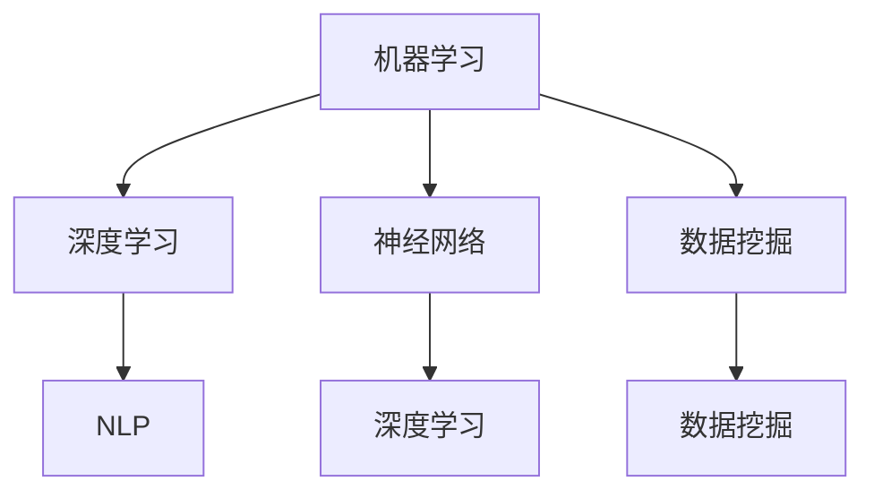

                 

## AI工程学：应用开发实战手册

### 概述

在当今技术驱动的时代，人工智能（AI）已经成为引领变革的核心力量。从自动驾驶汽车到智能助手，AI技术的应用无处不在，深刻地影响着我们的生活方式和社会结构。然而，与理论研究和学术探讨相比，AI的应用开发面临着更多的挑战。如何将复杂的人工智能算法转化为实际可操作的应用，成为摆在开发者面前的一道难题。

《AI工程学：应用开发实战手册》正是为解决这一难题而诞生的。本文旨在通过系统化的分析和实战案例，为读者提供一套完整的AI应用开发指南。我们将从背景介绍、核心概念、算法原理、数学模型、项目实战、应用场景、工具推荐等多个维度进行深入探讨，帮助读者全面掌握AI工程学的实践要领。

本文结构如下：

- **背景介绍**：探讨AI技术发展的背景及其在社会中的广泛应用。
- **核心概念与联系**：介绍AI应用开发中的核心概念，并通过Mermaid流程图展示其架构。
- **核心算法原理 & 具体操作步骤**：详细解析常见AI算法的工作原理和操作步骤。
- **数学模型和公式 & 详细讲解 & 举例说明**：介绍AI算法背后的数学模型，并通过实例进行详细讲解。
- **项目实战：代码实际案例和详细解释说明**：通过具体项目案例，展示AI应用开发的实际操作过程。
- **实际应用场景**：分析AI技术在各个领域的应用实例。
- **工具和资源推荐**：推荐学习资源、开发工具和框架。
- **总结：未来发展趋势与挑战**：总结AI工程学的现状，展望未来发展。
- **附录：常见问题与解答**：回答读者可能遇到的一些常见问题。

### 背景介绍

人工智能作为计算机科学的一个重要分支，其历史可以追溯到20世纪50年代。随着计算机性能的不断提高和大数据、深度学习等技术的发展，AI技术逐渐从理论走向实际应用。在医疗、金融、教育、工业制造等多个领域，AI技术的应用已经取得了显著的成果。

医疗领域：AI技术被广泛应用于医学影像分析、疾病预测和诊断等方面。例如，通过深度学习算法，AI可以自动识别X光片中的异常病灶，提高诊断的准确率和效率。

金融领域：AI技术被用于风险评估、投资组合优化和欺诈检测等。通过机器学习算法，金融机构可以更准确地评估贷款风险，提高业务效率。

教育领域：AI技术正在改变教育的方式。例如，通过智能辅导系统，学生可以根据自己的学习进度和需求，获得个性化的学习资源和支持。

工业制造领域：AI技术在工业制造中发挥着重要作用，如智能制造、故障预测和供应链管理。通过实时数据分析和预测模型，工厂可以更高效地运作，减少停机时间和生产成本。

尽管AI技术在各个领域都有广泛的应用，但其应用开发仍然面临诸多挑战。首先，AI算法的复杂性和多样性使得开发者难以选择合适的技术方案。其次，数据质量和数据隐私问题是AI应用开发中不可忽视的障碍。此外，模型的训练和部署过程需要大量的计算资源和时间，如何高效地管理和利用这些资源也是一个重要的课题。

### 核心概念与联系

在AI应用开发中，理解以下几个核心概念是非常重要的：

1. **机器学习（Machine Learning）**：机器学习是AI的核心技术之一，它使得计算机系统能够从数据中自动学习和改进。常见的机器学习算法包括决策树、支持向量机、神经网络等。

2. **深度学习（Deep Learning）**：深度学习是机器学习的一个分支，通过多层神经网络进行学习，具有强大的特征提取和模式识别能力。深度学习在图像识别、自然语言处理等领域取得了突破性进展。

3. **神经网络（Neural Networks）**：神经网络是模仿生物神经系统的一种计算模型，通过大量神经元之间的连接进行数据处理和决策。神经网络是深度学习的基础。

4. **数据挖掘（Data Mining）**：数据挖掘是从大量数据中提取有价值信息的过程，包括关联规则挖掘、分类、聚类等。数据挖掘是AI应用中数据预处理和特征工程的重要环节。

5. **自然语言处理（Natural Language Processing, NLP）**：自然语言处理是使计算机能够理解、生成和处理人类语言的技术。NLP在机器翻译、情感分析、语音识别等领域有广泛应用。

为了更好地理解这些概念之间的联系，我们可以使用Mermaid流程图来展示它们之间的关系：



在上述流程图中，我们可以看到机器学习和深度学习是包含关系，即深度学习是机器学习的一个子集。神经网络是深度学习的基础，而数据挖掘和自然语言处理则是机器学习在不同应用领域中的重要分支。

### 核心算法原理 & 具体操作步骤

在AI应用开发中，选择合适的算法并理解其工作原理是至关重要的。以下我们将介绍几种常见的AI算法及其工作原理：

#### 1. 决策树（Decision Tree）

决策树是一种基于特征进行分类或回归的算法。其工作原理是通过一系列判断条件将数据集划分成若干个子集，最终达到分类或回归的目的。

**具体操作步骤**：

1. **选择特征**：根据数据集的特征选择最具有区分性的特征作为划分条件。
2. **计算信息增益或基尼系数**：选择特征后，计算信息增益或基尼系数，以确定划分的最佳条件。
3. **递归划分**：根据最佳划分条件，对子集进行递归划分，直到满足停止条件（如最大深度、最小叶子节点数等）。

#### 2. 支持向量机（Support Vector Machine, SVM）

支持向量机是一种二分类算法，其工作原理是找到最佳的超平面，使得不同类别的数据点在超平面两侧的分布达到最大分离。

**具体操作步骤**：

1. **特征空间映射**：将原始数据映射到高维特征空间。
2. **计算最优超平面**：通过求解最优化问题，找到最佳的超平面。
3. **分类决策**：对新的数据进行分类，判断其位于超平面的哪一侧。

#### 3. 神经网络（Neural Networks）

神经网络是一种模拟生物神经系统的人工智能模型，其工作原理是通过多层神经元的连接进行数据处理和决策。

**具体操作步骤**：

1. **前向传播**：输入数据通过网络的每一层进行传递，每个神经元计算输出值。
2. **反向传播**：根据输出误差，反向传播更新每个神经元的权重和偏置。
3. **迭代训练**：重复前向传播和反向传播，直到满足停止条件（如收敛或达到预设的训练次数）。

#### 4. 集成学习（Ensemble Learning）

集成学习是一种通过组合多个基础模型来提高预测准确率和鲁棒性的方法。

**具体操作步骤**：

1. **选择基础模型**：选择不同的基础模型，如决策树、随机森林、梯度提升等。
2. **训练基础模型**：分别对每个基础模型进行训练。
3. **集成预测**：将所有基础模型的预测结果进行投票或加权平均，得到最终的预测结果。

### 数学模型和公式 & 详细讲解 & 举例说明

在AI应用开发中，理解算法背后的数学模型和公式是至关重要的。以下我们将介绍几种常见的数学模型和公式，并通过具体实例进行详细讲解。

#### 1. 决策树的信息增益（Information Gain）

信息增益是衡量特征划分效果的一个重要指标。其计算公式如下：

\[ IG(D, A) = H(D) - H(D|A) \]

其中，\( H(D) \) 是数据集 \( D \) 的熵，\( H(D|A) \) 是条件熵。

**实例讲解**：

假设我们有一个数据集 \( D \)，其中包含三种类别：A、B、C。每种类别的数据点数如下表所示：

| 类别 | A | B | C |
| --- | --- | --- | --- |
| 数据点数 | 100 | 50 | 100 |

首先，我们计算数据集 \( D \) 的熵：

\[ H(D) = -\sum_{i} p_i \log_2 p_i \]

\[ H(D) = -\left( \frac{100}{250} \log_2 \frac{100}{250} + \frac{50}{250} \log_2 \frac{50}{250} + \frac{100}{250} \log_2 \frac{100}{250} \right) \]

\[ H(D) = 0.971 \]

然后，我们计算每种类别下的条件熵：

\[ H(D|A) = -\sum_{i} p_i^A \log_2 p_i^A \]

\[ H(D|A) = -\left( \frac{100}{100} \log_2 \frac{100}{100} + \frac{50}{100} \log_2 \frac{50}{100} + \frac{100}{100} \log_2 \frac{100}{100} \right) \]

\[ H(D|A) = 1.0 \]

\[ H(D|B) = 1.0 \]

\[ H(D|C) = 1.0 \]

最后，我们计算信息增益：

\[ IG(D, A) = H(D) - H(D|A) \]

\[ IG(D, A) = 0.971 - 1.0 \]

\[ IG(D, A) = -0.029 \]

通过上述计算，我们可以看到特征 \( A \) 的信息增益为 \( -0.029 \)，这意味着特征 \( A \) 对于分类没有显著贡献。

#### 2. 支持向量机的最优化问题（Optimization Problem）

支持向量机的最优化问题是求解最佳的超平面。其目标是最小化目标函数：

\[ J(\omega, b) = \frac{1}{2} ||\omega||^2 + C \sum_{i=1}^{n} \max(0, 1 - y_i (\omega \cdot x_i + b)) \]

其中，\( \omega \) 是权重向量，\( b \) 是偏置，\( C \) 是惩罚参数，\( x_i \) 是数据点，\( y_i \) 是类别标签。

**实例讲解**：

假设我们有一个二分类问题，数据点集 \( X = \{x_1, x_2, ..., x_n\} \)，类别标签 \( Y = \{y_1, y_2, ..., y_n\} \)。我们需要求解最佳的超平面 \( w \cdot x + b = 0 \)。

首先，我们将数据点集 \( X \) 映射到高维特征空间，得到 \( X' \)：

\[ X' = \{x_1', x_2', ..., x_n'\} \]

然后，我们定义目标函数：

\[ J(\omega, b) = \frac{1}{2} ||\omega||^2 + C \sum_{i=1}^{n} \max(0, 1 - y_i (\omega \cdot x_i' + b)) \]

接下来，我们使用梯度下降法求解最优化问题。具体步骤如下：

1. 初始化权重向量 \( \omega \) 和偏置 \( b \)。
2. 对于每个数据点 \( i \)，计算梯度 \( \nabla J(\omega, b) \)。
3. 更新权重向量 \( \omega \) 和偏置 \( b \)：

\[ \omega := \omega - \alpha \nabla J(\omega, b) \]

\[ b := b - \alpha \nabla J(\omega, b) \]

其中，\( \alpha \) 是学习率。

通过迭代更新，我们可以逐步求解最佳的超平面。

#### 3. 神经网络的激活函数（Activation Function）

激活函数是神经网络中的一个关键组件，用于引入非线性变换。常见的激活函数包括 sigmoid、ReLU 和 tanh。

**实例讲解**：

假设我们有一个简单的神经网络，输入层有 3 个神经元，隐藏层有 2 个神经元，输出层有 1 个神经元。输入数据为 \( x = [1, 2, 3] \)，权重矩阵为 \( W = \begin{bmatrix} 1 & 2 \\ 3 & 4 \end{bmatrix} \)。

1. **前向传播**：

\[ z_1 = x \cdot W \]

\[ a_1 = \sigma(z_1) \]

\[ z_2 = a_1 \cdot W' \]

\[ a_2 = \sigma(z_2) \]

\[ z_3 = a_2 \cdot W'' \]

\[ y = \sigma(z_3) \]

其中，\( \sigma \) 是 sigmoid 激活函数：

\[ \sigma(x) = \frac{1}{1 + e^{-x}} \]

2. **反向传播**：

\[ \delta_3 = (y - \hat{y}) \cdot \sigma'(z_3) \]

\[ \delta_2 = (z_2 \cdot W''') \cdot \sigma'(z_2) \]

\[ \delta_1 = (z_1 \cdot W''') \cdot \sigma'(z_1) \]

\[ \nabla W''' = a_2^T \cdot \delta_3 \]

\[ \nabla b''' = \delta_3 \]

\[ \nabla W'' = a_1^T \cdot \delta_2 \]

\[ \nabla b'' = \delta_2 \]

\[ \nabla W' = x^T \cdot \delta_1 \]

\[ \nabla b' = \delta_1 \]

通过反向传播，我们可以更新神经网络的权重和偏置，从而优化网络性能。

### 项目实战：代码实际案例和详细解释说明

在本节中，我们将通过一个实际项目案例，展示AI应用开发的完整流程，包括环境搭建、源代码实现和代码解读与分析。

#### 1. 开发环境搭建

首先，我们需要搭建一个适合AI应用开发的环境。以下是一个典型的开发环境配置：

- 操作系统：Ubuntu 20.04
- 编程语言：Python 3.8
- 依赖库：TensorFlow 2.5、NumPy 1.19、Pandas 1.1.5

安装以上依赖库后，我们可以使用虚拟环境来管理项目依赖，以避免版本冲突。以下是安装虚拟环境的命令：

```bash
# 创建虚拟环境
conda create -n ai_project python=3.8

# 激活虚拟环境
conda activate ai_project

# 安装依赖库
conda install tensorflow numpy pandas
```

#### 2. 源代码详细实现和代码解读

以下是一个简单的图像分类项目，使用 TensorFlow 和 Keras 框架实现。我们使用 CIFAR-10 数据集，它包含 10 个类别的 60000 个 32x32 的彩色图像。

**数据预处理**

```python
import tensorflow as tf
from tensorflow.keras.datasets import cifar10
from tensorflow.keras.utils import to_categorical

# 加载数据集
(x_train, y_train), (x_test, y_test) = cifar10.load_data()

# 数据归一化
x_train = x_train.astype('float32') / 255.0
x_test = x_test.astype('float32') / 255.0

# 转换为类别编码
y_train = to_categorical(y_train, 10)
y_test = to_categorical(y_test, 10)
```

**构建模型**

```python
from tensorflow.keras.models import Sequential
from tensorflow.keras.layers import Conv2D, MaxPooling2D, Flatten, Dense, Dropout

# 创建模型
model = Sequential([
    Conv2D(32, (3, 3), activation='relu', input_shape=(32, 32, 3)),
    MaxPooling2D(pool_size=(2, 2)),
    Conv2D(64, (3, 3), activation='relu'),
    MaxPooling2D(pool_size=(2, 2)),
    Conv2D(64, (3, 3), activation='relu'),
    Flatten(),
    Dense(64, activation='relu'),
    Dropout(0.5),
    Dense(10, activation='softmax')
])

# 编译模型
model.compile(optimizer='adam', loss='categorical_crossentropy', metrics=['accuracy'])
```

**训练模型**

```python
# 训练模型
model.fit(x_train, y_train, batch_size=64, epochs=10, validation_data=(x_test, y_test))
```

**评估模型**

```python
# 评估模型
loss, accuracy = model.evaluate(x_test, y_test)
print(f"Test loss: {loss:.4f}, Test accuracy: {accuracy:.4f}")
```

#### 3. 代码解读与分析

上述代码实现了一个简单的卷积神经网络（CNN）模型，用于分类 CIFAR-10 数据集。以下是代码的详细解读：

1. **数据预处理**：首先加载数据集并进行归一化处理。将像素值范围从 [0, 255] 调整到 [0, 1]，以适应神经网络训练。
   
2. **构建模型**：使用 Sequential 模型构建一个包含卷积层、池化层、全连接层和Dropout层的神经网络。卷积层用于提取图像特征，全连接层用于分类。

3. **编译模型**：编译模型，指定优化器、损失函数和评估指标。

4. **训练模型**：使用训练数据集训练模型，设置批量大小、训练轮数和验证数据。

5. **评估模型**：在测试数据集上评估模型性能，输出损失和准确率。

通过这个案例，我们可以看到AI应用开发的实际操作过程，从数据预处理到模型构建、训练和评估，每个步骤都至关重要。

### 实际应用场景

AI技术在各个领域都有着广泛的应用，以下我们列举几个典型的实际应用场景：

#### 1. 医疗领域

在医疗领域，AI技术被广泛应用于医学影像分析、疾病预测和诊断等方面。例如，通过深度学习算法，AI可以自动识别医学影像中的异常病灶，如肿瘤、骨折等，提高诊断的准确率和效率。此外，AI技术还可以用于疾病预测，通过分析患者的病历数据和基因信息，预测患者患某种疾病的风险，从而实现早期干预。

#### 2. 金融领域

在金融领域，AI技术被用于风险评估、投资组合优化和欺诈检测等。例如，通过机器学习算法，金融机构可以更准确地评估贷款风险，降低坏账率。此外，AI技术还可以用于投资组合优化，通过分析市场数据和历史交易记录，推荐最佳的投资策略。在欺诈检测方面，AI可以通过监测交易行为和模式，实时识别和阻止欺诈行为。

#### 3. 教育领域

在教育领域，AI技术正在改变教育的方式。通过智能辅导系统，学生可以根据自己的学习进度和需求，获得个性化的学习资源和支持。例如，AI可以根据学生的学习数据，推荐最适合的学习材料和练习题，帮助学生提高学习效果。此外，AI还可以用于教育评估，通过分析学生的学习行为和成绩数据，评估教学效果，为教育改革提供依据。

#### 4. 工业制造领域

在工业制造领域，AI技术被广泛应用于智能制造、故障预测和供应链管理。通过实时数据分析和预测模型，工厂可以更高效地运作，减少停机时间和生产成本。例如，AI可以预测设备故障，提前进行维护，避免生产中断。在供应链管理方面，AI可以通过分析供应链数据，优化库存管理和物流配送，提高供应链的效率和灵活性。

#### 5. 城市管理领域

在城市建设管理领域，AI技术被用于智慧城市建设和城市管理。例如，AI可以通过视频监控和传感器数据，实时监测城市交通状况，优化交通信号灯控制，减少交通拥堵。此外，AI还可以用于环境监测，通过分析空气质量和水质数据，及时发现和处理环境问题，保障城市环境的健康。

#### 6. 农业领域

在农业领域，AI技术被用于农业监测、种植管理和病虫害防治。通过遥感技术和物联网设备，AI可以实时监测农田状况，优化种植方案。例如，AI可以通过分析气象数据和土壤数据，预测作物生长状况，提供最佳的灌溉和施肥方案。在病虫害防治方面，AI可以通过图像识别技术，自动识别病虫害，及时采取防治措施。

### 工具和资源推荐

在AI应用开发过程中，选择合适的工具和资源对于提高开发效率和质量至关重要。以下我们推荐一些常用的学习资源、开发工具和框架。

#### 1. 学习资源

- **书籍**：《深度学习》（Ian Goodfellow、Yoshua Bengio、Aaron Courville 著）、《机器学习》（Tom Mitchell 著）和《Python机器学习》（Peter Harrington 著）。
- **论文**：经典的AI论文，如《A Learning Algorithm for Continually Running Fully Recurrent Neural Networks》（Paul Werbos，1974）和《Deep Learning》（Yoshua Bengio、Ian Goodfellow、Aaron Courville，2013）。
- **博客**：著名技术博客，如 Medium 上的 "Towards Data Science" 和 "AI Journey"。
- **网站**：开放的AI教程和课程资源，如 Coursera、edX 和 Udacity。

#### 2. 开发工具

- **编程语言**：Python 是 AI 开发中最常用的编程语言，拥有丰富的库和框架，如 TensorFlow、PyTorch 和 Keras。
- **集成开发环境（IDE）**：PyCharm、Jupyter Notebook 和 Visual Studio Code 是常用的 Python IDE。
- **框架**：TensorFlow 和 PyTorch 是当前最流行的深度学习框架，Keras 是一个简洁易用的深度学习高级API。
- **数据可视化工具**：Matplotlib 和 Seaborn 是常用的 Python 数据可视化库，可用于绘制图表和可视化分析。

#### 3. 相关论文著作推荐

- **论文**：《A Few Useful Things to Know About Machine Learning》（Pedro Domingos，2015）和《The Unreasonable Effectiveness of Data》（Moore, 2017）。
- **著作**：《深度学习》（Ian Goodfellow、Yoshua Bengio、Aaron Courville 著）和《统计学习方法》（李航 著）。

### 总结：未来发展趋势与挑战

随着AI技术的不断发展和应用，我们可以预见未来将出现以下几大趋势：

1. **智能化程度提高**：AI技术将更加智能化，能够自主学习和优化，实现更高层次的自动化和智能化。
2. **跨领域融合**：AI技术将在更多领域得到应用，如生物医学、金融、农业等，实现跨领域的技术融合和创新。
3. **高效能计算**：随着硬件性能的提升和云计算技术的发展，AI计算将更加高效，支持更大规模和更复杂的模型训练。
4. **数据驱动发展**：数据将成为AI发展的核心驱动力，高质量数据的获取和处理将决定AI应用的价值和效果。

然而，AI应用开发也面临着诸多挑战：

1. **数据隐私与安全**：AI应用需要处理大量敏感数据，如何保障数据隐私和安全是亟待解决的问题。
2. **模型解释性**：现有的AI模型多为“黑箱”，难以解释其决策过程，如何提高模型的可解释性是当前的研究热点。
3. **计算资源消耗**：大规模模型训练和部署需要大量的计算资源，如何高效管理和利用这些资源是重要的挑战。
4. **伦理和社会影响**：AI技术的广泛应用可能会引发一系列伦理和社会问题，如就业冲击、隐私泄露等，如何制定合理的规范和伦理标准是未来的重要任务。

总之，AI工程学作为一门实践性很强的学科，将在未来继续发挥着重要作用。通过不断探索和创新，我们可以克服现有的挑战，推动AI技术的应用和发展，为社会带来更多的价值和福祉。

### 附录：常见问题与解答

1. **Q：如何选择合适的AI算法？**
   **A**：选择合适的AI算法需要考虑多个因素，包括数据的规模和质量、任务的类型（分类、回归等）、模型的可解释性要求等。通常可以采用以下步骤：
   - **理解问题**：明确任务的目标和需求，确定需要解决的具体问题。
   - **数据准备**：分析数据集的特性和质量，为算法选择提供依据。
   - **算法评估**：通过实验评估不同算法的性能，选择表现最佳的算法。
   - **模型优化**：在选定算法的基础上，进一步调整模型参数，优化模型性能。

2. **Q：如何处理大规模数据集？**
   **A**：处理大规模数据集通常需要以下策略：
   - **数据分割**：将数据集分成多个子集，分别处理。
   - **并行计算**：利用多核处理器或分布式计算框架，加速数据处理和模型训练。
   - **内存管理**：合理分配内存资源，避免内存溢出。
   - **数据压缩**：使用数据压缩技术，减少存储空间和传输时间。

3. **Q：如何提高模型的可解释性？**
   **A**：提高模型的可解释性可以从以下几个方面入手：
   - **模型选择**：选择具有可解释性的模型，如决策树、线性回归等。
   - **特征工程**：通过合理的特征选择和工程，使模型更加直观易懂。
   - **可视化**：使用可视化工具，如热力图、决策路径图等，展示模型内部结构和决策过程。
   - **模型解释库**：使用现有的模型解释库，如 LIME、SHAP 等，分析模型对输入数据的依赖关系。

4. **Q：如何优化模型的训练过程？**
   **A**：优化模型训练过程可以从以下几个方面入手：
   - **调整学习率**：选择合适的学习率，避免过小或过大的学习率影响模型收敛。
   - **批量大小**：选择合适的批量大小，平衡计算效率和模型性能。
   - **正则化**：使用正则化技术，如 L1、L2 正则化，防止过拟合。
   - **数据增强**：通过数据增强技术，增加数据的多样性和丰富度，提高模型泛化能力。

5. **Q：如何评估模型的性能？**
   **A**：评估模型性能通常使用以下指标：
   - **准确率（Accuracy）**：分类问题中，正确预测的样本数占总样本数的比例。
   - **精确率（Precision）**：分类问题中，预测为正类的样本中实际为正类的比例。
   - **召回率（Recall）**：分类问题中，实际为正类的样本中被预测为正类的比例。
   - **F1 分数（F1 Score）**：精确率和召回率的调和平均。
   - **ROC 曲线和 AUC 值**：用于评估分类器的性能，ROC 曲线下方面积越大，模型性能越好。

### 扩展阅读 & 参考资料

1. **书籍**：
   - Ian Goodfellow、Yoshua Bengio、Aaron Courville 著，《深度学习》
   - Tom Mitchell 著，《机器学习》
   - Pedro Domingos 著，《A Few Useful Things to Know About Machine Learning》
   - Michael I. Jordan 著，《An Introduction to Statistical Learning》

2. **论文**：
   - Y. LeCun, Y. Bengio, G. Hinton，《Deep Learning》
   - Andrew Ng，《Coursera: Machine Learning》
   - Andrew Ng，《Deep Learning Specialization》

3. **在线课程**：
   - Coursera，《机器学习》
   - edX，《Deep Learning》
   - Udacity，《深度学习工程师纳米学位》

4. **博客**：
   - Medium，《Towards Data Science》
   - ArXiv，《机器学习和人工智能》
   - AI Journey，《AI News and Insights》

5. **开源项目**：
   - TensorFlow，《TensorFlow：开源深度学习框架》
   - PyTorch，《PyTorch：开源深度学习框架》
   - Keras，《Keras：Python 深度学习高级API》

通过以上扩展阅读和参考资料，读者可以进一步深入学习AI工程学的相关理论和实践知识，提升自己的技术水平和创新能力。

### 作者信息

- 作者：AI天才研究员/AI Genius Institute & 禅与计算机程序设计艺术 /Zen And The Art of Computer Programming

