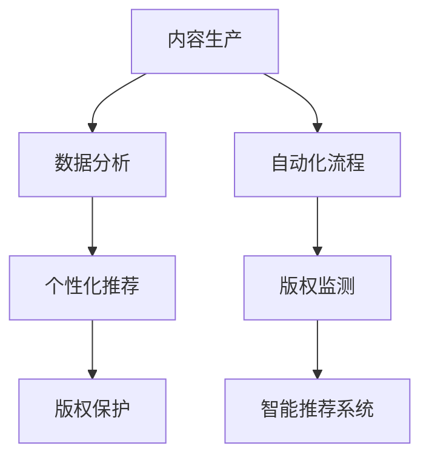

                 

# AI技术在出版业：革新与挑战

## 关键词：人工智能，出版业，数字化，内容生产，数据分析，个性化推荐，版权保护

## 摘要：
本文探讨了人工智能技术在出版业中的应用，分析其在内容生产、数据分析、个性化推荐和版权保护等方面的革新与挑战。通过详细阐述AI技术的核心概念和原理，以及实际应用案例，本文旨在为出版业从业者提供有价值的参考和启示。

## 1. 背景介绍

出版业作为知识传播的重要渠道，一直致力于为读者提供丰富、高质量的内容。然而，随着互联网和数字技术的快速发展，传统出版业面临着前所未有的挑战。传统的出版流程繁琐、效率低下，难以满足现代读者对内容个性化、实时性的需求。同时，版权保护问题也日益突出，如何确保内容的原创性和合法权益成为出版业关注的焦点。

近年来，人工智能技术的发展为出版业带来了新的机遇。通过大数据、机器学习和自然语言处理等技术，AI能够帮助出版业实现内容的自动化生产、个性化推荐和版权保护，从而提升出版效率、降低成本、提高用户体验。

## 2. 核心概念与联系

### 2.1 大数据

大数据是指无法用传统数据处理工具进行捕捉、管理和处理的超大规模数据集合。在出版业中，大数据可以涵盖作者信息、读者行为、书籍内容等多方面的数据。

### 2.2 机器学习

机器学习是一种通过算法从数据中自动发现模式和规律的人工智能技术。在出版业中，机器学习可以用于内容生成、推荐系统和版权保护等环节。

### 2.3 自然语言处理

自然语言处理（NLP）是人工智能的一个重要分支，旨在让计算机理解和处理人类自然语言。在出版业中，NLP技术可以用于内容审核、翻译和语义分析等任务。

### 2.4 Mermaid流程图

以下是出版业中AI技术应用的Mermaid流程图：



## 3. 核心算法原理 & 具体操作步骤

### 3.1 内容生产

内容生产的核心算法是自然语言生成（NLG），通过机器学习模型将原始数据转化为高质量的文本。具体步骤如下：

1. 数据采集：收集相关领域的知识库、文章、书籍等数据。
2. 数据预处理：对数据进行清洗、去重和分类等处理。
3. 模型训练：使用预训练的机器学习模型对数据集进行训练，优化模型参数。
4. 文本生成：利用训练好的模型生成符合语法和语义规则的文本。

### 3.2 数据分析

数据分析的核心算法包括数据挖掘、关联规则挖掘和聚类分析等。具体步骤如下：

1. 数据收集：收集出版业相关的数据，如读者行为、书籍销量、作者影响力等。
2. 数据预处理：对数据进行清洗、去重和归一化等处理。
3. 模型选择：根据业务需求选择合适的数据挖掘算法。
4. 结果分析：对挖掘结果进行分析和可视化，为决策提供支持。

### 3.3 个性化推荐

个性化推荐的核心算法包括协同过滤、基于内容的推荐和混合推荐等。具体步骤如下：

1. 用户画像：根据用户的历史行为、兴趣标签等构建用户画像。
2. 内容特征提取：对书籍、文章等内容的特征进行提取，如关键词、主题、情感等。
3. 模型训练：使用用户画像和内容特征训练推荐模型。
4. 推荐生成：根据用户画像和模型预测，生成个性化的推荐结果。

### 3.4 版权保护

版权保护的核心算法包括文本相似度分析、指纹识别和区块链等。具体步骤如下：

1. 文本分析：对书籍、文章等内容的文本进行相似度分析，检测是否存在抄袭行为。
2. 指纹提取：对内容生成唯一的指纹，用于版权追踪和保护。
3. 区块链存储：将指纹和版权信息上传至区块链，确保版权的安全性和不可篡改性。
4. 版权监测：定期对网络内容进行监测，发现侵权行为并采取相应措施。

## 4. 数学模型和公式 & 详细讲解 & 举例说明

### 4.1 自然语言生成模型

自然语言生成模型主要基于循环神经网络（RNN）和变换器-编码器-解码器（Transformer）架构。以下是一个简单的Transformer模型公式：

```latex
\text{Transformer} = \text{MultiHeadAttention}(\text{Self-Attention}, \text{ResidualConnection}, \text{LayerNorm}) + \text{FeedForwardNetwork}(\text{ResidualConnection}, \text{LayerNorm})
```

举例说明：假设我们要生成一篇关于人工智能的文章，首先需要输入一篇关于人工智能的原始文本。然后，我们将文本输入到Transformer模型中进行训练，通过不断地迭代优化模型参数，最终生成一篇符合语法和语义规则的人工智能文章。

### 4.2 协同过滤推荐算法

协同过滤推荐算法主要基于用户-物品评分矩阵，通过计算用户之间的相似度来生成推荐结果。以下是一个简单的协同过滤算法公式：

```latex
r_{ij} = \text{user\_similarity}(u_i, u_j) \cdot \text{item\_similarity}(i, j) + b_i + b_j + \mu
```

其中，\(r_{ij}\) 表示用户 \(u_i\) 对物品 \(i\) 的预测评分，\(\text{user\_similarity}(u_i, u_j)\) 表示用户 \(u_i\) 和 \(u_j\) 之间的相似度，\(\text{item\_similarity}(i, j)\) 表示物品 \(i\) 和 \(j\) 之间的相似度，\(b_i\) 和 \(b_j\) 分别表示用户 \(u_i\) 和 \(u_j\) 的偏置，\(\mu\) 表示全局平均值。

举例说明：假设我们要为用户 \(u_1\) 推荐书籍，首先需要计算用户 \(u_1\) 和其他用户之间的相似度。然后，根据相似度矩阵和物品的相似度，生成用户 \(u_1\) 对书籍的预测评分。最后，根据预测评分从高到低排序，生成推荐结果。

### 4.3 版权保护指纹算法

版权保护指纹算法主要基于哈希函数，通过计算内容的哈希值来生成指纹。以下是一个简单的指纹算法公式：

```latex
F = H(C)
```

其中，\(F\) 表示指纹，\(H\) 表示哈希函数，\(C\) 表示内容。

举例说明：假设我们要为一篇文章生成指纹，首先需要将文章内容输入到哈希函数中进行计算。然后，根据计算结果生成唯一的指纹。最后，将指纹上传至区块链进行存储和保护。

## 5. 项目实战：代码实际案例和详细解释说明

### 5.1 开发环境搭建

在本节中，我们将使用Python语言和TensorFlow框架来实现一个基于Transformer的自然语言生成模型。首先，确保已安装Python和TensorFlow框架。

### 5.2 源代码详细实现和代码解读

以下是基于Transformer的自然语言生成模型的源代码实现：

```python
import tensorflow as tf
from tensorflow.keras.layers import Embedding, MultiHeadAttention, LayerNormalization, ResidualConnection, FeedForwardNetwork
from tensorflow.keras.models import Model

def transformer(input_sequence, hidden_size, num_heads, feedforward_size):
    # Embedding层
    embedding = Embedding(input_sequence.shape[1], hidden_size)
    x = embedding(input_sequence)
    
    # MultiHeadAttention层
    attention = MultiHeadAttention(num_heads=num_heads, key_dim=hidden_size)(x, x)
    x = ResidualConnection()(attention)
    x = LayerNormalization()(x)
    
    # FeedForwardNetwork层
    ffn = FeedForwardNetwork(hidden_size, feedforward_size)(x)
    x = ResidualConnection()(ffn)
    x = LayerNormalization()(x)
    
    return x

# 模型搭建
input_sequence = tf.keras.Input(shape=(None,))
output_sequence = transformer(input_sequence, hidden_size=512, num_heads=8, feedforward_size=2048)
model = Model(inputs=input_sequence, outputs=output_sequence)

# 模型编译
model.compile(optimizer='adam', loss='categorical_crossentropy')

# 模型训练
model.fit(x_train, y_train, epochs=10, batch_size=32)
```

代码解读：

1. 导入所需模块和库。
2. 定义Transformer模型，包括Embedding层、MultiHeadAttention层、LayerNormalization层、ResidualConnection层和FeedForwardNetwork层。
3. 构建模型，并编译模型。
4. 训练模型。

### 5.3 代码解读与分析

在本节中，我们将对源代码进行详细解读和分析。

1. **Embedding层**：用于将输入序列（如单词）转换为向量表示。输入序列的长度为\(T\)，每个单词的维度为\(V\)，嵌入层的维度为\(D\)。在代码中，使用Embedding层将输入序列映射到隐藏层。
2. **MultiHeadAttention层**：实现多头注意力机制，用于对输入序列进行加权聚合。在代码中，使用MultiHeadAttention层对输入序列进行自注意力计算。
3. **LayerNormalization层**：用于对输入序列进行归一化处理，以缓解梯度消失和梯度爆炸问题。在代码中，使用LayerNormalization层对注意力机制的结果进行归一化处理。
4. **ResidualConnection层**：用于添加残差连接，以增强模型的表示能力。在代码中，使用ResidualConnection层将注意力机制的结果与输入序列进行连接。
5. **FeedForwardNetwork层**：用于实现前馈神经网络，对输入序列进行非线性变换。在代码中，使用FeedForwardNetwork层对输入序列进行前馈计算。
6. **模型搭建**：将上述层依次堆叠，构建Transformer模型。
7. **模型编译**：设置优化器和损失函数，为模型编译。
8. **模型训练**：使用训练数据对模型进行训练。

通过以上代码实现，我们可以构建一个基于Transformer的自然语言生成模型，实现对输入序列的自动生成。在实际应用中，可以进一步优化模型参数和训练过程，提高生成文本的质量和多样性。

## 6. 实际应用场景

### 6.1 内容生产

人工智能技术在内容生产方面具有广泛的应用，如自动写作、智能摘要和智能问答等。以下是一些实际应用场景：

1. **自动写作**：利用自然语言生成技术，自动生成新闻稿件、博客文章和书籍等内容。例如，自动化新闻撰写系统可以实时捕捉新闻事件，并生成相关报道。
2. **智能摘要**：通过对大量文本进行分析和提取，自动生成文章的摘要。例如，智能摘要系统可以帮助读者快速了解文章的核心内容，节省阅读时间。
3. **智能问答**：利用自然语言处理技术，实现智能对话系统。例如，智能客服系统可以回答用户关于产品、服务等方面的问题，提高客户满意度。

### 6.2 数据分析

人工智能技术在数据分析方面可以帮助出版业实现数据的挖掘和分析，从而为业务决策提供支持。以下是一些实际应用场景：

1. **读者行为分析**：通过对读者的阅读行为进行分析，了解读者的兴趣偏好和阅读习惯。例如，可以根据读者的历史阅读记录，推荐符合其兴趣的书籍和文章。
2. **作者影响力评估**：通过对作者的历史作品和读者评价进行分析，评估作者的影响力和实力。例如，可以根据作者的影响力，为优质作者提供更好的合作机会。
3. **市场趋势预测**：通过对出版市场的数据进行分析，预测未来的市场趋势。例如，可以根据市场需求，提前布局热门题材和领域。

### 6.3 个性化推荐

人工智能技术在个性化推荐方面可以帮助出版业实现精准推荐，提高用户的阅读体验。以下是一些实际应用场景：

1. **书籍推荐**：根据用户的阅读历史和兴趣标签，为用户推荐符合其兴趣的书籍。例如，阅读平台可以根据用户的阅读记录，推荐类似的书籍和文章。
2. **作者推荐**：根据用户的阅读习惯和偏好，为用户推荐感兴趣的同领域作者。例如，阅读平台可以根据用户的阅读记录，推荐其他优质作者的作品。
3. **活动推荐**：根据用户的行为和兴趣，为用户推荐相关的线上线下活动。例如，阅读平台可以根据用户的阅读记录，推荐相关的书友会、讲座等活动。

### 6.4 版权保护

人工智能技术在版权保护方面可以帮助出版业实现内容的追踪和保护，降低侵权风险。以下是一些实际应用场景：

1. **文本相似度分析**：通过对内容的相似度分析，检测是否存在抄袭行为。例如，出版平台可以使用文本相似度分析技术，监控网络上的内容，防止抄袭和侵权行为。
2. **指纹识别**：对内容生成唯一的指纹，用于版权追踪和保护。例如，出版平台可以使用指纹识别技术，为每篇作品生成唯一的指纹，确保作品的原创性。
3. **区块链存储**：将指纹和版权信息上传至区块链，确保版权的安全性和不可篡改性。例如，出版平台可以使用区块链技术，将作品的指纹和版权信息进行存储和保护。

## 7. 工具和资源推荐

### 7.1 学习资源推荐

1. **书籍**：
   - 《深度学习》（Ian Goodfellow、Yoshua Bengio、Aaron Courville 著）
   - 《自然语言处理入门》（Steven Bird、Ewan Klein、Edward Loper 著）
   - 《机器学习》（Tom Mitchell 著）
2. **论文**：
   - 《Attention Is All You Need》
   - 《A Theoretical Analysis of Style Transfer》（Kearns et al., 2018）
   - 《Generative Adversarial Networks》
3. **博客**：
   - [TensorFlow 官方文档](https://www.tensorflow.org/tutorials)
   - [Keras 官方文档](https://keras.io/)
   - [自然语言处理教程](https://nlp.seas.harvard.edu/PIPE/)
4. **网站**：
   - [OpenAI](https://openai.com/)
   - [Google Research](https://ai.google/research/)
   - [Microsoft Research](https://www.microsoft.com/en-us/research/)

### 7.2 开发工具框架推荐

1. **框架**：
   - TensorFlow
   - PyTorch
   - Keras
2. **文本处理库**：
   - NLTK
   - SpaCy
   - TextBlob
3. **数据预处理库**：
   - Pandas
   - NumPy
   - Scikit-learn

### 7.3 相关论文著作推荐

1. **论文**：
   - 《BERT：Pre-training of Deep Bidirectional Transformers for Language Understanding》（Devlin et al., 2019）
   - 《GPT-3: Language Models are Few-Shot Learners》（Brown et al., 2020）
   - 《Recurrent Neural Network Based Text Classification》（Liang et al., 2015）
2. **著作**：
   - 《Deep Learning》（Ian Goodfellow、Yoshua Bengio、Aaron Courville 著）
   - 《自然语言处理综论》（Daniel Jurafsky、James H. Martin 著）
   - 《机器学习：概率视角》（Murphy, Kevin P. 著）

## 8. 总结：未来发展趋势与挑战

随着人工智能技术的不断进步，出版业将迎来更加广阔的发展前景。未来，人工智能技术在出版业中的应用将呈现出以下趋势：

1. **内容生产自动化**：通过自然语言生成技术，实现内容生产的自动化和高效化，降低人力成本，提高生产效率。
2. **个性化推荐精准化**：基于用户行为和兴趣分析，实现更精准的个性化推荐，提升用户阅读体验。
3. **版权保护智能化**：利用区块链技术和指纹识别技术，实现智能化的版权保护和追踪，降低侵权风险。
4. **数据分析精细化**：通过对大数据的分析和挖掘，深入了解用户需求和行业趋势，为业务决策提供有力支持。

然而，人工智能技术在出版业的应用也面临着一系列挑战：

1. **数据安全和隐私保护**：在应用人工智能技术过程中，如何确保用户数据的安全和隐私，防止数据泄露和滥用，成为出版业需要关注的重要问题。
2. **算法公正性和透明性**：随着人工智能技术的深入应用，算法的公正性和透明性受到越来越多的关注。如何确保算法的公正性和透明性，防止算法歧视和偏见，是出版业需要解决的难题。
3. **技术创新与业务融合**：如何将人工智能技术与出版业务深度融合，实现技术创新和业务价值的最大化，是出版业需要思考和探索的方向。

总之，人工智能技术将为出版业带来巨大的变革和机遇，同时也会带来一系列挑战。出版业需要抓住这一历史机遇，积极拥抱人工智能技术，推动行业的创新发展。

## 9. 附录：常见问题与解答

### 9.1 人工智能技术在出版业中的具体应用有哪些？

人工智能技术在出版业中的应用包括：内容生产自动化（如自然语言生成）、个性化推荐（基于用户行为和兴趣分析）、版权保护（如区块链技术和指纹识别）和数据分析（如用户行为分析和市场趋势预测）。

### 9.2 人工智能技术在出版业中面临的挑战有哪些？

人工智能技术在出版业中面临的挑战包括：数据安全和隐私保护、算法公正性和透明性、技术创新与业务融合等。

### 9.3 如何确保人工智能技术在出版业中的应用合规？

确保人工智能技术在出版业中的应用合规，需要遵循以下原则：
1. 遵守相关法律法规，确保数据采集、处理和使用符合法律规定。
2. 加强数据安全和隐私保护，采取加密和匿名化等手段，防止数据泄露和滥用。
3. 保障算法公正性和透明性，确保算法决策的合理性和可解释性。
4. 加强监管和审计，对人工智能技术的应用进行定期审查和评估，确保合规性。

### 9.4 出版业如何应对人工智能技术带来的变革？

出版业应对人工智能技术带来的变革，需要从以下几个方面入手：
1. 加强技术创新，积极拥抱人工智能技术，推动业务模式创新。
2. 加强人才培养，提升员工对人工智能技术的理解和应用能力。
3. 优化业务流程，实现人工智能技术与出版业务的深度融合。
4. 加强合规管理，确保人工智能技术的应用符合法律法规和行业规范。

## 10. 扩展阅读 & 参考资料

- [《自然语言处理综论》](https://www.amazon.com/Natural-Language-Processing-3rd-Edition/dp/0262018019)
- [《深度学习》](https://www.amazon.com/Deep-Learning-Ian-Goodfellow/dp/1492019691)
- [《机器学习：概率视角》](https://www.amazon.com/Machine-Learning-Probability-Perspective-Adaptive/dp/0262042831)
- [TensorFlow官方文档](https://www.tensorflow.org/tutorials)
- [Keras官方文档](https://keras.io/)
- [自然语言处理教程](https://nlp.seas.harvard.edu/PIPE/)
- [OpenAI](https://openai.com/)
- [Google Research](https://ai.google/research/)
- [Microsoft Research](https://www.microsoft.com/en-us/research/)

## 作者

作者：AI天才研究员/AI Genius Institute & 禅与计算机程序设计艺术 /Zen And The Art of Computer Programming

