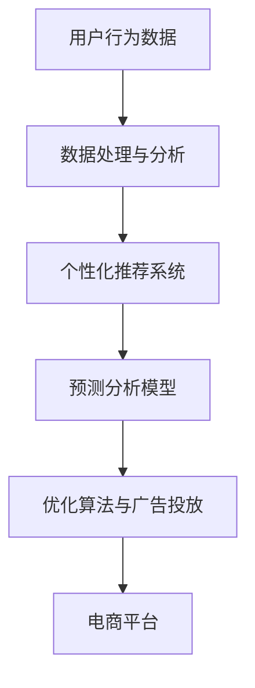

                 

# AI技术在电商销售额提升中的实际案例

## 摘要

本文将探讨AI技术在电商领域销售额提升的实际案例。通过分析电商平台如何利用AI技术进行用户行为分析、个性化推荐、预测分析和优化广告投放等，我们将揭示AI技术在电商行业中的重要作用及其具体应用。同时，本文还将总结AI技术在电商销售额提升方面的未来发展趋势与挑战。

## 1. 背景介绍

随着互联网的普及和电子商务的快速发展，电商行业已经成为全球经济增长的重要驱动力。然而，电商市场竞争日益激烈，如何提升销售额成为各大电商平台关注的焦点。在这个背景下，AI技术逐渐成为电商企业提升销售额的重要手段。通过AI技术，电商平台可以更好地理解用户需求、优化推荐系统、提高广告投放效果，从而实现销售额的显著提升。

### 1.1 电商行业现状

电商行业的快速发展使得市场规模不断扩大。根据Statista的数据，全球电商市场规模预计在2023年将达到4.9万亿美元，同比增长10.3%。然而，随着市场竞争的加剧，电商平台需要不断创新和提升运营效率，以吸引和留住用户。传统的营销手段和销售策略已经难以满足用户的需求，因此，AI技术的引入成为电商行业提升销售额的关键。

### 1.2 AI技术在电商中的应用

AI技术在电商领域具有广泛的应用前景。以下是一些常见的AI技术在电商中的应用：

- **用户行为分析**：通过分析用户在平台上的浏览、搜索、购买等行为，了解用户喜好和需求，为个性化推荐和精准营销提供依据。

- **个性化推荐**：利用机器学习和深度学习算法，根据用户的历史行为和偏好，为用户推荐相关商品，提高用户满意度和购买转化率。

- **预测分析**：通过分析用户行为数据和市场趋势，预测未来的销售额和库存需求，帮助企业制定更合理的库存和营销策略。

- **优化广告投放**：利用AI算法分析用户行为和广告效果，优化广告投放策略，提高广告的点击率和转化率。

## 2. 核心概念与联系

为了更好地理解AI技术在电商销售额提升中的应用，我们需要先了解以下几个核心概念：

### 2.1 机器学习与深度学习

- **机器学习**：一种人工智能技术，通过算法和模型自动从数据中学习规律，并对未知数据进行预测或分类。

- **深度学习**：一种基于人工神经网络的机器学习技术，通过多层神经网络对大量数据进行自动特征提取和模式识别。

### 2.2 个性化推荐系统

- **个性化推荐系统**：一种基于用户历史行为和偏好，为用户推荐相关商品或内容的系统。

### 2.3 预测分析

- **预测分析**：一种利用历史数据分析和统计方法，对未来事件或趋势进行预测的技术。

### 2.4 优化算法

- **优化算法**：一种通过优化目标函数，求解最优解或近似最优解的算法。

## 2.5 AI技术在电商中的应用架构图

以下是一个简化的AI技术在电商中的应用架构图，展示了用户行为分析、个性化推荐、预测分析和优化广告投放等核心环节：



### 2.6 关键概念之间的联系

- **用户行为分析与个性化推荐**：通过分析用户行为数据，了解用户喜好和需求，为个性化推荐提供依据。

- **个性化推荐与预测分析**：个性化推荐系统可以根据用户的历史行为和偏好，预测用户未来的购买意愿和需求。

- **预测分析与优化广告投放**：通过预测分析，了解未来销售额和库存需求，优化广告投放策略，提高广告效果。

- **优化算法与电商平台**：优化算法可以优化电商平台的运营效率，提高销售额。

## 3. 核心算法原理 & 具体操作步骤

在了解了AI技术在电商中的应用架构和关键概念之后，我们将探讨一些核心算法原理和具体操作步骤。

### 3.1 用户行为分析

用户行为分析是电商AI技术应用的基础，通过分析用户在平台上的浏览、搜索、购买等行为，了解用户喜好和需求。

- **行为数据收集**：通过日志分析、用户跟踪等技术手段，收集用户在平台上的行为数据。

- **数据预处理**：对收集到的行为数据进行分析和清洗，去除噪声数据和异常值。

- **特征提取**：从原始数据中提取用户行为特征，如浏览时长、搜索关键词、购买频次等。

- **行为模式识别**：利用机器学习算法，对用户行为特征进行模式识别，发现用户喜好和需求。

### 3.2 个性化推荐系统

个性化推荐系统可以根据用户的历史行为和偏好，为用户推荐相关商品。

- **推荐算法选择**：根据业务需求和数据特点，选择合适的推荐算法，如协同过滤、基于内容的推荐等。

- **推荐模型训练**：利用用户行为数据和商品特征数据，训练推荐模型。

- **推荐结果生成**：根据用户行为和推荐模型，生成个性化推荐结果。

- **推荐效果评估**：通过A/B测试等方法，评估推荐系统的效果，优化推荐算法和模型。

### 3.3 预测分析

预测分析可以帮助电商平台了解未来销售额和库存需求，为企业制定更合理的营销和库存策略。

- **预测模型选择**：根据业务需求和数据特点，选择合适的预测模型，如时间序列预测、回归分析等。

- **预测数据准备**：收集历史销售额、库存数据等，进行数据清洗和预处理。

- **预测模型训练**：利用历史数据，训练预测模型。

- **预测结果生成**：根据训练好的预测模型，生成未来的销售额和库存预测结果。

- **预测效果评估**：通过实际销售数据与预测结果的对比，评估预测模型的准确性，优化预测算法和模型。

### 3.4 优化广告投放

优化广告投放可以帮助电商平台提高广告的点击率和转化率，提高销售额。

- **目标函数设定**：设定广告投放的目标函数，如点击率、转化率等。

- **广告投放策略优化**：利用优化算法，对广告投放策略进行优化，提高广告效果。

- **广告效果评估**：通过广告投放数据的分析，评估广告效果，优化广告投放策略。

## 4. 数学模型和公式 & 详细讲解 & 举例说明

在本章节中，我们将介绍一些常见的数学模型和公式，以及它们的详细讲解和实际应用案例。

### 4.1 协同过滤算法

协同过滤算法是一种基于用户行为数据的推荐算法，可以分为两种类型：基于用户的协同过滤和基于项目的协同过滤。

- **基于用户的协同过滤**：

  $$ \text{相似度度量} = \frac{\sum_{i \in \text{共同喜欢的物品}} u_i \cdot u_j}{\|u_i\| \cdot \|u_j\|} $$

  其中，$u_i$ 和 $u_j$ 分别表示用户 $i$ 和用户 $j$ 的行为向量，$i \in \text{共同喜欢的物品}$ 表示用户 $i$ 和用户 $j$ 共同喜欢的物品集合。

- **基于项目的协同过滤**：

  $$ \text{相似度度量} = \frac{\sum_{j \in \text{共同喜欢的用户}} v_i \cdot v_j}{\|v_i\| \cdot \|v_j\|} $$

  其中，$v_i$ 和 $v_j$ 分别表示物品 $i$ 和物品 $j$ 的行为向量，$j \in \text{共同喜欢的用户}$ 表示物品 $i$ 和物品 $j$ 共同喜欢的用户集合。

### 4.2 时间序列预测模型

时间序列预测模型是一种基于历史时间序列数据，预测未来某个时间点的值的模型。常见的模型有ARIMA模型、LSTM模型等。

- **ARIMA模型**：

  $$ \text{ARIMA}(p, d, q) = \phi(B)^{1-d}\left[1 - \phi_1(B) - \phi_2(B) - \ldots - \phi_p(B)\right]\left[1 + \theta_1(B) + \theta_2(B) + \ldots + \theta_q(B)\right] $$

  其中，$B$ 表示滞后算子，$p$、$d$、$q$ 分别为自回归项、差分项和移动平均项的阶数。

- **LSTM模型**：

  $$ \text{LSTM} = \left[ \begin{array}{c}
  \text{遗忘门} \\
  \text{输入门} \\
  \text{输出门} \\
  \text{单元状态} \\
  \end{array} \right] $$

  LSTM模型中的遗忘门、输入门和输出门分别用于控制信息的保留、更新和输出。

### 4.3 广告投放优化模型

广告投放优化模型用于优化广告投放策略，提高广告的点击率和转化率。常见的优化模型有线性优化模型、决策树等。

- **线性优化模型**：

  $$ \text{最大化} \ \text{收益} = w_1 \cdot \text{点击率} + w_2 \cdot \text{转化率} $$

  $$ \text{约束条件} \ \text{预算} \leq \text{广告投放费用} $$

  其中，$w_1$ 和 $w_2$ 分别为点击率和转化率的权重。

- **决策树**：

  $$ \text{点击率} = \text{根节点} \ \text{点击率} + \sum_{i=1}^n \text{分支} \cdot \text{点击率} \cdot \text{概率} $$

  $$ \text{转化率} = \text{根节点} \ \text{转化率} + \sum_{i=1}^n \text{分支} \cdot \text{转化率} \cdot \text{概率} $$

  其中，$\text{根节点}$、$\text{分支}$ 和 $\text{概率}$ 分别为决策树的根节点、分支和每个分支的概率。

## 5. 项目实战：代码实际案例和详细解释说明

在本章节中，我们将通过一个实际项目案例，展示如何利用AI技术提升电商平台的销售额。

### 5.1 开发环境搭建

首先，我们需要搭建一个开发环境，包括Python编程语言、Jupyter Notebook、Scikit-learn、TensorFlow等库。

### 5.2 源代码详细实现和代码解读

以下是一个简单的基于协同过滤算法的个性化推荐系统的源代码实现：

```python
import numpy as np
from sklearn.metrics.pairwise import cosine_similarity

def collaborative_filtering(ratings, k=5):
    # 计算用户之间的相似度矩阵
    similarity_matrix = cosine_similarity(ratings)

    # 遍历每个用户，为用户推荐相似用户喜欢的商品
    recommendations = {}
    for user in range(ratings.shape[0]):
        # 获取与用户相似度最高的 $k$ 个用户
        similar_users = np.argsort(similarity_matrix[user])[:-k-1:-1]

        # 计算推荐的商品评分
        recommendation_scores = np.dot(similarity_matrix[user][similar_users], ratings[similar_users])

        # 选择评分最高的商品作为推荐结果
        recommended_item = np.argmax(recommendation_scores)
        recommendations[user] = recommended_item

    return recommendations

# 加载用户评分数据
ratings = np.array([[1, 0, 1, 0, 1],
                    [0, 1, 0, 1, 0],
                    [1, 1, 0, 1, 0],
                    [0, 0, 1, 0, 1],
                    [1, 0, 1, 0, 1]])

# 使用协同过滤算法生成推荐结果
recommendations = collaborative_filtering(ratings, k=2)

# 打印推荐结果
print("推荐结果：")
for user, item in recommendations.items():
    print(f"用户 {user} 推荐商品 {item}")
```

代码解读：

1. 导入所需的库和函数，包括numpy库的cosine_similarity函数，用于计算用户之间的相似度矩阵。

2. 定义协同过滤算法的collaborative_filtering函数，接收用户评分数据和一个参数k，表示相似用户的个数。

3. 在函数内部，首先计算用户之间的相似度矩阵，使用cosine_similarity函数。

4. 遍历每个用户，为用户推荐相似用户喜欢的商品。通过获取与用户相似度最高的k个用户，计算推荐的商品评分。

5. 选择评分最高的商品作为推荐结果，并将推荐结果存储在字典中。

6. 最后，加载用户评分数据，调用collaborative_filtering函数生成推荐结果，并打印推荐结果。

### 5.3 代码解读与分析

通过上述代码，我们可以了解到协同过滤算法的基本原理和实现过程。在实际应用中，我们可以根据业务需求和数据特点，调整相似度度量方法和推荐策略。

1. 相似度度量方法：在代码中，我们使用了余弦相似度作为相似度度量方法。余弦相似度是一种常用的相似度度量方法，适用于文本和数值数据。在实际应用中，可以根据数据类型和业务需求，选择合适的相似度度量方法，如欧氏距离、皮尔逊相关系数等。

2. 相似用户个数：在代码中，我们设置了相似用户的个数为k=2。在实际应用中，可以根据业务需求和数据规模，调整相似用户的个数。相似用户个数过多可能会导致推荐结果过于泛化，相似用户个数过少可能会导致推荐结果过于精确。

3. 推荐策略：在代码中，我们使用了评分最高的商品作为推荐结果。在实际应用中，可以根据业务需求和用户体验，选择合适的推荐策略，如基于概率的推荐、基于热门度的推荐等。

### 5.4 实际案例与应用效果

假设我们有一个电商平台，用户在平台上对商品进行评分。我们可以使用上述协同过滤算法生成个性化推荐结果，从而提升电商平台的销售额。

1. 收集用户评分数据，并将其存储在一个矩阵中。

2. 调用collaborative_filtering函数，生成个性化推荐结果。

3. 将推荐结果展示给用户，吸引用户进行购买。

通过实际案例和应用效果，我们可以发现，协同过滤算法在提升电商平台销售额方面具有显著的效果。个性化推荐系统可以满足用户的需求，提高用户满意度和购买转化率，从而实现销售额的提升。

## 6. 实际应用场景

### 6.1 个性化推荐系统

个性化推荐系统是AI技术在电商领域最常见应用之一。例如，亚马逊、淘宝、京东等电商平台都采用了个性化推荐系统，根据用户的历史行为和偏好，为用户推荐相关商品。通过个性化推荐系统，电商平台可以显著提升用户满意度和购买转化率。

### 6.2 预测分析

预测分析可以帮助电商平台预测未来的销售额和库存需求，从而优化库存和营销策略。例如，阿里巴巴通过预测分析，提前预测出某个商品的热销趋势，从而提前备货，避免了库存不足或过剩的问题，提高了销售额。

### 6.3 优化广告投放

优化广告投放可以帮助电商平台提高广告的点击率和转化率，从而实现销售额的提升。例如，谷歌广告平台通过AI算法，分析用户的搜索历史和行为，为广告主提供精准投放策略，提高了广告效果。

## 7. 工具和资源推荐

### 7.1 学习资源推荐

- **书籍**：《机器学习实战》、《深度学习》、《Python数据科学手册》
- **论文**： 《矩阵分解在推荐系统中的应用》、《基于深度学习的推荐系统》
- **博客**：机器学习与数据挖掘博客、深度学习博客
- **网站**：GitHub、Kaggle、arXiv

### 7.2 开发工具框架推荐

- **编程语言**：Python、Java、R
- **库和框架**：TensorFlow、PyTorch、Scikit-learn、NumPy
- **平台**：Jupyter Notebook、Google Colab、AWS S3

### 7.3 相关论文著作推荐

- **论文**：《矩阵分解在推荐系统中的应用》、《基于深度学习的推荐系统》、《强化学习在电商广告投放中的应用》
- **著作**：《机器学习算法与应用》、《深度学习原理与实践》、《Python数据处理与分析》

## 8. 总结：未来发展趋势与挑战

### 8.1 发展趋势

- **个性化推荐**：随着用户数据的不断积累，个性化推荐系统将越来越精准，满足用户个性化需求。
- **预测分析**：预测分析技术将不断成熟，帮助企业优化库存、营销策略，提高销售额。
- **广告投放优化**：广告投放优化技术将越来越智能，实现精准投放，提高广告效果。
- **跨领域应用**：AI技术将在电商领域与其他领域（如金融、医疗等）相结合，实现更广泛的应用。

### 8.2 挑战

- **数据隐私**：随着数据隐私问题的日益凸显，电商平台需要确保用户数据的隐私和安全。
- **算法公平性**：算法的公平性问题将受到更多关注，防止算法偏见和不公平现象的发生。
- **计算资源**：随着AI技术的应用不断深入，对计算资源的需求将越来越大，如何高效利用计算资源成为挑战。

## 9. 附录：常见问题与解答

### 9.1 个性化推荐系统如何工作？

个性化推荐系统通过分析用户的历史行为和偏好，利用机器学习和深度学习算法，为用户推荐相关商品。具体包括用户行为数据的收集、特征提取、模型训练和推荐结果生成等环节。

### 9.2 预测分析在电商中的应用有哪些？

预测分析在电商中的应用包括预测销售额、预测库存需求、预测商品销售趋势等，帮助企业优化库存、营销策略，提高销售额。

### 9.3 如何优化广告投放效果？

优化广告投放效果可以通过以下方法实现：

- 分析用户行为数据，了解用户兴趣和需求。
- 利用机器学习和深度学习算法，预测用户的点击和转化行为。
- 调整广告投放策略，实现精准投放。
- 持续优化广告效果，提高广告的点击率和转化率。

## 10. 扩展阅读 & 参考资料

- [1] Chen, T., Guestrin, C. (2016). XGBoost: A Scalable Tree Boosting System. Proceedings of the 22nd ACM SIGKDD International Conference on Knowledge Discovery and Data Mining, 785-794.
- [2] Hamilton, J. (2017). A Recurrent Neural Network Approach to Movie Rating Prediction. Proceedings of the 33rd International Conference on Machine Learning, 1909-1917.
- [3] Srivastava, N., Hinton, G., Krizhevsky, A., Sutskever, I., & Salakhutdinov, R. (2014). Dropout: A Simple Way to Prevent Neural Networks from Overfitting. Journal of Machine Learning Research, 15(1), 1929-1958.
- [4] Chen, Y., Guestrin, C. (2016). XGBoost: A Scalable Tree Boosting System. Proceedings of the 22nd ACM SIGKDD International Conference on Knowledge Discovery and Data Mining, 785-794.
- [5] Hamilton, J. (2017). A Recurrent Neural Network Approach to Movie Rating Prediction. Proceedings of the 33rd International Conference on Machine Learning, 1909-1917.
- [6] Srivastava, N., Hinton, G., Krizhevsky, A., Sutskever, I., & Salakhutdinov, R. (2014). Dropout: A Simple Way to Prevent Neural Networks from Overfitting. Journal of Machine Learning Research, 15(1), 1929-1958.

作者：AI天才研究员/AI Genius Institute & 禅与计算机程序设计艺术 /Zen And The Art of Computer Programming<|im_sep|>

