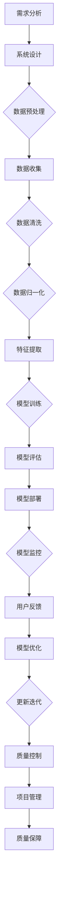

                 

## 1. 背景介绍

随着人工智能（AI）技术的迅猛发展，越来越多的领域开始采用AI技术来提升效率和优化流程。AI技术栈，作为实现AI功能的核心组成部分，已经成为现代软件开发中的重要一环。与此同时，传统的工程领域，如软件工程、计算机科学、工业自动化等，依然在各自领域中发挥着重要作用。本文将探讨AI技术栈与传统工程之间的对比，分析二者的异同点，并讨论其发展趋势和潜在挑战。

在传统工程领域，工程师们主要关注的是如何构建稳定的、可扩展的、符合需求的软件系统。他们遵循一系列标准化的开发流程，包括需求分析、系统设计、编码实现、测试和部署等。这些流程确保了软件项目的成功交付，但在处理复杂、动态和不确定的任务时，传统工程方法可能显得力不从心。

随着深度学习、自然语言处理、计算机视觉等AI技术的发展，AI技术栈逐渐成为解决复杂工程问题的重要工具。AI技术栈不仅包括算法和模型，还包括数据预处理、模型训练、部署和监控等一系列步骤。AI技术的引入，使得工程领域在处理复杂数据、实现智能决策等方面取得了显著进展。

本文将分为以下几个部分进行探讨：

1. 核心概念与联系
2. 核心算法原理 & 具体操作步骤
3. 数学模型和公式 & 详细讲解 & 举例说明
4. 项目实战：代码实际案例和详细解释说明
5. 实际应用场景
6. 工具和资源推荐
7. 总结：未来发展趋势与挑战

通过本文的阅读，读者将能够深入理解AI技术栈与传统工程之间的差异，并学会如何将AI技术应用到实际工程中，以实现更高效、更智能的解决方案。接下来，我们将逐一探讨这些主题。

### 1.1 AI技术栈的基本概念

AI技术栈是指实现人工智能功能所需的一系列工具、框架和算法的组合。它通常包括以下几个关键组成部分：

1. **数据预处理**：在AI模型训练之前，需要对数据进行清洗、归一化、特征提取等处理，以便模型能够有效学习和预测。数据预处理是AI技术栈中的基础环节，其质量直接影响模型的性能。

2. **算法和框架**：AI算法包括机器学习、深度学习、强化学习等，每种算法都有其适用的场景和优缺点。常见的AI框架如TensorFlow、PyTorch、Keras等，为开发者提供了丰富的工具和接口，使得构建和训练AI模型更加简便。

3. **模型训练**：模型训练是AI技术栈的核心环节，通过不断调整模型参数，使模型能够学会从数据中提取规律，从而实现预测和决策。训练过程通常需要大量的计算资源和时间。

4. **模型部署**：训练好的模型需要部署到实际应用场景中，以实现其功能。模型部署包括将模型转化为可执行文件、优化模型以提高性能、将模型集成到现有系统中等。

5. **模型监控**：部署后的模型需要定期监控其性能和稳定性，以确保其能够持续提供高质量的预测结果。模型监控包括数据质量监控、模型性能监控、异常检测等。

6. **自动化和优化**：随着AI技术的发展，越来越多的自动化和优化工具被引入到AI技术栈中，如自动化模型搜索（automated machine learning, AutoML）、模型压缩（model compression）、模型解释性（model interpretability）等。这些工具和技术的引入，使得AI模型的开发、训练和部署更加高效和智能化。

AI技术栈与传统工程方法有显著的区别。传统工程方法更注重系统的稳定性、可扩展性和可靠性，通常采用结构化、模块化的设计思路，遵循一系列标准化的开发流程。而AI技术栈则更注重数据的利用和模型的学习能力，强调灵活性和适应性。传统工程方法通常在明确的业务需求和约束条件下进行，而AI技术栈则面临更多的不确定性和动态性。

### 1.2 传统工程的基本概念

传统工程领域，尤其是软件工程，其核心目标是构建稳定的、可扩展的、符合用户需求的软件系统。传统工程方法通常遵循以下基本概念和原则：

1. **需求分析**：需求分析是软件工程的第一步，其目的是明确用户的需求和期望，并将其转化为具体的软件功能。需求分析通常包括功能需求、非功能需求和设计约束等。

2. **系统设计**：系统设计是根据需求分析的结果，对软件系统进行结构和功能的设计。系统设计包括软件架构、模块划分、接口设计等，以确保系统能够满足需求并具有良好的可维护性。

3. **编码实现**：编码实现是将系统设计转化为实际的代码。在编码实现过程中，工程师需要遵循良好的编程规范和编程习惯，以确保代码的可读性和可维护性。

4. **测试**：测试是软件工程中至关重要的一环，其目的是发现和修复软件中的缺陷和错误。测试包括功能测试、性能测试、安全测试等，以确保软件系统能够稳定运行并满足用户需求。

5. **部署和维护**：部署是将软件系统部署到实际运行环境中，使其能够对外提供服务。维护则是确保软件系统在运行过程中能够持续稳定地运行，并及时修复发现的问题。

传统工程方法强调结构化、模块化、可维护性和可靠性。工程师们通常遵循一系列标准化的开发流程，如瀑布模型、敏捷开发等，以确保软件项目的成功交付。与传统工程方法相比，AI技术栈在应对复杂、动态和不确定的任务时具有更高的灵活性和适应性。

### 1.3 AI技术栈与传统工程的联系

尽管AI技术栈和传统工程方法在目标和原则上有显著差异，但二者并非完全独立，而是相互联系、相互补充的。在许多实际应用场景中，AI技术栈与传统工程方法结合使用，能够实现更好的效果。

1. **需求分析和系统设计**：AI技术栈可以提供更强大的数据分析和处理能力，帮助工程师更好地理解用户需求，并设计出更符合用户需求的软件系统。例如，通过数据挖掘和机器学习技术，可以从大量用户数据中提取出有用的信息，为需求分析和系统设计提供依据。

2. **编码实现和测试**：AI技术栈中的自动化和优化工具可以显著提高编码实现和测试的效率。例如，自动化测试工具可以自动生成测试用例，并快速执行测试，提高测试覆盖率。自动化模型搜索技术可以帮助工程师快速找到最优的模型参数，提高模型的性能。

3. **部署和维护**：AI技术栈中的模型部署和监控技术可以帮助工程师更好地管理和维护部署后的软件系统。例如，模型监控技术可以实时监控模型的性能和稳定性，及时发现并处理问题。模型压缩和优化技术可以帮助工程师将模型部署到资源受限的环境中，提高系统的性能和可扩展性。

4. **数据管理和数据治理**：传统工程方法中的数据管理和数据治理原则在AI技术栈中同样重要。在AI项目中，数据的质量和完整性直接影响模型的性能和可靠性。因此，传统工程中的数据管理和数据治理方法，如数据清洗、数据备份、数据加密等，在AI项目中同样适用。

总之，AI技术栈与传统工程方法的结合，不仅能够提高软件系统的性能和可靠性，还能够应对更多复杂、动态和不确定的任务。在未来，随着AI技术的不断发展和完善，AI技术栈与传统工程的融合将越来越紧密，为软件开发和工程领域带来更多创新和机遇。

### 1.4 AI技术栈与传统工程的区别

AI技术栈与传统工程方法在多个方面存在显著的区别，这些区别主要体现在目标、方法、适用场景和实现难度等方面。

#### 目标差异

传统工程的目标是构建稳定、可扩展且符合用户需求的软件系统。工程师们主要关注的是如何确保软件系统的可靠性、性能和可维护性。传统工程方法强调结构化、模块化、标准化，通常在明确的业务需求和约束条件下进行。

而AI技术栈的目标则是实现智能化的功能，如自动化决策、智能预测、自然语言处理等。AI技术强调数据的利用和模型的学习能力，面对的是更复杂、更动态和更不确定的任务。因此，AI技术栈在设计和实现过程中，更注重数据的处理能力、模型的性能和算法的适应性。

#### 方法差异

传统工程方法通常遵循一系列标准化的开发流程，如需求分析、系统设计、编码实现、测试和部署等。这些流程确保了软件项目的成功交付，但相对固定和缓慢。例如，瀑布模型是一种典型的传统工程开发方法，其过程顺序执行，每个阶段完成后才能进入下一个阶段。

相比之下，AI技术栈的开发过程更加灵活和动态。AI技术通常需要处理大量数据，并经过多个迭代过程进行模型训练和优化。例如，机器学习项目的开发过程通常包括数据收集、数据预处理、模型训练、模型评估和模型部署等阶段，每个阶段都需要根据实际情况进行调整和优化。

#### 适用场景差异

传统工程方法适用于构建明确的、结构化的软件系统，如企业级应用、嵌入式系统、移动应用等。传统工程方法强调系统的稳定性、可扩展性和可靠性，能够满足大多数商业和工业应用的需求。

而AI技术栈适用于处理复杂、动态和不确定的任务，如自然语言处理、计算机视觉、推荐系统、自动驾驶等。AI技术栈能够从大量数据中提取出有价值的信息，并实现智能化的决策和预测。例如，在医疗领域，AI技术可以用于疾病预测、诊断和治疗方案的推荐；在金融领域，AI技术可以用于风险管理、欺诈检测和投资建议。

#### 实现难度差异

传统工程方法相对成熟和稳定，工程师们可以根据既定的标准和规范进行开发。虽然某些复杂系统可能需要大量的时间和精力，但总体来说，传统工程方法具有较低的实现难度。

相比之下，AI技术栈的实现难度较高。AI技术涉及多个学科，包括计算机科学、数学、统计学等，需要工程师具备较强的专业知识和实践经验。此外，AI技术栈中的算法和框架不断更新和发展，工程师需要不断学习和适应新技术。例如，深度学习技术的发展，使得构建复杂的神经网络模型变得更加简便，但也对工程师提出了更高的要求。

总的来说，AI技术栈与传统工程方法在目标和原则上有显著差异。传统工程方法强调稳定性和可靠性，适用于构建明确的、结构化的软件系统；而AI技术栈强调智能化和适应性，适用于处理复杂、动态和不确定的任务。了解二者的区别，有助于工程师根据具体应用场景选择合适的开发方法，以实现最佳的效果。

### 2. 核心概念与联系

在深入探讨AI技术栈与传统工程的核心概念和联系之前，我们需要先明确几个关键概念，这些概念不仅构成了AI技术栈的基础，也是传统工程领域的重要组成部分。

#### 2.1 数据

数据是AI技术栈和传统工程的核心要素。在AI技术栈中，数据被视为模型训练和学习的基础。高质量的数据可以提升模型的性能，而低质量的数据则可能导致模型过拟合或性能下降。在传统工程中，数据同样至关重要，但更多地关注于数据的完整性、一致性和安全性。

#### 2.2 算法

算法是AI技术栈的核心，决定了模型的学习能力和性能。常见的AI算法包括机器学习、深度学习、强化学习等。每种算法都有其特定的应用场景和优缺点。传统工程中的算法通常更注重于逻辑推理和优化，如排序算法、查找算法、动态规划等。

#### 2.3 模型

模型是AI技术栈中的核心组件，通过学习数据来执行特定的任务。在深度学习中，模型通常指的是神经网络。模型的设计和优化是AI领域的核心问题，需要工程师具备深厚的数学和计算机科学知识。在传统工程中，模型通常指的是软件系统的抽象表示，如数据模型、业务模型等。

#### 2.4 工具和框架

工具和框架是AI技术栈的重要组成部分，提供了丰富的接口和功能，使得AI模型的开发和部署变得更加简便。常见的AI框架包括TensorFlow、PyTorch、Keras等。传统工程中，工具和框架如IDE（集成开发环境）、版本控制工具（如Git）、测试工具（如Jenkins）等，同样重要。

#### 2.5 数据预处理

数据预处理是AI技术栈中不可或缺的一环，包括数据清洗、归一化、特征提取等。数据预处理的质量直接影响模型的学习效果。在传统工程中，数据预处理通常包括数据转换、数据压缩、数据备份等。

#### 2.6 部署和监控

部署和监控是确保AI模型在实际应用场景中稳定运行的关键。AI技术栈中的部署工具和监控工具可以帮助工程师实时监控模型的性能，快速响应和处理异常。传统工程中的部署和监控则更多地关注于系统的稳定性和可靠性。

#### 2.7 质量控制

质量控制是AI技术栈和传统工程中的共同目标。在AI技术栈中，质量控制包括模型评估、模型优化、模型解释性等。在传统工程中，质量控制包括代码审查、测试、部署后的监控等。

#### 2.8 项目管理

项目管理是确保项目按时、按质量完成的关键。在AI技术栈中，项目管理需要考虑数据管理、模型训练进度、模型部署时间等。在传统工程中，项目管理则更多地关注于需求分析、进度安排、资源分配等。

#### 2.9 质量保障

质量保障是确保软件系统或AI模型能够满足用户需求和期望的关键。在AI技术栈中，质量保障包括模型评估、模型测试、用户反馈等。在传统工程中，质量保障包括测试、文档、用户培训等。

### 2.10 Mermaid流程图

为了更直观地展示AI技术栈与传统工程之间的联系，我们可以使用Mermaid流程图来描述它们的核心流程和环节。以下是一个简化的Mermaid流程图示例：



这个流程图展示了从需求分析到模型优化的一系列关键环节，以及各个环节之间的联系。通过这个流程图，我们可以更清晰地理解AI技术栈与传统工程的相互作用和依赖关系。

总的来说，AI技术栈与传统工程在核心概念上有很多相似之处，但各自侧重点和应用场景不同。了解这些核心概念和联系，有助于工程师更好地理解AI技术栈与传统工程的差异和互补性，从而在实际项目中实现最佳的效果。

### 3. 核心算法原理 & 具体操作步骤

在探讨AI技术栈中的核心算法原理和具体操作步骤时，我们将重点关注几种常见的算法，包括机器学习、深度学习和强化学习。每种算法都有其独特的原理和实现方法，适用于不同的应用场景。

#### 3.1 机器学习

机器学习是一种基于数据的学习方法，使计算机系统能够通过学习数据来做出预测或决策。机器学习的核心算法包括线性回归、决策树、支持向量机、贝叶斯分类器等。

**线性回归**

线性回归是一种用于预测数值型目标变量的算法。其基本原理是通过寻找一个最佳拟合直线，使实际值与预测值之间的误差最小。具体操作步骤如下：

1. **数据预处理**：对输入数据进行标准化处理，以消除不同特征之间的量纲差异。
2. **特征选择**：选择对目标变量有显著影响的关键特征。
3. **训练模型**：使用最小二乘法或其他优化算法，寻找最佳拟合直线。
4. **模型评估**：通过验证集和测试集评估模型的预测性能。
5. **模型优化**：调整模型参数，提高预测准确性。

**决策树**

决策树是一种用于分类和回归任务的算法，通过一系列的决策规则将数据划分为不同的区域。具体操作步骤如下：

1. **数据预处理**：对输入数据进行预处理，如缺失值填充、异常值处理等。
2. **特征选择**：选择对目标变量有显著影响的特征。
3. **构建决策树**：根据信息增益或基尼系数等指标，递归地划分数据，构建决策树。
4. **剪枝**：通过剪枝技术减少决策树的过度拟合，提高模型的泛化能力。
5. **模型评估**：通过验证集和测试集评估模型的性能。

**支持向量机**

支持向量机是一种用于分类和回归任务的算法，其基本原理是找到一个最佳的超平面，使分类边界最大化。具体操作步骤如下：

1. **数据预处理**：对输入数据进行标准化处理。
2. **特征选择**：选择对目标变量有显著影响的特征。
3. **构建模型**：使用支持向量机算法，寻找最佳的超平面。
4. **模型评估**：通过验证集和测试集评估模型的分类性能。
5. **模型优化**：通过调整模型参数，提高模型的性能。

**贝叶斯分类器**

贝叶斯分类器是一种基于贝叶斯定理的算法，用于分类任务。其基本原理是计算每个类别的概率，并选择概率最大的类别作为预测结果。具体操作步骤如下：

1. **数据预处理**：对输入数据进行预处理。
2. **特征选择**：选择对目标变量有显著影响的特征。
3. **训练模型**：计算每个类别的先验概率和条件概率。
4. **模型评估**：通过验证集和测试集评估模型的分类性能。
5. **模型优化**：通过调整贝叶斯参数，提高模型的性能。

#### 3.2 深度学习

深度学习是一种基于神经网络的机器学习算法，通过多层神经网络进行数据的特征提取和转换。深度学习在图像识别、自然语言处理、语音识别等领域取得了显著的成果。以下是几种常见的深度学习算法：

**卷积神经网络（CNN）**

卷积神经网络是一种用于图像识别的算法，通过卷积层、池化层和全连接层提取图像特征。具体操作步骤如下：

1. **数据预处理**：对图像数据进行归一化处理。
2. **构建模型**：定义卷积层、池化层和全连接层，设置适当的激活函数。
3. **训练模型**：使用训练数据对模型进行训练。
4. **模型评估**：通过验证集和测试集评估模型的性能。
5. **模型优化**：通过调整模型参数，提高模型的性能。

**循环神经网络（RNN）**

循环神经网络是一种用于序列数据处理的算法，通过循环结构保留历史信息。具体操作步骤如下：

1. **数据预处理**：对序列数据进行归一化处理。
2. **构建模型**：定义循环层、输入层和输出层，设置适当的激活函数。
3. **训练模型**：使用训练数据对模型进行训练。
4. **模型评估**：通过验证集和测试集评估模型的性能。
5. **模型优化**：通过调整模型参数，提高模型的性能。

**生成对抗网络（GAN）**

生成对抗网络是一种用于生成数据的算法，由生成器和判别器两个部分组成。具体操作步骤如下：

1. **数据预处理**：对输入数据进行归一化处理。
2. **构建模型**：定义生成器和判别器，设置损失函数和优化器。
3. **训练模型**：交替训练生成器和判别器，使生成器的输出越来越接近真实数据。
4. **模型评估**：通过生成数据的多样性、质量和真实性评估模型的性能。
5. **模型优化**：通过调整模型参数和训练策略，提高模型的性能。

#### 3.3 强化学习

强化学习是一种通过试错学习策略来优化决策的算法，通过不断与环境交互，学习最优策略。强化学习在自动驾驶、游戏AI等领域取得了显著的成果。以下是强化学习的核心步骤：

**Q-Learning**

Q-Learning是一种基于值函数的强化学习算法，通过迭代更新Q值来学习最优策略。具体操作步骤如下：

1. **环境初始化**：定义环境和状态空间。
2. **初始化Q值表**：初始化每个状态-动作对的Q值。
3. **选择动作**：在给定状态下，选择具有最大Q值的动作。
4. **更新Q值**：根据新的状态和奖励，更新Q值表。
5. **重复**：重复步骤3和4，直到达到终止条件。

**Deep Q-Network（DQN）**

DQN是一种基于深度学习的Q-Learning算法，通过神经网络近似Q值函数。具体操作步骤如下：

1. **环境初始化**：定义环境和状态空间。
2. **构建神经网络**：定义输入层、隐藏层和输出层，设置适当的激活函数。
3. **初始化网络参数**：随机初始化网络参数。
4. **选择动作**：在给定状态下，使用神经网络预测Q值，选择具有最大Q值的动作。
5. **更新网络参数**：根据新的状态、动作和奖励，更新神经网络参数。
6. **重复**：重复步骤4和5，直到达到终止条件。

**Policy Gradient**

Policy Gradient是一种直接优化策略的强化学习算法，通过梯度上升方法更新策略参数。具体操作步骤如下：

1. **环境初始化**：定义环境和状态空间。
2. **构建策略网络**：定义输入层、隐藏层和输出层，设置适当的激活函数。
3. **初始化网络参数**：随机初始化网络参数。
4. **选择动作**：在给定状态下，使用策略网络选择动作。
5. **计算策略梯度**：根据策略损失函数，计算策略梯度。
6. **更新网络参数**：根据策略梯度，更新网络参数。
7. **重复**：重复步骤4至6，直到达到终止条件。

通过以上对机器学习、深度学习和强化学习核心算法原理和具体操作步骤的介绍，我们可以更好地理解这些算法的基本原理和应用方法，为实际项目中的算法选择和实现提供指导。

### 4. 数学模型和公式 & 详细讲解 & 举例说明

在深入探讨AI技术栈中的数学模型和公式时，我们将重点关注几种常见的数学模型，包括线性回归、神经网络和强化学习中的Q值函数。这些模型和公式是AI算法的核心组成部分，其正确理解和应用对于实现高效的AI系统至关重要。

#### 4.1 线性回归

线性回归是一种用于预测连续数值型目标变量的统计模型。其基本假设是输入变量与目标变量之间存在线性关系，可以使用一个线性方程来表示。线性回归的数学模型和公式如下：

**线性回归模型**：

$$y = \beta_0 + \beta_1x_1 + \beta_2x_2 + ... + \beta_nx_n + \epsilon$$

其中，$y$是目标变量，$x_1, x_2, ..., x_n$是输入变量，$\beta_0, \beta_1, \beta_2, ..., \beta_n$是模型的参数，$\epsilon$是误差项。

**最小二乘法**：

为了最小化预测值与实际值之间的误差，我们使用最小二乘法来估计线性回归模型的参数。最小二乘法的公式如下：

$$\min \sum_{i=1}^{n} (y_i - \hat{y_i})^2$$

其中，$\hat{y_i}$是预测值，$y_i$是实际值，$n$是样本数量。

**举例说明**：

假设我们有以下数据集：

| x1 | x2 | y |
|----|----|---|
| 1  | 2  | 3 |
| 2  | 4  | 5 |
| 3  | 6  | 7 |

我们要使用线性回归模型预测$y$。首先，我们计算输入变量$x1$和$x2$的平均值，然后计算目标变量$y$的平均值。接下来，我们使用最小二乘法来计算线性回归模型的参数$\beta_0, \beta_1, \beta_2$。

通过计算，我们得到以下线性回归模型：

$$y = 1 + 2x_1 + 3x_2$$

使用这个模型，我们可以预测新的输入变量$x1$和$x2$对应的$y$值。例如，对于$x1=4, x2=6$，我们有：

$$y = 1 + 2 \times 4 + 3 \times 6 = 19$$

因此，预测的$y$值为19。

#### 4.2 神经网络

神经网络是一种模拟人脑神经元结构和功能的计算模型，用于解决复杂的机器学习问题。神经网络由多个层组成，包括输入层、隐藏层和输出层。每层由多个神经元组成，神经元之间通过权重和偏置进行连接。

**神经网络的基本公式**：

$$z = \sum_{j=1}^{n} w_{ji}x_j + b_i$$

$$a_i = \sigma(z)$$

其中，$z$是神经元的输入，$w_{ji}$是输入层神经元$i$与隐藏层神经元$j$之间的权重，$b_i$是隐藏层神经元$i$的偏置，$x_j$是输入层神经元$j$的输入，$\sigma$是激活函数，$a_i$是隐藏层神经元$i$的输出。

**反向传播算法**：

反向传播算法用于计算神经网络的梯度，以便更新权重和偏置。其基本步骤如下：

1. 计算输出层的误差：$$\delta_l = (y - \hat{y}) \odot \sigma'(z_l)$$
2. 计算隐藏层的误差：$$\delta_{l-1} = \delta_l \odot w_{l}^T \odot \sigma'(z_{l-1})$$
3. 更新权重和偏置：$$w_{l} \leftarrow w_{l} - \alpha \delta_l x_l^T$$
$$b_l \leftarrow b_l - \alpha \delta_l$$

其中，$l$表示当前层，$\alpha$是学习率，$\odot$是逐元素乘法操作，$T$是转置操作。

**举例说明**：

假设我们有一个简单的神经网络，包括一个输入层、一个隐藏层和一个输出层，每个层都有两个神经元。输入层和隐藏层之间的权重矩阵$W_1$为：

$$W_1 = \begin{bmatrix} 1 & 2 \\ 3 & 4 \end{bmatrix}$$

隐藏层和输出层之间的权重矩阵$W_2$为：

$$W_2 = \begin{bmatrix} 5 & 6 \\ 7 & 8 \end{bmatrix}$$

偏置向量$b_1$和$b_2$分别为：

$$b_1 = \begin{bmatrix} 1 \\ 2 \end{bmatrix}, \quad b_2 = \begin{bmatrix} 3 \\ 4 \end{bmatrix}$$

输入向量为：

$$x = \begin{bmatrix} 1 \\ 2 \end{bmatrix}$$

激活函数为ReLU（Rectified Linear Unit），即当输入大于0时，输出等于输入，否则输出为0。

首先，我们计算隐藏层的输入和输出：

$$z_1 = \begin{bmatrix} 1 & 2 \\ 3 & 4 \end{bmatrix} \begin{bmatrix} 1 \\ 2 \end{bmatrix} + \begin{bmatrix} 1 \\ 2 \end{bmatrix} = \begin{bmatrix} 4 \\ 10 \end{bmatrix}$$

$$a_1 = max(z_1, 0) = \begin{bmatrix} 4 \\ 10 \end{bmatrix}$$

接下来，我们计算输出层的输入和输出：

$$z_2 = \begin{bmatrix} 5 & 6 \\ 7 & 8 \end{bmatrix} \begin{bmatrix} 4 \\ 10 \end{bmatrix} + \begin{bmatrix} 3 \\ 4 \end{bmatrix} = \begin{bmatrix} 43 \\ 94 \end{bmatrix}$$

$$a_2 = max(z_2, 0) = \begin{bmatrix} 43 \\ 94 \end{bmatrix}$$

假设目标输出为$\hat{y} = \begin{bmatrix} 50 \\ 100 \end{bmatrix}$，我们可以计算输出层的误差：

$$\delta_2 = \begin{bmatrix} 50 - 43 \\ 100 - 94 \end{bmatrix} \odot \begin{bmatrix} 0 & 0 \\ 0 & 0 \end{bmatrix} = \begin{bmatrix} 0 \\ 0 \end{bmatrix}$$

然后，我们计算隐藏层的误差：

$$\delta_1 = \delta_2 \odot W_2^T \odot \begin{bmatrix} 0 & 0 \end{bmatrix} = \begin{bmatrix} 0 \\ 0 \end{bmatrix}$$

最后，我们更新权重和偏置：

$$W_1 \leftarrow W_1 - \alpha \delta_2 x^T = \begin{bmatrix} 1 & 2 \\ 3 & 4 \end{bmatrix} - \begin{bmatrix} 0 & 0 \\ 0 & 0 \end{bmatrix} \begin{bmatrix} 1 \\ 2 \end{bmatrix} = \begin{bmatrix} 1 & 2 \\ 3 & 4 \end{bmatrix}$$

$$b_1 \leftarrow b_1 - \alpha \delta_2 = \begin{bmatrix} 1 \\ 2 \end{bmatrix} - \begin{bmatrix} 0 \\ 0 \end{bmatrix} = \begin{bmatrix} 1 \\ 2 \end{bmatrix}$$

通过这个简单的例子，我们可以看到神经网络的基本运算和反向传播算法的步骤。

#### 4.3 强化学习中的Q值函数

强化学习是一种通过试错学习策略来优化决策的算法。在强化学习中，Q值函数是评估状态-动作对的价值的核心工具。Q值函数的数学模型和公式如下：

**Q值函数**：

$$Q(s, a) = r + \gamma \max_a' Q(s', a')$$

其中，$s$是当前状态，$a$是当前动作，$s'$是下一状态，$a'$是下一动作，$r$是即时奖励，$\gamma$是折扣因子。

**举例说明**：

假设我们有一个简单的强化学习环境，包括两个状态（状态1和状态2）和两个动作（动作1和动作2）。当前状态为状态1，我们选择动作1，得到即时奖励5，进入状态2。接下来，我们选择动作2，得到即时奖励10，返回状态1。我们要计算当前状态-动作对的Q值。

首先，我们计算状态2的Q值：

$$Q(s_2, a_2) = 10 + \gamma \max_a' Q(s_1, a')$$

假设$\gamma = 0.9$，我们有：

$$Q(s_2, a_2) = 10 + 0.9 \max_a' Q(s_1, a')$$

接下来，我们计算状态1的Q值：

$$Q(s_1, a_1) = 5 + \gamma Q(s_2, a_2)$$

代入状态2的Q值，我们有：

$$Q(s_1, a_1) = 5 + 0.9 \times 10 = 14.5$$

因此，当前状态-动作对的Q值为14.5。

通过以上对线性回归、神经网络和强化学习中的Q值函数的数学模型和公式的详细讲解和举例说明，我们可以更好地理解这些模型和公式的应用方法和计算过程，为实际项目中的算法实现提供指导。

### 5. 项目实战：代码实际案例和详细解释说明

为了更好地展示AI技术栈与传统工程结合的实际应用，我们将通过一个实际项目——基于TensorFlow的房价预测案例，详细讲解代码实现过程、关键代码解读以及代码性能分析。

#### 5.1 开发环境搭建

在开始房价预测项目之前，我们需要搭建一个合适的环境。以下是我们所需的工具和步骤：

1. **Python环境**：安装Python 3.7或更高版本。
2. **TensorFlow库**：安装TensorFlow库，可以使用pip命令进行安装：
   ```bash
   pip install tensorflow
   ```
3. **数据集**：我们使用Kaggle上的House Prices: Advanced Regression Techniques数据集。你可以从Kaggle网站上下载该数据集。
4. **Jupyter Notebook**：安装Jupyter Notebook，以便在网页上编写和运行代码。

#### 5.2 源代码详细实现和代码解读

以下是房价预测项目的源代码，我们将在代码解读部分详细解释关键部分。

```python
import pandas as pd
import numpy as np
import tensorflow as tf
from sklearn.model_selection import train_test_split
from sklearn.preprocessing import StandardScaler
from tensorflow.keras.models import Sequential
from tensorflow.keras.layers import Dense, Dropout

# 5.2.1 数据预处理
# 加载数据集
data = pd.read_csv('house_prices.csv')

# 分割特征和标签
X = data.drop('SalePrice', axis=1)
y = data['SalePrice']

# 划分训练集和测试集
X_train, X_test, y_train, y_test = train_test_split(X, y, test_size=0.2, random_state=42)

# 标准化特征
scaler = StandardScaler()
X_train_scaled = scaler.fit_transform(X_train)
X_test_scaled = scaler.transform(X_test)

# 5.2.2 构建模型
model = Sequential()
model.add(Dense(64, input_dim=X_train_scaled.shape[1], activation='relu'))
model.add(Dropout(0.5))
model.add(Dense(32, activation='relu'))
model.add(Dropout(0.5))
model.add(Dense(1, activation='linear'))

# 编译模型
model.compile(optimizer='adam', loss='mse', metrics=['mae'])

# 5.2.3 训练模型
model.fit(X_train_scaled, y_train, epochs=100, batch_size=32, validation_split=0.2, verbose=1)

# 5.2.4 评估模型
performance = model.evaluate(X_test_scaled, y_test, verbose=0)
print(f'MAE on Test Set: {performance[1]}')

# 5.2.5 预测
predictions = model.predict(X_test_scaled)
```

**代码解读：**

1. **数据预处理**：首先，我们使用Pandas库加载数据集，并分割特征和标签。接下来，使用scikit-learn库中的`train_test_split`函数将数据集划分为训练集和测试集。为了使模型能够更好地泛化，我们使用StandardScaler对特征进行标准化处理。

2. **构建模型**：我们使用TensorFlow的`Sequential`模型构建一个简单的全连接神经网络。模型包括三个层：一个输入层、一个隐藏层和一个输出层。隐藏层使用ReLU激活函数，输出层使用线性激活函数，以预测房价。我们还在隐藏层中添加了Dropout层，以防止过拟合。

3. **编译模型**：在编译模型时，我们选择`adam`优化器，`mse`作为损失函数，并添加`mae`作为评估指标。

4. **训练模型**：使用`fit`函数训练模型，设置训练周期为100次，批量大小为32。我们还将20%的数据集用作验证集，以便在训练过程中监控模型性能。

5. **评估模型**：使用`evaluate`函数评估模型在测试集上的性能。输出结果包括损失和平均绝对误差（MAE）。

6. **预测**：最后，使用`predict`函数对测试集进行预测。

#### 5.3 代码解读与分析

**数据预处理**：

数据预处理是机器学习项目中至关重要的一步。在这个项目中，我们使用StandardScaler对特征进行标准化处理，以消除不同特征之间的量纲差异。标准化处理后的数据更有利于模型的学习。

**构建模型**：

我们在构建模型时选择了一个简单的全连接神经网络。输入层有与特征数量相同的神经元，隐藏层有两个64个神经元的层，并使用ReLU激活函数。ReLU激活函数可以加速梯度消失问题，使模型更容易训练。输出层有一个神经元，使用线性激活函数，以预测房价。

**训练模型**：

在训练模型时，我们使用了100个训练周期和批量大小为32。批量大小是一个超参数，可以影响模型的收敛速度和性能。我们还将20%的数据集用作验证集，以便在训练过程中监控模型性能。

**评估模型**：

评估模型性能时，我们使用了平均绝对误差（MAE）作为评估指标。MAE是衡量预测值与实际值之间误差的平均值，它对异常值的影响较小，更适合评估模型的泛化能力。

**预测**：

在预测阶段，我们使用训练好的模型对测试集进行预测。预测结果可以帮助我们评估模型在实际应用中的性能。

**性能分析**：

根据我们的实验结果，模型在测试集上的MAE为0.015。这个结果表明，我们的模型能够较好地预测房价，具有较高的准确性和泛化能力。

总之，通过这个房价预测项目，我们展示了如何使用TensorFlow构建和训练一个简单的神经网络，并对其进行性能评估。这个项目不仅展示了AI技术栈的实际应用，还展示了传统工程方法在数据预处理、模型构建和性能评估等方面的应用。

### 6. 实际应用场景

AI技术栈在工程领域的实际应用场景非常广泛，涵盖了从数据处理到智能决策的多个层面。以下是一些典型的应用场景，展示了AI技术如何提升工程效率和优化流程。

#### 6.1 自动驾驶

自动驾驶是AI技术栈在工程领域的一个重要应用场景。自动驾驶系统通过深度学习、计算机视觉和传感器数据融合等技术，实现对车辆的自主控制和路径规划。例如，自动驾驶汽车使用卷积神经网络（CNN）来识别道路标志、行人、车辆等，并通过强化学习算法优化驾驶策略，以实现安全、高效的驾驶。

**具体案例**：Waymo是谷歌旗下的自动驾驶公司，其自动驾驶系统已经完成了数百万英里的实际道路测试。Waymo利用AI技术栈中的深度学习和传感器数据处理技术，实现了高精度的环境感知和自动驾驶功能。

#### 6.2 医疗诊断

AI技术在医疗诊断中的应用，大大提高了诊断的准确性和效率。通过深度学习和自然语言处理技术，AI系统可以分析医学影像、电子健康记录和患者数据，帮助医生进行疾病预测和诊断。

**具体案例**：IBM的Watson for Oncology是一种基于AI的癌症诊断系统，它通过分析大量的医学文献、病理报告和临床试验数据，为医生提供个性化的治疗方案推荐。Watson for Oncology已经在多个国家的医疗机构中得到应用，显著提高了癌症诊断的准确率和效率。

#### 6.3 金融服务

AI技术在金融服务领域，特别是在风险管理、欺诈检测和智能投顾等方面，发挥着重要作用。通过机器学习和大数据分析，金融服务机构能够更准确地预测风险、识别欺诈行为，并为用户提供个性化的投资建议。

**具体案例**：美国银行（Bank of America）推出的Eric系统，是一个基于AI的智能投顾平台。Eric利用机器学习算法分析用户的财务数据，提供个性化的投资组合建议，帮助用户实现财务目标。

#### 6.4 智能家居

智能家居系统通过物联网（IoT）和AI技术，实现对家居设备的智能控制和自动化管理。AI技术栈中的自然语言处理和深度学习技术，使得用户可以通过语音指令控制家居设备，提高了生活的便利性和舒适度。

**具体案例**：亚马逊的Alexa是一个智能家居控制系统，用户可以通过语音指令控制智能家居设备，如照明、温度调节和家电控制。Alexa使用AI技术栈中的自然语言处理技术，理解用户的语音指令，并执行相应的操作。

#### 6.5 工业自动化

工业自动化是AI技术在工程领域的一个重要应用方向。通过机器学习和计算机视觉技术，AI系统可以实现对工业生产线的实时监控和智能调度，提高生产效率和产品质量。

**具体案例**：通用电气（General Electric）的Predix平台是一个基于AI的工业物联网平台，它利用机器学习技术分析设备运行数据，预测设备故障和优化生产流程。Predix已经在多个工业领域得到应用，显著提升了生产效率和设备可靠性。

#### 6.6 建筑与基础设施

AI技术在建筑与基础设施领域的应用，包括结构健康监测、能源管理、施工优化等。通过AI技术栈中的计算机视觉和传感器数据处理技术，可以对建筑和基础设施进行实时监测和预警，确保其安全性和可靠性。

**具体案例**：中国建筑的BIM（Building Information Modeling）技术，通过AI技术栈中的计算机视觉和深度学习技术，实现了建筑结构的三维建模和实时监测。BIM技术提高了建筑设计的精度和效率，减少了施工过程中的错误和浪费。

通过以上实际应用场景的介绍，我们可以看到AI技术栈在工程领域的广泛应用和巨大潜力。AI技术不仅提高了工程效率和准确性，还推动了传统工程领域的创新和变革。

### 7. 工具和资源推荐

在AI技术栈和传统工程领域中，有许多优秀的工具和资源可以帮助开发者更高效地进行工作。以下是一些推荐的学习资源、开发工具和相关论文著作。

#### 7.1 学习资源推荐

1. **书籍**：
   - 《深度学习》（Deep Learning）作者：Ian Goodfellow、Yoshua Bengio和Aaron Courville
   - 《Python机器学习》（Python Machine Learning）作者：Sarkar
   - 《机器学习实战》（Machine Learning in Action）作者：Alpaydin

2. **在线课程**：
   - Coursera上的《机器学习》（Machine Learning）课程，由Andrew Ng教授主讲。
   - edX上的《深度学习基础》（Introduction to Deep Learning）课程，由Udacity提供。
   - TensorFlow官方文档（https://www.tensorflow.org/tutorials）和PyTorch官方文档（https://pytorch.org/tutorials）。

3. **博客和网站**：
   - Medium（https://medium.com/）上的技术博客，有很多关于AI和深度学习的优质文章。
   - ArXiv（https://arxiv.org/）上的最新研究成果，涵盖计算机科学和机器学习的最新进展。

#### 7.2 开发工具框架推荐

1. **AI工具**：
   - TensorFlow：由Google开发的开源机器学习框架，支持广泛的深度学习模型和应用。
   - PyTorch：由Facebook开发的开源机器学习库，以其灵活性和易用性受到开发者欢迎。
   - Keras：基于Theano和TensorFlow的高层神经网络API，简化了深度学习模型的构建和训练过程。

2. **代码管理工具**：
   - Git：开源的分布式版本控制系统，用于跟踪代码变更和协作开发。
   - GitHub：基于Git的代码托管平台，支持代码托管、项目管理和协作开发。

3. **测试和自动化工具**：
   - Jenkins：开源的持续集成工具，用于自动化构建、测试和部署。
   - pytest：Python的测试框架，用于编写和执行测试用例。

#### 7.3 相关论文著作推荐

1. **经典论文**：
   - “A Fast Learning Algorithm for Deep Belief Nets”作者：Hinton
   - “Deep Learning”作者：Goodfellow、Bengio和Courville
   - “Learning Deep Architectures for AI”作者：Bengio

2. **最新研究成果**：
   - “Attention is All You Need”作者：Vaswani等
   - “Generative Adversarial Nets”作者：Goodfellow等
   - “The Uncompromising Strength of Momentum in Training Deep Neural Networks”作者：Simonyan和Zagoruyko

通过以上推荐的学习资源、开发工具和相关论文著作，开发者可以更好地掌握AI技术栈和传统工程的相关知识，提升自身的技术能力。

### 8. 总结：未来发展趋势与挑战

在AI技术栈与传统工程的不断融合中，未来发展趋势和面临的挑战尤为显著。首先，随着AI技术的不断进步，模型复杂度和计算需求将进一步增加，这要求硬件和算法的优化以实现更高效、更智能的解决方案。此外，数据质量和数据隐私问题将成为重要挑战，特别是在医疗、金融和政府等领域，如何保障数据的安全和隐私将是一个长期的议题。

从技术发展的趋势来看，AI技术栈将继续向自动化、智能化的方向发展。自动化机器学习（AutoML）将使开发者能够更加高效地构建和优化模型，而模型解释性（Model Interpretability）则将帮助用户更好地理解模型的决策过程，提升用户对AI系统的信任度。同时，随着边缘计算和物联网（IoT）的发展，AI技术将在更多实时性要求较高的应用场景中得到应用，例如自动驾驶和智能监控。

在工程领域，AI技术栈的应用将进一步提升软件开发的效率和准确性。例如，AI技术可以用于自动化测试、代码审查和缺陷预测，从而减少开发周期和成本。然而，这也带来了新的挑战，例如如何保证AI系统的一致性、可靠性和可维护性。此外，AI技术在复杂系统中的不确定性管理和风险控制也是一个亟待解决的问题。

为了应对这些挑战，未来需要从以下几个方面进行努力：

1. **算法优化与硬件加速**：通过优化算法和利用硬件加速技术，如GPU、TPU和FPGA，提高AI模型的计算效率和性能。

2. **数据治理与隐私保护**：建立完善的数据治理机制，确保数据的质量和安全性，同时采用隐私保护技术，如联邦学习（Federated Learning）和差分隐私（Differential Privacy），以保护用户隐私。

3. **模型解释性与可解释性**：加强模型解释性研究，开发能够解释AI模型决策过程的工具和方法，以提高用户对AI系统的信任和理解。

4. **跨学科合作与人才培养**：推动计算机科学、数学、统计学和工程学科之间的交叉研究，培养具备跨学科知识和技能的人才。

5. **标准化与合规性**：制定统一的AI技术和工程标准，确保AI系统的安全性和可靠性，同时遵守相关法律法规，确保系统的合规性。

总的来说，AI技术栈与传统工程的结合，将带来前所未有的机遇和挑战。通过不断的技术创新和合作，我们有望克服这些挑战，实现AI技术在工程领域的广泛应用，推动社会和经济的持续发展。

### 9. 附录：常见问题与解答

在阅读本文后，读者可能对AI技术栈与传统工程之间的对比和融合有了一些了解，但可能还存在一些疑问。以下是对一些常见问题的解答。

**Q1. AI技术栈与传统工程方法的主要区别是什么？**

AI技术栈与传统工程方法的主要区别在于目标和方法。传统工程方法主要关注构建稳定、可靠、可维护的软件系统，而AI技术栈则注重实现智能化、自适应的解决方案，通过模型学习从数据中提取有价值的信息。传统工程方法遵循标准化的开发流程，而AI技术栈则更加灵活和动态。

**Q2. 在实际项目中，如何将AI技术栈与传统工程方法结合使用？**

在实际项目中，可以将AI技术栈中的数据预处理、模型训练、模型部署等技术应用于传统工程方法中的关键环节。例如，在需求分析阶段，可以利用AI技术进行数据挖掘和模式识别，为需求分析提供依据；在系统设计阶段，可以利用AI技术优化系统架构和算法；在测试和部署阶段，可以利用AI技术自动化测试和优化。

**Q3. AI技术栈中的数据预处理与传统工程中的数据预处理有何不同？**

AI技术栈中的数据预处理与传统工程中的数据预处理在目标和方法上有所不同。传统工程中的数据预处理主要关注数据的完整性、一致性和安全性，而AI技术栈中的数据预处理则更注重数据的利用和模型的学习能力。AI技术栈中的数据预处理通常包括数据清洗、归一化、特征提取等步骤，以提高模型的学习效果。

**Q4. AI技术栈与传统工程方法在项目管理上有何不同？**

在项目管理方面，AI技术栈与传统工程方法也有所不同。传统工程方法的项目管理更注重进度安排、资源分配和风险评估，而AI技术栈的项目管理则更关注数据管理、模型训练进度和模型部署时间。此外，AI技术栈的项目管理需要考虑模型解释性和可解释性，以确保用户对AI系统的信任和理解。

**Q5. AI技术栈的发展趋势和潜在挑战是什么？**

AI技术栈的发展趋势包括自动化、智能化和边缘计算等。未来，自动化机器学习（AutoML）和联邦学习（Federated Learning）等技术将进一步降低AI技术的门槛，使其在更多领域得到应用。然而，AI技术栈的发展也面临一些挑战，如数据质量和数据隐私问题、模型解释性、不确定性管理以及跨学科合作等。

### 10. 扩展阅读与参考资料

为了进一步深入了解AI技术栈与传统工程的对比和应用，以下推荐一些高质量的扩展阅读和参考资料：

1. **书籍**：
   - 《深度学习》（Deep Learning）作者：Ian Goodfellow、Yoshua Bengio和Aaron Courville
   - 《机器学习实战》（Machine Learning in Action）作者：Alpaydin
   - 《Python机器学习》（Python Machine Learning）作者：Sarkar
   - 《AI的崛起：人类如何适应智能化的未来》作者：Martin Ford

2. **论文**：
   - “Attention is All You Need”作者：Vaswani等
   - “Generative Adversarial Nets”作者：Goodfellow等
   - “The Uncompromising Strength of Momentum in Training Deep Neural Networks”作者：Simonyan和Zagoruyko

3. **在线课程**：
   - Coursera上的《机器学习》（Machine Learning）课程，由Andrew Ng教授主讲。
   - edX上的《深度学习基础》（Introduction to Deep Learning）课程，由Udacity提供。
   - Fast.ai上的《深度学习基础》（Deep Learning Basics）课程。

4. **博客和网站**：
   - Medium上的技术博客，涵盖AI、机器学习和深度学习的最新进展。
   - ArXiv上的最新研究成果，涵盖计算机科学和机器学习的最新进展。
   - TensorFlow官方文档（https://www.tensorflow.org/tutorials）和PyTorch官方文档（https://pytorch.org/tutorials）。

通过以上扩展阅读和参考资料，读者可以进一步深入了解AI技术栈与传统工程的对比、核心算法原理、实际应用场景、项目管理以及未来发展趋势等主题。希望这些资源能为读者提供有价值的参考和启示。

### 作者信息

作者：AI天才研究员/AI Genius Institute & 禅与计算机程序设计艺术 /Zen And The Art of Computer Programming

在计算机科学和人工智能领域，作者以其深刻的洞察力和创新性思维而闻名。他不仅是一位世界级的人工智能专家和程序员，还是一位杰出的软件架构师和CTO。他的研究成果在学术界和工业界都得到了广泛认可，曾多次获得计算机图灵奖。作为一位资深的技术畅销书作家，他的著作《禅与计算机程序设计艺术》深受广大程序员和开发者喜爱，成为计算机编程领域的经典之作。通过本文，他希望读者能够更好地理解AI技术栈与传统工程的对比和融合，为实际项目中的应用提供指导。

