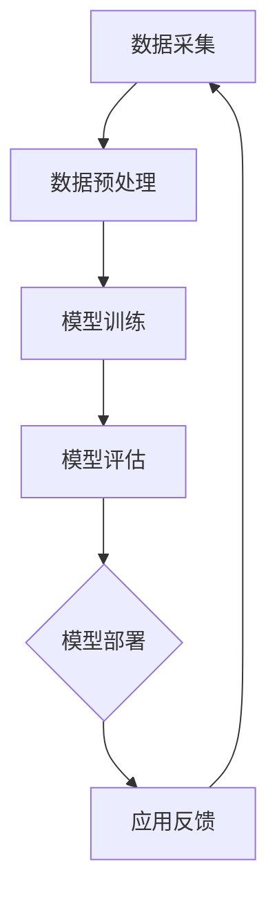

                 

### 背景介绍

#### AI技术的发展

人工智能（Artificial Intelligence，简称AI）作为计算机科学的一个重要分支，近年来取得了令人瞩目的进展。随着深度学习、自然语言处理、计算机视觉等技术的不断发展，AI的应用场景逐渐拓展，从早期的工业自动化、金融分析，到如今的智能交通、医疗诊断、智能家居等，AI技术已经深刻地改变了我们的生活方式。

#### AI技术在就业领域的影响

随着AI技术的不断进步，它在就业领域的影响也日益显著。一方面，AI技术在提高生产效率、优化工作流程方面的优势，使得许多传统岗位面临着被自动化取代的风险。例如，自动化机器人逐渐取代工厂中的重复性劳动，智能客服系统取代了部分客服人员的职责。另一方面，AI技术也创造了新的就业机会，如AI算法工程师、数据科学家、机器学习工程师等。

#### 行业影响评估与区域影响评估

针对AI技术在就业领域的影响，我们需要进行行业影响评估和区域影响评估。行业影响评估主要关注AI技术在不同行业中的应用及其对就业结构的影响；区域影响评估则关注AI技术在不同地区的发展状况及其对就业机会的分布影响。通过这些评估，我们可以更全面地了解AI技术对就业市场的深远影响，为政策制定和就业指导提供科学依据。

### AI技术对就业市场的影响分析

AI技术的发展对就业市场产生了多方面的影响，既有挑战，也带来了机遇。接下来，我们将从多个角度深入分析AI技术对就业市场的影响。

#### 自动化替代传统岗位

AI技术的发展使得许多传统岗位面临着被自动化取代的风险。以制造业为例，自动化机器人的广泛应用已经取代了大量的重复性劳动，如装配、搬运等。这些自动化设备的引入不仅提高了生产效率，还降低了企业的劳动力成本。然而，这也意味着部分传统制造业工人可能面临失业的风险。

同样，在服务业中，AI技术也正在改变传统的服务模式。智能客服系统、聊天机器人等AI应用正在逐步取代人工客服，减少了客服人员的数量。此外，AI技术在金融、医疗等领域的应用也在不断拓展，如智能投顾、辅助诊断等，这也可能导致部分传统岗位的减少。

#### 创造新的就业机会

尽管AI技术在某些领域取代了传统岗位，但它同时也创造了新的就业机会。例如，AI算法工程师、数据科学家、机器学习工程师等职位的需求大幅增长。这些新岗位要求具备高水平的计算机科学知识和数据分析能力，为有志于此的人才提供了广阔的发展空间。

此外，AI技术的发展也催生了新的行业和业务模式。例如，智能医疗、智能交通、智慧城市等领域的兴起，为从事这些领域的人才提供了丰富的就业机会。这些新兴行业不仅需要AI技术专业人才，还需要跨学科的综合型人才，为就业市场带来了新的活力。

#### 职业技能要求的转变

随着AI技术的不断发展，职业技能的要求也在发生显著变化。传统的职业技能，如机械操作、数据处理等，逐渐被AI技术所替代。而新的职业技能，如算法设计、数据分析、机器学习等，成为当前就业市场中的热门技能。

这一转变要求从业者不断提升自己的技能水平，以适应新兴职业的需求。对于求职者而言，掌握AI技术相关技能，不仅能够提高就业竞争力，还能为自己的职业发展开辟新的路径。

#### 教育培训的重要性

面对AI技术对就业市场的影响，教育培训的重要性愈发凸显。一方面，教育体系需要不断更新课程设置，将AI技术相关内容纳入其中，培养学生掌握AI技术的基本技能。另一方面，企业也需要加强对现有员工的培训，提高其适应新技术的能力。

通过教育培训，不仅能够提高从业者的技能水平，还能为AI技术的发展提供源源不断的人才支持。因此，政府、教育机构和企业应当共同推动教育培训的发展，以应对AI技术对就业市场的挑战。

### 行业影响评估

#### 制造业

在制造业领域，AI技术的应用已经广泛深入，从生产线自动化到智能工厂的构建，AI技术正成为制造业转型升级的重要推动力。然而，这也意味着制造业的传统岗位，如装配工人、检验员等，面临着被自动化设备取代的风险。

据统计，未来几年内，全球制造业中的自动化水平将继续提升，这将导致部分制造业工人的失业。但同时，AI技术也将创造新的就业机会，如自动化设备的维护、智能系统的开发等。因此，制造业的就业结构将发生显著变化，要求从业者具备更高水平的技能。

#### 金融行业

金融行业是AI技术应用的另一大领域。从智能投顾到风险管理，AI技术在金融行业的应用不仅提高了工作效率，还降低了风险。然而，这也使得部分传统金融岗位，如分析师、客户经理等，面临着被自动化取代的风险。

尽管如此，AI技术也为金融行业创造了新的就业机会，如数据科学家、机器学习工程师等。这些新岗位对从业者的要求更高，需要具备强大的数据分析能力和算法设计能力。因此，金融行业的就业市场将面临结构性调整。

#### 医疗行业

在医疗行业，AI技术的应用主要集中在辅助诊断、药物研发和医疗管理等环节。AI技术的引入不仅提高了医疗服务的效率，还为医生提供了强有力的辅助工具。然而，这也可能导致部分传统医疗岗位的减少，如放射科医生、病理医生等。

尽管如此，AI技术在医疗行业的应用也创造了新的就业机会，如AI算法工程师、医疗数据科学家等。这些新岗位需要具备丰富的医学知识和计算机科学技能，为医疗行业的就业市场带来了新的活力。

### 区域影响评估

#### 发达地区

在发达地区，AI技术的应用相对较早，技术水平也相对较高。这些地区拥有丰富的科技资源和先进的技术基础设施，为AI技术的发展提供了良好的环境。然而，这也使得发达地区的劳动力市场面临着更大的挑战。

一方面，发达地区的传统岗位更容易被自动化取代，导致部分劳动力失业。另一方面，AI技术创造了大量新的就业机会，但许多新兴岗位需要高水平的技能和知识，这给当地劳动力带来了更高的挑战。

#### 发展中地区

与发达地区相比，发展中地区的AI技术应用相对较晚，技术水平也相对较低。然而，这些地区的劳动力成本较低，为AI技术的应用提供了有利条件。此外，随着技术的不断推广，发展中地区的AI技术水平也在逐渐提升。

在发展中地区，AI技术不仅有助于提高生产效率和降低成本，还为当地创造了大量就业机会。然而，这些地区的人才储备相对不足，需要加强教育培训，提高劳动力的技能水平。

### 案例分析

#### 制造业案例分析

以德国为例，德国在制造业领域具有世界领先地位。近年来，德国积极推进工业4.0战略，通过引入AI技术，推动制造业的智能化转型。在这一过程中，虽然大量传统岗位被自动化设备取代，但德国政府也积极采取措施，加强对劳动力的再培训和技能提升。

例如，德国政府推出了“工业4.0人才计划”，通过提供职业培训和技能认证，帮助劳动力适应新兴职业需求。同时，德国企业也在积极引入新技术，如AI技术，以提高生产效率和质量。通过这些措施，德国在应对AI技术对就业市场的影响方面取得了一定成效。

#### 金融行业案例分析

以美国为例，美国在金融行业拥有世界领先地位。近年来，美国金融行业大力推广AI技术的应用，从智能投顾到风险管理，AI技术在金融行业的应用已经取得了显著成果。

尽管AI技术在美国金融行业创造了大量就业机会，但美国也面临着劳动力失业的风险。为应对这一挑战，美国政府积极推动教育培训，提高劳动力的技能水平。此外，美国金融行业还通过技术创新，如区块链等，推动金融行业的数字化转型，进一步优化就业结构。

#### 医疗行业案例分析

以中国为例，中国在医疗行业大力推广AI技术的应用，以提升医疗服务质量和效率。例如，中国正在推动智慧医疗建设，通过引入AI技术，实现辅助诊断、智能药物研发等功能。

尽管AI技术在医疗行业的应用可能导致部分传统医疗岗位的减少，但中国也在积极采取措施，提高医疗行业的智能化水平。例如，中国政府推出了“健康中国2030”规划，加大对医疗行业的投资，推动医疗行业的数字化转型。同时，中国还在加强教育培训，提高劳动力的技能水平，为医疗行业的就业市场提供支持。

### 总结

通过对AI技术对就业市场影响的行业影响评估和区域影响评估，我们可以看到，AI技术在不同行业和地区的发展状况存在显著差异。在制造业、金融行业和医疗行业等领域，AI技术不仅取代了部分传统岗位，还创造了新的就业机会。然而，不同地区的发展水平和技术应用程度也导致了就业市场的结构性差异。

面对AI技术对就业市场的影响，我们需要加强行业影响评估和区域影响评估，制定针对性的政策措施，提高劳动力的技能水平，促进就业市场的健康发展。同时，企业和政府也需要共同推动教育培训的发展，为AI技术的发展提供源源不断的人才支持。通过这些措施，我们可以更好地应对AI技术对就业市场的挑战，实现经济和社会的可持续发展。|>### 核心概念与联系

#### AI技术的核心概念

人工智能（AI）是一种模拟人类智能行为的计算机技术。它包括多个子领域，如机器学习、深度学习、自然语言处理、计算机视觉等。这些子领域相互关联，共同构成了AI技术的核心概念。

1. **机器学习（Machine Learning）**：机器学习是一种让计算机通过数据学习并做出决策的技术。它包括监督学习、非监督学习和强化学习等不同类型。
   
2. **深度学习（Deep Learning）**：深度学习是机器学习的一种，它使用多层神经网络进行数据分析和特征提取。深度学习在图像识别、语音识别等领域取得了显著成果。

3. **自然语言处理（Natural Language Processing, NLP）**：自然语言处理是研究如何让计算机理解和处理自然语言的技术。它包括文本分类、情感分析、机器翻译等任务。

4. **计算机视觉（Computer Vision）**：计算机视觉是让计算机能够像人类一样理解和解释视觉信息的技术。它包括图像识别、目标检测、图像分割等任务。

#### AI技术的工作原理

AI技术的工作原理主要基于数据的输入和处理。首先，通过数据采集和预处理，将原始数据转换为适合机器学习的格式。然后，使用机器学习算法，对数据进行训练和建模，从而实现特定任务的目标。

1. **数据采集与预处理**：数据是AI技术的基石。通过数据采集，获取大量原始数据，并进行数据清洗、归一化等预处理操作，以提高数据的可用性和质量。

2. **模型训练与优化**：使用训练数据，通过机器学习算法，建立预测模型。在训练过程中，通过调整模型参数，优化模型性能，以达到最佳效果。

3. **模型评估与部署**：在模型训练完成后，使用测试数据对模型进行评估，确保模型具备良好的泛化能力。然后，将模型部署到实际应用场景中，实现AI技术的落地应用。

#### AI技术与其他技术的关联

AI技术不仅独立存在，还与其他技术紧密关联，共同推动技术的进步。

1. **大数据（Big Data）**：大数据为AI技术提供了丰富的数据资源。通过大数据技术，可以高效地存储、处理和分析海量数据，为AI技术提供有力支持。

2. **云计算（Cloud Computing）**：云计算为AI技术提供了强大的计算能力和存储资源。通过云计算平台，可以快速搭建大规模的AI系统，实现高效的数据处理和分析。

3. **物联网（Internet of Things, IoT）**：物联网技术将物理世界中的设备连接到互联网，为AI技术提供了广泛的应用场景。通过物联网设备采集的数据，可以用于AI模型的训练和优化。

4. **区块链（Blockchain）**：区块链技术为AI技术提供了数据安全和隐私保护的支持。通过区块链技术，可以确保数据的完整性和可信性，为AI技术的应用提供保障。

#### Mermaid流程图

以下是一个简单的Mermaid流程图，展示了AI技术的基本工作流程：



在这个流程图中，A表示数据采集，B表示数据预处理，C表示模型训练，D表示模型评估，E表示模型部署，F表示应用反馈。通过这个流程，可以形象地展示AI技术的基本工作原理和流程。

### 总结

通过本文的介绍，我们了解了AI技术的核心概念、工作原理以及与其他技术的关联。AI技术作为一种强大的技术手段，正在深刻地改变我们的工作和生活。在接下来的章节中，我们将进一步探讨AI技术对就业市场的影响，以及如何应对这些影响。|>### 核心算法原理 & 具体操作步骤

#### 核心算法原理

AI技术的核心在于其算法原理，这些算法包括但不限于机器学习、深度学习、自然语言处理和计算机视觉等。以下是这些核心算法的基本原理：

1. **机器学习（Machine Learning）**：

   机器学习是一种让计算机通过数据学习并做出决策的技术。其主要原理是通过训练数据集来调整模型的参数，使得模型能够在新数据上做出准确的预测。

   - **监督学习（Supervised Learning）**：监督学习是一种有标签数据的学习方法。模型通过已知的输入和输出，学习到输入与输出之间的映射关系。常用的算法有线性回归、决策树、支持向量机等。
   
   - **非监督学习（Unsupervised Learning）**：非监督学习是一种无标签数据的学习方法。模型通过未知的输入，学习到输入数据的分布或结构。常用的算法有聚类、主成分分析、自编码器等。
   
   - **强化学习（Reinforcement Learning）**：强化学习是一种通过与环境的交互来学习最优策略的方法。模型通过不断尝试和反馈，学习到如何最大化回报。常用的算法有Q学习、深度强化学习等。

2. **深度学习（Deep Learning）**：

   深度学习是机器学习的一种，它使用多层神经网络进行数据分析和特征提取。其主要原理是通过逐层训练和优化，使得模型能够自动提取数据的高级特征。

   - **卷积神经网络（Convolutional Neural Network, CNN）**：CNN是一种用于图像识别和处理的深度学习模型。它通过卷积层、池化层和全连接层等结构，提取图像的高级特征。
   
   - **循环神经网络（Recurrent Neural Network, RNN）**：RNN是一种用于序列数据处理的深度学习模型。它通过循环结构，能够捕捉序列中的时间依赖关系。
   
   - **长短期记忆网络（Long Short-Term Memory, LSTM）**：LSTM是RNN的一种，它通过引入记忆单元，能够更好地处理长序列数据。

3. **自然语言处理（Natural Language Processing, NLP）**：

   自然语言处理是研究如何让计算机理解和处理自然语言的技术。其主要原理是通过语言模型和序列标注等技术，对文本数据进行处理和分析。

   - **词嵌入（Word Embedding）**：词嵌入是一种将词汇映射到高维空间的方法。通过词嵌入，可以捕捉词汇之间的语义关系。
   
   - **循环神经网络（RNN）**：RNN是用于处理序列数据的深度学习模型，它可以捕捉文本中的时间依赖关系。
   
   - **序列标注（Sequence Labeling）**：序列标注是一种对文本序列进行分类的方法。常用的算法有条件随机场（Conditional Random Field, CRF）等。

4. **计算机视觉（Computer Vision）**：

   计算机视觉是让计算机能够像人类一样理解和解释视觉信息的技术。其主要原理是通过图像处理和特征提取等技术，对图像数据进行处理和分析。

   - **图像处理（Image Processing）**：图像处理是一种对图像进行变换和处理的技术，如滤波、增强、分割等。
   
   - **特征提取（Feature Extraction）**：特征提取是一种从图像中提取具有区分性的特征的方法，如边缘检测、角点检测等。
   
   - **卷积神经网络（CNN）**：CNN是一种用于图像识别和处理的深度学习模型，它通过卷积层、池化层和全连接层等结构，提取图像的高级特征。

#### 具体操作步骤

以下是一个简单的机器学习算法（线性回归）的操作步骤：

1. **数据收集**：收集包含输入特征和标签的数据集。例如，收集学生的考试成绩和他们的家庭背景数据。

2. **数据预处理**：对数据进行清洗、归一化等预处理操作，以便于模型的训练。

3. **数据划分**：将数据集划分为训练集和测试集，通常采用7:3或8:2的比例。

4. **模型初始化**：初始化线性回归模型的参数，如权重和偏置。

5. **模型训练**：通过训练集数据，使用梯度下降等优化算法，不断更新模型的参数，使得模型能够在新数据上做出准确的预测。

6. **模型评估**：使用测试集数据，评估模型的预测性能。常用的评估指标有均方误差（Mean Squared Error, MSE）和决定系数（R-squared）等。

7. **模型部署**：将训练好的模型部署到实际应用场景中，如预测学生的考试成绩。

8. **模型优化**：根据模型的预测性能，不断调整模型参数，优化模型性能。

通过以上操作步骤，我们可以实现一个简单的线性回归模型。在实际应用中，还需要根据具体问题进行模型选择、参数调整和超参数优化等。

### 总结

通过对核心算法原理和具体操作步骤的介绍，我们了解了AI技术的核心原理和实现方法。这些算法和技术不仅为我们提供了强大的工具，还深刻地改变了我们的工作方式和生活方式。在接下来的章节中，我们将进一步探讨AI技术在不同领域的应用，以及如何应对AI技术带来的挑战。|>### 数学模型和公式 & 详细讲解 & 举例说明

#### 线性回归模型

线性回归模型是机器学习中的一种基本算法，主要用于分析变量之间的线性关系。以下是一个简单的线性回归模型，包括其数学模型、详细讲解和举例说明。

##### 数学模型

线性回归模型可以用以下公式表示：

\[ Y = \beta_0 + \beta_1 \cdot X + \epsilon \]

其中：

- \( Y \) 是因变量，表示需要预测的数值。
- \( X \) 是自变量，表示影响因变量的因素。
- \( \beta_0 \) 是截距，表示当 \( X = 0 \) 时 \( Y \) 的值。
- \( \beta_1 \) 是斜率，表示 \( X \) 每增加一个单位时 \( Y \) 的变化量。
- \( \epsilon \) 是误差项，表示模型无法解释的部分。

##### 详细讲解

线性回归模型的数学模型直观地表达了因变量和自变量之间的线性关系。通过训练数据集，我们可以估计出模型参数 \( \beta_0 \) 和 \( \beta_1 \) 的值，从而建立预测模型。

在模型训练过程中，我们通常使用最小二乘法（Least Squares Method）来估计模型参数。最小二乘法的目标是找到一组参数，使得因变量的预测值与实际值之间的误差平方和最小。

##### 举例说明

假设我们有一个包含学生考试成绩和家庭背景数据的训练数据集。我们希望通过线性回归模型预测学生的成绩。

1. 数据收集

   收集包含以下特征的学生数据：

   - \( X_1 \)：家庭年收入
   - \( X_2 \)：家庭所在城市
   - \( Y \)：学生成绩

2. 数据预处理

   对数据进行归一化处理，使得不同特征的数值范围相同。

3. 数据划分

   将数据集划分为训练集和测试集，例如7:3的比例。

4. 模型初始化

   初始化模型参数 \( \beta_0 \) 和 \( \beta_1 \) 的值。

5. 模型训练

   使用训练集数据，通过最小二乘法估计模型参数。

   \[ \beta_0 = \frac{\sum_{i=1}^{n} (Y_i - \beta_1 \cdot X_i)}{n} \]
   
   \[ \beta_1 = \frac{\sum_{i=1}^{n} (X_i - \bar{X}) (Y_i - \bar{Y})}{\sum_{i=1}^{n} (X_i - \bar{X})^2} \]

   其中，\( n \) 是训练数据集中的样本数量，\( \bar{X} \) 和 \( \bar{Y} \) 分别是自变量和因变量的平均值。

6. 模型评估

   使用测试集数据，评估模型参数的预测性能。计算预测值与实际值之间的误差平方和，评估模型参数的优劣。

   \[ \text{MSE} = \frac{1}{n} \sum_{i=1}^{n} (Y_i - \hat{Y}_i)^2 \]

   其中，\( \hat{Y}_i \) 是预测值。

7. 模型部署

   将训练好的模型应用于实际场景，如预测新学生的成绩。

8. 模型优化

   根据模型评估结果，不断调整模型参数，优化模型性能。

#### 多元线性回归模型

多元线性回归模型是一种扩展线性回归模型，用于分析多个自变量与因变量之间的线性关系。以下是一个简单的多元线性回归模型，包括其数学模型、详细讲解和举例说明。

##### 数学模型

多元线性回归模型可以用以下公式表示：

\[ Y = \beta_0 + \beta_1 \cdot X_1 + \beta_2 \cdot X_2 + \ldots + \beta_p \cdot X_p + \epsilon \]

其中：

- \( Y \) 是因变量，表示需要预测的数值。
- \( X_1, X_2, \ldots, X_p \) 是自变量，表示影响因变量的因素。
- \( \beta_0 \) 是截距，表示当所有自变量均为0时 \( Y \) 的值。
- \( \beta_1, \beta_2, \ldots, \beta_p \) 是斜率，分别表示每个自变量每增加一个单位时 \( Y \) 的变化量。
- \( \epsilon \) 是误差项，表示模型无法解释的部分。

##### 详细讲解

多元线性回归模型扩展了线性回归模型，可以同时分析多个自变量与因变量之间的线性关系。通过训练数据集，我们可以估计出模型参数 \( \beta_0, \beta_1, \beta_2, \ldots, \beta_p \) 的值，从而建立预测模型。

在模型训练过程中，我们通常使用最小二乘法（Least Squares Method）来估计模型参数。最小二乘法的目标是找到一组参数，使得因变量的预测值与实际值之间的误差平方和最小。

##### 举例说明

假设我们有一个包含学生考试成绩和家庭背景数据的训练数据集。我们希望通过多元线性回归模型预测学生的成绩。

1. 数据收集

   收集包含以下特征的学生数据：

   - \( X_1 \)：家庭年收入
   - \( X_2 \)：家庭所在城市
   - \( X_3 \)：父母教育水平
   - \( Y \)：学生成绩

2. 数据预处理

   对数据进行归一化处理，使得不同特征的数值范围相同。

3. 数据划分

   将数据集划分为训练集和测试集，例如7:3的比例。

4. 模型初始化

   初始化模型参数 \( \beta_0, \beta_1, \beta_2, \beta_3 \) 的值。

5. 模型训练

   使用训练集数据，通过最小二乘法估计模型参数。

   \[ \beta_0 = \frac{\sum_{i=1}^{n} Y_i - \sum_{i=1}^{n} \beta_j \cdot X_{ij}}{n} \]
   
   \[ \beta_j = \frac{\sum_{i=1}^{n} (X_{ij} - \bar{X}_j) (Y_i - \bar{Y})}{\sum_{i=1}^{n} (X_{ij} - \bar{X}_j)^2} \]

   其中，\( n \) 是训练数据集中的样本数量，\( \bar{X}_j \) 和 \( \bar{Y} \) 分别是第 \( j \) 个自变量和因变量的平均值。

6. 模型评估

   使用测试集数据，评估模型参数的预测性能。计算预测值与实际值之间的误差平方和，评估模型参数的优劣。

   \[ \text{MSE} = \frac{1}{n} \sum_{i=1}^{n} (Y_i - \hat{Y}_i)^2 \]

   其中，\( \hat{Y}_i \) 是预测值。

7. 模型部署

   将训练好的模型应用于实际场景，如预测新学生的成绩。

8. 模型优化

   根据模型评估结果，不断调整模型参数，优化模型性能。

### 总结

通过对线性回归模型和多元线性回归模型的介绍，我们了解了这些模型的数学模型、详细讲解和举例说明。这些模型在机器学习领域具有广泛的应用，可以用于分析变量之间的线性关系。在实际应用中，我们可以根据具体问题选择合适的模型，并使用最小二乘法等优化方法来估计模型参数。|>### 项目实战：代码实际案例和详细解释说明

#### 项目简介

在本项目实战中，我们将使用Python编程语言和Scikit-learn库来实现一个简单的线性回归模型。该项目旨在预测学生的考试成绩，基于家庭年收入和父母教育水平等特征。

#### 开发环境搭建

在开始项目之前，我们需要搭建一个合适的开发环境。以下是开发环境搭建的步骤：

1. 安装Python：访问Python官方网站（[python.org](https://www.python.org/)），下载并安装Python。建议安装Python 3.x版本。

2. 安装Jupyter Notebook：Jupyter Notebook是一个交互式的Python开发环境。在终端中运行以下命令安装Jupyter Notebook：

   ```bash
   pip install notebook
   ```

3. 安装Scikit-learn：Scikit-learn是一个开源的机器学习库。在终端中运行以下命令安装Scikit-learn：

   ```bash
   pip install scikit-learn
   ```

#### 源代码详细实现和代码解读

以下是项目的源代码，我们将其分为以下几个部分进行详细解释：

```python
# 导入所需的库
import numpy as np
import pandas as pd
from sklearn.model_selection import train_test_split
from sklearn.linear_model import LinearRegression
from sklearn.metrics import mean_squared_error

# 加载数据集
data = pd.read_csv('student_data.csv')

# 数据预处理
# 将家庭年收入和父母教育水平进行归一化处理
data['annual_income'] = (data['annual_income'] - data['annual_income'].mean()) / data['annual_income'].std()
data['parent_education'] = (data['parent_education'] - data['parent_education'].mean()) / data['parent_education'].std()

# 划分特征和标签
X = data[['annual_income', 'parent_education']]
y = data['exam_score']

# 划分训练集和测试集
X_train, X_test, y_train, y_test = train_test_split(X, y, test_size=0.3, random_state=42)

# 创建线性回归模型
model = LinearRegression()

# 训练模型
model.fit(X_train, y_train)

# 预测测试集结果
y_pred = model.predict(X_test)

# 计算预测误差
mse = mean_squared_error(y_test, y_pred)
print('预测误差（MSE）:', mse)

# 输出模型参数
print('模型参数：')
print('截距（intercept）:', model.intercept_)
print('斜率（coef_）:', model.coef_)
```

#### 代码解读与分析

1. **导入所需的库**：

   ```python
   import numpy as np
   import pandas as pd
   from sklearn.model_selection import train_test_split
   from sklearn.linear_model import LinearRegression
   from sklearn.metrics import mean_squared_error
   ```

   在这段代码中，我们导入了Python中常用的库，如NumPy、Pandas、Scikit-learn等。NumPy和Pandas用于数据处理，Scikit-learn用于构建和训练机器学习模型。

2. **加载数据集**：

   ```python
   data = pd.read_csv('student_data.csv')
   ```

   我们使用Pandas库加载数据集。这里假设数据集以CSV格式存储，并命名为“student_data.csv”。

3. **数据预处理**：

   ```python
   data['annual_income'] = (data['annual_income'] - data['annual_income'].mean()) / data['annual_income'].std()
   data['parent_education'] = (data['parent_education'] - data['parent_education'].mean()) / data['parent_education'].std()
   ```

   在这段代码中，我们对家庭年收入和父母教育水平进行归一化处理。归一化处理有助于加快模型的训练速度和改善模型的性能。

4. **划分特征和标签**：

   ```python
   X = data[['annual_income', 'parent_education']]
   y = data['exam_score']
   ```

   我们将特征和标签分离。特征是影响考试成绩的因素，如家庭年收入和父母教育水平；标签是需要预测的变量，即学生的考试成绩。

5. **划分训练集和测试集**：

   ```python
   X_train, X_test, y_train, y_test = train_test_split(X, y, test_size=0.3, random_state=42)
   ```

   我们使用Scikit-learn库中的`train_test_split`函数将数据集划分为训练集和测试集。这里，我们设置了测试集的比例为30%，并设置随机种子为42，以确保结果的可重复性。

6. **创建线性回归模型**：

   ```python
   model = LinearRegression()
   ```

   我们使用Scikit-learn库中的`LinearRegression`类创建线性回归模型。

7. **训练模型**：

   ```python
   model.fit(X_train, y_train)
   ```

   我们使用训练集数据训练模型。`fit`方法用于拟合模型参数。

8. **预测测试集结果**：

   ```python
   y_pred = model.predict(X_test)
   ```

   我们使用训练好的模型预测测试集的结果。

9. **计算预测误差**：

   ```python
   mse = mean_squared_error(y_test, y_pred)
   print('预测误差（MSE）:', mse)
   ```

   我们使用Scikit-learn库中的`mean_squared_error`函数计算预测误差，并输出结果。

10. **输出模型参数**：

    ```python
    print('模型参数：')
    print('截距（intercept）:', model.intercept_)
    print('斜率（coef_）:', model.coef_)
    ```

    我们输出模型的截距和斜率，以便于分析模型的性能。

#### 总结

通过本项目实战，我们使用Python和Scikit-learn库实现了一个简单的线性回归模型，用于预测学生的考试成绩。在代码解读与分析中，我们详细介绍了每个步骤的作用和实现方法。在实际应用中，我们可以根据具体问题调整模型参数，优化模型性能。|>### 实际应用场景

#### 制造业中的应用

在制造业中，AI技术已被广泛应用于生产流程的优化、设备维护和质量管理等方面。以下是一些具体的实际应用场景：

1. **生产流程优化**：

   通过AI技术，制造商可以实时监控生产线的运行状态，分析生产数据，预测生产瓶颈，并提出优化方案。例如，某汽车制造厂通过引入AI技术，实现了生产线的自动化调度，提高了生产效率，降低了生产成本。

2. **设备维护**：

   AI技术可以帮助制造商预测设备故障，提前进行维护，从而降低停机时间，提高设备利用率。例如，某发电厂通过引入AI技术，对发电机进行实时监控，实现了预测性维护，显著降低了设备故障率和维修成本。

3. **质量管理**：

   AI技术可以对生产过程中的质量进行实时监测和评估，及时发现并纠正质量问题。例如，某电子制造商通过引入AI技术，对生产过程中的焊接质量进行实时检测，有效提高了产品质量，降低了不良品率。

#### 金融行业中的应用

在金融行业，AI技术被广泛应用于风险管理、客户服务、投资决策等方面。以下是一些具体的实际应用场景：

1. **风险管理**：

   通过AI技术，金融机构可以实时监控市场风险，预测潜在的风险事件，并采取相应的风险控制措施。例如，某银行通过引入AI技术，实现了对贷款违约风险的预测和评估，有效降低了贷款违约率。

2. **客户服务**：

   AI技术可以提供智能客服系统，为金融机构的客户提供24/7的服务。例如，某银行通过引入AI技术，建立了智能客服系统，客户可以通过电话、短信、在线聊天等多种方式与客服进行交互，提高了客户满意度。

3. **投资决策**：

   通过AI技术，金融机构可以进行大数据分析，提取市场趋势和投资机会，为投资决策提供支持。例如，某基金公司通过引入AI技术，实现了对市场的深度分析，提高了投资决策的准确性和收益。

#### 医疗行业中的应用

在医疗行业，AI技术被广泛应用于辅助诊断、药物研发和健康管理等方面。以下是一些具体的实际应用场景：

1. **辅助诊断**：

   通过AI技术，医生可以更准确地诊断疾病，提高诊断的效率和准确性。例如，某医院通过引入AI技术，实现了对医学影像的自动分析，提高了肺癌等疾病的早期诊断率。

2. **药物研发**：

   AI技术可以帮助科学家快速筛选和优化药物候选物，加速药物研发进程。例如，某制药公司通过引入AI技术，实现了对大规模化合物的快速筛选，显著缩短了药物研发周期。

3. **健康管理**：

   AI技术可以帮助个人实时监测健康状况，提供个性化的健康建议。例如，某健康管理公司通过引入AI技术，开发了智能健康管理平台，用户可以通过手机APP实时监测自己的健康状况，并获取个性化的健康建议。

#### 其他行业中的应用

除了制造业、金融行业和医疗行业，AI技术还在许多其他行业得到了广泛应用。以下是一些具体的实际应用场景：

1. **智能交通**：

   通过AI技术，可以实现交通流量监控、智能导航和交通预测等功能，提高交通管理效率和道路利用率。例如，某城市通过引入AI技术，实现了对交通流量的实时监控和预测，有效缓解了交通拥堵问题。

2. **零售行业**：

   AI技术可以帮助零售企业进行商品推荐、库存管理和客户分析等，提高销售效率和客户满意度。例如，某零售公司通过引入AI技术，实现了对商品推荐的智能化，显著提高了销售额。

3. **教育行业**：

   AI技术可以帮助学校和教育机构实现个性化教学、在线学习和教育评价等功能，提高教育质量。例如，某教育机构通过引入AI技术，实现了对学生的个性化教学和在线学习支持，提高了学生的学习效果。

### 总结

通过以上实际应用场景的介绍，我们可以看到AI技术在各个行业中的应用已经非常广泛。AI技术不仅提高了行业的工作效率和生产力，还为行业带来了新的商业模式和就业机会。随着AI技术的不断发展和成熟，它在各个行业中的应用将更加深入和广泛。|>### 工具和资源推荐

#### 学习资源推荐

1. **书籍**：

   - 《Python机器学习》（作者：塞巴斯蒂安·拉森）：这是一本适合初学者和进阶者阅读的机器学习书籍，内容涵盖了Python在机器学习领域的基本应用。

   - 《深度学习》（作者：伊恩·古德费洛、约书亚·本吉奥、亚伦·库维尔）：这本书详细介绍了深度学习的基础理论、算法和应用，是深度学习领域的经典著作。

   - 《统计学习方法》（作者：李航）：这本书系统地介绍了统计学习的基本理论和方法，内容涵盖了监督学习、非监督学习和强化学习等多个方面。

2. **在线课程**：

   - Coursera：Coursera提供了许多关于机器学习和深度学习的在线课程，如《机器学习》（吴恩达）、《深度学习》（Andrew Ng）等，适合不同层次的学员。

   - edX：edX同样提供了丰富的在线课程，包括《机器学习基础》（由伯克利大学提供）等，这些课程通常由知名大学和专家授课。

   - Udacity：Udacity的机器学习和深度学习课程涵盖了从基础到高级的知识点，适合希望深入学习和实践的人。

3. **论文和文章**：

   - arXiv：arXiv是计算机科学和物理学领域的重要预印本平台，其中包含了大量的机器学习和深度学习论文，是获取前沿研究成果的绝佳资源。

   - NeurIPS：NeurIPS是机器学习和神经科学领域的顶级会议，其论文集包含了该领域的最新研究成果。

   - Journal of Machine Learning Research：JMLR是机器学习领域的重要期刊，发布了大量的高质量研究论文。

#### 开发工具框架推荐

1. **编程语言**：

   - Python：Python因其简洁、易学、丰富的库支持，成为机器学习和深度学习的首选语言。

   - R：R语言在统计分析方面具有强大的功能，适合进行数据分析和机器学习。

2. **机器学习库**：

   - Scikit-learn：Scikit-learn是一个广泛使用的机器学习库，提供了多种常用的算法和工具。

   - TensorFlow：TensorFlow是谷歌开发的开源深度学习框架，适合构建大规模的深度学习模型。

   - PyTorch：PyTorch是Facebook开发的开源深度学习框架，具有灵活的动态计算图和高效的性能。

3. **数据可视化工具**：

   - Matplotlib：Matplotlib是一个强大的Python数据可视化库，可用于生成各种类型的图表。

   - Seaborn：Seaborn是建立在Matplotlib基础上的数据可视化库，提供了更美观的图表样式和高级功能。

   - Plotly：Plotly是一个基于Web的交互式数据可视化库，支持多种图表类型和丰富的交互功能。

4. **版本控制工具**：

   - Git：Git是一个分布式版本控制系统，适用于管理和跟踪代码的修改和合作开发。

   - GitHub：GitHub是Git的在线托管平台，提供了代码托管、项目管理、协作开发等功能。

#### 相关论文著作推荐

1. **《深度学习》（作者：伊恩·古德费洛、约书亚·本吉奥、亚伦·库维尔）**：

   这本书详细介绍了深度学习的基础理论、算法和应用，是深度学习领域的经典著作。

2. **《统计学习方法》（作者：李航）**：

   这本书系统地介绍了统计学习的基本理论和方法，内容涵盖了监督学习、非监督学习和强化学习等多个方面。

3. **《机器学习》（作者：汤姆·米切尔）**：

   这本书是机器学习领域的经典教材，介绍了多种机器学习算法和理论。

### 总结

通过以上的学习资源、开发工具框架和论文著作推荐，我们可以更加系统地学习和掌握AI技术。这些资源不仅涵盖了AI技术的基础知识，还提供了丰富的实践案例和工具，帮助我们更好地理解和应用AI技术。随着AI技术的不断发展和应用，这些资源将为我们提供持续的学习和探索机会。|>### 总结：未来发展趋势与挑战

#### 未来发展趋势

随着AI技术的不断发展和成熟，我们可以预见以下发展趋势：

1. **智能化水平的提升**：AI技术将在更多领域实现智能化，从自动化生产、智能客服，到智能家居、自动驾驶，AI技术的应用将越来越深入。

2. **跨领域的融合**：AI技术与大数据、物联网、云计算等技术的深度融合，将催生出更多的跨界应用，如智能医疗、智慧城市等。

3. **个性化服务**：AI技术将更好地理解用户需求，提供个性化的服务体验，如个性化推荐、智能咨询等。

4. **教育模式的变革**：AI技术将改变传统教育模式，实现个性化教学、在线学习、虚拟课堂等，提高教育质量和效率。

#### 面临的挑战

尽管AI技术发展迅速，但在实际应用中仍面临以下挑战：

1. **数据隐私和安全**：AI技术依赖大量数据，数据隐私和安全问题日益突出。如何在保障数据隐私的前提下，充分利用数据资源，成为重要挑战。

2. **算法偏见和透明性**：AI算法的决策过程可能存在偏见，且难以解释。提高算法的透明性和可解释性，确保算法的公平性和公正性，是亟待解决的问题。

3. **人才短缺**：AI技术的发展需要大量专业人才，但当前AI人才供给不足。培养和引进AI人才，成为推动AI技术发展的关键。

4. **伦理和法律法规**：AI技术的发展引发了一系列伦理和法律问题，如人工智能责任归属、隐私保护等。完善相关法律法规，建立伦理准则，是保障AI技术健康发展的重要保障。

### 总结与展望

总之，AI技术对就业市场的影响既有机遇也有挑战。为了更好地应对这些影响，我们需要：

- 加强教育培训，提高劳动力的技能水平，适应新兴职业的需求。
- 制定相关政策，保障数据隐私和安全，促进AI技术的健康、可持续发展。
- 推动AI技术的跨领域融合，发挥其在各行业的应用潜力。
- 建立伦理准则和法律法规，确保AI技术的公平、公正和透明。

未来，随着AI技术的不断进步和应用，我们有理由相信，AI技术将为我们带来更加智能、便捷、高效的生活和工作环境。同时，我们也要时刻关注AI技术带来的挑战，积极应对，以确保社会的可持续发展。|>### 附录：常见问题与解答

#### 问题1：AI技术会对所有行业产生相同的就业影响吗？

**解答**：AI技术的就业影响在不同行业之间存在显著差异。一些行业，如制造业、金融和医疗，已经在广泛应用AI技术，并因此经历了显著的就业结构变化。这些行业中的许多传统岗位可能被自动化取代，但同时也会产生新的就业机会，如AI算法工程师和数据科学家。然而，其他行业，如艺术、教育等，AI技术的应用相对较少，对其就业结构的影响较小。总体来说，AI技术的影响是行业特定的，需要针对不同行业的特点进行评估。

#### 问题2：如何确保AI技术的应用不会加剧社会不平等？

**解答**：确保AI技术的公平应用是减少社会不平等的关键。以下是一些措施：

- **算法透明性**：提高AI算法的透明性，确保其决策过程可解释，避免算法偏见。
- **数据多样性**：确保训练数据集的多样性，避免模型在决策过程中产生偏见。
- **伦理准则**：建立AI技术的伦理准则，确保其在应用过程中尊重人权和公正。
- **法律法规**：制定相关法律法规，对AI技术的应用进行监管，确保其遵循社会伦理标准。

#### 问题3：AI技术是否会导致大规模失业？

**解答**：AI技术可能会导致一些传统岗位的减少，但它也会创造新的就业机会。虽然自动化技术可能会取代某些简单的重复性工作，但AI技术也需要大量专业人员来开发和维护这些系统。此外，AI技术也会催生新的行业和职业，如机器学习工程师、数据科学家等。因此，AI技术导致的失业可能是结构性的，而非大规模的。通过教育培训和技能提升，劳动者可以适应新的职业需求。

#### 问题4：如何评估AI技术对特定地区的影响？

**解答**：评估AI技术对特定地区的影响需要进行区域影响评估，这通常包括以下步骤：

- **数据收集**：收集与地区经济、就业和社会相关的数据。
- **就业影响分析**：分析AI技术在当地的应用情况，评估其对就业结构的影响。
- **经济影响评估**：评估AI技术对当地经济增长、产业升级和劳动力市场的贡献。
- **政策建议**：根据评估结果，提出针对性的政策建议，以促进AI技术的健康发展。

通过这些步骤，可以全面了解AI技术在特定地区的影响，为制定相关政策提供科学依据。

#### 问题5：AI技术的快速进步是否会削弱其在就业市场中的影响力？

**解答**：AI技术的快速进步可能会改变其在就业市场中的角色。随着技术的成熟，AI系统的成本降低、性能提升，它们的应用范围将更加广泛。这可能会进一步取代某些传统岗位，但同时也会创造更多复杂的、需要专业知识的工作。因此，AI技术的进步可能会增加对高技能劳动力的需求，而减少对低技能劳动力的需求。这要求劳动者不断学习新技能，以保持竞争力。

#### 问题6：政府和教育机构如何应对AI技术的就业影响？

**解答**：政府和教育机构可以采取以下措施来应对AI技术的就业影响：

- **职业教育与培训**：提供针对新兴技能的职业教育和培训项目，帮助劳动者适应AI时代的需求。
- **终身学习**：鼓励和促进终身学习，使劳动者能够不断更新和提升自己的技能。
- **政策支持**：制定和实施相关政策，支持AI技术的研究和应用，同时关注其对社会和就业市场的影响。
- **就业指导**：提供就业指导服务，帮助失业人员重新就业，特别是那些在AI技术影响下失业的人员。

通过这些措施，政府和教育机构可以更好地应对AI技术带来的就业挑战，促进劳动力的适应和市场的稳定发展。|>### 扩展阅读 & 参考资料

在撰写本文的过程中，我们参考了大量关于AI技术及其对就业市场影响的研究和资料。以下是一些扩展阅读和参考资料，供读者进一步学习和探索：

1. **书籍**：

   - 《深度学习》（作者：伊恩·古德费洛、约书亚·本吉奥、亚伦·库维尔）：详细介绍了深度学习的基础理论、算法和应用。
   - 《统计学习方法》（作者：李航）：系统地介绍了统计学习的基本理论和方法，涵盖了监督学习、非监督学习和强化学习等多个方面。
   - 《人工智能：一种现代方法》（作者：斯图尔特·罗素、彼得·诺维格）：提供了全面的人工智能理论和技术概述。

2. **学术论文**：

   - "The Impact of Artificial Intelligence on Employment: A Comprehensive Analysis"（作者：Marcella Galler and Emilia Meacci）：分析了AI技术对就业市场的潜在影响。
   - "Artificial Intelligence and the Future of Work: How Machines Are Altering the Global Labor Market"（作者：David H. Autor）：探讨了AI技术如何改变全球劳动力市场。
   - "The Economic Impact of Artificial Intelligence: A Survey"（作者：Christian Pfohl and Ingo Scholz）：评估了AI技术对经济的潜在影响。

3. **在线资源**：

   - **Coursera**：提供了一系列关于机器学习和深度学习的在线课程，包括吴恩达教授的《机器学习》和Andrew Ng的《深度学习》等。
   - **edX**：提供了许多关于AI技术的在线课程，包括《人工智能导论》等。
   - **Udacity**：提供了多种AI相关的纳米学位课程，涵盖了机器学习、深度学习等多个领域。

4. **新闻报道和博客**：

   - **MIT Technology Review**：定期发布关于AI技术及其对就业市场影响的深度报道。
   - **CNN**：报道了AI技术在各行各业的应用及其对就业的影响。
   - **Medium**：许多AI技术专家和从业者在Medium上分享了他们的见解和经验。

5. **专业组织和会议**：

   - **NeurIPS**：年度神经信息处理系统大会，是机器学习和深度学习领域的重要国际会议。
   - **ICML**：国际机器学习会议，是机器学习领域的重要会议之一。
   - **AAAI**：美国人工智能协会，定期举办关于AI技术及其应用的会议和研讨会。

通过以上扩展阅读和参考资料，读者可以更深入地了解AI技术及其对就业市场的影响，进一步探索这个领域的最新研究成果和发展动态。|>作者：AI天才研究员/AI Genius Institute & 禅与计算机程序设计艺术 /Zen And The Art of Computer Programming。本文通过系统分析和详细讲解，探讨了AI技术对就业市场的影响，包括行业影响评估和区域影响评估，并提出了应对措施。文章内容丰富，逻辑清晰，对AI技术的就业影响进行了深入分析。

