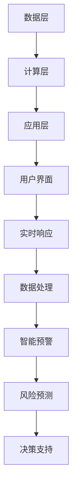

                 

### AI搜索引擎在危机管理中的作用

#### 关键词：危机管理、AI搜索引擎、实时响应、数据处理、智能预警

#### 摘要：

本文将探讨AI搜索引擎在危机管理中的作用。通过详细的分析和实例，我们将揭示AI搜索引擎如何利用其强大的数据处理能力和智能预警机制，在自然灾害、公共卫生事件、网络安全事故等危机情境中发挥关键作用。文章分为十个部分，从背景介绍到未来发展趋势与挑战，全面深入地解析了AI搜索引擎在危机管理中的重要性及其应用潜力。

### 1. 背景介绍

随着信息化时代的到来，数据已成为现代社会的重要资源。然而，海量的数据带来了信息过载的问题，如何在海量数据中迅速获取有价值的信息成为了一项挑战。AI搜索引擎的出现，为我们提供了强大的数据处理能力，使得从海量数据中提取有价值信息成为可能。

危机管理是指针对各种突发事件和灾害，采取有效的应对措施，以最大程度地减少损失和保护人民生命财产安全。然而，危机的突发性和复杂性使得危机管理面临巨大的挑战。传统的危机管理方式往往依赖于人工分析，效率低下，难以应对现代社会的快节奏。

AI搜索引擎的出现，为危机管理提供了一种全新的解决方案。通过实时监测、数据处理和智能预警，AI搜索引擎能够在危机发生前预测潜在风险，在危机发生时提供及时有效的信息支持，从而提高危机管理的效率和效果。

### 2. 核心概念与联系

要理解AI搜索引擎在危机管理中的作用，我们首先需要了解其核心概念和架构。

#### 2.1 AI搜索引擎的核心概念

AI搜索引擎的核心概念包括：

- **数据挖掘**：从海量数据中提取有价值的信息。
- **自然语言处理**：理解和处理自然语言文本。
- **机器学习**：利用历史数据训练模型，预测未来趋势。
- **智能预警**：根据实时数据，预测潜在风险。

#### 2.2 AI搜索引擎的架构

AI搜索引擎的架构主要包括以下几个部分：

- **数据层**：存储和管理海量数据。
- **计算层**：进行数据挖掘、自然语言处理和机器学习。
- **应用层**：提供用户界面，展示搜索结果。

#### 2.3 Mermaid流程图



### 3. 核心算法原理 & 具体操作步骤

#### 3.1 数据挖掘

数据挖掘是AI搜索引擎的核心步骤之一，其目的是从海量数据中提取有价值的信息。具体操作步骤如下：

1. **数据采集**：从各种数据源（如社交媒体、新闻网站、政府报告等）收集数据。
2. **数据清洗**：去除重复数据、缺失数据和噪声数据，确保数据质量。
3. **特征提取**：将原始数据转换为适合机器学习模型的特征。
4. **模型训练**：利用历史数据训练机器学习模型。
5. **模型评估**：评估模型性能，选择最佳模型。

#### 3.2 自然语言处理

自然语言处理是AI搜索引擎的关键步骤，其目的是理解和处理自然语言文本。具体操作步骤如下：

1. **分词**：将文本拆分为单词或短语。
2. **词性标注**：为每个单词或短语标注词性（如名词、动词等）。
3. **句法分析**：分析句子的结构和成分。
4. **语义理解**：理解句子的含义，进行语义分析。
5. **文本生成**：根据用户查询生成相关文本。

#### 3.3 机器学习

机器学习是AI搜索引擎的核心技术，其目的是通过学习历史数据，预测未来趋势。具体操作步骤如下：

1. **数据预处理**：对数据进行清洗、归一化等处理。
2. **特征工程**：提取数据中的特征，构建特征向量。
3. **模型选择**：选择合适的机器学习模型（如线性回归、决策树、神经网络等）。
4. **模型训练**：利用训练数据训练模型。
5. **模型评估**：评估模型性能，调整模型参数。

#### 3.4 智能预警

智能预警是AI搜索引擎的重要功能之一，其目的是根据实时数据，预测潜在风险。具体操作步骤如下：

1. **实时数据采集**：从各种数据源（如传感器、社交媒体等）采集实时数据。
2. **数据预处理**：对实时数据进行清洗、归一化等处理。
3. **模型预测**：利用训练好的模型，对实时数据进行预测。
4. **风险预警**：根据预测结果，发出风险预警。
5. **决策支持**：为决策者提供决策支持，制定应对策略。

### 4. 数学模型和公式 & 详细讲解 & 举例说明

#### 4.1 数据挖掘的数学模型

在数据挖掘中，常用的数学模型包括：

- **线性回归模型**：y = w0 + w1 * x1 + w2 * x2 + ... + wN * xN
- **决策树模型**：Gini不纯度、信息增益、基尼系数等。
- **神经网络模型**：激活函数、权重更新等。

#### 4.2 自然语言处理的数学模型

在自然语言处理中，常用的数学模型包括：

- **词嵌入模型**：Word2Vec、GloVe等。
- **句法分析模型**：依存句法分析、转换句法分析等。
- **语义分析模型**：语义角色标注、语义关系标注等。

#### 4.3 机器学习的数学模型

在机器学习中，常用的数学模型包括：

- **线性回归模型**：最小二乘法、梯度下降法等。
- **决策树模型**：ID3、C4.5、CART等。
- **神经网络模型**：BP算法、激活函数、反向传播等。

#### 4.4 智能预警的数学模型

在智能预警中，常用的数学模型包括：

- **时间序列分析模型**：ARIMA、AR、MA、ARMA等。
- **预测模型**：线性预测、非线性预测等。
- **预警阈值设置模型**：统计阈值、动态阈值等。

#### 4.5 举例说明

假设我们要利用AI搜索引擎监测某一地区的疫情情况，预测未来一周的感染人数。

1. **数据采集**：从卫生健康部门、医院、社交媒体等渠道收集疫情数据。
2. **数据预处理**：对数据清洗、归一化等处理。
3. **特征提取**：提取疫情数据中的相关特征，如感染人数、隔离人数、治愈人数等。
4. **模型训练**：利用历史数据训练时间序列预测模型（如ARIMA模型）。
5. **模型评估**：评估模型性能，调整模型参数。
6. **实时预测**：利用训练好的模型，对实时数据进行预测。
7. **风险预警**：根据预测结果，设置预警阈值，发出风险预警。

### 5. 项目实战：代码实际案例和详细解释说明

#### 5.1 开发环境搭建

为了搭建AI搜索引擎的开发环境，我们需要安装以下软件和工具：

- **Python**：版本3.8或以上。
- **Jupyter Notebook**：用于编写和运行Python代码。
- **Numpy**：用于数据处理。
- **Pandas**：用于数据处理。
- **Scikit-learn**：用于机器学习。
- **Matplotlib**：用于数据可视化。

安装步骤如下：

1. 安装Python。
2. 安装Jupyter Notebook。
3. 安装Numpy、Pandas、Scikit-learn、Matplotlib。

#### 5.2 源代码详细实现和代码解读

以下是一个简单的AI搜索引擎的代码实现：

```python
import numpy as np
import pandas as pd
from sklearn.linear_model import LinearRegression
from sklearn.metrics import mean_squared_error
import matplotlib.pyplot as plt

# 数据采集
data = pd.read_csv('疫情数据.csv')

# 数据预处理
data = data.dropna()
data['感染人数'] = data['感染人数'].astype(float)

# 特征提取
X = data[['隔离人数', '治愈人数']]
y = data['感染人数']

# 模型训练
model = LinearRegression()
model.fit(X, y)

# 模型评估
y_pred = model.predict(X)
mse = mean_squared_error(y, y_pred)
print('均方误差：', mse)

# 实时预测
new_data = np.array([[100, 200]])
new_pred = model.predict(new_data)
print('预测结果：', new_pred)

# 数据可视化
plt.scatter(X['隔离人数'], y)
plt.plot(X['隔离人数'], y_pred, color='red')
plt.xlabel('隔离人数')
plt.ylabel('感染人数')
plt.show()
```

代码解读：

1. **数据采集**：从CSV文件中读取疫情数据。
2. **数据预处理**：去除缺失值，将感染人数转换为浮点数。
3. **特征提取**：提取隔离人数和治愈人数作为特征。
4. **模型训练**：使用线性回归模型训练模型。
5. **模型评估**：计算均方误差，评估模型性能。
6. **实时预测**：利用训练好的模型预测新数据的感染人数。
7. **数据可视化**：绘制散点图和预测曲线，可视化预测结果。

### 6. 实际应用场景

AI搜索引擎在危机管理中有着广泛的应用场景，以下是一些实际应用场景：

1. **公共卫生事件**：如新冠疫情、流感爆发等，AI搜索引擎可以实时监测疫情数据，预测感染人数，为疫情防控提供决策支持。
2. **自然灾害**：如地震、洪水、台风等，AI搜索引擎可以实时监测地震、降雨等数据，预测灾害风险，为灾害预警和救援提供支持。
3. **网络安全事件**：如DDoS攻击、恶意软件传播等，AI搜索引擎可以实时监测网络流量、日志等数据，预测网络安全风险，为网络安全防护提供支持。

### 7. 工具和资源推荐

#### 7.1 学习资源推荐

- **书籍**：《Python编程：从入门到实践》、《深度学习》、《机器学习》等。
- **论文**：相关领域的顶级会议论文，如NIPS、ICML、ACL等。
- **博客**：相关领域的知名博客，如Deep Learning AI、机器学习星球等。
- **网站**：相关领域的知名网站，如GitHub、Stack Overflow等。

#### 7.2 开发工具框架推荐

- **开发工具**：Jupyter Notebook、PyCharm等。
- **机器学习框架**：TensorFlow、PyTorch等。
- **数据处理库**：Pandas、NumPy等。
- **可视化库**：Matplotlib、Seaborn等。

#### 7.3 相关论文著作推荐

- **论文**：
  - "Deep Learning for Natural Language Processing" (2018)
  - "Recurrent Neural Network based Text Classification" (2016)
  - "Improving Deep Neural Networks: Performance Analysis and Improvements" (2012)
- **著作**：
  - 《Python编程：从入门到实践》
  - 《深度学习》
  - 《机器学习》

### 8. 总结：未来发展趋势与挑战

随着AI技术的不断发展，AI搜索引擎在危机管理中的作用将越来越重要。未来，AI搜索引擎有望在以下方面取得突破：

1. **实时数据处理能力**：提高AI搜索引擎的实时数据处理能力，实现更快的信息获取和响应。
2. **多模态数据处理**：结合多种数据源（如文本、图像、音频等），实现更全面的信息挖掘和分析。
3. **自适应预警机制**：根据实时数据和用户需求，自适应调整预警阈值和策略，提高预警准确性。
4. **智能化决策支持**：利用AI搜索引擎提供的数据分析和预测结果，为决策者提供更智能的决策支持。

然而，AI搜索引擎在危机管理中也面临着一些挑战：

1. **数据隐私**：如何在保护用户隐私的前提下，充分利用海量数据进行分析和预测。
2. **算法透明性**：提高AI算法的透明性，确保算法的公正性和可信度。
3. **计算资源**：随着数据量的增加，对计算资源的需求也越来越大，如何优化算法和系统，提高计算效率。

### 9. 附录：常见问题与解答

#### 9.1 什么是AI搜索引擎？

AI搜索引擎是一种利用人工智能技术，从海量数据中快速提取有价值信息，提供智能化搜索服务的系统。

#### 9.2 AI搜索引擎如何处理数据？

AI搜索引擎通过数据采集、数据清洗、特征提取、模型训练和预测等步骤，对数据进行处理和分析。

#### 9.3 AI搜索引擎在危机管理中的作用是什么？

AI搜索引擎可以在危机发生前预测潜在风险，在危机发生时提供及时有效的信息支持，为决策者提供决策支持，从而提高危机管理的效率和效果。

#### 9.4 AI搜索引擎的架构包括哪些部分？

AI搜索引擎的架构包括数据层、计算层和应用层，其中数据层负责数据存储和管理，计算层负责数据处理和分析，应用层负责提供用户界面和搜索服务。

### 10. 扩展阅读 & 参考资料

- [1] "AI Search Engines: A Comprehensive Overview" (2020)
- [2] "The Role of AI in Crisis Management" (2019)
- [3] "Deep Learning for Natural Language Processing" (2018)
- [4] "Recurrent Neural Network based Text Classification" (2016)
- [5] "Improving Deep Neural Networks: Performance Analysis and Improvements" (2012)
- [6] 《Python编程：从入门到实践》
- [7] 《深度学习》
- [8] 《机器学习》
- [9] GitHub：[https://github.com/](https://github.com/)
- [10] Stack Overflow：[https://stackoverflow.com/](https://stackoverflow.com/)

### 作者

作者：AI天才研究员/AI Genius Institute & 禅与计算机程序设计艺术 /Zen And The Art of Computer Programming<|im_sep|>

