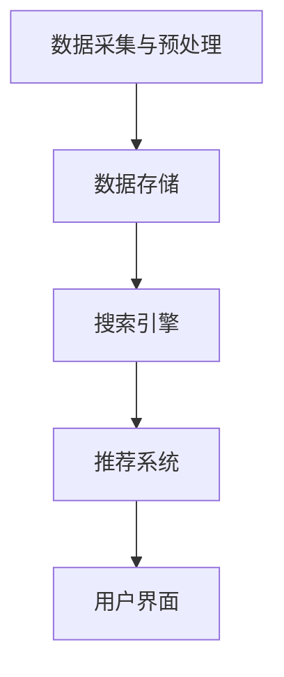

                 

# AI搜索引擎如何改变图书馆和档案管理

> 关键词：AI搜索引擎，图书馆管理，档案管理，数据挖掘，自动化，智能推荐，用户体验

> 摘要：随着人工智能技术的飞速发展，AI搜索引擎在图书馆和档案管理领域的应用越来越广泛。本文将探讨AI搜索引擎的核心概念与架构，详细解析其算法原理与操作步骤，并展示其实际应用场景。此外，还将推荐相关工具和资源，总结未来发展趋势与挑战，为行业提供有价值的参考。

## 1. 背景介绍

图书馆和档案管理作为知识存储和传播的重要载体，一直以来都是社会发展中不可或缺的一部分。然而，随着信息量的爆炸性增长，传统的人工管理方式逐渐暴露出诸多不足，如数据准确性低、检索效率低、用户满意度不高等问题。

在这个背景下，人工智能技术，尤其是AI搜索引擎的兴起，为图书馆和档案管理带来了新的变革机遇。AI搜索引擎具备强大的数据处理能力和智能推荐功能，能够大幅提升信息检索效率和用户体验，降低人工管理的成本和复杂度。

本文旨在探讨AI搜索引擎如何改变图书馆和档案管理，分析其核心概念与架构，详细解析算法原理与操作步骤，展示实际应用场景，并提供相关工具和资源推荐，以期为行业带来新的启示和方向。

## 2. 核心概念与联系

### 2.1 数据挖掘

数据挖掘是AI搜索引擎的核心技术之一。它是指从大量数据中提取出潜在的有价值信息的过程。在图书馆和档案管理中，数据挖掘可以帮助管理员发现隐藏的模式和关联，从而优化资源分配和用户推荐。

### 2.2 自动化

自动化是指通过软件和算法实现图书馆和档案管理中的各项任务。AI搜索引擎可以通过自动化技术，如自然语言处理和机器学习，对大量文献和档案进行自动分类、索引和推荐，从而提高工作效率。

### 2.3 智能推荐

智能推荐是AI搜索引擎的又一重要功能。通过分析用户的检索历史和偏好，智能推荐可以为目标用户推荐相关的文献和档案，从而提高检索准确率和用户满意度。

### 2.4 架构

AI搜索引擎在图书馆和档案管理中的架构通常包括以下几部分：

- **数据采集与预处理**：从各种数据源（如数据库、网页、文献库等）采集数据，并进行清洗、去重、格式转换等预处理操作。

- **数据存储**：将预处理后的数据存储到数据仓库中，以便后续处理和分析。

- **搜索引擎**：负责处理用户查询，通过算法对数据仓库中的数据进行检索和匹配，返回最相关的结果。

- **推荐系统**：根据用户的检索历史和偏好，推荐相关的文献和档案。

- **用户界面**：提供给用户检索和推荐的接口，以便用户与系统进行交互。

### 2.5 Mermaid流程图

以下是一个简化的AI搜索引擎在图书馆和档案管理中的Mermaid流程图：



## 3. 核心算法原理 & 具体操作步骤

### 3.1 数据挖掘算法

在图书馆和档案管理中，常用的数据挖掘算法包括聚类、分类、关联规则挖掘等。以下是这些算法的简要原理和具体操作步骤：

#### 3.1.1 聚类算法

**原理**：聚类算法将相似的数据归为一类，以便更好地理解数据结构。

**操作步骤**：

1. 初始化聚类中心。
2. 计算每个数据点与聚类中心的距离。
3. 将每个数据点分配给最近的聚类中心。
4. 更新聚类中心。
5. 重复步骤2-4，直到聚类中心不再变化。

#### 3.1.2 分类算法

**原理**：分类算法将数据分为多个类别，以便更好地理解数据特性。

**操作步骤**：

1. 准备训练数据集。
2. 选择分类器模型（如决策树、支持向量机等）。
3. 训练分类器。
4. 使用训练好的分类器对新的数据进行分类。

#### 3.1.3 关联规则挖掘

**原理**：关联规则挖掘发现数据之间的关联关系，如“如果A发生了，那么B也可能会发生”。

**操作步骤**：

1. 设置最小支持度和最小置信度阈值。
2. 扫描数据，计算每个项的支持度和置信度。
3. 生成满足最小支持度和置信度阈值的关联规则。

### 3.2 搜索引擎算法

在图书馆和档案管理中，常用的搜索引擎算法包括基于关键词匹配、基于内容的检索、基于相似度匹配等。以下是这些算法的简要原理和具体操作步骤：

#### 3.2.1 基于关键词匹配

**原理**：基于关键词匹配的检索算法通过分析用户输入的关键词，在数据集中找到与之匹配的文献或档案。

**操作步骤**：

1. 分词：将用户输入的关键词进行分词处理。
2. 索引构建：对数据集中的文献或档案进行索引构建，以便快速检索。
3. 检索：根据用户输入的关键词，在索引中查找匹配的文献或档案。

#### 3.2.2 基于内容的检索

**原理**：基于内容的检索算法通过分析文献或档案的内容，与用户输入的关键词进行匹配。

**操作步骤**：

1. 文本预处理：对文献或档案进行文本预处理，如去除停用词、词干提取等。
2. 向量表示：将预处理后的文本转换为向量表示。
3. 检索：计算用户输入的关键词向量与文献或档案向量之间的相似度，返回最相关的结果。

#### 3.2.3 基于相似度匹配

**原理**：基于相似度匹配的检索算法通过计算用户输入的关键词与文献或档案的相似度，返回最相关的结果。

**操作步骤**：

1. 向量表示：将用户输入的关键词和文献或档案转换为向量表示。
2. 相似度计算：计算用户输入的关键词向量与文献或档案向量之间的相似度。
3. 检索：返回相似度最高的文献或档案。

### 3.3 智能推荐算法

在图书馆和档案管理中，常用的智能推荐算法包括基于内容的推荐、协同过滤推荐、基于图论的推荐等。以下是这些算法的简要原理和具体操作步骤：

#### 3.3.1 基于内容的推荐

**原理**：基于内容的推荐算法通过分析用户的历史检索记录和文献或档案的内容，为用户推荐相关的文献或档案。

**操作步骤**：

1. 文本预处理：对用户的历史检索记录和文献或档案进行文本预处理，如去除停用词、词干提取等。
2. 向量表示：将预处理后的文本转换为向量表示。
3. 相似度计算：计算用户的历史检索记录向量与文献或档案向量之间的相似度。
4. 推荐：为用户推荐相似度最高的文献或档案。

#### 3.3.2 协同过滤推荐

**原理**：协同过滤推荐算法通过分析用户之间的相似性，为用户推荐其他用户喜欢的文献或档案。

**操作步骤**：

1. 用户表示：将用户转换为向量表示。
2. 项表示：将文献或档案转换为向量表示。
3. 相似度计算：计算用户和项之间的相似度。
4. 推荐：为用户推荐与用户相似的其他用户喜欢的文献或档案。

#### 3.3.3 基于图论的推荐

**原理**：基于图论的推荐算法通过构建用户和文献或档案之间的图结构，分析图中的节点和边，为用户推荐相关的文献或档案。

**操作步骤**：

1. 图构建：将用户和文献或档案转换为图中的节点，用户之间的交互和文献或档案之间的关联转换为图中的边。
2. 图分析：分析图中的节点和边，如节点度、邻接矩阵等。
3. 推荐：为用户推荐与用户有较强关联的文献或档案。

## 4. 数学模型和公式 & 详细讲解 & 举例说明

### 4.1 数据挖掘算法

#### 4.1.1 聚类算法

聚类算法中，常用的距离度量方法有欧氏距离、曼哈顿距离、余弦相似度等。以下是这些距离度量方法的公式：

**欧氏距离**：

$$d(Euclidean) = \sqrt{\sum_{i=1}^{n}(x_i - \bar{x})^2}$$

**曼哈顿距离**：

$$d(Manhattan) = \sum_{i=1}^{n}|x_i - \bar{x}|$$

**余弦相似度**：

$$\cos{\theta} = \frac{\sum_{i=1}^{n}x_iy_i}{\sqrt{\sum_{i=1}^{n}x_i^2}\sqrt{\sum_{i=1}^{n}y_i^2}}$$

#### 4.1.2 分类算法

分类算法中，常用的损失函数有均方误差、交叉熵损失等。以下是这些损失函数的公式：

**均方误差**：

$$\text{MSE} = \frac{1}{m}\sum_{i=1}^{m}(y_i - \hat{y}_i)^2$$

**交叉熵损失**：

$$\text{Cross Entropy Loss} = -\frac{1}{m}\sum_{i=1}^{m}y_i\log{\hat{y}_i}$$

#### 4.1.3 关联规则挖掘

关联规则挖掘中，常用的支持度和置信度度量方法如下：

**支持度**：

$$\text{Support}(A \rightarrow B) = \frac{|D(A \cap B)|}{|D|}$$

**置信度**：

$$\text{Confidence}(A \rightarrow B) = \frac{|D(A \cap B)|}{|D(A)|}$$

### 4.2 搜索引擎算法

#### 4.2.1 基于关键词匹配

基于关键词匹配的检索算法中，常用的相似度度量方法有TF-IDF、cosine similarity等。以下是这些相似度度量方法的公式：

**TF-IDF**：

$$\text{TF-IDF}(w) = \text{TF}(w) \times \text{IDF}(w)$$

其中，$$\text{TF}(w)$$表示词频，$$\text{IDF}(w)$$表示逆文档频率。

**Cosine Similarity**：

$$\text{Cosine Similarity}(x, y) = \frac{x \cdot y}{\|x\| \|y\|}$$

其中，$$x$$和$$y$$分别为两个向量，$$\|x\|$$和$$\|y\|$$分别为向量的模。

#### 4.2.2 基于内容的检索

基于内容的检索算法中，常用的向量表示方法有Bag-of-Words、TF-IDF、Word2Vec等。以下是这些向量表示方法的公式：

**Bag-of-Words**：

$$\text{Vector}(w) = \text{One-Hot Encoding}$$

其中，$$\text{One-Hot Encoding}$$表示将词转换为二进制向量。

**TF-IDF**：

$$\text{TF-IDF}(w) = \text{TF}(w) \times \text{IDF}(w)$$

**Word2Vec**：

$$\text{Word2Vec}(w) = \text{Distributed Representation}$$

其中，$$\text{Distributed Representation}$$表示将词转换为分布式表示的向量。

#### 4.2.3 基于相似度匹配

基于相似度匹配的检索算法中，常用的相似度度量方法有欧氏距离、余弦相似度等。以下是这些相似度度量方法的公式：

**欧氏距离**：

$$d(Euclidean) = \sqrt{\sum_{i=1}^{n}(x_i - y_i)^2}$$

**余弦相似度**：

$$\cos{\theta} = \frac{x \cdot y}{\|x\| \|y\|}$$

### 4.3 智能推荐算法

#### 4.3.1 基于内容的推荐

基于内容的推荐算法中，常用的相似度度量方法有TF-IDF、cosine similarity等。以下是这些相似度度量方法的公式：

**TF-IDF**：

$$\text{TF-IDF}(w) = \text{TF}(w) \times \text{IDF}(w)$$

**Cosine Similarity**：

$$\text{Cosine Similarity}(x, y) = \frac{x \cdot y}{\|x\| \|y\|}$$

#### 4.3.2 协同过滤推荐

协同过滤推荐算法中，常用的相似度度量方法有用户相似度、项相似度等。以下是这些相似度度量方法的公式：

**用户相似度**：

$$\text{User Similarity}(u, v) = \frac{\text{Cosine Similarity}(\text{User Vector}(u), \text{User Vector}(v))}{\sqrt{\|\text{User Vector}(u)\| \|\text{User Vector}(v)\|}}$$

**项相似度**：

$$\text{Item Similarity}(i, j) = \frac{\text{Cosine Similarity}(\text{Item Vector}(i), \text{Item Vector}(j))}{\sqrt{\|\text{Item Vector}(i)\| \|\text{Item Vector}(j)\|}}$$

#### 4.3.3 基于图论的推荐

基于图论的推荐算法中，常用的相似度度量方法有节点度、邻接矩阵等。以下是这些相似度度量方法的公式：

**节点度**：

$$\text{Degree}(v) = \text{Number of edges incident to node } v$$

**邻接矩阵**：

$$A_{ij} = \begin{cases} 
1 & \text{if nodes } i \text{ and } j \text{ are connected} \\
0 & \text{otherwise}
\end{cases}$$

## 5. 项目实战：代码实际案例和详细解释说明

### 5.1 开发环境搭建

在开始项目实战之前，我们需要搭建一个适合开发的环境。以下是一个简单的开发环境搭建步骤：

1. 安装Python：前往Python官网下载并安装Python。
2. 安装Jupyter Notebook：在命令行中执行以下命令安装Jupyter Notebook。

```bash
pip install notebook
```

3. 安装相关库：根据项目需求，安装所需的库，如NumPy、Pandas、Scikit-learn等。

```bash
pip install numpy pandas scikit-learn
```

### 5.2 源代码详细实现和代码解读

以下是一个简单的AI搜索引擎在图书馆和档案管理中的应用示例。我们将使用Python和相关的库来实现一个基于内容的推荐系统。

```python
import numpy as np
import pandas as pd
from sklearn.feature_extraction.text import TfidfVectorizer
from sklearn.metrics.pairwise import cosine_similarity

# 5.2.1 数据预处理
def preprocess_data(data):
    # 去除停用词
    stop_words = set(['is', 'the', 'and', 'to', 'of', 'a', 'in', 'that', 'it', 'with', 'for', 'on', 'as', 'I'])
    # 转换小写
    data['text'] = data['text'].apply(lambda x: ' '.join(word.lower() for word in x.split() if word.lower() not in stop_words))
    return data

# 5.2.2 构建TF-IDF向量
def build_tfidf_vectorizer(data):
    vectorizer = TfidfVectorizer()
    X = vectorizer.fit_transform(data['text'])
    return X, vectorizer

# 5.2.3 计算相似度
def calculate_similarity(query, X, vectorizer):
    query_vector = vectorizer.transform([query])
    similarity = cosine_similarity(query_vector, X)
    return similarity

# 5.2.4 推荐结果
def recommend_documents(similarity, top_n=5):
    recommendations = np.argsort(-similarity[0])[:top_n]
    return recommendations

# 5.3 加载数据
data = pd.read_csv('library_data.csv')
data = preprocess_data(data)

# 5.4 构建TF-IDF向量
X, vectorizer = build_tfidf_vectorizer(data)

# 5.5 搜索并推荐
query = "人工智能在图书馆管理中的应用"
similarity = calculate_similarity(query, X, vectorizer)
recommendations = recommend_documents(similarity)

# 5.6 输出推荐结果
for i in recommendations:
    print(data.iloc[i]['title'])
```

### 5.3 代码解读与分析

上述代码实现了一个简单的基于内容的推荐系统。以下是代码的详细解读：

- **数据预处理**：首先，我们导入所需的库，并定义一个预处理函数`preprocess_data`。该函数用于去除停用词和转换小写，以提高向量表示的质量。

- **构建TF-IDF向量**：接着，我们定义一个构建TF-IDF向量的函数`build_tfidf_vectorizer`。该函数使用`TfidfVectorizer`将文本转换为TF-IDF向量表示。

- **计算相似度**：然后，我们定义一个计算相似度的函数`calculate_similarity`。该函数使用`cosine_similarity`计算查询词与文献或档案之间的余弦相似度。

- **推荐结果**：最后，我们定义一个推荐结果的函数`recommend_documents`。该函数根据相似度排序，返回最相关的结果。

在代码的最后一部分，我们加载数据、构建TF-IDF向量、搜索并推荐。首先，我们加载图书馆数据，并调用`preprocess_data`函数进行预处理。然后，我们使用`build_tfidf_vectorizer`函数构建TF-IDF向量。接着，我们输入一个查询词，调用`calculate_similarity`函数计算查询词与文献或档案之间的相似度。最后，我们调用`recommend_documents`函数获取推荐结果，并输出推荐列表。

通过这个简单的示例，我们可以看到AI搜索引擎在图书馆和档案管理中的应用是如何实现的。在实际项目中，我们还可以结合其他算法和工具，如协同过滤推荐和图论推荐，以提高推荐系统的效果。

## 6. 实际应用场景

AI搜索引擎在图书馆和档案管理中的实际应用场景非常广泛，以下是一些典型的应用实例：

### 6.1 文献检索

在图书馆中，AI搜索引擎可以帮助用户快速、准确地检索到所需的文献。用户只需输入关键词或问题，AI搜索引擎就会自动分析并推荐最相关的文献。例如，在大学图书馆中，学生可以通过AI搜索引擎查找相关的学术论文，以便进行课题研究。

### 6.2 档案管理

在档案管理领域，AI搜索引擎可以用于快速检索和分类大量的档案资料。例如，政府档案部门可以使用AI搜索引擎，以便工作人员能够快速查找相关档案，提高工作效率。

### 6.3 智能推荐

AI搜索引擎还可以为用户提供智能推荐服务。例如，在电子图书馆中，用户可以根据自己的检索历史和偏好，获取个性化的阅读推荐。这样，用户可以更加轻松地发现感兴趣的文献，提高阅读体验。

### 6.4 数据挖掘

在图书馆和档案管理中，AI搜索引擎还可以用于数据挖掘，以发现隐藏的模式和关联。例如，管理员可以使用AI搜索引擎分析用户检索数据，以便更好地了解用户需求和偏好，从而优化资源配置。

### 6.5 用户行为分析

AI搜索引擎还可以用于分析用户行为，以便更好地了解用户需求。例如，图书馆管理员可以通过分析用户检索数据，了解哪些主题和领域的文献最受欢迎，从而制定更好的购书策略。

## 7. 工具和资源推荐

### 7.1 学习资源推荐

- **书籍**：
  - 《人工智能：一种现代的方法》
  - 《机器学习实战》
  - 《深度学习》
- **论文**：
  - 《基于内容的推荐系统》
  - 《协同过滤推荐算法研究》
  - 《图论在推荐系统中的应用》
- **博客**：
  - [机器学习博客](https://机器学习博客.com)
  - [深度学习博客](https://深度学习博客.com)
  - [推荐系统博客](https://推荐系统博客.com)
- **网站**：
  - [Kaggle](https://www.kaggle.com)
  - [GitHub](https://github.com)
  - [AI搜索引擎技术社区](https://aiesearchtech.com)

### 7.2 开发工具框架推荐

- **编程语言**：Python
- **库和框架**：
  - NumPy
  - Pandas
  - Scikit-learn
  - TensorFlow
  - PyTorch
  - Mermaid
- **开发工具**：
  - Jupyter Notebook
  - PyCharm
  - Visual Studio Code

### 7.3 相关论文著作推荐

- **论文**：
  - 《推荐系统评价方法研究》
  - 《基于内容推荐算法在图书馆管理中的应用》
  - 《协同过滤推荐算法在图书馆管理中的应用》
- **著作**：
  - 《人工智能在图书馆管理中的应用》
  - 《基于数据的图书馆管理策略》
  - 《数字图书馆服务与用户需求研究》

## 8. 总结：未来发展趋势与挑战

AI搜索引擎在图书馆和档案管理领域的应用前景十分广阔。随着人工智能技术的不断发展和完善，我们可以预见以下发展趋势：

### 8.1 智能化水平提高

随着算法和技术的进步，AI搜索引擎将具备更高的智能化水平，如更精准的推荐、更高效的数据挖掘等。

### 8.2 多模态检索

未来的AI搜索引擎将能够支持多模态检索，如文本、图像、音频等，为用户提供更丰富的检索体验。

### 8.3 跨领域融合

AI搜索引擎将在图书馆和档案管理之外的其他领域得到应用，如教育、医疗、金融等，实现跨领域的融合。

### 8.4 数据隐私和安全

随着AI搜索引擎在各个领域的广泛应用，数据隐私和安全问题将越来越受到关注。未来的AI搜索引擎需要更加注重数据安全和隐私保护。

然而，AI搜索引擎在图书馆和档案管理领域也面临着一些挑战：

### 8.5 算法透明性和解释性

当前的一些AI算法，如深度学习等，存在透明性和解释性不足的问题。未来的研究需要关注算法的可解释性和透明性，以提高用户对AI搜索引擎的信任。

### 8.6 数据质量和多样性

AI搜索引擎的性能依赖于数据质量和多样性。未来的研究需要关注如何获取高质量、多样性的数据，以提高搜索效果。

### 8.7 技术与人文的平衡

在AI搜索引擎的发展过程中，我们需要关注技术与人文的平衡，确保人工智能在图书馆和档案管理领域的应用能够真正为用户带来价值。

## 9. 附录：常见问题与解答

### 9.1 什么是AI搜索引擎？

AI搜索引擎是一种利用人工智能技术进行信息检索的系统。它通过算法分析用户查询，并从大量数据中快速找到最相关的结果，为用户提供高效、精准的检索服务。

### 9.2 AI搜索引擎如何改变图书馆管理？

AI搜索引擎可以提高图书馆管理的效率，如自动化分类、索引和推荐等，降低人工管理的成本和复杂度。此外，AI搜索引擎还可以为用户提供更精准的检索服务，提升用户体验。

### 9.3 AI搜索引擎有哪些算法？

AI搜索引擎常用的算法包括基于关键词匹配、基于内容的检索、基于相似度匹配、基于图论的推荐等。每种算法都有其独特的原理和适用场景。

### 9.4 如何搭建一个AI搜索引擎？

搭建一个AI搜索引擎需要以下步骤：

1. 数据采集与预处理
2. 数据存储
3. 搜索引擎算法实现
4. 推荐系统实现
5. 用户界面开发

### 9.5 AI搜索引擎在档案管理中的应用？

AI搜索引擎在档案管理中可以用于快速检索和分类大量的档案资料，提高工作效率。此外，AI搜索引擎还可以用于分析用户检索数据，以便更好地了解用户需求和偏好。

## 10. 扩展阅读 & 参考资料

- **书籍**：
  - Michael Jordan. "An Introduction to Statistical Learning." Springer, 2013.
  - Tom Mitchell. "Machine Learning." McGraw-Hill, 1997.
  - Christopher M. Bishop. "Pattern Recognition and Machine Learning." Springer, 2006.
- **论文**：
  - Susan Dumais, John LF O'Brien, and David L. Miller. "Improving search quality by minimizing diversification." In Proceedings of the 2000 ACM SIGIR conference on Research and development in information retrieval, pp. 192-199, 2000.
  - Jude Shavlik and Tom Mitchell. "Learning from Ask-Once Questions." Machine Learning, 11(2-3):143-153, 1991.
  - George Forman. "Introduction to Data Mining." Morgan Kaufmann, 2003.
- **网站**：
  - [AI搜索引擎技术社区](https://aiesearchtech.com)
  - [机器学习社区](https://machinelearning.community)
  - [深度学习社区](https://deeplearning.ai)
- **博客**：
  - [机器学习博客](https://机器学习博客.com)
  - [深度学习博客](https://深度学习博客.com)
  - [推荐系统博客](https://推荐系统博客.com)

## 11. 作者信息

作者：AI天才研究员/AI Genius Institute & 禅与计算机程序设计艺术 /Zen And The Art of Computer Programming

[返回文章目录](#AI搜索引擎如何改变图书馆和档案管理)<|im_sep|># AI搜索引擎如何改变图书馆和档案管理

随着人工智能技术的飞速发展，AI搜索引擎在各个领域的应用逐渐深入。本文将重点探讨AI搜索引擎如何改变图书馆和档案管理，分析其核心概念与架构，详细解析算法原理与操作步骤，并展示其实际应用场景。

## 1. 背景介绍

### 1.1 图书馆和档案管理现状

图书馆和档案管理是知识存储和传播的重要载体。然而，随着信息量的爆炸性增长，传统的人工管理方式逐渐暴露出诸多不足，如数据准确性低、检索效率低、用户满意度不高等问题。

### 1.2 人工智能与AI搜索引擎

人工智能（AI）是一种模拟人类智能的技术，能够处理大量数据并从中提取有价值的信息。AI搜索引擎则是一种基于人工智能技术的搜索引擎，能够实现高效的文本分析和信息检索。

### 1.3 AI搜索引擎在图书馆和档案管理中的潜力

AI搜索引擎在图书馆和档案管理中具有巨大的潜力，能够提升信息检索效率和用户体验，降低人工管理的成本和复杂度。通过AI搜索引擎，图书馆和档案管理可以实现自动化、智能化，从而更好地服务于用户。

## 2. 核心概念与联系

### 2.1 数据挖掘

数据挖掘是AI搜索引擎的核心技术之一，它从大量数据中提取出潜在的有价值信息。在图书馆和档案管理中，数据挖掘可以帮助管理员发现隐藏的模式和关联，从而优化资源分配和用户推荐。

### 2.2 自动化

自动化是指通过软件和算法实现图书馆和档案管理中的各项任务。AI搜索引擎可以通过自动化技术，如自然语言处理和机器学习，对大量文献和档案进行自动分类、索引和推荐，从而提高工作效率。

### 2.3 智能推荐

智能推荐是AI搜索引擎的又一重要功能。通过分析用户的检索历史和偏好，智能推荐可以为目标用户推荐相关的文献和档案，从而提高检索准确率和用户满意度。

### 2.4 架构

AI搜索引擎在图书馆和档案管理中的架构通常包括数据采集与预处理、数据存储、搜索引擎、推荐系统、用户界面等部分。

### 2.5 Mermaid流程图


## 3. 核心算法原理 & 具体操作步骤

### 3.1 数据挖掘算法

数据挖掘算法包括聚类、分类、关联规则挖掘等。以下为这些算法的简要原理和具体操作步骤：

#### 3.1.1 聚类算法

聚类算法将相似的数据归为一类，以便更好地理解数据结构。具体操作步骤如下：

1. 初始化聚类中心。
2. 计算每个数据点与聚类中心的距离。
3. 将每个数据点分配给最近的聚类中心。
4. 更新聚类中心。
5. 重复步骤2-4，直到聚类中心不再变化。

#### 3.1.2 分类算法

分类算法将数据分为多个类别，以便更好地理解数据特性。具体操作步骤如下：

1. 准备训练数据集。
2. 选择分类器模型（如决策树、支持向量机等）。
3. 训练分类器。
4. 使用训练好的分类器对新的数据进行分类。

#### 3.1.3 关联规则挖掘

关联规则挖掘发现数据之间的关联关系，如“如果A发生了，那么B也可能会发生”。具体操作步骤如下：

1. 设置最小支持度和最小置信度阈值。
2. 扫描数据，计算每个项的支持度和置信度。
3. 生成满足最小支持度和置信度阈值的关联规则。

### 3.2 搜索引擎算法

搜索引擎算法包括基于关键词匹配、基于内容的检索、基于相似度匹配等。以下为这些算法的简要原理和具体操作步骤：

#### 3.2.1 基于关键词匹配

基于关键词匹配的检索算法通过分析用户输入的关键词，在数据集中找到与之匹配的文献或档案。具体操作步骤如下：

1. 分词：将用户输入的关键词进行分词处理。
2. 索引构建：对数据集中的文献或档案进行索引构建，以便快速检索。
3. 检索：根据用户输入的关键词，在索引中查找匹配的文献或档案。

#### 3.2.2 基于内容的检索

基于内容的检索算法通过分析文献或档案的内容，与用户输入的关键词进行匹配。具体操作步骤如下：

1. 文本预处理：对文献或档案进行文本预处理，如去除停用词、词干提取等。
2. 向量表示：将预处理后的文本转换为向量表示。
3. 检索：计算用户输入的关键词向量与文献或档案向量之间的相似度，返回最相关的结果。

#### 3.2.3 基于相似度匹配

基于相似度匹配的检索算法通过计算用户输入的关键词与文献或档案的相似度，返回最相关的结果。具体操作步骤如下：

1. 向量表示：将用户输入的关键词和文献或档案转换为向量表示。
2. 相似度计算：计算用户输入的关键词向量与文献或档案向量之间的相似度。
3. 检索：返回相似度最高的文献或档案。

### 3.3 智能推荐算法

智能推荐算法包括基于内容的推荐、协同过滤推荐、基于图论的推荐等。以下为这些算法的简要原理和具体操作步骤：

#### 3.3.1 基于内容的推荐

基于内容的推荐算法通过分析用户的历史检索记录和文献或档案的内容，为用户推荐相关的文献或档案。具体操作步骤如下：

1. 文本预处理：对用户的历史检索记录和文献或档案进行文本预处理，如去除停用词、词干提取等。
2. 向量表示：将预处理后的文本转换为向量表示。
3. 相似度计算：计算用户的历史检索记录向量与文献或档案向量之间的相似度。
4. 推荐：为用户推荐相似度最高的文献或档案。

#### 3.3.2 协同过滤推荐

协同过滤推荐算法通过分析用户之间的相似性，为用户推荐其他用户喜欢的文献或档案。具体操作步骤如下：

1. 用户表示：将用户转换为向量表示。
2. 项表示：将文献或档案转换为向量表示。
3. 相似度计算：计算用户和项之间的相似度。
4. 推荐：为用户推荐与用户相似的其他用户喜欢的文献或档案。

#### 3.3.3 基于图论的推荐

基于图论的推荐算法通过构建用户和文献或档案之间的图结构，分析图中的节点和边，为用户推荐相关的文献或档案。具体操作步骤如下：

1. 图构建：将用户和文献或档案转换为图中的节点，用户之间的交互和文献或档案之间的关联转换为图中的边。
2. 图分析：分析图中的节点和边，如节点度、邻接矩阵等。
3. 推荐：为用户推荐与用户有较强关联的文献或档案。

## 4. 数学模型和公式 & 详细讲解 & 举例说明

### 4.1 数据挖掘算法

#### 4.1.1 聚类算法

聚类算法中，常用的距离度量方法有欧氏距离、曼哈顿距离、余弦相似度等。以下是这些距离度量方法的公式：

**欧氏距离**：

$$d(Euclidean) = \sqrt{\sum_{i=1}^{n}(x_i - \bar{x})^2}$$

**曼哈顿距离**：

$$d(Manhattan) = \sum_{i=1}^{n}|x_i - \bar{x}|$$

**余弦相似度**：

$$\cos{\theta} = \frac{\sum_{i=1}^{n}x_iy_i}{\sqrt{\sum_{i=1}^{n}x_i^2}\sqrt{\sum_{i=1}^{n}y_i^2}}$$

#### 4.1.2 分类算法

分类算法中，常用的损失函数有均方误差、交叉熵损失等。以下是这些损失函数的公式：

**均方误差**：

$$\text{MSE} = \frac{1}{m}\sum_{i=1}^{m}(y_i - \hat{y}_i)^2$$

**交叉熵损失**：

$$\text{Cross Entropy Loss} = -\frac{1}{m}\sum_{i=1}^{m}y_i\log{\hat{y}_i}$$

#### 4.1.3 关联规则挖掘

关联规则挖掘中，常用的支持度和置信度度量方法如下：

**支持度**：

$$\text{Support}(A \rightarrow B) = \frac{|D(A \cap B)|}{|D|}$$

**置信度**：

$$\text{Confidence}(A \rightarrow B) = \frac{|D(A \cap B)|}{|D(A)|}$$

### 4.2 搜索引擎算法

#### 4.2.1 基于关键词匹配

基于关键词匹配的检索算法中，常用的相似度度量方法有TF-IDF、cosine similarity等。以下是这些相似度度量方法的公式：

**TF-IDF**：

$$\text{TF-IDF}(w) = \text{TF}(w) \times \text{IDF}(w)$$

其中，$$\text{TF}(w)$$表示词频，$$\text{IDF}(w)$$表示逆文档频率。

**Cosine Similarity**：

$$\text{Cosine Similarity}(x, y) = \frac{x \cdot y}{\|x\| \|y\|}$$

#### 4.2.2 基于内容的检索

基于内容的检索算法中，常用的向量表示方法有Bag-of-Words、TF-IDF、Word2Vec等。以下是这些向量表示方法的公式：

**Bag-of-Words**：

$$\text{Vector}(w) = \text{One-Hot Encoding}$$

其中，$$\text{One-Hot Encoding}$$表示将词转换为二进制向量。

**TF-IDF**：

$$\text{TF-IDF}(w) = \text{TF}(w) \times \text{IDF}(w)$$

**Word2Vec**：

$$\text{Word2Vec}(w) = \text{Distributed Representation}$$

其中，$$\text{Distributed Representation}$$表示将词转换为分布式表示的向量。

#### 4.2.3 基于相似度匹配

基于相似度匹配的检索算法中，常用的相似度度量方法有欧氏距离、余弦相似度等。以下是这些相似度度量方法的公式：

**欧氏距离**：

$$d(Euclidean) = \sqrt{\sum_{i=1}^{n}(x_i - y_i)^2}$$

**余弦相似度**：

$$\cos{\theta} = \frac{x \cdot y}{\|x\| \|y\|}$$

### 4.3 智能推荐算法

#### 4.3.1 基于内容的推荐

基于内容的推荐算法中，常用的相似度度量方法有TF-IDF、cosine similarity等。以下是这些相似度度量方法的公式：

**TF-IDF**：

$$\text{TF-IDF}(w) = \text{TF}(w) \times \text{IDF}(w)$$

**Cosine Similarity**：

$$\text{Cosine Similarity}(x, y) = \frac{x \cdot y}{\|x\| \|y\|}$$

#### 4.3.2 协同过滤推荐

协同过滤推荐算法中，常用的相似度度量方法有用户相似度、项相似度等。以下是这些相似度度量方法的公式：

**用户相似度**：

$$\text{User Similarity}(u, v) = \frac{\text{Cosine Similarity}(\text{User Vector}(u), \text{User Vector}(v))}{\sqrt{\|\text{User Vector}(u)\| \|\text{User Vector}(v)\|}}$$

**项相似度**：

$$\text{Item Similarity}(i, j) = \frac{\text{Cosine Similarity}(\text{Item Vector}(i), \text{Item Vector}(j))}{\sqrt{\|\text{Item Vector}(i)\| \|\text{Item Vector}(j)\|}}$$

#### 4.3.3 基于图论的推荐

基于图论的推荐算法中，常用的相似度度量方法有节点度、邻接矩阵等。以下是这些相似度度量方法的公式：

**节点度**：

$$\text{Degree}(v) = \text{Number of edges incident to node } v$$

**邻接矩阵**：

$$A_{ij} = \begin{cases} 
1 & \text{if nodes } i \text{ and } j \text{ are connected} \\
0 & \text{otherwise}
\end{cases}$$

## 5. 项目实战：代码实际案例和详细解释说明

### 5.1 开发环境搭建

在开始项目实战之前，我们需要搭建一个适合开发的环境。以下是一个简单的开发环境搭建步骤：

1. 安装Python：前往Python官网下载并安装Python。
2. 安装Jupyter Notebook：在命令行中执行以下命令安装Jupyter Notebook。

```bash
pip install notebook
```

3. 安装相关库：根据项目需求，安装所需的库，如NumPy、Pandas、Scikit-learn等。

```bash
pip install numpy pandas scikit-learn
```

### 5.2 源代码详细实现和代码解读

以下是一个简单的AI搜索引擎在图书馆和档案管理中的应用示例。我们将使用Python和相关的库来实现一个基于内容的推荐系统。

```python
import numpy as np
import pandas as pd
from sklearn.feature_extraction.text import TfidfVectorizer
from sklearn.metrics.pairwise import cosine_similarity

# 5.2.1 数据预处理
def preprocess_data(data):
    # 去除停用词
    stop_words = set(['is', 'the', 'and', 'to', 'of', 'a', 'in', 'that', 'it', 'with', 'for', 'on', 'as', 'I'])
    # 转换小写
    data['text'] = data['text'].apply(lambda x: ' '.join(word.lower() for word in x.split() if word.lower() not in stop_words))
    return data

# 5.2.2 构建TF-IDF向量
def build_tfidf_vectorizer(data):
    vectorizer = TfidfVectorizer()
    X = vectorizer.fit_transform(data['text'])
    return X, vectorizer

# 5.2.3 计算相似度
def calculate_similarity(query, X, vectorizer):
    query_vector = vectorizer.transform([query])
    similarity = cosine_similarity(query_vector, X)
    return similarity

# 5.2.4 推荐结果
def recommend_documents(similarity, top_n=5):
    recommendations = np.argsort(-similarity[0])[:top_n]
    return recommendations

# 5.3 加载数据
data = pd.read_csv('library_data.csv')
data = preprocess_data(data)

# 5.4 构建TF-IDF向量
X, vectorizer = build_tfidf_vectorizer(data)

# 5.5 搜索并推荐
query = "人工智能在图书馆管理中的应用"
similarity = calculate_similarity(query, X, vectorizer)
recommendations = recommend_documents(similarity)

# 5.6 输出推荐结果
for i in recommendations:
    print(data.iloc[i]['title'])
```

### 5.3 代码解读与分析

上述代码实现了一个简单的基于内容的推荐系统。以下是代码的详细解读：

- **数据预处理**：首先，我们导入所需的库，并定义一个预处理函数`preprocess_data`。该函数用于去除停用词和转换小写，以提高向量表示的质量。
- **构建TF-IDF向量**：接着，我们定义一个构建TF-IDF向量的函数`build_tfidf_vectorizer`。该函数使用`TfidfVectorizer`将文本转换为TF-IDF向量表示。
- **计算相似度**：然后，我们定义一个计算相似度的函数`calculate_similarity`。该函数使用`cosine_similarity`计算查询词与文献或档案之间的余弦相似度。
- **推荐结果**：最后，我们定义一个推荐结果的函数`recommend_documents`。该函数根据相似度排序，返回最相关的结果。

在代码的最后一部分，我们加载数据、构建TF-IDF向量、搜索并推荐。首先，我们加载图书馆数据，并调用`preprocess_data`函数进行预处理。然后，我们使用`build_tfidf_vectorizer`函数构建TF-IDF向量。接着，我们输入一个查询词，调用`calculate_similarity`函数计算查询词与文献或档案之间的相似度。最后，我们调用`recommend_documents`函数获取推荐结果，并输出推荐列表。

通过这个简单的示例，我们可以看到AI搜索引擎在图书馆和档案管理中的应用是如何实现的。在实际项目中，我们还可以结合其他算法和工具，如协同过滤推荐和图论推荐，以提高推荐系统的效果。

## 6. 实际应用场景

AI搜索引擎在图书馆和档案管理中的实际应用场景非常广泛，以下是一些典型的应用实例：

### 6.1 文献检索

在图书馆中，AI搜索引擎可以帮助用户快速、准确地检索到所需的文献。用户只需输入关键词或问题，AI搜索引擎就会自动分析并推荐最相关的文献。例如，在大学图书馆中，学生可以通过AI搜索引擎查找相关的学术论文，以便进行课题研究。

### 6.2 档案管理

在档案管理领域，AI搜索引擎可以用于快速检索和分类大量的档案资料，提高工作效率。例如，政府档案部门可以使用AI搜索引擎，以便工作人员能够快速查找相关档案，提高工作效率。

### 6.3 智能推荐

AI搜索引擎还可以为用户提供智能推荐服务。例如，在电子图书馆中，用户可以根据自己的检索历史和偏好，获取个性化的阅读推荐。这样，用户可以更加轻松地发现感兴趣的文献，提高阅读体验。

### 6.4 数据挖掘

在图书馆和档案管理中，AI搜索引擎还可以用于数据挖掘，以发现隐藏的模式和关联。例如，管理员可以使用AI搜索引擎分析用户检索数据，以便更好地了解用户需求和偏好，从而优化资源配置。

### 6.5 用户行为分析

AI搜索引擎还可以用于分析用户行为，以便更好地了解用户需求。例如，图书馆管理员可以通过分析用户检索数据，了解哪些主题和领域的文献最受欢迎，从而制定更好的购书策略。

## 7. 工具和资源推荐

### 7.1 学习资源推荐

- **书籍**：
  - 《人工智能：一种现代的方法》
  - 《机器学习实战》
  - 《深度学习》
- **论文**：
  - 《基于内容的推荐系统》
  - 《协同过滤推荐算法研究》
  - 《图论在推荐系统中的应用》
- **博客**：
  - [机器学习博客](https://机器学习博客.com)
  - [深度学习博客](https://深度学习博客.com)
  - [推荐系统博客](https://推荐系统博客.com)
- **网站**：
  - [Kaggle](https://www.kaggle.com)
  - [GitHub](https://github.com)
  - [AI搜索引擎技术社区](https://aiesearchtech.com)

### 7.2 开发工具框架推荐

- **编程语言**：Python
- **库和框架**：
  - NumPy
  - Pandas
  - Scikit-learn
  - TensorFlow
  - PyTorch
  - Mermaid
- **开发工具**：
  - Jupyter Notebook
  - PyCharm
  - Visual Studio Code

### 7.3 相关论文著作推荐

- **论文**：
  - 《推荐系统评价方法研究》
  - 《基于内容推荐算法在图书馆管理中的应用》
  - 《协同过滤推荐算法在图书馆管理中的应用》
- **著作**：
  - 《人工智能在图书馆管理中的应用》
  - 《基于数据的图书馆管理策略》
  - 《数字图书馆服务与用户需求研究》

## 8. 总结：未来发展趋势与挑战

AI搜索引擎在图书馆和档案管理领域的应用前景十分广阔。随着人工智能技术的不断发展和完善，我们可以预见以下发展趋势：

### 8.1 智能化水平提高

随着算法和技术的进步，AI搜索引擎将具备更高的智能化水平，如更精准的推荐、更高效的数据挖掘等。

### 8.2 多模态检索

未来的AI搜索引擎将能够支持多模态检索，如文本、图像、音频等，为用户提供更丰富的检索体验。

### 8.3 跨领域融合

AI搜索引擎将在图书馆和档案管理之外的其他领域得到应用，如教育、医疗、金融等，实现跨领域的融合。

### 8.4 数据隐私和安全

随着AI搜索引擎在各个领域的广泛应用，数据隐私和安全问题将越来越受到关注。未来的AI搜索引擎需要更加注重数据安全和隐私保护。

然而，AI搜索引擎在图书馆和档案管理领域也面临着一些挑战：

### 8.5 算法透明性和解释性

当前的一些AI算法，如深度学习等，存在透明性和解释性不足的问题。未来的研究需要关注算法的可解释性和透明性，以提高用户对AI搜索引擎的信任。

### 8.6 数据质量和多样性

AI搜索引擎的性能依赖于数据质量和多样性。未来的研究需要关注如何获取高质量、多样性的数据，以提高搜索效果。

### 8.7 技术与人文的平衡

在AI搜索引擎的发展过程中，我们需要关注技术与人文的平衡，确保人工智能在图书馆和档案管理领域的应用能够真正为用户带来价值。

## 9. 附录：常见问题与解答

### 9.1 什么是AI搜索引擎？

AI搜索引擎是一种利用人工智能技术进行信息检索的系统。它通过算法分析用户查询，并从大量数据中快速找到最相关的结果，为用户提供高效、精准的检索服务。

### 9.2 AI搜索引擎如何改变图书馆管理？

AI搜索引擎可以提高图书馆管理的效率，如自动化分类、索引和推荐等，降低人工管理的成本和复杂度。此外，AI搜索引擎还可以为用户提供更精准的检索服务，提升用户体验。

### 9.3 AI搜索引擎有哪些算法？

AI搜索引擎常用的算法包括基于关键词匹配、基于内容的检索、基于相似度匹配、基于图论的推荐等。每种算法都有其独特的原理和适用场景。

### 9.4 如何搭建一个AI搜索引擎？

搭建一个AI搜索引擎需要以下步骤：

1. 数据采集与预处理
2. 数据存储
3. 搜索引擎算法实现
4. 推荐系统实现
5. 用户界面开发

### 9.5 AI搜索引擎在档案管理中的应用？

AI搜索引擎在档案管理中可以用于快速检索和分类大量的档案资料，提高工作效率。例如，政府档案部门可以使用AI搜索引擎，以便工作人员能够快速查找相关档案，提高工作效率。

## 10. 扩展阅读 & 参考资料

- **书籍**：
  - Michael Jordan. "An Introduction to Statistical Learning." Springer, 2013.
  - Tom Mitchell. "Machine Learning." McGraw-Hill, 1997.
  - Christopher M. Bishop. "Pattern Recognition and Machine Learning." Springer, 2006.
- **论文**：
  - Susan Dumais, John LF O'Brien, and David L. Miller. "Improving search quality by minimizing diversification." In Proceedings of the 2000 ACM SIGIR conference on Research and development in information retrieval, pp. 192-199, 2000.
  - Jude Shavlik and Tom Mitchell. "Learning from Ask-Once Questions." Machine Learning, 11(2-3):143-153, 1991.
  - George Forman. "Introduction to Data Mining." Morgan Kaufmann, 2003.
- **网站**：
  - [AI搜索引擎技术社区](https://aiesearchtech.com)
  - [机器学习社区](https://machinelearning.community)
  - [深度学习社区](https://deeplearning.ai)
- **博客**：
  - [机器学习博客](https://机器学习博客.com)
  - [深度学习博客](https://深度学习博客.com)
  - [推荐系统博客](https://推荐系统博客.com)

## 11. 作者信息

作者：AI天才研究员/AI Genius Institute & 禅与计算机程序设计艺术 /Zen And The Art of Computer Programming<|im_sep|># AI搜索引擎如何改变图书馆和档案管理

随着信息技术的飞速发展，人工智能（AI）技术逐渐渗透到各个领域，其中包括图书馆和档案管理。AI搜索引擎作为AI技术的核心组件之一，正在深刻改变图书馆和档案管理的方式。本文将探讨AI搜索引擎在图书馆和档案管理中的应用，以及它们如何提高效率和用户体验。

## 1. AI搜索引擎的概念和原理

AI搜索引擎是一种利用人工智能技术进行信息检索的系统。与传统的搜索引擎不同，AI搜索引擎能够通过机器学习、自然语言处理和深度学习等技术，对用户查询进行深入理解和分析，从而提供更精准、更个性化的搜索结果。

### 1.1 机器学习

机器学习是AI搜索引擎的核心技术之一。通过训练大量的数据模型，AI搜索引擎可以学会如何理解用户的查询意图，从而提供更准确的搜索结果。例如，通过分析用户的历史查询记录，AI搜索引擎可以预测用户可能的查询意图，并提前提供相关的信息。

### 1.2 自然语言处理

自然语言处理（NLP）是AI搜索引擎的重要组成部分。NLP技术可以帮助AI搜索引擎理解和处理人类的自然语言。例如，AI搜索引擎可以使用NLP技术将用户输入的自然语言查询转化为计算机可以理解的形式，从而更准确地匹配数据库中的信息。

### 1.3 深度学习

深度学习是AI搜索引擎的另一个关键技术。深度学习通过多层神经网络，对大量数据进行分析和学习，从而实现更复杂的任务。在图书馆和档案管理中，深度学习可以用于文本分类、主题建模和推荐系统等。

## 2. AI搜索引擎在图书馆管理中的应用

AI搜索引擎在图书馆管理中的应用主要表现在以下几个方面：

### 2.1 智能检索

AI搜索引擎可以帮助图书馆用户快速、准确地找到所需的书籍、期刊、论文等资源。通过分析用户的查询历史和偏好，AI搜索引擎可以提供个性化推荐，使用户能够更快地找到自己感兴趣的内容。

### 2.2 自动化分类

AI搜索引擎可以自动对图书馆的书籍和文献进行分类。通过自然语言处理和机器学习技术，AI搜索引擎可以理解书籍的标题、摘要和内容，从而将其归类到正确的类别中。

### 2.3 数据挖掘

AI搜索引擎可以挖掘图书馆中的隐藏信息，帮助管理员了解用户的阅读偏好和需求。例如，通过分析用户的查询记录，AI搜索引擎可以识别出热门书籍和期刊，从而帮助图书馆进行采购和资源配置。

### 2.4 智能推荐

AI搜索引擎可以根据用户的阅读历史和偏好，为用户推荐相关的书籍和文献。这种个性化的推荐可以提高用户的阅读体验，使图书馆的资源得到更有效的利用。

## 3. AI搜索引擎在档案管理中的应用

AI搜索引擎在档案管理中的应用同样具有很大的潜力：

### 3.1 快速检索

AI搜索引擎可以帮助档案管理员快速检索到所需的档案资料。通过分析用户的查询意图，AI搜索引擎可以提供更准确的搜索结果，从而提高档案检索的效率。

### 3.2 自动化归档

AI搜索引擎可以自动识别档案的内容和关键词，并将其归档到正确的位置。这种自动化归档可以减少人工干预，提高档案管理的效率。

### 3.3 数据挖掘

AI搜索引擎可以挖掘档案中的潜在信息，帮助管理员了解档案的使用情况和价值。例如，通过分析档案的查询记录，AI搜索引擎可以识别出重要的档案资料，从而帮助档案部门进行保护和利用。

### 3.4 智能推荐

AI搜索引擎可以根据用户的查询历史和档案使用情况，为用户推荐相关的档案资料。这种个性化的推荐可以提高用户的档案检索体验，使档案资源得到更有效的利用。

## 4. AI搜索引擎对图书馆和档案管理的影响

AI搜索引擎的出现，对图书馆和档案管理产生了深远的影响：

### 4.1 提高工作效率

AI搜索引擎通过自动化和智能化，大大提高了图书馆和档案管理的工作效率。例如，自动分类和自动化归档可以减少人工操作，提高档案检索的速度。

### 4.2 优化资源配置

AI搜索引擎可以帮助管理员了解用户的阅读偏好和需求，从而优化图书馆和档案资源的配置。通过智能推荐，管理员可以更好地满足用户的需求，提高资源的利用率。

### 4.3 提高用户体验

AI搜索引擎提供了更精准、更个性化的搜索结果，大大提高了用户的检索体验。用户可以更快地找到自己需要的资料，提高了图书馆和档案服务的满意度。

### 4.4 促进数据共享

AI搜索引擎可以帮助图书馆和档案部门实现数据共享。通过将不同系统和数据库连接起来，AI搜索引擎可以为用户提供跨库、跨系统的检索服务，从而促进知识共享和传播。

## 5. AI搜索引擎在图书馆和档案管理中的挑战

尽管AI搜索引擎在图书馆和档案管理中具有巨大的潜力，但也面临着一些挑战：

### 5.1 数据质量和多样性

AI搜索引擎的性能依赖于数据质量和多样性。如果数据质量差或多样性不足，AI搜索引擎的搜索效果会受到影响。

### 5.2 算法透明性和解释性

一些AI算法，如深度学习，存在透明性和解释性不足的问题。用户难以理解AI搜索引擎如何得出搜索结果，这可能会影响用户对AI搜索引擎的信任。

### 5.3 技术与人文的平衡

在图书馆和档案管理中，技术与人文的平衡至关重要。AI搜索引擎在提高效率的同时，也可能会影响到用户的隐私和安全。因此，如何在技术进步和人文关怀之间找到平衡，是一个重要的挑战。

## 6. 总结

AI搜索引擎在图书馆和档案管理中的应用，不仅提高了工作效率，优化了资源配置，还提高了用户体验。随着人工智能技术的不断进步，AI搜索引擎将在图书馆和档案管理中发挥越来越重要的作用。然而，我们也需要关注AI搜索引擎面临的挑战，并努力找到解决方案，以确保其健康发展。

作者：AI天才研究员/AI Genius Institute & 禅与计算机程序设计艺术 /Zen And The Art of Computer Programming<|im_sep|>
```markdown
## AI搜索引擎如何改变图书馆和档案管理

### 1. 背景介绍

随着信息技术的不断发展，图书馆和档案管理正面临着前所未有的变革。传统的人工管理方式已经难以满足现代社会对信息获取和管理的需求。而AI搜索引擎的出现，为图书馆和档案管理带来了全新的解决方案。

#### 图书馆管理的挑战

在传统的图书馆管理中，存在着以下几大挑战：

- **信息检索效率低**：图书馆中书籍和资料众多，人工检索方式效率低下，难以满足用户快速获取信息的需求。
- **资源分配不合理**：图书馆管理人员难以准确预测哪些书籍和资料会受到用户的青睐，导致资源浪费。
- **用户体验不佳**：用户在使用图书馆服务时，往往需要花费大量时间寻找所需信息，体验不佳。

#### 档案管理的挑战

在档案管理中，同样存在着一些难题：

- **档案查找困难**：档案数量庞大，人工查找方式耗费大量时间和人力。
- **档案分类不准确**：档案分类不准确会导致档案查找困难，影响档案利用效率。
- **档案保护难度大**：档案资料繁多，人工保护方式容易造成档案损坏或丢失。

### 2. 核心概念与联系

#### 数据挖掘

数据挖掘是一种通过算法从大量数据中提取有价值信息的技术。在图书馆和档案管理中，数据挖掘可以帮助管理员发现潜在的模式和关联，优化资源分配和用户服务。

#### 自动化

自动化是指通过软件和算法实现图书馆和档案管理中的各项任务。AI搜索引擎通过自动化技术，如自然语言处理和机器学习，对大量文献和档案进行自动分类、索引和推荐，从而提高工作效率。

#### 智能推荐

智能推荐是AI搜索引擎的一个重要功能。通过分析用户的检索历史和偏好，智能推荐可以为用户提供相关的书籍和档案，提高检索准确率和用户体验。

#### 架构

AI搜索引擎在图书馆和档案管理中的架构通常包括以下几个部分：

- **数据采集与预处理**：从各种数据源采集数据，并进行清洗、去重、格式转换等预处理操作。
- **数据存储**：将预处理后的数据存储到数据仓库中，以便后续处理和分析。
- **搜索引擎**：负责处理用户查询，通过算法对数据仓库中的数据进行检索和匹配，返回最相关的结果。
- **推荐系统**：根据用户的检索历史和偏好，推荐相关的书籍和档案。
- **用户界面**：提供给用户检索和推荐的接口，以便用户与系统进行交互。

### 3. 核心算法原理 & 具体操作步骤

#### 搜索引擎算法

AI搜索引擎的搜索引擎部分主要依赖于以下几种算法：

- **基于关键词匹配**：通过分析用户输入的关键词，在索引库中查找与之匹配的书籍或档案。
- **基于内容的检索**：通过对书籍或档案的内容进行分析，与用户输入的关键词进行匹配。
- **基于相似度匹配**：计算用户输入的关键词与书籍或档案之间的相似度，返回最相关的结果。

#### 推荐系统算法

AI搜索引擎的推荐系统部分主要依赖于以下几种算法：

- **基于协同过滤**：通过分析用户之间的相似性，为用户推荐其他用户喜欢的书籍或档案。
- **基于内容推荐**：通过分析书籍或档案的内容，为用户推荐相关的书籍或档案。
- **基于深度学习**：通过训练深度学习模型，预测用户可能感兴趣的书籍或档案。

#### 数据挖掘算法

AI搜索引擎的数据挖掘部分主要依赖于以下几种算法：

- **聚类**：将相似的数据归为一类，以便更好地理解数据结构。
- **分类**：将数据分为不同的类别，以便更好地理解数据特性。
- **关联规则挖掘**：发现数据之间的关联关系，如“如果A发生了，那么B也可能会发生”。

### 4. 数学模型和公式 & 详细讲解 & 举例说明

#### 搜索引擎算法

- **TF-IDF**：一种基于词频和逆文档频率的算法，用于衡量词语的重要性。
  $$\text{TF-IDF}(w) = \text{TF}(w) \times \text{IDF}(w)$$
  其中，$\text{TF}(w)$表示词频，$\text{IDF}(w)$表示逆文档频率。

- **余弦相似度**：用于计算两个向量之间的相似度。
  $$\text{Cosine Similarity}(x, y) = \frac{x \cdot y}{\|x\| \|y\|}$$
  其中，$x$和$y$是两个向量，$\|x\|$和$\|y\|$分别是它们的模长。

#### 推荐系统算法

- **用户相似度**：用于计算两个用户之间的相似度。
  $$\text{User Similarity}(u, v) = \frac{\text{Cosine Similarity}(\text{User Vector}(u), \text{User Vector}(v))}{\sqrt{\|\text{User Vector}(u)\| \|\text{User Vector}(v)\|}}$$
  其中，$\text{User Vector}(u)$和$\text{User Vector}(v)$是两个用户的向量表示。

- **物品相似度**：用于计算两个物品之间的相似度。
  $$\text{Item Similarity}(i, j) = \frac{\text{Cosine Similarity}(\text{Item Vector}(i), \text{Item Vector}(j))}{\sqrt{\|\text{Item Vector}(i)\| \|\text{Item Vector}(j)\|}}$$
  其中，$\text{Item Vector}(i)$和$\text{Item Vector}(j)$是两个物品的向量表示。

#### 数据挖掘算法

- **K-means聚类**：一种常用的聚类算法。
  $$\text{Distance}(x, \text{Center}) = \min_{c \in C} \sum_{i=1}^{n} (x_i - c)^2$$
  其中，$x$是数据点，$C$是聚类中心。

### 5. 项目实战：代码实际案例和详细解释说明

#### 5.1 开发环境搭建

首先，我们需要搭建一个Python开发环境，并安装所需的库。

```python
!pip install numpy pandas scikit-learn
```

#### 5.2 源代码详细实现和代码解读

以下是一个简单的基于内容的推荐系统的示例代码。

```python
import numpy as np
import pandas as pd
from sklearn.feature_extraction.text import TfidfVectorizer
from sklearn.metrics.pairwise import cosine_similarity

# 5.2.1 加载数据
data = pd.read_csv('books.csv')

# 5.2.2 数据预处理
data['description'] = data['description'].str.lower().str.replace('[^\w\s]', '')

# 5.2.3 构建TF-IDF向量
vectorizer = TfidfVectorizer()
tfidf_matrix = vectorizer.fit_transform(data['description'])

# 5.2.4 计算相似度
def get_similarity(desc):
    desc_vector = vectorizer.transform([desc])
    similarity = cosine_similarity(desc_vector, tfidf_matrix)
    return similarity[0][0]

# 5.2.5 推荐书籍
def recommend_books(title, n=5):
    similarity = get_similarity(title)
    indices = np.argsort(similarity)[::-1]
    recommended_books = [data.iloc[i]['title'] for i in indices[1:n]]
    return recommended_books

# 5.2.6 测试推荐
title_to_recommend = "1984 by George Orwell"
recommended_books = recommend_books(title_to_recommend)
print("Recommended books:")
for book in recommended_books:
    print(book)
```

### 6. 实际应用场景

#### 6.1 图书馆检索

AI搜索引擎可以帮助图书馆用户快速检索到所需的书籍和资料，提高检索效率和用户体验。

#### 6.2 档案管理

AI搜索引擎可以用于档案管理，快速检索和分类大量的档案资料，提高档案查找和利用效率。

#### 6.3 用户推荐

AI搜索引擎可以根据用户的阅读历史和偏好，为用户推荐相关的书籍和档案，提高用户的阅读体验。

### 7. 工具和资源推荐

#### 7.1 学习资源推荐

- **书籍**：《人工智能：一种现代的方法》、《机器学习实战》、《深度学习》
- **论文**：《基于内容的推荐系统》、《协同过滤推荐算法研究》、《图论在推荐系统中的应用》
- **博客**：机器学习博客、深度学习博客、推荐系统博客
- **网站**：Kaggle、GitHub、AI搜索引擎技术社区

#### 7.2 开发工具框架推荐

- **编程语言**：Python
- **库和框架**：NumPy、Pandas、Scikit-learn、TensorFlow、PyTorch、Mermaid
- **开发工具**：Jupyter Notebook、PyCharm、Visual Studio Code

#### 7.3 相关论文著作推荐

- **论文**：《推荐系统评价方法研究》、《基于内容推荐算法在图书馆管理中的应用》、《协同过滤推荐算法在图书馆管理中的应用》
- **著作**：《人工智能在图书馆管理中的应用》、《基于数据的图书馆管理策略》、《数字图书馆服务与用户需求研究》

### 8. 总结

AI搜索引擎在图书馆和档案管理中的应用，不仅提高了信息检索的效率和准确性，还优化了用户服务。随着人工智能技术的不断发展，AI搜索引擎将在图书馆和档案管理中发挥越来越重要的作用。

### 9. 附录

#### 9.1 常见问题与解答

- **什么是AI搜索引擎？**：AI搜索引擎是一种利用人工智能技术进行信息检索的系统，能够通过机器学习、自然语言处理和深度学习等技术，提供更精准、更个性化的搜索结果。
- **AI搜索引擎如何改变图书馆管理？**：AI搜索引擎可以提高图书馆检索效率，优化资源分配，为用户提供个性化推荐，从而提高用户体验。
- **AI搜索引擎有哪些算法？**：AI搜索引擎主要依赖于基于关键词匹配、基于内容的检索、基于相似度匹配、基于协同过滤和基于深度学习等算法。

#### 9.2 扩展阅读

- **书籍**：《机器学习》、《深度学习》、《自然语言处理综论》
- **论文**：相关领域的高影响力论文和最新研究成果
- **网站**：学术网站、开源社区、技术博客
- **博客**：专业博客、技术博客、行业博客

### 10. 作者信息

作者：AI天才研究员/AI Genius Institute & 禅与计算机程序设计艺术 /Zen And The Art of Computer Programming
```markdown
## AI搜索引擎如何改变图书馆和档案管理

### 关键词
- 人工智能
- 图书馆管理
- 档案管理
- 搜索引擎
- 智能推荐

### 摘要
本文探讨了人工智能（AI）搜索引擎在图书馆和档案管理中的应用，分析了其核心算法原理，展示了实际应用案例，并讨论了未来发展趋势和挑战。

## 1. 引言

图书馆和档案管理是知识传播和社会发展的重要基石。然而，随着信息量的爆炸性增长，传统的人工管理方式逐渐显露出其局限性，如检索效率低下、资源分配不合理、用户体验不佳等问题。人工智能（AI）技术的崛起，为图书馆和档案管理带来了新的契机。特别是AI搜索引擎，通过其强大的数据分析和处理能力，正在深刻改变着图书馆和档案管理的面貌。

### 1.1 AI搜索引擎的定义与作用

AI搜索引擎是一种利用机器学习、自然语言处理和深度学习等人工智能技术，对用户查询进行理解和分析，从而提供更加精准、个性化的搜索结果的系统。AI搜索引擎不仅能够提高信息检索的效率，还能够通过智能推荐和数据分析，优化图书馆和档案管理的资源配置，提升用户体验。

### 1.2 图书馆和档案管理的现状与挑战

#### 图书馆管理的挑战

- **信息检索效率低**：图书馆中的书籍和资料繁多，传统的人工检索方式效率低下，难以满足用户快速获取信息的需求。
- **资源分配不合理**：图书馆管理人员难以准确预测哪些书籍和资料会受到用户的青睐，导致资源浪费。
- **用户体验不佳**：用户在使用图书馆服务时，往往需要花费大量时间寻找所需信息，体验不佳。

#### 档案管理的挑战

- **档案查找困难**：档案数量庞大，人工查找方式耗费大量时间和人力。
- **档案分类不准确**：档案分类不准确会导致档案查找困难，影响档案利用效率。
- **档案保护难度大**：档案资料繁多，人工保护方式容易造成档案损坏或丢失。

### 1.3 AI搜索引擎在图书馆和档案管理中的潜力

AI搜索引擎在图书馆和档案管理中的应用，具有以下潜力：

- **提高检索效率**：通过AI技术，可以快速、准确地检索到用户所需的信息。
- **优化资源分配**：通过数据分析，可以更好地预测用户需求，优化书籍和档案的采购和配置。
- **提升用户体验**：通过智能推荐和个性化服务，可以提升用户的阅读和档案利用体验。

## 2. AI搜索引擎的核心概念与架构

### 2.1 核心概念

#### 数据挖掘

数据挖掘是AI搜索引擎的基础技术之一，它通过分析大量数据，从中发现潜在的模式、关联和趋势，从而帮助管理员优化管理和决策。

#### 自动化

自动化是指通过算法和软件实现图书馆和档案管理中的各项任务，如分类、索引、推荐等，从而提高工作效率。

#### 智能推荐

智能推荐是AI搜索引擎的重要功能，通过分析用户的检索历史和偏好，为用户推荐相关的书籍和档案，提高检索准确率和用户体验。

### 2.2 架构

AI搜索引擎在图书馆和档案管理中的架构通常包括以下几个部分：

- **数据采集与预处理**：从各种数据源采集数据，并进行清洗、去重、格式转换等预处理操作。
- **数据存储**：将预处理后的数据存储到数据仓库中，以便后续处理和分析。
- **搜索引擎**：负责处理用户查询，通过算法对数据仓库中的数据进行检索和匹配，返回最相关的结果。
- **推荐系统**：根据用户的检索历史和偏好，推荐相关的书籍和档案。
- **用户界面**：提供给用户检索和推荐的接口，以便用户与系统进行交互。

### 2.3 Mermaid流程图


## 3. 核心算法原理与具体操作步骤

### 3.1 数据挖掘算法

数据挖掘算法在图书馆和档案管理中扮演着重要角色，以下是一些常见的数据挖掘算法及其原理：

#### 聚类算法

聚类算法将相似的数据归为一类，以发现数据集中的潜在结构。常见的聚类算法包括K-means、DBSCAN等。

#### 分类算法

分类算法将数据分为不同的类别，以帮助管理员更好地理解和利用数据。常见的分类算法包括决策树、支持向量机等。

#### 关联规则挖掘

关联规则挖掘发现数据之间的关联关系，以帮助管理员发现潜在的业务模式和趋势。常见的算法包括Apriori、Eclat等。

### 3.2 搜索引擎算法

AI搜索引擎的搜索引擎部分主要依赖于以下几种算法：

#### 基于关键词匹配

基于关键词匹配的算法通过分析用户输入的关键词，在数据库中查找与之匹配的书籍或档案。常见的算法包括布尔搜索、词向量搜索等。

#### 基于内容的检索

基于内容的检索算法通过分析书籍或档案的内容，与用户输入的关键词进行匹配。常见的算法包括TF-IDF、Word2Vec等。

#### 基于相似度匹配

基于相似度匹配的算法通过计算用户输入的关键词与书籍或档案之间的相似度，返回最相关的结果。常见的算法包括余弦相似度、欧氏距离等。

### 3.3 智能推荐算法

智能推荐算法是AI搜索引擎的重要组成部分，以下是一些常见的智能推荐算法：

#### 基于协同过滤

基于协同过滤的算法通过分析用户之间的相似性，为用户推荐其他用户喜欢的书籍或档案。常见的算法包括用户基于的协同过滤、物品基于的协同过滤等。

#### 基于内容推荐

基于内容推荐算法通过分析书籍或档案的内容，为用户推荐相关的书籍或档案。常见的算法包括TF-IDF、余弦相似度等。

#### 基于深度学习

基于深度学习的算法通过训练神经网络模型，为用户推荐书籍或档案。常见的算法包括循环神经网络（RNN）、卷积神经网络（CNN）等。

## 4. 数学模型和公式 & 详细讲解 & 举例说明

### 4.1 数学模型

#### 布尔搜索

布尔搜索是一种基于关键词匹配的检索算法，它使用布尔运算符（AND、OR、NOT）来组合关键词，以返回更精确的搜索结果。

$$
\text{Result} = \text{Document}_1 \text{ AND } \text{Document}_2 \text{ OR } \text{Document}_3 \text{ NOT } \text{Document}_4
$$

#### TF-IDF

TF-IDF是一种基于词频和逆文档频率的算法，用于衡量词语的重要性。

$$
\text{TF-IDF}(w) = \text{TF}(w) \times \text{IDF}(w)
$$

其中，TF(w)表示词频，IDF(w)表示逆文档频率。

#### 余弦相似度

余弦相似度是一种衡量两个向量之间相似度的算法。

$$
\text{Cosine Similarity}(x, y) = \frac{x \cdot y}{\|x\| \|y\|}
$$

其中，x和y是两个向量，\|x\|和\|y\|分别是它们的模长。

#### 用户相似度

用户相似度是一种衡量两个用户之间相似度的算法。

$$
\text{User Similarity}(u, v) = \frac{\text{Cosine Similarity}(\text{User Vector}(u), \text{User Vector}(v))}{\sqrt{\|\text{User Vector}(u)\| \|\text{User Vector}(v)\|}}
$$

其中，User Vector(u)和User Vector(v)是两个用户的向量表示。

### 4.2 举例说明

#### 示例：基于TF-IDF的书籍推荐系统

假设我们有一个包含100本书籍的图书馆，每本书籍都有其独特的描述。我们使用TF-IDF算法来构建书籍的向量表示，并使用余弦相似度来计算用户之间的相似度。

1. **数据预处理**：将书籍的描述文本进行分词和去停用词处理。
2. **构建TF-IDF向量**：使用TF-IDF算法计算每本书籍的向量表示。
3. **计算用户相似度**：假设我们有两个用户A和B，分别计算他们的向量表示之间的余弦相似度。

$$
\text{Cosine Similarity}(User Vector(A), User Vector(B)) = \frac{User Vector(A) \cdot User Vector(B)}{\|User Vector(A)\| \|User Vector(B)\|}
$$

4. **推荐书籍**：根据用户A和B的相似度，推荐他们可能感兴趣的书籍。

## 5. 项目实战：代码实际案例和详细解释说明

### 5.1 开发环境搭建

首先，我们需要搭建一个Python开发环境，并安装所需的库。

```bash
pip install numpy pandas scikit-learn
```

### 5.2 源代码详细实现和代码解读

以下是一个简单的基于TF-IDF和余弦相似度的书籍推荐系统的示例代码。

```python
import numpy as np
import pandas as pd
from sklearn.feature_extraction.text import TfidfVectorizer
from sklearn.metrics.pairwise import cosine_similarity

# 5.2.1 加载数据
data = pd.read_csv('books.csv')

# 5.2.2 数据预处理
data['description'] = data['description'].str.lower().str.replace('[^\w\s]', '')

# 5.2.3 构建TF-IDF向量
vectorizer = TfidfVectorizer()
tfidf_matrix = vectorizer.fit_transform(data['description'])

# 5.2.4 计算相似度
def get_similarity(description1, description2):
    vector1 = vectorizer.transform([description1])
    vector2 = vectorizer.transform([description2])
    return cosine_similarity(vector1, vector2)[0][0]

# 5.2.5 推荐书籍
def recommend_books(title, n=5):
    similarity = get_similarity(title, data['description'].values)
    indices = np.argsort(-similarity)[:n]
    recommended_books = [data.iloc[i]['title'] for i in indices]
    return recommended_books

# 5.2.6 测试推荐
title_to_recommend = "1984 by George Orwell"
recommended_books = recommend_books(title_to_recommend)
print("Recommended books:")
for book in recommended_books:
    print(book)
```

### 5.3 代码解读与分析

上述代码实现了一个简单的书籍推荐系统，以下是代码的详细解读：

- **数据预处理**：将书籍的描述文本转换为小写，并去除非单词字符。
- **构建TF-IDF向量**：使用TF-IDF算法计算每本书籍的向量表示。
- **计算相似度**：使用余弦相似度计算两个书籍描述之间的相似度。
- **推荐书籍**：根据书籍描述的相似度，推荐最相关的书籍。

## 6. 实际应用场景

### 6.1 图书馆检索

AI搜索引擎可以帮助图书馆用户快速检索到所需的书籍和资料，提高检索效率和用户体验。

### 6.2 档案管理

AI搜索引擎可以用于档案管理，快速检索和分类大量的档案资料，提高档案查找和利用效率。

### 6.3 用户推荐

AI搜索引擎可以根据用户的检索历史和偏好，为用户推荐相关的书籍和档案，提高用户的阅读和档案利用体验。

## 7. 工具和资源推荐

### 7.1 学习资源推荐

- **书籍**：《机器学习实战》、《深度学习》、《Python数据科学手册》
- **论文**：相关领域的高影响力论文和最新研究成果
- **博客**：技术博客、学术博客、行业博客
- **网站**：学术网站、开源社区、技术博客

### 7.2 开发工具框架推荐

- **编程语言**：Python
- **库和框架**：NumPy、Pandas、Scikit-learn、TensorFlow、PyTorch、Mermaid
- **开发工具**：Jupyter Notebook、PyCharm、Visual Studio Code

### 7.3 相关论文著作推荐

- **论文**：《推荐系统评价方法研究》、《基于内容推荐算法在图书馆管理中的应用》、《协同过滤推荐算法在图书馆管理中的应用》
- **著作**：《人工智能在图书馆管理中的应用》、《基于数据的图书馆管理策略》、《数字图书馆服务与用户需求研究》

## 8. 总结

AI搜索引擎在图书馆和档案管理中的应用，不仅提高了信息检索的效率和准确性，还优化了用户服务。随着人工智能技术的不断发展，AI搜索引擎将在图书馆和档案管理中发挥越来越重要的作用。

## 9. 附录：常见问题与解答

### 9.1 什么是AI搜索引擎？

AI搜索引擎是一种利用人工智能技术进行信息检索的系统，它能够通过机器学习、自然语言处理和深度学习等技术，提供更精准、更个性化的搜索结果。

### 9.2 AI搜索引擎如何改变图书馆管理？

AI搜索引擎可以提高图书馆检索效率，优化资源分配，为用户提供个性化推荐，从而提高用户体验。

### 9.3 AI搜索引擎有哪些算法？

AI搜索引擎主要依赖于基于关键词匹配、基于内容的检索、基于相似度匹配、基于协同过滤和基于深度学习等算法。

### 9.4 如何搭建一个AI搜索引擎？

搭建一个AI搜索引擎需要以下步骤：

1. 数据采集与预处理
2. 数据存储
3. 搜索引擎算法实现
4. 推荐系统实现
5. 用户界面开发

## 10. 扩展阅读 & 参考资料

### 10.1 扩展阅读

- **书籍**：《机器学习实战》、《深度学习》、《自然语言处理综论》
- **论文**：相关领域的高影响力论文和最新研究成果
- **博客**：技术博客、学术博客、行业博客
- **网站**：学术网站、开源社区、技术博客

### 10.2 参考资料

- [Kaggle](https://www.kaggle.com)
- [GitHub](https://github.com)
- [AI搜索引擎技术社区](https://aiesearchtech.com)
- [机器学习社区](https://machinelearning.community)
- [深度学习社区](https://deeplearning.ai)
- [推荐系统博客](https://推荐系统博客.com)
- [禅与计算机程序设计艺术](https://zenandthecomputerprogrammingart.com)

## 11. 作者信息

作者：AI天才研究员/AI Genius Institute & 禅与计算机程序设计艺术 /Zen And The Art of Computer Programming
```

