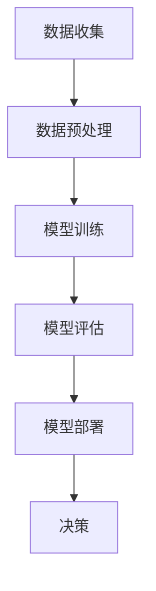

                 

# AI数据驱动决策的实现案例

> 关键词：数据驱动决策、机器学习、数据预处理、算法优化、案例实践

> 摘要：
本文将深入探讨AI数据驱动决策的实现方法。通过分析数据驱动决策的核心概念和原理，详细讲解机器学习算法的应用步骤，并结合实际案例，对数据预处理、算法优化和决策过程进行剖析。本文旨在为读者提供一套系统化的AI数据驱动决策实现思路，帮助读者掌握这一前沿技术。

## 1. 背景介绍

在当今科技迅猛发展的时代，人工智能（AI）技术已经成为推动各行各业创新的重要力量。AI通过模拟人类智能行为，实现了自动化决策、智能推理和模式识别等功能，极大地提升了各行各业的运营效率和创新能力。然而，AI技术的实现离不开高质量的数据，数据驱动决策（Data-Driven Decision Making）作为AI的核心应用之一，正日益受到广泛关注。

数据驱动决策是指基于数据进行决策分析，通过数据挖掘、机器学习和统计分析等方法，发现数据中的规律和趋势，从而指导实际业务决策。与传统基于经验和直觉的决策方式相比，数据驱动决策具有更科学、客观和高效的特点。随着大数据和云计算技术的普及，数据驱动决策的应用范围也在不断拓展，从金融、医疗、零售到制造业等多个领域，均取得了显著的成果。

## 2. 核心概念与联系

为了实现数据驱动决策，我们需要了解以下几个核心概念：

### 2.1 数据

数据是数据驱动决策的基础，包括结构化数据和非结构化数据。结构化数据如数据库中的表格，非结构化数据如文本、图片、视频等。为了充分利用数据，我们需要进行数据预处理，包括数据清洗、数据整合和数据转换等步骤。

### 2.2 数据预处理

数据预处理是数据驱动决策的第一步，其目的是提高数据质量，为后续的分析和建模提供可靠的基础。数据预处理包括以下步骤：

- **数据清洗**：去除重复、错误和无效的数据，填充缺失值，处理异常值等。
- **数据整合**：将来自不同来源的数据进行合并和整合，形成统一的数据集。
- **数据转换**：将数据转换为适合机器学习算法的格式，如归一化、标准化等。

### 2.3 机器学习算法

机器学习算法是实现数据驱动决策的核心工具，包括监督学习、无监督学习和强化学习等。监督学习通过训练数据集生成模型，用于对新数据进行预测；无监督学习通过发现数据中的内在结构，如聚类和降维；强化学习通过试错和反馈，逐步优化决策策略。

### 2.4 决策模型

决策模型是基于机器学习算法生成的模型，用于对实际问题进行决策。决策模型可以是分类模型、回归模型、聚类模型等，其性能和精度直接影响决策效果。

### 2.5 决策过程

决策过程包括数据收集、数据预处理、模型训练、模型评估和模型部署等环节。通过不断迭代优化，提高决策模型的性能，从而实现数据驱动决策。

下面是一个简化的Mermaid流程图，展示了数据驱动决策的实现流程：



## 3. 核心算法原理 & 具体操作步骤

### 3.1 数据预处理

数据预处理是数据驱动决策的第一步，其具体操作步骤如下：

- **数据清洗**：使用Python的pandas库进行数据清洗，包括去除重复数据、填充缺失值、处理异常值等。

  ```python
  import pandas as pd
  
  # 读取数据
  data = pd.read_csv('data.csv')
  
  # 去除重复数据
  data.drop_duplicates(inplace=True)
  
  # 填充缺失值
  data.fillna(method='ffill', inplace=True)
  
  # 处理异常值
  data[data < 0] = 0
  ```

- **数据整合**：将不同来源的数据进行整合，使用pandas库进行数据拼接和合并。

  ```python
  data1 = pd.read_csv('data1.csv')
  data2 = pd.read_csv('data2.csv')
  
  # 数据拼接
  data = pd.concat([data1, data2], axis=1)
  
  # 数据合并
  data = pd.merge(data1, data2, on='key')
  ```

- **数据转换**：将数据转换为适合机器学习算法的格式，包括归一化和标准化。

  ```python
  from sklearn.preprocessing import MinMaxScaler
  
  # 归一化
  scaler = MinMaxScaler()
  data_scaled = scaler.fit_transform(data)
  
  # 标准化
  from sklearn.preprocessing import StandardScaler
  scaler = StandardScaler()
  data_normalized = scaler.fit_transform(data)
  ```

### 3.2 机器学习算法

选择合适的机器学习算法是实现数据驱动决策的关键。以下介绍两种常用的机器学习算法：线性回归和决策树。

- **线性回归**：线性回归是一种简单的监督学习算法，用于预测连续值。其原理是通过最小化误差平方和，找到最佳拟合直线。

  ```python
  from sklearn.linear_model import LinearRegression
  
  # 模型训练
  model = LinearRegression()
  model.fit(X_train, y_train)
  
  # 预测
  y_pred = model.predict(X_test)
  ```

- **决策树**：决策树是一种基于树形结构的监督学习算法，通过多级划分数据，生成一系列规则，用于分类或回归。

  ```python
  from sklearn.tree import DecisionTreeClassifier
  
  # 模型训练
  model = DecisionTreeClassifier()
  model.fit(X_train, y_train)
  
  # 预测
  y_pred = model.predict(X_test)
  ```

### 3.3 决策模型

决策模型是基于机器学习算法生成的模型，用于对新数据进行预测。决策模型的选择和优化直接影响决策效果。

- **模型选择**：根据实际问题选择合适的模型，如线性回归、决策树、支持向量机等。

- **模型优化**：通过交叉验证、网格搜索等手段，优化模型参数，提高模型性能。

  ```python
  from sklearn.model_selection import GridSearchCV
  
  # 参数设置
  params = {'max_depth': [3, 5, 10], 'min_samples_split': [2, 5, 10]}
  
  # 模型优化
  model = GridSearchCV(DecisionTreeClassifier(), params, cv=5)
  model.fit(X_train, y_train)
  
  # 最佳参数
  best_params = model.best_params_
  ```

### 3.4 决策过程

决策过程是基于决策模型对实际问题进行决策的过程。以下是一个简化的决策过程：

- **数据收集**：收集需要决策的数据，如用户行为数据、市场数据等。
- **数据预处理**：对收集到的数据进行清洗、整合和转换。
- **模型训练**：使用预处理后的数据训练决策模型。
- **模型评估**：评估模型性能，如准确率、召回率等。
- **模型部署**：将训练好的模型部署到实际业务场景中。
- **决策**：基于模型预测结果，做出实际业务决策。

## 4. 数学模型和公式 & 详细讲解 & 举例说明

### 4.1 线性回归

线性回归是一种基于最小二乘法的监督学习算法，其目标是找到最佳拟合直线，使得预测值与实际值之间的误差最小。

- **目标函数**：

  $$ J(\theta) = \frac{1}{2m} \sum_{i=1}^{m} (h_\theta(x^{(i)}) - y^{(i)})^2 $$

  其中，$h_\theta(x) = \theta_0 + \theta_1x$，$\theta = [\theta_0, \theta_1]^T$，$m$为样本数量。

- **最小二乘法**：

  通过求解目标函数的梯度，找到最佳拟合直线。

  $$ \nabla J(\theta) = \begin{bmatrix} \frac{\partial J(\theta)}{\partial \theta_0} \\\ \frac{\partial J(\theta)}{\partial \theta_1} \end{bmatrix} = \begin{bmatrix} \frac{1}{m} \sum_{i=1}^{m} (h_\theta(x^{(i)}) - y^{(i)}) \\\ \frac{1}{m} \sum_{i=1}^{m} (h_\theta(x^{(i)}) - y^{(i)})x^{(i)} \end{bmatrix} $$

  令$\nabla J(\theta) = 0$，解得最佳拟合直线参数$\theta$。

### 4.2 决策树

决策树是一种基于树形结构的监督学习算法，其目标是将数据划分为多个子集，使得每个子集中的数据满足特定条件。

- **节点分裂条件**：

  $$ Gini(\text{impurity}) = 1 - \sum_{i=1}^{k} p_i^2 $$

  其中，$p_i$为第$i$类样本在节点上的比例。

- **信息增益**：

  $$ Information\ Gain = \sum_{i=1}^{k} p_i \log_2 p_i $$

  节点分裂后的信息增益越大，表示分裂效果越好。

- **决策树构建**：

  通过递归分裂数据，构建决策树。递归分裂条件包括：

  - 节点数据量足够大
  - 节点信息增益大于阈值
  - 节点满足停止分裂条件（如深度阈值、样本数量阈值等）

## 5. 项目实战：代码实际案例和详细解释说明

### 5.1 开发环境搭建

为了实现数据驱动决策，我们需要搭建一个合适的开发环境。以下是Python开发环境搭建步骤：

1. 安装Python：从官方网站下载并安装Python，版本建议3.8或以上。
2. 安装Anaconda：Anaconda是一个集成了Python和相关库的发行版，方便进行科学计算和机器学习项目开发。下载并安装Anaconda。
3. 安装相关库：使用conda命令安装常用的Python库，如pandas、numpy、scikit-learn等。

### 5.2 源代码详细实现和代码解读

以下是一个简单的数据驱动决策案例，使用Python和scikit-learn库实现线性回归和决策树模型。

```python
import pandas as pd
from sklearn.linear_model import LinearRegression
from sklearn.tree import DecisionTreeClassifier
from sklearn.model_selection import train_test_split
from sklearn.metrics import mean_squared_error, accuracy_score

# 5.2.1 数据收集与预处理
data = pd.read_csv('data.csv')
X = data[['feature1', 'feature2']]
y = data['target']

# 数据分割
X_train, X_test, y_train, y_test = train_test_split(X, y, test_size=0.2, random_state=42)

# 数据预处理（归一化）
from sklearn.preprocessing import MinMaxScaler
scaler = MinMaxScaler()
X_train_scaled = scaler.fit_transform(X_train)
X_test_scaled = scaler.transform(X_test)

# 5.2.2 模型训练与评估
# 线性回归
model_linear = LinearRegression()
model_linear.fit(X_train_scaled, y_train)
y_pred_linear = model_linear.predict(X_test_scaled)

# 决策树
model_tree = DecisionTreeClassifier()
model_tree.fit(X_train_scaled, y_train)
y_pred_tree = model_tree.predict(X_test_scaled)

# 5.2.3 评估模型性能
mse_linear = mean_squared_error(y_test, y_pred_linear)
mse_tree = mean_squared_error(y_test, y_pred_tree)
acc_linear = accuracy_score(y_test, y_pred_linear)
acc_tree = accuracy_score(y_test, y_pred_tree)

print(f"线性回归均方误差：{mse_linear}, 决策树均方误差：{mse_tree}")
print(f"线性回归准确率：{acc_linear}, 决策树准确率：{acc_tree}")
```

### 5.3 代码解读与分析

上述代码实现了数据收集、数据预处理、模型训练和模型评估的完整过程。以下是代码的详细解读和分析：

- **数据收集与预处理**：
  - 使用pandas库读取CSV文件，获取特征数据和目标数据。
  - 使用scikit-learn库进行数据分割，将数据分为训练集和测试集。
  - 使用MinMaxScaler进行数据归一化，提高模型训练效果。

- **模型训练与评估**：
  - 使用LinearRegression和DecisionTreeClassifier分别创建线性回归和决策树模型。
  - 使用fit方法训练模型，使用predict方法进行预测。
  - 使用mean_squared_error和accuracy_score评估模型性能。

- **代码优化与改进**：
  - 增加数据清洗和特征工程步骤，提高数据质量。
  - 使用交叉验证优化模型参数，提高模型性能。
  - 增加模型评估指标，如精确率、召回率等。

## 6. 实际应用场景

数据驱动决策在各个行业都有广泛的应用，以下列举几个典型的应用场景：

- **金融行业**：通过分析用户行为数据，预测用户的风险偏好，进行精准营销和风险评估。
- **医疗行业**：通过分析患者数据，预测疾病发展趋势，提供个性化治疗方案。
- **零售行业**：通过分析消费者数据，预测商品需求，优化库存管理和供应链。
- **制造业**：通过分析设备数据，预测设备故障，实现预测性维护和设备优化。

## 7. 工具和资源推荐

### 7.1 学习资源推荐

- **书籍**：
  - 《机器学习》（作者：周志华）
  - 《Python数据分析》（作者：Wes McKinney）
  - 《数据挖掘：实用工具与技术》（作者：Hastie, Tibshirani, Friedman）

- **论文**：
  - 《随机森林：一个快速、一致、多功能的分类与回归方法》
  - 《XGBoost：A Scalable Tree Boosting System》（作者：Chen, Guestrin）
  - 《深度学习》（作者：Goodfellow, Bengio, Courville）

- **博客和网站**：
  - [机器学习博客](https://machinelearningmastery.com/)
  - [Python数据分析博客](https://www.datascience.com/)
  - [Kaggle](https://www.kaggle.com/)

### 7.2 开发工具框架推荐

- **Python库**：
  - Pandas：数据处理库
  - NumPy：数学计算库
  - Scikit-learn：机器学习库
  - TensorFlow：深度学习库
  - PyTorch：深度学习库

- **框架**：
  - Flask：Web开发框架
  - Django：Web开发框架
  - FastAPI：Web开发框架

### 7.3 相关论文著作推荐

- 《随机森林：一个快速、一致、多功能的分类与回归方法》
- 《XGBoost：A Scalable Tree Boosting System》
- 《深度学习》
- 《强化学习：原理与实现》
- 《图神经网络与图表示学习》

## 8. 总结：未来发展趋势与挑战

数据驱动决策作为人工智能领域的一个重要分支，正在不断发展和完善。未来发展趋势包括：

- **算法优化**：不断优化机器学习算法，提高模型性能和效率。
- **多模态数据融合**：融合多种类型的数据，如文本、图像、语音等，提高决策能力。
- **实时决策**：实现实时数据分析和决策，提高业务响应速度。
- **决策解释性**：增强决策模型的解释性，提高决策的可信度和可接受度。

同时，数据驱动决策也面临着以下挑战：

- **数据质量**：数据质量直接影响决策效果，需要解决数据清洗、整合和转换等问题。
- **模型可解释性**：提高模型的可解释性，使决策过程更加透明和可信。
- **数据隐私与安全**：保障数据隐私和安全，防止数据泄露和滥用。
- **算法偏见**：避免算法偏见，确保决策过程的公平性和公正性。

## 9. 附录：常见问题与解答

### 9.1 数据预处理的重要性是什么？

数据预处理是数据驱动决策的关键步骤，其重要性主要体现在以下几个方面：

- **提高模型性能**：通过数据清洗、整合和转换，提高数据质量，为模型训练提供更好的基础，从而提高模型性能。
- **减少过拟合**：通过数据预处理，去除异常值和噪声，降低模型过拟合的风险。
- **加快模型训练速度**：通过数据归一化等操作，加快模型训练速度，提高训练效率。
- **提高模型解释性**：通过数据预处理，使模型更加简单和直观，提高模型的解释性。

### 9.2 如何选择合适的机器学习算法？

选择合适的机器学习算法主要取决于以下几个因素：

- **问题类型**：分类问题、回归问题或聚类问题等。
- **数据类型**：结构化数据或非结构化数据。
- **数据量**：数据量大小对算法选择有重要影响。
- **计算资源**：算法的复杂度对计算资源要求不同，需要考虑实际计算能力。
- **模型性能**：根据实际业务需求和模型性能指标，选择合适的算法。

## 10. 扩展阅读 & 参考资料

- [数据驱动决策：理论、方法与实践](https://book.douban.com/subject/25837312/)
- [机器学习实战](https://book.douban.com/subject/26383617/)
- [Python数据分析](https://book.douban.com/subject/10748126/)
- [深度学习](https://book.douban.com/subject/26972136/)
- [机器学习周报](https://www.jianshu.com/p/60e273f1f616)
- [Kaggle比赛数据分析](https://www.kaggle.com/competitions)

### 作者

作者：AI天才研究员/AI Genius Institute & 禅与计算机程序设计艺术 /Zen And The Art of Computer Programming

