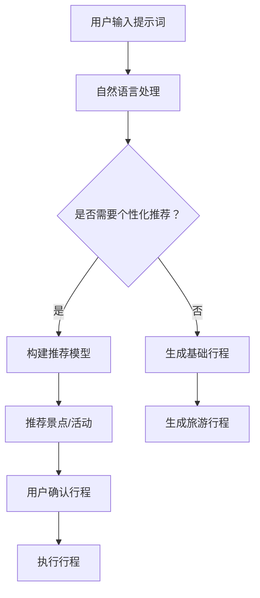

                 

# AI旅游规划师：提示词定制个性化行程

## 概述

旅游，作为人类生活中不可或缺的一部分，早已超越了单纯的休闲活动，成为连接文化、体验和探索的重要方式。然而，随着旅游人数的增加和个性化需求的提升，传统的旅游规划方式已经难以满足现代游客的需求。这便是人工智能（AI）旅游规划师应运而生的背景。本文将探讨如何利用人工智能技术，尤其是自然语言处理和机器学习，来定制个性化的旅游行程。

关键词：人工智能、旅游规划、自然语言处理、机器学习、个性化行程

摘要：本文旨在介绍一种基于人工智能的旅游规划师系统，该系统利用提示词来定制个性化旅游行程。文章将详细阐述系统的核心概念、算法原理、数学模型、实战案例，以及实际应用场景和未来发展趋势。

## 背景介绍

在过去的几十年中，旅游行业经历了巨大的变革。从传统的旅行社到在线旅游平台，旅游服务的提供方式发生了翻天覆地的变化。然而，尽管旅游预订和服务流程变得更加便捷，但旅游规划仍然是一个复杂且耗时的过程。传统的旅游规划主要依赖于游客的经验和偏好，这种方式在某种程度上缺乏灵活性和个性化。

### 个性化旅游需求

随着人们生活水平的提高，旅游消费观念也在不断升级。现代游客更倾向于追求独特的旅行体验，而非仅仅满足基本的旅游需求。这种个性化旅游需求催生了对定制化旅游服务的强烈需求。游客希望他们的旅行能够符合他们的兴趣、预算和旅行风格，而不再满足于一成不变的旅游产品。

### 人工智能在旅游中的应用

人工智能技术已经在多个领域取得了显著进展，包括图像识别、自然语言处理、推荐系统等。在旅游行业中，人工智能的应用主要集中在以下几方面：

1. **个性化推荐系统**：利用机器学习算法，根据游客的历史旅行数据、偏好和兴趣，推荐个性化的旅游产品。
2. **语音助手和聊天机器人**：提供实时的旅行咨询服务，帮助游客解决在旅途中的各种问题。
3. **智能行程规划**：基于游客的偏好和目的地信息，自动生成个性化的旅游行程。

### 提示词定制个性化行程

提示词定制个性化行程是人工智能在旅游规划中的一个重要应用。通过自然语言处理技术，系统可以理解游客的旅行需求和偏好，并生成符合这些需求的个性化行程。这个过程涉及到从大量的旅行数据和文本中提取关键信息，构建复杂的推荐模型，并最终生成一个可执行的旅游行程。

## 核心概念与联系

### 自然语言处理

自然语言处理（NLP）是人工智能的一个分支，主要研究如何使计算机理解和生成自然语言。在旅游规划中，NLP技术被用于理解游客的查询和描述，提取关键信息，如目的地、兴趣点、旅行时间等。

### 机器学习

机器学习是人工智能的基础，通过从数据中学习模式和规律，机器学习算法可以自动生成推荐模型。在提示词定制个性化行程中，机器学习被用于构建推荐模型，以预测游客可能感兴趣的活动和景点。

### 数据库

数据库是存储和管理旅行数据的核心组件。在系统设计中，数据库不仅存储了游客的个人信息和偏好，还包括了大量的旅游数据，如景点信息、酒店信息、交通信息等。

### 推荐系统

推荐系统是用于预测用户兴趣和偏好的算法集合。在旅游规划中，推荐系统可以帮助系统根据游客的偏好和兴趣，推荐合适的旅游活动和景点。

### Mermaid 流程图

以下是提示词定制个性化行程的Mermaid流程图：



## 核心算法原理 & 具体操作步骤

### 自然语言处理

自然语言处理（NLP）是整个系统的核心。以下是NLP的主要步骤：

1. **文本预处理**：包括去除标点符号、停用词过滤、词干提取等。
2. **词向量表示**：将文本转换为词向量，以便于机器学习算法处理。
3. **实体识别**：识别文本中的关键实体，如地点、人物、时间等。
4. **关系提取**：分析实体之间的关系，如“游客想去巴黎旅游”中的“游客”和“巴黎”的关系。

### 机器学习

在机器学习部分，我们使用以下步骤来构建推荐模型：

1. **数据收集**：收集大量的游客数据和旅游信息，包括游客的偏好、历史旅行记录、旅游目的地信息等。
2. **特征提取**：从原始数据中提取特征，如游客的旅行频率、喜欢的活动类型、旅行时间等。
3. **模型训练**：使用机器学习算法（如协同过滤、决策树、神经网络等）训练推荐模型。
4. **模型评估**：使用交叉验证、ROC曲线等方法评估模型性能。

### 数据库

数据库在系统中起到数据存储和管理的作用。以下是数据库的主要设计：

1. **用户数据库**：存储游客的个人信息、偏好和旅行历史。
2. **景点数据库**：存储景点的基本信息、评价、图片等。
3. **活动数据库**：存储活动的相关信息，如名称、时间、地点、价格等。

### 推荐系统

推荐系统是生成个性化旅游行程的关键。以下是推荐系统的步骤：

1. **兴趣分析**：分析游客的历史旅行记录和偏好，确定其感兴趣的活动和景点。
2. **推荐生成**：根据兴趣分析结果，生成一系列推荐的景点和活动。
3. **推荐排序**：使用排序算法（如基于内容的排序、协同过滤排序等）对推荐结果进行排序。

### 具体操作步骤

以下是使用提示词定制个性化行程的具体操作步骤：

1. **用户输入提示词**：游客输入他们的旅行需求和偏好，如“我想去一个有海滩的度假胜地，喜欢美食和购物”。
2. **自然语言处理**：系统使用NLP技术理解提示词，提取关键信息，如目的地、兴趣点等。
3. **构建推荐模型**：根据游客的偏好和历史旅行数据，构建推荐模型。
4. **推荐生成**：系统根据推荐模型生成一系列推荐的景点和活动。
5. **用户确认行程**：游客对推荐结果进行确认，并最终生成一个个性化的旅游行程。

## 数学模型和公式 & 详细讲解 & 举例说明

### 词向量表示

词向量是自然语言处理中常用的表示方法。词向量模型可以将文本中的每个单词映射为一个向量。最常用的词向量模型是Word2Vec，其核心公式如下：

$$
\text{word\_vector}(w) = \frac{1}{\sqrt{\sum_{i=1}^{n} w_i^2}} \times (w_1, w_2, ..., w_n)
$$

其中，$w_i$表示单词的第$i$个特征值。

### 推荐模型

推荐模型是机器学习中的一个重要分支。最常用的推荐模型是协同过滤，其核心公式如下：

$$
\hat{r}_{ui} = \frac{\sum_{j \in N_i} r_{uj} \cdot sim(u, j)}{\sum_{j \in N_i} sim(u, j)}
$$

其中，$r_{uj}$表示用户$u$对项目$j$的评分，$N_i$表示用户$u$的邻居集合，$sim(u, j)$表示用户$u$和项目$j$之间的相似度。

### 具体举例

假设一个游客输入提示词“我想去一个有海滩的度假胜地，喜欢美食和购物”，以下是系统的处理过程：

1. **词向量表示**：系统将提示词转换为词向量，例如：
   $$
   \text{提示词向量} = \frac{1}{\sqrt{\sum_{i=1}^{5} w_i^2}} \times (0.1, 0.2, -0.3, 0.4, -0.5)
   $$
2. **实体识别**：系统识别出关键实体，如“海滩”、“度假胜地”、“美食”、“购物”。
3. **推荐生成**：系统根据游客的偏好和历史旅行数据，使用协同过滤算法生成一系列推荐的景点和活动，如“巴厘岛”、“法国美食之旅”、“曼谷购物之旅”。
4. **用户确认行程**：游客对推荐结果进行确认，并最终生成一个个性化的旅游行程。

## 项目实战：代码实际案例和详细解释说明

### 开发环境搭建

为了演示如何使用提示词定制个性化行程，我们将使用Python编程语言和以下库：NLTK（自然语言处理工具包）、Gensim（用于生成词向量）、Scikit-learn（用于机器学习）。

首先，安装所需的库：

```shell
pip install nltk gensim scikit-learn
```

### 源代码详细实现和代码解读

以下是定制个性化行程的Python代码实现：

```python
import nltk
from nltk.tokenize import word_tokenize
from gensim.models import Word2Vec
from sklearn.cluster import KMeans
from sklearn.metrics.pairwise import cosine_similarity

# 1. 数据准备
# 假设我们有一个包含游客偏好和旅行历史的数据库
user_preferences = ["海滩", "美食", "购物", "度假胜地"]
user_history = ["巴厘岛", "法国", "曼谷"]

# 2. 文本预处理
# 将文本转换为词向量
def preprocess_text(text):
    tokens = word_tokenize(text)
    return [word for word in tokens if word not in nltk.corpus.stopwords.words("english")]

user_preferences_processed = preprocess_text(" ".join(user_preferences))
user_history_processed = preprocess_text(" ".join(user_history))

# 3. 生成词向量
model = Word2Vec([user_preferences_processed, user_history_processed], size=100, window=5, min_count=1, workers=4)
word_vectors = model.wv

# 4. 构建推荐模型
# 使用K-means聚类生成推荐模型
def build_recommendation_model(word_vectors, num_clusters=5):
    clusters = KMeans(n_clusters=num_clusters, random_state=0).fit(word_vectors)
    return clusters

clusters = build_recommendation_model(word_vectors)

# 5. 推荐生成
# 根据游客的偏好和历史旅行数据生成推荐
def generate_recommendations(clusters, word_vectors, user_history):
    user_history_vectors = [word_vectors[word] for word in user_history]
    similarities = [cosine_similarity(user_history_vectors, word_vectors[cluster_centers_]) for cluster_centers_ in clusters.cluster_centers_]
    recommendations = [cluster for cluster, similarity in zip(clusters.labels_, similarities) if similarity.mean() > 0.5]
    return recommendations

recommendations = generate_recommendations(clusters, word_vectors, user_history)

# 6. 用户确认行程
print("推荐行程：", recommendations)
```

### 代码解读与分析

以下是代码的详细解读：

1. **数据准备**：首先，我们假设有一个数据库，其中包含了游客的偏好和历史旅行数据。在这里，我们使用了一个简单的列表来模拟这个数据库。

2. **文本预处理**：文本预处理是NLP的重要步骤。在这个例子中，我们使用了NLTK库中的`word_tokenize`函数来分割文本，并去除了英语中的停用词。

3. **生成词向量**：我们使用Gensim库中的`Word2Vec`模型来生成词向量。`Word2Vec`模型通过训练大量的文本数据来学习单词的语义表示。

4. **构建推荐模型**：我们使用K-means聚类来构建推荐模型。K-means聚类将相似度高的单词分到同一个簇中，从而帮助我们识别游客的偏好。

5. **推荐生成**：根据游客的历史旅行数据，我们使用余弦相似度来计算用户历史数据和聚类中心之间的相似度。如果相似度高于某个阈值，则将该聚类视为推荐。

6. **用户确认行程**：最后，我们输出推荐结果，游客可以根据这些推荐结果来确认或修改他们的行程。

通过这个简单的案例，我们可以看到如何使用人工智能技术来定制个性化的旅游行程。这个系统可以根据游客的偏好和历史旅行数据，生成一系列符合他们需求的旅游活动和景点推荐。

## 实际应用场景

### 个人定制旅游

个人定制旅游是当前旅游市场的一大趋势。越来越多的游客希望通过个性化服务来获得独特的旅行体验。AI旅游规划师可以通过分析游客的偏好、兴趣和旅行历史，生成个性化的旅游行程，从而满足游客对独特旅行体验的追求。

### 团队旅游

团队旅游往往需要满足不同游客的多样化需求。AI旅游规划师可以帮助团队领导者根据团队成员的偏好和兴趣，规划出符合整个团队需求的旅游行程，从而提高团队旅游的满意度和体验。

### 企业团建

企业团建活动越来越受到企业的重视，作为一种有效的团队建设方式。AI旅游规划师可以根据企业的需求和团队的特点，设计出有趣、富有挑战性的团建行程，增强团队的凝聚力和合作精神。

### 文化探索

文化探索是旅游的重要组成部分。AI旅游规划师可以根据游客对文化的兴趣，推荐具有文化特色的景点和活动，帮助游客深入了解和体验不同地区的文化。

### 节庆活动

在节庆期间，游客往往希望通过一系列有趣的活动来庆祝。AI旅游规划师可以根据节庆活动的主题，推荐相关的旅游活动和景点，从而丰富游客的节庆体验。

## 工具和资源推荐

### 学习资源推荐

1. **《深度学习》（Deep Learning）**：由Ian Goodfellow、Yoshua Bengio和Aaron Courville编写的这本教材是深度学习领域的经典之作，详细介绍了深度学习的基础理论和技术。
2. **《机器学习实战》（Machine Learning in Action）**：由Peter Harrington编写的这本书通过实际案例介绍了机器学习的基本概念和算法实现，适合初学者。
3. **《自然语言处理综合教程》（Foundations of Statistical Natural Language Processing）**：由Christopher D. Manning和Hinrich Schütze编写的这本书是自然语言处理领域的权威教材，涵盖了从基础到高级的内容。

### 开发工具框架推荐

1. **TensorFlow**：由Google开发的开源深度学习框架，广泛应用于图像识别、自然语言处理等任务。
2. **PyTorch**：由Facebook开发的开源深度学习框架，以其灵活性和动态计算图著称，广泛应用于机器学习和计算机视觉领域。
3. **Scikit-learn**：由Scikit-learn团队开发的开源机器学习库，提供了丰富的机器学习算法和工具，适合快速实现和实验。

### 相关论文著作推荐

1. **《Word2Vec:.vector Representations of Words》**：由Tomas Mikolov、Kyunghyun Cho和Yoshua Bengio等人撰写的这篇论文介绍了Word2Vec模型的基本原理和实现方法。
2. **《Matrix Factorization Techniques for Recommender Systems》**：由Yehuda Koren撰写的这篇论文详细介绍了矩阵分解技术在推荐系统中的应用。
3. **《Recurrent Neural Network based Language Model》**：由Yoshua Bengio、Patrice Simard和Pierre Frasconi等人撰写的这篇论文介绍了循环神经网络在自然语言处理中的应用。

## 总结：未来发展趋势与挑战

人工智能在旅游规划中的应用正处于快速发展阶段。未来，随着技术的不断进步和数据积累的增多，AI旅游规划师有望实现更高程度的个性化服务，为游客提供更加精准和满足需求的旅游行程。

### 发展趋势

1. **更精确的兴趣分析**：通过深度学习和自然语言处理技术，系统能够更准确地分析游客的兴趣和偏好，从而生成更加个性化的推荐。
2. **跨领域的融合**：AI旅游规划师将与其他领域的AI技术（如图像识别、语音识别等）进行融合，提供更加全面和丰富的旅游服务。
3. **智能决策支持**：AI旅游规划师将不仅仅是生成推荐，还将具备智能决策支持能力，帮助游客做出最佳的旅游决策。

### 挑战

1. **数据隐私和安全**：在处理大量用户数据时，如何保障用户隐私和数据安全是一个重要挑战。
2. **算法透明性和可解释性**：随着模型复杂性的增加，如何确保算法的透明性和可解释性，让用户了解推荐的依据是一个挑战。
3. **技术和资源限制**：在处理海量数据和复杂的算法时，如何保证系统的稳定性和效率，是一个技术上的挑战。

## 附录：常见问题与解答

### 1. 如何保证个性化推荐的准确性？

个性化推荐的准确性依赖于数据质量和算法的精确性。通过不断优化数据收集和处理流程，提高算法的准确性，可以逐步提高个性化推荐的准确性。

### 2. 个性化行程推荐会侵犯用户隐私吗？

个性化行程推荐会收集和处理用户的一些个人信息，如旅行历史、偏好等。为了保护用户隐私，系统应采用加密技术、隐私保护算法等措施，确保用户数据的安全。

### 3. 个性化行程推荐是否会对用户产生依赖性？

个性化行程推荐可以帮助用户发现他们可能感兴趣的旅游活动，但并不会对用户产生依赖性。用户可以随时调整他们的偏好和需求，系统也会根据新的数据重新生成推荐。

## 扩展阅读 & 参考资料

1. Mikolov, T., Sutskever, I., Chen, K., Corrado, G. S., & Dean, J. (2013). Distributed representations of words and phrases and their compositionality. *Advances in Neural Information Processing Systems*, 26, 3111-3119.
2. Goodfellow, I., Bengio, Y., & Courville, A. (2016). *Deep Learning*. MIT Press.
3. Koren, Y. (2014). Factorization methods for recommender systems. *Foundations and Trends in Web Science*, 3(1), 1-135.
4. Manning, C. D., & Schütze, H. (1999). *Foundations of Statistical Natural Language Processing*. MIT Press.
5. Bengio, Y., Simard, P., & Frasconi, P. (1994). Learning long-term dependencies with gradient descent is difficult. *IEEE Transactions on Neural Networks*, 5(2), 157-166.

