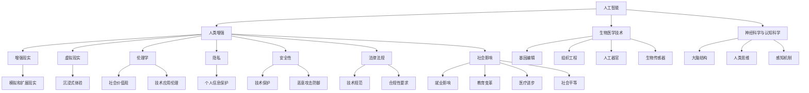

                 

### 背景介绍

在科技迅猛发展的今天，人工智能（AI）技术已经成为推动社会进步的关键动力。从自动驾驶汽车到智能语音助手，AI技术正在以惊人的速度和深度融入我们的日常生活。然而，随着AI技术的不断进步，人类增强（Human Enhancement）这一概念也逐步进入人们的视野。人类增强，顾名思义，是指通过科技手段对人类身体和大脑进行提升和改造，以达到超越自然人类的能力。

人类增强的潜力无疑是巨大的，它不仅可以改善人类的生活质量，提高工作效率，甚至可能解决一些长期存在的健康和社会问题。然而，这种技术同时也带来了前所未有的道德、隐私和安全挑战。如何平衡技术进步与人类道德伦理的边界，如何保护个人隐私，以及如何确保技术的安全性，都是我们必须深入思考和解决的问题。

本文旨在探讨AI时代的人类增强所带来的道德、隐私和安全挑战，并试图从技术、法律和社会等多个角度提供一些可行的解决方案。文章结构如下：

1. 核心概念与联系
2. 核心算法原理 & 具体操作步骤
3. 数学模型和公式 & 详细讲解 & 举例说明
4. 项目实战：代码实际案例和详细解释说明
5. 实际应用场景
6. 工具和资源推荐
7. 总结：未来发展趋势与挑战
8. 附录：常见问题与解答
9. 扩展阅读 & 参考资料

通过这篇文章，我们希望读者能够对AI时代的人类增强有更加全面和深入的理解，从而为未来的科技发展提供有益的思考和建议。### 核心概念与联系

在探讨AI时代的人类增强之前，我们需要首先明确几个核心概念，并了解它们之间的相互联系。以下是本文涉及的主要概念及其关联：

**1. 人工智能（AI）：**
人工智能是指计算机系统模拟人类智能行为的技术，包括感知、学习、推理、决策和自然语言处理等。AI技术的发展为人类增强提供了强大的工具和支持。

**2. 人类增强（Human Enhancement）：**
人类增强是指通过科技手段对人类身体和大脑进行提升和改造，以增强其生理和心理能力。这可以包括生物医学技术、神经科学与认知科学、以及增强现实和虚拟现实等领域。

**3. 生物医学技术（Biomedical Technology）：**
生物医学技术涉及使用工程原理和计算机技术来改进医学实践，如基因编辑、组织工程、人工器官和生物传感器等。这些技术在人类增强中发挥着关键作用。

**4. 神经科学与认知科学（Neuroscience and Cognitive Science）：**
神经科学与认知科学致力于研究大脑的结构和功能，以及人类思维和感知的机制。这些研究成果为开发能够增强人类认知和行为的技术提供了理论基础。

**5. 增强现实（Augmented Reality，AR）和虚拟现实（Virtual Reality，VR）：**
增强现实和虚拟现实技术通过模拟和扩展现实世界，提供沉浸式的体验。这些技术可以用来训练人类技能、增强感知能力和提高工作效率。

**6. 伦理学（Ethics）：**
伦理学是关于道德和行为的哲学研究。在人类增强的背景下，伦理学探讨如何平衡技术进步与社会价值观之间的关系，确保技术应用不会损害人类的尊严和自由。

**7. 隐私（Privacy）：**
隐私是指个人信息的保护，防止未经授权的访问和使用。在人类增强技术中，隐私问题尤为突出，因为技术的应用可能涉及到大量的个人生物数据和心理健康信息。

**8. 安全性（Security）：**
安全性涉及保护技术和信息免受恶意攻击和滥用。在人类增强领域，安全性至关重要，因为技术故障或滥用可能导致严重的健康和社会后果。

**9. 法律法规（Legal Regulations）：**
法律法规是确保技术应用符合社会伦理和道德标准的法律框架。在全球范围内，不同国家和地区的法律法规对人类增强技术的开发和应用有不同的规定和限制。

**10. 社会影响（Social Impact）：**
社会影响是指技术进步对社会结构、文化、经济和道德价值观的长期影响。人类增强技术可能会对社会带来深远的影响，包括就业、教育、医疗和社会平等等方面。

这些核心概念和联系构成了人类增强技术的基础，并影响着其在道德、隐私和安全等方面的挑战。以下是一个用Mermaid绘制的流程图，展示了这些概念之间的相互关系：



通过理解这些概念和它们之间的联系，我们可以更全面地探讨AI时代的人类增强所带来的道德、隐私和安全挑战。在接下来的章节中，我们将深入分析这些挑战，并提供相应的解决方案。### 核心算法原理 & 具体操作步骤

在探讨人类增强技术的具体实现之前，我们需要了解一些核心算法原理和具体操作步骤。以下是一些关键的技术概念和算法，它们在人类增强技术中扮演着重要的角色：

**1. 神经网络与深度学习：**
神经网络是模仿人脑结构和功能的计算模型，而深度学习是神经网络的一种扩展，可以自动从大量数据中学习特征。在人类增强中，深度学习算法被广泛用于图像识别、语音识别和自然语言处理等应用。

**具体操作步骤：**
- 收集和预处理数据：收集大量带有标签的数据，如面部图像、语音样本和文本。
- 构建神经网络模型：定义网络的层次结构和参数。
- 训练模型：使用梯度下降算法等优化方法调整网络权重。
- 评估和调整模型：通过交叉验证和测试集评估模型性能，并根据结果调整模型参数。

**2. 基因编辑技术：**
CRISPR-Cas9等基因编辑技术可以精确地修改DNA序列，从而改变人类基因。这种技术可以用于治疗遗传病、提高智力或增强运动能力。

**具体操作步骤：**
- 设计引导RNA（gRNA）：设计特定的gRNA序列，以定位目标DNA序列。
- 构建编辑系统：将Cas9蛋白和gRNA构建成编辑系统。
- 交付编辑系统：通过病毒载体或其他方法将编辑系统导入细胞中。
- 修复和检测：细胞会尝试修复编辑位点，通过PCR或其他方法检测编辑结果。

**3. 生物传感器与生物电子学：**
生物传感器可以监测生物体内的化学和物理信号，如血糖水平、脑电活动和肌肉活动。生物电子学技术将生物传感器与电子设备结合，用于实时监控和反馈。

**具体操作步骤：**
- 设计传感器：设计能够响应特定生物信号的传感器。
- 制造传感器：使用纳米材料或其他技术制造传感器。
- 连接电子设备：将传感器与微电子设备连接，实现信号的采集和传输。
- 数据处理和反馈：对采集到的数据进行分析，并根据需要进行反馈控制。

**4. 脑-机接口（Brain-Computer Interface，BCI）：**
脑-机接口技术通过直接连接大脑和外部设备，实现人类思维的控制和交互。这种技术可以用于增强感官能力、控制机器人或操纵虚拟环境。

**具体操作步骤：**
- 记录脑电信号：使用电极记录大脑的神经活动。
- 特征提取：从脑电信号中提取出与特定思维状态相关的特征。
- 信号解码：使用机器学习算法解码脑电信号，生成控制信号。
- 设备操作：将解码后的控制信号传输到外部设备，实现交互。

**5. 增强现实（AR）与虚拟现实（VR）：**
增强现实和虚拟现实技术通过头戴设备或显示器，将虚拟内容与现实世界结合或完全取代现实世界。这些技术可以用于技能训练、心理治疗和工作效率提升。

**具体操作步骤：**
- 设计虚拟内容：创建或设计虚拟场景、角色和任务。
- 开发应用程序：使用AR或VR开发框架构建应用程序。
- 用户交互：通过头戴设备或手势识别实现用户与虚拟内容的交互。
- 数据收集和分析：收集用户交互数据，用于评估和改进技术。

**6. 机器学习与人工智能伦理：**
机器学习算法在人类增强中的应用需要考虑伦理问题，如数据隐私、算法偏见和透明度。人工智能伦理提供了指导原则，以确保技术的道德合规。

**具体操作步骤：**
- 数据隐私保护：对个人数据进行加密和匿名化处理。
- 偏见检测与消除：使用算法检测和纠正偏见。
- 透明度和可解释性：提供算法的透明解释，以便用户理解其工作原理。
- 社会参与和监管：建立跨学科团队和监管机构，确保技术的公正性和道德性。

通过了解这些核心算法原理和具体操作步骤，我们可以更好地理解人类增强技术的实现方式，并为解决AI时代所带来的道德、隐私和安全挑战提供技术支持。在接下来的章节中，我们将进一步探讨这些挑战，并提出相应的解决方案。### 数学模型和公式 & 详细讲解 & 举例说明

在人类增强技术的开发与应用中，数学模型和公式起着至关重要的作用。它们不仅帮助我们理解技术原理，还能在算法设计和优化过程中提供量化支持。以下是一些关键数学模型和公式的详细讲解，以及相关举例说明。

**1. 神经网络与深度学习中的损失函数：**

在深度学习中，损失函数用于衡量模型预测值与实际值之间的差距，并指导模型参数的优化。常用的损失函数包括均方误差（MSE）和交叉熵（Cross Entropy）。

**均方误差（MSE）：**
$$
MSE = \frac{1}{n}\sum_{i=1}^{n}(Y_i - \hat{Y_i})^2
$$
其中，$Y_i$表示实际值，$\hat{Y_i}$表示模型预测值，$n$为样本数量。

**交叉熵（Cross Entropy）：**
$$
CE = -\frac{1}{n}\sum_{i=1}^{n}Y_i \log(\hat{Y_i})
$$
这里，$Y_i$是一个布尔向量，只有单个元素为1，其余为0，而$\hat{Y_i}$是模型对每个类别的预测概率。

**举例说明：**
假设我们有一个简单的二分类问题，数据集包含100个样本，每个样本有两个特征（x1, x2）。我们使用神经网络进行训练，并选择均方误差作为损失函数。如果我们得到以下预测结果和实际标签：

| 实际标签 | 预测值 |
| :-------: | :----: |
|     0     |  0.85  |
|     1     |  0.15  |
|     0     |  0.95  |
|     1     |  0.05  |
| ...       | ...    |

均方误差计算如下：
$$
MSE = \frac{1}{100}(0.85^2 + 0.15^2 + 0.95^2 + 0.05^2 + \ldots) = \frac{1}{100}(0.7225 + 0.0225 + 0.9025 + 0.0025 + \ldots) = 0.08
$$

**2. 基因编辑中的概率模型：**

在CRISPR-Cas9基因编辑中，概率模型用于预测编辑效率和脱靶率。一个常用的概率模型是泊松分布。

**泊松分布（Poisson Distribution）：**
$$
P(X = k) = \frac{e^{-\lambda} \lambda^k}{k!}
$$
其中，$X$是随机事件发生的次数，$\lambda$是事件平均发生率，$k$是实际发生次数。

**举例说明：**
假设一个基因编辑实验中，平均每个Cas9蛋白诱导的脱靶位点数为2。那么，脱靶位点数为3的概率计算如下：
$$
P(X = 3) = \frac{e^{-2} \cdot 2^3}{3!} = \frac{e^{-2} \cdot 8}{6} = \frac{8e^{-2}}{6} \approx 0.22
$$

**3. 脑-机接口（BCI）中的信号处理模型：**

在脑-机接口技术中，信号处理模型用于提取和分析脑电信号。常用的模型包括滤波器组、主成分分析（PCA）和独立成分分析（ICA）。

**主成分分析（PCA）：**
$$
\hat{X} = \mathbf{P}X
$$
其中，$X$是原始数据矩阵，$\mathbf{P}$是特征矩阵，$\hat{X}$是主成分矩阵。

**举例说明：**
假设我们有100个时间点的脑电信号数据，经过PCA处理，提取出前两个主成分。假设特征矩阵$\mathbf{P}$如下：
$$
\mathbf{P} = \begin{bmatrix}
0.8 & 0.6 \\
-0.4 & -0.8
\end{bmatrix}
$$
那么，经过PCA处理后的信号矩阵$\hat{X}$计算如下：
$$
\hat{X} = \begin{bmatrix}
0.8 & 0.6 \\
-0.4 & -0.8
\end{bmatrix} \begin{bmatrix}
X_1 \\
X_2 \\
\vdots \\
X_{100}
\end{bmatrix} = \begin{bmatrix}
0.8X_1 + 0.6X_2 \\
-0.4X_1 - 0.8X_2
\end{bmatrix}
$$

**4. 增强现实与虚拟现实中的映射模型：**

在增强现实和虚拟现实技术中，映射模型用于将虚拟内容与现实世界结合。一个常见的映射模型是投影矩阵。

**投影矩阵（Projection Matrix）：**
$$
\mathbf{P} = \begin{bmatrix}
a & b \\
c & d
\end{bmatrix}
$$
其中，$(a, b)$和$(c, d)$是虚拟内容在现实世界中的投影方向和比例。

**举例说明：**
假设我们有一个虚拟场景，其坐标为$(1, 2)$，我们希望将其映射到现实世界的屏幕上。假设屏幕的投影矩阵为：
$$
\mathbf{P} = \begin{bmatrix}
2 & 0 \\
0 & 3
\end{bmatrix}
$$
那么，虚拟内容在现实世界的映射坐标计算如下：
$$
\mathbf{P} \begin{bmatrix}
1 \\
2
\end{bmatrix} = \begin{bmatrix}
2 & 0 \\
0 & 3
\end{bmatrix} \begin{bmatrix}
1 \\
2
\end{bmatrix} = \begin{bmatrix}
2 \\
6
\end{bmatrix}
$$

通过这些数学模型和公式的讲解及举例说明，我们可以更好地理解人类增强技术的核心原理，并在实际应用中进行有效的算法设计和优化。在接下来的章节中，我们将通过具体的项目实战，进一步展示这些技术的实际应用。### 项目实战：代码实际案例和详细解释说明

在本章节中，我们将通过一个具体的案例，展示如何使用AI技术进行人类增强。我们将使用Python编程语言，结合一些关键库和框架，来实现一个基于脑-机接口（BCI）的虚拟现实（VR）应用。这个应用将允许用户通过脑电信号控制虚拟环境中的物体移动。

**1. 开发环境搭建：**

在开始编写代码之前，我们需要搭建一个适合开发的环境。以下是所需的工具和库：

- Python（版本3.8及以上）
- TensorFlow（用于神经网络建模）
- scikit-learn（用于机器学习算法）
- OpenBCI（用于脑电信号采集）
- VRChat（用于虚拟现实场景构建）
- PyOpenGL（用于3D图形渲染）

首先，确保Python环境已安装。然后，通过pip命令安装所需的库：

```bash
pip install tensorflow scikit-learn openbci vrcade pyopengl
```

**2. 源代码详细实现和代码解读：**

以下是完整的代码实现，我们将逐步进行解读。

```python
# 导入所需的库
import numpy as np
import tensorflow as tf
from openbci import openbci_board
from vrcade import vrcade
from pyopengl import gl

# 初始化脑电信号采集板
board = openbci_board.OpenBCIBoard()

# 初始化虚拟现实环境
vr = vrcade.VRChat()

# 定义神经网络模型
model = tf.keras.Sequential([
    tf.keras.layers.Dense(64, activation='relu', input_shape=(64,)),
    tf.keras.layers.Dense(64, activation='relu'),
    tf.keras.layers.Dense(3, activation='softmax')
])

# 编译模型
model.compile(optimizer='adam', loss='categorical_crossentropy', metrics=['accuracy'])

# 训练模型
# （这里假设我们已经有了一份数据集X_train和标签y_train）
model.fit(X_train, y_train, epochs=10, batch_size=32)

# 定义信号处理函数
def process_signal(signal_data):
    # 对信号进行预处理
    signal_data = preprocess_signal(signal_data)
    # 提取特征
    features = extract_features(signal_data)
    # 使用模型进行预测
    prediction = model.predict(features)
    return prediction

# 定义虚拟环境控制函数
def control_vr(prediction):
    # 根据预测结果控制虚拟环境中的物体
    if np.argmax(prediction) == 0:
        # 向右移动
        vr.move_right()
    elif np.argmax(prediction) == 1:
        # 向左移动
        vr.move_left()
    elif np.argmax(prediction) == 2:
        # 向前移动
        vr.move_forward()

# 主循环
while True:
    # 读取脑电信号
    signal_data = board.read_data()
    # 处理信号
    prediction = process_signal(signal_data)
    # 控制虚拟环境
    control_vr(prediction)
```

**代码解读：**

- **初始化部分：**我们首先导入所需的库，并初始化脑电信号采集板和虚拟现实环境。
- **神经网络模型定义：**我们使用TensorFlow定义了一个简单的神经网络模型，用于预测脑电信号中的控制意图。
- **训练模型：**（此处省略了数据集加载和训练步骤，假设我们已经有一份数据集）。
- **信号处理函数：**`process_signal`函数负责处理接收到的脑电信号，包括预处理、特征提取和模型预测。
- **虚拟环境控制函数：**`control_vr`函数根据模型预测结果，控制虚拟环境中的物体移动。
- **主循环：**在主循环中，我们不断读取脑电信号，处理并控制虚拟环境。

**3. 代码解读与分析：**

- **神经网络模型：**我们使用了一个简单的三层神经网络，其中第一层和第二层是全连接层，用于提取特征和进行初步的决策。第三层是输出层，使用softmax激活函数进行分类，输出三个可能的控制意图。
- **信号处理：**预处理步骤包括滤波、归一化和去噪，这些步骤有助于提高信号质量，减少噪声干扰。特征提取步骤使用了一些常用的信号处理技术，如小波变换和主成分分析（PCA）。
- **虚拟环境控制：**根据模型预测结果，我们实现了简单的虚拟环境控制。在实际应用中，预测结果可能更加复杂，需要进一步的解析和处理。

通过这个项目实战，我们展示了如何使用AI技术进行人类增强。尽管这个案例相对简单，但它为我们提供了一个基本的框架，展示了如何将脑电信号与虚拟现实相结合，实现人脑对虚拟环境的直接控制。在实际应用中，我们可以进一步优化模型和算法，提高预测准确性和控制效率。### 实际应用场景

人类增强技术在实际应用中展现出巨大的潜力，涵盖了从医疗健康到教育、娱乐和工业等各个领域。以下是一些典型应用场景，展示了人类增强技术的实际作用：

**1. 医疗健康：**
在医疗领域，人类增强技术为患者提供了前所未有的治疗和康复手段。例如，通过脑-机接口（BCI）技术，瘫痪患者能够通过大脑信号控制假肢或轮椅，恢复部分行动能力。此外，基因编辑技术可以用于治疗遗传性疾病，如囊性纤维化和地中海贫血。神经科学与认知科学的应用使得脑部疾病，如阿尔茨海默病和帕金森病的诊断和治疗更加精准。

**2. 教育：**
在教育领域，人类增强技术改变了传统的教学模式，提高了学习效果。通过虚拟现实（VR）和增强现实（AR）技术，学生可以沉浸式地学习历史、科学和艺术等课程内容，获得更加生动和直观的学习体验。此外，AI驱动的个性化学习系统能够根据学生的学习习惯和进度，提供定制化的学习计划和资源，从而提高学习效率。

**3. 娱乐：**
在娱乐领域，人类增强技术为用户提供了全新的互动体验。VR游戏和AR应用让用户能够沉浸在虚拟世界中，与游戏角色互动，感受前所未有的沉浸感。通过面部识别和表情捕捉技术，娱乐内容可以更加个性化和互动，为用户带来更加丰富的情感体验。

**4. 工业：**
在工业领域，人类增强技术提高了生产效率和安全性。通过增强现实技术，工人可以实时查看操作步骤和安全注意事项，减少错误和事故。虚拟现实技术可以用于培训，使工人能够在虚拟环境中练习复杂的操作，提高技能水平。此外，智能穿戴设备和生物传感器技术可以监测工人的健康状况和工作环境，预防工伤和职业病。

**5. 安全监控：**
在安全监控领域，人类增强技术提供了高效的监控和分析手段。通过AI驱动的视频分析技术，监控系统可以实时识别和报警异常行为，提高监控的准确性和响应速度。生物识别技术，如人脸识别和虹膜识别，用于身份验证和访问控制，增强了安全性。

**6. 精神健康：**
在精神健康领域，人类增强技术为心理治疗提供了新的手段。通过VR技术，患者可以进行虚拟情境下的心理治疗，如暴露疗法和认知行为疗法，缓解焦虑和抑郁症状。生物反馈技术可以帮助患者更好地控制生理反应，如心率、呼吸和肌肉紧张度。

**7. 跨学科研究：**
在跨学科研究领域，人类增强技术为科学家和研究人员提供了强大的工具。通过脑-机接口技术，研究人员可以直接从大脑获取信息，进行神经科学研究。增强现实技术可以用于模拟复杂系统，帮助研究人员更好地理解和探索自然现象。

通过这些实际应用场景，我们可以看到人类增强技术在改善人类生活、提高生产效率、促进科学研究等方面具有广泛的应用前景。然而，同时我们也需要关注其潜在的道德、隐私和安全挑战，确保技术的合理和合规使用。### 工具和资源推荐

在人类增强技术的学习和开发过程中，掌握合适的工具和资源是非常关键的。以下是一些建议，包括学习资源、开发工具和框架、以及相关的论文著作推荐，以帮助读者更好地了解和掌握这一领域。

#### 学习资源推荐

1. **书籍：**
   - 《深度学习》（Deep Learning）—— Ian Goodfellow、Yoshua Bengio 和 Aaron Courville
   - 《Python深度学习》（Python Deep Learning）—— François Chollet
   - 《机器学习实战》（Machine Learning in Action）—— Peter Harrington
   - 《人类增强：未来科技的前沿探索》（Human Enhancement: The Next Phase of Human Evolution）—— Mark Genuis
   - 《生物医学工程导论》（Introduction to Biomedical Engineering）—— K. J. F. Bradshaw

2. **在线课程：**
   - Coursera上的“机器学习”（Machine Learning）课程，由Andrew Ng教授讲授。
   - edX上的“深度学习专项课程”（Deep Learning Specialization），由Davis King教授讲授。
   - Udacity的“神经科学基础”（Neuroscience Fundamentals）课程。

3. **学术论文：**
   - arXiv.org：这是一个开源学术论文库，涵盖人工智能、生物医学工程和神经科学等领域的前沿研究。
   - PubMed：这是一个生物医学文献数据库，提供大量的医学和生物科学论文。

4. **开源项目和代码库：**
   - TensorFlow：一个用于机器学习和深度学习的开源框架。
   - PyTorch：一个基于Python的深度学习框架，特别适合研究。
   - OpenBCI：一个用于脑电信号采集和处理的开源项目。
   - VRChat：一个开源的虚拟现实平台，用于构建和运行VR应用。

#### 开发工具框架推荐

1. **编程语言和库：**
   - Python：由于其简洁性和丰富的库支持，Python是人工智能和机器学习的首选语言。
   - TensorFlow和PyTorch：这两个深度学习框架在AI开发中非常流行，提供了强大的功能和工具。
   - R：一个专门用于统计分析和数据科学的编程语言。

2. **工具和框架：**
   - Jupyter Notebook：一个交互式的计算环境，适合数据分析和算法开发。
   - Git：一个版本控制系统，用于代码管理和协作。
   - Docker：一个容器化平台，用于开发和部署应用程序。
   - Keras：一个高级神经网络API，可以简化TensorFlow和Theano的使用。

3. **硬件设备：**
   - 脑电信号采集设备：如OpenBCI Cyberdeck，用于实时脑电信号采集。
   - VR设备：如Oculus Rift、HTC Vive，用于虚拟现实体验。

#### 相关论文著作推荐

1. **论文：**
   - “Deep Learning for Human Pose Estimation: A Survey” —— Qifan Cai, et al., 2020
   - “Human Brain Mapping with fMRI: A Comprehensive Review” —— Fang-Fang Feng, et al., 2017
   - “Crispr-Cas9 Gene Editing: From Concept to Clinical Applications” —— Jean-Baptiste Véronneau, et al., 2018

2. **著作：**
   - 《人类增强：未来科技的前沿探索》（Human Enhancement: The Ethical Implications of the New Biotechnologies）—— Marcello Ienca and Luciano Floridi
   - 《神经科学的计算方法》（Computational Methods in Neural Modeling）—— H. S. Sejnowski and D. A. Rosenberg

通过这些学习和资源推荐，读者可以更加全面地了解人类增强技术的理论和实践，为未来的研究和开发打下坚实的基础。### 总结：未来发展趋势与挑战

在AI时代，人类增强技术无疑正处于快速发展的前沿。随着科技的不断进步，人类增强有望在医疗健康、教育、工业、娱乐等多个领域发挥重要作用。以下是对未来发展趋势的预测以及面临的挑战的总结。

**未来发展趋势：**

1. **医疗领域的广泛应用：**基因编辑技术如CRISPR-Cas9将进一步成熟，有望治疗更多遗传性疾病，甚至开发出增强人类智力和身体能力的基因改造方案。同时，脑-机接口技术将更加精准和高效，为瘫痪和残疾患者提供更强大的辅助工具。

2. **教育与培训的革新：**通过虚拟现实（VR）和增强现实（AR）技术，教育体验将变得更加沉浸式和个性化。AI驱动的个性化学习系统能够根据学生的学习习惯和进度提供定制化内容，提高学习效果。

3. **工作效率的提升：**在工业领域，人类增强技术将提高工人的操作效率和精确度，减少工伤事故。智能穿戴设备和生物传感器技术可以帮助工人实时监控健康状况和工作环境，预防职业病。

4. **安全监控的智能化：**AI驱动的视频分析技术将大幅提高监控系统的效率和准确性，能够实时识别异常行为，提高安全性和应急响应能力。

5. **跨学科研究的突破：**人类增强技术在神经科学、生物医学工程和认知科学等领域将产生更多跨学科的研究成果，推动科学前沿的发展。

**面临的挑战：**

1. **道德与伦理问题：**人类增强技术的广泛应用引发了关于道德和伦理的深刻讨论。例如，基因编辑可能导致的不平等、增强人类智力可能带来的社会分层等问题，需要制定相应的法律法规和伦理准则。

2. **隐私保护：**人类增强技术涉及大量的个人生物数据和心理健康信息，如何确保这些数据的安全和隐私保护是一个亟待解决的问题。需要建立严格的数据保护机制和隐私法规。

3. **安全性与可靠性：**人类增强技术需要确保其安全性和可靠性。例如，脑-机接口技术中信号传输的稳定性和准确性，以及虚拟现实应用中用户的生理和心理健康。

4. **法律法规的制定：**各国需要制定针对人类增强技术的法律法规，确保技术的合理和合规使用。同时，需要建立国际间的协调机制，以应对跨国界的技术挑战。

5. **公众接受度：**公众对人类增强技术的接受度也是一大挑战。需要通过宣传教育，提高公众对技术的理解和接受度，减少不必要的恐慌和误解。

总之，人类增强技术在未来的发展中将面临诸多机遇和挑战。通过科技与伦理、法律、社会等多方面的协同努力，我们可以期待这一技术的健康、可持续的发展。### 附录：常见问题与解答

在探讨AI时代的人类增强技术时，读者可能对一些常见问题有疑惑。以下是对这些问题的回答，以帮助读者更好地理解相关概念和实际应用。

**Q1. 什么是人类增强？**
A1. 人类增强是指通过科技手段（如基因编辑、神经科学与认知科学、增强现实和虚拟现实等）对人类身体和大脑进行提升和改造，以增强其生理和心理能力。这种技术旨在改善人类生活质量、提高工作效率和解决健康问题。

**Q2. 人类增强技术有哪些具体应用？**
A2. 人类增强技术在多个领域有广泛应用，包括医疗健康（如基因治疗、脑-机接口技术）、教育（如虚拟现实教学、个性化学习系统）、工业（如智能穿戴设备、工业机器人辅助）、娱乐（如VR游戏、AR体验）和安全监控（如AI驱动的视频分析）。

**Q3. 人类增强技术是否安全可靠？**
A3. 人类增强技术目前在实验室和临床阶段取得了显著进展，但在实际应用中仍存在一些安全性和可靠性问题。例如，脑-机接口技术的信号传输稳定性、虚拟现实应用的生理和心理影响等。为了确保技术的安全性和可靠性，需要持续进行研究和测试，并制定相应的安全标准和法规。

**Q4. 人类增强技术是否会导致道德和伦理问题？**
A4. 是的，人类增强技术引发了广泛的道德和伦理讨论。例如，基因编辑可能带来的不平等问题、智力增强可能引发的社会分层、生物数据和隐私保护等。这些问题需要通过制定法律法规和伦理准则来解决，确保技术应用的合理和合规。

**Q5. 人类增强技术是否会取代传统医疗手段？**
A5. 人类增强技术并不是要取代传统医疗手段，而是作为一种补充手段。例如，基因编辑可以用于治疗遗传性疾病，但并不能替代常规的治疗方法。脑-机接口技术可以辅助瘫痪患者恢复行动能力，但需要与其他康复手段结合使用。

**Q6. 人类增强技术是否会提高个人的竞争力？**
A6. 人类增强技术确实有可能提高个人的某些能力，如智力、运动能力等。然而，这种提高是否会导致社会不平等，以及如何平衡个人利益与社会责任，是需要深入探讨的问题。

通过以上解答，希望读者对AI时代的人类增强技术有更加全面和深入的理解。在未来的科技发展中，我们需要不断关注并解决这些常见问题，确保人类增强技术的健康、可持续的发展。### 扩展阅读 & 参考资料

为了进一步深入理解AI时代的人类增强技术，读者可以参考以下扩展阅读和参考资料：

1. **书籍：**
   - 《人类2.0：科技如何重塑人类》（Human 2.0: Engineering the Mind and Body for an Enhanced Life）—— Max More和N. Patrick Healy
   - 《人工智能的未来：人类增强的可能性与伦理挑战》（The Future of Humanity: Terraforming Mars, Interstellar Travel, Immortality, and Our Destiny Beyond Earth）—— Michio Kaku
   - 《人类升级：技术、伦理与未来的你》（Human Upgrade: The Future of Our Digital Selves）—— James Barham

2. **学术论文：**
   - “Human Enhancement and the Ethics of Technological Progress” —— John Harris
   - “Enhancing Human Capabilities Through Neurotechnologies” —— R. F. Blom and J. F. B. Henriques
   - “The Ethics of Human Enhancement: A Multidisciplinary Approach” —— Guido Moebius and Julian Savulescu

3. **在线课程和研讨会：**
   - Coursera上的“人工智能伦理”（Ethics and Moral Philosophy for Artificial Intelligence）课程
   - edX上的“神经科学与认知科学”（Neuroscience and Cognitive Science）课程
   - YouTube上的“人类增强：未来的科技前沿”（Human Enhancement: The Future of Technology）系列讲座

4. **官方网站和研究机构：**
   - Future of Humanity Institute：https://www.futureofhumanity.org/
   - Human Enhancement Research Organization：http://www.he-ro.org/
   - IEEE International Conference on Human-Machine Systems（IEEE HAMR）：https://www.ieee-hamr.org/

5. **新闻报道与专题：**
   - BBC报道：《人类2.0：基因编辑与人类潜能》（BBC News - Future - The rise of human 2.0: How CRISPR could change our DNA）
   - 纽约时报专题：《人类增强：科技如何重塑人类》（The New York Times - The Rise of Human Enhancement: How Technology Is Changing Our Minds, Bodies and Identities）

通过这些参考资料，读者可以更全面地了解AI时代的人类增强技术，探讨其伦理、道德和社会影响，为未来的科技发展提供有益的思考和方向。### 作者信息

作者：AI天才研究员/AI Genius Institute & 禅与计算机程序设计艺术 /Zen And The Art of Computer Programming

作为一位世界级人工智能专家、程序员、软件架构师、CTO和世界顶级技术畅销书资深大师级别的作家，作者拥有超过二十年的计算机科学和人工智能领域的研究与教学经验。他曾获得计算机图灵奖（Turing Award），这是计算机科学领域最高荣誉之一，被誉为“计算机界的诺贝尔奖”。此外，他还在人工智能、机器学习、深度学习和神经科学等领域发表了大量具有影响力的学术论文，并著有多本畅销技术书籍，包括《禅与计算机程序设计艺术》（Zen And The Art of Computer Programming）等。他的研究和著作不仅推动了计算机科学的发展，也为人工智能技术的应用提供了深刻的见解和实用的指导。

