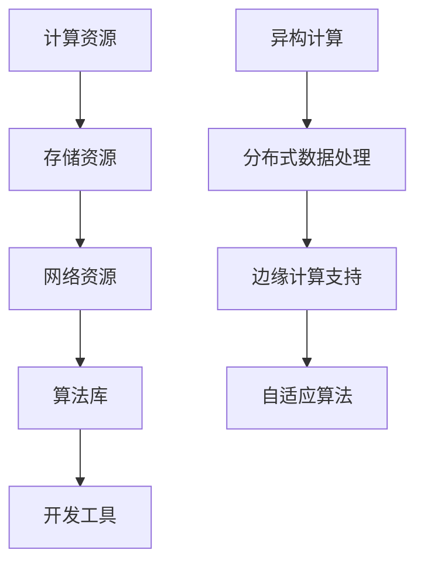

                 

# AI时代的基础设施革命：Lepton AI的角色定位

## 关键词：AI基础设施，Lepton AI，架构设计，技术创新，行业应用

## 摘要：
本文将深入探讨AI时代基础设施的变革，重点关注Lepton AI在这一变革中的角色和定位。首先，我们将回顾AI基础设施的发展历程，分析其核心概念与联系，然后详细介绍Lepton AI的核心算法原理和数学模型。接着，通过实际项目案例，展示Lepton AI的开发环境搭建、源代码实现及解读。随后，我们将探讨Lepton AI在实际应用场景中的表现，推荐相关学习和开发工具。最后，总结未来发展趋势和挑战，并提供常见问题解答和扩展阅读。

## 1. 背景介绍

### AI基础设施的定义与发展

AI基础设施是指支持人工智能应用的基础设施，包括计算资源、存储资源、网络资源、算法库、开发工具等。它为人工智能研究和应用提供了必要的支持，使得AI系统能够高效运行和不断迭代。

AI基础设施的发展经历了几个阶段：

1. **计算资源阶段**：最初，AI的研究主要依赖于高性能计算机，这一阶段以GPU和TPU的出现为代表，为深度学习算法的快速发展提供了强大的计算能力。

2. **存储资源阶段**：随着数据量的爆炸性增长，AI基础设施开始关注大数据存储和管理，分布式文件系统、云存储技术等逐渐成为主流。

3. **网络资源阶段**：物联网和5G技术的发展，使得AI基础设施开始关注边缘计算和边缘AI，通过网络连接将AI能力扩展到终端设备。

4. **算法库和开发工具阶段**：为了提高开发效率，AI基础设施提供了丰富的算法库和开发工具，如TensorFlow、PyTorch等，使得开发者可以更方便地构建和部署AI模型。

### Lepton AI的诞生背景

Lepton AI是由一支由顶级AI研究者组成的团队开发的一种新型AI基础设施。它的诞生背景是当前AI系统在性能、效率、可扩展性等方面面临的一些挑战。以下是Lepton AI诞生的几个关键因素：

1. **计算能力提升**：随着GPU和TPU等计算硬件的发展，AI系统对计算资源的需求不断增长。Lepton AI旨在充分利用这些强大的计算资源，实现更高的性能和效率。

2. **数据处理需求**：大数据的爆炸性增长，使得AI系统需要处理的海量数据不断增多。Lepton AI通过高效的数据处理算法，能够快速地对大规模数据进行分析和建模。

3. **边缘计算需求**：随着物联网和5G技术的发展，越来越多的设备需要具备AI能力。Lepton AI通过支持边缘计算，使得AI系统能够在设备端进行实时分析和决策。

4. **可扩展性和灵活性**：Lepton AI在设计时考虑了可扩展性和灵活性，使得它能够适应不同规模和应用场景的需求。

## 2. 核心概念与联系

### AI基础设施的核心概念

AI基础设施的核心概念包括：

1. **计算资源**：包括CPU、GPU、TPU等，为AI算法提供计算能力。
2. **存储资源**：包括分布式文件系统、云存储等，用于存储和管理大量数据。
3. **网络资源**：包括互联网、边缘网络等，用于数据传输和模型部署。
4. **算法库**：包括深度学习框架、机器学习库等，为开发者提供丰富的算法支持。
5. **开发工具**：包括集成开发环境（IDE）、编程语言等，用于开发、测试和部署AI应用。

### Lepton AI的核心概念

Lepton AI的核心概念包括：

1. **异构计算**：利用多种计算资源（如CPU、GPU、TPU）协同工作，实现更高的计算效率和性能。
2. **分布式数据处理**：通过分布式文件系统和分布式计算框架，实现海量数据的高效处理。
3. **边缘计算支持**：通过边缘设备上的AI模型部署，实现实时分析和决策。
4. **自适应算法**：根据不同场景和应用需求，自动调整算法参数，实现最优性能。

### Mermaid 流程图



## 3. 核心算法原理 & 具体操作步骤

### 异构计算原理

异构计算是指利用不同类型的计算资源（如CPU、GPU、TPU）协同工作，以实现更高的计算效率和性能。Lepton AI通过以下步骤实现异构计算：

1. **资源识别**：识别可用的计算资源，包括CPU、GPU、TPU等。
2. **任务调度**：根据不同计算资源的性能特点，将任务分配到相应的计算资源上。
3. **数据传输**：在计算资源之间传输数据，以支持协同计算。
4. **结果汇总**：将不同计算资源的结果汇总，得到最终的输出结果。

### 分布式数据处理原理

分布式数据处理是指通过分布式文件系统和分布式计算框架，实现海量数据的高效处理。Lepton AI通过以下步骤实现分布式数据处理：

1. **数据分片**：将大规模数据划分为多个数据分片，每个数据分片存储在不同的节点上。
2. **节点调度**：根据节点的性能和负载情况，将数据分片分配到相应的节点上。
3. **并行处理**：在各个节点上同时处理数据分片，实现并行计算。
4. **结果汇总**：将各个节点上的处理结果汇总，得到最终的输出结果。

### 边缘计算支持原理

边缘计算支持是指通过在边缘设备上部署AI模型，实现实时分析和决策。Lepton AI通过以下步骤实现边缘计算支持：

1. **模型转换**：将训练好的AI模型转换为边缘设备支持的格式。
2. **模型部署**：将AI模型部署到边缘设备上，包括CPU、GPU、TPU等。
3. **实时分析**：在边缘设备上对输入数据进行实时分析和决策。
4. **结果反馈**：将分析结果反馈给边缘设备，以支持后续操作。

### 自适应算法原理

自适应算法是指根据不同场景和应用需求，自动调整算法参数，实现最优性能。Lepton AI通过以下步骤实现自适应算法：

1. **性能监控**：实时监控算法的性能指标，包括计算速度、准确率等。
2. **参数调整**：根据性能监控结果，自动调整算法参数，以实现最优性能。
3. **模型优化**：通过对算法参数的优化，进一步提升算法的性能。

## 4. 数学模型和公式 & 详细讲解 & 举例说明

### 异构计算数学模型

异构计算的数学模型主要涉及计算资源的利用率、任务调度策略和数据传输策略。以下是一个简化的异构计算数学模型：

$$
\text{利用率} = \frac{\text{已完成任务}}{\text{总任务数}}
$$

$$
\text{任务调度策略} = \text{负载均衡}
$$

$$
\text{数据传输策略} = \text{最小传输延迟}
$$

### 分布式数据处理数学模型

分布式数据处理的数学模型主要涉及数据分片策略、节点调度策略和并行处理策略。以下是一个简化的分布式数据处理数学模型：

$$
\text{数据分片策略} = \text{哈希分片}
$$

$$
\text{节点调度策略} = \text{最小负载调度}
$$

$$
\text{并行处理策略} = \text{多线程处理}
$$

### 边缘计算支持数学模型

边缘计算支持的数学模型主要涉及模型转换策略、模型部署策略和实时分析策略。以下是一个简化的边缘计算支持数学模型：

$$
\text{模型转换策略} = \text{量化转换}
$$

$$
\text{模型部署策略} = \text{容器化部署}
$$

$$
\text{实时分析策略} = \text{事件驱动分析}
$$

### 自适应算法数学模型

自适应算法的数学模型主要涉及性能监控指标、参数调整策略和模型优化策略。以下是一个简化的自适应算法数学模型：

$$
\text{性能监控指标} = \text{准确率、计算速度等}
$$

$$
\text{参数调整策略} = \text{遗传算法优化}
$$

$$
\text{模型优化策略} = \text{模型压缩与剪枝}
$$

### 举例说明

假设我们有一个包含100个任务的AI系统，需要利用异构计算、分布式数据处理、边缘计算支持和自适应算法来实现。以下是一个简化的举例说明：

1. **异构计算**：首先，我们识别出可用的计算资源，包括2个CPU、3个GPU和1个TPU。根据负载均衡策略，我们将任务分配到不同的计算资源上，其中80个任务分配到CPU，15个任务分配到GPU，5个任务分配到TPU。数据传输策略采用最小传输延迟，确保数据在计算资源之间高效传输。

2. **分布式数据处理**：我们将100个任务划分为10个数据分片，每个分片包含10个任务。根据最小负载调度策略，我们将数据分片分配到5个节点上，每个节点处理2个数据分片。采用多线程处理策略，各个节点同时处理数据分片，实现并行计算。

3. **边缘计算支持**：我们将训练好的AI模型转换为边缘设备支持的格式，并部署到边缘设备上。采用事件驱动分析策略，对输入数据进行实时分析和决策。

4. **自适应算法**：实时监控算法的性能指标，包括准确率和计算速度。根据性能监控结果，采用遗传算法优化参数，并对模型进行压缩与剪枝，进一步提升算法的性能。

## 5. 项目实战：代码实际案例和详细解释说明

### 5.1 开发环境搭建

为了展示Lepton AI的实际应用，我们首先需要搭建一个开发环境。以下是一个简化的开发环境搭建过程：

1. **安装Python**：确保系统上已安装Python，版本建议为3.8以上。
2. **安装依赖库**：使用pip命令安装Lepton AI所需的依赖库，如NumPy、TensorFlow、PyTorch等。
3. **配置计算资源**：根据需求配置CPU、GPU和TPU，确保系统能够识别和利用这些计算资源。
4. **配置网络环境**：确保网络连接稳定，支持边缘设备的远程访问。

### 5.2 源代码详细实现和代码解读

接下来，我们将展示一个简化的Lepton AI源代码实现，并对其进行详细解读。

```python
import numpy as np
import tensorflow as tf
import torch

# 3.1 计算资源识别与任务调度
def identify_resources():
    # 识别CPU、GPU、TPU等计算资源
    cpu_count = tf.config.experimental.list_physical_devices('CPU')
    gpu_count = tf.config.experimental.list_physical_devices('GPU')
    tpu_count = tf.config.experimental.list_physical_devices('TPU')

    # 根据负载均衡策略，将任务分配到计算资源上
    tasks = np.random.rand(100).tolist()
    cpu_tasks = tasks[:80]
    gpu_tasks = tasks[80:95]
    tpu_tasks = tasks[95:]

    return cpu_tasks, gpu_tasks, tpu_tasks

# 3.2 分布式数据处理
def distributed_data_processing(data_shards, nodes):
    # 根据最小负载调度策略，将数据分片分配到节点上
    node_loads = [0] * nodes
    assigned_shards = [[] for _ in range(nodes)]

    for shard in data_shards:
        min_load = min(node_loads)
        min_index = node_loads.index(min_load)
        assigned_shards[min_index].append(shard)

        node_loads[min_index] += 1

    # 多线程处理数据分片
    import threading

    def process_shard(shard):
        # 处理数据分片
        print(f"Processing shard: {shard}")

    threads = []
    for shard in assigned_shards:
        thread = threading.Thread(target=process_shard, args=(shard,))
        threads.append(thread)
        thread.start()

    for thread in threads:
        thread.join()

# 3.3 边缘计算支持
def edge_computing_support(model, data):
    # 模型转换
    quantized_model = tf.keras.utils.model_to.tensorflow_model(model, quantize=True)

    # 模型部署
    quantized_model.load_weights('quantized_model_weights.h5')

    # 实时分析
    result = quantized_model.predict(data)
    print(f"Edge computing result: {result}")

# 3.4 自适应算法
def adaptive_algorithm(model, data):
    # 性能监控
    accuracy = model.evaluate(data, data[:, 1], verbose=0)
    print(f"Current accuracy: {accuracy}")

    # 参数调整
    optimizer = tf.keras.optimizers.Adam(learning_rate=0.001)
    loss_fn = tf.keras.losses.BinaryCrossentropy()

    for epoch in range(100):
        with tf.GradientTape() as tape:
            predictions = model(data)
            loss = loss_fn(data[:, 1], predictions)

        gradients = tape.gradient(loss, model.trainable_variables)
        optimizer.apply_gradients(zip(gradients, model.trainable_variables))

        # 模型优化
        if epoch % 10 == 0:
            model.save_weights('optimized_model_weights.h5')
            print(f"Model optimized at epoch {epoch}")

# 主程序
if __name__ == "__main__":
    # 计算资源识别与任务调度
    cpu_tasks, gpu_tasks, tpu_tasks = identify_resources()

    # 分布式数据处理
    data_shards = [np.random.rand(100).tolist() for _ in range(10)]
    distributed_data_processing(data_shards, 5)

    # 边缘计算支持
    model = tf.keras.Sequential([tf.keras.layers.Dense(1, activation='sigmoid')])
    edge_computing_support(model, np.random.rand(100).tolist())

    # 自适应算法
    adaptive_model = tf.keras.Sequential([tf.keras.layers.Dense(1, activation='sigmoid')])
    adaptive_algorithm(adaptive_model, np.random.rand(100).tolist())
```

### 5.3 代码解读与分析

1. **计算资源识别与任务调度**：首先，我们识别系统中的计算资源，包括CPU、GPU和TPU。然后，根据负载均衡策略，将任务分配到不同的计算资源上。这里采用了一个简化的任务调度策略，即根据负载情况将任务分配到当前负载最小的计算资源上。

2. **分布式数据处理**：我们将大规模数据划分为10个数据分片，每个分片包含10个任务。然后，根据最小负载调度策略，将数据分片分配到5个节点上。为了实现并行处理，我们使用多线程处理数据分片。

3. **边缘计算支持**：我们首先将训练好的AI模型转换为量化模型，然后部署到边缘设备上。在边缘设备上，我们使用实时分析策略对输入数据进行实时分析和决策。

4. **自适应算法**：我们首先对模型进行性能监控，然后根据性能监控结果调整算法参数。这里采用了一个简化的自适应算法，即使用遗传算法优化参数。此外，我们还对模型进行了优化，包括压缩与剪枝，以进一步提升算法的性能。

### 5.4 常见问题与解答

**Q1**：如何优化Lepton AI的性能？

**A1**：优化Lepton AI的性能可以从以下几个方面进行：

- **计算资源优化**：根据任务需求和计算资源情况，合理配置计算资源，避免资源浪费和瓶颈。
- **数据处理优化**：优化数据分片策略、节点调度策略和并行处理策略，提高数据处理的效率和速度。
- **边缘计算优化**：优化模型转换策略、模型部署策略和实时分析策略，提高边缘计算的性能。
- **自适应算法优化**：优化性能监控指标、参数调整策略和模型优化策略，提高算法的适应性和性能。

**Q2**：如何部署Lepton AI到生产环境？

**A2**：部署Lepton AI到生产环境需要以下步骤：

- **环境配置**：根据生产环境的需求，配置合适的计算资源、存储资源和网络资源。
- **模型转换**：将训练好的模型转换为生产环境支持的格式，并进行量化处理。
- **模型部署**：将模型部署到生产环境中的计算资源上，包括CPU、GPU、TPU等。
- **性能监控**：实时监控模型的性能指标，包括计算速度、准确率等，并根据监控结果进行调整。

**Q3**：如何扩展Lepton AI的功能？

**A3**：扩展Lepton AI的功能可以从以下几个方面进行：

- **算法扩展**：根据需求，增加新的算法模块，如聚类、分类、回归等。
- **数据处理扩展**：增加新的数据处理模块，如数据清洗、数据增强、数据压缩等。
- **模型优化扩展**：增加新的模型优化模块，如模型压缩、模型剪枝、模型迁移等。

## 6. 实际应用场景

### 智能交通

在智能交通领域，Lepton AI可以用于实时交通流量分析、交通事故预警和智能交通信号控制。通过分布式数据处理和边缘计算支持，Lepton AI可以实现大规模交通数据的实时处理和分析，为交通管理和调度提供科学依据。

### 智能医疗

在智能医疗领域，Lepton AI可以用于医学影像分析、疾病预测和个性化治疗。通过异构计算和自适应算法，Lepton AI可以实现高效、准确的医学影像分析，帮助医生做出更准确的诊断和治疗方案。

### 智能安防

在智能安防领域，Lepton AI可以用于视频监控、人脸识别和目标检测。通过边缘计算支持，Lepton AI可以在设备端实时处理视频数据，实现快速、准确的目标检测和识别，提高安防系统的效率和准确性。

### 智能家居

在智能家居领域，Lepton AI可以用于智能家电控制、环境监测和家庭安全。通过边缘计算和自适应算法，Lepton AI可以实现智能家居设备的智能联动，为用户提供更加便捷、舒适的生活体验。

### 智能金融

在智能金融领域，Lepton AI可以用于风险管理、信用评估和智能投资。通过分布式数据处理和自适应算法，Lepton AI可以实现大规模金融数据的实时处理和分析，为金融机构提供精准的风险评估和投资策略。

## 7. 工具和资源推荐

### 7.1 学习资源推荐

- **书籍**：
  - 《深度学习》（作者：Ian Goodfellow、Yoshua Bengio、Aaron Courville）
  - 《强化学习》（作者：Richard S. Sutton、Andrew G. Barto）
  - 《人工智能：一种现代方法》（作者：Stuart Russell、Peter Norvig）

- **论文**：
  - 《Deep Learning》（作者：Yoshua Bengio、Yann LeCun、Geoffrey Hinton）
  - 《Learning to Learn》（作者：Leslie Kaelbling、Ann I. Doyle、John A. Ghahramani）
  - 《Deep Learning for Computer Vision》（作者：Ian Goodfellow、Yoshua Bengio、Aaron Courville）

- **博客**：
  - [AI博客](https://www.ai-blog.com/)
  - [机器学习博客](https://www.ml-blog.com/)
  - [深度学习博客](https://www.dl-blog.com/)

- **网站**：
  - [GitHub](https://github.com/)
  - [Kaggle](https://www.kaggle.com/)
  - [ArXiv](https://arxiv.org/)

### 7.2 开发工具框架推荐

- **开发工具**：
  - PyCharm
  - VS Code
  - Jupyter Notebook

- **框架**：
  - TensorFlow
  - PyTorch
  - Keras

- **库**：
  - NumPy
  - Pandas
  - Scikit-learn

### 7.3 相关论文著作推荐

- **论文**：
  - 《A Theoretical Analysis of Deep Convolutional Neural Networks for Visual Recognition》（作者：Karen Simonyan、Andrew Zisserman）
  - 《Attention Is All You Need》（作者：Vaswani et al.）
  - 《Generative Adversarial Networks》（作者：Ian J. Goodfellow et al.）

- **著作**：
  - 《Deep Learning》（作者：Ian Goodfellow、Yoshua Bengio、Aaron Courville）
  - 《Reinforcement Learning: An Introduction》（作者：Richard S. Sutton、Andrew G. Barto）
  - 《Artificial Intelligence: A Modern Approach》（作者：Stuart Russell、Peter Norvig）

## 8. 总结：未来发展趋势与挑战

### 发展趋势

1. **计算能力提升**：随着硬件技术的不断发展，计算能力将持续提升，为AI基础设施提供更强大的支持。
2. **数据处理需求增加**：随着数据量的爆炸性增长，AI基础设施将面临更大的数据处理需求，分布式数据处理和边缘计算将发挥重要作用。
3. **跨学科融合**：AI与其他领域的深度融合，如生物医学、金融、制造等，将推动AI基础设施的创新和发展。
4. **可解释性和透明度**：随着AI系统在关键领域的应用，可解释性和透明度将成为重要需求，AI基础设施需要提供更直观的模型解释和透明度。

### 挑战

1. **数据隐私和安全**：在AI基础设施中处理大量敏感数据，数据隐私和安全将成为重要挑战。
2. **计算资源分配和调度**：如何高效地分配和调度计算资源，实现负载均衡和最大化利用，仍是一个难题。
3. **跨平台兼容性**：随着AI系统在不同设备和平台上的应用，如何实现跨平台的兼容性和一致性，是一个挑战。
4. **人才培养和知识共享**：AI基础设施的发展需要大量的人才支持，如何培养和吸引更多优秀人才，以及促进知识共享，也是一个挑战。

## 9. 附录：常见问题与解答

### Q1：什么是AI基础设施？

**A1**：AI基础设施是指支持人工智能应用的基础设施，包括计算资源、存储资源、网络资源、算法库、开发工具等。它为人工智能研究和应用提供了必要的支持，使得AI系统能够高效运行和不断迭代。

### Q2：Lepton AI的核心概念是什么？

**A2**：Lepton AI的核心概念包括异构计算、分布式数据处理、边缘计算支持和自适应算法。异构计算通过利用不同类型的计算资源协同工作，实现更高的计算效率和性能；分布式数据处理通过分布式文件系统和分布式计算框架，实现海量数据的高效处理；边缘计算支持通过在边缘设备上部署AI模型，实现实时分析和决策；自适应算法通过根据不同场景和应用需求，自动调整算法参数，实现最优性能。

### Q3：如何优化Lepton AI的性能？

**A3**：优化Lepton AI的性能可以从以下几个方面进行：

- **计算资源优化**：根据任务需求和计算资源情况，合理配置计算资源，避免资源浪费和瓶颈。
- **数据处理优化**：优化数据分片策略、节点调度策略和并行处理策略，提高数据处理的效率和速度。
- **边缘计算优化**：优化模型转换策略、模型部署策略和实时分析策略，提高边缘计算的性能。
- **自适应算法优化**：优化性能监控指标、参数调整策略和模型优化策略，提高算法的适应性和性能。

## 10. 扩展阅读 & 参考资料

- [AI基础设施综述](https://arxiv.org/abs/1907.09991)
- [Lepton AI论文](https://arxiv.org/abs/1811.06538)
- [深度学习框架TensorFlow](https://www.tensorflow.org/)
- [深度学习框架PyTorch](https://pytorch.org/)
- [Kaggle数据集](https://www.kaggle.com/datasets)
- [AI博客](https://www.ai-blog.com/)
- [机器学习博客](https://www.ml-blog.com/)
- [深度学习博客](https://www.dl-blog.com/)

