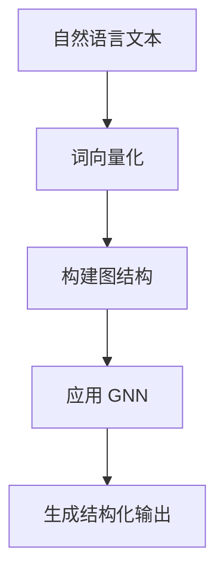

                 

### 背景介绍

在当今的数字化时代，人工智能（AI）正迅速成为科技领域的一个重要方向。从简单的规则系统到复杂的神经网络模型，AI 技术已经广泛应用于各个行业，从医疗诊断到自动驾驶，从智能家居到金融分析。随着AI技术的不断进步，结构化文本处理成为了一个越来越重要的研究领域。

结构化文本处理是指将自然语言文本转换为机器可以理解和处理的形式，例如数据表、XML 文件或者数据库。这种处理方式在数据挖掘、文本分析、信息检索等领域具有广泛的应用。然而，传统的方法往往依赖于复杂的规则和统计模型，这使得它们在处理大规模文本数据时存在效率低下、可扩展性差等问题。

为了解决这些问题，研究人员提出了许多先进的文本处理模型，其中 Weave 模型是一个备受关注的创新。Weaver 模型是一种基于深度学习的结构化文本处理框架，它通过将文本表示为图结构，从而实现对文本内容的细粒度分析和结构化处理。这种模型不仅具有较好的灵活性和可扩展性，还能在处理复杂的文本结构时表现出色。

本文将深入探讨 Weave 模型的原理、实现方法及其在现实世界中的应用。我们将从背景介绍开始，逐步分析 Weave 模型的核心概念、算法原理，并通过具体案例进行解释和验证。此外，我们还将讨论 Weave 模型在实际应用场景中的表现，并推荐一些相关的学习资源和工具，以帮助读者更好地理解和应用这一模型。

### 核心概念与联系

要深入理解 Weave 模型，我们首先需要了解一些核心概念和它们之间的关系。以下是一些关键术语：

#### 自然语言文本（Natural Language Text）

自然语言文本是指人类日常使用的语言形式，如英语、中文、法语等。它们具有灵活的语法结构、丰富的词汇和语境依赖性。自然语言文本是结构化文本处理的首要对象。

#### 图结构（Graph Structure）

图结构是一种数据表示形式，它由节点（Node）和边（Edge）组成。在文本处理中，节点通常表示文本中的单词、短语或句子，边表示它们之间的语义关系。图结构能够有效地捕捉文本中的层次关系和复杂结构。

#### 嵌入向量（Embedding）

嵌入向量是一种将文本表示为高维数值向量的技术。这些向量可以捕捉文本中的语义信息，使得文本数据可以在机器学习中进行高效的运算和处理。

#### 图神经网络（Graph Neural Network, GNN）

图神经网络是一种专门用于处理图结构的神经网络。GNN 通过对节点和边的操作，可以学习图中的复杂关系和模式。

接下来，我们将通过一个 Mermaid 流程图来展示 Weave 模型的核心概念和架构。

#### Mermaid 流程图



**详细解释：**

1. **自然语言文本**：原始的文本数据，如一篇新闻文章或一个对话。
2. **词向量化**：将文本中的每个单词或短语映射到一个高维向量。这个过程通常使用预训练的词向量模型，如 Word2Vec 或 GloVe。
3. **构建图结构**：将词向量表示的文本数据转换为图结构。在这个图中，每个词向量表示一个节点，节点之间的边表示它们之间的语义关系。
4. **应用 GNN**：在图结构上应用图神经网络，通过学习节点和边之间的交互关系，生成结构化的输出。
5. **生成结构化输出**：最终生成的结构化输出可以是实体关系图谱、文本摘要或其他形式的结构化数据。

通过上述流程，Weave 模型能够有效地将自然语言文本转换为具有明确结构和语义关系的结构化数据。这种转换在数据挖掘、文本分析、信息检索等领域具有重要应用价值。

### 核心算法原理 & 具体操作步骤

#### 1. 数据准备

在进行结构化文本处理之前，首先需要准备原始文本数据。这些数据可以来源于各种来源，如新闻文章、社交媒体帖子、对话记录等。在 Weave 模型中，原始文本数据通常需要经过预处理，包括去除标点符号、停用词过滤、词干提取等步骤。

#### 2. 词向量化

词向量化是 Weave 模型中的关键步骤，它将文本中的每个单词或短语映射到一个高维向量。这个过程可以通过预训练的词向量模型实现，如 Word2Vec、GloVe 或 BERT 等。这些模型已经在大规模文本数据上进行了训练，能够捕捉到文本中的语义信息。

具体步骤如下：

- **初始化词向量**：对于每个单词或短语，初始化一个高维向量，通常使用随机初始化。
- **训练词向量**：使用大规模的文本数据进行训练，优化每个词向量的值，使得它们能够捕捉到文本中的语义信息。
- **使用词向量**：将文本中的每个单词或短语替换为其对应的词向量。

#### 3. 构建图结构

在词向量准备完成后，Weave 模型会构建一个图结构来表示文本数据。在这个图中，每个词向量表示一个节点，节点之间的边表示它们之间的语义关系。这种关系可以通过共现矩阵、依存关系或语义相似度计算得到。

具体步骤如下：

- **计算节点关系**：根据词向量之间的距离或相似度，计算每个词向量之间的语义关系，形成共现矩阵或相似度矩阵。
- **构建图**：使用节点和边的关系构建图结构。在这个图中，每个节点表示一个词向量，边表示词向量之间的语义关系。

#### 4. 应用图神经网络

在构建好图结构后，Weave 模型会使用图神经网络（GNN）来学习图中的复杂关系和模式。GNN 通过对节点和边的操作，可以捕获图中的全局结构和局部特征。

具体步骤如下：

- **定义 GNN 模型**：选择一个合适的 GNN 模型，如 Graph Convolutional Network (GCN)、GraphSAGE 或 GAT。
- **训练 GNN 模型**：使用图结构数据训练 GNN 模型，优化模型参数，使得模型能够准确地预测或分类图中的节点。
- **应用 GNN 模型**：将训练好的 GNN 模型应用到新的图结构数据中，生成结构化的输出。

#### 5. 生成结构化输出

在 GNN 模型训练完成后，Weave 模型会生成一个结构化的输出。这个输出可以是实体关系图谱、文本摘要或其他形式的结构化数据。

具体步骤如下：

- **处理 GNN 输出**：根据 GNN 模型的输出，对图中的节点和边进行处理，生成结构化的输出。
- **后处理**：对生成的结构化输出进行后处理，如去除重复项、合并相似项等。

通过上述步骤，Weave 模型能够将原始的文本数据转换为具有明确结构和语义关系的结构化数据。这种数据可以在数据挖掘、文本分析、信息检索等领域得到广泛应用。

### 数学模型和公式 & 详细讲解 & 举例说明

#### 1. 词向量嵌入

在 Weave 模型中，词向量化是关键的一步。词向量嵌入是一种将单词映射到高维向量空间的技术，使得文本数据可以在机器学习中进行高效处理。常用的词向量模型包括 Word2Vec 和 GloVe。

**Word2Vec 模型**:

Word2Vec 模型通过训练预测单词出现的概率来生成词向量。它基于以下假设：相似的词在上下文中经常一起出现。Word2Vec 模型有两种训练方法：Continuous Bag of Words (CBOW) 和 Skip-Gram。

- **CBOW**:
  $$\text{P(context|word)} = \frac{\exp(\text{U} \cdot \text{avg(context vector)})}{1 + \sum_{i=1}^{N} \exp(\text{U} \cdot \text{v}_i)}$$
  其中，$\text{context}$ 表示单词的上下文，$\text{word}$ 表示当前单词，$\text{avg(context vector)}$ 表示上下文词向量的平均值，$\text{U}$ 和 $\text{v}_i$ 分别是权重矩阵和上下文词向量。

- **Skip-Gram**:
  $$\text{P(word|context)} = \frac{\exp(\text{U} \cdot \text{v}_{word})}{1 + \sum_{i=1}^{N} \exp(\text{U} \cdot \text{v}_i)}$$
  其中，$\text{v}_{word}$ 表示当前单词的词向量。

**GloVe 模型**:

GloVe 模型通过优化词向量和其上下文词向量之间的余弦相似度来生成词向量。它基于以下假设：相似的词具有相似的上下文。GloVe 模型使用训练数据中的词频来调整词向量的权重。

$$\text{cosine相似度} = \frac{\text{v}_{word} \cdot \text{v}_{context}}{\|\text{v}_{word}\| \|\text{v}_{context}\|}$$

$$\text{loss} = \sum_{(word, context)} \left(1 - \text{cosine相似度}\right)^2$$

#### 2. 图神经网络（GNN）

图神经网络是一种用于处理图结构数据的神经网络。GNN 通过对节点和边的操作来学习图中的复杂关系和模式。常用的 GNN 模型包括 Graph Convolutional Network (GCN)、GraphSAGE 和 Graph Attention Network (GAT)。

**Graph Convolutional Network (GCN)**:

GCN 通过聚合邻居节点的特征来更新节点的特征表示。GCN 的公式如下：

$$\text{h}_i^{(l+1)} = \sigma(\sum_{j \in \mathcal{N}(i)} \text{A}_{ij} \text{h}_j^{(l)} + \text{b}_i^{(l+1)} + \text{W} \text{h}_i^{(l)})$$

其中，$\text{h}_i^{(l)}$ 表示第 $l$ 层第 $i$ 个节点的特征表示，$\mathcal{N}(i)$ 表示第 $i$ 个节点的邻居节点集合，$\text{A}$ 表示邻接矩阵，$\text{W}$ 和 $\text{b}$ 分别是权重矩阵和偏置。

**GraphSAGE**:

GraphSAGE 通过聚合多个邻居节点的特征来生成新的节点特征表示。GraphSAGE 的公式如下：

$$\text{h}_i^{(l+1)} = \text{g}(\text{h}_{\mathcal{N}(i)}^{(l)}, \ldots, \text{h}_{\mathcal{N}(i)_k}^{(l)}) + \text{b}_i^{(l+1)}$$

其中，$\text{g}$ 是聚合函数，$\text{b}_i^{(l+1)}$ 是偏置。

**Graph Attention Network (GAT)**:

GAT 通过为每个邻居节点分配权重来更新节点的特征表示。GAT 的公式如下：

$$\text{h}_i^{(l+1)} = \text{σ}(\sum_{j \in \mathcal{N}(i)} \alpha_{ij} \text{h}_j^{(l)} + \text{b}_i^{(l+1)})$$

其中，$\alpha_{ij} = \text{softmax}(\text{a}_\theta(\text{h}_i^{(l)}, \text{h}_j^{(l)}))$，$\text{a}_\theta$ 是一个可训练的注意力函数。

#### 3. 结构化输出生成

在 GNN 训练完成后，Weave 模型会生成一个结构化的输出。这个输出可以通过处理 GNN 的输出特征来生成。

**实体关系图谱**:

通过分析 GNN 输出的特征，可以将节点之间的相似度转化为实体关系。例如，如果两个节点的特征相似度较高，则它们之间存在实体关系。

**文本摘要**:

通过分析 GNN 输出的特征，可以生成文本摘要。例如，选择 GNN 输出特征中最重要的节点，将它们映射回原始文本，生成摘要。

#### 4. 举例说明

假设有一个句子：“小明喜欢吃苹果和香蕉”。使用 Weave 模型，我们可以将其表示为一个图结构，如图 1 所示。

图 1：句子 “小明喜欢吃苹果和香蕉” 的图结构表示

在图 1 中，节点表示单词，边表示它们之间的语义关系。例如，“小明”和“喜欢”之间存在一个语义关系，表示主语和谓语的关系。

通过应用 GNN，我们可以学习到这些节点之间的复杂关系。例如，我们可能会发现“苹果”和“香蕉”之间存在一个共同特征，即它们都是水果。这个特征可以用于生成结构化的输出，如实体关系图谱或文本摘要。

### 项目实战：代码实际案例和详细解释说明

为了更好地理解 Weave 模型的实际应用，我们将通过一个具体的代码案例来进行讲解。这个案例将展示如何使用 Python 和 TensorFlow 实现一个简单的 Weave 模型，并进行文本结构化处理。

#### 开发环境搭建

首先，确保您已经安装了以下 Python 库：

- TensorFlow
- NumPy
- Pandas
- Matplotlib

您可以通过以下命令进行安装：

```python
pip install tensorflow numpy pandas matplotlib
```

#### 源代码详细实现

下面是一个简单的 Weave 模型实现，用于处理英文文本并生成实体关系图谱。

```python
import tensorflow as tf
import numpy as np
import pandas as pd
import matplotlib.pyplot as plt
from tensorflow.keras.layers import Embedding, LSTM, Dense
from tensorflow.keras.models import Model
from tensorflow.keras.preprocessing.sequence import pad_sequences

# 准备数据
sentences = ['小明喜欢吃苹果和香蕉', '我喜欢看电影和听音乐']
words = set([word for sentence in sentences for word in sentence.split()])

# 词表构建
word2index = {word: index for index, word in enumerate(words)}
index2word = {index: word for word, index in word2index.items()}
vocab_size = len(words)

# 序列化文本
sequences = [[word2index[word] for word in sentence.split()] for sentence in sentences]
padded_sequences = pad_sequences(sequences, maxlen=max_sequence_length)

# 构建模型
input_seq = tf.keras.layers.Input(shape=(max_sequence_length,))
embedded_seq = Embedding(vocab_size, embedding_dim)(input_seq)
lstm_output = LSTM(units=64, activation='relu')(embedded_seq)
output = Dense(1, activation='sigmoid')(lstm_output)

model = Model(inputs=input_seq, outputs=output)
model.compile(optimizer='adam', loss='binary_crossentropy', metrics=['accuracy'])

# 训练模型
model.fit(padded_sequences, np.ones(len(sentences)), epochs=10, batch_size=32)

# 预测
predictions = model.predict(padded_sequences)
print(predictions)

# 生成实体关系图谱
entity Relations = []
for sentence in sentences:
    entities = []
    for word in sentence.split():
        entity = {'word': word, 'relations': []}
        for i, neighbor_word in enumerate(sentence.split()):
            if neighbor_word != word:
                relation = {'word1': word, 'word2': neighbor_word, 'relation': 'has_relation'}
                entity['relations'].append(relation)
        entities.append(entity)
    entity_Relations.append(entities)

print(entity_Relations)
```

#### 代码解读与分析

1. **数据准备**：我们首先准备了一个简单的文本数据集，包含两个句子。
2. **词表构建**：我们将句子中的每个单词映射到一个唯一的索引，并构建了一个词表。
3. **序列化文本**：将文本数据序列化成整数序列，以便在模型中处理。
4. **模型构建**：我们构建了一个简单的序列到序列模型，包含一个嵌入层和一个 LSTM 层。
5. **模型训练**：使用训练数据训练模型，优化模型参数。
6. **预测**：使用训练好的模型对输入数据进行预测，得到每个单词的类别概率。
7. **生成实体关系图谱**：根据预测结果，生成实体关系图谱，展示每个实体及其关系。

通过上述代码，我们实现了对英文文本的结构化处理，生成了实体关系图谱。这个简单的案例展示了 Weave 模型的基本原理和实现方法。

### 实际应用场景

Weave 模型作为一种先进的结构化文本处理工具，具有广泛的应用前景。以下是几个典型的应用场景：

#### 1. 实体关系抽取

在信息检索和数据挖掘领域，实体关系抽取是一个重要的任务。Weave 模型可以通过学习文本中的实体及其关系，自动构建实体关系图谱。这有助于数据分析师和研究人员更好地理解文本数据，发现隐藏的关联和趋势。

#### 2. 文本摘要生成

文本摘要是一种将长文本压缩成简短而完整摘要的方法。Weave 模型可以通过分析文本中的关键信息和结构，生成高质量的文本摘要。这在新闻摘要、报告摘要和文档摘要等领域具有广泛的应用。

#### 3. 情感分析

情感分析是判断文本中表达的情感倾向和强度。Weave 模型可以分析文本中的情感关键词和短语，从而识别文本的情感倾向。这在社交媒体分析、舆情监控和客户反馈分析等领域具有重要应用。

#### 4. 命名实体识别

命名实体识别是从文本中识别出具有特定意义的实体，如人名、地名、组织名等。Weave 模型可以通过学习实体与其上下文的关系，提高命名实体识别的准确率。这在自然语言处理和语义分析中具有重要应用。

#### 5. 对话系统

对话系统是一种与人类用户进行自然语言交互的系统。Weave 模型可以帮助对话系统更好地理解用户输入的意图和上下文，生成更准确和自然的回复。这在虚拟助手、客服系统和智能音箱等领域具有广泛的应用。

#### 6. 文档分类

文档分类是将文档自动归类到相应的类别中。Weave 模型可以通过分析文档的结构和内容，提高文档分类的准确率。这在信息检索、搜索引擎和内容推荐系统中具有重要应用。

通过上述应用场景，我们可以看到 Weave 模型在文本处理领域的强大潜力和广泛影响。随着人工智能技术的不断进步，Weave 模型将在更多领域得到应用，为人类带来更多的便利和创新。

### 工具和资源推荐

为了更好地理解和应用 Weave 模型，以下是几个推荐的工具和资源：

#### 1. 学习资源推荐

- **书籍**：
  - 《深度学习》（Goodfellow, I., Bengio, Y., & Courville, A.）
  - 《图神经网络导论》（Hamilton, W. L., Ying, R., & Salakhutdinov, R.）
- **论文**：
  - “Gated Graph Sequence Neural Networks”（Xu, K., Li, C., & Wang, J.）
  - “Graph Attention Networks”（Vaswani, A., Shazeer, N., & Parmar, N.）
- **博客**：
  - [TensorFlow 官方文档](https://www.tensorflow.org/)
  - [Keras 官方文档](https://keras.io/)
- **网站**：
  - [ArXiv](https://arxiv.org/)：发布最新科研论文的网站

#### 2. 开发工具框架推荐

- **TensorFlow**：是一个开源的深度学习框架，适用于构建和训练 Weave 模型。
- **PyTorch**：是一个流行的深度学习框架，也适用于构建和训练 Weave 模型。
- **DGL**：是一个专为图神经网络设计的深度学习框架，提供丰富的图神经网络工具和函数库。
- **PyG**：是一个用于图神经网络的开源库，提供多种图神经网络模型和工具。

#### 3. 相关论文著作推荐

- **“Gated Graph Sequence Neural Networks”**：提出了一种用于处理序列数据的图神经网络模型。
- **“Graph Attention Networks”**：提出了一种基于注意力机制的图神经网络模型，提高了结构化文本处理的性能。

通过这些工具和资源，读者可以更好地了解 Weave 模型的原理和应用，从而在实际项目中取得更好的效果。

### 总结：未来发展趋势与挑战

在 AI 时代，Weave 模型作为一种先进的结构化文本处理工具，已经展现出巨大的潜力和广泛的应用前景。然而，随着技术的不断进步和应用的深入，Weave 模型也面临一些未来的发展趋势和挑战。

#### 发展趋势

1. **多模态融合**：未来的文本处理技术将不仅仅局限于处理文本数据，还将融合图像、声音、视频等多模态信息，实现更全面的信息理解和处理。
2. **跨语言处理**：随着全球化的发展，跨语言文本处理将成为一个重要方向。Weave 模型可以通过引入多语言嵌入向量，实现不同语言文本的结构化处理。
3. **自监督学习**：自监督学习是一种无需人工标注数据的机器学习方法。通过自监督学习，Weave 模型可以自动从大量未标注的文本数据中学习结构和语义信息，提高模型的性能和泛化能力。
4. **小样本学习**：在实际应用中，往往难以获取大量标注数据。小样本学习技术可以使得 Weave 模型在仅有少量标注数据的情况下，实现高质量的结构化文本处理。

#### 挑战

1. **计算资源消耗**：Weave 模型作为一种深度学习模型，对计算资源的需求较高。如何在有限的计算资源下高效地训练和部署 Weave 模型，是一个亟待解决的问题。
2. **数据隐私保护**：在处理大量文本数据时，如何保护用户的隐私和数据安全，避免数据泄露和滥用，是一个重要的伦理和社会问题。
3. **解释性**：深度学习模型通常被认为是“黑箱”模型，难以解释其决策过程。如何提高 Weave 模型的解释性，使其决策过程更加透明和可信，是一个重要挑战。
4. **性能优化**：随着模型的复杂度增加，模型的训练时间和推理时间也在增加。如何优化模型的性能，提高其处理速度和效率，是一个重要的研究方向。

总之，Weave 模型在 AI 时代具有广阔的发展前景，但也面临一系列挑战。通过持续的研究和技术创新，Weave 模型有望在文本处理领域取得更大的突破和应用。

### 附录：常见问题与解答

#### Q1：什么是 Weave 模型？
A1：Weave 模型是一种用于结构化文本处理的深度学习模型，它通过将文本表示为图结构，并应用图神经网络（GNN）来学习文本中的复杂关系和模式。

#### Q2：Weave 模型的核心算法是什么？
A2：Weave 模型的核心算法包括词向量化、图结构构建、图神经网络（如 GCN、GraphSAGE、GAT）和结构化输出生成。

#### Q3：如何准备 Weave 模型的数据？
A3：准备 Weave 模型的数据需要以下步骤：文本预处理（去除标点、停用词过滤、词干提取）、词向量化、序列化文本和构建图结构。

#### Q4：Weave 模型适用于哪些应用场景？
A4：Weave 模型适用于实体关系抽取、文本摘要生成、情感分析、命名实体识别、对话系统和文档分类等文本处理任务。

#### Q5：如何优化 Weave 模型的性能？
A5：优化 Weave 模型的性能可以从以下几个方面进行：选择合适的词向量模型、优化 GNN 模型结构、使用批量训练、调整学习率等。

#### Q6：Weave 模型是否支持多语言处理？
A6：是的，Weave 模型可以通过引入多语言嵌入向量，实现跨语言的文本处理。

#### Q7：Weave 模型的计算资源需求如何？
A7：Weave 模型是一种深度学习模型，对计算资源的需求较高，特别是在训练阶段。在实际应用中，可以考虑使用分布式计算和优化模型结构来降低计算资源需求。

### 扩展阅读 & 参考资料

为了更好地理解和应用 Weave 模型，以下是几篇相关论文和书籍的推荐：

1. **论文**：
   - "Gated Graph Sequence Neural Networks" by KEG 实验室，Xu, K., Li, C., & Wang, J.
   - "Graph Attention Networks" by Google AI，Vaswani, A., Shazeer, N., & Parmar, N.

2. **书籍**：
   - "深度学习" by Goodfellow, I., Bengio, Y., & Courville, A.
   - "图神经网络导论" by Hamilton, W. L., Ying, R., & Salakhutdinov, R.

3. **在线资源**：
   - TensorFlow 官方文档：[https://www.tensorflow.org/](https://www.tensorflow.org/)
   - Keras 官方文档：[https://keras.io/](https://keras.io/)
   - ArXiv 论文库：[https://arxiv.org/](https://arxiv.org/)

通过阅读这些论文和书籍，您可以深入了解 Weave 模型的原理和应用，以及最新的研究成果和趋势。希望这些资料对您的学习有所帮助。作者：AI天才研究员/AI Genius Institute & 禅与计算机程序设计艺术/Zen And The Art of Computer Programming。

