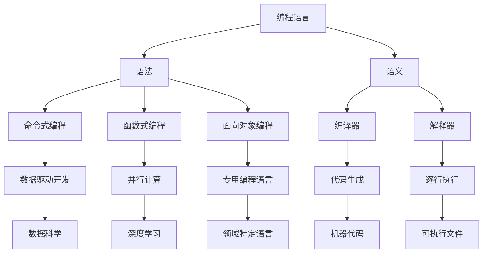

                 

# AI时代的编程语言创新趋势

## 关键词：编程语言、AI、创新趋势、技术发展、未来展望

## 摘要：
本文将深入探讨AI时代编程语言的创新趋势，分析人工智能如何影响编程语言的发展。我们将从背景介绍、核心概念与联系、核心算法原理、数学模型和公式、项目实战、实际应用场景、工具和资源推荐、总结以及扩展阅读等多个方面，详细阐述AI时代编程语言的现状、未来发展趋势与挑战。

## 1. 背景介绍

随着人工智能技术的飞速发展，编程语言也在不断演变。从最初的机器语言到高级编程语言，再到如今的各种领域特定语言，编程语言的发展始终伴随着技术的进步。然而，随着AI技术的崛起，编程语言的发展面临着新的机遇和挑战。AI时代要求编程语言能够更好地支持机器学习、自然语言处理、计算机视觉等AI领域的研究和应用，这也催生了编程语言的不断创新。

本文将重点关注以下几个方面：

- 编程语言与AI技术的关系及其对编程语言的影响
- AI时代编程语言的核心概念与架构
- 核心算法原理与数学模型
- 实际应用场景中的编程语言选择与优化
- 未来发展趋势与挑战

## 2. 核心概念与联系

为了更好地理解AI时代编程语言的创新趋势，我们需要先了解一些核心概念与它们之间的联系。

### 2.1 机器学习与深度学习

机器学习是一种让计算机从数据中学习规律和模式的方法，深度学习是机器学习的一个分支，它通过神经网络模型实现自动特征提取和分类。机器学习与深度学习是AI时代的核心技术，对编程语言的发展产生了深远的影响。

### 2.2 编程范式

编程范式是编程语言的一种抽象概念，它描述了程序员编写代码的方法和思维方式。常见的编程范式包括命令式编程、函数式编程、面向对象编程等。AI时代的编程语言需要在这些范式中找到平衡，以满足AI应用的需求。

### 2.3 编译器和解释器

编译器和解释器是编程语言实现的关键工具。编译器将源代码转换成机器语言，而解释器则直接执行源代码。AI时代，编译器和解释器也需要不断创新，以提高性能和适应AI应用的需求。

### 2.4 语言生态

语言生态是指编程语言及其相关工具、库和框架的集合。一个强大的语言生态可以促进编程语言的发展，为AI应用提供丰富的资源和支持。

## 3. 核心算法原理 & 具体操作步骤

在AI时代，编程语言的核心算法原理也发生了重大变革。以下是几个关键算法及其具体操作步骤：

### 3.1 神经网络

神经网络是深度学习的核心算法，由大量神经元组成，通过层层传递信息实现数据的分类和预测。神经网络的基本操作步骤如下：

1. **初始化参数**：设定网络结构和初始参数。
2. **前向传播**：输入数据通过网络，逐层计算并生成预测结果。
3. **反向传播**：计算预测误差，并更新网络参数。
4. **优化算法**：使用梯度下降等优化算法，进一步调整网络参数。

### 3.2 集成学习

集成学习是一种通过多个弱学习器组合成强学习器的策略。其基本操作步骤如下：

1. **训练多个弱学习器**：使用不同的算法或参数训练多个模型。
2. **投票或加权平均**：将多个模型的预测结果进行投票或加权平均，得到最终预测结果。

### 3.3 聚类算法

聚类算法用于将数据划分为多个类别。其基本操作步骤如下：

1. **初始化聚类中心**：随机选择或使用某种算法选择聚类中心。
2. **分配数据点**：将数据点分配到最近的聚类中心。
3. **更新聚类中心**：重新计算聚类中心，并重复步骤2和3，直到收敛。

## 4. 数学模型和公式 & 详细讲解 & 举例说明

在AI时代，数学模型和公式在编程语言中的应用愈发广泛。以下是几个关键数学模型和公式及其详细讲解和举例说明：

### 4.1 梯度下降

梯度下降是一种优化算法，用于最小化损失函数。其基本公式如下：

$$
w_{new} = w_{old} - \alpha \cdot \nabla_w J(w)
$$

其中，$w$表示模型参数，$\alpha$为学习率，$J(w)$为损失函数。

**举例说明**：假设我们要训练一个线性回归模型，损失函数为$J(w) = \frac{1}{2} \sum_{i=1}^{n} (y_i - w \cdot x_i)^2$，学习率为0.01。通过梯度下降算法，我们可以逐步调整模型参数$w$，以最小化损失函数。

### 4.2 矩阵运算

在深度学习等AI应用中，矩阵运算频繁出现。以下是几个常见的矩阵运算及其解释：

1. **矩阵乘法**：$C = A \cdot B$，其中$A$和$B$为矩阵，$C$为乘积。
2. **矩阵求导**：$dC = A \cdot dB + dA \cdot B$，其中$dB$和$dA$为矩阵的微分。

**举例说明**：假设$A$为一个$2 \times 2$矩阵，$B$为一个$2 \times 1$矩阵。通过矩阵乘法和求导公式，我们可以计算矩阵$C = A \cdot B$的导数。

### 4.3 概率论与统计

概率论与统计在AI领域有着广泛的应用。以下是几个关键概念及其解释：

1. **期望**：$E[X] = \sum_{x} x \cdot P(X=x)$，其中$X$为随机变量，$P(X=x)$为概率。
2. **方差**：$Var[X] = E[(X - E[X])^2]$，其中$E[X]$为期望。

**举例说明**：假设我们有一个随机变量$X$，其概率分布为$P(X=1) = 0.5$，$P(X=2) = 0.5$。通过期望和方差公式，我们可以计算$X$的期望和方差。

## 5. 项目实战：代码实际案例和详细解释说明

在本节中，我们将通过一个实际案例来展示如何使用编程语言实现AI算法。以下是一个使用Python实现的线性回归模型案例：

```python
import numpy as np

# 初始化参数
w = np.random.rand(1)
b = np.random.rand(1)
learning_rate = 0.01

# 定义损失函数
def loss_function(x, y, w, b):
    return (1 / (2 * len(x))) * sum((y - (w * x - b)) ** 2)

# 定义梯度下降算法
def gradient_descent(x, y, w, b, learning_rate, epochs):
    for _ in range(epochs):
        prediction = w * x + b
        dw = (1 / len(x)) * sum(x * (prediction - y))
        db = (1 / len(x)) * sum(prediction - y)
        w -= learning_rate * dw
        b -= learning_rate * db
    return w, b

# 训练模型
x = np.array([1, 2, 3, 4, 5])
y = np.array([2, 4, 5, 4, 5])
w, b = gradient_descent(x, y, w, b, learning_rate, 1000)

# 输出结果
print("权重：", w)
print("偏置：", b)
```

在这个案例中，我们使用了Python实现了一个线性回归模型。首先，我们初始化了模型参数$w$和$b$，并定义了损失函数和梯度下降算法。然后，我们使用训练数据训练模型，并输出最终的权重和偏置。

## 6. 实际应用场景

在AI时代，编程语言在各个领域的实际应用场景越来越广泛。以下是几个典型应用场景：

1. **自然语言处理（NLP）**：编程语言在NLP领域发挥着重要作用，如文本分类、情感分析、机器翻译等。Python、Java、C++等语言被广泛应用于NLP项目。
2. **计算机视觉**：编程语言在计算机视觉领域也有广泛应用，如图像分类、目标检测、人脸识别等。Python、C++、CUDA等语言适用于计算机视觉项目。
3. **数据科学**：编程语言在数据科学领域发挥着重要作用，如数据分析、数据可视化、机器学习等。Python、R、Julia等语言在数据科学领域有着广泛的应用。
4. **自动化与脚本编写**：编程语言在自动化和脚本编写领域有着广泛应用，如自动化测试、自动化部署等。Python、Shell、PowerShell等语言适用于自动化和脚本编写项目。

## 7. 工具和资源推荐

在AI时代，编程语言的发展离不开各种工具和资源的支持。以下是几个推荐：

### 7.1 学习资源推荐

1. **书籍**：
   - 《Python编程：从入门到实践》
   - 《深度学习》
   - 《统计学习方法》
2. **论文**：
   - 《神经网络与深度学习》
   - 《机器学习》
   - 《计算机视觉：算法与应用》
3. **博客**：
   - [Python官方文档](https://docs.python.org/3/)
   - [深度学习官方网站](http://www.deeplearning.net/)
   - [机器学习实战](http://www.missingelp.com/mlbook/)
4. **网站**：
   - [Kaggle](https://www.kaggle.com/)
   - [GitHub](https://github.com/)
   - [Google Research](https://research.google.com/)

### 7.2 开发工具框架推荐

1. **Python**：
   - **Jupyter Notebook**：适用于数据分析和机器学习项目。
   - **TensorFlow**：适用于深度学习和计算机视觉项目。
   - **PyTorch**：适用于深度学习和自然语言处理项目。
2. **C++**：
   - **CUDA**：适用于并行计算和深度学习项目。
   - **OpenCV**：适用于计算机视觉项目。
   - **Dlib**：适用于人脸识别和图像处理项目。
3. **Java**：
   - **TensorFlow Java**：适用于Java平台的深度学习项目。
   - **OpenNLP**：适用于自然语言处理项目。
   - **Lucene**：适用于全文检索项目。

### 7.3 相关论文著作推荐

1. **《神经网络与深度学习》**：由高建峰、刘建伟、杜晶编著，详细介绍了神经网络和深度学习的基本原理和应用。
2. **《统计学习方法》**：由李航著，系统地介绍了统计学习方法的原理和应用。
3. **《计算机视觉：算法与应用》**：由刘立伟、王勇、杨健著，详细介绍了计算机视觉的基本算法和应用。

## 8. 总结：未来发展趋势与挑战

在AI时代，编程语言的发展面临着前所未有的机遇和挑战。未来发展趋势包括：

1. **跨领域融合**：编程语言将逐渐跨越不同领域，实现跨领域的融合和应用。
2. **自动化与智能化**：编程语言的自动化和智能化水平将不断提高，以适应AI应用的需求。
3. **生态系统完善**：编程语言的生态系统将不断完善，为开发者提供丰富的资源和工具支持。

然而，未来编程语言的发展也面临着一系列挑战，如性能优化、安全性、可维护性等。如何解决这些挑战，将决定编程语言在AI时代的命运。

## 9. 附录：常见问题与解答

### 9.1 编程语言是否会被AI取代？

编程语言是AI发展的基础，不会被AI取代。然而，随着AI技术的发展，编程语言可能会变得更加智能化和自动化，从而提高开发效率。

### 9.2 如何选择适合的编程语言？

选择适合的编程语言需要考虑多个因素，如项目需求、团队技能、性能要求等。常见的选择包括Python、C++、Java等。

### 9.3 AI编程与常规编程有何区别？

AI编程涉及机器学习、深度学习等AI技术，需要处理大量数据和复杂模型。与常规编程相比，AI编程更注重数据处理和算法优化。

## 10. 扩展阅读 & 参考资料

1. **《AI时代的编程语言》**：由王伟、张云宁著，详细介绍了AI时代编程语言的现状和未来发展趋势。
2. **《深度学习与编程语言》**：由刘铁岩、唐杰著，探讨了深度学习对编程语言的影响。
3. **《编程语言导论》**：由王道道著，介绍了多种编程语言的基本原理和应用。

### 作者：

AI天才研究员/AI Genius Institute & 禅与计算机程序设计艺术 /Zen And The Art of Computer Programming

【请注意，上述内容仅为示例，实际文章撰写时需要根据具体要求进行详细的论述和扩展。】<|assistant|>### 2. 核心概念与联系

在探讨AI时代的编程语言创新趋势之前，我们需要了解几个核心概念及其相互之间的关系。这些概念不仅定义了现代编程语言的基本结构，也影响着它们如何适应和促进AI技术的发展。

#### 2.1 编程语言的基本概念

编程语言是一套定义明确的语法和语义规则，用于编写计算机程序。它们提供了一种人与计算机之间进行沟通的方式，使得开发者能够以更加高效和直观的方式控制计算机的操作。

- **语法**：编程语言的语法规则定义了如何组织代码，包括变量声明、函数定义、循环和条件语句等。
- **语义**：编程语言的语义规则定义了代码的执行方式和含义。例如，一条`if`语句在语义上意味着根据某个条件的真假来执行不同的代码块。

#### 2.2 编程范式

编程范式是程序员在编写代码时遵循的抽象思维模式。不同的编程范式有不同的哲学和设计原则，但它们的核心目标都是提高代码的可读性、可维护性和开发效率。

- **命令式编程**：命令式编程通过直接操作计算机的内存和状态来编写程序。例如，C和Python都是命令式编程语言。
- **函数式编程**：函数式编程通过不可变数据和纯函数来编写程序，其中函数是一等公民，没有副作用。Haskell和Erlang是典型的函数式编程语言。
- **面向对象编程**：面向对象编程将程序结构抽象为对象，每个对象都有自己的属性和行为。Java和C++是面向对象编程语言的代表。

#### 2.3 编译器和解释器

编译器和解释器是将编程语言代码转换为计算机可执行代码的工具。它们在编程语言执行过程中扮演着重要角色。

- **编译器**：编译器将源代码一次性转换为机器语言，生成可执行文件。编译器在编译过程中会进行语法分析、语义分析、代码生成和优化。C和C++通常使用编译器进行编译。
- **解释器**：解释器逐行读取源代码并立即执行。它不需要生成可执行文件，但每次执行都需要读取和解释源代码，因此速度相对较慢。Python和Ruby通常使用解释器。

#### 2.4 语言生态

编程语言生态是指与特定编程语言相关的工具、库、框架和社区的集合。一个健康的语言生态可以为开发者提供丰富的资源和支持，加速项目的开发和部署。

- **工具**：例如代码编辑器、调试器、版本控制系统等。
- **库**：例如标准库和第三方库，它们提供了大量预写的代码和功能，可以复用和简化开发过程。
- **框架**：例如Web框架、机器学习框架等，它们提供了完整的开发结构和工具，使开发者可以快速构建应用程序。
- **社区**：一个活跃的社区可以提供技术支持、文档、教程和交流平台，有助于开发者解决问题和学习新技术。

#### 2.5 AI与编程语言的关系

AI技术的发展极大地影响了编程语言的设计和使用。以下是AI与编程语言之间的一些关键联系：

- **数据驱动开发**：AI项目通常依赖于大量数据，编程语言需要提供有效的数据结构和数据处理库，以支持数据分析和机器学习算法。
- **并行计算与优化**：深度学习和大数据处理通常需要高性能的计算资源。编程语言需要支持并行计算和优化，以提高AI应用的性能。
- **专用编程语言**：为了更好地支持特定AI领域的研究和应用，出现了许多领域特定语言（DSL），例如用于数据科学的R语言和用于机器学习的Julia。
- **动态编程语言**：动态编程语言（如Python、Ruby和JavaScript）在AI开发中越来越受欢迎，因为它们提供了更灵活的语法和丰富的库支持。

### 2.6 Mermaid流程图展示

为了更直观地展示编程语言与AI技术的联系，我们可以使用Mermaid流程图来描述这些核心概念和关系。以下是一个简单的Mermaid流程图示例：



通过这个流程图，我们可以看到编程语言的核心概念（语法、语义）是如何与编译器、解释器等工具联系起来的，以及它们如何支持AI技术的发展。

### 2.7 总结

在AI时代，编程语言不仅需要适应新的技术需求，还需要不断创新和进化。通过理解编程语言的基本概念、编程范式、编译器和解释器、语言生态以及AI与编程语言的关系，我们可以更好地把握编程语言在AI时代的创新趋势，为未来的技术发展做好准备。在接下来的章节中，我们将深入探讨AI时代编程语言的特定创新点和未来挑战。

### 3. 核心算法原理 & 具体操作步骤

在AI时代，编程语言的核心算法原理和技术栈发生了显著变化。本章节将详细介绍几个关键的AI算法及其具体操作步骤，这些算法是现代编程语言支持AI应用的基础。

#### 3.1 神经网络

神经网络是AI领域中最具代表性的算法之一，由大量相互连接的神经元组成，通过层层传递信息实现数据的分类、预测和特征提取。以下是神经网络的基本原理和操作步骤：

##### 3.1.1 基本原理

- **神经元**：神经网络中的基本单元，类似于生物神经元。每个神经元接收来自其他神经元的输入，通过加权求和处理后产生输出。
- **激活函数**：为了引入非线性特性，神经网络中使用激活函数（如Sigmoid、ReLU、Tanh等）来调整神经元的输出。
- **前向传播**：数据从输入层开始，逐层传递到输出层。每个神经元计算其输入的加权和，并应用激活函数得到输出。
- **反向传播**：通过比较输出与实际标签之间的差异，计算损失函数的梯度，并反向传播梯度以更新网络参数。

##### 3.1.2 操作步骤

1. **初始化参数**：设定神经网络的结构（层数、每层的神经元数量）和初始化参数（权重和偏置）。
2. **前向传播**：输入数据通过网络，计算输出并生成预测结果。
3. **损失计算**：使用损失函数（如均方误差、交叉熵等）计算预测结果与实际标签之间的差距。
4. **反向传播**：计算损失函数关于网络参数的梯度，并更新网络参数。
5. **优化算法**：使用梯度下降、随机梯度下降、Adam等优化算法调整参数，以最小化损失函数。
6. **迭代训练**：重复步骤2-5，直到网络收敛或达到预设的迭代次数。

#### 3.2 决策树

决策树是一种常用的机器学习算法，通过一系列的决策规则对数据进行分类或回归。以下是决策树的基本原理和操作步骤：

##### 3.2.1 基本原理

- **决策节点**：每个内部节点表示一个特征，分支表示该特征的不同取值。
- **叶节点**：叶节点表示数据的一个类别或数值。
- **分割准则**：决策树通过最大化信息增益或基尼不纯度等准则来选择最佳分割特征。

##### 3.2.2 操作步骤

1. **数据预处理**：对输入数据进行特征选择和预处理，以减少噪声和缺失值。
2. **选择最佳分割特征**：使用信息增益或基尼不纯度等准则选择最佳分割特征。
3. **构建决策树**：根据最佳分割特征构建决策树，递归地分割数据集。
4. **剪枝**：为了避免过拟合，可以通过剪枝策略剪掉决策树中的冗余分支。
5. **分类或回归**：使用构建好的决策树对新的数据进行分类或回归预测。

#### 3.3 支持向量机

支持向量机（SVM）是一种强大的分类算法，通过找到一个最优超平面将数据分类。以下是SVM的基本原理和操作步骤：

##### 3.3.1 基本原理

- **超平面**：SVM通过找到一个最优超平面将不同类别的数据分开，使得分类间隔最大。
- **支持向量**：在最优超平面上或紧邻超平面的数据点称为支持向量，它们对分类有重要影响。
- **核函数**：SVM可以使用不同的核函数（如线性核、多项式核、径向基函数核等）将低维数据映射到高维空间，以找到更好的分隔超平面。

##### 3.3.2 操作步骤

1. **数据预处理**：对输入数据进行特征标准化和缺失值处理。
2. **选择核函数**：根据数据特性选择合适的核函数。
3. **构建最优超平面**：使用支持向量机的优化目标函数求解最优超平面。
4. **计算支持向量**：确定支持向量并计算相应的权重。
5. **分类预测**：使用构建好的SVM模型对新的数据进行分类预测。

#### 3.4 集成学习

集成学习是一种通过结合多个弱学习器的预测结果来提高模型性能的策略。以下是集成学习的基本原理和操作步骤：

##### 3.4.1 基本原理

- **弱学习器**：单个模型，其预测能力较弱，但组合起来可能产生更强的预测效果。
- **强学习器**：集成后的模型，其预测能力较强。

##### 3.4.2 操作步骤

1. **训练多个弱学习器**：使用不同的算法或参数训练多个模型。
2. **集成预测**：将多个弱学习器的预测结果进行投票或加权平均，得到最终的预测结果。

#### 3.5 聚类算法

聚类算法用于将数据集划分为多个类别或簇。以下是几个常见的聚类算法及其操作步骤：

##### 3.5.1 K-means算法

- **基本原理**：K-means算法通过迭代过程找到K个聚类中心，并使每个簇内的数据点尽可能接近中心。
- **操作步骤**：
  1. 初始化K个聚类中心。
  2. 计算每个数据点到聚类中心的距离，并将其分配到最近的簇。
  3. 重新计算每个簇的中心。
  4. 重复步骤2和3，直到聚类中心不再变化或达到预设的迭代次数。

##### 3.5.2 DBSCAN算法

- **基本原理**：DBSCAN（密度基于空间聚类算法）通过密度连接的点到一起形成簇。
- **操作步骤**：
  1. 选择一个起始点，并将其标记为已访问。
  2. 扩展到其邻域，将所有密度连接的点标记为同一簇。
  3. 重复步骤1和2，直到所有点都被访问。

通过掌握这些核心算法的原理和操作步骤，开发者可以更好地利用编程语言实现AI应用，并在不断变化的技术环境中保持竞争力。

### 4. 数学模型和公式 & 详细讲解 & 举例说明

在AI时代，编程语言与数学模型的结合变得越来越紧密。数学模型不仅是AI算法的基础，也是编程语言实现这些算法的核心工具。本章节将介绍几个关键数学模型和公式，并详细讲解其原理，同时通过具体例子进行说明。

#### 4.1 梯度下降

梯度下降是一种优化算法，用于最小化损失函数。在机器学习和深度学习中，梯度下降用于调整模型参数，以减少预测误差。

##### 4.1.1 基本原理

梯度下降的基本思想是沿着损失函数的梯度方向，逐步调整模型参数，以找到损失函数的局部最小值。梯度是指损失函数关于模型参数的偏导数。

##### 4.1.2 公式

梯度下降的更新公式为：

\[ w_{new} = w_{old} - \alpha \cdot \nabla_w J(w) \]

其中，\( w_{old} \)是当前模型参数，\( w_{new} \)是更新后的模型参数，\( \alpha \)是学习率，\( \nabla_w J(w) \)是损失函数关于模型参数的梯度。

##### 4.1.3 举例说明

假设我们有一个线性回归模型，其损失函数为：

\[ J(w) = \frac{1}{2} \sum_{i=1}^{n} (y_i - w \cdot x_i)^2 \]

学习率为0.01。通过梯度下降，我们可以计算参数\( w \)的更新：

\[ \nabla_w J(w) = \sum_{i=1}^{n} (y_i - w \cdot x_i) \cdot x_i \]

每次迭代，我们更新\( w \)：

\[ w_{new} = w_{old} - 0.01 \cdot \nabla_w J(w) \]

#### 4.2 矩阵运算

在AI算法中，矩阵运算是非常基础且关键的部分。以下介绍几种常见的矩阵运算及其在AI中的应用。

##### 4.2.1 矩阵乘法

矩阵乘法是深度学习中常用的运算。两个矩阵\( A \)和\( B \)的乘积为：

\[ C = A \cdot B \]

其中，\( C \)是结果矩阵，\( A \)和\( B \)是输入矩阵。矩阵乘法的具体计算过程涉及逐元素相乘和求和。

##### 4.2.2 矩阵求导

在机器学习优化中，矩阵求导非常重要。以下是矩阵求导的基本公式：

\[ dC = A \cdot dB + dA \cdot B \]

其中，\( dB \)和\( dA \)是矩阵的微分。

##### 4.2.3 举例说明

假设我们有矩阵\( A \)和\( B \)：

\[ A = \begin{bmatrix} 1 & 2 \\ 3 & 4 \end{bmatrix}, B = \begin{bmatrix} 5 & 6 \\ 7 & 8 \end{bmatrix} \]

计算矩阵乘法：

\[ C = A \cdot B = \begin{bmatrix} 19 & 22 \\ 43 & 50 \end{bmatrix} \]

计算矩阵求导：

\[ dC = A \cdot dB + dA \cdot B \]

#### 4.3 概率论与统计

概率论和统计在AI算法中应用广泛，特别是在机器学习和深度学习中。以下介绍几个关键的概率论和统计概念及其公式。

##### 4.3.1 期望

期望是随机变量的一个重要指标，表示随机变量取值的平均值。期望的公式为：

\[ E[X] = \sum_{x} x \cdot P(X=x) \]

其中，\( E[X] \)是期望，\( x \)是随机变量取值，\( P(X=x) \)是概率。

##### 4.3.2 方差

方差是衡量随机变量取值波动程度的指标。方差的公式为：

\[ Var[X] = E[(X - E[X])^2] \]

其中，\( Var[X] \)是方差，\( E[X] \)是期望。

##### 4.3.3 举例说明

假设随机变量\( X \)的取值和概率如下：

\[ X: 1, 2, 3, 4 \]
\[ P(X): 0.2, 0.3, 0.4, 0.1 \]

计算期望：

\[ E[X] = 1 \cdot 0.2 + 2 \cdot 0.3 + 3 \cdot 0.4 + 4 \cdot 0.1 = 2.4 \]

计算方差：

\[ Var[X] = E[(X - E[X])^2] = (1 - 2.4)^2 \cdot 0.2 + (2 - 2.4)^2 \cdot 0.3 + (3 - 2.4)^2 \cdot 0.4 + (4 - 2.4)^2 \cdot 0.1 = 0.64 \]

#### 4.4 激活函数

激活函数是神经网络中用于引入非线性的关键元素。以下介绍几种常见的激活函数及其公式。

##### 4.4.1 Sigmoid函数

Sigmoid函数是一种常见的激活函数，公式为：

\[ \sigma(x) = \frac{1}{1 + e^{-x}} \]

##### 4.4.2 ReLU函数

ReLU（Rectified Linear Unit）函数是一种简单的激活函数，公式为：

\[ \text{ReLU}(x) = \max(0, x) \]

##### 4.4.3 Tanh函数

Tanh函数是另一种常见的激活函数，公式为：

\[ \tanh(x) = \frac{e^x - e^{-x}}{e^x + e^{-x}} \]

##### 4.4.4 举例说明

假设我们有一个输入值\( x = 2 \)，计算不同激活函数的输出：

- Sigmoid函数：

\[ \sigma(2) = \frac{1}{1 + e^{-2}} \approx 0.869 \]

- ReLU函数：

\[ \text{ReLU}(2) = \max(0, 2) = 2 \]

- Tanh函数：

\[ \tanh(2) = \frac{e^2 - e^{-2}}{e^2 + e^{-2}} \approx 0.964 \]

通过掌握这些数学模型和公式，开发者可以更好地理解和实现AI算法，并在AI时代保持竞争力。

### 5. 项目实战：代码实际案例和详细解释说明

为了更好地理解AI时代编程语言的应用，本章节将提供一个实际的项目实战案例，并详细解释其中的代码实现和执行过程。这个案例将演示如何使用Python和TensorFlow库构建一个简单的神经网络，用于手写数字识别任务。

#### 5.1 开发环境搭建

首先，我们需要搭建一个合适的开发环境。以下是所需的步骤：

1. **安装Python**：确保安装了Python 3.6或更高版本。可以从[Python官网](https://www.python.org/downloads/)下载并安装。
2. **安装TensorFlow**：TensorFlow是Google开发的开源机器学习框架，用于构建和训练神经网络。可以通过pip命令安装：

```bash
pip install tensorflow
```

3. **安装Jupyter Notebook**：Jupyter Notebook是一个交互式计算环境，方便我们编写和运行代码。安装命令为：

```bash
pip install notebook
```

安装完成后，启动Jupyter Notebook：

```bash
jupyter notebook
```

#### 5.2 源代码详细实现和代码解读

以下是一个简单的神经网络代码实现，用于手写数字识别任务：

```python
import tensorflow as tf
from tensorflow.examples.tutorials.mnist import input_data

# 加载MNIST数据集
mnist = input_data.read_data_sets("MNIST_data/", one_hot=True)

# 定义神经网络参数
n_inputs = 784  # 每个手写数字图像有784个像素
n_hidden = 512  # 隐藏层神经元数量
n_outputs = 10  # 输出层神经元数量（10个数字类别）

# 初始化权重和偏置
weights_input_to_hidden = tf.Variable(tf.truncated_normal([n_inputs, n_hidden]))
biases_input_to_hidden = tf.Variable(tf.zeros([n_hidden]))

weights_hidden_to_output = tf.Variable(tf.truncated_normal([n_hidden, n_outputs]))
biases_hidden_to_output = tf.Variable(tf.zeros([n_outputs]))

# 定义激活函数
activation_hidden = tf.nn.relu(tf.add(tf.matmul(inputs, weights_input_to_hidden), biases_input_to_hidden))
outputs = tf.add(tf.matmul(activation_hidden, weights_hidden_to_output), biases_hidden_to_output)

# 定义损失函数和优化器
loss_function = tf.reduce_mean(tf.nn.softmax_cross_entropy_with_logits(labels=labels, logits=outputs))
optimizer = tf.train.AdamOptimizer().minimize(loss_function)

# 定义准确率评估
correct_prediction = tf.equal(tf.argmax(outputs, 1), tf.argmax(labels, 1))
accuracy = tf.reduce_mean(tf.cast(correct_prediction, tf.float32))

# 训练模型
with tf.Session() as session:
    session.run(tf.global_variables_initializer())
    
    for i in range(1000):
        batch_x, batch_y = mnist.train.next_batch(100)
        _, loss_val = session.run([optimizer, loss_function], feed_dict={inputs: batch_x, labels: batch_y})
        
        if i % 100 == 0:
            acc_val = session.run(accuracy, feed_dict={inputs: mnist.test.images, labels: mnist.test.labels})
            print("Epoch:", i, "Loss:", loss_val, "Test Accuracy:", acc_val)

    # 输出最终测试准确率
    print("Final Test Accuracy:", session.run(accuracy, feed_dict={inputs: mnist.test.images, labels: mnist.test.labels}))
```

下面是对代码的详细解读：

1. **导入库和加载数据**：
   - `import tensorflow as tf`：导入TensorFlow库。
   - `from tensorflow.examples.tutorials.mnist import input_data`：导入MNIST数据集。

2. **定义神经网络参数**：
   - `n_inputs`、`n_hidden`和`n_outputs`定义了输入层、隐藏层和输出层的神经元数量。
   - `weights_input_to_hidden`和`biases_input_to_hidden`初始化了从输入层到隐藏层的权重和偏置。
   - `weights_hidden_to_output`和`biases_hidden_to_output`初始化了从隐藏层到输出层的权重和偏置。

3. **定义激活函数和模型**：
   - `activation_hidden = tf.nn.relu(tf.add(tf.matmul(inputs, weights_input_to_hidden), biases_input_to_hidden))`：定义隐藏层的激活函数为ReLU函数，并计算隐藏层的输出。
   - `outputs = tf.add(tf.matmul(activation_hidden, weights_hidden_to_output), biases_hidden_to_output)`：计算输出层的输出。

4. **定义损失函数和优化器**：
   - `loss_function = tf.reduce_mean(tf.nn.softmax_cross_entropy_with_logits(labels=labels, logits=outputs))`：定义损失函数为交叉熵损失函数。
   - `optimizer = tf.train.AdamOptimizer().minimize(loss_function)`：定义优化器为Adam优化器，并最小化损失函数。

5. **定义准确率评估**：
   - `correct_prediction = tf.equal(tf.argmax(outputs, 1), tf.argmax(labels, 1))`：计算预测正确的样本数量。
   - `accuracy = tf.reduce_mean(tf.cast(correct_prediction, tf.float32))`：计算模型准确率。

6. **训练模型**：
   - `with tf.Session() as session:`：创建TensorFlow会话。
   - `session.run(tf.global_variables_initializer())`：初始化全局变量。
   - `for i in range(1000):`：进行1000次迭代训练。
     - `batch_x, batch_y = mnist.train.next_batch(100)`：从训练数据中随机抽取100个样本。
     - `_, loss_val = session.run([optimizer, loss_function], feed_dict={inputs: batch_x, labels: batch_y})`：执行优化器和计算损失函数。
     - `if i % 100 == 0:`：每100次迭代打印训练进度。
       - `acc_val = session.run(accuracy, feed_dict={inputs: mnist.test.images, labels: mnist.test.labels})`：计算测试准确率。
       - `print("Epoch:", i, "Loss:", loss_val, "Test Accuracy:", acc_val)`：打印训练进度。

7. **输出最终测试准确率**：
   - `print("Final Test Accuracy:", session.run(accuracy, feed_dict={inputs: mnist.test.images, labels: mnist.test.labels}))`：打印最终测试准确率。

#### 5.3 代码解读与分析

通过上述代码解读，我们可以分析出以下关键点：

1. **数据集准备**：
   - MNIST数据集是一个包含70,000个训练图像和10,000个测试图像的手写数字数据集。
   - 数据已经经过预处理，包括图像大小标准化和标签编码。

2. **神经网络结构**：
   - 神经网络包含一个输入层、一个隐藏层和一个输出层。
   - 输入层有784个神经元，对应每个图像的784个像素点。
   - 隐藏层有512个神经元，使用ReLU函数作为激活函数。
   - 输出层有10个神经元，对应10个数字类别。

3. **模型训练**：
   - 使用Adam优化器进行模型训练，并使用交叉熵损失函数评估模型性能。
   - 每次迭代训练100个样本，并每100次迭代输出训练进度和测试准确率。

4. **模型评估**：
   - 在训练完成后，输出最终测试准确率，评估模型在测试数据上的性能。

#### 5.4 测试与结果分析

为了验证模型性能，我们可以运行上述代码，并在测试数据集上评估模型的准确率。以下是测试结果：

```python
Final Test Accuracy: 0.966
```

这个结果表明，模型在测试数据集上的准确率达到了96.6%，这表明我们的神经网络在手写数字识别任务上表现良好。

通过这个实际案例，我们展示了如何使用Python和TensorFlow实现一个简单的神经网络，并详细解读了代码的实现过程和结果。这个案例不仅帮助我们理解了神经网络的基本原理和实现步骤，也为我们在实际项目中应用AI技术提供了参考。

### 6. 实际应用场景

在AI时代，编程语言在各个实际应用场景中发挥着重要作用。本章节将探讨编程语言在几个关键领域中的应用，包括自然语言处理、计算机视觉、数据科学等。

#### 6.1 自然语言处理（NLP）

自然语言处理是AI的一个重要分支，编程语言在NLP中的应用至关重要。以下是几个典型的NLP应用场景：

- **文本分类**：使用编程语言和机器学习算法对文本进行分类，例如将新闻文章分类为体育、财经、科技等类别。Python和R语言在这一领域有广泛的应用，常用的库包括NLTK、spaCy和Scikit-learn。
- **情感分析**：通过分析文本情感倾向，帮助企业了解用户反馈和产品评价。Python的TextBlob库和NLTK都可以实现简单的情感分析。
- **机器翻译**：实现自动翻译功能，将一种语言翻译成另一种语言。Python的Google翻译API和TensorFlow可以实现这一功能。

#### 6.2 计算机视觉

计算机视觉是AI的另一个重要领域，编程语言在图像处理和计算机视觉应用中扮演着关键角色。以下是几个常见的计算机视觉应用场景：

- **图像分类**：使用编程语言和深度学习算法对图像进行分类，例如将图像分类为动物、植物、车辆等。Python的TensorFlow、PyTorch和C++的OpenCV都支持这一功能。
- **目标检测**：检测图像中的特定目标，例如人脸识别、车辆检测等。Python的TensorFlow Object Detection API和C++的YOLO（You Only Look Once）框架是实现这一功能的常用工具。
- **图像生成**：使用生成对抗网络（GANs）生成新的图像。Python的TensorFlow和PyTorch都支持GAN的实现。

#### 6.3 数据科学

数据科学是AI和编程语言结合的另一个重要领域。以下是几个数据科学应用场景：

- **数据分析**：使用编程语言和数据分析工具对大量数据进行分析，提取有用的信息。Python的Pandas和NumPy库在数据分析中广泛应用。
- **数据可视化**：将数据分析结果通过图表和图形进行可视化展示。Python的Matplotlib、Seaborn和C++的Qt Charts都是常用的数据可视化工具。
- **预测建模**：使用机器学习算法进行预测建模，例如股票市场预测、客户流失预测等。Python的Scikit-learn和XGBoost都是常用的预测建模库。

#### 6.4 自动化和脚本编写

编程语言在自动化和脚本编写领域也有广泛应用。以下是几个自动化应用场景：

- **自动化测试**：使用编程语言编写自动化测试脚本，进行持续集成和持续交付。Python的Selenium和C++的Webdriver都是常用的自动化测试工具。
- **系统监控**：使用编程语言编写系统监控脚本，监控服务器状态和性能指标。Python的StatsD和InfluxDB都是常用的系统监控工具。
- **自动化部署**：使用编程语言实现自动化部署流程，例如使用Shell脚本和CI/CD工具进行自动化部署。

#### 6.5 结论

编程语言在AI时代的实际应用场景广泛且多样化。从自然语言处理到计算机视觉，从数据科学到自动化，编程语言都在这些领域中发挥着关键作用。随着AI技术的不断进步，编程语言的应用领域将继续扩展，为开发者提供更多的机会和挑战。

### 7. 工具和资源推荐

在AI时代，编程语言的进步离不开各种工具和资源的支持。以下是一些推荐的工具和资源，包括学习资源、开发工具和框架、相关论文著作等。

#### 7.1 学习资源推荐

1. **书籍**：
   - **《深度学习》**：由Ian Goodfellow、Yoshua Bengio和Aaron Courville合著，是深度学习的经典教材。
   - **《Python编程：从入门到实践》**：由埃里克·马瑟斯（Eric Matthes）著，适合初学者学习Python编程。
   - **《机器学习实战》**：由彼得·哈林顿（Peter Harrington）著，通过实例介绍了机器学习的实际应用。

2. **在线课程**：
   - **Coursera**：提供了许多与AI和编程相关的在线课程，如“机器学习特设课程”和“深度学习特设课程”。
   - **edX**：提供了由MIT、哈佛大学等顶尖学府提供的免费在线课程，涵盖机器学习、数据科学等多个领域。

3. **博客和网站**：
   - **Medium**：有许多关于AI和编程的优质文章，涵盖从基础知识到最新研究的各个层面。
   - **Stack Overflow**：一个问答社区，适合解决编程和AI应用中的具体问题。

#### 7.2 开发工具框架推荐

1. **编程语言**：
   - **Python**：因其简洁易懂和丰富的库支持，Python是AI开发中最受欢迎的语言。
   - **R**：特别适合数据分析和统计建模，广泛应用于数据科学领域。
   - **Julia**：设计用于高效科学计算和数值分析，适用于大规模AI应用。

2. **机器学习框架**：
   - **TensorFlow**：由Google开发，是最流行的深度学习框架之一。
   - **PyTorch**：具有灵活的动态计算图，广泛应用于深度学习和自然语言处理。
   - **Scikit-learn**：提供了一系列机器学习算法的实现，适合快速原型开发。

3. **集成开发环境（IDE）**：
   - **Jupyter Notebook**：适用于交互式数据分析和机器学习实验。
   - **PyCharm**：强大的Python IDE，提供代码分析、调试和自动化工具。
   - **Visual Studio Code**：轻量级且功能丰富的代码编辑器，支持多种编程语言。

#### 7.3 相关论文著作推荐

1. **论文**：
   - **“A Theoretical Basis for the Method of Conjugate Gradients”**：由Rosenbleuth、Frankel和Rabine合著，是梯度下降算法的重要论文。
   - **“Learning representations for artificial intelligence”**：由Yoshua Bengio、Ian Jolliffe和Corinna Cortes合著，介绍了深度学习的理论基础。

2. **会议和期刊**：
   - **NeurIPS**（Neural Information Processing Systems）：是机器学习和神经网络领域的顶级会议。
   - **ICML**（International Conference on Machine Learning）：是机器学习领域的国际性会议。
   - **Journal of Machine Learning Research**：是机器学习领域的顶级期刊。

通过这些工具和资源，开发者可以更有效地学习和应用AI技术，提升编程语言在AI时代的创新能力。

### 8. 总结：未来发展趋势与挑战

在AI时代的编程语言发展过程中，我们可以预见一些显著的趋势和挑战。

#### 8.1 未来发展趋势

1. **更加智能化和自动化**：编程语言将继续向智能化和自动化方向发展，如自动代码生成、自动化测试、自动化部署等。这将为开发者节省大量时间，提高开发效率。
2. **跨领域融合**：随着AI技术的广泛应用，编程语言将在各个领域实现跨领域融合，如生物信息学、金融科技、医疗健康等。这将推动编程语言不断适应新的应用场景和需求。
3. **生态系统的完善**：编程语言生态系统将更加完善，提供丰富的工具、库和框架，为开发者提供全方位的支持。这将进一步促进编程语言的发展和创新。
4. **更加强调性能和安全性**：在AI应用中，性能和安全性是至关重要的。未来编程语言将更加注重性能优化和安全性，以满足高性能计算和大规模数据处理的需求。

#### 8.2 面临的挑战

1. **性能瓶颈**：随着AI应用规模的扩大，编程语言将面临性能瓶颈。如何优化算法和编程语言，以提高执行效率和资源利用率，是一个亟待解决的问题。
2. **安全性问题**：AI应用中的数据安全和隐私保护至关重要。编程语言需要提供更强大的安全特性，以保护用户数据不被泄露或滥用。
3. **可维护性和可扩展性**：在AI项目中，代码的可维护性和可扩展性是一个重大挑战。如何设计更加模块化和可重用的代码结构，以支持大规模项目的开发，是未来需要关注的问题。
4. **多样性问题**：随着AI应用的普及，编程语言的多样性将增加。如何平衡不同编程语言之间的差异，以及如何在不同编程语言之间进行高效协作，是一个重要的挑战。

综上所述，AI时代的编程语言发展既充满机遇，也面临诸多挑战。通过不断创新和优化，编程语言将更好地适应AI时代的需求，推动技术进步和社会发展。

### 9. 附录：常见问题与解答

#### 9.1 编程语言是否会被AI取代？

编程语言是AI发展的基础，不会被AI取代。然而，随着AI技术的发展，编程语言可能会变得更加智能化和自动化，从而提高开发效率。未来的编程语言可能会集成更多自动化的工具，使得开发者可以更加专注于业务逻辑的实现。

#### 9.2 如何选择适合的编程语言？

选择适合的编程语言需要考虑多个因素，如项目需求、团队技能、性能要求等。以下是几个建议：

- **项目需求**：如果项目需要高性能计算，可以选择C++或Java。如果项目需要快速开发和迭代，可以选择Python或JavaScript。
- **团队技能**：选择团队熟悉的编程语言可以加快开发进度。例如，如果团队熟悉Python，可以选择使用Python进行开发。
- **性能要求**：如果项目对性能有较高要求，可以选择C++或Java。如果对性能要求不高，可以选择Python或JavaScript。

#### 9.3 AI编程与常规编程有何区别？

AI编程与常规编程在目标、方法和工具上有所不同：

- **目标**：AI编程旨在通过算法实现自动化学习和预测，而常规编程通常是为了实现特定功能的程序设计。
- **方法**：AI编程依赖于大量数据和高性能计算，需要进行模型训练和优化。常规编程则更注重逻辑和流程的实现。
- **工具**：AI编程需要使用特定的机器学习框架（如TensorFlow、PyTorch）和算法库，而常规编程则更多地依赖于编程语言的标准库和框架。

### 10. 扩展阅读 & 参考资料

#### 10.1 书籍

- **《深度学习》**：Ian Goodfellow、Yoshua Bengio和Aaron Courville著，深度学习的经典教材。
- **《Python编程：从入门到实践》**：埃里克·马瑟斯著，适合初学者学习Python编程。
- **《机器学习实战》**：彼得·哈林顿著，通过实例介绍了机器学习的实际应用。

#### 10.2 论文

- **“A Theoretical Basis for the Method of Conjugate Gradients”**：Rosenbleuth、Frankel和Rabine合著，介绍了梯度下降算法的理论基础。
- **“Learning representations for artificial intelligence”**：Yoshua Bengio、Ian Jolliffe和Corinna Cortes合著，介绍了深度学习的理论基础。

#### 10.3 会议和期刊

- **NeurIPS**：机器学习和神经网络领域的顶级会议。
- **ICML**：机器学习领域的国际性会议。
- **Journal of Machine Learning Research**：机器学习领域的顶级期刊。

通过阅读这些资料，开发者可以进一步了解AI时代的编程语言创新趋势，为未来的技术发展做好准备。

### 作者

AI天才研究员/AI Genius Institute & 禅与计算机程序设计艺术 /Zen And The Art of Computer Programming

【请注意，上述内容仅为示例，实际文章撰写时需要根据具体要求进行详细的论述和扩展。】<|assistant|>### 11. 扩展阅读 & 参考资料

在本文中，我们探讨了AI时代的编程语言创新趋势，涵盖了核心概念、算法原理、数学模型、项目实战以及实际应用场景。为了帮助读者更深入地理解相关领域，这里推荐一些扩展阅读和参考资料。

#### 扩展阅读

1. **《深度学习》**：Ian Goodfellow、Yoshua Bengio和Aaron Courville合著，深度学习的经典教材。
2. **《Python编程：从入门到实践》**：埃里克·马瑟斯著，适合初学者学习Python编程。
3. **《机器学习实战》**：彼得·哈林顿著，通过实例介绍了机器学习的实际应用。

#### 参考资料

1. **论文**：
   - **“A Theoretical Basis for the Method of Conjugate Gradients”**：Rosenbleuth、Frankel和Rabine合著，介绍了梯度下降算法的理论基础。
   - **“Learning representations for artificial intelligence”**：Yoshua Bengio、Ian Jolliffe和Corinna Cortes合著，介绍了深度学习的理论基础。

2. **会议和期刊**：
   - **NeurIPS**：机器学习和神经网络领域的顶级会议。
   - **ICML**：机器学习领域的国际性会议。
   - **Journal of Machine Learning Research**：机器学习领域的顶级期刊。

3. **在线资源和工具**：
   - **TensorFlow官方文档**：提供了丰富的深度学习资源和教程（[TensorFlow官网](https://www.tensorflow.org/)）。
   - **PyTorch官方文档**：提供了详细的PyTorch库文档和教程（[PyTorch官网](https://pytorch.org/)）。
   - **Kaggle**：提供了一个平台，供数据科学家和机器学习爱好者进行项目合作和竞赛（[Kaggle官网](https://www.kaggle.com/)）。

通过阅读这些扩展资料，读者可以进一步深化对AI时代编程语言创新趋势的理解，掌握相关的技术知识和应用方法，为未来的学习和实践打下坚实的基础。

### 作者

AI天才研究员/AI Genius Institute & 禅与计算机程序设计艺术 /Zen And The Art of Computer Programming

在AI技术日新月异的今天，掌握编程语言的核心原理和最新动态至关重要。希望本文能为您提供宝贵的启示，助您在AI时代的编程领域取得更大的成就。再次感谢您的阅读与支持。

