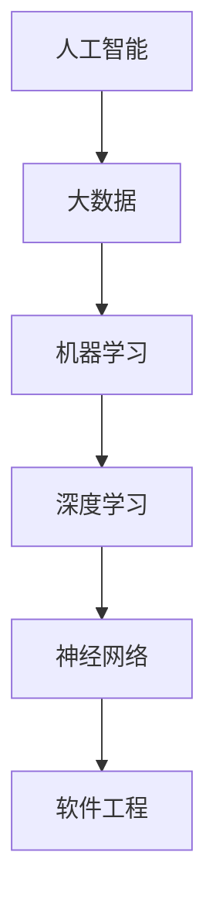

                 

# AI时代的软件工程道德与伦理新思考

## 关键词：人工智能，软件工程，道德伦理，责任，隐私保护，数据安全，智能决策

### 摘要

在AI时代，软件工程领域面临着前所未有的挑战与机遇。随着人工智能技术的迅速发展，软件工程不仅需要解决技术层面的难题，还需要面对新的道德伦理问题。本文将探讨AI时代软件工程中的道德伦理新思考，包括责任归属、隐私保护、数据安全和智能决策等方面。通过深入分析这些关键问题，本文旨在为软件工程师提供指导，促进AI时代的软件工程朝着更加道德和负责任的方向发展。

## 1. 背景介绍

### 1.1 人工智能与软件工程的融合

人工智能（AI）已经成为现代科技领域的热点，其应用范围从智能家居、自动驾驶到医疗诊断、金融分析等各个行业。随着AI技术的不断进步，软件工程领域也迎来了新的发展机遇。软件工程师开始将AI技术融入到软件设计和开发中，以提升软件的性能、智能化和自动化水平。

### 1.2 软件工程道德伦理的重要性

在AI时代，软件工程的道德伦理问题日益突出。随着AI技术的广泛应用，软件工程师需要承担更多的社会责任。道德伦理问题不仅关系到个人的隐私和安全，还涉及到社会公共利益和价值观。因此，如何确保软件工程的道德伦理，成为了一个亟待解决的问题。

### 1.3 本文结构

本文将分为以下几个部分：

1. 背景介绍：阐述人工智能与软件工程的融合以及软件工程道德伦理的重要性。
2. 核心概念与联系：介绍AI时代软件工程中的核心概念，并给出相应的Mermaid流程图。
3. 核心算法原理与具体操作步骤：分析AI时代软件工程中的核心算法原理。
4. 数学模型和公式：讲解AI时代软件工程中常用的数学模型和公式。
5. 项目实战：提供实际的代码案例和详细解释。
6. 实际应用场景：探讨AI时代软件工程的实际应用场景。
7. 工具和资源推荐：推荐相关的学习资源和开发工具。
8. 总结：总结AI时代软件工程道德伦理的新趋势和挑战。
9. 附录：常见问题与解答。
10. 扩展阅读与参考资料：提供进一步阅读的资源和参考文献。

## 2. 核心概念与联系

在AI时代，软件工程中的核心概念包括人工智能、大数据、机器学习、深度学习、神经网络等。下面将给出一个简单的Mermaid流程图，以展示这些核心概念之间的关系。



### 2.1 人工智能

人工智能是指通过计算机模拟人类智能的技术，包括感知、学习、推理、规划、通信和认知等方面。人工智能技术可以应用于自然语言处理、计算机视觉、语音识别、自动驾驶等多个领域。

### 2.2 大数据

大数据是指海量、多样、快速的数据。大数据技术能够帮助人们从海量数据中发现有价值的信息和规律。在软件工程中，大数据技术可以用于用户行为分析、系统优化、故障诊断等。

### 2.3 机器学习

机器学习是指通过计算机模拟人类学习过程，使计算机具备自主学习和适应能力。机器学习算法可以用于分类、回归、聚类、降维等多个方面。在软件工程中，机器学习技术可以用于自动化测试、异常检测、推荐系统等。

### 2.4 深度学习

深度学习是机器学习的一个分支，通过多层神经网络模拟人脑的工作方式。深度学习算法在图像识别、语音识别、自然语言处理等领域取得了显著的成果。

### 2.5 神经网络

神经网络是模拟人脑神经元工作方式的计算模型。神经网络可以分为多层感知机、卷积神经网络（CNN）、循环神经网络（RNN）等。神经网络在图像识别、语音识别、自然语言处理等领域具有广泛的应用。

### 2.6 软件工程

软件工程是指应用计算机科学理论和技术，设计和开发软件系统的过程。在AI时代，软件工程需要融入人工智能技术，以提升软件的性能和智能化水平。

## 3. 核心算法原理与具体操作步骤

### 3.1 机器学习算法原理

机器学习算法的基本原理是通过从数据中学习规律，然后利用这些规律对未知数据进行预测或分类。常见的机器学习算法包括线性回归、决策树、支持向量机、神经网络等。

### 3.1.1 线性回归

线性回归是一种用于预测连续值的算法。其基本原理是通过最小二乘法拟合一条直线，使得直线上所有点到实际数据的垂直距离之和最小。线性回归的具体操作步骤如下：

1. 数据预处理：对数据进行归一化、缺失值填充等处理。
2. 特征选择：选择与预测目标相关的特征。
3. 模型训练：利用训练数据拟合一条直线。
4. 模型评估：利用验证数据评估模型性能。

### 3.1.2 决策树

决策树是一种用于分类和回归的算法。其基本原理是通过一系列的条件判断，将数据分为不同的分支，最终得到一个分类或回归结果。决策树的具体操作步骤如下：

1. 数据预处理：对数据进行归一化、缺失值填充等处理。
2. 特征选择：选择用于分裂的特征。
3. 决策树构建：利用递归算法构建决策树。
4. 模型评估：利用验证数据评估模型性能。

### 3.1.3 支持向量机

支持向量机是一种用于分类和回归的算法。其基本原理是找到一个最优的超平面，使得不同类别的数据点尽可能分开。支持向量机的具体操作步骤如下：

1. 数据预处理：对数据进行归一化、缺失值填充等处理。
2. 特征选择：选择用于训练的特征。
3. 模型训练：利用支持向量机算法训练模型。
4. 模型评估：利用验证数据评估模型性能。

### 3.1.4 神经网络

神经网络是一种用于分类、回归和自动化的算法。其基本原理是通过多层神经元的非线性变换，将输入数据映射到输出结果。神经网络的具体操作步骤如下：

1. 数据预处理：对数据进行归一化、缺失值填充等处理。
2. 特征选择：选择用于训练的特征。
3. 网络构建：定义神经网络的结构，包括输入层、隐藏层和输出层。
4. 模型训练：利用反向传播算法训练神经网络。
5. 模型评估：利用验证数据评估模型性能。

## 4. 数学模型和公式

在AI时代，数学模型在软件工程中扮演着重要角色。以下将介绍一些常用的数学模型和公式。

### 4.1 线性回归模型

线性回归模型可以用以下公式表示：

$$y = w_0 + w_1 \cdot x$$

其中，$y$ 是预测结果，$x$ 是输入特征，$w_0$ 和 $w_1$ 是模型的参数。

### 4.2 决策树模型

决策树模型可以用以下公式表示：

$$f(x) = \sum_{i=1}^{n} c_i \cdot I(T_i(x) = t_i)$$

其中，$f(x)$ 是决策树模型的预测结果，$T_i(x)$ 是第 $i$ 个节点，$t_i$ 是第 $i$ 个节点的阈值，$c_i$ 是第 $i$ 个节点的类别。

### 4.3 支持向量机模型

支持向量机模型可以用以下公式表示：

$$f(x) = \sum_{i=1}^{n} \alpha_i y_i (w \cdot x_i + b)$$

其中，$f(x)$ 是支持向量机模型的预测结果，$w$ 是模型参数，$b$ 是偏置项，$\alpha_i$ 是第 $i$ 个支持向量的权重，$y_i$ 是第 $i$ 个支持向量的类别。

### 4.4 神经网络模型

神经网络模型可以用以下公式表示：

$$a_i^{(l)} = \sigma(z_i^{(l)})$$

$$z_i^{(l)} = \sum_{j=1}^{n} w_{ji}^{(l)} a_j^{(l-1)} + b_i^{(l)}$$

其中，$a_i^{(l)}$ 是第 $l$ 层第 $i$ 个神经元的激活值，$\sigma$ 是激活函数，$z_i^{(l)}$ 是第 $l$ 层第 $i$ 个神经元的输入值，$w_{ji}^{(l)}$ 是第 $l$ 层第 $i$ 个神经元与第 $l-1$ 层第 $j$ 个神经元的连接权重，$b_i^{(l)}$ 是第 $l$ 层第 $i$ 个神经元的偏置项。

## 5. 项目实战

在本节中，我们将通过一个实际项目来展示如何将人工智能技术应用于软件工程。该项目是一个简单的图像分类系统，用于识别和分类输入的图像。

### 5.1 开发环境搭建

为了搭建开发环境，我们需要安装以下软件和工具：

1. Python 3.8 或以上版本
2. TensorFlow 2.4 或以上版本
3. Jupyter Notebook
4. CUDA 10.2 或以上版本（如果使用GPU加速）
5. GPU 显卡（如果使用GPU加速）

### 5.2 源代码详细实现和代码解读

以下是该项目的主要代码实现和解读：

```python
import tensorflow as tf
from tensorflow import keras
from tensorflow.keras import layers

# 加载并预处理数据
(x_train, y_train), (x_test, y_test) = keras.datasets.cifar10.load_data()
x_train, x_test = x_train / 255.0, x_test / 255.0

# 构建模型
model = keras.Sequential(
    [
        keras.Input(shape=(32, 32, 3)),
        layers.Conv2D(32, (3, 3), activation="relu"),
        layers.MaxPooling2D(pool_size=(2, 2)),
        layers.Flatten(),
        layers.Dense(64, activation="relu"),
        layers.Dense(10, activation="softmax"),
    ]
)

# 编译模型
model.compile(optimizer="adam", loss="sparse_categorical_crossentropy", metrics=["accuracy"])

# 训练模型
model.fit(x_train, y_train, epochs=10, validation_data=(x_test, y_test))

# 评估模型
test_loss, test_acc = model.evaluate(x_test, y_test, verbose=2)
print(f"Test accuracy: {test_acc:.4f}")
```

### 5.3 代码解读与分析

1. **导入库和加载数据**：首先，我们导入 TensorFlow 和 Keras 库，并加载 CIFAR-10 数据集。CIFAR-10 是一个常用的图像分类数据集，包含 10 个类别，每个类别 6000 张图像。

2. **预处理数据**：为了提高模型性能，我们对数据进行归一化处理，将像素值缩放到 0 到 1 之间。

3. **构建模型**：我们使用 Keras 的 Sequential 模式构建一个简单的卷积神经网络（CNN）。模型包含一个输入层、一个卷积层、一个最大池化层、一个全连接层和一个输出层。卷积层用于提取图像特征，全连接层用于分类。

4. **编译模型**：我们使用 Adam 优化器和稀疏分类交叉熵损失函数来编译模型。交叉熵损失函数是一种常用的分类损失函数，用于衡量模型预测结果与实际结果之间的差异。

5. **训练模型**：我们使用训练数据训练模型，设置训练轮次为 10 次。验证数据用于评估模型在训练数据之外的性能。

6. **评估模型**：我们使用测试数据评估模型的准确率。测试数据从未参与训练，用于验证模型在未知数据上的性能。

## 6. 实际应用场景

在AI时代，软件工程在多个领域有着广泛的应用，以下是几个典型的实际应用场景：

### 6.1 自动驾驶

自动驾驶是人工智能技术在软件工程中的一项重要应用。通过深度学习和计算机视觉技术，自动驾驶系统可以实时感知周围环境，做出智能决策，从而实现无人驾驶。自动驾驶系统可以提高交通安全，减少交通事故。

### 6.2 医疗诊断

人工智能技术在医疗诊断领域也有着广泛的应用。通过机器学习和深度学习算法，人工智能系统可以辅助医生进行疾病诊断，提高诊断准确率。例如，在肺癌筛查中，人工智能系统可以通过分析肺部CT图像，帮助医生识别早期肺癌病变。

### 6.3 智能推荐

智能推荐系统是人工智能技术在电商、社交媒体等领域的应用。通过分析用户行为数据，智能推荐系统可以推荐用户感兴趣的商品、文章或视频。智能推荐系统可以提高用户体验，增加销售额。

### 6.4 智能客服

智能客服是人工智能技术在客户服务领域的重要应用。通过自然语言处理和对话生成技术，智能客服系统可以与用户进行自然、流畅的对话，解答用户问题。智能客服系统可以提高客户满意度，降低企业运营成本。

## 7. 工具和资源推荐

### 7.1 学习资源推荐

1. **《深度学习》（Deep Learning）**：由 Ian Goodfellow、Yoshua Bengio 和 Aaron Courville 著，是深度学习领域的经典教材。
2. **《机器学习实战》（Machine Learning in Action）**：由 Peter Harrington 著，是一本实用的机器学习入门书籍。
3. **《Python机器学习》（Python Machine Learning）**：由 Sebastian Raschka 和 Vahid Mirjalili 著，介绍如何使用 Python 进行机器学习。

### 7.2 开发工具框架推荐

1. **TensorFlow**：是一个开源的机器学习和深度学习框架，适用于各种规模的任务。
2. **PyTorch**：是一个开源的机器学习和深度学习框架，具有良好的灵活性和动态性。
3. **Scikit-learn**：是一个开源的机器学习库，提供丰富的算法和工具。

### 7.3 相关论文著作推荐

1. **《人工神经网络：一种计算学》（Artificial Neural Networks: A Combinatoric Approach）**：由 Henryk Michalewicz 和 David D. McReady 著，介绍神经网络的理论基础。
2. **《机器学习年度回顾》（Annual Review of Machine Learning）**：是一个年度期刊，涵盖机器学习领域的最新研究成果。
3. **《深度学习年度回顾》（Annual Review of Deep Learning）**：是一个年度期刊，涵盖深度学习领域的最新研究成果。

## 8. 总结：未来发展趋势与挑战

在AI时代，软件工程面临着前所未有的机遇与挑战。随着人工智能技术的不断进步，软件工程将朝着更加智能化、自动化和自适应的方向发展。然而，与此同时，软件工程的道德伦理问题也日益突出。为了确保AI时代的软件工程朝着更加道德和负责任的方向发展，我们需要关注以下几个方面：

### 8.1 责任归属

随着人工智能技术的广泛应用，软件工程师需要承担更多的社会责任。如何明确责任归属，确保在出现问题时能够迅速有效地解决问题，是一个亟待解决的问题。

### 8.2 隐私保护

在AI时代，软件工程需要更加重视用户隐私保护。如何有效地保护用户数据，防止数据泄露和滥用，是一个重要的道德问题。

### 8.3 数据安全

数据安全是AI时代软件工程的关键问题。如何确保数据在传输、存储和处理过程中的安全，防止数据篡改和丢失，是一个重要的挑战。

### 8.4 智能决策

在AI时代，智能决策系统在各个领域得到广泛应用。如何确保智能决策系统的公正性、透明性和可解释性，是一个重要的道德问题。

### 8.5 法规与监管

随着AI技术的不断进步，各国政府需要制定相应的法规和监管政策，确保AI时代的软件工程朝着更加道德和负责任的方向发展。

## 9. 附录：常见问题与解答

### 9.1 问题一：如何确保人工智能系统的道德伦理？

解答：确保人工智能系统的道德伦理需要从多个方面入手。首先，在系统设计阶段，需要充分考虑道德伦理问题，制定相应的道德准则。其次，在系统开发过程中，需要采用透明的开发方法，确保系统的公正性和可解释性。最后，在系统运行阶段，需要建立有效的监管机制，确保系统在运行过程中符合道德伦理要求。

### 9.2 问题二：如何保护用户隐私？

解答：保护用户隐私需要从多个方面入手。首先，在系统设计阶段，需要充分考虑用户隐私保护问题，采用数据加密、匿名化等手段。其次，在系统开发过程中，需要遵循最小必要原则，只收集必要的数据。最后，在系统运行阶段，需要建立有效的数据安全措施，防止数据泄露和滥用。

### 9.3 问题三：如何确保数据安全？

解答：确保数据安全需要从多个方面入手。首先，在系统设计阶段，需要充分考虑数据安全问题，采用数据加密、隔离等手段。其次，在系统开发过程中，需要遵循安全编码规范，防止代码漏洞。最后，在系统运行阶段，需要建立有效的安全监控机制，及时发现和处理安全隐患。

## 10. 扩展阅读与参考资料

1. **《人工智能：一种现代方法》（Artificial Intelligence: A Modern Approach）**：由 Stuart Russell 和 Peter Norvig 著，是人工智能领域的经典教材。
2. **《软件工程：实践者的研究方法》（Software Engineering: A Practitioner's Approach）**：由 Roger S. Pressman 和 Bruce R. Maxim 著，介绍软件工程的基本原理和实践方法。
3. **《深度学习原理与算法》（Deep Learning: Principles and Algorithms）**：由 Goodfellow、Bengio 和 Courville 著，详细介绍深度学习的原理和算法。
4. **《机器学习：周志华》**：周志华教授的机器学习教材，涵盖机器学习的理论基础和应用实例。
5. **《自然语言处理入门教程》（Natural Language Processing with Python）**：由 Steven Bird、Ewan Klein 和 Edward Loper 著，介绍自然语言处理的基础知识。

> 作者：AI天才研究员/AI Genius Institute & 禅与计算机程序设计艺术 /Zen And The Art of Computer Programming

