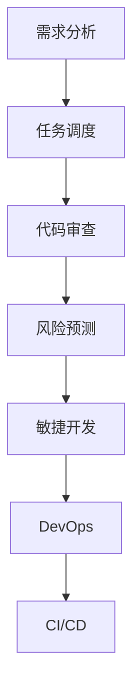

                 

# AI时代的软件项目管理新范式

> 关键词：软件项目管理、AI、敏捷开发、DevOps、持续集成/持续部署

> 摘要：本文将探讨在人工智能时代，软件项目管理面临的新挑战和新机遇。通过分析AI技术对软件开发流程的影响，探讨如何在敏捷开发、DevOps文化下，采用持续集成/持续部署（CI/CD）等实践，提升软件项目的管理效率和质量。文章旨在为IT从业者提供有价值的见解和实用指南。

## 1. 背景介绍

随着人工智能（AI）技术的快速发展，软件开发的范式正在经历深刻变革。传统软件项目管理方法在应对复杂性和动态变化时，显得越来越力不从心。在这种背景下，AI技术的引入为软件项目管理带来了新的机遇和挑战。

AI技术在软件项目管理中的应用主要包括：

- **需求分析：** 通过机器学习算法，AI可以帮助项目团队更准确地理解用户需求，从而降低需求变更的风险。
- **任务调度：** AI可以优化资源分配和任务调度，提高团队的工作效率。
- **代码审查：** AI工具可以自动审查代码质量，提供缺陷检测和修复建议。
- **风险预测：** AI可以通过分析历史数据，预测项目风险，帮助团队采取预防措施。

本文将重点讨论在AI时代，如何结合敏捷开发、DevOps文化和持续集成/持续部署（CI/CD）实践，实现软件项目管理的创新与突破。

## 2. 核心概念与联系

### 2.1 敏捷开发

敏捷开发是一种以人为核心、迭代、循序渐进的开发方法。其主要目标是缩短开发周期，提高软件质量，增强团队的适应能力和灵活性。

### 2.2 DevOps

DevOps是一种软件开发和运维的文化、实践和工具的组合，旨在缩短产品开发周期、加快交付速度，并使 Operations团队能够更加高效地与开发团队协作。

### 2.3 持续集成/持续部署（CI/CD）

持续集成/持续部署是一种软件开发和部署的实践，通过自动化流程实现代码的持续集成、测试和部署，从而提高软件交付的速度和质量。

### 2.4 AI在软件开发中的应用

- **需求分析：** 使用自然语言处理（NLP）技术，AI可以帮助团队理解用户需求，提高需求准确性和一致性。
- **任务调度：** 通过机器学习算法，AI可以优化任务分配和调度，提高团队的工作效率。
- **代码审查：** AI工具可以自动审查代码质量，提供缺陷检测和修复建议。
- **风险预测：** AI可以通过分析历史数据，预测项目风险，帮助团队采取预防措施。

### 2.5 Mermaid 流程图



## 3. 核心算法原理 & 具体操作步骤

### 3.1 敏捷开发

- **迭代开发：** 将项目分为多个迭代周期，每个迭代周期包含需求收集、设计、开发、测试和部署等环节。
- **持续集成：** 将代码定期集成到一个共享的环境中，确保代码的兼容性和稳定性。
- **用户反馈：** 及时收集用户反馈，根据反馈调整开发方向。

### 3.2 DevOps

- **自动化部署：** 使用自动化工具，将代码从开发环境部署到生产环境，减少人工干预和错误。
- **监控与反馈：** 实时监控系统性能，根据监控数据调整部署策略。
- **协作与沟通：** 强化开发团队和运维团队的协作，提高整体效率。

### 3.3 持续集成/持续部署（CI/CD）

- **自动化测试：** 对代码进行自动化测试，确保代码质量。
- **持续集成：** 将代码定期集成到一个共享的环境中，确保代码的兼容性和稳定性。
- **持续部署：** 根据测试结果，将代码部署到生产环境，实现快速迭代。

### 3.4 AI在软件开发中的应用

- **需求分析：** 使用NLP技术，对用户需求进行自然语言处理，提取关键信息。
- **任务调度：** 使用机器学习算法，分析历史数据，优化任务分配和调度。
- **代码审查：** 使用AI工具，对代码进行质量检测，提供缺陷检测和修复建议。
- **风险预测：** 使用历史数据和机器学习算法，预测项目风险，帮助团队采取预防措施。

## 4. 数学模型和公式 & 详细讲解 & 举例说明

### 4.1 敏捷开发中的迭代模型

假设项目包含n个迭代周期，每个迭代周期的成本为c，时间成本为t。则敏捷开发的成本函数可以表示为：

$$C(n) = c \times n + t$$

其中，c为固定成本，t为时间成本。

### 4.2 DevOps中的自动化部署

假设系统包含m个模块，每个模块的部署时间为d，部署成功率为p。则自动化部署的成功率可以表示为：

$$S(m) = p^m$$

其中，p为单个模块的部署成功率。

### 4.3 持续集成/持续部署（CI/CD）中的自动化测试

假设测试包含n个测试用例，每个测试用例的通过率为p。则自动化测试的通过率可以表示为：

$$T(n) = p^n$$

其中，p为单个测试用例的通过率。

### 4.4 AI在软件开发中的应用

假设项目包含m个任务，每个任务的时间需求为t_i，完成概率为p_i。则任务完成的总时间可以表示为：

$$T(m) = \sum_{i=1}^{m} t_i \times p_i$$

其中，t_i为任务i的时间需求，p_i为任务i的完成概率。

## 5. 项目实战：代码实际案例和详细解释说明

### 5.1 开发环境搭建

在本节中，我们将搭建一个简单的软件开发环境，用于演示AI技术在软件项目管理中的应用。

**环境要求：**
- 操作系统：Ubuntu 18.04
- 开发工具：Python 3.8
- AI框架：TensorFlow 2.5

**安装步骤：**

1. 安装Python 3.8：

```bash
sudo apt update
sudo apt install python3.8 python3.8-venv python3.8-pip
```

2. 创建Python虚拟环境：

```bash
python3.8 -m venv myenv
source myenv/bin/activate
```

3. 安装TensorFlow 2.5：

```bash
pip install tensorflow==2.5
```

### 5.2 源代码详细实现和代码解读

在本节中，我们将实现一个简单的AI模型，用于预测软件开发项目的进度。

**源代码：**

```python
import tensorflow as tf
from tensorflow.keras.models import Sequential
from tensorflow.keras.layers import Dense, LSTM

# 数据预处理
def preprocess_data(data):
    # 数据标准化
    data = (data - np.mean(data)) / np.std(data)
    return data

# 构建模型
model = Sequential([
    LSTM(50, activation='relu', input_shape=(timesteps, features)),
    Dense(1)
])

# 编译模型
model.compile(optimizer='adam', loss='mse')

# 训练模型
model.fit(X_train, y_train, epochs=100, batch_size=32)

# 预测项目进度
predicted_progress = model.predict(X_test)
```

**代码解读：**

1. **数据预处理：** 对原始数据进行标准化处理，使其满足模型输入要求。
2. **构建模型：** 使用LSTM（长短期记忆网络）构建一个序列预测模型，用于预测软件开发项目的进度。
3. **编译模型：** 设置优化器和损失函数，准备训练模型。
4. **训练模型：** 使用训练数据训练模型，调整模型参数。
5. **预测项目进度：** 使用训练好的模型，对测试数据进行预测，获取项目进度的预测结果。

### 5.3 代码解读与分析

在本节中，我们将对代码进行详细解读和分析，探讨如何在实际项目中应用AI技术进行软件项目管理。

1. **数据预处理：** 数据预处理是机器学习模型训练的关键步骤。通过标准化处理，我们可以将原始数据转换为适合模型训练的形式。
2. **模型构建：** LSTM模型适用于序列数据预测，能够捕捉数据中的长期依赖关系。在本例中，我们使用LSTM模型预测软件开发项目的进度。
3. **模型编译：** 编译模型是为了设置优化器和损失函数，使得模型在训练过程中能够有效优化参数。
4. **模型训练：** 模型训练是机器学习过程中的核心步骤，通过不断迭代优化，模型能够逐渐提高预测准确性。
5. **模型预测：** 模型预测是应用AI技术进行软件项目管理的核心环节。通过预测项目进度，项目团队可以提前了解项目潜在风险，并采取相应措施。

## 6. 实际应用场景

### 6.1 敏捷开发中的AI应用

在敏捷开发中，AI技术可以帮助团队更好地管理项目进度和资源分配。通过AI预测项目风险和任务完成时间，团队可以更灵活地调整开发计划，提高项目成功率。

### 6.2 DevOps中的AI应用

在DevOps实践中，AI技术可以优化自动化部署流程，提高系统稳定性和可靠性。通过AI预测系统性能瓶颈和故障隐患，DevOps团队能够提前采取措施，降低系统故障风险。

### 6.3 持续集成/持续部署（CI/CD）中的AI应用

在持续集成/持续部署（CI/CD）实践中，AI技术可以帮助团队更高效地管理代码质量和部署过程。通过AI自动审查代码质量和测试结果，团队能够及时发现并修复问题，提高软件交付速度和质量。

## 7. 工具和资源推荐

### 7.1 学习资源推荐

- **书籍：** 《敏捷软件开发：原则、实践与模式》
- **论文：** 《DevOps实践指南》
- **博客：** 《持续集成/持续部署（CI/CD）实战》
- **网站：** [敏捷开发社区](https://www.agilealliance.org/)、[DevOps社区](https://www.devops.com/)、[持续集成/持续部署社区](https://www.cicd.io/)

### 7.2 开发工具框架推荐

- **敏捷开发框架：** Scrum、Kanban
- **DevOps工具：** Jenkins、Docker、Kubernetes
- **持续集成/持续部署工具：** GitLab CI/CD、Jenkins、CircleCI

### 7.3 相关论文著作推荐

- **论文：** 《敏捷开发：一种适应性的软件开发方法》、《DevOps：文化、实践与基础设施的自动化》
- **著作：** 《持续集成：技术实践和模式》、《持续交付：发布可靠软件的系统化方法》

## 8. 总结：未来发展趋势与挑战

在AI时代，软件项目管理面临着新的机遇和挑战。通过结合敏捷开发、DevOps文化和持续集成/持续部署（CI/CD）实践，我们可以充分发挥AI技术的优势，提高软件项目管理的效率和质量。然而，AI技术在软件项目管理中的应用仍然存在一些挑战，如数据隐私、安全性等问题。

未来，随着AI技术的不断发展和完善，软件项目管理将迎来更多创新和突破。项目团队需要持续学习和适应新技术的应用，才能在激烈的市场竞争中立于不败之地。

## 9. 附录：常见问题与解答

### 9.1 AI技术在软件项目管理中如何发挥作用？

AI技术在软件项目管理中可以通过需求分析、任务调度、代码审查、风险预测等方面发挥作用，提高项目的效率和质量。

### 9.2 敏捷开发、DevOps和持续集成/持续部署（CI/CD）之间有何联系和区别？

敏捷开发、DevOps和持续集成/持续部署（CI/CD）都是软件开发中的最佳实践，它们之间有密切的联系和区别。

- **敏捷开发**：强调团队协作、迭代开发和用户反馈，旨在提高软件开发的灵活性和适应性。
- **DevOps**：强调开发团队和运维团队的协作，通过自动化和工具整合，实现快速交付和持续优化。
- **持续集成/持续部署（CI/CD）**：强调代码的自动化测试、集成和部署，确保软件交付的快速和高质量。

### 9.3 如何在项目中应用AI技术进行软件项目管理？

在项目中应用AI技术进行软件项目管理，可以通过以下步骤：

1. 收集和整理项目数据，包括需求、任务、风险等信息。
2. 使用机器学习算法，对项目数据进行处理和分析。
3. 根据分析结果，为项目团队提供预测、优化和决策支持。
4. 持续迭代和优化AI模型，提高预测和决策的准确性。

## 10. 扩展阅读 & 参考资料

- 《人工智能：一种现代的方法》
- 《软件项目管理：实践者的手册》
- 《敏捷开发：原则、实践与模式》
- 《持续交付：发布可靠软件的系统化方法》
- [敏捷开发社区](https://www.agilealliance.org/)
- [DevOps社区](https://www.devops.com/)
- [持续集成/持续部署社区](https://www.cicd.io/)

### 作者

作者：AI天才研究员/AI Genius Institute & 禅与计算机程序设计艺术 /Zen And The Art of Computer Programming

本文旨在探讨AI时代软件项目管理的创新与实践，为广大IT从业者提供有价值的见解和实用指南。希望本文能对您在软件开发项目中的实践有所帮助。如果您有任何问题或建议，欢迎随时与我交流。感谢您的阅读！<|im_sep|>

