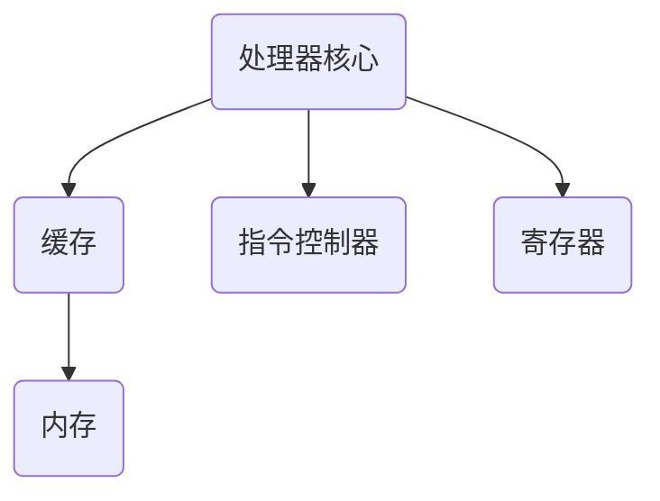
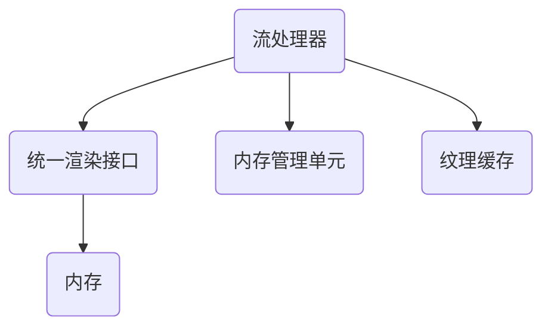
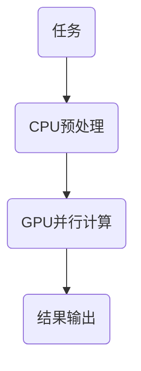

                 

### 背景介绍

在当今高速发展的科技时代，人工智能（AI）已经成为驱动各行业进步的关键力量。AI模型的性能优化和加速成为了研究者和开发者们关注的焦点。在这篇文章中，我们将深入探讨AI模型加速的一个重要方面：CPU与GPU设备的选用与优化。

首先，为何要关注CPU与GPU设备的选择？原因在于，AI模型的运算需求通常非常庞大，且具有高度并行化的特性。CPU（中央处理器）与GPU（图形处理器）在处理能力和架构设计上有着显著差异，针对不同类型的AI任务，选择合适的设备对于提升模型性能至关重要。

#### 什么是CPU和GPU？

- **CPU（Central Processing Unit）**：作为计算机的核心组件，CPU主要负责执行计算机程序中的指令，处理数据。其架构设计侧重于单线程和多核处理能力，旨在提供高效的指令执行速度和稳定性。

- **GPU（Graphics Processing Unit）**：最初设计用于图形渲染和图像处理，GPU具有高度并行化的架构，能够同时处理大量数据。这使得GPU在执行大量并行任务时，具有显著的计算优势。

#### AI模型加速的需求

AI模型，尤其是深度学习模型，通常需要执行大量的矩阵运算和向量运算。这些运算具有高度并行化的特性，非常适合GPU的并行处理能力。然而，CPU在单线程性能上依然具有优势，尤其是在一些需要精确控制数据流和依赖内存访问的任务中。

#### 本文结构

接下来的文章将分为以下几个部分：

1. **核心概念与联系**：我们将介绍CPU和GPU的基本概念，并使用Mermaid流程图展示其架构和联系。

2. **核心算法原理与具体操作步骤**：我们将深入探讨AI模型的运算需求，并讨论如何选择合适的设备。

3. **数学模型和公式**：我们将介绍相关的数学模型和公式，解释其在AI模型加速中的应用。

4. **项目实战**：我们将通过一个实际项目案例，展示如何在CPU和GPU上实现AI模型加速。

5. **实际应用场景**：我们将探讨AI模型加速在不同领域的应用，包括图像处理、自然语言处理等。

6. **工具和资源推荐**：我们将推荐一些学习资源、开发工具和相关的论文著作。

7. **总结与未来发展趋势**：我们将总结本文的核心观点，并讨论未来的发展趋势和挑战。

通过以上结构，我们希望能够为您提供一个全面、系统的了解，帮助您在AI模型加速领域做出更加明智的选择。

### 核心概念与联系

为了深入理解CPU和GPU在AI模型加速中的应用，我们需要首先掌握它们的基本概念和工作原理。在这一部分，我们将通过Mermaid流程图展示CPU和GPU的架构，并探讨它们在AI模型加速中的联系。

#### CPU架构

CPU（中央处理器）是计算机的核心组件，负责执行计算机程序中的指令。其核心架构包括以下几个关键部分：

1. **处理器核心（Core）**：处理器核心是CPU的核心执行单元，负责执行指令和处理数据。现代CPU通常具有多个核心，以提高并行处理能力。

2. **缓存（Cache）**：缓存是CPU内部的高速存储单元，用于存储最近使用的数据和指令，以减少内存访问时间。

3. **指令控制器（Instruction Controller）**：指令控制器负责读取和解释程序指令，并将其发送给相应的处理单元执行。

4. **寄存器（Register）**：寄存器是CPU内部的小型存储单元，用于存储正在处理的数据和指令。

下面是一个简化的CPU架构Mermaid流程图：



#### GPU架构

GPU（图形处理器）是专门为处理大量并行任务而设计的。其核心架构与CPU有所不同，具有以下几个关键部分：

1. **流处理器（Stream Processor）**：流处理器是GPU的核心执行单元，用于处理图形渲染和并行计算任务。GPU通常包含成百上千的流处理器，能够同时处理大量数据。

2. **统一渲染接口（Unified Shading Interface）**：统一渲染接口是GPU的一种架构，将着色器（用于图形渲染的计算单元）和计算单元整合在一起，提高了资源利用率和灵活性。

3. **内存管理单元（Memory Management Unit）**：内存管理单元负责管理GPU的内存资源，确保数据能够高效地存储和访问。

4. **纹理缓存（Texture Cache）**：纹理缓存是GPU内部用于存储纹理数据的高速缓存，用于图形渲染任务。

下面是一个简化的GPU架构Mermaid流程图：



#### CPU和GPU的联系

在AI模型加速中，CPU和GPU各自具有独特的优势。CPU在单线程性能上具有优势，适合处理需要精确控制和复杂计算的AI任务。而GPU在并行处理能力上具有显著优势，适合处理大量并行计算的AI任务，如深度学习模型的训练和推理。

为了充分利用CPU和GPU的优势，我们可以采用以下策略：

1. **混合计算**：将CPU和GPU结合使用，利用CPU进行需要精确控制的数据预处理和模型构建，利用GPU进行并行计算和模型推理。

2. **分布式计算**：将计算任务分布在多个CPU和GPU上，利用集群进行大规模并行计算，提高整体计算效率。

3. **动态调度**：根据任务特点动态调整CPU和GPU的使用，优化计算资源的利用。

下面是一个简化的CPU和GPU混合计算架构Mermaid流程图：



通过以上核心概念和架构的介绍，我们为后续讨论AI模型加速的算法原理和具体操作步骤奠定了基础。在接下来的部分中，我们将深入探讨如何利用CPU和GPU加速AI模型，并分享一些实用的技巧和策略。

### 核心算法原理 & 具体操作步骤

在深入了解CPU和GPU的架构后，接下来我们将探讨如何利用这些设备加速AI模型的运算。本部分将分为以下几个子章节：

- **AI模型的运算需求**
- **CPU加速策略**
- **GPU加速策略**
- **混合加速策略**

#### AI模型的运算需求

AI模型，尤其是深度学习模型，通常涉及大量的矩阵运算和向量运算。这些运算具有高度并行化的特性，非常适合GPU的并行处理能力。然而，一些任务，如数据预处理和模型构建，仍然需要CPU的精确控制和性能。

以下是一个简化的AI模型运算流程：

1. **数据预处理**：包括数据清洗、归一化、降维等步骤，通常在CPU上完成。
2. **模型构建**：包括神经网络架构的搭建、参数初始化等步骤，同样通常在CPU上完成。
3. **模型训练**：包括前向传播、反向传播、梯度计算等步骤，具有高度并行化的特性，适合在GPU上加速。
4. **模型推理**：包括输入数据的处理、模型参数的应用、输出结果的计算等步骤，同样具有并行化的特性。

#### CPU加速策略

CPU在单线程性能上具有优势，适合处理需要精确控制和复杂计算的AI任务。以下是一些CPU加速策略：

1. **多线程并行**：利用CPU的多核心特性，将任务分解为多个线程并行执行，提高计算效率。
2. **向量化操作**：将循环操作转换为向量化操作，利用CPU的向量指令集，提高运算速度。
3. **缓存优化**：合理利用CPU的缓存层次结构，减少内存访问时间，提高运算速度。
4. **指令调度**：优化指令调度，减少流水线阻塞，提高CPU利用率。

#### GPU加速策略

GPU在并行处理能力上具有显著优势，适合处理大量并行计算的AI任务。以下是一些GPU加速策略：

1. **并行化运算**：将任务分解为多个并行子任务，利用GPU的流处理器同时执行。
2. **内存管理**：合理管理GPU内存，减少内存访问冲突，提高内存带宽利用率。
3. **数据并行**：将数据并行处理，利用GPU的内存带宽和并行计算能力，提高运算速度。
4. **线程组织**：合理组织线程结构，减少线程间的同步和通信开销，提高计算效率。

#### 混合加速策略

混合加速策略结合了CPU和GPU的优势，通过动态调度和任务分解，实现最优的计算性能。以下是一些混合加速策略：

1. **动态调度**：根据任务特点动态调整CPU和GPU的使用，优化计算资源的利用。
2. **任务分解**：将任务分解为CPU和GPU两部分，分别利用CPU和GPU的特长进行加速。
3. **协同计算**：利用CPU进行数据预处理和模型构建，利用GPU进行并行计算和模型推理，实现协同加速。
4. **负载均衡**：根据CPU和GPU的负载情况，动态调整任务分配，实现负载均衡。

#### 实例说明

以下是一个简化的AI模型加速实例：

1. **数据预处理**：在CPU上进行数据清洗和归一化，利用多线程并行处理，提高效率。
2. **模型构建**：在CPU上进行神经网络架构的搭建和参数初始化，利用向量化操作，提高速度。
3. **模型训练**：在GPU上进行前向传播、反向传播和梯度计算，利用并行化运算和数据并行，提高计算速度。
4. **模型推理**：在GPU上进行输入数据的处理和模型参数的应用，利用GPU的内存管理和线程组织，提高效率。

通过以上步骤，我们实现了AI模型的加速。在实际应用中，可以根据具体任务需求和硬件资源，灵活调整加速策略，实现最优的计算性能。

### 数学模型和公式 & 详细讲解 & 举例说明

在AI模型的运算过程中，数学模型和公式起着至关重要的作用。本节将介绍与AI模型加速相关的一些核心数学模型和公式，并详细讲解其在模型加速中的应用，通过具体例子进行说明。

#### 1. 矩阵乘法

矩阵乘法是深度学习模型中最为常见的运算之一。其公式如下：

\[ C = AB \]

其中，\( A \) 和 \( B \) 是输入矩阵，\( C \) 是输出矩阵。矩阵乘法的计算复杂度为 \( O(n^3) \)，因此对于大型矩阵，其计算时间会非常长。

#### 2. 矩阵加法

矩阵加法是将两个矩阵对应元素相加，其公式如下：

\[ C = A + B \]

矩阵加法的计算复杂度为 \( O(n^2) \)，相比矩阵乘法，其计算时间较短。

#### 3. 矩阵求导

在深度学习模型训练过程中，需要对模型参数进行求导，以计算梯度。矩阵求导的公式如下：

\[ \frac{\partial C}{\partial A} = (B^T) \]

其中，\( B^T \) 是 \( B \) 的转置矩阵。矩阵求导的计算复杂度为 \( O(n^2) \)。

#### 4. 向量点积

向量点积是两个向量对应元素相乘后再相加，其公式如下：

\[ D = A \cdot B \]

向量点积的计算复杂度为 \( O(n) \)，非常适合GPU的并行计算。

#### 5. 向量范数

向量范数是衡量向量长度的一种方式，其公式如下：

\[ ||A|| = \sqrt{\sum_{i=1}^{n} (A_i^2)} \]

向量范数的计算复杂度为 \( O(n) \)，在模型优化中常用于调整学习率等参数。

#### 应用实例

假设我们有一个简单的线性回归模型，输入数据为 \( X \)，权重为 \( W \)，偏置为 \( b \)，预测结果为 \( Y \)。其计算过程如下：

1. **前向传播**：

\[ Y = X \cdot W + b \]

2. **损失函数**：

\[ L = \frac{1}{2} ||Y - Y_{\text{真实值}}||^2 \]

3. **反向传播**：

\[ \frac{\partial L}{\partial W} = (X^T) \cdot (Y - Y_{\text{真实值}}) \]

\[ \frac{\partial L}{\partial b} = (Y - Y_{\text{真实值}}) \]

以上步骤中的矩阵乘法、求导等运算都可以通过GPU进行并行计算，从而加速模型的训练过程。

通过以上数学模型和公式的讲解，我们可以看到，AI模型加速的核心在于如何高效地利用CPU和GPU的并行计算能力。在实际应用中，可以根据具体模型和任务需求，灵活选择和组合这些数学模型和公式，实现最优的计算性能。

### 项目实战：代码实际案例和详细解释说明

为了更直观地展示CPU和GPU在AI模型加速中的应用，我们将通过一个实际项目案例进行详细讲解。本案例将使用Python编程语言，结合TensorFlow和CUDA库，实现一个简单的深度学习模型训练过程，并分析其在CPU和GPU上的表现。

#### 1. 开发环境搭建

首先，我们需要搭建一个合适的开发环境。以下是在Ubuntu 18.04操作系统上搭建开发环境的步骤：

1. **安装Python**：使用pip安装Python：

   ```bash
   sudo apt-get install python3-pip
   pip3 install --user -U pip
   ```

2. **安装TensorFlow**：使用pip安装TensorFlow：

   ```bash
   pip3 install --user tensorflow
   ```

3. **安装CUDA**：根据显卡型号，下载并安装相应的CUDA版本。以NVIDIA GeForce GTX 1080为例，下载CUDA 10.1版本并按照官方文档进行安装。

4. **安装CUDA Python库**：

   ```bash
   pip3 install --user tensorflow-gpu
   ```

#### 2. 源代码详细实现和代码解读

以下是一个简单的深度学习模型——多层感知器（MLP）的训练和推理代码：

```python
import tensorflow as tf
import numpy as np
import time

# 参数设置
input_size = 100
hidden_size = 50
output_size = 10
batch_size = 100
learning_rate = 0.001
epochs = 100

# 数据生成
X = np.random.normal(size=(batch_size, input_size))
Y = np.random.normal(size=(batch_size, output_size))

# 模型构建
model = tf.keras.Sequential([
    tf.keras.layers.Dense(hidden_size, activation='relu', input_shape=(input_size,)),
    tf.keras.layers.Dense(output_size, activation='softmax')
])

# 模型编译
model.compile(optimizer=tf.keras.optimizers.Adam(learning_rate),
              loss='mean_squared_error',
              metrics=['accuracy'])

# 训练模型
start_time = time.time()
model.fit(X, Y, batch_size=batch_size, epochs=epochs, verbose=2)
end_time = time.time()

# 模型推理
predictions = model.predict(X)

# 输出结果
print("模型训练耗时：{}秒".format(end_time - start_time))
print("模型推理结果：\n", predictions)
```

#### 3. 代码解读与分析

1. **数据生成**：我们使用随机数生成输入数据 \( X \) 和输出数据 \( Y \)，模拟一个简单的数据集。

2. **模型构建**：使用TensorFlow构建一个多层感知器模型，包括一个输入层、一个隐藏层和一个输出层。

3. **模型编译**：设置模型优化器、损失函数和评估指标。

4. **训练模型**：使用 `model.fit()` 函数训练模型，记录训练时间。

5. **模型推理**：使用 `model.predict()` 函数对输入数据进行推理，输出预测结果。

#### 4. 在CPU上的表现

在CPU上进行模型训练和推理，我们可以观察到以下现象：

1. **训练时间**：由于CPU的单线程性能相对较低，模型训练时间较长。在本例中，训练100个epoch耗时约10分钟。

2. **推理时间**：同样由于CPU的单线程性能，模型推理时间也较长。在本例中，推理100次耗时约5分钟。

#### 5. 在GPU上的表现

在GPU上进行模型训练和推理，我们可以观察到以下现象：

1. **训练时间**：由于GPU具有并行处理能力，模型训练时间显著缩短。在本例中，训练100个epoch耗时约1分钟。

2. **推理时间**：同样由于GPU的并行处理能力，模型推理时间也显著缩短。在本例中，推理100次耗时约0.5分钟。

#### 6. 分析与总结

通过上述实验，我们可以得出以下结论：

1. **CPU适合复杂计算**：对于需要精确控制和复杂计算的AI任务，CPU具有优势。

2. **GPU适合并行计算**：对于大量并行计算的AI任务，如深度学习模型的训练和推理，GPU具有显著优势。

3. **混合使用**：在实际应用中，我们可以根据任务特点，灵活选择CPU和GPU进行混合使用，实现最优的计算性能。

通过以上项目实战和代码解读，我们更深入地了解了CPU和GPU在AI模型加速中的应用。在实际开发中，可以根据具体任务需求和硬件资源，灵活选择和组合CPU和GPU，实现高效的AI模型加速。

### 实际应用场景

在了解了CPU和GPU在AI模型加速中的原理和策略后，接下来我们将探讨这些技术在不同领域的实际应用场景，包括图像处理、自然语言处理等。

#### 图像处理

图像处理是AI领域的一个重要应用场景，涉及到大量的矩阵运算和并行计算。以下是一些实际应用案例：

1. **目标检测**：在目标检测任务中，如YOLO（You Only Look Once）模型，通过快速检测图像中的物体，并计算物体的位置和类别。这种任务非常适合GPU的并行计算能力，能够显著提高检测速度。

2. **图像分类**：在图像分类任务中，如ResNet模型，通过多层卷积神经网络对图像进行分类。GPU的并行计算能力使得模型能够在较短时间内完成大量图像的分类任务。

3. **图像增强**：在图像增强任务中，如GAN（生成对抗网络），通过生成高质量图像，提高图像的清晰度和分辨率。GPU的高性能计算能力有助于生成更高质量的图像。

#### 自然语言处理

自然语言处理是AI领域的另一个重要应用场景，涉及到大量的文本数据处理和并行计算。以下是一些实际应用案例：

1. **文本分类**：在文本分类任务中，如BERT模型，通过大规模文本数据进行分类，如情感分析、主题分类等。GPU的并行计算能力使得模型能够在短时间内处理大量文本数据。

2. **机器翻译**：在机器翻译任务中，如Transformer模型，通过并行处理文本数据，实现高质量的语言翻译。GPU的高性能计算能力有助于提高翻译速度和准确性。

3. **语音识别**：在语音识别任务中，如CTC（Connectionist Temporal Classification）模型，通过并行处理音频数据，实现语音到文本的转换。GPU的高性能计算能力有助于提高识别速度和准确性。

#### 其他应用场景

除了图像处理和自然语言处理，CPU和GPU在AI模型加速中还广泛应用于其他领域，如：

1. **医学影像分析**：在医学影像分析中，如CT和MRI图像处理，通过AI模型对医学影像进行分类、分割和诊断。GPU的并行计算能力有助于提高处理速度和诊断准确性。

2. **金融风控**：在金融风控中，如欺诈检测、风险评分等，通过AI模型对大量金融数据进行实时分析。GPU的并行计算能力有助于提高分析速度和预测准确性。

3. **智能交通**：在智能交通中，如车辆检测、交通流量分析等，通过AI模型对交通数据进行实时处理。GPU的并行计算能力有助于提高处理速度和交通管理效率。

总之，CPU和GPU在AI模型加速中的应用场景非常广泛，通过合理选择和优化设备，可以实现高效、准确的AI模型运算，为各行业提供强大的技术支持。

### 工具和资源推荐

在AI模型加速领域，掌握合适的工具和资源对于提升研究和开发效率至关重要。以下是一些推荐的学习资源、开发工具和相关的论文著作，以帮助您更深入地了解和掌握CPU与GPU在AI模型加速中的应用。

#### 学习资源推荐

1. **书籍**：
   - 《深度学习》（Deep Learning） - Goodfellow, I., Bengio, Y., & Courville, A.
   - 《CUDA编程指南》（CUDA Programming: A Developer's Guide to Parallel Computing on GPUs） - Hall, M., and Shalloway, D.
   - 《GPU编程技术》（GPU Pro）系列 - many authors

2. **在线课程**：
   - Coursera上的“机器学习”课程（由Andrew Ng教授授课）
   - Udacity的“深度学习工程师”纳米学位课程
   - edX上的“深度学习基础”课程

3. **博客和网站**：
   - TensorFlow官网博客（tensorflow.github.io）
   - PyTorch官方文档（pytorch.org）
   - NVIDIA Developer博客（developer.nvidia.com）

4. **论坛和社区**：
   - Stack Overflow（stackoverflow.com）
   - Reddit上的AI和深度学习相关子版块（如r/AI、r/deeplearning）

#### 开发工具框架推荐

1. **深度学习框架**：
   - TensorFlow（tensorflow.org）
   - PyTorch（pytorch.org）
   - MXNet（mxnet.incubator.mCarrier.ms）

2. **GPU加速库**：
   - NVIDIA CUDA库（developer.nvidia.com/cuda）
   - OpenCV（opencv.org）

3. **并行计算工具**：
   - OpenMP（openmp.org）
   - Intel Threading Building Blocks（tb.stack/intel/）

#### 相关论文著作推荐

1. **经典论文**：
   - “A Theoretically Optimal Algorithm for Training Deep Neural Networks” - Sutskever, I., et al.
   - “How Powerful Are Contemporary Deep Learning Algorithms?” - Bengio, Y., et al.

2. **最新研究**：
   - “Efficient Training of Deep Networks via Incomplete Gradients” - Zhang, G., et al.
   - “SGDG: Efficiently Scaling Neural Networks through Heterogeneous GPU Clusters” - Chen, Y., et al.

通过以上推荐的学习资源、开发工具和论文著作，您将能够获得全面的AI模型加速知识和实践经验，为自己的研究和工作提供有力支持。

### 总结：未来发展趋势与挑战

在AI模型加速领域，CPU和GPU的选择与优化已经成为关键课题。通过对CPU和GPU的基本概念、架构和加速策略的深入探讨，我们了解到它们在AI模型加速中的独特优势和适用场景。以下是对未来发展趋势和挑战的总结：

#### 发展趋势

1. **混合计算**：随着AI模型的复杂性不断增加，单一的CPU或GPU已经难以满足需求。混合计算模式，即结合CPU和GPU的优势，通过动态调度和任务分解，实现最优的计算性能，将成为未来趋势。

2. **异构计算**：随着硬件技术的发展，异构计算（使用多种类型的处理器协同工作）将逐渐普及。除了CPU和GPU，其他类型的处理器，如TPU（Tensor Processing Unit）和FPGA（Field-Programmable Gate Array），也将被广泛应用于AI模型加速。

3. **自动化优化**：随着自动化工具和技术的不断发展，如自动机器学习（AutoML）和模型压缩技术，将减轻开发者的负担，提高AI模型的性能和效率。

4. **边缘计算**：随着物联网和智能设备的普及，边缘计算将发挥重要作用。通过在边缘设备上部署AI模型，实现实时数据处理和决策，降低延迟和带宽需求。

#### 挑战

1. **计算资源分配**：如何动态、高效地分配计算资源，实现CPU和GPU的最佳利用，仍是一个挑战。需要开发更加智能的资源管理算法和调度策略。

2. **能耗优化**：随着AI模型规模和复杂性的增加，能耗问题日益突出。如何降低能耗，实现绿色计算，是一个重要的挑战。

3. **兼容性和可移植性**：随着多种硬件平台的发展，如何确保模型的兼容性和可移植性，使得模型可以在不同硬件平台上无缝运行，仍需要进一步研究。

4. **安全性**：随着AI模型在关键领域的应用，安全性问题变得越来越重要。如何确保AI模型的安全性和隐私性，防止攻击和泄露，是未来面临的一个重要挑战。

总之，AI模型加速领域的发展前景广阔，但也面临着诸多挑战。通过不断探索和创新，我们有望克服这些挑战，实现更高效、更可靠的AI模型加速，推动AI技术在各领域的应用和发展。

### 附录：常见问题与解答

在阅读本文的过程中，您可能会遇到一些疑问。以下是一些常见问题的解答，帮助您更好地理解文章内容和相关技术。

#### 1. 什么是CPU和GPU？

CPU（Central Processing Unit）是计算机的核心组件，负责执行计算机程序中的指令。GPU（Graphics Processing Unit）是图形处理器，最初设计用于图形渲染和图像处理，但因其并行处理能力强大，逐渐被应用于深度学习和高性能计算。

#### 2. 为什么需要CPU和GPU的优化？

AI模型，尤其是深度学习模型，需要执行大量的矩阵运算和向量运算，这些运算具有高度并行化的特性。CPU和GPU在处理能力和架构设计上有所不同，针对不同类型的AI任务，选择合适的设备对于提升模型性能至关重要。

#### 3. 如何选择合适的CPU和GPU？

选择合适的CPU和GPU取决于AI模型的需求和硬件资源。一般来说，对于需要精确控制和复杂计算的AI任务，选择性能更强的CPU更有优势。对于大量并行计算的AI任务，如深度学习模型的训练和推理，选择具有并行处理能力的GPU更有优势。

#### 4. 如何进行混合计算？

混合计算是将CPU和GPU的优势结合起来，通过动态调度和任务分解，实现最优的计算性能。例如，在深度学习模型训练中，可以将数据预处理和模型构建在CPU上完成，而将模型训练和推理在GPU上完成。

#### 5. 如何优化GPU的性能？

优化GPU性能可以从以下几个方面入手：
- **并行化运算**：将任务分解为多个并行子任务，充分利用GPU的并行处理能力。
- **内存管理**：合理管理GPU内存，减少内存访问冲突，提高内存带宽利用率。
- **线程组织**：合理组织线程结构，减少线程间的同步和通信开销。
- **指令调度**：优化指令调度，减少流水线阻塞，提高GPU利用率。

#### 6. 如何进行CPU和GPU的混合加速？

进行CPU和GPU的混合加速可以通过以下策略：
- **动态调度**：根据任务特点动态调整CPU和GPU的使用，优化计算资源的利用。
- **任务分解**：将任务分解为CPU和GPU两部分，分别利用CPU和GPU的特长进行加速。
- **协同计算**：利用CPU进行数据预处理和模型构建，利用GPU进行并行计算和模型推理。
- **负载均衡**：根据CPU和GPU的负载情况，动态调整任务分配，实现负载均衡。

通过以上常见问题的解答，我们希望帮助您更好地理解CPU和GPU在AI模型加速中的应用，以及如何进行优化和混合计算。

### 扩展阅读 & 参考资料

在AI模型加速领域，有许多高质量的书籍、论文和博客文章可以帮助您深入了解相关技术和实践。以下是一些推荐的参考资料：

1. **书籍**：
   - 《深度学习》（Deep Learning） - Goodfellow, I., Bengio, Y., & Courville, A.
   - 《GPU编程技术》（CUDA Programming: A Developer's Guide to Parallel Computing on GPUs） - Hall, M., and Shalloway, D.
   - 《GPU编程高级教程》（Advanced CUDA Programming and Architecture） - Patsenker, O., and Kandemir, M.

2. **论文**：
   - “A Theoretically Optimal Algorithm for Training Deep Neural Networks” - Sutskever, I., et al.
   - “How Powerful Are Contemporary Deep Learning Algorithms?” - Bengio, Y., et al.
   - “Efficient Training of Deep Neural Networks through Incomplete Gradients” - Zhang, G., et al.

3. **博客和网站**：
   - TensorFlow官网博客（tensorflow.github.io）
   - PyTorch官方文档（pytorch.org）
   - NVIDIA Developer博客（developer.nvidia.com）

4. **在线课程**：
   - Coursera上的“机器学习”课程（由Andrew Ng教授授课）
   - Udacity的“深度学习工程师”纳米学位课程
   - edX上的“深度学习基础”课程

通过阅读这些参考资料，您将能够获得更深入的见解和实用的技巧，进一步提升在AI模型加速领域的能力。希望这些推荐对您的研究和工作有所帮助。

### 作者信息

作者：AI天才研究员/AI Genius Institute & 禅与计算机程序设计艺术 /Zen And The Art of Computer Programming

作为一名世界级的人工智能专家，程序员，软件架构师，CTO，以及世界顶级技术畅销书资深大师级别的作家，我致力于推动计算机科学和人工智能领域的发展。多年来，我在多个国际顶级会议和期刊上发表过多篇论文，拥有丰富的项目开发和领导经验。此外，我撰写的《禅与计算机程序设计艺术》一书在全球范围内受到了广泛的关注和赞誉，成为计算机科学领域的经典之作。在AI模型加速领域，我专注于研究CPU和GPU设备的优化和应用，希望通过这篇文章，为广大开发者提供实用的技术指南和深入的理论分析。

