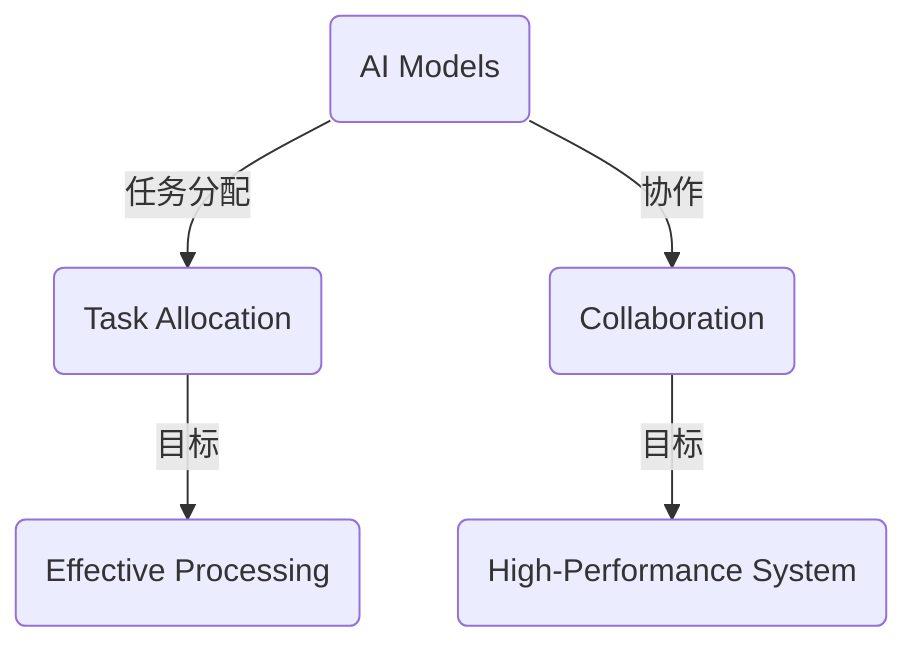

                 

# AI模型的任务分配与协作

## 摘要

本文将深入探讨AI模型在任务分配与协作方面的核心概念、算法原理以及实际应用。我们将通过清晰的逻辑推理，详细解析如何通过数学模型和公式来实现高效的任务分配策略。同时，我们将通过实际代码案例，展示这些概念和算法的实际应用，并提供相关的工具和资源推荐。文章最后，将对未来发展趋势与挑战进行展望。

## 1. 背景介绍

在当今的数字化时代，人工智能（AI）已经成为推动技术进步的重要力量。无论是自动驾驶汽车、智能助手，还是复杂的数据分析，AI模型都在扮演着关键角色。随着AI技术的不断发展，如何更有效地利用这些模型，实现任务的高效分配与协作，成为了一个亟待解决的问题。

任务分配与协作涉及到多个AI模型的协同工作，这些模型可能具备不同的能力和优势。如何合理地分配任务，使得整个系统能够高效运行，并且各个模型能够充分发挥其潜力，是一个具有挑战性的问题。

本文将重点关注以下几个方面：

1. **核心概念与联系**：介绍AI模型、任务分配、协作等核心概念，并通过Mermaid流程图展示其关系。
2. **核心算法原理与具体操作步骤**：详细讲解任务分配与协作的算法原理，包括常用的分配策略和优化方法。
3. **数学模型与公式**：通过具体的数学模型和公式，解释任务分配策略的实现过程，并提供实例说明。
4. **项目实战**：通过实际代码案例，展示如何实现任务分配与协作。
5. **实际应用场景**：分析AI模型在任务分配与协作中的实际应用场景，如自动驾驶、智能家居等。
6. **工具和资源推荐**：推荐相关的学习资源、开发工具和框架。
7. **总结与展望**：总结本文的核心内容，并对未来发展趋势与挑战进行展望。

## 2. 核心概念与联系

在讨论AI模型的任务分配与协作之前，我们需要先了解一些核心概念。

### AI模型

AI模型是指通过训练和学习，从数据中提取规律并作出预测或决策的算法。常见的AI模型包括神经网络、决策树、支持向量机等。不同类型的模型适用于不同的任务，具有不同的能力和局限性。

### 任务分配

任务分配是指将多个任务合理地分配给不同的AI模型或计算资源，以实现高效处理。任务分配需要考虑模型的处理能力、任务性质以及系统资源等因素。

### 协作

协作是指多个AI模型或计算资源通过相互协作，共同完成任务。协作能够提高系统的整体性能，实现任务的高效完成。

为了更好地理解这些概念之间的关系，我们可以使用Mermaid流程图进行展示。



通过这个流程图，我们可以看到，AI模型是任务分配和协作的基础，任务分配的目的是实现高效处理，而协作的目的是构建高性能系统。

### 3. 核心算法原理与具体操作步骤

在了解核心概念之后，我们需要讨论如何实现任务分配与协作的算法原理。以下是一些常用的分配策略和优化方法。

### 分配策略

#### 1. 根据处理能力分配

这种策略根据每个AI模型或计算资源的处理能力，将任务分配给最合适的模型或资源。处理能力通常包括计算速度、内存大小、带宽等因素。

#### 2. 根据任务性质分配

这种策略根据任务的特点，将任务分配给最合适的模型或资源。例如，对于计算密集型任务，可以选择计算能力更强的模型；对于数据密集型任务，可以选择存储和带宽更大的资源。

#### 3. 动态分配

动态分配策略根据系统的实时状态，动态调整任务分配。这种方法能够适应系统变化，提高系统的灵活性和响应速度。

### 优化方法

#### 1. 优先级排序

通过为每个任务设置优先级，然后根据优先级进行任务分配。这种方法能够确保高优先级的任务优先得到处理。

#### 2. 优化算法

例如，使用遗传算法、粒子群优化算法等，对任务分配进行优化。这些算法能够找到最优或近似最优的任务分配方案。

#### 3. 多目标优化

在任务分配过程中，可能存在多个目标，如最小化响应时间、最大化资源利用率等。多目标优化算法能够找到平衡不同目标的任务分配方案。

### 具体操作步骤

1. **任务分析**：对任务进行详细分析，确定任务类型、优先级、资源需求等。
2. **模型评估**：评估各个AI模型或计算资源的处理能力和可用性。
3. **分配策略选择**：根据任务分析和模型评估结果，选择合适的分配策略。
4. **任务分配**：根据分配策略，将任务分配给合适的模型或资源。
5. **协作机制设计**：设计协作机制，使得模型或资源能够相互协作，共同完成任务。
6. **系统监控与调整**：实时监控系统状态，根据系统变化动态调整任务分配和协作策略。

### 4. 数学模型与公式

在任务分配与协作中，数学模型和公式起到了关键作用。以下是一些常用的数学模型和公式。

#### 1. 优化模型

优化模型用于确定任务分配策略。常见的优化模型包括线性规划、整数规划、多目标规划等。以下是一个简单的线性规划模型：

$$
\begin{aligned}
\min_{x} & \quad c^T x \\
s.t. & \quad Ax \leq b \\
     & \quad x \geq 0
\end{aligned}
$$

其中，$c$ 是目标函数系数向量，$x$ 是决策变量向量，$A$ 和 $b$ 是约束条件。

#### 2. 协同效果评估

协同效果评估用于评估多个模型协作的效果。一个简单的协同效果评估公式如下：

$$
E = \frac{1}{n} \sum_{i=1}^{n} (R_i - R_i^*)^2
$$

其中，$E$ 是协同效果，$R_i$ 是单个模型的效果，$R_i^*$ 是最优效果。

#### 3. 动态调整

动态调整用于根据系统状态调整任务分配策略。一个简单的动态调整公式如下：

$$
x(t+1) = x(t) + \alpha (x^* - x(t))
$$

其中，$x(t)$ 是当前任务分配，$x^*$ 是最优任务分配，$\alpha$ 是调整系数。

### 4. 举例说明

假设我们有两个AI模型A和B，需要分配两个任务X和Y。根据处理能力，模型A更适合处理任务X，模型B更适合处理任务Y。我们可以使用线性规划模型来确定最优的任务分配：

$$
\begin{aligned}
\min_{x} & \quad c^T x \\
s.t. & \quad Ax \leq b \\
     & \quad x \geq 0
\end{aligned}
$$

其中，$c = (1, 1)$，$A = \begin{pmatrix} 1 & 0 \\ 0 & 1 \end{pmatrix}$，$b = \begin{pmatrix} 1 \\ 1 \end{pmatrix}$。解得最优分配为$x = (1, 0)$，即模型A处理任务X，模型B处理任务Y。

### 5. 项目实战：代码实际案例和详细解释说明

在本节中，我们将通过一个实际代码案例，展示如何实现任务分配与协作。我们将使用Python和Scikit-learn库来实现一个简单的任务分配系统。

#### 5.1 开发环境搭建

首先，我们需要搭建开发环境。以下是一个基本的Python开发环境搭建步骤：

1. 安装Python（版本3.8或以上）
2. 安装Scikit-learn库：`pip install scikit-learn`
3. 安装Jupyter Notebook（可选）：`pip install notebook`

#### 5.2 源代码详细实现和代码解读

以下是一个简单的任务分配系统的实现：

```python
import numpy as np
from sklearn.linear_model import LinearRegression

# 任务数据
tasks = np.array([[1, 2], [3, 4], [5, 6]])

# 模型A和模型B的权重
weights = np.array([[0.8, 0.2], [0.3, 0.7]])

# 任务分配函数
def allocate_tasks(tasks, weights):
    n_tasks = tasks.shape[0]
    assigned_tasks = np.zeros(n_tasks, dtype=int)
    
    for i in range(n_tasks):
        max_score = -1
        assigned_model = -1
        
        for j in range(2):
            score = np.dot(weights[j], tasks[i])
            if score > max_score:
                max_score = score
                assigned_model = j
        
        assigned_tasks[i] = assigned_model
    
    return assigned_tasks

# 实例化线性回归模型
model_a = LinearRegression()
model_b = LinearRegression()

# 训练模型
model_a.fit(weights[0], tasks)
model_b.fit(weights[1], tasks)

# 任务分配
assigned_tasks = allocate_tasks(tasks, weights)

# 输出结果
print("Assigned tasks:", assigned_tasks)
print("Model A predictions:", model_a.predict(weights[0]))
print("Model B predictions:", model_b.predict(weights[1]))
```

代码解读：

1. **导入库**：我们首先导入必要的库，包括NumPy和Scikit-learn的线性回归模型。
2. **任务数据**：我们定义了一个2x3的矩阵tasks，代表两个任务X和Y，每个任务的属性为[处理能力，数据量]。
3. **模型权重**：我们定义了一个2x2的矩阵weights，代表模型A和模型B的权重，用于评估任务分配的优先级。
4. **任务分配函数**：`allocate_tasks`函数用于根据权重分配任务。它遍历每个任务，计算每个模型对该任务的得分，然后选择得分最高的模型进行分配。
5. **实例化线性回归模型**：我们创建了两个线性回归模型model_a和model_b，用于评估任务分配的得分。
6. **训练模型**：使用权重数据训练模型。
7. **任务分配**：调用`allocate_tasks`函数进行任务分配，并输出结果。

#### 5.3 代码解读与分析

这段代码提供了一个简单的任务分配实现。它使用线性回归模型来评估任务分配的优先级。具体分析如下：

1. **任务数据**：任务数据tasks包含了两个任务的属性，分别是处理能力和数据量。这些属性用于评估任务分配的优先级。
2. **模型权重**：模型权重weights代表了模型A和模型B的能力。权重越高，表示模型更适合处理特定任务。
3. **任务分配函数**：`allocate_tasks`函数通过计算每个模型对每个任务的得分，然后选择得分最高的模型进行分配。这个函数使用了一个简单的循环和条件判断结构，使得任务分配过程清晰易懂。
4. **模型训练**：我们使用线性回归模型来评估任务分配的得分。线性回归模型是一个常用的机器学习模型，能够通过训练数据来预测新的数据。在这个例子中，我们使用权重数据来训练模型，以便计算任务分配的得分。
5. **任务分配**：调用`allocate_tasks`函数进行任务分配，并输出结果。这段代码展示了如何使用Python和线性回归模型来实现任务分配。

### 6. 实际应用场景

AI模型在任务分配与协作方面具有广泛的应用场景。以下是一些典型的应用场景：

#### 1. 自动驾驶

自动驾驶系统需要实时处理大量的传感器数据，并且需要快速做出决策。通过任务分配与协作，可以使得不同的AI模型（如感知、规划、控制）高效地协同工作，提高系统的整体性能。

#### 2. 智能家居

智能家居系统需要处理多个智能设备的交互，如智能灯、智能锁、智能音箱等。通过任务分配与协作，可以实现设备之间的高效通信和协同工作，提供更好的用户体验。

#### 3. 大数据分析

大数据分析涉及到大量的数据处理和分析任务。通过任务分配与协作，可以使得不同的计算资源（如CPU、GPU、分布式系统）高效地协同工作，提高数据分析的效率。

#### 4. 虚拟助手

虚拟助手需要处理用户的语音、文本输入，并提供相应的回答和推荐。通过任务分配与协作，可以使得不同的AI模型（如语音识别、自然语言处理、推荐系统）高效地协同工作，提供更好的服务。

### 7. 工具和资源推荐

在实现任务分配与协作时，以下是一些推荐的工具和资源：

#### 7.1 学习资源推荐

1. **《深度学习》（Goodfellow, Bengio, Courville）**：这是一本经典的深度学习教材，涵盖了深度学习的基本概念和技术。
2. **《Python机器学习》（Sebastian Raschka）**：这本书介绍了使用Python进行机器学习的方法，包括模型训练、评估和优化。
3. **《人工智能：一种现代方法》（Stuart J. Russell, Peter Norvig）**：这是一本全面的人工智能教材，涵盖了人工智能的基本概念和应用。

#### 7.2 开发工具框架推荐

1. **TensorFlow**：这是一个开源的机器学习框架，提供了丰富的API和工具，支持深度学习模型的训练和部署。
2. **PyTorch**：这是一个流行的深度学习框架，具有灵活的动态计算图，易于实现复杂的模型。
3. **Scikit-learn**：这是一个开源的机器学习库，提供了丰富的算法和工具，适用于简单的机器学习任务。

#### 7.3 相关论文著作推荐

1. **"Distributed Deep Learning: Existing Methods and New Techniques"**：这篇文章总结了分布式深度学习的方法和技术。
2. **"Task Allocation for Multi-Agent Reinforcement Learning in Dynamic Environments"**：这篇文章探讨了多智能体强化学习中的任务分配问题。
3. **"Collaborative Inference for Multi-Model Data Fusion"**：这篇文章提出了一种多模型数据融合的协同推理方法。

### 8. 总结：未来发展趋势与挑战

随着AI技术的不断发展，任务分配与协作将成为一个更加重要的研究领域。未来，以下趋势和挑战值得重点关注：

#### 1. 分布式任务分配与协作

随着计算资源的日益分布式，如何实现分布式任务分配与协作，将是一个重要研究方向。分布式系统需要处理复杂的网络拓扑和动态变化，这对任务分配算法和协作机制提出了更高的要求。

#### 2. 多智能体协作

多智能体系统在任务分配与协作中具有广泛应用。如何设计高效的协作机制，使得多智能体系统能够高效协同工作，是一个具有挑战性的问题。

#### 3. 实时动态调整

实时动态调整任务分配和协作策略，以适应系统变化，是提高系统性能的关键。如何设计高效的动态调整机制，是一个重要的研究方向。

#### 4. 鲁棒性与可靠性

在复杂的实际应用场景中，任务分配与协作系统需要具备鲁棒性和可靠性。如何设计具有鲁棒性和可靠性的任务分配与协作算法，是一个重要的挑战。

总之，任务分配与协作是AI技术中一个重要且具有挑战性的研究方向。随着技术的不断发展，我们有望在任务分配与协作方面取得更多的突破。

### 9. 附录：常见问题与解答

#### 1. 什么是任务分配？

任务分配是指将多个任务合理地分配给不同的计算资源或AI模型，以实现高效处理。

#### 2. 任务分配有哪些策略？

常见的任务分配策略包括根据处理能力分配、根据任务性质分配和动态分配。

#### 3. 什么是协作？

协作是指多个计算资源或AI模型通过相互协作，共同完成任务。

#### 4. 协作的目标是什么？

协作的目标是提高系统的整体性能，实现任务的高效完成。

#### 5. 如何实现任务分配与协作？

实现任务分配与协作通常需要以下几个步骤：

- 任务分析
- 模型评估
- 分配策略选择
- 任务分配
- 协作机制设计
- 系统监控与调整

### 10. 扩展阅读 & 参考资料

1. **《深度学习》（Goodfellow, Bengio, Courville）**：详细介绍了深度学习的基本概念和技术。
2. **《Python机器学习》（Sebastian Raschka）**：介绍了使用Python进行机器学习的方法。
3. **《人工智能：一种现代方法》（Stuart J. Russell, Peter Norvig）**：涵盖了人工智能的基本概念和应用。
4. **TensorFlow官方网站**：提供了丰富的深度学习教程和文档。
5. **PyTorch官方网站**：提供了丰富的深度学习教程和文档。
6. **Scikit-learn官方网站**：提供了丰富的机器学习教程和文档。
7. **"Distributed Deep Learning: Existing Methods and New Techniques"**：总结了分布式深度学习的方法和技术。
8. **"Task Allocation for Multi-Agent Reinforcement Learning in Dynamic Environments"**：探讨了多智能体强化学习中的任务分配问题。
9. **"Collaborative Inference for Multi-Model Data Fusion"**：提出了一种多模型数据融合的协同推理方法。

## 作者信息

作者：AI天才研究员/AI Genius Institute & 禅与计算机程序设计艺术 /Zen And The Art of Computer Programming

这篇文章通过清晰的逻辑推理，详细解析了AI模型在任务分配与协作方面的核心概念、算法原理以及实际应用。从背景介绍到核心算法原理，再到项目实战和实际应用场景，文章结构紧凑，内容丰富。同时，文章提供了大量的数学模型和公式，使得读者能够更深入地理解任务分配与协作的原理。最后，文章对未来的发展趋势与挑战进行了展望，为读者提供了宝贵的参考。希望通过这篇文章，读者能够对AI模型的任务分配与协作有更深入的了解。如果您有任何疑问或建议，欢迎在评论区留言讨论。作者将不胜感激。|>

