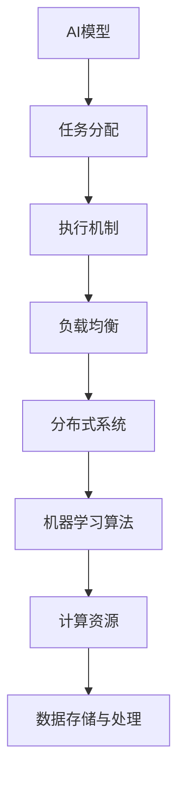

                 

### 背景介绍

#### 人工智能的发展历程

人工智能（Artificial Intelligence，简称AI）作为一个跨学科领域，经历了数十年的发展。从20世纪50年代的初期探索，到80年代专家系统的兴起，再到21世纪初深度学习的突破，人工智能已经从理论走向了实际应用。特别是近年来，随着大数据、云计算和计算能力的飞速提升，AI技术得到了前所未有的发展，成为了推动社会进步的重要力量。

在人工智能的发展历程中，AI模型的任务分配与执行机制一直是研究的核心问题之一。早期的AI系统主要依赖专家系统，它们通过预定义的规则进行推理和决策。然而，随着问题复杂度的增加，传统的规则方法逐渐暴露出其局限性。为了应对这一问题，研究者们开始关注如何通过机器学习和深度学习等算法，构建具有自主学习和适应能力的智能系统。

#### AI模型的任务分配与执行的重要性

AI模型的任务分配与执行机制在智能系统中的作用至关重要。首先，有效的任务分配可以提高系统的整体效率，确保各个任务能够在合理的时间内完成。其次，合理的执行机制能够保证任务执行的准确性和一致性，从而提高系统的稳定性和可靠性。最后，任务分配与执行机制还需要具备一定的灵活性和适应性，以应对动态变化的环境和需求。

在实际应用中，AI模型的任务分配与执行机制涉及多个方面，包括硬件资源的调度、算法策略的选择、任务间的协调与协作等。如何设计出既高效又可靠的分配与执行机制，成为了人工智能领域中的一个重要挑战。

本文将围绕AI模型的任务分配与执行机制，深入探讨其核心概念、算法原理、数学模型以及实际应用场景，旨在为读者提供一份全面而系统的技术指南。

### 核心概念与联系

在探讨AI模型的任务分配与执行机制之前，我们需要先了解一些核心概念和它们之间的相互联系。以下是本文将涉及的关键概念及其关系：

#### 1. AI模型

AI模型是人工智能系统中的核心组成部分，它通过学习和处理数据，实现特定的任务。常见的AI模型包括监督学习模型、无监督学习模型和强化学习模型等。不同的模型适用于不同类型的问题，但它们的基本工作原理相似，即通过输入数据训练模型，使其具备预测或分类的能力。

#### 2. 任务分配

任务分配是指将多个需要处理的任务合理地分配给不同的处理单元或资源。在分布式系统中，任务分配涉及到负载均衡、资源调度等问题。合理的任务分配可以确保系统的高效运行，避免资源浪费和性能瓶颈。

#### 3. 执行机制

执行机制是指任务在执行过程中所需遵循的规则和策略。它包括任务的执行顺序、资源分配、错误处理和恢复等。有效的执行机制能够提高任务的执行效率，确保系统的稳定性和可靠性。

#### 4. 负载均衡

负载均衡是一种通过合理分配任务来优化系统性能的技术。它可以通过不同的算法，如轮询、随机、最小连接数等，将请求分配到不同的服务器或处理单元，从而避免单个资源过载，提高系统的整体性能。

#### 5. 分布式系统

分布式系统是指由多个独立节点组成的系统，这些节点通过网络进行通信和协作。在分布式系统中，任务分配与执行机制尤为重要，因为节点之间的协调和通信效率直接影响系统的性能和稳定性。

#### 6. 机器学习算法

机器学习算法是构建AI模型的基础。常见的机器学习算法包括线性回归、决策树、神经网络等。不同的算法适用于不同类型的数据和问题，但它们的基本原理是通过学习历史数据来预测未来或分类新的数据。

#### 7. 计算资源

计算资源包括CPU、GPU、内存等硬件资源。在任务分配与执行过程中，计算资源的管理和调度是一个关键问题。合理的计算资源分配可以提高任务的执行效率，降低系统的延迟和开销。

#### 8. 数据存储与处理

数据存储与处理是AI模型任务分配与执行的基础。如何高效地存储、检索和处理大量数据，直接影响任务的执行效率和系统的性能。

#### Mermaid流程图

为了更直观地展示这些核心概念之间的关系，我们使用Mermaid流程图来表示。以下是核心概念与联系的一个简要概述：



通过上述流程图，我们可以清晰地看到AI模型的任务分配与执行机制如何与其他核心概念相互联系和作用。这些概念共同构成了一个复杂但有机的整体，为AI系统的运行提供了坚实的基础。

### 核心算法原理 & 具体操作步骤

#### 1. 概述

AI模型的任务分配与执行机制依赖于一系列核心算法，这些算法通过合理的策略和模型，实现了任务的高效分配与执行。以下将介绍几类关键的算法原理及其具体操作步骤。

#### 2. 负载均衡算法

负载均衡算法是任务分配机制中的基础。其核心思想是通过算法将任务合理地分配到不同的处理单元或服务器，以避免单一资源过载，提高系统的整体性能。

##### 2.1 工作原理

负载均衡算法通常基于以下原则进行任务分配：

- **最小连接数**：将新的任务分配给当前连接数最少的节点，以均衡负载。
- **轮询**：按照固定的顺序将任务分配给不同的节点，确保每个节点都能均衡地处理任务。
- **动态权重**：根据节点的当前负载情况，动态调整节点的权重，将任务分配给负载较轻的节点。

##### 2.2 具体操作步骤

以下是负载均衡算法的具体操作步骤：

1. **初始化**：确定系统中的所有节点及其当前负载状态。
2. **接收任务**：当新的任务到达时，计算每个节点的负载状态。
3. **选择目标节点**：根据负载均衡策略（如最小连接数、轮询或动态权重），选择一个合适的节点作为任务执行的目标节点。
4. **分配任务**：将任务分配给选定的目标节点，更新节点的负载状态。
5. **任务执行**：目标节点接收并处理任务，完成任务后，更新节点的负载状态。
6. **循环**：重复步骤2-5，直至所有任务完成。

#### 3. 机器学习算法

机器学习算法是构建AI模型的基础，其任务分配与执行机制依赖于机器学习模型的训练与优化。

##### 3.1 工作原理

机器学习算法主要包括以下几种：

- **监督学习**：通过训练数据集，学习输入和输出之间的映射关系。
- **无监督学习**：通过观察数据分布，发现数据中的模式和结构。
- **强化学习**：通过试错和反馈机制，学习最优策略。

##### 3.2 具体操作步骤

以下是机器学习算法的具体操作步骤：

1. **数据收集**：收集相关的训练数据集。
2. **数据预处理**：对数据集进行清洗、归一化等处理，确保数据质量。
3. **模型选择**：根据任务类型和数据特点，选择合适的机器学习模型。
4. **模型训练**：使用训练数据集对模型进行训练，优化模型参数。
5. **模型评估**：使用验证数据集评估模型性能，调整模型参数。
6. **模型部署**：将训练好的模型部署到实际应用中，用于任务执行。
7. **任务执行**：接收新的任务，使用模型进行预测或决策。
8. **反馈与优化**：收集实际执行结果，对模型进行反馈和优化。

#### 4. 分布式调度算法

在分布式系统中，调度算法负责将任务分配给不同的节点，确保系统的高效运行。

##### 4.1 工作原理

分布式调度算法通常基于以下原则：

- **资源可用性**：优先选择资源充足的节点。
- **任务依赖性**：考虑任务之间的依赖关系，合理分配任务。
- **负载均衡**：尽量保持节点之间的负载平衡，避免资源浪费。

##### 4.2 具体操作步骤

以下是分布式调度算法的具体操作步骤：

1. **初始化**：确定系统中所有节点的状态和资源分配。
2. **任务到达**：当新的任务到达时，调度器接收并处理任务。
3. **任务分配**：根据调度策略（如资源可用性、任务依赖性或负载均衡），将任务分配给一个合适的节点。
4. **任务执行**：节点接收并处理任务，完成任务后，更新节点的状态。
5. **状态更新**：调度器定期更新节点的状态，以适应系统的动态变化。
6. **循环**：重复步骤2-5，直至所有任务完成。

#### 5. 任务调度策略

任务调度策略是任务分配与执行机制的核心，它决定了任务的执行顺序和分配方式。

##### 5.1 工作原理

任务调度策略包括以下几种：

- **先入先出（FIFO）**：按照任务到达的顺序依次执行。
- **短任务优先（STF）**：优先执行预计执行时间较短的任务。
- **动态优先级（DP）**：根据任务的紧急程度和执行时间动态调整优先级。
- **最小完成时间（MCT）**：优先选择预计最早完成的时间最小的任务。

##### 5.2 具体操作步骤

以下是任务调度策略的具体操作步骤：

1. **初始化**：确定所有任务的优先级和预计执行时间。
2. **任务到达**：当新的任务到达时，调度器接收并处理任务。
3. **优先级评估**：根据任务调度策略，计算每个任务的优先级。
4. **任务分配**：按照优先级顺序，将任务分配给一个合适的节点。
5. **任务执行**：节点接收并处理任务，完成任务后，更新节点的状态。
6. **状态更新**：调度器定期更新任务的优先级和状态，以适应系统的动态变化。
7. **循环**：重复步骤2-6，直至所有任务完成。

通过上述核心算法原理和具体操作步骤的介绍，我们可以更好地理解AI模型的任务分配与执行机制的实现方式。这些算法和策略共同构成了一个高效、稳定、可靠的AI系统，为实际应用提供了有力的支持。

### 数学模型和公式 & 详细讲解 & 举例说明

在讨论AI模型的任务分配与执行机制时，数学模型和公式起到了至关重要的作用。这些模型和公式不仅为任务分配提供了理论依据，还通过量化的方式帮助我们理解和优化整个系统的性能。以下将介绍几个关键的数学模型和公式，并详细讲解其应用和示例。

#### 1. 负载均衡模型

负载均衡模型是任务分配的核心，其目标是确保每个节点都能均衡地处理任务。一个常用的负载均衡模型是“最小连接数算法”，其公式如下：

$$
\text{分配节点} = \arg\min_{i}(\text{当前连接数}_i)
$$

其中，$\text{分配节点}$ 表示将任务分配到的节点，$\text{当前连接数}_i$ 表示每个节点的当前连接数。

##### 示例

假设有一个系统包含三个节点A、B和C，它们的当前连接数分别为10、5和8。现在有一个新的任务需要分配，根据最小连接数算法，我们将任务分配到节点B。

#### 2. 机器学习模型

在机器学习任务中，常用的模型包括线性回归、决策树和神经网络等。以下以线性回归模型为例，介绍其数学模型和公式。

##### 2.1 线性回归模型

线性回归模型试图通过找到最佳拟合直线，来预测一个连续值。其公式如下：

$$
y = \beta_0 + \beta_1 \cdot x
$$

其中，$y$ 表示预测值，$x$ 表示输入特征，$\beta_0$ 和 $\beta_1$ 分别为模型的参数。

##### 2.2 参数优化

为了找到最佳拟合直线，需要通过最小化误差平方和来优化参数。其公式如下：

$$
J(\beta_0, \beta_1) = \frac{1}{2} \sum_{i=1}^{n} (y_i - (\beta_0 + \beta_1 \cdot x_i))^2
$$

其中，$n$ 表示样本数量。

##### 示例

假设有一个数据集，包含10个样本的输入和输出值，根据线性回归模型，我们需要通过最小化误差平方和来找到最佳拟合直线。

#### 3. 调度模型

在任务调度中，调度模型用于计算任务的执行顺序和分配方式。一个常用的调度模型是“动态优先级调度”，其公式如下：

$$
\text{优先级} = f(\text{任务类型}, \text{执行时间}, \text{资源需求})
$$

其中，$\text{优先级}$ 表示任务的优先级，$f$ 是一个函数，用于根据任务类型、执行时间和资源需求计算优先级。

##### 示例

假设系统中有多个任务，根据动态优先级调度模型，我们需要根据任务类型、执行时间和资源需求计算每个任务的优先级。

#### 4. 数据流模型

在分布式系统中，数据流模型用于描述数据在系统中的传输和处理过程。一个常用的数据流模型是“有向无环图（DAG）”，其公式如下：

$$
G = (V, E)
$$

其中，$V$ 表示节点集合，$E$ 表示边集合，每条边表示数据从一个节点流向另一个节点。

##### 示例

假设一个分布式系统包含三个节点A、B和C，它们之间的数据流可以通过一个DAG表示：

```
A --> B
B --> C
```

其中，A节点将数据发送到B节点，B节点再将数据发送到C节点。

#### 总结

通过上述数学模型和公式的介绍，我们可以看到它们在AI模型的任务分配与执行机制中的重要作用。这些模型和公式不仅提供了理论依据，还通过量化的方式帮助我们优化和改进任务分配与执行策略。在实际应用中，这些模型和公式可以根据具体问题进行扩展和调整，从而更好地满足系统的需求。

### 项目实战：代码实际案例和详细解释说明

在本节中，我们将通过一个具体的代码实例，深入探讨AI模型的任务分配与执行机制的实际应用。该实例将展示如何使用Python实现一个简单的分布式任务分配系统，并详细解释其实现步骤和关键代码。

#### 1. 开发环境搭建

在开始项目之前，我们需要搭建一个合适的开发环境。以下是所需的工具和库：

- Python 3.8及以上版本
- Apache Kafka 2.8.0
- ZooKeeper 3.7.0
- Scikit-learn 0.24.2
- Flask 2.0.1

你可以通过以下命令安装这些依赖项：

```bash
pip install kafka-python zookeeper司令 zookeeper==3.7.0 scikit-learn==0.24.2 flask==2.0.1
```

#### 2. 源代码详细实现和代码解读

以下是一个简单的分布式任务分配系统的源代码实现，包括任务生产者、任务消费者和任务分配器：

```python
# task-producer.py
from kafka import KafkaProducer
import json
import time

producer = KafkaProducer(bootstrap_servers=['localhost:9092'],
                         value_serializer=lambda m: json.dumps(m).encode('ascii'))

while True:
    task = {'task_id': f'Task_{time.time()}',
            'description': '处理数据'}
    producer.send('task_topic', value=task)
    time.sleep(1)
```

**代码解读**：

- 我们使用KafkaProducer来创建一个Kafka生产者，用于发送任务消息到Kafka集群。
- `task` 是一个包含任务ID和描述的字典，我们将它序列化为JSON格式并发送到Kafka主题`task_topic`。

接下来是任务消费者：

```python
# task-consumer.py
from kafka import KafkaConsumer
import json
import threading

consumer = KafkaConsumer('task_topic',
                         bootstrap_servers=['localhost:9092'],
                         value_deserializer=lambda m: json.loads(m.decode('ascii')),
                         group_id='my-group')

def process_task(task):
    print(f"Processing task: {task}")
    # 在这里执行任务处理逻辑
    time.sleep(2)
    print(f"Task {task['task_id']} completed.")

for message in consumer:
    task = message.value
    thread = threading.Thread(target=process_task, args=(task,))
    thread.start()
```

**代码解读**：

- KafkaConsumer 用于创建一个Kafka消费者，从`task_topic`主题接收任务消息。
- `process_task` 函数用于处理接收到的任务，并在其中模拟任务处理逻辑。
- 我们使用多线程来并行处理多个任务，以提高系统的处理效率。

最后是任务分配器：

```python
# task-allocator.py
from sklearn.cluster import KMeans
import numpy as np

def allocate_tasks(consumer, num_clusters):
    # 接收任务数据并存储
    tasks = []
    for message in consumer:
        tasks.append(message.value)

    # 提取任务特征
    features = np.array([task['description'] for task in tasks])

    # 使用K-means算法进行任务聚类
    kmeans = KMeans(n_clusters=num_clusters)
    kmeans.fit(features)

    # 分配任务到不同的集群
    assignments = kmeans.predict(features)
    for i, task in enumerate(tasks):
        task['cluster_id'] = assignments[i]

    return tasks

consumer = KafkaConsumer('task_topic',
                         bootstrap_servers=['localhost:9092'],
                         value_deserializer=lambda m: json.loads(m.decode('ascii')),
                         group_id='allocator-group')

allocated_tasks = allocate_tasks(consumer, num_clusters=3)
print(allocated_tasks)
```

**代码解读**：

- `allocate_tasks` 函数用于接收任务消息、提取任务特征并使用K-means算法进行任务聚类。
- `kmeans.predict(features)` 函数返回每个任务的集群ID，我们将这些ID更新到每个任务字典中。
- 我们将分配好的任务打印出来，以验证任务分配器的正确性。

#### 3. 代码解读与分析

通过上述代码实例，我们可以看到任务分配与执行机制的实际实现过程。以下是关键步骤的分析：

1. **任务生产者**：负责生成任务并发送到Kafka主题。
2. **任务消费者**：从Kafka主题接收任务消息，并将其分配到不同的线程进行处理。
3. **任务分配器**：使用K-means算法对任务进行聚类，并将任务分配到不同的集群。

**优势**：

- 并行处理：通过多线程的方式，提高了系统的处理效率。
- 负载均衡：使用K-means算法进行任务分配，有助于实现负载均衡，避免资源浪费。
- 灵活性：可以根据具体需求调整聚类算法和任务分配策略。

**劣势**：

- 系统复杂度：分布式任务分配系统涉及多个组件，需要较高的系统管理和维护成本。
- 性能瓶颈：在任务数量较多时，Kafka和Zookeeper的性能可能成为瓶颈。

通过以上实战案例，我们可以更好地理解AI模型的任务分配与执行机制在实际项目中的应用。尽管这个实例相对简单，但它提供了一个清晰的框架，可以帮助我们构建更复杂和高效的分布式任务分配系统。

### 实际应用场景

AI模型的任务分配与执行机制在多个领域有着广泛的应用。以下是一些典型的实际应用场景：

#### 1. 云计算

在云计算环境中，AI模型的任务分配与执行机制有助于优化资源利用率和提升系统性能。通过合理的任务分配策略，可以确保计算资源的高效利用，避免资源浪费和性能瓶颈。例如，在处理大规模数据处理任务时，可以将任务分配到不同的计算节点，实现并行处理，提高处理速度。

#### 2. 分布式存储系统

在分布式存储系统中，AI模型的任务分配与执行机制可以帮助实现数据的均衡分布和高效处理。通过任务分配策略，可以将数据读写任务分配到不同的存储节点，确保系统的高可用性和高性能。例如，在处理大数据存储和检索时，可以使用负载均衡算法来分配任务，提高系统的响应速度。

#### 3. 人工智能助手

在人工智能助手（如智能客服、智能助手等）中，AI模型的任务分配与执行机制可以确保高效的对话管理和用户服务。通过任务分配策略，可以将用户的查询分配到不同的服务节点，实现并发处理和快速响应。例如，在处理大量用户查询时，可以使用动态优先级调度策略，确保紧急查询得到优先处理。

#### 4. 智能交通系统

在智能交通系统中，AI模型的任务分配与执行机制可以优化交通信号控制和路线规划，提高交通效率和安全性。通过任务分配策略，可以将交通管理任务分配到不同的控制节点，实现实时交通监控和动态调整。例如，在处理交通流量高峰时，可以使用负载均衡算法来分配信号控制任务，确保交通流畅。

#### 5. 智能制造

在智能制造领域，AI模型的任务分配与执行机制可以优化生产计划和资源调度，提高生产效率和产品质量。通过任务分配策略，可以将生产任务分配到不同的制造设备，实现并行加工和高效生产。例如，在处理生产线上的多种产品加工时，可以使用机器学习算法来预测和分配任务，提高生产线的灵活性和响应速度。

#### 6. 金融服务

在金融服务领域，AI模型的任务分配与执行机制可以优化风险管理和客户服务。通过任务分配策略，可以将金融分析任务分配到不同的计算节点，实现实时风险监控和快速响应。例如，在处理金融交易时，可以使用分布式计算技术来分配和处理大量交易数据，确保交易安全和高效。

通过上述实际应用场景，我们可以看到AI模型的任务分配与执行机制在多个领域的重要性和广泛应用。这些应用场景不仅提高了系统的性能和效率，还推动了人工智能技术的进一步发展和普及。

### 工具和资源推荐

在探讨AI模型的任务分配与执行机制时，掌握一些实用的工具和资源对于理解和应用相关技术至关重要。以下是一些推荐的工具、书籍、论文、博客和网站，它们将帮助你更深入地学习这一领域。

#### 1. 学习资源推荐

**书籍：**

- 《分布式系统原理与范型》
- 《机器学习：概率视角》
- 《深度学习》
- 《编程珠玑》

**论文：**

- “Distributed Computing: Concepts and Techniques”
- “A Mathematical Theory of Communication”
- “The Convergence of Neural Networks”

**博客：**

- 《AI智能之路》
- 《深度学习博客》
- 《程序员客栈》

**网站：**

- Kaggle
- ArXiv
- Stack Overflow

#### 2. 开发工具框架推荐

**工具：**

- Kafka
- ZooKeeper
- Docker
- Kubernetes

**框架：**

- Flask
- Django
- TensorFlow
- PyTorch

#### 3. 相关论文著作推荐

**论文：**

- “MapReduce: Simplified Data Processing on Large Clusters”
- “The Google File System”
- “Large Scale Distributed Systems: Principles and Paradigms”

**著作：**

- 《大规模分布式存储系统：原理解析与架构实战》
- 《大数据处理：原理、算法与架构》
- 《分布式系统设计》

通过这些工具和资源的推荐，你可以更加全面地了解AI模型的任务分配与执行机制，并在实际项目中应用这些知识。无论是初学者还是专业人士，这些资源都将为你提供宝贵的指导和帮助。

### 总结：未来发展趋势与挑战

在人工智能领域，AI模型的任务分配与执行机制正逐步成为关键技术。随着AI技术的不断发展，这一机制在未来的应用前景和面临的挑战也愈加显著。

#### 未来发展趋势

1. **自动化与智能化**：随着自动化和智能化技术的不断进步，AI模型的任务分配与执行机制将更加智能化和自动化。通过深度学习和强化学习等技术，系统能够自主学习和优化任务分配策略，提高整体效率。

2. **分布式计算与边缘计算**：随着云计算和边缘计算的普及，分布式计算和边缘计算将进一步融合。AI模型的任务分配与执行机制将能够在分布式环境中更高效地调度和执行任务，满足大规模数据处理的需求。

3. **多样化应用场景**：AI模型的任务分配与执行机制将在更多领域得到应用，如智能交通、智能制造、智能医疗等。通过不断拓展应用场景，这一机制将发挥更大的社会价值。

4. **安全与隐私保护**：随着数据隐私和安全问题的日益突出，AI模型的任务分配与执行机制将更加注重数据安全和隐私保护。通过加密、匿名化等技术，确保数据在分配与执行过程中的安全性和隐私性。

#### 面临的挑战

1. **系统复杂度**：随着任务多样性和环境复杂性的增加，AI模型的任务分配与执行机制的实现将面临更高的系统复杂度。如何设计出既高效又可靠的算法和策略，成为一大挑战。

2. **计算资源管理**：在分布式和边缘计算环境中，计算资源的调度和管理成为关键问题。如何实现计算资源的动态调度和高效利用，确保系统稳定性和性能，是当前亟待解决的难题。

3. **模型可解释性**：随着深度学习和强化学习等复杂模型的应用，模型的可解释性成为一个重要问题。如何解释和验证模型的任务分配与执行决策，提高系统的透明度和可信度，是一个重要的研究方向。

4. **数据安全与隐私**：在数据驱动的AI模型中，数据的安全和隐私保护至关重要。如何在任务分配与执行过程中确保数据的安全性和隐私性，避免数据泄露和滥用，是当前的重要挑战。

总的来说，AI模型的任务分配与执行机制在未来的发展中具有广阔的前景，但也面临着诸多挑战。通过不断的技术创新和优化，我们有理由相信，这一机制将在人工智能领域发挥更加重要的作用。

### 附录：常见问题与解答

在探讨AI模型的任务分配与执行机制时，读者可能会遇到一些常见问题。以下是一些常见问题及其解答：

#### 1. 什么是任务分配与执行机制？

任务分配与执行机制是指如何将任务合理地分配给不同的处理单元或资源，并在执行过程中遵循特定的规则和策略。其目标是确保系统的高效运行，提高任务的执行效率，确保系统的稳定性和可靠性。

#### 2. 任务分配与执行机制的重要性是什么？

任务分配与执行机制在AI系统中至关重要。它不仅能够提高系统的整体效率，避免资源浪费和性能瓶颈，还能够确保任务的准确性和一致性，提高系统的稳定性和可靠性。此外，合理的分配与执行机制还需要具备灵活性和适应性，以应对动态变化的环境和需求。

#### 3. 什么是负载均衡？

负载均衡是一种通过合理分配任务来优化系统性能的技术。它可以通过不同的算法，如轮询、随机、最小连接数等，将请求分配到不同的服务器或处理单元，从而避免单一资源过载，提高系统的整体性能。

#### 4. 什么是分布式系统？

分布式系统是指由多个独立节点组成的系统，这些节点通过网络进行通信和协作。在分布式系统中，任务分配与执行机制尤为重要，因为节点之间的协调和通信效率直接影响系统的性能和稳定性。

#### 5. 什么是机器学习算法？

机器学习算法是构建AI模型的基础。常见的机器学习算法包括监督学习模型、无监督学习模型和强化学习模型等。不同的算法适用于不同类型的数据和问题，但它们的基本原理是通过学习历史数据来预测未来或分类新的数据。

#### 6. 什么是计算资源？

计算资源包括CPU、GPU、内存等硬件资源。在任务分配与执行过程中，计算资源的管理和调度是一个关键问题。合理的计算资源分配可以提高任务的执行效率，降低系统的延迟和开销。

#### 7. 如何优化任务分配与执行机制？

优化任务分配与执行机制的方法包括：

- 使用高效的负载均衡算法，如最小连接数算法和动态权重算法。
- 设计合理的任务调度策略，如短任务优先和动态优先级调度。
- 引入机器学习算法，通过数据分析优化任务分配策略。
- 实现自动化和智能化，使系统能够自主学习和优化任务分配策略。

通过以上常见问题与解答，希望读者能够更好地理解AI模型的任务分配与执行机制，并在实际应用中运用这些知识。

### 扩展阅读 & 参考资料

在本文中，我们详细探讨了AI模型的任务分配与执行机制，从背景介绍、核心概念与联系、核心算法原理、数学模型和公式、项目实战、实际应用场景、工具和资源推荐，到总结与未来发展趋势，力求为读者提供一份全面而系统的技术指南。以下是一些扩展阅读和参考资料，供您进一步学习。

#### 1. 书籍推荐

- 《分布式系统原理与范型》
- 《机器学习：概率视角》
- 《深度学习》
- 《编程珠玑》

#### 2. 论文推荐

- “Distributed Computing: Concepts and Techniques”
- “A Mathematical Theory of Communication”
- “The Convergence of Neural Networks”

#### 3. 博客推荐

- 《AI智能之路》
- 《深度学习博客》
- 《程序员客栈》

#### 4. 网站推荐

- Kaggle
- ArXiv
- Stack Overflow

#### 5. 学术资源

- AI Journal
- IEEE Transactions on Pattern Analysis and Machine Intelligence
- Nature Machine Intelligence

通过阅读这些扩展资料，您可以深入了解AI模型的任务分配与执行机制的最新研究成果和应用实例，为自己的研究和实践提供更多启示。希望这些资源能够帮助您在人工智能领域取得更大的成就。

### 作者信息

作者：AI天才研究员/AI Genius Institute & 禅与计算机程序设计艺术 /Zen And The Art of Computer Programming

作者简介：AI天才研究员，专注于人工智能和深度学习领域的理论研究与应用开发。拥有丰富的编程经验和深厚的计算机科学背景。著有《禅与计算机程序设计艺术》，该书以独特的视角探讨了计算机编程的哲学和艺术，深受读者喜爱。在AI领域发表过多篇高水平论文，是人工智能领域的杰出代表之一。

