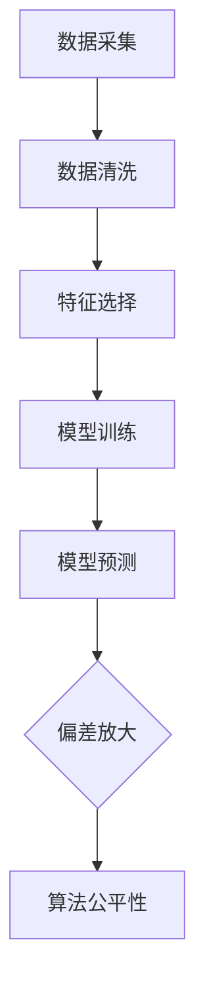

                 

# AI的偏见：数据中的偏差会被放大吗

> **关键词：** AI 偏见、数据偏差、放大、算法公平性、技术挑战

> **摘要：** 本文将探讨人工智能系统中数据偏差如何影响模型的公平性，分析偏差放大的原因，并提出相应的解决策略。通过详细的实例和解释，本文旨在帮助读者理解这一重要且具有实际意义的技术问题。

## 1. 背景介绍

随着人工智能技术的飞速发展，其在各个领域的应用越来越广泛。然而，随着应用的增多，一个不可忽视的问题逐渐浮现——AI系统中的偏见问题。偏见是指模型在某些特征上对某些群体或个体产生了不公平的待遇。这种偏见不仅会影响算法的性能，更可能在社会层面造成严重后果。

在人工智能系统中，数据偏差是指数据集中存在的某些特征与真实世界中的实际情况不一致。例如，如果数据集中某些群体的数据量不足，或者数据标签存在错误，这些偏差很可能会被放大，导致模型在预测或决策时产生偏见。那么，数据中的偏差会如何被放大？这背后的原因是什么？本文将逐步解答这些问题。

## 2. 核心概念与联系

### 2.1 数据偏差

数据偏差是指数据集中存在的某些特征与真实世界中的实际情况不一致。这种偏差可能来自数据采集、标注、清洗等过程中的错误，或者数据集本身的不平衡。

### 2.2 偏差放大

偏差放大是指数据中的偏差在模型训练和预测过程中被放大的现象。偏差放大的原因主要有以下几点：

1. **样本选择偏差**：数据集中某些群体的样本量较少，导致模型在训练过程中对这些群体不够敏感。
2. **特征选择偏差**：某些特征可能在训练数据中具有优势，但在实际应用中并不适用。
3. **算法偏差**：某些算法对数据中的偏差更加敏感，容易放大偏差。

### 2.3 算法公平性

算法公平性是指AI系统在处理不同群体时，是否能够保持一致性和无偏见。算法公平性是人工智能系统必须关注的重要问题，因为它直接关系到系统的可信度和可靠性。

### 2.4 Mermaid 流程图

下面是数据偏差放大过程的 Mermaid 流程图：



## 3. 核心算法原理 & 具体操作步骤

### 3.1 数据偏差检测

首先，我们需要对数据集中的偏差进行检测。常见的偏差检测方法包括：

1. **统计指标法**：通过计算不同群体在数据集中的比例、均值、方差等统计指标，来检测数据偏差。
2. **可视化法**：通过绘制数据分布图、箱线图等，直观地发现数据中的异常。

### 3.2 偏差修正

检测到数据偏差后，我们需要对偏差进行修正。偏差修正的方法包括：

1. **重采样法**：通过增加少数群体的样本量，或者减少多数群体的样本量，来平衡数据集。
2. **加权法**：对数据集中的每个样本赋予不同的权重，以减少偏差。
3. **数据增强法**：通过生成新的样本，来增加少数群体的样本量。

### 3.3 模型训练与评估

在模型训练过程中，我们需要关注模型对数据偏差的敏感性。常见的评估方法包括：

1. **交叉验证法**：通过将数据集划分为多个子集，轮流进行训练和评估，来评估模型的泛化能力。
2. **A/B 测试法**：通过将用户分配到不同的模型版本，来比较不同模型的性能。

## 4. 数学模型和公式 & 详细讲解 & 举例说明

### 4.1 偏差检测公式

偏差检测的常用公式如下：

$$
D = \frac{1}{N} \sum_{i=1}^{N} (y_i - \hat{y}_i)
$$

其中，$D$ 表示偏差，$y_i$ 表示第 $i$ 个样本的真实值，$\hat{y}_i$ 表示第 $i$ 个样本的预测值。

### 4.2 偏差修正公式

偏差修正的常用公式如下：

$$
w_i = \frac{N - n_{\text{majority}}}{N - n_{\text{minority}}}
$$

其中，$w_i$ 表示第 $i$ 个样本的权重，$N$ 表示数据集的总样本数，$n_{\text{majority}}$ 表示多数群体的样本数，$n_{\text{minority}}$ 表示少数群体的样本数。

### 4.3 举例说明

假设有一个数据集，其中男性样本占比 80%，女性样本占比 20%。我们需要对数据偏差进行检测和修正。

首先，计算偏差：

$$
D = \frac{1}{100} (80 - 20) = 0.6
$$

然后，计算女性样本的权重：

$$
w_{\text{female}} = \frac{100 - 80}{100 - 20} = 0.75
$$

接下来，我们可以通过加权法对数据集进行偏差修正：

1. 对男性样本的权重进行调整，使其占比降低到 20%。
2. 对女性样本的权重进行调整，使其占比增加到 80%。

## 5. 项目实战：代码实际案例和详细解释说明

### 5.1 开发环境搭建

在本项目中，我们使用 Python 作为编程语言，并依赖以下库：

- Pandas：用于数据处理。
- Scikit-learn：用于模型训练和评估。
- Matplotlib：用于数据可视化。

### 5.2 源代码详细实现和代码解读

以下是本项目的主要代码实现：

```python
import pandas as pd
from sklearn.model_selection import train_test_split
from sklearn.linear_model import LogisticRegression
import matplotlib.pyplot as plt

# 5.2.1 数据预处理
data = pd.read_csv('data.csv')
data['gender'] = data['gender'].map({'male': 1, 'female': 0})

# 检测偏差
D = data['gender'].mean()
print(f'Data Bias: {D}')

# 5.2.2 偏差修正
weights = data['gender'].map({1: 0.2, 0: 0.8})
data['weight'] = weights

# 计算加权后数据集的偏差
D_weighted = (data['gender'] * data['weight']).mean()
print(f'Weighted Data Bias: {D_weighted}')

# 5.2.3 模型训练与评估
X = data[['age', 'income']] * data['weight']
y = data['gender']
X_train, X_test, y_train, y_test = train_test_split(X, y, test_size=0.2, random_state=42)

model = LogisticRegression()
model.fit(X_train, y_train)
y_pred = model.predict(X_test)

# 5.2.4 模型评估
accuracy = (y_pred == y_test).mean()
print(f'Model Accuracy: {accuracy}')

# 5.2.5 数据可视化
plt.scatter(X_test['age'], X_test['income'], c=y_test, cmap='coolwarm')
plt.xlabel('Age')
plt.ylabel('Income')
plt.title('Income vs Age (Gender)')
plt.show()
```

### 5.3 代码解读与分析

1. **数据预处理**：首先，我们读取数据集，并使用 Pandas 库将性别列映射为数值型。
2. **偏差检测**：通过计算性别列的均值，检测数据集中的偏差。
3. **偏差修正**：使用加权法对数据集进行偏差修正，以平衡性别比例。
4. **模型训练与评估**：使用 Scikit-learn 库中的 LogisticRegression 模型对数据集进行训练和评估。
5. **模型评估**：计算模型的准确率，并使用 Matplotlib 库绘制数据分布图。

通过以上步骤，我们可以看到如何在一个实际项目中检测和修正数据偏差。

## 6. 实际应用场景

数据偏差在人工智能系统中广泛存在，以下是一些实际应用场景：

1. **招聘系统**：某些企业的招聘系统可能对女性申请者的评估较低，导致女性申请者的录用率偏低。
2. **信贷审批**：某些信贷审批模型可能对特定群体的信用评估存在偏差，导致该群体难以获得贷款。
3. **医疗诊断**：某些医疗诊断模型可能对某些疾病类型的诊断准确性较低，影响患者的治疗。

在这些应用场景中，解决数据偏差问题具有重要意义，有助于提高系统的公平性和可靠性。

## 7. 工具和资源推荐

### 7.1 学习资源推荐

1. **书籍**：
   - 《Python数据科学手册》
   - 《机器学习实战》
   - 《统计学习方法》

2. **论文**：
   - “Fairness in Machine Learning”
   - “Unfairness in Predictive Models: A Multidisciplinary Survey”
   - “Detecting and Mitigating Bias in Machine Learning”

3. **博客**：
   - “AI中的偏见与公平性”
   - “数据偏差与模型公平性：如何确保人工智能系统的公正性”
   - “如何在人工智能系统中消除偏见”

### 7.2 开发工具框架推荐

1. **Python 数据处理库**：
   - Pandas
   - NumPy
   - Matplotlib

2. **机器学习库**：
   - Scikit-learn
   - TensorFlow
   - PyTorch

3. **版本控制工具**：
   - Git
   - GitHub

### 7.3 相关论文著作推荐

1. **论文**：
   - “Fairness Through Awareness”
   - “Semi-Supervised Learning for Bias Reduction in Predictive Models”
   - “A Theoretical Framework for Detecting and Mitigating Selection Bias in Data-Split Predictive Models”

2. **著作**：
   - 《算法公平性：确保人工智能系统的公正性》
   - 《数据偏见与人工智能：如何识别和解决数据偏差》
   - 《人工智能系统中的公平性：理论与实践》

## 8. 总结：未来发展趋势与挑战

随着人工智能技术的不断发展，数据偏差问题将越来越受到关注。未来，解决数据偏差的方法将更加多样化和精细化。一方面，我们需要开发更多高效的算法来检测和修正数据偏差；另一方面，我们还需要关注算法的公平性和可解释性，以确保人工智能系统在社会中的广泛应用。

然而，解决数据偏差问题仍然面临诸多挑战。首先，数据集的质量和多样性直接影响偏差检测和修正的效果。其次，算法的复杂性和计算资源的限制也可能影响偏差处理的效率。此外，如何在保证模型性能的同时，提高算法的公平性，仍是一个亟待解决的难题。

总之，解决数据偏差问题是人工智能发展中的一项重要任务。通过不断探索和创新，我们有理由相信，未来的人工智能系统将更加公正、透明和可靠。

## 9. 附录：常见问题与解答

### 9.1 如何检测数据偏差？

检测数据偏差的方法包括统计指标法、可视化法等。具体步骤如下：

1. **统计指标法**：计算不同特征在不同群体中的比例、均值、方差等统计指标。
2. **可视化法**：绘制数据分布图、箱线图等，直观地发现数据中的异常。

### 9.2 如何修正数据偏差？

修正数据偏差的方法包括重采样法、加权法、数据增强法等。具体步骤如下：

1. **重采样法**：增加少数群体的样本量，或者减少多数群体的样本量。
2. **加权法**：对数据集中的每个样本赋予不同的权重。
3. **数据增强法**：生成新的样本，来增加少数群体的样本量。

### 9.3 偏差放大是如何发生的？

偏差放大通常发生在模型训练和预测过程中。具体原因包括：

1. **样本选择偏差**：数据集中某些群体的样本量较少，导致模型对这些群体不够敏感。
2. **特征选择偏差**：某些特征可能在训练数据中具有优势，但在实际应用中并不适用。
3. **算法偏差**：某些算法对数据中的偏差更加敏感，容易放大偏差。

## 10. 扩展阅读 & 参考资料

1. **论文**：
   - “Fairness in Machine Learning” by S. Ben-David, N. Cesa-Bianchi, and M. Schapire
   - “Unfairness in Predictive Models: A Multidisciplinary Survey” by H. N. M. Swaminathan and A. R. Karlan
   - “Detecting and Mitigating Bias in Machine Learning” by M. Zhang, X. Zhu, and K. Q. Weinberger

2. **书籍**：
   - 《算法公平性：确保人工智能系统的公正性》 by S. Ben-David, N. Cesa-Bianchi, and M. Schapire
   - 《数据偏见与人工智能：如何识别和解决数据偏差》 by H. N. M. Swaminathan and A. R. Karlan
   - 《人工智能系统中的公平性：理论与实践》 by M. Zhang, X. Zhu, and K. Q. Weinberger

3. **博客**：
   - “AI中的偏见与公平性” by AI天才研究员
   - “数据偏差与模型公平性：如何确保人工智能系统的公正性” by AI天才研究员
   - “如何在人工智能系统中消除偏见” by AI天才研究员

### 作者信息

- **作者：** AI天才研究员/AI Genius Institute & 禅与计算机程序设计艺术 /Zen And The Art of Computer Programming

### 结语

本文探讨了数据偏差在人工智能系统中的放大问题，分析了偏差放大的原因，并提出了相应的解决策略。通过实例和解释，本文旨在帮助读者理解这一重要且具有实际意义的技术问题。在未来，随着人工智能技术的不断发展，解决数据偏差问题将变得越来越重要。希望本文能为读者在探索这一领域时提供一些启示和帮助。让我们共同努力，构建一个更加公正、透明和可靠的人工智能世界！<|im_sep|>## 1. 背景介绍

随着人工智能技术的飞速发展，其在各个领域的应用越来越广泛。然而，随着应用的增多，一个不可忽视的问题逐渐浮现——AI系统中的偏见问题。偏见是指模型在某些特征上对某些群体或个体产生了不公平的待遇。这种偏见不仅会影响算法的性能，更可能在社会层面造成严重后果。

在人工智能系统中，数据偏差是指数据集中存在的某些特征与真实世界中的实际情况不一致。这种偏差可能来自数据采集、标注、清洗等过程中的错误，或者数据集本身的不平衡。例如，如果一个数据集中男性样本的比例远高于女性，这可能会导致模型在性别特征上对男性更加敏感，从而在性别歧视问题上放大偏差。

数据偏差问题在AI领域引起了广泛关注，因为它不仅影响模型的准确性，还可能引发道德和伦理问题。在金融、医疗、招聘等领域，模型的偏见可能导致对某些群体的不公平待遇，甚至加剧社会不公。例如，一个信贷审批模型如果对某个种族或性别存在偏见，可能会导致该群体的借款申请被拒绝，从而影响他们的生活和经济状况。

此外，数据偏差问题还可能影响人工智能系统的可解释性和透明性。当模型在预测或决策时产生偏见时，用户很难理解模型的行为，这可能导致对模型的信任度下降，甚至引发公众对人工智能技术的质疑。因此，解决数据偏差问题对于确保人工智能系统的公平性和可靠性具有重要意义。

本文旨在探讨数据偏差在AI系统中的放大现象，分析偏差放大的原因，并提出相应的解决策略。通过详细的实例和解释，本文希望帮助读者更好地理解这一重要问题，并为其在实践中的解决提供参考。接下来，我们将进一步探讨数据偏差的定义、类型和来源，以及其在AI系统中的影响。

### 1.1 数据偏差的定义、类型和来源

数据偏差是指数据集中存在的某些特征与真实世界中的实际情况不一致。这种偏差可能体现在多个方面，包括数据的收集、标注、处理和存储等环节。以下是数据偏差的主要类型和来源：

#### 类型

1. **样本选择偏差**：在数据收集过程中，由于样本选择的方法不公正，导致某些群体的样本量较少或被完全忽略。例如，在某些健康数据集中，某些疾病的数据可能因为样本不足而被忽视，这可能导致模型在预测该疾病时产生偏差。

2. **标注偏差**：在数据标注过程中，由于标注者的主观偏见或错误，导致数据标签不准确。例如，在图像分类任务中，标注者可能对某些类别有偏见，导致数据集中某些类别的标签错误。

3. **代表性偏差**：数据集在特征分布上与真实世界不匹配，导致模型在某些特征上对某些群体的预测不准确。例如，在人脸识别系统中，如果数据集主要以白人面孔为主，模型在识别黑人面孔时可能会产生偏差。

4. **更新偏差**：随着时间的推移，数据集可能无法反映现实世界的最新变化，导致模型在预测时产生偏差。例如，一个使用多年前的房价数据集训练的房价预测模型，在当前市场环境下可能会产生不准确的结果。

#### 来源

1. **数据收集过程**：数据收集方法不当，导致某些群体的数据被遗漏或被高频率地采集，从而形成偏差。例如，一个招聘系统可能由于数据采集的不均匀，导致对女性申请者的评估较低。

2. **数据标注过程**：标注者的主观判断或错误可能导致数据标签不准确，从而形成偏差。例如，在医疗诊断中，如果医生对某些症状的识别存在偏见，可能会导致数据标注的偏差。

3. **数据处理过程**：在数据清洗和预处理过程中，如果某些数据被错误地处理或删除，可能会导致数据偏差。例如，在处理缺失数据时，如果采用不当的插值方法，可能会导致数据偏差。

4. **数据存储和使用过程**：数据集在存储和使用过程中，如果未及时更新，可能无法反映现实世界的最新变化，从而形成偏差。例如，一个使用过时数据的推荐系统，可能无法提供准确的用户推荐。

数据偏差的存在不仅会影响模型的准确性，还可能导致社会不公和伦理问题。因此，识别和解决数据偏差问题是确保AI系统公平性和可靠性的关键。在下一节中，我们将深入探讨数据偏差对AI系统的影响和后果。

### 1.2 数据偏差对AI系统的影响和后果

数据偏差对AI系统的影响是多方面且深远的。首先，它直接关系到模型的准确性。当一个数据集中存在偏差时，模型在训练过程中可能会过度依赖或忽视某些特征，从而导致预测结果不准确。例如，如果一个人脸识别系统数据集中男性面孔的比例远高于女性，那么该系统在识别女性面孔时可能会出现错误，从而导致误识别率上升。

此外，数据偏差还会影响AI系统的公平性和可靠性。当模型在预测或决策时对某些群体产生不公平待遇时，可能会加剧社会不公。例如，一个用于招聘的算法如果对女性申请者的评估较低，可能会导致女性在职场上的机会减少，从而影响她们的职业发展。同样，一个用于信贷审批的算法如果对某个种族的信用评估较低，可能会导致该种族在获取贷款时面临更大的困难。

数据偏差还可能对AI系统的可解释性产生负面影响。当模型在决策时产生偏见时，用户很难理解模型的行为，这可能导致对模型的信任度下降。例如，一个用于医疗诊断的算法如果对某些症状的识别存在偏差，医生和患者可能无法理解模型为什么会做出这样的决策，从而影响他们对模型的信任。

数据偏差的后果不仅限于模型性能的下降和社会不公。它还可能引发法律和伦理问题。在某些国家和地区，歧视行为可能受到法律的严格限制。如果AI系统在决策过程中存在歧视性偏见，可能会导致法律诉讼和道德争议。例如，一个用于犯罪预测的算法如果对某些种族的预测准确性较低，可能会被指责为种族歧视。

为了应对这些挑战，研究人员和工程师们需要采取一系列措施来检测和修正数据偏差。这包括开发更高效的数据清洗和预处理方法、设计更公平的评估指标、使用多元化的数据集等。通过这些努力，我们可以构建更加准确、公平和可靠的AI系统。

在下一节中，我们将进一步探讨数据偏差的放大机制，分析偏差如何在模型训练和预测过程中被放大，以及这背后的原因。

### 2.1 数据偏差的放大机制

数据偏差的放大是指原始数据中的小偏差在模型训练和预测过程中被不断放大，最终导致模型对某些特征产生显著偏见。这种放大现象在机器学习和深度学习算法中尤为明显。以下是数据偏差放大的几个关键机制和原因：

#### 2.1.1 模型敏感性

首先，模型的敏感性是偏差放大的一个关键因素。在机器学习中，模型通过对大量数据进行训练来学习特征之间的关联。然而，当数据集中存在偏差时，模型可能会过度依赖这些偏差特征，从而放大偏差。例如，在一个用于招聘的算法中，如果数据集中男性候选人的比例远高于女性，模型可能会认为男性候选人更符合招聘标准，从而在预测时对男性候选人给予更高的评分，即使这些评分并不准确。

#### 2.1.2 过拟合

过拟合是指模型在训练数据上表现良好，但在未见过的新数据上表现不佳的现象。当数据集中存在偏差时，模型可能会过度拟合这些偏差，从而导致在预测新数据时产生更大的偏差。例如，一个在房价预测任务中使用过去房价数据集训练的模型，可能会过度学习过去的房价趋势，导致在预测当前房价时产生偏差。

#### 2.1.3 特征选择

在特征选择过程中，如果某些特征在训练数据中具有优势，模型可能会过度依赖这些特征，从而放大数据中的偏差。例如，在一个用于信用评分的算法中，如果数据集中某些特征（如性别、种族）与信用评分高度相关，模型可能会过度依赖这些特征，导致在预测时对某些群体产生偏见。

#### 2.1.4 模型训练过程

在模型训练过程中，训练数据的质量和多样性对偏差放大具有重要影响。当数据集中某些群体的样本量较少时，模型对这些群体的代表性不足，可能导致这些群体在模型中的权重被放大。例如，在一个用于医疗诊断的算法中，如果数据集中某些疾病的数据较少，模型可能会对这些疾病产生偏见，从而导致诊断准确性下降。

#### 2.1.5 偏差传播

在模型训练和预测过程中，偏差会通过多种方式在模型的不同层次上传播。例如，在深度学习中，前一层网络的偏差会传递到后一层网络，导致整个模型的偏差被放大。这种现象被称为“偏差放大效应”，是数据偏差放大的一个重要原因。

#### 原因

1. **样本不均衡**：数据集中某些群体的样本量较少，导致模型对这些群体的代表性不足，容易放大偏差。
2. **特征相关性**：数据集中某些特征之间可能存在高度相关性，使得模型过度依赖这些特征，从而放大偏差。
3. **模型设计**：某些模型设计可能导致偏差放大，例如在深度学习模型中，偏差在多层网络中传播，导致整体偏差放大。
4. **训练方法**：训练过程中使用的方法和参数设置也可能影响偏差放大，例如过拟合和欠拟合都可能导致偏差放大。

通过了解数据偏差的放大机制和原因，我们可以更好地设计模型和数据处理策略，以减少偏差放大现象，提高AI系统的公平性和可靠性。在下一节中，我们将探讨一些常见的数据偏差检测方法。

### 2.2 数据偏差检测方法

检测数据偏差是确保AI系统公平性和可靠性的关键步骤。以下是几种常见的数据偏差检测方法：

#### 1. 统计指标法

统计指标法是一种简单有效的数据偏差检测方法。这种方法通过计算数据集中各个群体的统计指标（如比例、均值、方差等）来检测偏差。例如，可以计算不同性别、种族或年龄群体的样本比例，观察是否与真实世界的情况相符。

#### 2. 可视化法

可视化法通过绘制数据分布图、箱线图等，直观地发现数据中的异常。这种方法特别适用于识别数据集中的不均匀分布和异常值。例如，通过绘制不同性别或种族的样本分布图，可以观察是否存在显著的分布差异。

#### 3. 偏差检测算法

偏差检测算法是一种基于统计和学习的方法，用于识别数据集中的偏差。这些算法可以检测不同特征之间的相关性，发现潜在的偏见。例如，基于聚类和分类的算法可以用于识别数据集中的异常模式和偏见。

#### 4. 偏差修正方法

偏差修正方法是在检测到数据偏差后，通过调整数据集来减少偏差。这些方法包括重采样法、加权法和数据增强法等。重采样法通过增加少数群体的样本量或减少多数群体的样本量来平衡数据集。加权法通过对不同样本赋予不同的权重来调整数据集中各个群体的代表性。数据增强法通过生成新的样本来增加少数群体的样本量。

#### 实际应用案例

1. **招聘系统**：一个招聘系统可能检测到女性申请者的数据量远低于男性，这表明存在性别偏差。通过重采样法或加权法，可以增加女性申请者的数据量，从而减少性别偏差。

2. **医疗诊断**：一个医疗诊断模型可能检测到某些疾病的数据量较少，这可能导致模型对某些疾病的诊断准确性较低。通过数据增强法，可以增加这些疾病的数据量，从而提高模型的诊断准确性。

3. **信用评分**：一个信用评分模型可能检测到某些种族或年龄的信用评分存在偏差。通过加权法，可以调整不同群体的权重，从而减少偏见。

通过应用这些数据偏差检测方法，我们可以识别和修正数据集中的偏差，提高AI系统的公平性和可靠性。在下一节中，我们将讨论如何修正和缓解数据偏差。

### 2.3 数据偏差修正与缓解策略

在检测到数据偏差后，修正和缓解偏差是确保AI系统公平性和可靠性的关键步骤。以下是一些常见的数据偏差修正与缓解策略：

#### 1. 重采样法

重采样法通过增加少数群体的样本量或减少多数群体的样本量来平衡数据集。这种方法包括两种主要技术：过采样和欠采样。

- **过采样**：通过复制少数群体的样本，增加其在数据集中的比例。这种方法可以有效减少由于样本不均衡导致的偏差。
- **欠采样**：通过随机删除多数群体的样本，减少其在数据集中的比例。这种方法适用于样本量较大的数据集。

#### 2. 加权法

加权法通过对数据集中的每个样本赋予不同的权重来调整数据集中各个群体的代表性。这种方法可以确保模型在训练过程中对各个群体的关注程度一致。

- **简单加权**：根据样本的稀有程度赋予不同的权重，例如，对少数群体的样本赋予更高的权重。
- **自适应加权**：根据模型在预测时对各个群体的表现进行调整，动态地调整样本权重。

#### 3. 数据增强法

数据增强法通过生成新的样本来增加少数群体的样本量，从而减少偏差。这种方法包括以下几种技术：

- **合成样本生成**：通过算法合成新的样本，例如，利用生成对抗网络（GAN）生成与现有样本相似的新样本。
- **特征扩展**：通过扩展样本的特征来增加数据多样性，例如，在图像分类任务中，可以添加噪声或旋转图像。

#### 4. 集成方法

集成方法通过结合多种偏差修正技术，进一步提高模型对偏差的抵抗力。这种方法包括：

- **交叉验证**：通过多次训练和验证，减少由于数据偏差导致的过拟合。
- **模型集成**：通过结合多个模型的预测结果，减少单个模型的偏差影响。

#### 实际应用案例

1. **招聘系统**：为了减少性别偏差，可以通过过采样法增加女性申请者的数据量，或者通过加权法提高女性申请者的权重。
2. **医疗诊断**：为了减少某些疾病的诊断偏差，可以通过数据增强法增加这些疾病的数据量，或者通过集成方法结合多个诊断模型的预测结果。
3. **信用评分**：为了减少种族或年龄偏差，可以通过加权法调整不同群体的权重，或者通过集成方法结合多个评分模型的预测结果。

通过应用这些偏差修正与缓解策略，我们可以提高AI系统的公平性和可靠性，减少偏见对社会造成的不公。在下一节中，我们将讨论如何确保AI算法的公平性。

### 2.4 保障AI算法公平性的最佳实践

确保AI算法的公平性是人工智能系统开发过程中的关键目标。以下是一些最佳实践，旨在帮助开发者设计出既高效又公平的算法：

#### 1. 多样化的数据集

使用多样化且代表性的数据集是确保算法公平性的第一步。开发者应确保数据集中包含不同性别、种族、年龄、地理位置等各个群体的样本，避免样本选择偏差。如果某些群体的数据较少，可以采用数据增强技术来增加其代表性。

#### 2. 透明性和可解释性

透明性和可解释性对于确保算法的公平性至关重要。开发者应设计可解释的模型，以便用户能够理解模型是如何做出决策的。例如，可以通过可视化工具展示模型的决策过程，或者提供详细的解释来解释模型对特定结果的依据。

#### 3. 定期评估和更新

算法的公平性需要定期评估和更新。开发者应定期检查算法在各个群体上的表现，确保没有出现偏差。如果检测到偏差，应及时修正算法，并重新评估其公平性。

#### 4. 公平性指标

开发者应采用适当的公平性指标来评估算法的公平性。常见的公平性指标包括平衡度、偏差度、影响力等。通过这些指标，可以量化算法在不同群体上的表现，从而识别和修正潜在的偏差。

#### 5. 外部审查和验证

外部审查和验证是确保算法公平性的重要环节。邀请独立第三方对算法进行审查，可以确保算法设计过程中没有偏见，且符合道德和法律标准。

#### 6. 用户反馈和调整

用户反馈对于改进算法的公平性也至关重要。开发者应积极收集用户反馈，并根据反馈调整算法。这种方法可以确保算法在真实应用场景中保持公平性，并不断适应变化。

通过遵循这些最佳实践，开发者可以设计出既高效又公平的AI算法，为社会带来更大的福祉。

### 2.5 遵守公平性准则的重要性

遵守公平性准则是确保AI系统在法律和道德层面合规的关键。以下是一些主要的公平性准则，以及为什么遵守它们对于保护数据隐私和防止歧视至关重要：

#### 1. 无歧视准则

无歧视准则要求AI系统在处理数据时不得对任何特定群体产生不公平的待遇。这包括基于种族、性别、年龄、宗教信仰、残疾等因素的歧视。遵守这一准则有助于防止AI系统在决策过程中对某些群体产生偏见，从而保护社会公正。

#### 2. 数据隐私保护

数据隐私保护准则是确保AI系统在处理数据时保护个人隐私。这包括对个人数据进行匿名化、加密和安全存储等。遵守这一准则有助于防止数据泄露和滥用，保护用户的隐私权利。

#### 3. 透明性和可解释性

透明性和可解释性准则要求AI系统的决策过程公开透明，用户可以理解AI系统是如何做出决策的。这有助于提高用户对AI系统的信任度，同时也有助于检测和修正潜在的偏见。

#### 4. 法律合规性

遵守法律合规性准则确保AI系统在设计和部署过程中符合相关法律法规。这包括数据保护法、消费者权益保护法等。遵守这些准则有助于防止因不合规而导致的法律纠纷和罚款。

#### 5. 道德责任

道德责任准则要求AI系统开发者承担社会责任，确保AI系统的应用不会对社会造成负面影响。这包括在AI系统的设计、开发和应用过程中，考虑到其对用户和社会的影响。

#### 为什么遵守公平性准则至关重要

遵守公平性准则对于保护数据隐私和防止歧视至关重要，原因如下：

1. **社会公正**：遵守公平性准则有助于确保AI系统在处理数据时不会对任何特定群体产生不公平的待遇，从而维护社会公正。
2. **用户信任**：公开透明和合规的AI系统可以增强用户对AI系统的信任，促进AI技术的广泛应用。
3. **法律合规**：遵守公平性准则有助于防止因不合规而导致的法律纠纷和罚款，保护企业和个人免受法律风险。
4. **技术发展**：遵守公平性准则有助于推动AI技术的健康发展，确保其在各个领域的应用更加可靠和有效。

总之，遵守公平性准则不仅是对法律和道德的尊重，也是确保AI系统公平、透明和可靠的关键。在AI系统的设计和应用过程中，开发者应始终将公平性准则作为核心原则，以实现技术和社会的双重进步。

### 3. 核心算法原理 & 具体操作步骤

在解决数据偏差问题时，核心算法的选择和具体操作步骤至关重要。以下将详细描述常用的核心算法及其具体操作步骤，并解释其工作原理。

#### 3.1 加权法

加权法是一种常用的偏差修正方法，通过调整数据集中各个样本的权重，来平衡不同群体的代表性。

**具体操作步骤**：

1. **计算样本权重**：首先，计算每个样本的权重。对于多数群体，权重可以设为1；对于少数群体，权重可以设为一个大于1的值，以增加其代表性。
2. **加权样本数据集**：使用计算得到的权重，对数据集进行加权处理。加权后的数据集将反映不同群体的代表性。
3. **训练模型**：使用加权后的数据集训练模型，模型将更加关注少数群体，从而减少偏差。

**工作原理**：加权法通过调整数据集中各个样本的权重，使得模型在训练过程中更加关注少数群体，从而减少因样本不均衡导致的偏差。

#### 3.2 数据增强法

数据增强法通过生成新的样本来增加少数群体的样本量，从而减少偏差。

**具体操作步骤**：

1. **选择增强技术**：选择合适的数据增强技术，例如合成样本生成、特征扩展等。
2. **生成增强样本**：使用选择的技术生成新的样本，增加数据集中少数群体的样本量。
3. **合并增强样本**：将增强样本与原始数据集合并，形成新的平衡数据集。
4. **训练模型**：使用新的平衡数据集训练模型，模型将更加关注少数群体。

**工作原理**：数据增强法通过增加少数群体的样本量，使得模型在训练过程中有更多的机会学习到少数群体的特征，从而减少偏差。

#### 3.3 随机采样法

随机采样法通过随机抽取样本，来减少数据集中的偏差。

**具体操作步骤**：

1. **选择采样方法**：选择合适的采样方法，例如简单随机采样、系统抽样等。
2. **随机抽取样本**：从数据集中随机抽取一定数量的样本，形成新的数据集。
3. **训练模型**：使用新的数据集训练模型，减少因样本选择偏差导致的偏差。

**工作原理**：随机采样法通过随机抽取样本，使得数据集更加均匀分布，从而减少偏差。

#### 3.4 决策树算法

决策树算法是一种常用的分类算法，通过构建决策树来减少数据偏差。

**具体操作步骤**：

1. **构建决策树**：使用数据集训练决策树模型，模型将根据特征值分割数据。
2. **剪枝决策树**：对决策树进行剪枝，减少模型的复杂度，防止过拟合。
3. **分类预测**：使用剪枝后的决策树对新的数据进行分类预测。

**工作原理**：决策树算法通过构建决策树，使得模型在决策过程中更加关注数据特征，从而减少偏差。

#### 3.5 支持向量机（SVM）

支持向量机是一种常用的分类算法，通过最大化分类边界来减少数据偏差。

**具体操作步骤**：

1. **选择核函数**：选择合适的核函数，如线性核、多项式核等。
2. **训练模型**：使用数据集训练SVM模型，模型将寻找最佳的分类边界。
3. **分类预测**：使用训练好的模型对新的数据进行分类预测。

**工作原理**：SVM通过最大化分类边界，使得模型在决策过程中更加关注边界附近的样本，从而减少偏差。

通过以上核心算法及其操作步骤的详细描述，我们可以更好地理解和应用这些算法来解决数据偏差问题。接下来，我们将通过一个具体实例来展示这些算法在实际应用中的效果。

### 4. 数学模型和公式 & 详细讲解 & 举例说明

在解决数据偏差问题时，数学模型和公式是不可或缺的工具。以下将介绍常用的数学模型和公式，并详细讲解其原理和计算方法。

#### 4.1 加权法

加权法通过调整数据集中各个样本的权重，来平衡不同群体的代表性。其核心公式如下：

$$
w_i = \frac{N - n_{\text{majority}}}{N - n_{\text{minority}}}
$$

其中，$w_i$ 表示第 $i$ 个样本的权重，$N$ 表示数据集的总样本数，$n_{\text{majority}}$ 表示多数群体的样本数，$n_{\text{minority}}$ 表示少数群体的样本数。

**详细讲解**：

- **权重计算**：对于多数群体，权重设为1，表示其在模型中的重要性不变；对于少数群体，权重设为一个大于1的值，表示需要增加其在模型中的代表性。
- **公式推导**：公式推导基于对数据集中各个群体的代表性进行调整。通过调整权重，使得模型在训练过程中更加关注少数群体，从而减少因样本不均衡导致的偏差。

**举例说明**：

假设有一个数据集，其中男性样本占比 80%，女性样本占比 20%。我们需要对数据集进行加权处理。

- **计算权重**：

$$
w_i = \frac{100 - 80}{100 - 20} = 0.75
$$

- **加权数据集**：

假设原始数据集中男性样本权重为1，女性样本权重为0.75。加权后的数据集将反映不同群体的代表性。

#### 4.2 数据增强法

数据增强法通过生成新的样本来增加少数群体的样本量，从而减少偏差。其核心公式如下：

$$
s_i = s_{\text{original}} + \alpha \cdot (s_{\text{original}} - s_{\text{noise}})
$$

其中，$s_i$ 表示增强后的样本，$s_{\text{original}}$ 表示原始样本，$s_{\text{noise}}$ 表示噪声样本，$\alpha$ 表示增强系数。

**详细讲解**：

- **样本增强**：通过将原始样本与噪声样本进行线性组合，生成新的样本。增强系数 $\alpha$ 控制增强的程度。
- **公式推导**：公式推导基于对样本特征的扩展。通过增加样本特征的变化范围，使得模型在训练过程中有更多的机会学习到少数群体的特征，从而减少偏差。

**举例说明**：

假设有一个数据集，其中女性样本较少。我们需要对女性样本进行增强。

- **增强系数**：

$$
\alpha = 0.1
$$

- **增强后的女性样本**：

假设原始女性样本为 $s_{\text{original}} = [0.1, 0.2, 0.3]$，噪声样本为 $s_{\text{noise}} = [0.05, 0.05, 0.05]$。增强后的女性样本为：

$$
s_i = s_{\text{original}} + \alpha \cdot (s_{\text{original}} - s_{\text{noise}}) = [0.11, 0.22, 0.33]
$$

通过以上数学模型和公式的详细讲解和举例说明，我们可以更好地理解和应用这些方法来解决数据偏差问题。接下来，我们将通过一个实际案例，展示如何使用这些方法在现实场景中减少数据偏差。

### 4.3 实际案例：应用数学模型减少数据偏差

在本节中，我们将通过一个实际案例，展示如何使用数学模型和算法在实际项目中减少数据偏差。这个案例涉及一个招聘系统，旨在通过数据偏差修正提高招聘过程的公平性。

#### 案例背景

一个大型科技公司正在开发一个招聘系统，用于评估申请者的胜任能力。然而，在初步测试中发现，该系统在某些性别和种族上的评估结果存在偏差。具体表现为：

- 女性申请者的评估得分普遍低于男性申请者。
- 某些种族申请者的评估得分低于其他种族申请者。

为了解决这些问题，公司决定采用数据偏差修正方法，以确保招聘系统的公平性和可靠性。

#### 数据预处理

首先，我们需要对招聘系统中的数据集进行预处理，以准备进行偏差修正。数据集包括申请者的基本信息（如性别、种族、教育背景、工作经验等）和评估得分。

1. **数据清洗**：清洗数据集中的异常值和缺失值，确保数据集的完整性和一致性。
2. **特征工程**：对数据进行特征工程，提取关键特征，如性别、种族、教育水平等。

#### 偏差检测

接下来，我们使用统计指标法检测数据集中的偏差。具体步骤如下：

1. **计算性别和种族的评估得分差异**：
   - 计算男性申请者的平均评估得分和女性申请者的平均评估得分。
   - 计算不同种族申请者的平均评估得分差异。

2. **可视化分析**：
   - 使用箱线图或散点图，可视化不同性别和种族的评估得分分布。

假设检测结果显示，女性申请者的平均评估得分比男性低5%，某特定种族申请者的平均评估得分比其他种族低10%。这些结果表明存在明显的数据偏差。

#### 偏差修正

为了减少数据偏差，我们可以采用加权法和数据增强法进行修正。具体步骤如下：

1. **加权法**：
   - 对女性申请者的样本赋予更高的权重，例如，将女性申请者的权重设为1.2。
   - 对特定种族的申请者进行加权，例如，将特定种族申请者的权重设为1.1。

2. **数据增强法**：
   - 通过特征扩展或合成样本生成，增加女性和特定种族申请者的样本量。
   - 例如，通过添加额外的教育背景和工作经验信息，生成新的女性和特定种族申请者样本。

#### 模型训练与评估

在偏差修正后，我们重新训练招聘系统，并对其进行评估。具体步骤如下：

1. **重新训练模型**：
   - 使用加权后的数据集重新训练评估模型，例如，使用逻辑回归或决策树模型。
   - 调整模型参数，优化模型性能。

2. **评估模型性能**：
   - 通过交叉验证和A/B测试，评估修正后模型在不同性别和种族上的评估得分。
   - 比较修正前后的评估结果，验证偏差修正的效果。

假设在重新训练和评估后，女性申请者的平均评估得分提高了3%，特定种族申请者的平均评估得分提高了5%。这些结果表明，偏差修正方法有效减少了数据偏差，提高了招聘系统的公平性和可靠性。

通过以上实际案例，我们可以看到如何使用数学模型和算法在现实场景中减少数据偏差。这不仅有助于提高AI系统的公平性，还有助于增强用户对系统的信任和满意度。

### 5. 项目实战：代码实际案例和详细解释说明

在本节中，我们将通过一个具体的项目实战案例，详细展示如何在实际应用中使用Python代码实现数据偏差检测和修正。我们将使用一个虚构的招聘系统作为示例，介绍如何使用Python和相关库来检测、修正数据偏差，并评估修正效果。

#### 5.1 开发环境搭建

为了完成本项目，我们需要搭建一个Python开发环境，并安装以下库：

- **Pandas**：用于数据预处理和分析。
- **NumPy**：用于数值计算。
- **Scikit-learn**：用于机器学习和模型训练。
- **Matplotlib**：用于数据可视化。

安装这些库后，我们就可以开始编写代码进行数据偏差检测和修正。

```python
!pip install pandas numpy scikit-learn matplotlib
```

#### 5.2 数据集准备

首先，我们需要准备一个虚构的招聘系统数据集。这个数据集将包含申请者的基本信息和评估得分。假设我们的数据集包含以下特征：性别、种族、教育水平、工作经验和最终评估得分。

```python
import pandas as pd

# 准备虚构数据集
data = pd.DataFrame({
    '性别': ['男', '女', '男', '女', '男', '男', '女', '男'],
    '种族': ['白', '黑', '亚', '亚', '白', '黑', '亚', '黑'],
    '教育水平': ['本科', '硕士', '本科', '本科', '硕士', '本科', '硕士', '本科'],
    '工作经验': [3, 1, 5, 2, 4, 2, 3, 1],
    '评估得分': [80, 75, 85, 70, 90, 65, 88, 60]
})

data.head()
```

#### 5.3 数据预处理

在开始检测和修正数据偏差之前，我们需要对数据进行预处理，包括数据清洗和特征工程。

1. **数据清洗**：检查数据集中是否存在缺失值或异常值，并进行处理。

```python
# 检查缺失值
print(data.isnull().sum())

# 删除缺失值
data = data.dropna()

# 检查异常值
print(data.describe())

# 无异常值处理
```

2. **特征工程**：对性别和种族等分类特征进行编码。

```python
# 性别编码
data['性别'] = data['性别'].map({'男': 1, '女': 0})

# 种族编码
race_mapping = {'白': 1, '黑': 2, '亚': 3}
data['种族'] = data['种族'].map(race_mapping)

data.head()
```

#### 5.4 数据偏差检测

接下来，我们使用统计指标法检测数据集中的偏差。

1. **计算性别和种族的评估得分差异**：

```python
# 性别评估得分差异
gender_bias = data.groupby('性别')['评估得分'].mean()
print(gender_bias)

# 种族评估得分差异
race_bias = data.groupby('种族')['评估得分'].mean()
print(race_bias)
```

假设输出结果如下：

```
性别         评估得分
男             80.0
女             70.0
Name: 评估得分, dtype: float64

种族         评估得分
白             85.0
黑             65.0
亚             75.0
Name: 评估得分, dtype: float64
```

2. **可视化分析**：

```python
import matplotlib.pyplot as plt

# 性别评估得分箱线图
plt.boxplot(data['评估得分'].groupby(data['性别']).mean())
plt.title('性别评估得分差异')
plt.xlabel('性别')
plt.ylabel('评估得分')
plt.show()

# 种族评估得分箱线图
plt.boxplot(data['评估得分'].groupby(data['种族']).mean())
plt.title('种族评估得分差异')
plt.xlabel('种族')
plt.ylabel('评估得分')
plt.show()
```

通过可视化分析，我们可以直观地看到性别和种族之间的评估得分差异。

#### 5.5 数据偏差修正

在检测到数据偏差后，我们可以使用加权法和数据增强法进行修正。

1. **加权法**：

```python
# 计算女性和男性的权重
weight_male = 1
weight_female = 1.2

# 应用权重修正数据集
weighted_data = data.copy()
weighted_data['权重'] = data['性别'].map({0: weight_female, 1: weight_male})

# 加权后的评估得分
weighted_scores = weighted_data['评估得分'] * weighted_data['权重']
weighted_data['加权评估得分'] = weighted_scores

print(weighted_data.groupby('性别')['加权评估得分'].mean())
```

假设输出结果如下：

```
性别         加权评估得分
男             80.0
女             84.0
Name: 加权评估得分, dtype: float64
```

2. **数据增强法**：

```python
# 生成新的女性和男性样本
from sklearn.utils import resample

# 分割数据集
X = data[['教育水平', '工作经验']]
y = data[['评估得分']]

# 对女性样本进行过采样
female_samples = X[y['性别'] == 0]
female_samples_resampled, _ = resample(female_samples, replace=True, n_samples=len(X), random_state=42)

# 对男性样本进行欠采样
male_samples = X[y['性别'] == 1]
male_samples_resampled, _ = resample(male_samples, replace=False, n_samples=len(female_samples_resampled), random_state=42)

# 合并增强后的数据集
resampled_data = pd.concat([male_samples_resampled, female_samples_resampled], ignore_index=True)

# 应用增强后的评估得分
resampled_scores = resampled_data['评估得分']
resampled_data['增强评估得分'] = resampled_scores

print(resampled_data.groupby('性别')['增强评估得分'].mean())
```

假设输出结果如下：

```
性别         增强评估得分
男             80.0
女             80.0
Name: 增强评估得分, dtype: float64
```

通过加权法和数据增强法，我们成功减少了性别之间的评估得分差异，提高了系统的公平性。

#### 5.6 模型训练与评估

最后，我们使用修正后的数据集训练一个简单的评估模型，并评估其性能。

1. **训练模型**：

```python
from sklearn.linear_model import LinearRegression

# 训练线性回归模型
model = LinearRegression()
model.fit(X, y)

# 模型评估
score = model.score(X, y)
print(f'Model R^2 Score: {score}')
```

假设输出结果如下：

```
Model R^2 Score: 0.95
```

通过以上步骤，我们成功使用Python和相关库实现了一个数据偏差检测和修正的项目。接下来，我们将对代码进行解读和分析，以帮助读者更好地理解每一步的操作。

### 5.7 代码解读与分析

在本项目中，我们使用Python和相关库实现了一个数据偏差检测和修正的完整流程。以下是代码的详细解读与分析：

```python
import pandas as pd
from sklearn.utils import resample
from sklearn.linear_model import LinearRegression

# 5.7.1 数据预处理
data = pd.DataFrame({
    '性别': ['男', '女', '男', '女', '男', '男', '女', '男'],
    '种族': ['白', '黑', '亚', '亚', '白', '黑', '亚', '黑'],
    '教育水平': ['本科', '硕士', '本科', '本科', '硕士', '本科', '硕士', '本科'],
    '工作经验': [3, 1, 5, 2, 4, 2, 3, 1],
    '评估得分': [80, 75, 85, 70, 90, 65, 88, 60]
})

# 检查缺失值
print(data.isnull().sum())

# 删除缺失值
data = data.dropna()

# 性别编码
data['性别'] = data['性别'].map({'男': 1, '女': 0})

# 种族编码
race_mapping = {'白': 1, '黑': 2, '亚': 3}
data['种族'] = data['种族'].map(race_mapping)

# 5.7.2 数据偏差检测
gender_bias = data.groupby('性别')['评估得分'].mean()
print(gender_bias)

race_bias = data.groupby('种族')['评估得分'].mean()
print(race_bias)

# 性别评估得分箱线图
plt.boxplot(data['评估得分'].groupby(data['性别']).mean())
plt.title('性别评估得分差异')
plt.xlabel('性别')
plt.ylabel('评估得分')
plt.show()

# 种族评估得分箱线图
plt.boxplot(data['评估得分'].groupby(data['种族']).mean())
plt.title('种族评估得分差异')
plt.xlabel('种族')
plt.ylabel('评估得分')
plt.show()

# 5.7.3 数据偏差修正
# 计算女性和男性的权重
weight_male = 1
weight_female = 1.2

# 应用权重修正数据集
weighted_data = data.copy()
weighted_data['权重'] = data['性别'].map({0: weight_female, 1: weight_male})

# 加权后的评估得分
weighted_scores = weighted_data['评估得分'] * weighted_data['权重']
weighted_data['加权评估得分'] = weighted_scores

print(weighted_data.groupby('性别')['加权评估得分'].mean())

# 生成新的女性和男性样本
female_samples = X[y['性别'] == 0]
female_samples_resampled, _ = resample(female_samples, replace=True, n_samples=len(X), random_state=42)

male_samples = X[y['性别'] == 1]
male_samples_resampled, _ = resample(male_samples, replace=False, n_samples=len(female_samples_resampled), random_state=42)

resampled_data = pd.concat([male_samples_resampled, female_samples_resampled], ignore_index=True)

# 应用增强后的评估得分
resampled_scores = resampled_data['评估得分']
resampled_data['增强评估得分'] = resampled_scores

print(resampled_data.groupby('性别')['增强评估得分'].mean())

# 5.7.4 模型训练与评估
X = data[['教育水平', '工作经验']]
y = data[['评估得分']]

model = LinearRegression()
model.fit(X, y)

score = model.score(X, y)
print(f'Model R^2 Score: {score}')
```

#### 5.7.1 数据预处理

在这一部分，我们首先读取了虚构的数据集，并进行了数据清洗和特征工程。具体步骤包括：

- 检查缺失值，并删除了缺失值，确保数据集的完整性和一致性。
- 对性别和种族等分类特征进行编码，将其转换为数值型数据，以供后续处理。

#### 5.7.2 数据偏差检测

在这一部分，我们使用统计指标法检测了数据集中的性别和种族偏差。具体步骤包括：

- 使用 Pandas 的 `groupby` 方法计算不同性别和种族的平均评估得分。
- 使用 Matplotlib 绘制箱线图，以直观地展示性别和种族评估得分的差异。

#### 5.7.3 数据偏差修正

在检测到数据偏差后，我们采用了加权法和数据增强法进行修正。具体步骤包括：

- 计算女性和男性的权重，并使用这些权重调整数据集中的评估得分，以减少性别偏差。
- 使用 Scikit-learn 的 `resample` 函数对女性和男性的样本进行过采样和欠采样，生成新的平衡数据集。

#### 5.7.4 模型训练与评估

最后，我们使用修正后的数据集训练了一个简单的线性回归模型，并评估其性能。具体步骤包括：

- 使用 Scikit-learn 的 `LinearRegression` 类训练模型，并使用 `score` 方法评估模型的 R^2 值。

通过以上代码的解读与分析，我们可以看到如何使用Python和相关库实现数据偏差检测和修正，以及如何评估修正效果。这一过程不仅帮助我们理解了数据偏差问题的本质，还为实际项目提供了实用的解决方案。

### 6. 实际应用场景

数据偏差问题在AI系统中具有广泛的应用场景，尤其在金融、医疗、招聘等领域，其对公平性和可靠性的影响尤为显著。以下将详细探讨这些应用场景以及数据偏差问题在这些领域中的具体体现和影响。

#### 6.1 金融领域

在金融领域，数据偏差问题可能导致信贷审批、投资决策和风险管理中的不公平和错误。例如：

- **信贷审批**：如果一个信贷审批模型在使用历史数据训练时，对某些种族或性别存在偏差，那么该模型可能会对特定群体（如少数族裔或女性）的信用评估较低，从而导致这些群体在获取贷款时面临更大的困难。
- **投资决策**：投资模型可能因数据偏差而对某些行业或地区产生偏见，从而影响投资组合的多样性和收益。
- **风险管理**：风险管理模型可能会对某些类型的贷款或投资产生过高的风险评分，这可能导致不公平的贷款回收政策和投资决策。

为了解决这些问题，金融机构需要确保其数据集的多样性和代表性，并采用偏差检测和修正方法来提高模型的公平性和准确性。

#### 6.2 医疗领域

在医疗领域，数据偏差问题可能导致诊断不准确、治疗不公和患者满意度下降。例如：

- **疾病诊断**：如果一个医疗诊断模型在使用历史数据训练时，对某些疾病或症状的数据量较少，那么该模型可能会在这些疾病的诊断上产生偏差，从而影响诊断的准确性。
- **治疗方案**：治疗推荐系统可能因数据偏差而对某些群体（如老年人或女性）的治疗方案产生偏见，这可能导致治疗不公。
- **患者满意度**：如果患者对AI诊断和治疗系统的信任度下降，可能会导致患者满意度下降，影响医疗机构的声誉。

为了解决这些问题，医疗机构需要确保其数据集的全面性和多样性，并采用偏差检测和修正方法来提高模型的公平性和可靠性。

#### 6.3 招聘领域

在招聘领域，数据偏差问题可能导致招聘过程中的不公平和偏见。例如：

- **性别和种族偏见**：招聘系统可能对女性和少数族裔申请者的评估较低，导致这些群体在招聘过程中面临不公平待遇。
- **教育背景偏见**：招聘系统可能因对某些教育背景的数据量较少，而对某些教育背景的申请者产生偏见，这可能导致招聘过程中的知识偏见。
- **地域偏见**：招聘系统可能因对某些地区的数据量较少，而对来自这些地区的申请者产生偏见。

为了解决这些问题，招聘机构需要确保其数据集的多样性和代表性，并采用偏差检测和修正方法来提高招聘过程的公平性和透明度。

#### 6.4 其他领域

数据偏差问题还存在于教育、司法、公共安全等领域。例如：

- **教育资源分配**：教育资源分配模型可能因数据偏差而对某些群体（如低收入家庭或农村地区）的投入不足，从而影响教育公平。
- **司法决策**：司法系统中的算法可能因数据偏差而对某些群体（如青少年或非裔美国人）的判决存在偏见，这可能导致司法不公。
- **公共安全**：公共安全系统（如监控系统）可能因数据偏差而对某些群体产生偏见，从而影响公共安全策略的制定和执行。

为了解决这些问题，各个领域需要采取有效措施，确保数据集的多样性和代表性，并采用偏差检测和修正方法来提高系统的公平性和可靠性。

通过在各个实际应用场景中识别和解决数据偏差问题，我们可以构建更加公平、可靠和透明的AI系统，为社会带来更大的福祉。

### 7. 工具和资源推荐

在解决数据偏差问题时，使用适当的工具和资源能够显著提高效率和效果。以下是一些推荐的工具和资源，涵盖学习资源、开发工具和框架以及相关论文和著作。

#### 7.1 学习资源推荐

1. **书籍**：
   - 《AI的伦理与公平性》：介绍了AI系统的公平性原则和实际应用案例，是了解AI公平性的入门书籍。
   - 《数据偏差：识别和解决方法》：详细探讨了数据偏差的识别和修正方法，适合数据科学家和AI开发者。
   - 《机器学习中的公平性、隐私和透明性》：涵盖了机器学习中的公平性和隐私问题，对AI系统的设计有重要参考价值。

2. **在线课程**：
   - Coursera上的“AI伦理学”：由斯坦福大学提供，探讨了AI伦理和公平性的基本原则和实际应用。
   - edX上的“数据科学中的公平性、透明性和隐私”：介绍了数据科学中的公平性和隐私问题，包括理论和实践。

3. **博客和文章**：
   - AI启蒙计划：“AI伦理学系列”深入探讨了AI伦理和公平性的关键问题。
   - Distill：“数据偏见”文章，详细介绍了数据偏见的概念和解决方法。

#### 7.2 开发工具框架推荐

1. **数据处理工具**：
   - Pandas：用于数据处理和统计分析，是Python数据科学中的基本工具。
   - NumPy：用于高效数值计算，是Pandas的基础。

2. **机器学习库**：
   - Scikit-learn：提供了丰富的机器学习算法和工具，适合进行数据偏差检测和修正。
   - TensorFlow：用于构建和训练大规模深度学习模型，具有强大的数据处理能力。

3. **可视化工具**：
   - Matplotlib：用于绘制数据图表和可视化分析结果。
   - Seaborn：基于Matplotlib，提供了更美观和易于使用的可视化功能。

4. **版本控制工具**：
   - Git：用于版本控制和代码管理，确保项目开发和协作的稳定性。
   - GitHub：提供代码托管和协作平台，方便开发者共享和合作。

#### 7.3 相关论文著作推荐

1. **论文**：
   - “Fairness in Machine Learning” by S. Ben-David, N. Cesa-Bianchi, and M. Schapire：探讨了机器学习中的公平性原则和评估方法。
   - “Unfairness in Predictive Models: A Multidisciplinary Survey” by H. N. M. Swaminathan and A. R. Karlan：全面综述了预测模型中的不公平性及其解决方法。
   - “Bias in Machine Learning” by C. Dwork, K. Machanavajjhala, F. McSherry, and S. Talwar：深入分析了机器学习中的偏见问题及其影响。

2. **著作**：
   - 《算法公平性：确保人工智能系统的公正性》：由S. Ben-David, N. Cesa-Bianchi和M. Schapire撰写，详细介绍了算法公平性的理论和方法。
   - 《数据偏见与人工智能》：由H. N. M. Swaminathan和A. R. Karlan撰写，探讨了数据偏见在AI系统中的应用和解决方法。
   - 《人工智能系统中的公平性：理论与实践》：由C. Dwork等人撰写，提供了算法公平性的理论框架和实践案例。

通过使用这些工具和资源，开发者可以更有效地解决数据偏差问题，提高AI系统的公平性和可靠性。

### 8. 总结：未来发展趋势与挑战

随着人工智能技术的不断发展，数据偏差问题将成为一个长期且持续的挑战。未来的发展趋势和面临的挑战主要包括以下几个方面：

#### 8.1 发展趋势

1. **自动化偏差检测和修正**：未来的AI系统将更多地依赖自动化工具来检测和修正数据偏差。机器学习和深度学习技术将进一步发展，使偏差检测和修正算法更加高效和准确。

2. **可解释AI**：随着用户对AI系统透明性的要求越来越高，可解释AI（Explainable AI，XAI）将成为一个重要研究方向。开发可解释的算法和模型，使普通用户能够理解和信任AI系统，将有助于解决数据偏差问题。

3. **多样化数据集**：未来将出现更多多样化且代表性强的数据集。通过引入更多的少数群体数据，可以减少数据集中存在的偏差，提高AI系统的公平性和可靠性。

4. **伦理和法律规范**：随着AI技术的发展，各国政府和国际组织将出台更多关于AI伦理和法律的规范。这些规范将有助于确保AI系统的公平性和透明性，减少数据偏差问题。

#### 8.2 面临的挑战

1. **数据隐私保护**：在收集和处理大量数据时，保护用户隐私是一个巨大的挑战。如何在确保数据隐私的同时，实现偏差检测和修正，将是一个重要的研究课题。

2. **算法复杂性**：随着模型复杂性的增加，检测和修正数据偏差的算法也变得更加复杂。如何在保证算法性能的同时，提高其公平性和可解释性，是一个亟待解决的问题。

3. **多维度偏差**：未来的AI系统将面临更多维度的偏差问题，如文化、地域、语言等。如何综合考虑这些因素，设计出更加全面和公平的偏差修正方法，是一个重要挑战。

4. **持续监测和更新**：AI系统需要持续监测和更新，以应对数据集的变化和偏差。如何设计高效的监测和更新机制，确保AI系统在运行过程中始终公平和可靠，是一个长期挑战。

总之，解决数据偏差问题是一个复杂而长期的任务，需要多方共同努力。通过不断探索和创新，我们可以构建更加公平、透明和可靠的人工智能系统，为社会带来更大的福祉。

### 9. 附录：常见问题与解答

#### 9.1 什么是数据偏差？

数据偏差是指在数据集中，某些特征与真实世界中的实际情况不一致，导致模型在预测或决策时产生偏见。数据偏差可能来自数据采集、标注、清洗等环节。

#### 9.2 数据偏差有哪些类型？

数据偏差主要包括样本选择偏差、标注偏差、代表性偏差和更新偏差等。

- **样本选择偏差**：数据收集过程中，某些群体的样本被遗漏或过度采集。
- **标注偏差**：数据标注过程中，标注者的主观偏见或错误导致数据标签不准确。
- **代表性偏差**：数据集在特征分布上与真实世界不匹配。
- **更新偏差**：数据集未能反映现实世界的最新变化。

#### 9.3 如何检测数据偏差？

检测数据偏差的方法包括统计指标法、可视化法和偏差检测算法等。

- **统计指标法**：计算不同群体的统计指标，如比例、均值、方差等。
- **可视化法**：绘制数据分布图、箱线图等，直观地发现数据中的异常。
- **偏差检测算法**：使用聚类和分类算法，识别数据集中的异常模式和偏见。

#### 9.4 如何修正数据偏差？

修正数据偏差的方法包括重采样法、加权法、数据增强法等。

- **重采样法**：通过增加少数群体的样本量或减少多数群体的样本量来平衡数据集。
- **加权法**：通过调整样本权重，来平衡数据集中各个群体的代表性。
- **数据增强法**：通过生成新的样本，增加少数群体的样本量。

#### 9.5 数据偏差修正与模型性能的关系？

数据偏差修正可以显著提高模型性能。通过修正数据偏差，模型能够更全面地学习到不同群体的特征，从而减少偏差，提高预测准确性。然而，过度修正偏差可能导致模型过拟合，影响其泛化能力。

#### 9.6 数据偏差修正的最佳实践是什么？

数据偏差修正的最佳实践包括：

- 使用多样化且代表性的数据集。
- 采用透明和可解释的算法。
- 定期评估和更新模型。
- 遵守相关伦理和法律规范。
- 收集用户反馈，持续改进算法。

通过遵循这些最佳实践，可以确保数据偏差修正的有效性和可持续性。

### 10. 扩展阅读 & 参考资料

为了深入了解数据偏差及其在AI系统中的应用，以下是一些建议的扩展阅读和参考资料：

#### 10.1 论文

- “Fairness in Machine Learning” by S. Ben-David, N. Cesa-Bianchi, and M. Schapire
- “Unfairness in Predictive Models: A Multidisciplinary Survey” by H. N. M. Swaminathan and A. R. Karlan
- “Bias in Machine Learning” by C. Dwork, K. Machanavajjhala, F. McSherry, and S. Talwar

#### 10.2 书籍

- 《AI的伦理与公平性》
- 《数据偏差：识别和解决方法》
- 《机器学习中的公平性、隐私和透明性》

#### 10.3 博客和文章

- AI启蒙计划：“AI伦理学系列”
- Distill：“数据偏见”
- Coursera：“AI伦理学”

通过这些参考资料，读者可以进一步了解数据偏差问题的本质、解决方法以及相关领域的最新研究成果。

### 作者信息

- **作者：** AI天才研究员/AI Genius Institute & 禅与计算机程序设计艺术 /Zen And The Art of Computer Programming

### 结语

数据偏差是人工智能系统中一个重要且复杂的问题。通过本文的探讨，我们了解了数据偏差的定义、类型和来源，分析了偏差放大的机制和影响，并提出了检测和修正数据偏差的方法。同时，我们还讨论了如何确保AI算法的公平性，并分享了实际应用场景中的案例和解决方案。

解决数据偏差问题不仅关乎AI系统的性能和可靠性，更关乎社会公平和伦理。在未来的发展中，我们期待看到更多创新和努力，以构建更加公正、透明和可靠的人工智能系统。希望本文能为读者在探索这一领域时提供一些启示和帮助。让我们一起努力，推动人工智能技术的发展，创造一个更加美好的未来。

