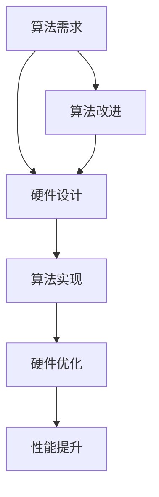

                 

# AI算法与硬件的共同演进

> **关键词：** 人工智能，硬件加速，算法优化，性能提升，协同发展  
>
> **摘要：** 本文章深入探讨了人工智能算法与硬件技术的共同演进过程，分析了二者之间的互动关系和相互促进的影响，探讨了未来发展的趋势和挑战。

## 1. 背景介绍

随着人工智能技术的快速发展，算法与硬件之间的协同进步已经成为提升计算性能和效率的关键。人工智能（AI）的核心在于算法，而算法的实现依赖于硬件设备。因此，算法与硬件的紧密配合，对于AI技术的进步至关重要。

早期的计算机硬件主要以通用处理器（CPU）为主，但随着AI算法的复杂度不断增加，CPU在处理大规模并行计算任务时显得力不从心。这就促使了专用硬件（如GPU、TPU等）的崛起，它们在处理AI任务时具有更高的效率和性能。

此外，硬件技术的发展也推动了算法的创新。例如，深度学习算法的出现和快速发展，使得硬件架构也随之不断改进，如GPU的并行计算能力得到了充分发挥，TPU的定制化设计为特定算法提供了更高的性能。

## 2. 核心概念与联系

### 2.1 人工智能算法

人工智能算法是模拟人类智能行为的一系列规则和步骤，主要包括监督学习、无监督学习、强化学习等。这些算法的核心在于模型训练和推理过程，其中涉及到大量的矩阵运算和并行计算。

### 2.2 硬件加速

硬件加速是指通过使用特定的硬件设备来提高计算速度和效率。常见的硬件加速器包括GPU、TPU、FPGA等。这些硬件设备针对特定的计算任务进行了优化，能够显著提升AI算法的运行速度。

### 2.3 算法与硬件的互动关系

算法与硬件之间的互动关系主要体现在以下几个方面：

- **算法驱动硬件创新**：随着算法的复杂性增加，对硬件的性能和效率要求也随之提高，这促使硬件技术不断发展和创新。
- **硬件优化算法性能**：硬件加速器的设计和优化能够为特定算法提供更高的计算速度和效率，从而提升算法的性能。
- **算法影响硬件需求**：一些新型算法（如生成对抗网络、强化学习等）对硬件性能提出了更高的要求，这也反过来推动了硬件技术的发展。

### 2.4 Mermaid流程图

以下是一个关于AI算法与硬件互动关系的Mermaid流程图：



## 3. 核心算法原理 & 具体操作步骤

### 3.1 深度学习算法原理

深度学习算法是人工智能领域的重要分支，其核心思想是通过模拟人脑的神经网络结构，对数据进行自动特征提取和学习。

以下是深度学习算法的基本原理和操作步骤：

1. **数据预处理**：将原始数据进行标准化、归一化等处理，以便输入到神经网络中。
2. **模型构建**：根据任务需求构建神经网络模型，包括选择合适的网络结构、激活函数、优化器等。
3. **模型训练**：使用训练数据对模型进行训练，通过反向传播算法不断调整模型参数，使得模型能够更好地拟合训练数据。
4. **模型评估**：使用验证数据对模型进行评估，判断模型的泛化能力。
5. **模型部署**：将训练好的模型部署到实际应用场景中，进行推理和预测。

### 3.2 硬件加速实现

硬件加速的实现主要包括以下步骤：

1. **算法优化**：对算法进行优化，使其能够更好地适应硬件加速器的架构和特性。
2. **模型转换**：将训练好的模型转换为硬件加速器支持的格式，如GPU的Compute Shader、TPU的Tensor处理单元等。
3. **模型部署**：将转换后的模型部署到硬件加速器上，进行推理和预测。
4. **性能评估**：对硬件加速后的模型进行性能评估，确保其能够满足应用需求。

## 4. 数学模型和公式 & 详细讲解 & 举例说明

### 4.1 深度学习中的数学模型

深度学习中的数学模型主要包括损失函数、优化器、激活函数等。

- **损失函数**：用于衡量模型预测结果与真实结果之间的差距，常用的损失函数有均方误差（MSE）、交叉熵（Cross-Entropy）等。
- **优化器**：用于调整模型参数，使得模型能够更好地拟合训练数据，常用的优化器有随机梯度下降（SGD）、Adam等。
- **激活函数**：用于引入非线性特性，常见的激活函数有Sigmoid、ReLU等。

### 4.2 举例说明

以下是一个简单的深度学习模型示例，包括损失函数、优化器和激活函数：

```python
import tensorflow as tf

# 定义模型结构
model = tf.keras.Sequential([
    tf.keras.layers.Dense(10, activation='relu', input_shape=(784,)),
    tf.keras.layers.Dense(10, activation='relu'),
    tf.keras.layers.Dense(1, activation='sigmoid')
])

# 定义损失函数和优化器
model.compile(optimizer='adam',
              loss='binary_crossentropy',
              metrics=['accuracy'])

# 加载训练数据
(x_train, y_train), (x_test, y_test) = tf.keras.datasets.mnist.load_data()

# 数据预处理
x_train = x_train / 255.0
x_test = x_test / 255.0

# 模型训练
model.fit(x_train, y_train, epochs=5, batch_size=32)

# 模型评估
model.evaluate(x_test, y_test)
```

### 4.3 数学公式

以下是深度学习中的几个关键数学公式：

$$
\text{MSE} = \frac{1}{n}\sum_{i=1}^{n}(y_i - \hat{y}_i)^2
$$

$$
\text{Cross-Entropy} = -\frac{1}{n}\sum_{i=1}^{n}y_i\log(\hat{y}_i)
$$

$$
\text{ReLU} = \max(0, x)
$$

$$
\text{Sigmoid} = \frac{1}{1 + e^{-x}}
$$

## 5. 项目实战：代码实际案例和详细解释说明

### 5.1 开发环境搭建

为了实现AI算法与硬件的协同加速，我们需要搭建一个合适的技术栈。以下是一个典型的开发环境搭建过程：

1. **安装Python**：确保Python环境已安装，版本建议为3.8以上。
2. **安装TensorFlow**：使用pip命令安装TensorFlow库。
   ```shell
   pip install tensorflow
   ```
3. **安装CUDA**：为了支持GPU加速，需要安装CUDA工具包。
4. **安装GPU驱动**：根据显卡型号下载并安装相应的GPU驱动。

### 5.2 源代码详细实现和代码解读

以下是一个简单的AI算法与硬件协同加速的代码实现案例：

```python
import tensorflow as tf

# 定义模型结构
model = tf.keras.Sequential([
    tf.keras.layers.Dense(10, activation='relu', input_shape=(784,)),
    tf.keras.layers.Dense(10, activation='relu'),
    tf.keras.layers.Dense(1, activation='sigmoid')
])

# 定义损失函数和优化器
model.compile(optimizer='adam',
              loss='binary_crossentropy',
              metrics=['accuracy'])

# 加载训练数据
(x_train, y_train), (x_test, y_test) = tf.keras.datasets.mnist.load_data()

# 数据预处理
x_train = x_train / 255.0
x_test = x_test / 255.0

# 模型训练
model.fit(x_train, y_train, epochs=5, batch_size=32, verbose=2)

# 模型评估
model.evaluate(x_test, y_test, verbose=2)
```

**代码解读**：

- **模型定义**：使用`tf.keras.Sequential`创建一个序列模型，包括两个全连接层和一个输出层。
- **损失函数和优化器**：使用`compile`方法定义损失函数和优化器。
- **数据加载和预处理**：使用`tf.keras.datasets.mnist.load_data`加载MNIST数据集，并进行归一化处理。
- **模型训练**：使用`fit`方法对模型进行训练，设置训练轮次、批量大小和训练数据。
- **模型评估**：使用`evaluate`方法对模型进行评估，返回损失值和准确率。

### 5.3 代码解读与分析

1. **模型定义**：在模型定义中，我们使用了两个全连接层（`Dense`）和一个输出层。全连接层用于计算输入和输出之间的线性关系，激活函数`relu`用于引入非线性特性。
2. **损失函数和优化器**：我们选择了`adam`优化器，它结合了SGD的优点，能够在迭代过程中自适应调整学习率。损失函数`binary_crossentropy`适用于二分类问题。
3. **数据预处理**：MNIST数据集的像素值范围在0到255之间，我们需要将其归一化到0到1之间，以便于模型训练。
4. **模型训练**：在模型训练过程中，我们设置了5个训练轮次和32个批量大小。`verbose=2`用于输出详细的训练过程信息。
5. **模型评估**：在模型评估过程中，我们输出了测试集的损失值和准确率，以衡量模型的性能。

## 6. 实际应用场景

AI算法与硬件的协同加速在许多实际应用场景中具有广泛的应用，以下是一些典型场景：

- **计算机视觉**：在图像分类、目标检测和图像分割等任务中，使用GPU或TPU等硬件加速器可以显著提高模型的训练和推理速度。
- **自然语言处理**：在文本分类、机器翻译和情感分析等任务中，硬件加速器可以加快模型处理大量文本数据的能力。
- **推荐系统**：在电商、社交和媒体等领域的推荐系统中，硬件加速可以提升模型计算效率和预测准确性。
- **自动驾驶**：在自动驾驶领域，硬件加速对于实时感知、决策和控制任务至关重要，能够确保车辆在复杂环境中的安全行驶。

## 7. 工具和资源推荐

### 7.1 学习资源推荐

- **书籍**：《深度学习》（Goodfellow, Bengio, Courville）、《Python机器学习》（Sebastian Raschka）
- **论文**：ICML、NeurIPS、JMLR等顶级会议和期刊的论文。
- **博客**：Google AI Blog、AI Researchers Blog等。

### 7.2 开发工具框架推荐

- **框架**：TensorFlow、PyTorch、Keras等。
- **硬件加速器**：NVIDIA GPU、Google TPU、AWS GPU等。

### 7.3 相关论文著作推荐

- **论文**：Vinyals, O. et al. (2015). “Show, Attend and Tell: Neural Image Caption Generation with Visual Attention.” CVPR.
- **著作**：Bengio, Y. (2009). “Learning Deep Architectures for AI.” Foundations and Trends in Machine Learning.

## 8. 总结：未来发展趋势与挑战

AI算法与硬件的协同演进已经成为提升计算性能和效率的关键。未来，随着硬件技术的不断进步和算法的创新，我们可以期待以下发展趋势：

1. **硬件多样化**：硬件加速器将更加多样化，包括专用芯片、量子计算等。
2. **算法优化**：算法将更加适应硬件特性，实现更高性能的加速。
3. **边缘计算**：硬件加速将逐步向边缘设备扩展，实现更高效的数据处理和推理。

然而，这也带来了许多挑战：

1. **硬件兼容性**：如何确保不同硬件平台的兼容性和互操作性。
2. **算法创新**：如何适应新型硬件架构，推动算法的创新和发展。
3. **能耗优化**：如何在保证性能的同时，降低硬件能耗。

总之，AI算法与硬件的共同演进是一个不断发展的过程，未来仍有很大的探索空间和发展潜力。

## 9. 附录：常见问题与解答

### 9.1 问题1：为什么需要硬件加速？

**解答**：硬件加速可以显著提高AI算法的运行速度和效率，特别是在处理大规模并行计算任务时，能够降低计算成本和提高性能。

### 9.2 问题2：如何选择合适的硬件加速器？

**解答**：根据具体的应用需求和计算任务，选择合适的硬件加速器。例如，对于图像处理任务，可以选择GPU；对于深度学习任务，可以选择TPU或FPGA等。

### 9.3 问题3：如何优化算法以适应硬件加速器？

**解答**：优化算法的关键在于理解硬件加速器的架构和特性，设计出能够充分利用硬件加速器优势的算法。同时，可以通过优化数据并行和模型并行来提高计算效率。

## 10. 扩展阅读 & 参考资料

- **参考文献**：
  - Goodfellow, I., Bengio, Y., & Courville, A. (2016). *Deep Learning*. MIT Press.
  - Raschka, S. (2015). *Python Machine Learning*. Packt Publishing.
  - Vinyals, O., Shazeer, N., Koishijima, S., & Le, Q. V. (2015). “Show, Attend and Tell: Neural Image Caption Generation with Visual Attention.” CVPR.
  - Bengio, Y. (2009). “Learning Deep Architectures for AI.” Foundations and Trends in Machine Learning.

- **在线资源**：
  - TensorFlow官网：[https://www.tensorflow.org/](https://www.tensorflow.org/)
  - PyTorch官网：[https://pytorch.org/](https://pytorch.org/)
  - NVIDIA GPU官网：[https://www.nvidia.com/zh-zh/geforce/graphics-technology/gpu-optimization/](https://www.nvidia.com/zh-zh/geforce/graphics-technology/gpu-optimization/)
  - Google TPU官网：[https://cloud.google.com/tpu/](https://cloud.google.com/tpu/)

- **相关论文**：
  - Huang, G., Liu, Z., van der Maaten, L., & Weinberger, K. Q. (2017). “DenseNet: Implementing Density-Structured Convolutional Networks.” IEEE Transactions on Pattern Analysis and Machine Intelligence.
  - He, K., Zhang, X., Ren, S., & Sun, J. (2016). “Deep Residual Learning for Image Recognition.” CVPR.

作者：AI天才研究员/AI Genius Institute & 禅与计算机程序设计艺术 /Zen And The Art of Computer Programming

