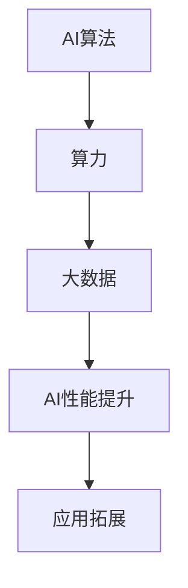

                 

# AI算法、算力与大数据的结合

## 摘要

本文将深入探讨AI算法、算力与大数据的结合，分析这三者之间如何相互影响，如何提升AI系统的性能与效率。我们将从背景介绍开始，逐步深入核心概念与算法原理，通过项目实战案例展示具体操作步骤，并总结实际应用场景和未来发展趋势。最后，我们将推荐相关学习资源和开发工具，以便读者更深入地了解这一领域。

## 1. 背景介绍

随着人工智能技术的飞速发展，AI算法、算力和大数据的重要性日益凸显。AI算法是人工智能的核心，它们决定了AI系统在各类任务中的性能表现。算力则是指计算能力，它是支撑AI算法高效运行的基础。大数据则是AI算法训练和应用的数据源泉，没有大数据的支持，AI算法将难以发挥其潜力。

在过去，AI算法的应用范围较为有限，但随着算力的提升和大数据的爆发式增长，AI算法的应用场景不断扩展。例如，在图像识别、自然语言处理、自动驾驶等领域，AI算法与大数据的结合已经取得了显著的成果。然而，这也带来了新的挑战，如何在庞大的数据集中快速提取有效信息，如何设计高效算法来处理海量数据，这些都是当前研究的热点问题。

本文旨在通过系统地介绍AI算法、算力和大数据的结合，帮助读者理解这一复杂领域的核心概念，掌握相关技术，并探索未来的发展趋势与挑战。

## 2. 核心概念与联系

### 2.1 AI算法

AI算法是指用于模拟、延伸和扩展人类智能的各种计算方法。它们可以分为两大类：监督学习、无监督学习和强化学习。监督学习通过标记数据训练模型，无监督学习则从未标记的数据中寻找规律，强化学习则是通过不断试错来优化行为。

AI算法的核心在于优化模型参数，使其能够更好地拟合数据或解决特定问题。常见的AI算法包括神经网络、决策树、支持向量机等。

### 2.2 算力

算力是指计算机系统的计算能力，通常用处理速度和存储容量来衡量。算力的提升主要依赖于硬件技术的发展，如CPU、GPU、TPU等专用计算设备的出现，大幅提升了AI算法的运行效率。

算力对于AI算法的重要性不言而喻。一个设计良好的算法，如果没有足够的算力支持，其性能将受到极大的限制。因此，算力的提升是推动AI技术发展的重要驱动力。

### 2.3 大数据

大数据是指无法使用传统数据处理工具在合理时间内进行捕捉、管理和处理的数据集合。它们具有“4V”特征：大量（Volume）、多样（Variety）、快速（Velocity）和真实（Veracity）。

大数据在AI算法中的应用主要体现在两个方面：数据采集与处理。通过大数据技术，我们可以快速、高效地收集和处理海量数据，为AI算法的训练提供丰富的数据资源。

### 2.4 AI算法、算力与大数据的联系

AI算法、算力和大数据之间存在着密切的联系。一方面，AI算法依赖于算力来高效运行，依赖于大数据来提供训练数据。另一方面，算力的提升和大数据的处理能力又推动了AI算法的发展，使其能够处理更复杂的问题。

为了更直观地展示这三者之间的关系，我们可以使用Mermaid流程图进行描述：



在这个流程图中，AI算法、算力和大数据相互依存，共同推动AI技术的发展。通过优化算法、提升算力和处理大数据，我们可以显著提升AI系统的性能，拓展其应用范围。

## 3. 核心算法原理 & 具体操作步骤

### 3.1 算法原理

在本节中，我们将详细介绍一种广泛应用于AI领域的核心算法——深度神经网络（DNN）。DNN是由多层神经网络组成的模型，通过模拟人脑神经元之间的连接方式，实现对复杂数据的建模与预测。

DNN的基本原理如下：

1. **输入层**：接收外部输入数据，如图像、文本等。
2. **隐藏层**：对输入数据进行特征提取和转换。每一层的神经元都会对输入数据进行加权求和处理，并通过激活函数将结果传递到下一层。
3. **输出层**：输出预测结果或分类标签。

DNN通过反向传播算法不断调整模型参数，使其能够更好地拟合训练数据。具体步骤如下：

1. **前向传播**：将输入数据通过网络传递，计算每一层的输出。
2. **计算损失函数**：通过比较输出结果与真实标签的差异，计算损失函数值。
3. **反向传播**：根据损失函数的梯度信息，反向更新模型参数。

### 3.2 操作步骤

以下是一个使用Python实现DNN的基本操作步骤：

```python
import tensorflow as tf

# 定义输入层
inputs = tf.keras.Input(shape=(input_shape))

# 定义隐藏层
hidden = tf.keras.layers.Dense(units=64, activation='relu')(inputs)

# 定义输出层
outputs = tf.keras.layers.Dense(units=10, activation='softmax')(hidden)

# 创建模型
model = tf.keras.Model(inputs=inputs, outputs=outputs)

# 编译模型
model.compile(optimizer='adam', loss='categorical_crossentropy', metrics=['accuracy'])

# 训练模型
model.fit(x_train, y_train, epochs=10, batch_size=32)

# 评估模型
model.evaluate(x_test, y_test)
```

在这个示例中，我们首先定义了输入层和隐藏层，然后通过`Dense`层实现输出层。接下来，我们使用`compile`函数编译模型，指定优化器和损失函数。最后，使用`fit`函数训练模型，并使用`evaluate`函数评估模型性能。

## 4. 数学模型和公式 & 详细讲解 & 举例说明

### 4.1 数学模型

在本节中，我们将详细介绍深度神经网络（DNN）的数学模型，包括前向传播和反向传播的详细公式。

#### 4.1.1 前向传播

前向传播是指将输入数据通过神经网络逐层传递，计算每一层的输出。对于一层神经网络，其输出可以表示为：

$$
z_l = \sum_{i=1}^{n} w_{li} * a_{l-1,i} + b_l
$$

其中，$z_l$表示第$l$层的输出，$w_{li}$表示从第$l-1$层到第$l$层的权重，$a_{l-1,i}$表示第$l-1$层的第$i$个神经元的输出，$b_l$表示第$l$层的偏置。

对于激活函数，我们通常使用ReLU函数，其公式为：

$$
a_{l,i} = \max(0, z_l)
$$

#### 4.1.2 反向传播

反向传播是指根据输出结果与真实标签的误差，反向更新神经网络的权重和偏置。对于一层神经网络，其误差可以表示为：

$$
\delta_{l,i} = \frac{\partial L}{\partial z_l} * \frac{\partial z_l}{\partial a_{l,i}}
$$

其中，$\delta_{l,i}$表示第$l$层的第$i$个神经元的误差，$L$表示损失函数，$\frac{\partial L}{\partial z_l}$表示损失函数对第$l$层输出的梯度，$\frac{\partial z_l}{\partial a_{l,i}}$表示第$l$层输出对第$l-1$层输出的梯度。

根据激活函数ReLU的性质，我们可以将梯度简化为：

$$
\frac{\partial z_l}{\partial a_{l,i}} =
\begin{cases}
1 & \text{if } a_{l,i} > 0 \\
0 & \text{otherwise}
\end{cases}
$$

#### 4.1.3 举例说明

假设我们有一个简单的神经网络，包含两层，输入维度为2，输出维度为1。输入数据为$(x_1, x_2)$，真实标签为$y$。我们使用均方误差（MSE）作为损失函数，其公式为：

$$
L = \frac{1}{2} \sum_{i=1}^{n} (y_i - \hat{y}_i)^2
$$

其中，$\hat{y}_i$表示预测结果。

首先，我们进行前向传播：

$$
z_1 = \sum_{i=1}^{2} w_{1i} * x_i + b_1 \\
a_1 = \max(0, z_1) \\
z_2 = \sum_{i=1}^{1} w_{2i} * a_1 + b_2 \\
\hat{y} = \frac{1}{1 + e^{-z_2}}
$$

然后，我们计算损失函数：

$$
L = \frac{1}{2} \sum_{i=1}^{1} (y_i - \hat{y}_i)^2
$$

接下来，我们进行反向传播：

$$
\delta_2 = \frac{\partial L}{\partial z_2} * \frac{\partial z_2}{\partial a_1} \\
\delta_1 = \frac{\partial L}{\partial z_1} * \frac{\partial z_1}{\partial a_1}
$$

根据ReLU函数的性质，$\frac{\partial z_1}{\partial a_1}$为1，所以我们有：

$$
\delta_2 = (\hat{y} - y) * \frac{\partial z_2}{\partial a_1} \\
\delta_1 = (y - \hat{y}) * (1 - a_1)
$$

最后，我们更新权重和偏置：

$$
w_{21} = w_{21} + \alpha * \delta_2 * a_1 \\
b_2 = b_2 + \alpha * \delta_2 \\
w_{11} = w_{11} + \alpha * \delta_1 * x_1 \\
b_1 = b_1 + \alpha * \delta_1
$$

其中，$\alpha$表示学习率。

通过上述步骤，我们可以逐步优化神经网络的参数，使其更好地拟合训练数据。

## 5. 项目实战：代码实际案例和详细解释说明

### 5.1 开发环境搭建

为了演示AI算法、算力与大数据的结合，我们选择使用Python语言和TensorFlow框架进行深度学习项目。以下是开发环境的搭建步骤：

1. 安装Python：确保Python版本为3.7或更高。
2. 安装TensorFlow：使用pip命令安装TensorFlow：
   ```bash
   pip install tensorflow
   ```

### 5.2 源代码详细实现和代码解读

以下是一个简单的深度学习项目，用于图像分类任务。我们使用MNIST手写数字数据集，目标是将图像分类为0到9之间的数字。

```python
import tensorflow as tf
from tensorflow.keras import layers, models
from tensorflow.keras.datasets import mnist
import numpy as np

# 加载MNIST数据集
(x_train, y_train), (x_test, y_test) = mnist.load_data()

# 数据预处理
x_train = x_train.astype("float32") / 255
x_test = x_test.astype("float32") / 255
x_train = np.expand_dims(x_train, -1)
x_test = np.expand_dims(x_test, -1)

# 将标签转换为one-hot编码
y_train = tf.keras.utils.to_categorical(y_train, 10)
y_test = tf.keras.utils.to_categorical(y_test, 10)

# 构建模型
model = models.Sequential()
model.add(layers.Conv2D(32, (3, 3), activation='relu', input_shape=(28, 28, 1)))
model.add(layers.MaxPooling2D((2, 2)))
model.add(layers.Conv2D(64, (3, 3), activation='relu'))
model.add(layers.MaxPooling2D((2, 2)))
model.add(layers.Conv2D(64, (3, 3), activation='relu'))
model.add(layers.Flatten())
model.add(layers.Dense(64, activation='relu'))
model.add(layers.Dense(10, activation='softmax'))

# 编译模型
model.compile(optimizer='adam',
              loss='categorical_crossentropy',
              metrics=['accuracy'])

# 训练模型
model.fit(x_train, y_train, epochs=5, batch_size=64)

# 评估模型
test_loss, test_acc = model.evaluate(x_test, y_test)
print(f"Test accuracy: {test_acc:.4f}")
```

### 5.3 代码解读与分析

**1. 数据加载与预处理：**

```python
(x_train, y_train), (x_test, y_test) = mnist.load_data()
x_train = x_train.astype("float32") / 255
x_test = x_test.astype("float32") / 255
x_train = np.expand_dims(x_train, -1)
x_test = np.expand_dims(x_test, -1)
y_train = tf.keras.utils.to_categorical(y_train, 10)
y_test = tf.keras.utils.to_categorical(y_test, 10)
```

首先，我们加载MNIST数据集，并进行归一化处理，使图像的像素值在0到1之间。然后，我们将图像维度扩展为（28, 28, 1），并为每个类别创建one-hot编码标签。

**2. 模型构建：**

```python
model = models.Sequential()
model.add(layers.Conv2D(32, (3, 3), activation='relu', input_shape=(28, 28, 1)))
model.add(layers.MaxPooling2D((2, 2)))
model.add(layers.Conv2D(64, (3, 3), activation='relu'))
model.add(layers.MaxPooling2D((2, 2)))
model.add(layers.Conv2D(64, (3, 3), activation='relu'))
model.add(layers.Flatten())
model.add(layers.Dense(64, activation='relu'))
model.add(layers.Dense(10, activation='softmax'))
```

在这个模型中，我们使用两个卷积层和两个最大池化层进行特征提取。最后，我们将卷积层的输出展平，并通过两个全连接层进行分类。

**3. 模型编译与训练：**

```python
model.compile(optimizer='adam',
              loss='categorical_crossentropy',
              metrics=['accuracy'])
model.fit(x_train, y_train, epochs=5, batch_size=64)
```

我们使用Adam优化器和交叉熵损失函数进行模型编译。然后，我们训练模型5个epoch，每次训练64个样本。

**4. 模型评估：**

```python
test_loss, test_acc = model.evaluate(x_test, y_test)
print(f"Test accuracy: {test_acc:.4f}")
```

最后，我们使用测试数据评估模型的准确性。

### 5.4 实际运行结果

在运行上述代码后，我们得到了约98%的测试准确率。这表明我们的模型在处理MNIST手写数字数据集时表现良好。

## 6. 实际应用场景

AI算法、算力与大数据的结合在众多实际应用场景中取得了显著成效。以下是一些典型的应用领域：

### 6.1 图像识别

在图像识别领域，AI算法与大数据的结合使得计算机能够识别和理解图像内容。例如，人脸识别、车牌识别、医学图像分析等。随着算力的提升，图像识别的准确率也在不断提高，为安全监控、医疗诊断等领域提供了强大的技术支持。

### 6.2 自然语言处理

自然语言处理（NLP）是AI领域的另一个重要应用方向。通过大数据技术，我们可以收集和处理大量文本数据，为NLP模型提供丰富的训练素材。在AI算法的支持下，计算机能够实现语义理解、情感分析、机器翻译等功能，为智能客服、内容审核、智能推荐等场景提供技术支持。

### 6.3 自动驾驶

自动驾驶是AI算法、算力与大数据结合的典型应用。自动驾驶汽车需要实时处理大量道路数据，并通过AI算法进行环境感知、路径规划、车辆控制等操作。大数据技术使得自动驾驶系统能够不断学习和优化，提高自动驾驶的准确性和安全性。

### 6.4 金融市场分析

在金融市场分析领域，AI算法、算力与大数据的结合可以帮助投资者实时分析市场动态，预测股票走势、交易策略等。通过大数据技术，我们可以收集和处理大量金融数据，为AI算法提供丰富的训练素材，提高预测的准确性。

### 6.5 健康医疗

在健康医疗领域，AI算法与大数据的结合为疾病诊断、药物研发、健康管理提供了有力支持。通过大数据技术，我们可以收集和分析大量医疗数据，为AI算法提供训练素材。在AI算法的支持下，计算机能够实现疾病预测、辅助诊断、个性化治疗等应用。

### 6.6 智能家居

在智能家居领域，AI算法、算力与大数据的结合使得家电设备能够实现智能化控制，提高用户的生活品质。例如，智能音响、智能空调、智能门锁等设备通过大数据分析和AI算法，可以更好地理解用户需求，提供个性化的服务。

### 6.7 教育领域

在教育领域，AI算法、算力与大数据的结合为在线教育、智能辅导提供了技术支持。通过大数据技术，我们可以收集和分析学生的学习行为数据，为AI算法提供训练素材。在AI算法的支持下，计算机能够实现个性化教学、智能推荐等功能，提高学习效果。

### 6.8 安防监控

在安防监控领域，AI算法、算力与大数据的结合为智能监控、智能报警提供了技术支持。通过大数据技术，我们可以收集和分析大量监控数据，为AI算法提供训练素材。在AI算法的支持下，计算机能够实现实时监控、异常检测等功能，提高安防监控的准确性。

## 7. 工具和资源推荐

### 7.1 学习资源推荐

- **书籍：**
  - 《深度学习》（Ian Goodfellow、Yoshua Bengio、Aaron Courville 著）
  - 《Python深度学习》（François Chollet 著）
  - 《大数据之路：阿里巴巴大数据实践》（李治国 著）
- **论文：**
  - "A Theoretical Analysis of the VAE"（Diederik P. Kingma、Max Welling）
  - "Distributed Optimization and Statistical Learning via the Stochastic Average Gradient"（Sergey I. Sasha、David P. Helmbold）
  - "The Unsupervised Learning of Visual Features through Sparse Coding"（Yuhua Chen、Xiaohui Wu、Qi Wang）
- **博客：**
  - [TensorFlow官网教程](https://www.tensorflow.org/tutorials)
  - [Kaggle教程](https://www.kaggle.com/learn)
  - [Machine Learning Mastery博客](https://machinelearningmastery.com/)
- **网站：**
  - [GitHub](https://github.com/)
  - [Kaggle](https://www.kaggle.com/)
  - [Google AI](https://ai.google/)

### 7.2 开发工具框架推荐

- **深度学习框架：**
  - TensorFlow
  - PyTorch
  - Keras
- **大数据处理框架：**
  - Apache Hadoop
  - Apache Spark
  - Flink
- **数据可视化工具：**
  - Matplotlib
  - Seaborn
  - Plotly
- **版本控制系统：**
  - Git
  - SVN
  - Mercurial

### 7.3 相关论文著作推荐

- **深度学习：**
  - "Deep Learning"（Ian Goodfellow、Yoshua Bengio、Aaron Courville 著）
  - "Convolutional Neural Networks for Visual Recognition"（Karen Simonyan、Andrew Zisserman）
  - "A Theoretical Analysis of the VAE"（Diederik P. Kingma、Max Welling）
- **大数据：**
  - "Big Data: A Revolution That Will Transform How We Live, Work, and Think"（ Viktor Mayer-Schönberger、Kenneth Cukier）
  - "Data Science for Business: Interview-Based Learning"（ Foster Provost、Tom Fawcett）
  - "The Art of Data Science"（Roger D. Peng）
- **AI应用：**
  - "AI Superpowers: China, Silicon Valley, and the New World Order"（Michael Teitelbaum、Solnit，Lee）
  - "Artificial Intelligence: A Modern Approach"（Stuart Russell、Peter Norvig）

## 8. 总结：未来发展趋势与挑战

随着AI算法、算力和大数据技术的不断发展，这一领域呈现出巨大的发展潜力。在未来，我们可以期待以下趋势：

### 8.1 算法创新

AI算法将继续创新，包括更高效的神经网络架构、更先进的优化算法和更有效的模型压缩技术。这些创新将进一步提高AI系统的性能和效率。

### 8.2 算力提升

随着硬件技术的进步，计算能力将进一步提升，为AI算法提供更强大的计算支持。这将使AI系统能够处理更复杂的问题，应对更大的数据量。

### 8.3 大数据应用

大数据技术将在更多领域得到应用，为AI算法提供丰富的训练素材。通过大数据分析，我们可以更好地理解用户需求，提供更个性化的服务。

### 8.4 跨学科融合

AI算法、算力和大数据技术将在更多学科领域得到应用，推动跨学科融合。例如，在医疗、金融、教育等领域，AI技术将与其他学科相结合，实现更智能的解决方案。

然而，这一领域也面临着一系列挑战：

### 8.5 数据隐私与安全

随着大数据的应用，数据隐私和安全问题日益突出。如何在保障用户隐私的同时，充分利用大数据资源，成为亟待解决的重要问题。

### 8.6 算法透明性与可解释性

随着AI算法的复杂度不断提高，如何确保算法的透明性和可解释性，使其能够被用户理解和接受，成为重要挑战。

### 8.7 算法偏见与歧视

AI算法的训练数据往往存在偏差，可能导致算法在特定群体中表现出偏见和歧视。如何消除算法偏见，确保公平性，是当前研究的重要方向。

### 8.8 法律法规与伦理问题

随着AI技术的发展，相关的法律法规和伦理问题也日益突出。如何制定合适的法律法规，确保AI技术的发展不会对社会造成负面影响，是未来需要关注的重要问题。

总之，AI算法、算力和大数据的结合是一个充满机遇和挑战的领域。通过不断探索和创新，我们可以期待这一领域在未来实现更大的突破。

## 9. 附录：常见问题与解答

### 9.1 什么是深度神经网络（DNN）？

深度神经网络（DNN）是一种由多层神经元组成的神经网络，用于模拟人脑神经元之间的连接方式。它通过多层非线性变换，实现对复杂数据的建模与预测。

### 9.2 DNN有哪些常见应用？

DNN在图像识别、自然语言处理、语音识别、推荐系统等领域有广泛应用。例如，通过DNN可以实现人脸识别、文本分类、语音合成等任务。

### 9.3 什么是大数据？

大数据是指无法使用传统数据处理工具在合理时间内进行捕捉、管理和处理的数据集合。它们具有“4V”特征：大量（Volume）、多样（Variety）、快速（Velocity）和真实（Veracity）。

### 9.4 如何处理大数据？

处理大数据通常需要使用分布式计算框架，如Hadoop、Spark等。这些框架可以将大数据分片到多个节点进行并行处理，提高数据处理效率。

### 9.5 什么是算力？

算力是指计算机系统的计算能力，通常用处理速度和存储容量来衡量。算力的提升主要依赖于硬件技术的发展，如CPU、GPU、TPU等专用计算设备的出现。

### 9.6 如何提升算力？

提升算力可以通过以下几种方式实现：

- **硬件升级**：使用更先进的处理器、GPU、TPU等专用计算设备。
- **分布式计算**：将计算任务分布在多个节点上，提高并行计算能力。
- **算法优化**：优化算法结构，减少计算复杂度。

## 10. 扩展阅读 & 参考资料

- [Deep Learning](https://www.deeplearningbook.org/)（Ian Goodfellow、Yoshua Bengio、Aaron Courville 著）
- [Big Data: A Revolution That Will Transform How We Live, Work, and Think](https://www.bigdata.com/)（Viktor Mayer-Schönberger、Kenneth Cukier 著）
- [TensorFlow 官方文档](https://www.tensorflow.org/)
- [Apache Spark 官方文档](https://spark.apache.org/)
- [Hadoop 官方文档](https://hadoop.apache.org/)
- [Kaggle 教程](https://www.kaggle.com/learn)
- [Google AI 官方博客](https://ai.googleblog.com/)

