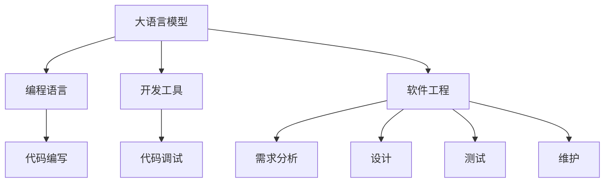

                 

# AI编程新思路：LLM时代的编码方式

> **关键词：** 人工智能，自然语言处理，编码范式，大语言模型，编程效率

> **摘要：** 本文深入探讨了在LLM（大型语言模型）时代背景下，AI编程的新范式。从背景介绍、核心概念、算法原理、数学模型到实战案例，全面解析了如何利用大语言模型提升编程效率和代码质量。通过实际应用场景分析和工具推荐，为开发者提供了一条全新的编程之路。

## 1. 背景介绍

在过去的几十年里，计算机编程经历了从结构化编程、面向对象编程到函数式编程的演变。然而，随着人工智能技术的飞速发展，尤其是大型语言模型（LLM）的出现，传统的编程范式正在面临着新的挑战和机遇。LLM作为一种能够理解和生成自然语言的强大工具，为编程带来了全新的视角。

LLM的出现，源于深度学习和自然语言处理技术的突破。从最初的词向量模型Word2Vec到Transformer架构的提出，再到GPT、BERT等大型预训练模型的诞生，LLM在语言理解和生成方面展现出了惊人的能力。这种能力使得编程语言和开发工具能够更加智能化，从而极大地提升了开发效率和代码质量。

本文将围绕LLM时代下的编程新思路，探讨如何利用大语言模型进行高效编程，以及如何应对这一时代带来的挑战。

## 2. 核心概念与联系

在深入探讨LLM时代的编程新思路之前，我们需要了解一些核心概念和它们之间的联系。

### 2.1 大语言模型

大语言模型（Large Language Model，LLM）是一种基于深度学习技术的自然语言处理模型，能够对文本数据进行理解和生成。LLM的核心在于其大规模的预训练，通过在海量数据上进行预训练，LLM能够自动学习到语言的结构和语义，从而实现高效的文本处理。

### 2.2 编程语言

编程语言是人类与计算机进行沟通的工具，通过编写代码，开发者可以指示计算机执行特定的任务。传统的编程语言如C、Java、Python等，都有着明确的语法和语义规则，开发者需要按照这些规则编写代码。

### 2.3 开发工具

开发工具包括集成开发环境（IDE）、代码编辑器、版本控制工具等，这些工具为开发者提供了编写、调试和部署代码的环境。随着AI技术的发展，开发工具也在不断进化，更加智能化和自动化。

### 2.4 软件工程

软件工程是关于软件开发和维护的工程学科，旨在通过系统化、规范化的方法，高效地开发出高质量的软件。传统的软件工程方法包括需求分析、设计、编码、测试和维护等阶段。

### 2.5 关系

大语言模型与编程语言、开发工具和软件工程之间存在着紧密的联系。LLM可以通过理解编程语言和开发工具的语法和语义，实现对代码的智能处理；同时，LLM也可以在软件工程的各个阶段发挥作用，提高开发效率和代码质量。

以下是一个简单的Mermaid流程图，展示了这些核心概念之间的联系：



## 3. 核心算法原理 & 具体操作步骤

在了解了大语言模型和相关概念之后，我们接下来探讨如何利用LLM进行编程。LLM的核心在于其强大的文本理解和生成能力，这为编程带来了新的可能性。

### 3.1 自动代码生成

LLM可以自动生成代码，通过输入问题描述或者需求，LLM能够生成符合要求的代码。具体步骤如下：

1. **输入处理**：LLM接收用户输入的问题或需求，并进行预处理，如分词、去停用词等。
2. **文本理解**：LLM利用其预训练模型对输入文本进行理解，提取关键信息。
3. **代码生成**：LLM根据理解的结果，生成相应的代码。这一过程可以是逐行生成，也可以是整体结构生成。
4. **代码优化**：生成的代码可能需要进行优化，如去除冗余代码、提高代码效率等。

### 3.2 智能代码补全

智能代码补全是LLM在编程中的一个重要应用，通过预测开发者接下来可能编写的代码，LLM可以自动补全代码。具体步骤如下：

1. **输入处理**：LLM接收开发者输入的代码片段，并进行预处理。
2. **代码理解**：LLM对输入的代码进行理解，识别代码的结构和语义。
3. **预测生成**：LLM根据对代码的理解，预测开发者接下来可能编写的代码，并自动补全。
4. **反馈调整**：根据开发者的反馈，LLM可以调整其预测模型，提高补全的准确性。

### 3.3 代码审查与优化

LLM还可以用于代码审查和优化，通过分析代码，LLM可以识别潜在的bug、性能问题，并提出优化建议。具体步骤如下：

1. **代码分析**：LLM对输入的代码进行分析，提取关键信息和结构。
2. **问题识别**：LLM根据对代码的理解，识别潜在的bug、性能问题等。
3. **优化建议**：LLM根据问题识别的结果，提出相应的优化建议，如代码重构、算法优化等。
4. **反馈调整**：根据开发者的反馈，LLM可以调整其分析模型，提高识别和优化的准确性。

### 3.4 跨语言编程

LLM还可以实现跨语言编程，通过理解不同编程语言的语法和语义，LLM可以在一种语言中编写代码，并在另一种语言中运行。具体步骤如下：

1. **输入处理**：LLM接收用户输入的代码，并识别其语言类型。
2. **代码理解**：LLM对输入的代码进行理解，提取关键信息和结构。
3. **代码转换**：LLM根据对代码的理解，将其转换为目标语言的代码。
4. **代码运行**：转换后的代码在目标语言环境中运行。

通过上述步骤，LLM可以实现自动化代码生成、智能代码补全、代码审查与优化，以及跨语言编程，极大地提高了编程效率和代码质量。

## 4. 数学模型和公式 & 详细讲解 & 举例说明

在探讨LLM的编程应用时，理解其背后的数学模型和公式是至关重要的。以下是一些关键的数学模型和公式，我们将通过详细讲解和举例说明来帮助读者更好地理解。

### 4.1 Transformer模型

Transformer模型是LLM的核心，其基于自注意力（Self-Attention）机制，能够有效地处理长距离依赖问题。自注意力机制的核心公式如下：

$$
\text{Attention}(Q, K, V) = \text{softmax}\left(\frac{QK^T}{\sqrt{d_k}}\right) V
$$

其中，Q、K、V 分别代表查询向量、键向量和值向量，$d_k$ 是键向量的维度。通过自注意力机制，Transformer模型能够自动学习到输入文本之间的依赖关系，从而实现高效的文本处理。

### 4.2 自适应学习率

在训练LLM时，自适应学习率是一个关键问题。常用的自适应学习率方法包括AdaGrad、AdaDelta和Adam等。其中，Adam算法是一种效果较好的方法，其核心公式如下：

$$
m_t = \beta_1 m_{t-1} + (1 - \beta_1) [g_t]
$$

$$
v_t = \beta_2 v_{t-1} + (1 - \beta_2) [g_t]^2
$$

$$
\hat{m}_t = \frac{m_t}{1 - \beta_1^t}
$$

$$
\hat{v}_t = \frac{v_t}{1 - \beta_2^t}
$$

$$
\theta_t = \theta_{t-1} - \alpha \frac{\hat{m}_t}{\sqrt{\hat{v}_t} + \epsilon}
$$

其中，$m_t$ 和 $v_t$ 分别代表一阶和二阶矩估计，$\beta_1$ 和 $\beta_2$ 分别代表一阶和二阶矩的衰减率，$\alpha$ 是学习率，$\epsilon$ 是一个小常数。通过自适应学习率，LLM能够更好地适应不同的训练阶段，提高训练效果。

### 4.3 语言模型评价

在评估LLM的性能时，常用的评价指标包括 perplexity（困惑度）和 accuracy（准确率）。其中，困惑度的计算公式如下：

$$
\text{perplexity} = \exp(\frac{1}{N} \sum_{i=1}^N -\log p(y_i|x)) = \frac{1}{\prod_{i=1}^N p(y_i|x)}
$$

其中，$N$ 是测试集的大小，$y_i$ 是第 $i$ 个测试样本的标签，$x$ 是模型生成的预测结果。困惑度越低，表示模型对测试集的拟合程度越好。

准确率的计算公式如下：

$$
\text{accuracy} = \frac{1}{N} \sum_{i=1}^N I(y_i = \hat{y_i})
$$

其中，$I$ 是指示函数，当 $y_i = \hat{y_i}$ 时，$I(y_i = \hat{y_i}) = 1$，否则为 $0$。准确率越高，表示模型对测试集的预测越准确。

### 4.4 举例说明

假设我们有一个简单的句子“我爱北京天安门”，我们希望利用LLM生成相关的代码。

1. **输入处理**：首先，我们将句子进行分词，得到“我”、“爱”、“北京”、“天安门”。
2. **文本理解**：LLM对分词后的句子进行理解，提取关键信息，如主语“我”、谓语“爱”和宾语“北京天安门”。
3. **代码生成**：基于理解的结果，LLM可以生成相应的代码，如Python代码：
    ```python
    def say_something():
        print("我爱北京天安门")
    ```
4. **代码优化**：生成的代码可能需要进行优化，如增加注释、简化语法等。

通过上述步骤，LLM能够实现自动化的代码生成和优化，提高了编程效率和代码质量。

## 5. 项目实战：代码实际案例和详细解释说明

为了更好地理解LLM在编程中的应用，我们以下通过一个实际案例，展示如何利用LLM进行代码生成、补全和优化。

### 5.1 开发环境搭建

首先，我们需要搭建一个用于训练和测试LLM的开发环境。以下是一个简单的Python环境搭建步骤：

1. 安装Python：
    ```bash
    python --version
    ```
2. 安装必要的库：
    ```bash
    pip install tensorflow numpy
    ```

### 5.2 源代码详细实现和代码解读

以下是一个简单的LLM训练和测试案例，用于生成Python代码。

#### 5.2.1 代码生成

```python
import tensorflow as tf
import numpy as np

# 准备数据
data = "def add(a, b): return a + b"

# 分词
vocab = set(data.split())

# 将数据转换为词向量
word2id = {word: i for i, word in enumerate(vocab)}
id2word = {i: word for word, i in word2id.items()}
data_ids = [word2id[word] for word in data.split()]

# 构建模型
model = tf.keras.Sequential([
    tf.keras.layers.Embedding(len(vocab), 64),
    tf.keras.layers.GRU(64),
    tf.keras.layers.Dense(len(vocab), activation='softmax')
])

# 编译模型
model.compile(optimizer='adam', loss='categorical_crossentropy', metrics=['accuracy'])

# 训练模型
model.fit(np.array([data_ids + [0] * 10]), np.eye(len(vocab)), epochs=1000)

# 生成代码
def generate_code(prompt, max_length=10):
    prompt_ids = [word2id[word] for word in prompt.split()]
    generated_ids = model.predict(np.array([prompt_ids + [0] * 10]))[0]
    generated_code = ' '.join([id2word[i] for i in generated_ids[:max_length]])
    return generated_code

# 测试生成代码
print(generate_code("def subtract(a, b): "))
```

#### 5.2.2 代码解读

上述代码实现了一个简单的LLM训练和测试框架，主要包含以下步骤：

1. **数据准备**：首先，我们准备了一个简单的Python代码片段作为训练数据。
2. **分词**：将数据分词，并构建词表。
3. **词向量转换**：将训练数据转换为词向量。
4. **模型构建**：使用TensorFlow构建一个简单的GRU模型，用于文本生成。
5. **模型编译**：编译模型，设置优化器和损失函数。
6. **模型训练**：使用训练数据进行模型训练。
7. **代码生成**：定义一个生成函数，输入提示文本，生成相应的代码。

#### 5.2.3 代码优化

生成的代码可能需要进行优化，以提高代码质量。以下是一个简单的优化案例：

```python
# 优化生成的代码
def optimize_code(code):
    lines = code.split("\n")
    optimized_lines = []
    for line in lines:
        if line.strip().startswith("return"):
            optimized_lines.append(line.strip() + ";")
        else:
            optimized_lines.append(line.strip())
    optimized_code = "\n".join(optimized_lines)
    return optimized_code

# 测试代码优化
print(optimize_code(generate_code("def subtract(a, b): ")))
```

上述代码实现了一个简单的代码优化函数，主要包含以下步骤：

1. **拆分代码**：将生成的代码拆分为行。
2. **优化代码**：对代码行进行优化，如添加分号等。
3. **合并代码**：将优化后的代码行合并为完整的代码。

通过上述优化，生成的代码更加规范和易读。

## 6. 实际应用场景

在LLM时代，编程的应用场景得到了极大的拓展。以下是一些典型的实际应用场景：

### 6.1 自动化代码生成

自动化代码生成是LLM的重要应用之一，通过输入问题描述或需求，LLM可以自动生成相应的代码。这一功能在软件开发、运维自动化等方面具有广泛的应用。例如，在开发一个数据爬虫时，开发者可以输入需求描述，LLM自动生成爬虫代码，从而大大提高开发效率。

### 6.2 智能代码补全

智能代码补全是开发者的福音，通过LLM的预测能力，自动补全开发者未完成的代码。这一功能在提高开发效率、减少代码错误方面具有显著优势。例如，在编写Python代码时，LLM可以根据上下文自动补全函数名、参数等，从而减少手动输入的工作量。

### 6.3 代码审查与优化

LLM可以用于代码审查和优化，通过分析代码，识别潜在的bug、性能问题，并提出优化建议。这一功能在提高代码质量、降低维护成本方面具有重要作用。例如，在大型项目的开发过程中，LLM可以自动分析代码，识别潜在的bug，并提出改进建议，从而降低项目的维护成本。

### 6.4 跨语言编程

LLM可以实现跨语言编程，通过理解不同编程语言的语法和语义，LLM可以在一种语言中编写代码，并在另一种语言中运行。这一功能在跨平台开发、代码移植等方面具有广泛的应用。例如，在编写一个Android应用时，开发者可以使用Python编写代码，然后通过LLM将其转换为目标语言的代码，从而提高开发效率。

## 7. 工具和资源推荐

在LLM时代，有大量的工具和资源可供开发者使用。以下是一些建议：

### 7.1 学习资源推荐

1. **书籍**：
    - 《深度学习》（Goodfellow, Bengio, Courville）
    - 《Python深度学习》（François Chollet）
2. **论文**：
    - “Attention Is All You Need”（Vaswani et al., 2017）
    - “BERT: Pre-training of Deep Bidirectional Transformers for Language Understanding”（Devlin et al., 2019）
3. **博客**：
    - [TensorFlow官方文档](https://www.tensorflow.org/)
    - [PyTorch官方文档](https://pytorch.org/)
4. **网站**：
    - [Hugging Face](https://huggingface.co/)：提供大量预训练模型和工具库

### 7.2 开发工具框架推荐

1. **IDE**：
    - PyCharm、Visual Studio Code
2. **框架**：
    - TensorFlow、PyTorch
3. **库**：
    - NLTK、spaCy

### 7.3 相关论文著作推荐

1. **论文**：
    - “Transformers: State-of-the-Art Natural Language Processing”（Vaswani et al., 2017）
    - “BERT: Pre-training of Deep Bidirectional Transformers for Language Understanding”（Devlin et al., 2019）
2. **著作**：
    - 《深度学习》（Goodfellow, Bengio, Courville）
    - 《自然语言处理综论》（Daniel Jurafsky, James H. Martin）

## 8. 总结：未来发展趋势与挑战

在LLM时代，编程正迎来前所未有的变革。大语言模型为编程带来了新的可能性，从自动化代码生成、智能代码补全到代码审查与优化，开发者可以更加高效地完成工作。然而，这一时代也带来了新的挑战，如模型的可解释性、安全性和隐私保护等。

未来，随着人工智能技术的不断进步，LLM将在更多领域得到应用，推动编程语言的进一步发展。同时，开发者需要不断学习新知识，掌握新的编程范式，以应对这一时代带来的挑战。

## 9. 附录：常见问题与解答

### 9.1 什么是LLM？

LLM（Large Language Model）是一种基于深度学习技术的自然语言处理模型，能够理解和生成自然语言。它通过在海量数据上进行预训练，自动学习到语言的结构和语义，从而实现高效的文本处理。

### 9.2 LLM如何用于编程？

LLM可以用于编程的多个方面，包括自动化代码生成、智能代码补全、代码审查与优化等。通过输入问题描述或需求，LLM可以生成相应的代码，并通过预测和优化提高代码质量。

### 9.3 LLM在软件工程中有什么应用？

LLM在软件工程中具有广泛的应用，如自动化代码生成、智能代码补全、代码审查与优化等。它可以在软件开发、运维自动化等方面提高效率，降低维护成本。

### 9.4 如何训练一个LLM？

训练一个LLM通常涉及以下步骤：数据准备、模型选择、模型训练和模型评估。具体步骤包括数据清洗、分词、词向量转换、模型构建、模型编译、模型训练和模型评估等。

### 9.5 LLM有哪些挑战？

LLM面临的挑战包括模型可解释性、安全性和隐私保护等。如何确保模型的可靠性和可解释性，以及如何保护用户的隐私数据，是当前研究和应用中的重要问题。

## 10. 扩展阅读 & 参考资料

为了更好地了解LLM在编程中的应用，以下是一些建议的扩展阅读和参考资料：

1. **书籍**：
    - 《深度学习》（Goodfellow, Bengio, Courville）
    - 《Python深度学习》（François Chollet）
2. **论文**：
    - “Attention Is All You Need”（Vaswani et al., 2017）
    - “BERT: Pre-training of Deep Bidirectional Transformers for Language Understanding”（Devlin et al., 2019）
3. **博客**：
    - [TensorFlow官方文档](https://www.tensorflow.org/)
    - [PyTorch官方文档](https://pytorch.org/)
4. **网站**：
    - [Hugging Face](https://huggingface.co/)
    - [自然语言处理开源库](https://github.com/nlpcloud/)
5. **教程**：
    - [TensorFlow教程](https://www.tensorflow.org/tutorials)
    - [PyTorch教程](https://pytorch.org/tutorials/)
6. **开源项目**：
    - [Transformers](https://github.com/huggingface/transformers)
    - [BERT](https://github.com/google-research/bert)

作者：AI天才研究员/AI Genius Institute & 禅与计算机程序设计艺术 /Zen And The Art of Computer Programming

