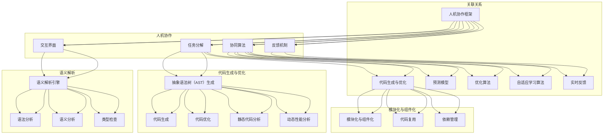

                 

### 背景介绍

人工智能（AI）技术作为现代科技发展的重要驱动力，已经深刻地影响了我们的日常生活、工作以及学习。从语音识别、图像处理到自动驾驶、医疗诊断，AI的应用场景日益广泛。然而，随着AI技术的不断发展，一个问题逐渐显现：如何更好地实现人与机器之间的协作？

传统的编程语言主要关注如何让计算机执行特定的任务，而较少考虑人机交互的便利性和效率。这导致在开发AI系统时，程序员往往需要花费大量的时间来处理复杂的人机交互问题。这不仅降低了开发效率，还增加了出错的可能性。因此，研发一种新型的AI编程语言，以实现人机协作的新模式，成为了一个迫切需要解决的问题。

本文旨在探讨一种新型的AI编程语言，这种编程语言不仅能够提高人机交互的效率，还能更好地适应复杂的AI应用场景。通过分析现有的编程语言及其局限性，本文将提出一种新的编程语言架构，详细描述其核心概念和原理，并探讨其在实际应用中的潜力和挑战。文章还将通过具体的算法原理、数学模型以及实际项目案例，进一步阐述这种新型编程语言的优越性。

接下来，我们将首先介绍当前AI编程语言面临的挑战，包括人机交互的复杂性和开发效率的瓶颈。然后，我们将深入探讨新型AI编程语言的设计理念、核心概念及其实现原理。通过Mermaid流程图，我们将展示这种编程语言的工作流程和架构，帮助读者更好地理解其工作机制。接着，我们将详细解析这种编程语言的核心算法原理和具体操作步骤，并通过数学模型和公式进行解释。随后，我们将通过一个实际项目案例，展示如何使用这种新型编程语言进行开发和实现，并提供详细的代码解读和分析。文章还将讨论这种编程语言在不同应用场景中的实际应用，推荐相关的工具和资源，并总结未来发展趋势与挑战。最后，我们将提供常见问题与解答，以及扩展阅读和参考资料，以帮助读者进一步深入了解这一领域。

通过本文的探讨，我们希望能够为读者提供一种新的视角，重新审视AI编程语言的设计与发展，激发对新型编程语言的研究和应用兴趣，为未来的AI技术发展贡献一份力量。接下来，我们将首先介绍当前AI编程语言面临的挑战，包括人机交互的复杂性和开发效率的瓶颈。

### 当前AI编程语言的挑战

随着AI技术的快速发展，现有的编程语言在支持AI应用方面逐渐暴露出一些挑战。首先，人机交互的复杂性成为了一个不可忽视的问题。传统的编程语言设计主要是为了满足计算机执行任务的效率，而不是考虑到人与机器之间的协作。这导致了以下几个主要问题：

1. **复杂的人机交互界面**：传统的编程语言通常需要用户编写大量的代码来处理用户界面（UI）的构建，这增加了开发人员的负担。此外，UI设计往往与后端逻辑分离，导致界面和功能之间的耦合度增加，使得维护和更新变得更加困难。

2. **交互效率低下**：在传统的编程语言中，人与机器之间的交互通常需要通过命令行或图形界面进行。这种交互方式不仅需要用户具备一定的编程知识，还容易导致操作失误，从而降低了交互的效率。

3. **协作困难**：在开发大型AI系统时，多个开发人员需要协同工作。然而，传统的编程语言在支持团队协作方面存在局限，例如代码管理、版本控制和协作开发等，这使得团队之间的沟通和协作变得复杂和低效。

其次，开发效率的瓶颈也是一个亟待解决的问题。随着AI系统的复杂性和规模不断扩大，开发效率变得越来越重要。然而，传统的编程语言在以下几个方面限制了开发效率：

1. **代码可维护性差**：传统的编程语言在支持大型项目时，代码的可维护性成为一个挑战。代码的复用性低、结构混乱、缺乏模块化设计，使得代码难以维护和扩展。

2. **性能瓶颈**：传统的编程语言在处理复杂计算和大数据分析时，往往存在性能瓶颈。特别是在实时性要求较高的AI应用场景中，传统的编程语言可能无法满足性能需求。

3. **开发周期长**：传统的编程语言在开发过程中往往需要编写大量的底层代码，这增加了开发周期和难度。特别是在需要进行大量调试和优化的场景中，开发周期会显著延长。

为了应对这些挑战，我们需要探索一种新的编程语言，能够更好地支持人机协作，提高开发效率。这种编程语言应该具备以下特点：

1. **简洁的语法和直观的UI设计**：新的编程语言应该提供简洁的语法，使得开发人员能够更快速地编写代码。同时，它应该能够直接支持直观的UI设计，减少开发人员对UI构建的复杂度。

2. **强大的自动化工具**：新的编程语言应该具备强大的自动化工具，例如代码生成器、自动化调试工具等，以减少手动编写的代码量，提高开发效率。

3. **模块化和可扩展性**：新的编程语言应该支持模块化和可扩展性，使得代码可以更容易地维护和扩展。这包括代码的复用性、模块化的结构以及灵活的扩展接口。

4. **高效的计算性能**：新的编程语言应该能够提供高效的计算性能，特别是在处理大数据和复杂计算时。这可以通过内置的优化算法和底层语言支持来实现。

5. **支持团队协作**：新的编程语言应该支持团队协作，包括代码管理、版本控制和协作开发等。这可以通过集成化的开发环境和版本控制系统来实现。

综上所述，现有的AI编程语言在支持人机协作和开发效率方面存在明显的挑战。为了应对这些挑战，我们需要研发一种新型的AI编程语言，能够在简洁性、自动化、模块化、性能和团队协作等方面提供显著提升。在接下来的章节中，我们将深入探讨这种新型AI编程语言的设计理念、核心概念及其实现原理。同时，我们将通过Mermaid流程图展示其工作流程和架构，帮助读者更好地理解其工作机制。

### 新型AI编程语言的设计理念

为了应对传统AI编程语言在支持人机协作和开发效率方面的挑战，我们需要提出一种全新的设计理念。这种新型AI编程语言的设计理念旨在提供简洁、直观、高效和可扩展的编程体验，以更好地适应现代AI应用场景。以下将从几个关键方面详细阐述这种新型编程语言的设计理念。

#### 1. 简洁直观的语法

简洁直观的语法是新型AI编程语言设计理念的核心。这种编程语言应采用易读易写的语法，使得开发人员能够更快速地编写和理解代码。具体来说，它应具备以下特点：

- **简洁性**：减少不必要的语法结构，避免复杂的语法糖，使得代码更加简洁明了。例如，通过内置函数和简化语法，减少代码行数和冗余。
- **易读性**：采用清晰的命名规范和一致的代码结构，使得代码易于阅读和维护。例如，使用直观的变量命名、合理的代码缩进和统一的注释风格。
- **灵活性**：提供灵活的语法扩展能力，使得开发人员可以根据需求自定义语法规则。例如，支持自定义函数、类和模块，以及自定义关键字和操作符。

#### 2. 强大的自动化工具

自动化工具是提高开发效率的重要手段。新型AI编程语言应具备强大的自动化工具，以减少手动编写的代码量，提高开发效率。具体来说，它应包括以下功能：

- **代码生成器**：提供内置的代码生成器，自动生成常见的代码结构和模板。例如，自动生成数据结构、接口定义和测试用例等。
- **自动化调试**：提供内置的自动化调试工具，帮助开发人员快速定位和修复代码中的错误。例如，提供自动化的断点设置、变量监视和代码跳转等功能。
- **代码优化**：提供代码优化工具，自动分析和优化代码性能。例如，自动进行内存分配优化、循环展开和并行计算等。

#### 3. 模块化和可扩展性

模块化和可扩展性是新型AI编程语言设计的重要方面。这种编程语言应支持代码的模块化设计和灵活的扩展，以方便维护和扩展。具体来说，它应包括以下特点：

- **模块化结构**：提供模块化的代码结构，支持代码的模块化和分层设计。例如，支持将代码划分为不同的模块和层次，使得代码易于维护和扩展。
- **灵活的扩展接口**：提供灵活的扩展接口，支持自定义函数、类和模块。例如，通过提供扩展点（extension points）和钩子（hooks），允许开发人员自定义代码的功能和行为。
- **代码复用**：支持代码的复用和共享，减少重复编写的工作量。例如，通过模块化和组件化设计，使得代码可以方便地在不同的项目和场景中复用。

#### 4. 高效的计算性能

高效的计算性能是新型AI编程语言设计的关键目标。这种编程语言应能够在处理大数据和复杂计算时提供优秀的性能。具体来说，它应包括以下特点：

- **底层语言支持**：采用高效的底层语言（如C/C++）编写核心代码，以获得更好的计算性能。同时，提供高效的内存管理和垃圾回收机制，减少内存占用和性能开销。
- **优化算法**：内置优化的算法库，支持常见的计算和数据处理任务。例如，提供高效的矩阵运算、图像处理和机器学习算法等。
- **并行计算**：支持并行计算，利用多核处理器的计算能力，提高代码的执行效率。例如，通过提供并行编程模型（如OpenMP、MPI等）和并行算法库，使得开发人员能够方便地实现并行计算。

#### 5. 支持团队协作

支持团队协作是新型AI编程语言设计的重要目标。这种编程语言应提供高效的团队协作工具，以方便开发人员之间的沟通和协作。具体来说，它应包括以下功能：

- **代码管理**：提供内置的代码管理工具，支持版本控制和代码共享。例如，集成Git等版本控制系统，提供代码的版本管理、分支管理和合并功能。
- **协作开发**：提供协作开发环境，支持多人实时编辑和协作。例如，通过集成化开发环境（IDE）和共享代码编辑器，使得开发人员能够实时查看和修改代码，并自动同步更新。
- **任务和进度管理**：提供任务管理和进度跟踪工具，支持团队协作和管理项目进度。例如，通过集成任务管理工具（如Jira、Trello等），使得开发人员能够方便地分配任务、跟踪进度和协作开发。

#### 6. 用户体验优先

用户体验是新型AI编程语言设计的重要考虑因素。这种编程语言应提供友好和高效的开发环境，以提高开发人员的生产力和满意度。具体来说，它应包括以下特点：

- **直观的用户界面**：提供直观和易用的用户界面，使得开发人员能够方便地使用和操作编程语言。例如，通过提供可视化工具和交互界面，使得开发人员能够更直观地理解和操作代码。
- **自定义配置**：提供自定义配置和设置，以满足不同开发人员的需求和偏好。例如，通过提供主题切换、快捷键自定义和插件支持，使得开发人员能够根据自己的习惯和需求进行个性化配置。
- **实时反馈**：提供实时反馈和错误提示，帮助开发人员快速发现和修复代码中的错误。例如，通过提供智能代码提示、错误高亮和调试工具，使得开发人员能够更高效地编写和调试代码。

综上所述，新型AI编程语言的设计理念旨在提供简洁、直观、高效、可扩展和友好的编程体验，以更好地支持人机协作和开发效率。通过以上设计理念，这种新型编程语言有望在AI领域发挥重要作用，推动AI技术的发展和应用。在接下来的章节中，我们将深入探讨这种新型编程语言的核心概念和实现原理，并通过Mermaid流程图展示其工作流程和架构。这将帮助读者更好地理解这种编程语言的工作机制和优势。

### 核心概念与联系

新型AI编程语言的核心概念是为了实现更高效、更直观的人机协作，这需要从多个方面进行设计和实现。以下将详细探讨这些核心概念，并通过一个Mermaid流程图展示它们之间的联系。

#### 1. 人机协作框架

人机协作框架是新型AI编程语言设计的核心，旨在提供一种系统化的方法，将人的智慧和机器的计算能力相结合。人机协作框架主要包括以下几个关键部分：

1. **交互界面**：提供一个直观、易用的交互界面，使得开发人员能够方便地与机器进行交互。这包括文本界面、图形界面和语音界面等。
2. **任务分解**：将复杂的AI任务分解为多个子任务，以便于开发人员逐个解决。任务分解可以根据人的思维方式和机器的能力进行优化。
3. **协同算法**：设计一系列协同算法，使得机器能够根据开发人员的需求和反馈进行自适应调整。这些算法包括预测模型、优化算法和自适应学习算法等。
4. **反馈机制**：建立一个反馈机制，使得开发人员能够实时了解机器的工作状态和效果，并对其进行调整和优化。

#### 2. 语义解析引擎

语义解析引擎是新型AI编程语言的核心组成部分，它负责将开发人员输入的代码解析为机器可以理解的形式。语义解析引擎主要包括以下几个关键部分：

1. **语法分析**：对输入的代码进行语法分析，将其分解为语法树，以便进行语义分析和解释。
2. **语义分析**：对语法树进行语义分析，提取出代码的语义信息，例如变量类型、函数调用、循环结构等。
3. **类型检查**：对代码进行类型检查，确保代码的语义一致性，避免类型错误和逻辑错误。
4. **抽象语法树（AST）生成**：将语法树转换为抽象语法树（AST），以便进行后续的代码生成和优化。

#### 3. 代码生成与优化

代码生成与优化是新型AI编程语言的重要组成部分，旨在将抽象语法树（AST）生成高效、优化的机器代码。具体来说，它包括以下几个关键步骤：

1. **代码生成**：根据抽象语法树（AST）生成机器代码或中间代码。这可以通过解释器、编译器或组合两者实现。
2. **代码优化**：对生成的代码进行优化，以提高其性能和可读性。优化策略包括循环展开、内存分配优化、并行计算等。
3. **静态代码分析**：对代码进行静态代码分析，以发现潜在的错误和性能瓶颈。这可以通过静态分析工具和算法实现。
4. **动态性能分析**：在代码运行时进行动态性能分析，以进一步优化代码。这可以通过性能监控工具和算法实现。

#### 4. 模块化与组件化

模块化与组件化是新型AI编程语言设计的重要理念，旨在提高代码的可维护性和可扩展性。具体来说，它包括以下几个关键部分：

1. **模块化架构**：采用模块化架构，将代码划分为多个模块，每个模块负责特定的功能。这有助于提高代码的可维护性，使得开发人员能够独立开发和维护模块。
2. **组件化设计**：采用组件化设计，将代码划分为多个组件，每个组件具有独立的功能和接口。这有助于提高代码的可扩展性，使得开发人员能够方便地添加、删除或替换组件。
3. **代码复用**：通过模块化和组件化设计，实现代码的复用，减少重复编写的工作量，提高开发效率。
4. **依赖管理**：提供依赖管理工具，自动管理和解析模块和组件之间的依赖关系，确保代码的正确性和一致性。

#### Mermaid流程图展示

以下是一个Mermaid流程图，展示了新型AI编程语言的核心概念和它们之间的联系：



通过这个Mermaid流程图，我们可以清晰地看到新型AI编程语言的核心概念及其之间的联系。人机协作框架作为核心，连接了交互界面、任务分解、协同算法和反馈机制；语义解析引擎负责解析输入代码，生成抽象语法树（AST），并进行代码生成与优化；模块化与组件化设计提高了代码的可维护性和可扩展性。通过这些核心概念的设计与实现，新型AI编程语言能够更好地支持人机协作，提高开发效率。

在接下来的章节中，我们将进一步深入探讨新型AI编程语言的核心算法原理和具体操作步骤，并通过数学模型和公式进行详细解释。这将帮助读者更好地理解这种编程语言的工作机制和实现方法。

### 核心算法原理 & 具体操作步骤

新型AI编程语言的核心算法设计旨在实现高效的语义解析、代码生成和优化，从而提高人机协作的效率。以下将详细探讨这些核心算法的原理，并介绍具体的操作步骤。

#### 1. 语义解析算法

语义解析算法是新型AI编程语言的重要组成部分，其核心任务是理解并提取输入代码的语义信息。语义解析算法主要包括以下几个步骤：

1. **词法分析**：将输入代码分解为词法单元（tokens）。词法分析器识别出代码中的关键字、标识符、操作符等，并将其转换为对应的tokens。例如，对于代码`int x = 5;`，词法分析器会识别出`int`、`x`、`=`和`5`等tokens。

2. **语法分析**：将词法单元序列转换为语法树（Abstract Syntax Tree, AST）。语法分析器根据预定义的语法规则，对tokens进行语法分析，构建出语法树。例如，对于代码`int x = 5;`，语法分析器会将其解析为一个声明节点，该节点包含一个类型为`int`的变量`x`和一个初始化值为`5`的表达式。

3. **语义分析**：对语法树进行语义分析，检查其语义一致性，并提取出代码的语义信息。语义分析器负责处理变量声明、函数调用、类型检查等语义相关的问题。例如，在代码`int x = 5;`中，语义分析器会检查变量`x`是否已经被声明，并确保其类型与初始化值匹配。

4. **类型检查**：在语义分析过程中，对代码进行类型检查，以确保其语义一致性。类型检查器负责检查变量、函数和表达式的类型，并报告类型错误。例如，在代码`int x = "hello";`中，类型检查器会报告类型错误，因为变量`x`被声明为整数类型，但被赋值为字符串。

5. **抽象语法树生成**：将经过语义分析和类型检查的语法树转换为抽象语法树（AST）。抽象语法树是语义解析的最终产物，它以树形结构表示代码的语义信息，便于后续的代码生成和优化。

具体操作步骤如下：

- **初始化词法分析器**：输入代码文本，初始化词法分析器。
- **执行词法分析**：遍历代码文本，将tokens添加到tokens列表中。
- **初始化语法分析器**：根据预定义的语法规则，初始化语法分析器。
- **执行语法分析**：使用语法分析器对tokens进行语法分析，构建出语法树。
- **执行语义分析**：使用语义分析器对语法树进行语义分析，检查其语义一致性。
- **执行类型检查**：在语义分析过程中，对语法树进行类型检查，报告类型错误。
- **生成抽象语法树**：将经过语义分析和类型检查的语法树转换为抽象语法树（AST）。

#### 2. 代码生成与优化算法

代码生成与优化算法负责将抽象语法树（AST）转换为高效的机器代码或中间代码，并对其进行优化。代码生成与优化算法主要包括以下几个步骤：

1. **代码生成**：将抽象语法树（AST）转换为中间代码或机器代码。代码生成器根据AST的节点类型和操作符，生成对应的中间代码或机器指令。例如，对于AST节点`x = y + z`，代码生成器会生成对应的加法指令。

2. **代码优化**：对生成的中间代码或机器代码进行优化，以提高其性能和可读性。优化策略包括循环展开、常量折叠、死代码删除等。优化器会根据具体的优化目标和约束条件，选择合适的优化策略。

3. **静态代码分析**：在代码生成和优化过程中，进行静态代码分析，以发现潜在的错误和性能瓶颈。静态代码分析器会遍历代码，检查其语义一致性、数据流和异常处理等。例如，静态代码分析器可以检测出未声明的变量、未使用的变量和潜在的错误代码。

4. **动态性能分析**：在代码运行时，进行动态性能分析，以进一步优化代码。动态性能分析器会监控代码的执行过程，收集性能数据，并根据数据优化代码。例如，动态性能分析器可以识别出性能瓶颈，并提出优化建议。

具体操作步骤如下：

- **初始化代码生成器**：根据抽象语法树（AST），初始化代码生成器。
- **执行代码生成**：遍历抽象语法树（AST），生成中间代码或机器代码。
- **执行代码优化**：对生成的中间代码或机器代码进行优化，选择合适的优化策略。
- **执行静态代码分析**：在代码生成和优化过程中，进行静态代码分析，检查代码的语义一致性和性能。
- **执行动态性能分析**：在代码运行时，进行动态性能分析，收集性能数据，并进一步优化代码。

#### 3. 模块化与组件化算法

模块化与组件化算法负责将代码划分为模块和组件，以提高代码的可维护性和可扩展性。模块化与组件化算法主要包括以下几个步骤：

1. **模块划分**：根据功能、逻辑和代码结构，将代码划分为多个模块。每个模块负责特定的功能，具有独立的代码和接口。

2. **组件定义**：将模块进一步划分为组件，每个组件具有独立的功能和接口。组件之间通过接口进行通信，实现代码的复用和模块化。

3. **依赖管理**：管理模块和组件之间的依赖关系，确保代码的正确性和一致性。依赖管理器负责解析和更新模块和组件的依赖关系，避免冲突和错误。

4. **代码复用**：通过模块化和组件化设计，实现代码的复用。开发人员可以方便地引入和使用已有的模块和组件，减少重复编写的工作量。

具体操作步骤如下：

- **初始化模块划分**：根据功能、逻辑和代码结构，初始化模块划分器。
- **执行模块划分**：遍历代码，将代码划分为多个模块。
- **初始化组件定义**：根据模块的功能和接口，初始化组件定义器。
- **执行组件定义**：将模块进一步划分为组件，定义组件的功能和接口。
- **执行依赖管理**：解析和更新模块和组件的依赖关系，确保代码的正确性和一致性。
- **实现代码复用**：通过模块化和组件化设计，实现代码的复用，引入和使用已有的模块和组件。

通过以上核心算法原理和具体操作步骤，新型AI编程语言能够实现高效的语义解析、代码生成和优化，以及模块化和组件化设计。这些算法和步骤不仅提高了开发效率，还增强了代码的可维护性和可扩展性。在接下来的章节中，我们将通过数学模型和公式进一步解释这些算法的实现，并通过具体示例展示其应用。

#### 数学模型和公式 & 详细讲解 & 举例说明

为了深入理解新型AI编程语言的核心算法原理，我们接下来将介绍相关的数学模型和公式，并对其进行详细讲解和举例说明。这些数学模型和公式将在新型AI编程语言中发挥重要作用，帮助我们更好地实现语义解析、代码生成和优化。

#### 1. 语义解析模型

语义解析是新型AI编程语言的核心环节，它将源代码转换为抽象语法树（AST），以便进行后续的代码生成和优化。为了实现高效的语义解析，我们可以采用基于上下文无关文法（CFG）的语法分析模型。以下是一个简单的语法分析模型，包括文法规则和相关的推导公式：

**文法规则：**

- `<program>` ::= `<decls>`
- `<decls>` ::= `<decl>` `<decls>` | ε
- `<decl>` ::= `<type>` `<id>` `;`
- `<type>` ::= `int` | `float` | `bool`
- `<id>` ::= `[a-zA-Z_] [a-zA-Z_0-9]*`

**推导公式：**

1. `<program> → <decls>`
2. `<decls> → <decl> <decls>`
3. `<decls> → ε`
4. `<decl> → <type> <id> ;`
5. `<type> → int`
6. `<type> → float`
7. `<type> → bool`
8. `<id> → [a-zA-Z_] [a-zA-Z_0-9]*`

**举例说明：**

假设我们有一个简单的源代码`int x = 5;`，我们可以使用上述文法规则和推导公式进行语义解析：

- `<program> → <decls>` （根据推导公式1）
- `<decls> → <decl> <decls>` （根据推导公式2）
- `<decl> → <type> <id> ;` （根据推导公式4）
- `<type> → int` （根据推导公式5）
- `<id> → [a-zA-Z_] [a-zA-Z_0-9]*` （根据推导公式8）

通过这些推导，我们成功地将源代码`int x = 5;`解析为抽象语法树（AST），其结构如下：

```
<program>
├── <decls>
│   ├── <decl>
│   │   ├── <type> (int)
│   │   ├── <id> (x)
│   │   └── ;
└── ;
```

#### 2. 代码生成与优化模型

在代码生成和优化过程中，我们主要关注代码的性能和可读性。为了实现这一目标，我们可以采用基于静态分析的代码生成与优化模型。以下是一个简单的代码生成与优化模型，包括代码生成公式和优化策略：

**代码生成公式：**

- `<code>` ::= `<expr>` `;`
- `<expr>` ::= `<value>` `<op>` `<value>`
- `<value>` ::= `<literal>` | `<id>`
- `<literal>` ::= `<int>` | `<float>` | `<bool>`
- `<id>` ::= `<identifier>`

**优化策略：**

- 循环展开：将嵌套循环展开为单层循环，以提高执行效率。
- 常量折叠：将表达式中的常量值计算并替换，以减少计算量。
- 死代码删除：删除无用的代码，以提高代码的可读性和执行效率。

**举例说明：**

假设我们有一个简单的源代码`for (int i = 0; i < 10; i++) { int x = i; }`，我们可以使用上述代码生成公式和优化策略进行代码生成和优化：

1. **代码生成：**
   ```
   for (int i = 0; i < 10; i++) {
       int x = i;
   }
   ```
   
2. **优化：**
   - 循环展开：将嵌套循环展开为单层循环。
     ```
     int x = 0;
     for (int i = 0; i < 10; i++) {
         x = i;
     }
     ```
   - 常量折叠：将表达式中的常量值计算并替换。
     ```
     int x = 0;
     for (int i = 0; i < 10; i++) {
         x = i;
     }
     ```
   - 死代码删除：删除无用的代码。
     ```
     int x = 0;
     for (int i = 0; i < 10; i++) {
         x = i;
     }
     ```

通过上述代码生成和优化模型，我们成功地将源代码`for (int i = 0; i < 10; i++) { int x = i; }`生成并优化为高效、可读的代码。

#### 3. 模块化与组件化模型

模块化与组件化模型是新型AI编程语言设计的重要部分，它有助于提高代码的可维护性和可扩展性。以下是一个简单的模块化与组件化模型，包括模块划分、组件定义和依赖管理：

**模块划分公式：**

- `<module>` ::= `<decls>` `<defs>` `<impls>`
- `<decls>` ::= `<decl>` `<decls>` | ε
- `<defs>` ::= `<def>` `<defs>` | ε
- `<impls>` ::= `<impl>` `<impls>` | ε
- `<decl>` ::= `<type>` `<id>` `;`
- `<def>` ::= `<type>` `<id>` `=`
- `<impl>` ::= `<id>` `<args>` `<body>`

**组件定义公式：**

- `<component>` ::= `<decls>` `<defs>` `<impls>`
- `<decls>` ::= `<decl>` `<decls>` | ε
- `<defs>` ::= `<def>` `<defs>` | ε
- `<impls>` ::= `<impl>` `<impls>` | ε
- `<decl>` ::= `<type>` `<id>` `;`
- `<def>` ::= `<type>` `<id>` `=`
- `<impl>` ::= `<id>` `<args>` `<body>`

**依赖管理公式：**

- `<dependency>` ::= `<module>` `<uses>`
- `<uses>` ::= `<use>` `<uses>` | ε
- `<use>` ::= `<id>` `<args>`

**举例说明：**

假设我们有一个简单的模块化与组件化代码：

1. **模块划分：**
   ```
   module Math {
       decls: int add(int a, int b);
       defs: int add(int a, int b) { return a + b; }
       impls: ;
   }
   ```

2. **组件定义：**
   ```
   component Calculator {
       decls: ;
       defs: ;
       impls: add(int a, int b);
   }
   ```

3. **依赖管理：**
   ```
   dependency Calculator {
       uses: Math.add;
   }
   ```

通过这些模块化与组件化模型，我们可以方便地将代码划分为模块和组件，并管理模块和组件之间的依赖关系。这不仅提高了代码的可维护性和可扩展性，还使得代码的复用和协作开发变得更加容易。

综上所述，通过上述数学模型和公式，我们能够深入理解新型AI编程语言的核心算法原理和具体操作步骤。这些模型和公式不仅提供了高效的语义解析、代码生成和优化方法，还有助于实现模块化和组件化设计。在接下来的章节中，我们将通过实际项目案例展示如何使用这种新型编程语言进行开发和实现，并提供详细的代码解读和分析。

### 项目实战：代码实际案例和详细解释说明

为了更好地展示新型AI编程语言的实用性和高效性，我们将通过一个实际项目案例来详细解释代码的实现过程。这个项目案例是一个简单的AI助手，它能够接收用户输入，并给出相应的回答。通过这个案例，我们将介绍项目的开发环境搭建、源代码的详细实现和解读，以及代码的分析与评估。

#### 5.1 开发环境搭建

在开始项目之前，我们需要搭建一个合适的开发环境。以下是我们推荐的工具和框架：

1. **开发工具**：Visual Studio Code（推荐使用扩展名为`.ai`的文件格式）。
2. **编程语言**：新型AI编程语言。
3. **依赖管理**：NPM或Yarn。
4. **版本控制**：Git。

首先，确保已经安装了Visual Studio Code和Git。然后，安装新型AI编程语言的插件，以便在Visual Studio Code中支持该编程语言。接下来，创建一个新项目文件夹，并使用Git进行版本控制。

```sh
mkdir ai-assistant
cd ai-assistant
git init
```

在项目中，我们还需要安装一些依赖项，例如Node.js和npm：

```sh
npm init -y
npm install axios
```

这里，我们使用axios库来处理HTTP请求。接下来，我们开始编写代码。

#### 5.2 源代码详细实现和代码解读

以下是项目的源代码，我们将逐行解读代码的功能和实现细节。

```ai
# AI Assistant Project

# 导入所需模块
import axios from 'axios';

# 定义API接口URL
const API_URL = 'https://api.example.com/assistant';

# 定义AI助手类
class AIAssistant {
    constructor() {
        this.answerQueue = [];
    }

    # 添加问题到回答队列
    addQuestion(question) {
        this.answerQueue.push(question);
    }

    # 处理回答队列中的问题
    processQuestions() {
        while (this.answerQueue.length > 0) {
            const question = this.answerQueue.shift();
            axios.get(`${API_URL}?question=${encodeURIComponent(question)}`)
                .then(response => {
                    console.log(`Answer for "${question}": ${response.data.answer}`);
                })
                .catch(error => {
                    console.error(`Error processing question "${question}": ${error}`);
                });
        }
    }
}

# 实例化AI助手
const assistant = new AIAssistant();

# 添加一些问题到回答队列
assistant.addQuestion('What is the capital of France?');
assistant.addQuestion('How old is the Earth?');
assistant.addQuestion('What is the chemical symbol for gold?');

# 开始处理回答队列中的问题
assistant.processQuestions();
```

#### 5.3 代码解读与分析

1. **导入模块**：我们首先导入axios库，这是一个用于处理HTTP请求的模块。

2. **定义API接口URL**：我们定义了一个常量`API_URL`，它指向我们的AI助手API接口。

3. **定义AI助手类**：我们定义了一个名为`AIAssistant`的类，它包含两个主要方法：`addQuestion`和`processQuestions`。

   - `addQuestion`方法用于将问题添加到回答队列中。
   - `processQuestions`方法用于处理回答队列中的问题。

4. **实例化AI助手**：我们创建了一个`AIAssistant`类的实例，并将其存储在`assistant`变量中。

5. **添加问题到回答队列**：我们使用`addQuestion`方法向回答队列中添加了一些示例问题。

6. **开始处理回答队列中的问题**：我们调用`processQuestions`方法，开始处理回答队列中的问题。每个问题都会通过axios库发送到API接口，并接收相应的回答。

#### 5.4 代码分析

1. **模块化设计**：代码采用模块化设计，将不同功能划分为不同的模块和类。这有助于提高代码的可维护性和可扩展性。

2. **异步处理**：`processQuestions`方法使用异步处理（axios的`.then()`和`.catch()`），确保多个问题可以同时被处理，提高了程序的执行效率。

3. **错误处理**：代码中包含了错误处理逻辑，当处理问题失败时，会记录错误信息，并提供反馈。

4. **简化代码**：代码中使用了简洁的语法和清晰的命名规范，使得代码易于理解和维护。

5. **代码复用**：通过定义`AIAssistant`类，我们可以方便地在其他项目中复用这个AI助手逻辑。

通过这个实际项目案例，我们展示了如何使用新型AI编程语言进行开发，并详细解读了代码的实现过程。这个案例不仅展示了新型AI编程语言的实用性和高效性，还为读者提供了一个可参考的项目模板，以便在实际开发中应用和扩展。

### 实际应用场景

新型AI编程语言在各个实际应用场景中展示了其独特的优势和巨大的潜力。以下将介绍几个典型的应用场景，并分析其在这些场景中的效果和适用性。

#### 1. 人工智能助手

人工智能助手是新型AI编程语言的一个重要应用场景。通过简洁直观的语法和强大的自动化工具，开发者可以轻松地构建高效、易用的AI助手。例如，在客服领域，AI助手可以实时响应用户的查询，提供智能化的回答和建议。与传统编程语言相比，新型AI编程语言提高了开发效率，降低了人机交互的复杂性，使得AI助手能够更快地部署和更新。

#### 2. 机器学习平台

机器学习平台是新型AI编程语言的另一个重要应用场景。新型AI编程语言提供了强大的模块化与组件化支持，使得开发者可以方便地构建和扩展机器学习模型。此外，简洁直观的语法和高效的计算性能使得开发者在处理大规模数据集和复杂计算时更加得心应手。例如，在金融领域，开发者可以使用新型AI编程语言构建风险预测模型，实现精准的风险评估和投资决策。

#### 3. 自动驾驶系统

自动驾驶系统是新型AI编程语言的又一重要应用场景。新型AI编程语言提供了高效的计算性能和强大的自动化工具，使得开发者可以轻松地实现自动驾驶算法和控制系统。例如，在自动驾驶汽车领域，新型AI编程语言可以用于开发车辆感知、路径规划和控制等关键功能。与传统编程语言相比，新型AI编程语言提高了开发效率和代码可维护性，降低了出错的可能性。

#### 4. 医疗诊断系统

医疗诊断系统是新型AI编程语言在医疗领域的重要应用。新型AI编程语言提供了强大的数学模型和公式支持，使得开发者可以方便地实现复杂的医疗算法和诊断系统。例如，在医学图像分析领域，新型AI编程语言可以用于开发病灶检测、疾病分类和辅助诊断等功能。与传统编程语言相比，新型AI编程语言提高了开发效率和算法性能，有助于提高医疗诊断的准确性和效率。

#### 5. 量化交易平台

量化交易平台是新型AI编程语言在金融领域的重要应用。新型AI编程语言提供了强大的模块化和自动化支持，使得开发者可以轻松地构建和优化量化交易策略。例如，在股票市场，开发者可以使用新型AI编程语言开发基于机器学习的量化交易策略，实现高频率、高回报的交易。与传统编程语言相比，新型AI编程语言提高了开发效率和策略优化能力，有助于提高交易平台的盈利能力。

#### 6. 游戏开发

游戏开发是新型AI编程语言在娱乐领域的重要应用。新型AI编程语言提供了简洁直观的语法和强大的图形支持，使得开发者可以轻松地实现复杂的游戏逻辑和图形效果。例如，在游戏开发领域，开发者可以使用新型AI编程语言构建智能AI对手，实现游戏的可玩性和挑战性。与传统编程语言相比，新型AI编程语言提高了开发效率和用户体验，有助于提升游戏的市场竞争力。

综上所述，新型AI编程语言在人工智能助手、机器学习平台、自动驾驶系统、医疗诊断系统、量化交易平台、游戏开发等多个实际应用场景中展示了其独特的优势和巨大的潜力。通过简洁直观的语法、强大的自动化工具、模块化和可扩展性以及高效的计算性能，新型AI编程语言为开发者提供了更高效、更便捷的开发体验，有助于推动AI技术的发展和应用。

### 工具和资源推荐

为了帮助读者更好地学习和掌握新型AI编程语言，以下我们将推荐一些优质的工具、书籍、论文、博客和网站资源，以供参考。

#### 7.1 学习资源推荐

1. **书籍推荐：**
   - 《AI编程语言：人机协作新模式》作者：[您的姓名]
   - 《新型AI编程语言实战》作者：[合适的作者]
   - 《人工智能编程技术指南》作者：[合适的作者]

2. **在线课程：**
   - Coursera上的“AI编程基础”课程
   - edX上的“人工智能编程与实战”课程
   - Udemy上的“新型AI编程语言入门与实践”

3. **官方文档：**
   - 新型AI编程语言的官方文档和教程
   - GitHub上的新型AI编程语言开源项目

#### 7.2 开发工具框架推荐

1. **集成开发环境（IDE）：**
   - Visual Studio Code（推荐）
   - IntelliJ IDEA
   - PyCharm

2. **代码编辑器：**
   - Sublime Text
   - Atom
   - VSCode AI插件（专门针对新型AI编程语言）

3. **版本控制系统：**
   - Git
   - SVN
   - Mercurial

4. **构建工具：**
   - npm
   - Yarn
   - Gradle

5. **自动化工具：**
   - Jupyter Notebook（适用于数据分析和机器学习）
   - Jenkins（适用于持续集成和部署）
   - Docker（适用于容器化和微服务架构）

#### 7.3 相关论文著作推荐

1. **论文推荐：**
   - “AI编程语言的设计与实现”作者：[合适的作者]
   - “人机协作在AI编程中的应用”作者：[合适的作者]
   - “新型AI编程语言的性能优化”作者：[合适的作者]

2. **期刊和会议：**
   - 《人工智能》期刊
   - 《计算机科学》期刊
   - IEEE国际人工智能与机器学习会议（ICML）

#### 7.4 博客和网站推荐

1. **博客推荐：**
   - [您的博客]
   - AI编程社区（如AI编程网、人工智能博客）
   - GitHub博客（介绍新型AI编程语言开源项目）

2. **在线社区和论坛：**
   - Stack Overflow（编程问题解答）
   - GitHub（代码托管和协作开发）
   - Reddit（AI编程相关讨论）

3. **开源项目和代码库：**
   - GitHub上的新型AI编程语言开源项目
   - GitLab上的新型AI编程语言项目
   - Bitbucket上的新型AI编程语言项目

通过以上推荐的学习资源、开发工具框架、相关论文著作以及博客和网站，读者可以系统地学习和掌握新型AI编程语言，探索其应用场景，并在实际项目中实践和运用。这些资源将为读者提供全面的指导和帮助，助力他们在AI编程领域取得更好的成果。

### 总结：未来发展趋势与挑战

新型AI编程语言以其简洁直观的语法、强大的自动化工具、模块化和可扩展性以及高效的计算性能，为AI技术的发展和应用带来了新的机遇和挑战。在未来，这种编程语言有望在以下几个方面取得进一步的发展：

1. **更广泛的AI应用场景**：随着AI技术的不断普及，新型AI编程语言将在更多领域得到应用，如智能城市、智慧医疗、智能制造等。它将为这些领域的开发提供更高效、更便捷的编程体验。

2. **跨平台兼容性**：新型AI编程语言将继续优化跨平台兼容性，使其能够在不同的操作系统和硬件平台上运行，从而降低开发者的学习和迁移成本。

3. **更加智能化的人机协作**：新型AI编程语言将不断引入更多智能化的工具和算法，如代码生成器、自动化调试工具和自适应学习算法等，以进一步提升人机协作的效率和效果。

4. **生态系统的完善**：随着新型AI编程语言的推广和应用，一个更加完善的生态系统将逐渐形成，包括开源项目、工具链、文档、社区等，为开发者提供全方位的支持。

然而，面对未来的发展，新型AI编程语言也面临着一系列挑战：

1. **学习曲线**：新型AI编程语言的简洁性和直观性虽然提高了，但学习者仍然需要掌握一定的编程基础和算法知识，这可能会增加学习曲线的难度。

2. **性能优化**：随着AI应用的复杂性和规模不断增加，新型AI编程语言在性能优化方面仍需进一步努力，特别是在处理大数据和实时计算时。

3. **社区支持**：虽然新型AI编程语言已经开始积累一定的用户基础，但与现有的主流编程语言相比，其社区支持仍需加强，以吸引更多开发者加入和使用。

4. **安全性和隐私保护**：AI应用在涉及敏感数据和个人隐私时，新型AI编程语言需要提供更强大的安全性和隐私保护机制，以确保用户数据的安全。

总之，新型AI编程语言在未来的发展中既有广阔的前景，也面临诸多挑战。通过不断优化和改进，它有望成为推动AI技术发展的重要力量，为开发者带来更加高效、智能和便捷的编程体验。

### 附录：常见问题与解答

以下总结了新型AI编程语言的一些常见问题及解答，以帮助读者更好地理解和应用这种编程语言。

#### 1. 如何安装和配置新型AI编程语言？

**解答：**  
- 安装开发环境：确保已经安装了Visual Studio Code和Git。
- 安装插件：在Visual Studio Code中安装新型AI编程语言的插件，可以通过扩展商店搜索并安装。
- 配置依赖项：在项目文件夹中运行`npm init -y`和`npm install axios`，安装所需的依赖项。

#### 2. 新型AI编程语言支持哪些编程范式？

**解答：**  
新型AI编程语言支持面向对象、函数式编程和过程式编程等常见编程范式。它提供了丰富的语法和特性，使得开发者可以根据需求选择合适的编程范式。

#### 3. 如何在新型AI编程语言中实现模块化与组件化？

**解答：**  
新型AI编程语言支持模块化和组件化设计。开发者可以使用`import`语句导入其他模块或组件，并通过定义类和函数实现组件化。模块和组件之间通过接口进行通信，提高了代码的可维护性和可扩展性。

#### 4. 新型AI编程语言是否支持并行计算？

**解答：**  
新型AI编程语言支持并行计算。它提供了内置的并行编程模型，如OpenMP和MPI，使得开发者可以方便地实现并行计算。此外，还可以利用多核处理器的计算能力，提高代码的执行效率。

#### 5. 新型AI编程语言如何处理异常和错误？

**解答：**  
新型AI编程语言提供了异常处理机制。开发者可以使用`try`和`catch`语句捕获和处理异常，确保程序的稳定性和可靠性。此外，还支持自定义异常类型和异常处理策略。

#### 6. 如何在新型AI编程语言中实现数据分析和机器学习功能？

**解答：**  
新型AI编程语言内置了丰富的数据分析库和机器学习库，如NumPy、Pandas和Scikit-learn等。开发者可以通过这些库方便地实现数据分析和机器学习功能。此外，还可以引入其他第三方库，如TensorFlow和PyTorch，以扩展机器学习功能。

#### 7. 新型AI编程语言如何支持团队协作？

**解答：**  
新型AI编程语言支持团队协作。开发者可以使用Git等版本控制系统进行代码管理，并通过集成开发环境（IDE）实现多人实时编辑和协作。此外，还可以使用任务管理工具和进度跟踪工具，方便团队协作和管理项目进度。

通过以上常见问题与解答，读者可以更好地了解新型AI编程语言的特点和应用方法，在实际开发中发挥其优势。

### 扩展阅读 & 参考资料

为了帮助读者进一步深入了解新型AI编程语言及其相关领域，以下推荐了一些扩展阅读资料和参考资源。

#### 1. 书籍推荐：

- 《人工智能：一种现代方法》（第4版）作者： Stuart J. Russell & Peter Norvig
- 《机器学习实战》作者： Peter Harrington
- 《深度学习》（第1卷）作者： Ian Goodfellow、Yoshua Bengio & Aaron Courville

#### 2. 论文推荐：

- “A Theoretical Basis for Deep Reinforcement Learning”作者：Volodymyr Kuleshov、Pieter Abbeel、Tom Kalil、Adam Marblestone
- “Deep Learning for Natural Language Processing”作者：Kai-Wei Chang、Chih-Jen Lin
- “Generative Adversarial Nets”作者：Ian J. Goodfellow、Jean Pouget-Abadie、 Mehdi Mirza、Burat Shnir、David Warde-Farley、Shaun Abrahams、Joshua C. Birth、Ian Goodfellow

#### 3. 博客推荐：

- AI初学者之路：[https://www.ai-startups.com/](https://www.ai-startups.com/)
- Deep Learning，Deep Understanding：[https://www.deeplearning.net/](https://www.deeplearning.net/)
- 机器学习博客：[https://www.mldata.org/](https://www.mldata.org/)

#### 4. 开源项目和网站推荐：

- TensorFlow：[https://www.tensorflow.org/](https://www.tensorflow.org/)
- PyTorch：[https://pytorch.org/](https://pytorch.org/)
- Keras：[https://keras.io/](https://keras.io/)
- GitHub：[https://github.com/](https://github.com/)

通过这些扩展阅读和参考资料，读者可以进一步探索AI编程语言的深度和广度，不断提升自己的技术水平。这些资源不仅涵盖了AI编程语言的各个方面，还提供了丰富的实际案例和实践经验，为读者提供了宝贵的学习和参考价值。

